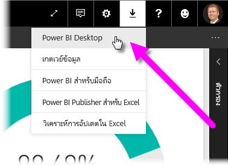
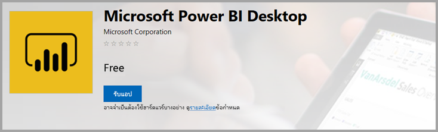
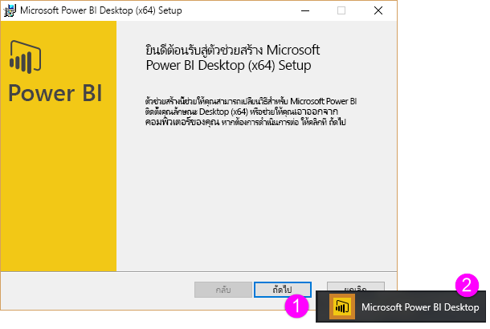
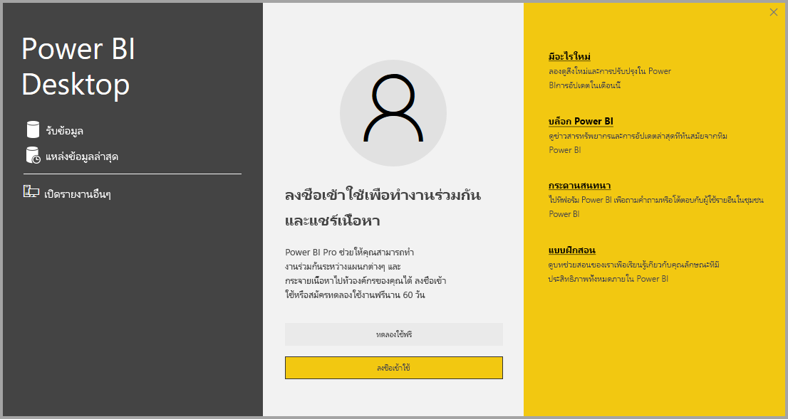

# <a name="get-power-bi-desktop"></a>รับ Power BI Desktop
Power BI Desktop ช่วยให้คุณสร้างแบบสอบถามขั้นสูง โมเดล และรายงานที่แสดงข้อมูลเป็นภาพ เมื่อใช้ Power BI Desktop คุณสามารถสร้างโมเดลข้อมูล สร้างรายงาน และแชร์งานของคุณโดยการเผยแพร่ไปยังบริการของ Power BI ได้ Power BI Desktop มีให้ดาวน์โหลดฟรี

คุณสามารถรับ Power BI Desktop ได้สองวิธี ซึ่งจะอธิบายไว้ในส่วนต่อไป:

* [ติดตั้งเป็นแอปจาก Microsoft Store](#install-as-an-app-from-the-microsoft-store)
* [ดาวน์โหลดโดยตรง เป็นการปฏิบัติการที่คุณดาวน์โหลด และติดตั้งบนคอมพิวเตอร์ของคุณ](#download-power-bi-desktop-directly)

ไม่ว่าจะติดตั้งวิธีใด จะได้รับ Power BI Desktop เวอร์ชันล่าสุดในคอมพิวเตอร์ของคุณ แต่มีความแตกต่างบางอย่างที่ควรทราบ ซึ่งจะอธิบายในส่วนต่อไปนี้

## <a name="install-as-an-app-from-the-microsoft-store"></a>ติดตั้งเป็นแอปจาก Microsoft Store
มีสองสามวิธีในการเข้าถึง Power BI Desktop เวอร์ชันล่าสุดจาก Microsoft Store 

1. ใช้หนึ่งในตัวเลือกต่อไปนี้เพื่อเปิดหน้า **Power BI Desktop** ของ Microsoft Store:

   - เปิดเบราวเซอร์แล้วไปยังหน้า [Power BI Desktop](https://aka.ms/pbidesktopstore) ของ Microsoft Store โดยตรง

    - จาก[บริการของ Power BI ](https://docs.microsoft.com/power-bi/service-get-started)ให้เลือกไอคอน **ดาวน์โหลด** จากมุมบนขวาแล้วเลือก **Power BI Desktop**.

      

   - ไปที่ [่หน้าผลิตภัณฑ์ Power BI Desktop](https://powerbi.microsoft.com/desktop/) จากนั้นเลือก **ดาวน์โหลดฟรี**
  
2. หลังจากที่คุณไปถึงหน้า **Power BI Desktop** ของ Microsoft Store แล้ว ให้เลือก **ติดตั้ง**

     

มีข้อดีบางประการในการรับ Power BI Desktop จาก Microsoft Store:

* **การอัปเดตอัตโนมัติ**: Windows จะดาวน์โหลดเวอร์ชันล่าสุดในพื้นหลังโดยอัตโนมัติทันทีที่มี ดังนั้นเวอร์ชันของคุณจะเป็นเวอร์ชันล่าสุดเสมอ
* **การดาวน์โหลดขนาดเล็กกว่า**: Microsoft Store ช่วยให้มั่นใจว่า เฉพาะคอมโพเนนต์ที่มีการเปลี่ยนแปลงในการอัปเดตแต่ละครั้ง จะถูกดาวน์โหลดลงเครื่องของคุณ ดาวน์โหลดจึงมีขนาดเล็กกว่าสำหรับแต่ละอัปเดต
* **ไม่จำเป็นต้องมีสิทธิ์ของผู้ดูแลระบบ**: เมื่อคุณดาวน์โหลดแพคเกจโดยตรงและติดตั้ง คุณต้องเป็นผู้ดูแลระบบเพื่อให้การติดตั้งสำเร็จ เมื่อคุณรับ Power BI Desktop จาก Microsoft Store *ไม่จำเป็นต้องมีสิทธิ์*ของผู้ดูแลระบบ
* **การเปิดใช้งานการเผยแพร่ IT**: เมื่อใช้งาน Microsoft Store สำหรับธุรกิจ คุณสามารถปรับใช้งานได้อย่างง่ายดายมากขึ้นหรือ *เผยแพร่* Power BI Desktop ให้กับทุกคนในองค์กรของคุณ

* **การตรวจจับภาษา**: เวอร์ชัน Microsoft Store มีภาษาที่รองรับทั้งหมดและตรวจสอบภาษาที่ใช้ในคอมพิวเตอร์ของคุณในแต่ละครั้งที่มีการเปิดตัว การสนับสนุนภาษานี้ยังส่งผลต่อการแปลแบบจำลองที่สร้างขึ้นใน Power BI Desktop ตัวอย่างเช่น ลำดับขั้นวันที่ที่มีอยู่ภายในตรงกับภาษาที่ Power BI Desktop กำลังใช้งานเมื่อมีการสร้างไฟล์ .pbix

การพิจารณาและข้อจำกัดต่อไปนี้จะนำไปใช้เมื่อคุณติดตั้ง Power BI Desktop จาก Microsoft Store:

* ถ้าคุณใช้ตัวเชื่อมต่อ SAP คุณอาจต้องย้ายไฟล์โปรแกรมควบคุม SAP ของคุณไปยังโฟลเดอร์ *Windows\System32*
* การติดตั้ง Power BI Desktop จาก Microsoft Store ไม่คัดลอกการตั้งค่าผู้ใช้จากเวอร์ชัน .exe คุณอาจต้องเชื่อมต่อใหม่กับแหล่งข้อมูลที่คุณเชื่อมต่อเมื่อเร็ว ๆ นี้ และใส่ข้อมูลประจำตัวของแหล่งข้อมูลของคุณอีกครั้ง 

> [!NOTE]
> Power BI Desktop รุ่นเซิร์ฟเวอร์รายงาน Power BI เป็นเวอร์ชันที่ติดตั้งแยกต่างหากและแตกต่างจากเวอร์ชันที่อธิบายในบทความนี้ สำหรับข้อมูลเกี่ยวกับ Power BI Desktop เวอร์ชันเซิร์ฟเวอร์รายงาน ดูบทความ [สร้างรายงาน Power BI สำหรับเซิร์ฟเวอร์รายงาน Power BI](report-server/quickstart-create-powerbi-report.md)
> 
> 

## <a name="download-power-bi-desktop-directly"></a>ดาวน์โหลด Power BI Desktop โดยตรง
  
  การดาวน์โหลด Power BI Desktop สามารถทำได้จาก ศูนย์ดาวน์โหลด เลือก **ดาวน์โหลด** จากหน้า [ศูนย์ดาวน์โหลด](https://www.microsoft.com/download/details.aspx?id=58494) จากนั้นระบุไฟล์การติดตั้งเพื่อดาวน์โหลด 32 บิต หรือ 64 บิต

  

### <a name="install-power-bi-desktop-after-downloading-it"></a>ติดตั้ง Power BI Desktop หลังจากดาวน์โหลดแล้ว
คุณจะได้รับพร้อมท์ให้เรียกใช้ไฟล์การติดตั้งหลังจากที่คุณดาวน์โหลดเสร็จแล้ว

เริ่มต้นด้วยการวางจำหน่ายในเดือนกรกฎาคม 2019 Power BI Desktop มาพร้อมกับแพคเกจการติดตั้ง .exe เดียวที่มีภาษาที่รองรับทั้งหมด พร้อมกับไฟล์ .exe แยกต่างหากสำหรับเวอร์ชัน 32 บิต และ 64 บิต แพคเกจ .msi นั้นถูกยกเลิกไป โดยเริ่มต้นด้วยการวางจำหน่ายในเดือนกันยายน 2019 ซึ่งจำเป็นต้องใช้ .exe สำหรับการติดตั้ง วิธีนี้จะทำให้การแจกจ่าย การอัปเดต และการติดตั้ง (โดยเฉพาะสำหรับผู้ดูแลระบบ) ง่ายและสะดวกยิ่งขึ้น นอกจากนี้ คุณยังสามารถใช้พารามิเตอร์บรรทัดคำสั่งเพื่อกำหนดกระบวนการติดตั้งเองดังที่อธิบายไว้ใน [ตัวเลือกการใช้บรรทัดคำสั่งระหว่างการติดตั้ง](#using-command-line-options-during-installation)

หลังจากที่คุณเปิดใช้งานแพคเกจการติดตั้ง Power BI Desktop จะติดตั้งเป็นแอปพลิเคชันและทำงานบนเดสก์ท็อปของคุณ



> [!NOTE]
> ไม่รองรับการติดตั้งเวอร์ชันดาวน์โหลด (MSI) (ไม่รองรับ) และเวอร์ชัน Microsoft Store ของ Power BI Desktop บนคอมพิวเตอร์เครื่องเดียวกัน (ในบางครั้งเรียกว่าการติดตั้ง *ข้างกัน*) ถอนการติดตั้ง Power BI Desktop ด้วยตนเองก่อนที่คุณจะดาวน์โหลดจาก Microsoft Store
> 

## <a name="using-power-bi-desktop"></a>การใช้ Power BI Desktop
เมื่อคุณเรียกใช้ Power BI Desktop หน้าจอยินดีต้อนรับจะแสดงขึ้นมา



ถ้าคุณกำลังใช้ Power BI Desktop เป็นครั้งแรก (ซึ่งหมายถึงการติดตั้งไม่ใช่การอัปเกรด) คุณจะได้รับพร้อมท์ให้กรอกแบบฟอร์มหรือลงชื่อเข้าใช้ในบริการของ Power BI ก่อนที่คุณจะสามารถดำเนินการต่อได้

จากนั้น คุณสามารถสร้างรูปแบบข้อมูล หรือรายงาน แล้วแชร์ให้กับผู้อื่นบนบริการของ Power BI ดูส่วน [ขั้นตอนถัดไป](#next-steps) เพื่อลิงก์ไปยังคำแนะนำเพื่อช่วยให้คุณเริ่มต้นใช้ Power BI Desktop

## <a name="minimum-requirements"></a>ข้อกำหนดขั้นต่ำ
รายการต่อไปนี้คือข้อกำหนดขั้นต่ำเพื่อเรียกใช้ Power BI Desktop:

* Windows 7 / Windows Server 2008 R2 หรือใหม่กว่า
* .NET 4.5
* Internet Explorer 10 หรือใหม่กว่า
* หน่วยความจำ (RAM): มีหน่วยความจำว่างอย่างน้อย 1 GB, แนะนำ 1.5 GB หรือมากกว่า
* การแสดงผล: อย่างน้อย 1440 x 900, แนะนำ 1600 x 900 (16:9) ไม่แนะนำให้ใช้ความละเอียดต่ำกว่า เช่น 1024 x 768 หรือ 1280 x 800 เพราะตัวควบคุมบางอย่าง (เช่น การปิดหน้าจอเริ่มต้น) จะแสดงเกินความละเอียดเหล่านี้
* การตั้งค่าการแสดงผลของ Windows: ถ้าคุณตั้งค่าการแสดงผลของคุณเพื่อเปลี่ยนขนาดของข้อความ แอป และรายการอื่น ๆ ให้มีค่ามากกว่า 100% คุณอาจไม่สามารถเห็นกล่องโต้ตอบบางอย่างที่คุณต้องโต้ตอบด้วยเพื่อใช้งาน Power BI Desktop ต่อไป ถ้าคุณพบปัญหานี้ ตรวจสอบการตั้งค่าการแสดงผลของคุณใน Windows โดยไปที่ **การตั้งค่า**  >  **ระบบ**  >  **การแสดงผล** และใช้แถบเลื่อนเพื่อกลับไปตั้งค่าการแสดงผลเป็น 100%
* CPU: แนะนำตัวประมวลผล 32 บิต หรือ 64 บิต x86 ขนาด 1 กิกะเฮิร์ตซ์ (GHz) หรือเร็วกว่า

## <a name="considerations-and-limitations"></a>ข้อควรพิจารณาและข้อจำกัด

เราต้องการให้ประสบการณ์การใช้งาน Power BI Desktop ของคุณดีเยี่ยม เนื่องจากอาจมีโอกาสที่คุณจะประสบปัญหากับ Power BI Desktop ในส่วนนี้จะประกอบด้วยวิธีแก้ไขปัญหาหรือคำแนะนำในการจัดการปัญหาเหล่านี้ 

### <a name="using-command-line-options-during-installation"></a>การใช้ตัวเลือกบรรทัดคำสั่งระหว่างการติดตั้ง 

เมื่อคุณติดตั้ง Power BI Desktop คุณสามารถตั้งค่าคุณสมบัติและตัวเลือกด้วยการสลับบรรทัดคำสั่งได้ การตั้งค่าเหล่านี้จะเป็นประโยชน์โดยเฉพาะอย่างยิ่งสำหรับผู้ดูแลระบบที่จัดการหรืออำนวยความสะดวกในการติดตั้ง Power BI Desktop ในองค์กร ตัวเลือกเหล่านี้นำไปใช้กับการติดตั้ง .msi และ .exe 


|ตัวเลือกบรรทัดคำสั่ง  |พฤติกรรม  |
|---------|---------|
|-q, -quiet, -s, -silent     |ติดตั้ง Silent         |
|-passive     |แสดงแถบความคืบหน้าเฉพาะในระหว่างการติดตั้ง         |
|-norestart     |ไม่แสดงข้อกำหนดการรีสตาร์ทคอมพิวเตอร์         |
|-forcerestart     |รีสตาร์ทคอมพิวเตอร์หลังจากการติดตั้งโดยไม่มีพร้อมท์         |
|-promptrestart     |แจ้งให้ผู้ใช้ทราบหากจำเป็นต้องรีสตาร์ทคอมพิวเตอร์ (ค่าเริ่มต้น)         |
|-l<>, -log<>     |บันทึกการติดตั้งไปยังไฟล์ที่เฉพาะเจาะจง ด้วยไฟล์ที่ระบุใน < >         |
|-uninstall     |ถอนการติดตั้ง Power BI Desktop         |
|-repair     |ซ่อมแซมการติดตั้ง (หรือติดตั้งถ้าไม่ได้ติดตั้งอยู่ในขณะนี้)         |
|-package, -update     |ติดตั้ง Power BI Desktop (ค่าเริ่มต้น ตราบใดที่ไม่ได้ระบุ -uninstall หรือ -repair)         |

นอกจากนี้ คุณยังสามารถใช้พารามิเตอร์ไวยากรณต์ต่อไปนี้ ซึ่งระบุด้วยไวยกรณ์ *คุณสมบัติ = ค่า*:

|พารามิเตอร์  |ความหมาย  |
|---------|---------|
|ACCEPT_EULA     |ต้องมีค่า 1 เพื่อยอมรับ EULA โดยอัตโนมัติ         |
|ENABLECXP     |ค่า 1 ที่ลงทะเบียนในโปรแกรมประสบการณ์ของลูกค้าที่บันทึกการวัดและส่งข้อมูลทางไกลเกี่ยวกับการใช้งานผลิตภัณฑ์         |
|INSTALLDESKTOPSHORTCUT     |ค่าของ 1 เพิ่มทางลัดไปยังเดสก์ท็อป         |
|INSTALLLOCATION     |พาธของไฟล์ไปยังตำแหน่งที่คุณต้องการติดตั้ง         |
|LANGUAGE     |รหัสตำแหน่งที่ตั้ง (ตัวอย่างเช่น en-US, de-DE, pr-BR) เพื่อใช้ภาษาตามการตั้งค่าเริ่มต้นของแอปพลิเคชัน หากคุณไม่ได้ระบุภาษา ทาง Power BI Desktop จะแสดงภาษาของ Windows OS คุณสามารถเปลี่ยนการตั้งค่านี้ได้ในกล่องโต้ตอบ **ตัวเลือก**         |
|REG_SHOWLEADGENDIALOG     |ค่า 0 ปิดใช้งานการแสดงกล่องโต้ตอบที่ปรากฏขึ้นมา ก่อนที่คุณจะลงชื่อเข้าใช้ Power BI Desktop         |
|DISABLE_UPDATE_NOTIFICATION     |ค่า 1 ปิดใช้งานการแจ้งเตือนการอัปเดต         |


ตัวอย่างเช่น คุณสามารถใช้งาน Power BI Desktop ด้วยตัวเลือกและพารามิเตอร์ต่อไปนี้เพื่อติดตั้งโดยไม่ต้องมีอินเทอร์เฟซผู้ใช้ โดยใช้ภาษาเยอรมัน: 

```-quiet LANG=de-DE ACCEPT_EULA=1```

### <a name="installing-power-bi-desktop-on-remote-machines"></a>การติดตั้ง Power BI Desktop บนเครื่องระยะไกล

หากคุณแนะนำให้ผู้ใช้ของคุณใช้งาน Power BI Desktop ด้วยเครื่องมือที่จำเป็นต้องใช้ไฟล์ตัวติดตั้ง Windows (ไฟล์ .msi) คุณสามารถแยกไฟล์ .msi จากไฟล์ .exe ของตัวติดตั้ง Power BI Desktop ได้ ใช้เครื่องมือของบริษัทอื่น เช่น WiX Toolset

> [!NOTE]
> ในฐานะที่เป็นผลิตภัณฑ์ของบุคคลที่สาม ตัวเลือก WiX Toolset อาจมีการเปลี่ยนแปลงได้โดยไม่ต้องแจ้งให้ทราบล่วงหน้า โปรดตรวจสอบว่าเอกสารประกอบนั้นมีข้อมูลที่เป็นปัจจุบันที่สุด และติดต่อพวกเขาตามที่อยู่ทางไปรษณีย์เพื่อขอความช่วยเหลือ

1. บนคอมพิวเตอร์ที่คุณดาวน์โหลดตัวติดตั้ง Power BI Desktop ให้ติดตั้งเวอร์ชันล่าสุดของ [WiX Toolset](https://wixtoolset.org/)
2. เปิดหน้าต่างบรรทัดคำสั่งในฐานะเป็นผู้ดูแลระบบ และนำทางไปยังโฟลเดอร์ที่คุณติดตั้ง WiX Toolset
3. เรียกใช้คำสั่งต่อไปนี้ 
    
    ```Dark.exe <path to Power BI Desktop installer> -x <output folder>```

    ตัวอย่างเช่น:

    ``` Dark.exe C:\PBIDesktop_x64.exe -x C:\output```

    โฟลเดอร์ผลลัพธ์จะมีโฟลเดอร์ที่ชื่อว่า*AttachedContainer* ที่มีไฟล์ .msi อยู่

การอัปเกรดการติดตั้งจาก .exe เป็น .msi ที่คุณได้แยกออกจาก .exe ไม่ได้รับการรองรับ   เพื่อที่จะทำการอัปเกรดนี้ก่อนอื่นคุณจะต้องถอนการติดตั้ง Power BI Desktop เวอร์ชันเก่าที่คุณมี

### <a name="issues-when-using-previous-releases-of-power-bi-desktop"></a>ปัญหาจากรุ่นก่อนหน้าของ Power BI Desktop

ผู้ใช้บางคนอาจพบข้อความผิดพลาดคล้ายกับข้อความต่อไปนี้ เมื่อใช้งาน Power BI Desktop เวอร์ชันที่ล้าสมัย: 

*เราไม่สามารถคืนค่าฐานข้อมูลที่บันทึกไว้เข้าในโมเดล* 

อัปเดตเป็น Power BI Desktop รุ่นปัจจุบัน มักจะแก้ไขปัญหานี้ได้

### <a name="disabling-notifications"></a>การปิดการแจ้งให้ทราบ
เราขอแนะนำให้อัปเดตเป็นเวอร์ชันล่าสุดของ Power BI Desktop เพื่อประโยชน์จากความก้าวหน้าในคุณลักษณะ, ประสิทธิภาพ, เสถียรภาพ และการปรับปรุงอื่น ๆ บางองค์กรอาจไม่ต้องการให้ผู้ใช้อัปเดตเป็นเวอร์ชันใหม่ คุณสามารถปิดการแจ้งเตือนได้โดยการปรับเปลี่ยนรีจิสทรี ด้วยขั้นตอนต่อไปนี้:

1. การใช้ตัวแก้ไขรีจิสทรี จะนำทางไปที่คีย์ **HKEY_LOCAL_MACHINE\SOFTWARE\Microsoft\Microsoft Power BI Desktop**
2. สร้างรายการ **REG_DWORD** ใหม่ในคีย์ด้วยชื่อต่อไปนี้: **DisableUpdateNotification**
3. ตั้งค่าของรายการใหม่นั้นเป็น **1**
4. รีสตาร์ตคอมพิวเตอร์ของคุณเพื่อให้การเปลี่ยนแปลงมีผลบังคับใช้

### <a name="power-bi-desktop-loads-with-a-partial-screen"></a>Power BI Desktop โหลดด้วยหน้าจอบางส่วน

ในบางกรณี รวมถึงบางการกำหนดค่าความละเอียดหน้าจอ ผู้ใช้บางรายอาจเห็น Power BI Desktop แสดงเนื้อหาด้วยพื้นที่สีดำขนาดใหญ่ ปัญหานี้คือผลลัพธ์โดยทั่วไปของการอัปเดตระบบปฏิบัติการล่าสุดที่มีผลต่อการแสดงรายการมากกว่าเป็นผลลัพธ์โดยตรงของการแสดงเนื้อหาของ Power BI Desktop ทำตามขั้นตอนเหล่านี้เพื่อแก้ปัญหานี้:

1. กดแป้น **Start** และพิมพ์คำว่า *blurry* ลงในแถบค้นหาที่ปรากฏ
2. ในกล่องโต้ตอบที่ปรากฏขึ้น เลือกตัวเลือก: **อนุญาตให้ Windows แก้ไขแอปที่ไม่ชัดเจน**
3. รีสตาร์ต Power BI Desktop

ปัญหานี้อาจหมดไปหลังจากมีการเผยแพร่อัปเดตของ Windows รุ่นถัดมา 
 

## <a name="next-steps"></a>ขั้นตอนถัดไป
หลังจากที่คุณได้ติดตั้ง Power BI Desktop แล้ว เนื้อหาต่อไปนี้สามารถช่วยให้คุณเริ่มต้น และใช้งานอย่างรวดเร็ว:

* [Power BI Desktop คืออะไร](desktop-what-is-desktop.md)
* [ภาพรวมคิวรีใน Power BI Desktop](desktop-query-overview.md)
* [แหล่งข้อมูลใน Power BI Desktop](desktop-data-sources.md)
* [เชื่อมต่อกับข้อมูลใน Power BI Desktop](desktop-connect-to-data.md)
* [จัดรูปร่างและรวมข้อมูลใน Power BI Desktop](desktop-shape-and-combine-data.md)
* [งานแบบสอบถามทั่วไปใน Power BI Desktop](desktop-common-query-tasks.md)   

