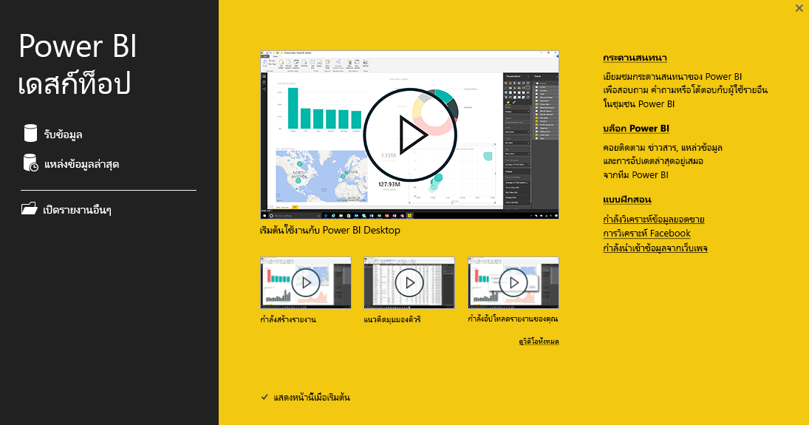
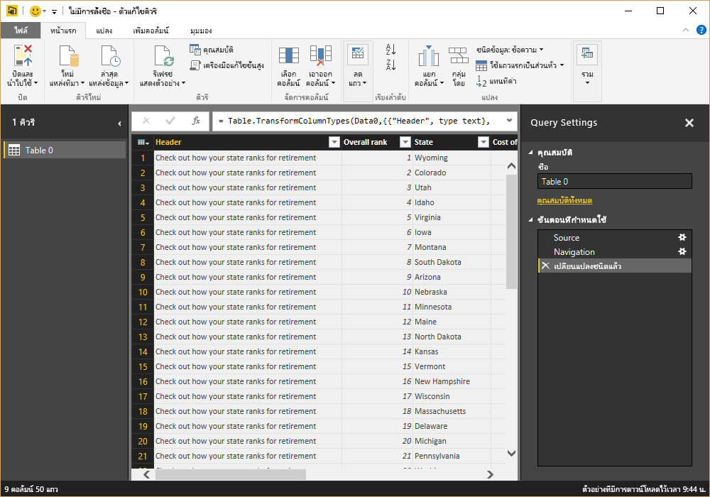
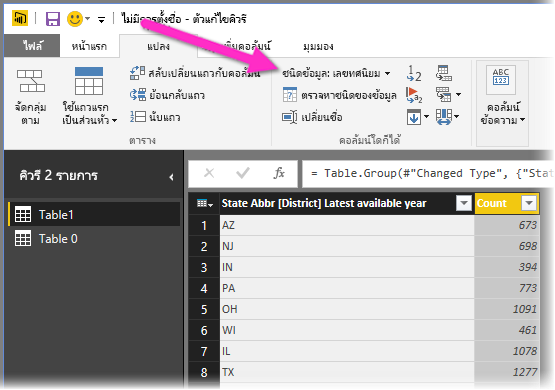

# เริ่มต้นใช้งานกับ Power BI Desktop
ยินดีต้อนรับสู่ตัว**แนวทางการเริ่มใช้งาน Power BI Desktop** การทัวร์สั้น ๆ สำหรับ Power BI Desktop นี้ช่วยให้คุณคุ้นเคยกับวิธีการที่ Power BI Desktop ทำงาน สาธิตสิ่งที่ Power BI Desktop สามารถทำได้ และเร่งความสามารถของคุณในการสร้างแบบจำลองข้อมูลอย่างมีประสิทธิภาพ พร้อมกับรายงานที่น่าทึ่ง ที่ช่วยในการทำงานด้านข่าวกรองทางธุรกิจของคุณ 

ต้องการดูการสาธิตแทนการอ่าน? อย่าลังเลที่จะ[ดูวิดีโอการเริ่มต้นใช้งาน](desktop-videos.md) และถ้าคุณต้องการติดตามพร้อมดูวิดีโอที่มีข้อมูลตัวอย่างที่ตรงกัน คุณสามารถ[ดาวน์โหลดตัวอย่างสมุดงาน Excel นี้](https://go.microsoft.com/fwlink/?LinkID=521962)ได้

Power BI Desktop ช่วยให้คุณสามารถสร้างคอลเลกชันของการสอบถาม การเชื่อมต่อข้อมูล และรายงานที่สามารถใช้ร่วแชร์กับผู้อื่นได้อย่างง่ายดาย Power BI Desktop ได้รวมเทคโนโลยีของ Microsoft ที่ได้รับการรับรอง เครื่องมือการสอบถาม การสร้างแบบจำลองข้อมูล และการสร้างภาพที่มีสิทธิภาพ รวมถึงทำงานได้อย่างราบรื่นกับ[ **บริการ Power BI**](https://app.powerbi.com/) ออนไลน์

ด้วยการผสมผสาน**Power BI Desktop** (ซึ่งนักวิเคราะห์และบุคคลทั่วไปสามารถสร้างใช้การเชื่อมต่อข้อมูล แบบจำลอง และรายงานอย่างมีประสิทธิภาพ) เข้ากับ[ **บริการ Power BI** ](https://preview.powerbi.com/) (ซึ่งรายงาน Power BI Desktop สามารถแชร์กับผู้อื่นได้เพื่อให้ผู้ใช้สามารถดูและโต้ตอบกับรายงานเหล่านั้นได้) ข้อมูลเชิงลึกใหม่จากโลกของข้อมูลช่วยให้ทำแบบจำลองข้อมูล สร้าง แชร์ และขยายได้ง่ายยิ่งขึ้น

นักวิเคราะห์ข้อมูลจะพบว่า Power BI Desktop เป็นเครื่องมือที่ทรงพลัง มีความยืดหยุ่น และสามารถเข้าถึงได้สูงเพื่อเชื่อมต่อและจัดรูปร่างโลกแห่งข้อมูล สร้างแบบจำลองที่มีประสิทธิภาพและออกแบบรายงานที่มีโครงสร้างสมบูรณ์แบบ

## วิธีการใช้แนวทางนี้
คุณสามารถใช้คำแนะนำนี้ได้ในสองสามวิธี – สแกนเพื่อดูภาพรวมอย่างรวดเร็ว หรืออ่านในแต่ละหัวข้อเพื่อทำความเข้าใจอย่างถ่องแท้ถึงวิธีการทำงานของ Power BI Desktop

หากคุณกำลังรีบเร่ง คุณสามารถดูภาพของแนวทางนี้อย่างรวดเร็วได้ในเวลาเพียงสองสามนาที และคุณจะเข้าใจมากขึ้นเกี่ยวกับวิธีการทำงานของ Power BI Desktop และวิธีการใช้งาน ส่วนใหญ่ของแนวทางนี้ประกอบด้วยหน้าจอที่แสดงรูปภาพวิธีการทำงานของ Power BI Desktop

เพื่อให้เข้าใจอย่างถ่องแท้มากขึ้น คุณสามารถอ่านแต่ละส่วนโดยละเอียดและดำเนินการขั้นตอนได้ นั่นจะทำให้คุณได้ไฟล์ Power BI Desktop ของคุณเองที่พร้อมสำหรับการโพสต์ไปยังบริการ**Power BI** และแชร์กับผู้อื่นได้

>[!NOTE]
>นอกจากนี้ยังมีเวอร์ชันที่แยกต่างหากและได้รับการออกแบบมาพิเศษของ**Power BI** ที่เรียกว่า[ **เซิร์ฟเวอร์รายงาน Power BI**](report-server/get-started.md)ซึ่งมีไว้สำหรับลูกค้าที่ต้องการข้อมูลและรายงานของตนยังคงอยู่ภายในองค์กร สำหรับการใช้กับเวอร์ชันพิเศษดังกล่าวนั้น ยังมีเวอร์ชันที่แยกต่างหากและได้รับการออกแบบมาโดยเฉพาะของ**Power BI Desktop** ที่เรียกว่า**Power BI Desktop สำหรับเซิร์ฟเวอร์รายงาน Power BI**ซึ่งทำงานกับเวอร์ชันเซิร์ฟเวอร์รายงานของ Power BI เท่านั้น บทความนี้อธิบายมาตรฐาน**Power BI Desktop**

## วิธีการทำงานของ Power BI Desktop
ด้วย Power BI Desktop คุณ*เชื่อมต่อกับข้อมูล* (โดยปกติแล้วหลายแหล่งข้อมูล) *จัดรูปร่างข้อมูลนั้น* (ด้วยการสอบถามที่สร้างแบบจำลองข้อมูลในเชิงลึกและดึงดูดความสนใจ) และใช้รูปแบบนั้นเพื่อ*สร้าง รายงาน*(ซึ่งผู้อื่นสามารถใช้ประโยชน์ สร้าง และแชร์ได้)

เมื่อขั้นตอนเสร็จสมบูรณ์จนเป็นที่พึงพอใจแล้ว เชื่อมต่อ จัดรูปร่าง รายงาน – คุณสามารถบันทึกงานดังกล่าวได้ในรูปแบบไฟล์ Power BI Desktop ซึ่งมีนามสกุล .pbix ไฟล์ Power BI Desktop สามารถแชร์ได้เหมือนกับไฟล์อื่น ๆ แต่วิธีที่น่าสนใจที่สุดในการแชร์ไฟล์ Power BI Desktop คือการอัปโหลดไฟล์เหล่านั้น (แชร์ไฟล์ดังกล่าว) บน[ **บริการ Power BI**](https://preview.powerbi.com/) 

Power BI Desktop สร้างความเป็นศูนย์กลาง ลดความซับซ้อน และสร้างความราบรื่นในการใช้งานสิ่งที่อาจอยู่กระจัดกระจาย ไม่เชื่อมโยงกัน และกระบวนที่ยากลำบากในการออกแบบและสร้างเรื่องราวและรายงานข่าวกรองทางธุรกิจ

พร้อมที่จะลองทำหรือยัง? มาเริ่มกันเลย!

## ติดตั้งและเปิดใช้งาน Power BI Desktop
คุณสามารถดาวน์โหลด Power BI Desktop จากบริการ**Power BI** โดยการเลือกไอคอน**เฟือง** แล้วเลือก**Power BI Desktop**ได้

Power BI Desktop จะติดตั้งแอปพลิเคชันหนึ่งและทำงานบนเดสก์ท็อปของคุณ

เมื่อคุณเรียกใช้ Power BI Desktop หน้าจอ*ยินดีต้อนรับ*จะแสดงขึ้นมา

คุณสามารถ**รับข้อมูล** ดู**แหล่งข้อมูลล่าสุด** หรือ**เปิด** **รายงานอื่น ๆ**ได้โดยตรงจากหน้าจอ*ยินดีต้อนรับ* (จากลิงก์ในพื้นที่ด้านซ้าย) หากคุณปิดหน้าจอ (เลือก**x**ในมุมบนขวา) มุมมอง**รายงาน**ของ Power BI Desktop จะแสดงขึ้นมา

มีสามมุมมองใน Power BI Desktop: **รายงาน**มุมมอง**ข้อมูล**มุมมอง และ**ความสัมพันธ์**มุมมอง นอกจากนี้ Power BI Desktop ยังมี **ตัวแก้ไขการสอบถาม** ซึ่งเปิดขึ้นในหน้าต่างแยกต่างหาก ใน **ตัวแก้ไขการสอบถาม** คุณสามารถสร้างการสอบถามและแปลงข้อมูลได้ จากนั้นโหลดแบบจำลองข้อมูลที่ปรับแต่งแล้วนั้นลงใน Power BI Desktop และสร้างรายงาน

หน้าจอต่อไปนี้แสดงสามไอคอนมุมมองทางด้านซ้ายของ Power BI Desktop: **รายงาน** **ข้อมูล** และ **ความสัมพันธ์**จากบนลงล่าง มุมมองที่แสดงอยู่ในปัจจุบันมีการระบุโดยแถบสีเหลืองทางด้านซ้าย ในกรณีนี้มุมมอง**รายงาน**จะแสดงอยู่ในปัจจุบัน คุณสามารถเปลี่ยนมุมมองได้โดยการเลือกไอคอนใดไอคอนหนึ่งจากสามไอคอนนั้น

เมื่อคุณติดตั้ง Power BI Desktop แล้ว คุณก็พร้อมที่จะเชื่อมต่อกับข้อมูล จัดรูปร่างข้อมูล และสร้างรายงานต่าง ๆ ได้ (ซึ่งโดยปกติแล้วอยู่ในลำดับนี้) ในไม่กี่หัวข้อถัดไปเราจะสำรวจแต่ละรายการกัน

## เชื่อมต่อกับข้อมูล
เมื่อคุณติดตั้ง Power BI Desktop แล้ว คุณก็พร้อมที่จะเชื่อมต่อกับโลกแห่งข้อมูลที่ขยายขึ้นเรื่อย ๆ ใน Query จะมีแหล่งข้อมูลต่าง ๆ *ทุกประเภท*ที่พร้อมใช้งาน รูปต่อไปนี้แสดงวิธีการเชื่อมต่อกับข้อมูลโดยการเลือก Ribbon **หน้าแรก** จากนั้น**รับข้อมูล\>เพิ่มเติม**

 

สำหรับการแนะนำด่วนนี้ เราจะเชื่อมต่อกับสองสามแหล่งข้อมูลบน**เว็บ**

สมมติว่าคุณกำลังเกษียณ – คุณต้องการอยู่อาศัยในพื้นที่ที่มีแสงแดดตลอดปี เก็บภาษีไม่แพง และมีระบบดูแลสุขภาพที่ดี หรือบางทีคุณอาจเป็นนักวิเคราะห์ข้อมูล และคุณต้องการใช้ข้อมูลดังกล่าวเพื่อช่วยลูกค้าของคุณ ตัวอย่างเช่น คุณอาจต้องการช่วยเหลือร้านค้าปลีกที่ขายแว่นกันแดดในการกำหนดเป้าหมายยอดขายในพื้นที่ที่มีีแดดแรงบ่อยครั้ง

ไม่ว่าด้วยวิธีใด แหล่งข้อมูลบนเว็บดังต่อไปนี้มีข้อมูลที่น่าสนใจเกี่ยวกับหัวข้อเหล่านั้น และหัวข้ออื่น ๆ อีกมากมาย

[*https://www.bankrate.com/finance/retirement/best-places-retire-how-state-ranks.aspx*](https://www.bankrate.com/finance/retirement/best-places-retire-how-state-ranks.aspx)

คุณเลือก**รับข้อมูล \>เว็บ**และวางที่อยู่นั้น

 

เมื่อคุณเลือก**ตกลง** ฟังก์ชันการทำงานของ Power BI Desktop ของ **Query**จะทำงาน Query ติดต่อแหล่งข้อมูลเว็บ และหน้าต่าง**ตัวนำทาง**ส่งกลับผลลัพธ์ที่พบบนหน้าเว็บ ในกรณีนี้ ระบบพบตาราง (*ตาราง 0*) และเอกสารเว็บโดยรวม เราสนใจตาราง ดังนั้นเราเลือกตารางจากรายการ หน้าต่าง**ตัวนำทาง**จะแสดงตัวอย่าง

 

ในตอนนี้ เราสามารถแก้ไขการสอบถามก่อนทำการโหลดตาราง โดยการเลือก**แก้ไข**จากด้านล่างของหน้าต่าง หรือเราสามารถโหลดตารางได้

เมื่อเราเลือก**แก้ไข**ตัวแก้ไขการสอบถามเปิดใช้งาน และจะแสดงมุมมองที่เกี่ยวข้องของตาราง หน้าต่างการ**ตั้งค่า Query**จะแสดงขึ้น (ถ้าไม่แสดง คุณสามารถเลือก**มุมมอง**จาก Ribbon แล้ว**แสดง\>การตั้งค่า Query**เพื่อแสดง**หน้าต่าง**การตั้งค่า Query) ซึ่งจะมีลักษณะเช่นนี้

 

สำหรับข้อมูลเพิ่มเติมเกี่ยวกับการเชื่อมต่อกับข้อมูล ดู[เชื่อมต่อกับข้อมูลใน Power BI Desktop](desktop-connect-to-data.md)

> [!NOTE]
> ข้อมูลตารางที่อ้างอิงถึงในบทความนี้อาจเปลี่ยนแปลงได้เมื่อเวลาผ่านไป ดังนั้นขั้นตอนที่คุณต้องทำตามอาจแตกต่างจากรายการต่อไปนี้ ซึ่งจำเป็นต้องใช้ความคิดสร้างสรรค์เกี่ยวกับวิธีการปรับขั้นตอนหรือผลลัพธ์ ซึ่งเป็นส่วนหนึ่งของความสนุกในการเรียนรู้ 

ในส่วนถัดไป เราปรับข้อมูลเพื่อให้เป็นไปตามความต้องการของเรา ขั้นตอนการปรับปรุงที่เชื่อมต่อข้อมูลจะเรียกว่า*การจัดรูปร่าง*

## จัดรูปร่างและรวมข้อมูล
หลังจากที่เราเชื่อมต่อกับแหล่งข้อมูลแล้ว เราจำเป็นต้องปรับปรุงข้อมูลตามความต้องการของเรา บางครั้งการจัดรูปร่างข้อมูลหมายถึง การ*แปลง*ข้อมูล เช่น การเปลี่ยนชื่อคอลัมน์หรือตาราง การเปลี่ยนแปลงข้อความเป็นตัวเลข ลบแถว การตั้งค่าแถวแรกเป็นหัวเรื่อง และอื่น ๆ

ตัวแก้ไขการสอบถามใน Power BI Desktop สามารถใช้งานได้ด้วยเมนูคลิกขวา นอกเหนือจากมีงานที่พร้อมใช้งานบน Ribbon สิ่งที่คุณสามารถเลือกได้ส่วนใหญ่ใน Ribbon **การแปลง**สามารถใช้งานได้โดยการคลิกขวาบนรายการ (เช่น คอลัมน์) แล้วเลือกเมนูที่ปรากฏขึ้น

## จัดรูปร่างข้อมูล
เมื่อคุณจัดรูปแบบข้อมูลใน**ตัวแก้ไขการสอบถาม**คุณกำลังนำเสนอคำแนะนำทีละขั้นตอน (ที่**ตัวแก้ไขการสอบถาม**ดำเนินการให้คุณ) เพื่อปรับเปลี่ยนข้อมูลเป็นการโหลด**ตัวแก้ไขการสอบถาม**และนำขึ้นแสดง แหล่งข้อมูลต้นฉบับจะไม่ได้รับผลกระทบ ระบบจะปรับปรุงเฉพาะมุมมองของข้อมูลที่ถูกปรับเปลี่ยนหรือ*ได้รับการจัดรูปร่าง*นี้เท่านั้น

ขั้นตอนที่คุณระบุ (เช่น การเปลี่ยนชื่อตาราง แปลงชนิดข้อมูล หรือลบคอลัมน์) จะถูกบันทึกโดย**ตัวแก้ไขการสอบถาม** และแต่ละครั้งที่การสอบถามนี้เชื่อมต่อกับแหล่งข้อมูล ขั้นตอนเหล่านั้นจะถูกดำเนินการเพื่อให้มีการจัดรูปแบบข้อมูลในแบบที่คุณระบุอยู่เสมอ กระบวนการนี้เกิดขึ้นเมื่อใดก็ตามที่คุณใช้การสอบถามใน Power BI Desktop หรือสำหรับใครก็ตามที่ใช้การสอบถามของคุณที่มีการแชร์ เช่น ในบริการ**Power BI** ขั้นตอนเหล่านั้นจะถูกบันทึกตามลำดับในช่อง**การตั้งค่าการสอบถาม** ใต้**ขั้นตอนที่ใช้**

รูปภาพต่อไปนี้แสดงช่อง**การตั้งค่าการสอบถาม** สำหรับการสอบถามที่ได้รับการปรับรูปร่าง เราจะดูขั้นตอนเหล่านั้นในรายละเอียดในสองสามย่อหน้าถัดไป

 

เรากลับไปยังข้อมูลเกษียณของเรากัน ซึ่งเราพบโดยการเชื่อมต่อกับแหล่งข้อมูลบนเว็บ จากนั้นจัดรูปแบบข้อมูลให้ตรงกับความต้องการของเรา

สำหรับผู้ที่เพิ่งเริ่มใช้งาน การจัดอันดับส่วนใหญ่ถูกนำไปใน**ตัวแก้ไขการสอบถาม**เป็นจำนวนเต็ม แต่ไม่ใช่ทั้งหมด (คอลัมน์หนึ่งประกอบด้วยข้อความและตัวเลข ดังนั้น จึงไม่ถูกแปลงโดยอัตโนมัติ) เราต้องการให้ข้อมูลเป็นตัวเลข ไม่มีปัญหา แค่เพียงคลิกขวาที่ส่วนหัวของคอลัมน์ และเลือก**เปลี่ยนชนิด\>จำนวนเต็ม**เพื่อทำการเปลี่ยนแปลงชนิดข้อมูล หากเราต้องเลือกมากกว่าหนึ่งคอลัมน์ ก่อนอื่นเราสามารถเลือกคอลัมน์ แล้วกดค้างที่ปุ่ม**SHIFT**เลือกคอลัมน์ที่อยู่ติดกันเพิ่มเติม และจากนั้น คลิกขวาที่ส่วนหัวของคอลัมน์เพื่อเปลี่ยนคอลัมน์ที่เลือกทั้งหมด นอกจากนี้ คุณยังสามารถใช้**CTRL**เพื่อเลือกคอลัมน์ที่ไม่อยู่ติดกันได้

 

และคุณยังสามารถเปลี่ยน หรือ*แปลง*คอลัมน์เหล่านั้นจากข้อความเป็นหัวข้อโดยใช้ Ribbon **แปลง** ได้ นี่คือ Ribbon **การแปลง** ที่มีลูกศรชี้ไปยังปุ่ม**ชนิดข้อมูล** ซึ่งช่วยให้คุณแปลงชนิดข้อมูลปัจจุบันให้เป็นชนิดอื่นได้

 

โปรดทราบว่า ใน**ตั้งค่าการสอบถาม** **ขั้นตอนที่นำไปใช้**จะแสดงการเปลี่ยนแปลงที่ดำเนินการ หากฉันต้องการเอาขั้นตอนใด ๆ ออกจากกระบวนการปรับรูปข้อมูล ฉันเพียงเลือกขั้นตอนนั้นและเลือก **X** ที่ทางด้านซ้ายของขั้นตอน

 

เราจำเป็นต้องทำการเปลี่ยนแปลงเพิ่มเติมบางอย่างเพืื่อให้ได้การสอบถามที่เราต้องการ:

* *ลบคอลัมน์แรก*ที่เราไม่ต้องการ ซึ่งมีเพียงแถวที่ซ้ำกันที่บอกว่า "ดูวิธีการที่รัฐของคุณจัดลำดับการเกษียณ" ซึ่งเป็นสิ่งปลอมของการเป็นตารางตามเว็บ

<!-- -->

* *แก้ไขบางข้อผิดพลาด* บนเว็บเพจ คอลัมน์หนึ่งมีข้อความผสมกับตัวเลข (หลายรัฐรวมอยู่ในหนึ่งหมวดหมู่) ซึ่งทำงานได้ดีบนเว็บไซต์ดังกล่าว แต่ไม่ใช่สำหรับการวิเคราะห์ข้อมูลของเรา เป็นเรื่องง่าย (ในกรณีนี้) ที่จะแก้ไขและแสดงคุณลักษณะและความสามารถที่ยอดเยี่ยมของ**ตัวแก้ไขการสอบถาม**และ**ขั้นตอนที่นำไปใช้**

<!-- -->

* *เปลี่ยนชื่อตาราง* ซึ่ง**ตาราง 0**ไม่ใช่ตัวอธิบายที่เป็นประโยชน์ แต่การเปลี่ยนนั้นทำได้ง่าย

แต่ละขั้นตอนเหล่านี้จะแสดงใน **[จัดรูปร่างและรวมข้อมูลใน Power BI Desktop](desktop-shape-and-combine-data.md)** คุณสามารถเข้าดูที่หน้านั้นได้ หรือไปต่อในเอกสารนี้เพื่อดูว่าขั้นต่อไปที่คุณจะทำคืออะไร ในส่วนถัดไปจะเป็นการพูดถึงสิ่งที่เกิดขึ้นหลังนำการเปลี่ยนแปลงด้านบนไปใช้

## รวมข้อมูล
ข้อมูลเกี่ยวกับรัฐต่าง ๆ นั้นน่าสนใจ และจะเป็นประโยชน์สำหรับการสร้างการวิเคราะห์และการสอบถามเพิ่มเติม แต่มีปัญหาหนึ่ง: ข้อมูลส่วนใหญ่นั้นใช้ตัวอักษรย่อสองตัวสำหรับรหัสรัฐ ไม่ได้ใช่ชื่อเต็มของรัฐ เราต้องทำการเชื่อมโยงชื่อรัฐกับคำอักษรย่อของรัฐ

เราโชคดีที่ยังมีแหล่งข้อมูลสาธารณะอื่นดำเนินการเช่นนี้ แต่จำเป็นต้องมีการปรับรูปสมควรก่อนที่เราจะสามารถเชื่อมโยงข้อมูลดังกล่าวเข้ากับตารางข้อมูลการเกษียณของเราได้ นี่คือแหล่งข้อมูลเว็บที่เกี่ยวกับตัวอักษรย่อของรัฐ:

<https://en.wikipedia.org/wiki/List_of_U.S._state_abbreviations>

จาก Ribbon**หน้าแรก** ใน**ตัวแก้ไขการสอบถาม**เราเลือก**รับข้อมูล\>เว็บ**และพิมพ์ที่อยู่ เลือก**ตกลง** และหน้าต่าง **ตัวนำทาง**จะแสดงสิ่งที่พบบนหน้าเว็บ

 

เราเลือก**ตาราง [แก้ไข]** เนื่องจากมีข้อมูลที่เราต้องการ แต่เราจำเป็นต้องใช้เวลาพอสมควรในการปรับรูปร่างเพื่อปอกข้อมูลของตารางออก นอกจากนี้ แต่ละขั้นตอนเหล่านี้จะแสดงใน **[จัดรูปร่างและรวมข้อมูลใน Power BI Desktop](desktop-shape-and-combine-data.md)** ในการสรุปขั้นตอนเหล่านั้น นี่คือสิ่งที่เราทำ:

เราเลือก**แก้ไข**แล้ว:

* *ลบสองแถวบนสุด* ซึ่งเป็นผลลัพธ์ของวิธีการที่ตารางของเว็บเพจถูกสร้างขึ้น และเราไม่ต้องการผลลัพธ์เหล่านี้

<!-- -->

* *ลบ 26 แถวด้านล่าง ทั้งหมดอยู่บริเวณที่เราไม่จำเป็นต้องมี*

<!-- -->
* *กรองวอชิงตัน ดีซี ออก*– ตารางสถิติการเกษียณไม่รวมวอชิงตัน ดีซี ดังนั้นเราจะแยกออกจากรายการของเรา

<!-- -->

* *ลบสองสามคอลัมน์ที่ไม่จำเป็นออก* เราต้องการแมปรัฐเข้ากับตัวอักษรย่อสองตัวที่เป็นทางการ ดังนั้นเราสามารถลบคอลัมน์อื่น ๆ ได้

<!-- -->

* *ใช้แถวแรกเป็นส่วนหัวของ* เนื่องจากเราได้ลบสามแถวที่ด้านบนสุดออกไปแล้ว แถวบนสุดปัจจุบันเป็นส่วนหัวที่เราต้องการ

    >[!NOTE]
    >นี่คือเวลาดีที่จะชี้ให้เห็นว่า*ลำดับ*ของขั้นตอนที่ใช้ใน**ตัวแก้ไขการสอบถาม**มีความสำคัญ และสามารถส่งผลต่อวิธีการจัดรูปข้อมูลได้ เป็นสิ่งสำคัญเช่นกันที่ต้องพิจารณาว่าขั้นตอนหนึ่งสามารถจะส่งผลกระทบต่อขั้นตอนถัดไปอย่างไร ถ้าคุณลบขั้นตอนจาก**ขั้นตอนที่ใช้** ขั้นตอนต่อไปอาจจะไม่ทำงานแบบที่ตั้งใจไว้แต่แรก เนื่องจากผลกระทบของลำดับขั้นตอนของการสอบถาม

* *เปลี่ยนชื่อคอลัมน์และตาราง* ตามปกติมีสองสามวิธีในการเปลี่ยนชื่อคอลัมน์ คุณสามารถเลือกวิธีใดก็ได้ที่คุณต้องการ

ด้วย *StateCodes* ที่ปรับรูปร่างแล้ว เราสามารถรวมสองตารางหรือการสอบถามนี้ให้เป็นหนึ่งได้ เนื่องจากตารางที่เรามีตอนนี้เป็นผลลัพธ์ของการสอบถามที่เรานำไปใช้กับข้อมูล ซึ่งมักจะเรียกว่า*การสอบถามหรือ คิวรี่*

มีสองวิธีหลักของการรวมคิวรี่ *ผสาน*และ*ผนวก*

เมื่อคุณมีหนึ่งหรือสองคอลัมน์ที่คุณต้องการเพิ่มลงในคิวรี่อื่น คุณทำการ**ผสาน**คิวรี่ เมื่อคุณมีแถวของข้อมูลเพิ่มเติมที่คุณต้องการเพิ่มลงในคิวรี่ที่มีอยู่ คุณทำการ**ผนวก**คิวรี่

ในกรณีนี้ เราต้องการผสานคิวรี่ เมื่อต้องการเริ่มต้นใช้งาน เราเลือกแบบคิวรี่*ที่*เราต้องการให้ผสานรวมกับแบบสอบถามอื่น จากนั้นลือก**ผสานคิวรี่**จากแท็บ**หน้าแรก**บน Ribbon

 

หน้าต่าง**ผสาน**จะปรากฏขึ้นเพื่อให้เราเลือกตารางที่เราต้องผสานลงในตารางที่เลือก จากนั้น คอลัมน์ที่ตรงกันจะใช้สำหรับการผสาน เลือก*รัฐ*จากตาราง*RetirementStats* (คิวรี่) จากนั้นเลือกตัว*StateCodes* (กรณีนี้ทำได้ง่ายเนื่องจากมีเพียงคิวรีเดียวเท่านั้น – เมื่อคุณเชื่อมต่อกับหลายแหล่งข้อมูล มีหลายคิวรีให้คุณเลือก) เมื่อเราเลือกคอลัมน์ที่ตรงกันอย่างถูกต้องแล้ว *รัฐ*จาก*RetirementStats*และ*ชื่อรัฐ*จาก*StateCodes* หน้าต่าง**ผสาน**มีลักษณะดังต่อไปนี้ และปุ่ม**ตกลง**ได้ถูกเปิดใช้งาน

 

**NewColumn**ถูกสร้างขึ้นที่ส่วนท้ายของคิวรี่ ซึ่งเป็นเนื้อหาของตาราง (คิวรี่) ที่ถูกผสานเข้ากับคิวรี่ที่มีอยู่ คอลัมน์ทั้งหมดจากคิวรี่ที่ผสานนั้นย่อลงเป็น **NewColumn** แต่คุณสามารถเลือกเพื่อ**ขยาย**ตารางได้ และรวมคอลัมน์ใดก็ตามที่คุณต้องการ เมื่อต้องการขยายตารางที่ผสานแล้ว และเลือกคอลัมน์ที่จะรวม เลือกไอคอนขยาย () หน้าต่าง**ขยาย**ปรากฏขึ้น

 

ในกรณีนี้ เราเพียงแค่ต้องการคอลัมน์*รหัสรัฐ* ดังนั้นเราจึงเลือกเพียงคอลัมน์นั้น แล้วจึงเลือก**ตกลง** เรายกเลิกการเลือกกล่องข้อความจาก **ใช้ชื่อคอลัมน์เดิมเป็นคำนำหน้า** เนื่องจากเราไม่จำเป็นต้องมีหรือไม่ต้องการ ถ้าเรายังเลือกกล่องข้อความนั้นอยู่ คอลัมน์ที่ผสานแล้วจะมีชื่อว่า *NewColumn.State Code* (ชื่อคอลัมน์เดิมหรือ *NewColumn* แล้วจุด จากนั้นเป็นชื่อของคอลัมน์ที่นำเข้ามายังคิวรี่)

>[!NOTE]
>ต้องการลองใช้งานวิธีการนำเข้าตาราง*NewColumn*หรือไม่? คุณสามารถลองใช้ดูสักเล็กน้อย และถ้าคุณไม่ชอบผลลัพธ์ ก็แค่ลบขั้นตอนนั้นจากรายการ**ขั้นตอนที่ใช้** ซึ่งอยู่ในช่อง**การตั้งค่าคิวร่ี่** คิวรี่ของคุณจะกลับไปยังรัฐก่อนที่จะมีการใช้ขั้นตอน**ขยาย**นั้น มันเหมือนการแก้ไขฟรี ซึ่งคุณสามารถทำได้หลายครั้ง ตามที่คุณต้องการจนกว่ากระบวนการขยายมีลักษณะตามที่คุณต้องการ

ในตอนนี้เรามีคิวรี่ (ตาราง) ที่รวมแหล่งข้อมูลสองแหล่ง ซึ่งแต่ละแหล่งถูกปรับรูปร่างให้ตรงตามความต้องการของเรา คิวรี่นี้สามารถทำหน้าที่เป็นพื้นฐานสำหรับการเชื่อมต่อข้อมูลเพิ่มเติมและน่าสนใจเป็นจำนวนมาก เช่น สถิติค่าใช้จ่ายในครัวเรือน ข้อมูลประชากร หรือโอกาสการทำงานในทุก ๆ รัฐ

สำหรับคำอธิบายที่สมบูรณ์ของแต่ละขั้นตอนเหล่านี้ในการปรับรูปร่างและรวมข้อมูล ดู[การปรับรูปร่างและรวมข้อมูลใน Power BI Desktop](desktop-shape-and-combine-data.md)

ในตอนนี้ เรามีข้อมูลเพียงพอที่จะสร้างรายงานที่น่าสนใจบางรายงาน ทั้งหมดอยู่ภายใน Power BI Desktop เนื่องจากนี่คือหนึ่งความสำเร็จ เราจึงควรบันทึกไฟล์ Power BI Desktop นี้ โดยที่เราจะเรียกไฟล์นี้ว่า**เริ่มต้นใช้งาน Power BI Desktop** เมื่อต้องนำการเปลี่ยนแปลงใน**ตัวแก้ไขคิวรี่**มาใช้ และโหลดการเปลี่ยนแปลงดังกล่าวลงใน Power BI Desktop ให้เลือก**ปิด & ใช้**จาก Ribbon **หน้าแรก**

## สร้างรายงาน
สามารถทำการเปลี่ยนแปลงเพิ่มเติมหลังจากโหลดตารางแล้วได้ และคุณสามารถโหลดแบบจำลองอีกครั้งเพื่อใช้การเปลี่ยนแปลงใด ๆ ที่คุณดำเนินการ แต่สำหรับตอนนี้ ขั้นตอนนี้ก็เพียงพอแล้ว ในมุมมอง **รายงาน** ของ Power BI Desktop คุณสามารถเริ่มสร้างรายงานได้

มุมมอง **รายงาน** มีพื้นที่หลักห้าพื้นที่:

1. Ribbon ที่แสดงงานทั่วไปที่เชื่อมโยงกับรายงานและการแสดงภาพ
2. มุมมอง **รายงาน** หรือพื้นที่รายงาน คือพื้นที่สำหรับสร้างและจัดเรียงการแสดงภาพ
3. พื้นที่แท็บ **หน้า** ตลอดแนวด้านล่างมีไว้เพื่อให้คุณเลือกหรือเพิ่มหน้ารายงาน
4. ช่อง **การแสดงภาพ** คือที่ที่คุณสามารถเปลี่ยนการแสดงภาพ กำหนดค่าสีหรือแกน นำตัวกรองไปใช้ ลากเขตข้อมูล และอื่น ๆ ได้
5. ช่อง **เขตข้อมูล** คือที่ที่สามารถลากองค์ประกอบคิวรี่และตัวกรองไปยังมุมมอง **รายงาน** หรือลากไปยังพื้นที่ **ตัวกรอง** ของช่อง **การแสดงภาพ** ได้
   
   

สามารถย่อช่อง **การแสดงภาพ** และ **เขตข้อมูล** ได้โดยการเลือกลูกศรขนาดเล็กที่ขอบ เพื่อให้มีพื้นที่มากขึ้นในมุมมอง **รายงาน** เพื่อสร้างการแสดงภาพที่ยอดเยี่ยม เมื่อปรับเปลี่ยนการแสดงภาพ คุณจะยังเห็นลูกศรเหล่านี้ชี้ขึ้นหรือลง ซึ่งหมายความว่าคุณสามารถขยายหรือย่อส่วนนั้นได้

 

เมื่อต้องการสร้างการแสดงภาพ ให้ลากเขตข้อมูลจากรายการ **เขตข้อมูล** ไปยังมุมมอง **รายงาน** ในกรณีนี้ เราจะลากเขตข้อมูล *รัฐ* จาก *RetirementStats* แล้วดูว่าจะเกิดอะไรขึ้น

 

ดูนั่นสิ... Power BI Desktop สร้างการแสดงภาพที่ยึดตามแผนที่ขึ้นโดยอัตโนมัติ เนื่องจากระบุได้ว่าเขตข้อมูล *รัฐ* นั้นประกอบด้วยข้อมูลทางภูมิศาสตร์

โปรดสังเกตว่า ในช่อง**การแสดงภาพ** ฉันสามารถเลือกการแสดงภาพชนิดต่าง ๆ ได้ และพื้นที่ด้านล่างไอคอนเหล่านั้น ฉันสามารถลากเขตข้อมูลไปยังพื้นที่อื่นเพื่อใช้คำอธิบายแผนภูมิได้ หรือปรับเปลี่ยนการแสดงภาพได้

 

เราลองไปข้างหน้าสักเล็กน้อยและดูว่ามุมมอง**รายงาน**มีลักษณะเช่นไรหลังจากที่เพิ่มแสดงเป็นภาพบางรายการ รวมถึงหน้ารายงานใหม่บางหน้าด้วย สำหรับข้อมูลเพิ่มเติมเกี่ยวกับรายงาน ดู[มุมมองรายงานใน Power BI Desktop](desktop-report-view.md)

หน้ารายงานแรกแสดงมุมมองของข้อมูลที่ยึดตาม*จัดอันดับโดยรวม* เมื่อเราเลือกหนึ่งในการแสดงภาพ ช่อง**เขตข้อมูลและตัวกรอง**แสดงให้เห็นว่าช่องเขตข้อมูลใดที่ถูกเลือก และโครงสร้างของการแสดงภาพ (ซึ่งนำเขตข้อมูลไปใช้ใน**แกนที่ใช้ร่วมกัน** **ค่าของคอลัมน์**และ**บรรทัดค่า**)

 

มีหก**หน้า**ในรายงานนี้ ซึ่งแต่ละหน้าสร้างภาพองค์ประกอบใดองค์ประกอบหนึ่งของข้อมูลของเรา

1. หน้าแรกจะแสดงทุกรัฐตาม*จัดอันดับโดยรวม* ดังที่แสดงอยู่ด้านบน
2. หน้าที่ 2 มุ่งเน้นที่รัฐสิบอันดับแรกตาม*จัดอันดับโดยรวม*
3. สำหรับหน้าที่ 3 จะแสดงภาพ 10 รัฐที่มีอัตราค่าครองชีพที่ดีที่สุด (และข้อมูลที่เกี่ยวข้อง)
4. หน้าที่ 4 แสดงสภาพอากาศที่กรองให้เหลือ 15 รัฐที่มีแดดออกมากที่สุด
5. หน้าที่ 5 แสดงแผนภูมิและภาพสำหรับรัฐที่มีชุมชนที่อยู่ดีมีสุขมากที่สุด 15 รัฐแรก
6. สุดท้าย แสดงภาพสำหรับรัฐที่มีสถิติอาชญากรรมที่ดีที่สุด 10 อันดับแรก (และดี เป็นสิ่งสุดท้าย)

นี่คือลักษณะของหน้ารายงานที่โฟกัสไปที่ค่าครองชีพ

 

มีรายงานและการสร้างภาพข้อมูลที่น่าสนใจจำนวนมากที่คุณสามารถสร้างได้

## แชร์งานของคุณ
หลังจากที่เรามีรายงาน Power BI Desktop ที่เสร็จสมบูรณ์ค่อนข้างดีแล้ว ตอนนี้เราสามารถแชร์กับผู้อื่นบนบริการ **Power BI** ได้ มีสองสามวิธีในการแชร์งานของคุณใน Power BI Desktop คุณสามารถเผยแพร่ไปยังบริการ**Power BI** ได้ คุณสามารถอัปโหลดไฟล์ .pbix ได้โดยตรงจากบริการ Power BI หรือคุณสามารถบันทึกไฟล์ .pbix และส่งเหมือนกับไฟล์อื่น ๆ ได้

ก่อนอื่น มาดูที่การเผยแพร่ไปยังบริการ **Power BI** โดยตรงจาก Power BI Desktop บน Ribbon **หน้าแรก** เลือก**เผยแพร่**

คุณจะได้รับข้อความปรากฏให้ลงชื่อเข้าใช้ Power BI

เมื่อคุณลงชื่อเข้าใช้และเผยแพร่เรียบร้อยแล้ว คุณจะเห็นกล่องโต้ตอบต่อไปนี้

เมื่อคุณลงชื่อเข้าใช้ Power BI คุณจะเห็นไฟล์ Power BI Desktop ที่คุณเพิ่งโหลดลงในส่วน**แดชบอร์ด** **รายงาน** หรือ**ชุดข้อมูล**ของบริการ

อีกวิธีในการแชร์งานของคุณคือการโหลดจากภายในบริการ **Power BI** การลิงก์ต่อไปนี้จะเรียกบริการ **Power BI** ขึ้นมาในเบราว์เซอร์:

`https://app.powerbi.com`

เลือก**รับข้อมูล**เพื่อเริ่มกระบวนการโหลดรายงาน Power BI Desktop ของคุณ

 

หน้า**รับข้อมูล**จะปรากฏขึ้น ซึ่งคุณสามารถเลือกตำแหน่งที่จะรับข้อมูลของคุณได้ ในกรณีนี้ เราเลือก**รับ**จากกล่อง**ไฟล์**

มุมมอง**ไฟล์**จะปรากฏขึ้น ในกรณีนี้ เราเลือก**ไฟล์ภายในเครื่อง**

เมื่อคุณเลือกไฟล์ดังกล่าว Power BI จะอัปโหลดไฟล์

เมื่อไฟล์ได้รับการอัปโหลดแล้ว คุณสามารถเลือกไฟล์จาก**รายงาน**ในช่องด้านซ้ายของบริการ Power BI ได้

บริการ**Power BI**จะแสดงหน้าแรกของรายงาน ทางด้านล่างของหน้า คุณสามารถเลือกแท็บใด ๆ เพื่อแสดงหน้าดังกล่าวของรายงาน

 

คุณสามารถทำการเปลี่ยนแปลงไปยังรายงานในบริการ**Power BI** ได้โดยการเลือก**แก้ไขรายงาน**จากด้านบนของพื้นที่รายงาน

เมื่อต้องการบันทึกรายงานของคุณ เลือก**ไฟล์\>บันทึกเป็น**จากบริการ มีการแสดงภาพที่น่าสนใจมากมายหลายชนิดที่คุณสามารถสร้างได้ในบริการ **Power BI** จากรายงานของคุณ ซึ่งคุณสามารถปักหมุดไปยัง*แดชบอร์ด*ได้ เมื่อต้องการเรียนรู้เกี่ยวกับแดชบอร์ดใน**บริการ** Power BI<strong>[ ดูเคล็ดลับสำหรับการออกแบบแดชบอร์ดที่ยอดเยี่ยม](service-dashboards-design-tips.md)</strong>

 

เมื่อบันทึกแล้ว เลือกไอคอน**แชร์**บนหน้าหลัก

 

จากที่นี่ คุณสามารถส่งอีเมลให้เพื่อนร่วมงานที่คุณต้องการแชร์แดชบอร์ดดังกล่าวได้

 

สำหรับข้อมูลเพิ่มเติมเกี่ยวกับการสร้าง แชร์ และปรับเปลี่ยนแดชบอร์ด ดู[แชร์แดชบอร์ด](service-share-dashboards.md)

มี Mashup ที่เกี่ยวข้องกับข้อมูลและการแสดงภาพที่น่าสนใจมากมายที่คุณสามารถทำได้กับ Power BI Desktop และบริการ Power BI สำหรับข้อมูลเพิ่มเติม โปรดตรวจดูส่วนถัดไป

## การวินิจฉัย

Power BI desktop สนับสนุนการเชื่อมต่อเข้ากับพอร์ตการวินิจฉัย พอร์ตการวินิจฉัยอนุญาตให้เครื่องมืออื่น ๆ เชื่อมต่อและดำเนินการติดตามเพื่อการวินิจฉัย *ไม่สนับสนุนการทำการเปลี่ยนแปลงใด ๆ ลงในรูปแบบ การเปลี่ยนแปลงไปยังรูปแบบอาจทำให้ข้อมูลเสียหายและสูญหายได้*

## ขั้นตอนถัดไป
มีมากมายหลากหลายสิ่งที่คุณสามารถทำได้ด้วย Power BI Desktop สำหรับข้อมูลเพิ่มเติมเกี่ยวกับขีดความสามารถ กรุณาดูแหล่งทรัพยากรต่อไปนี้:

* [ภาพรวมคิวรี่กับ Power BI Desktop](desktop-query-overview.md)
* [แหล่งข้อมูลใน Power BI Desktop](desktop-data-sources.md)
* [เชื่อมต่อกับข้อมูลใน Power BI Desktop](desktop-connect-to-data.md)
* [จัดรูปร่างและรวมข้อมูลด้วย Power BI Desktop](desktop-shape-and-combine-data.md)
* [งานคิวรี่ที่ใช้บ่อยใน Power BI Desktop](desktop-common-query-tasks.md)   