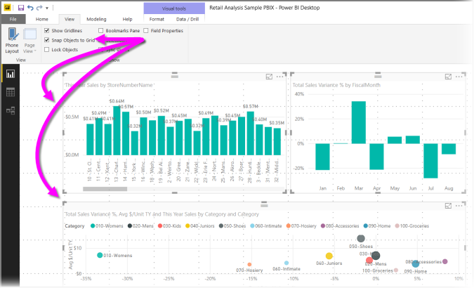
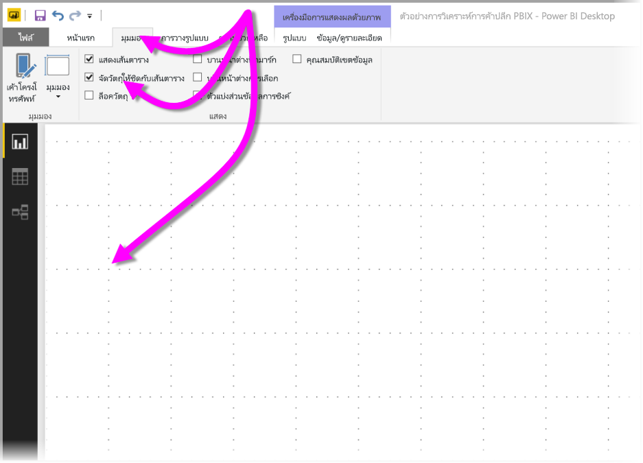
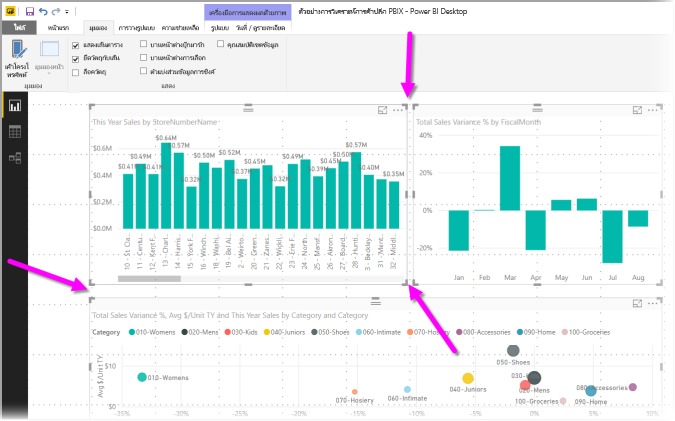
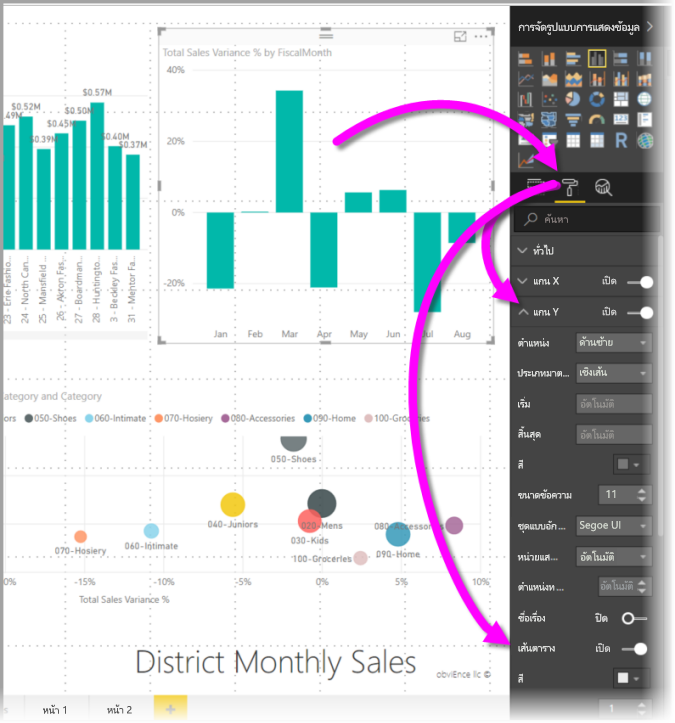
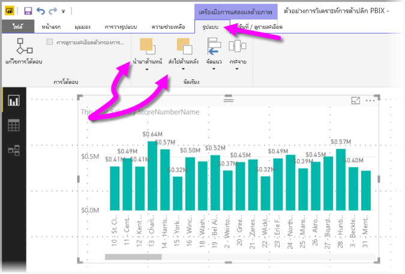
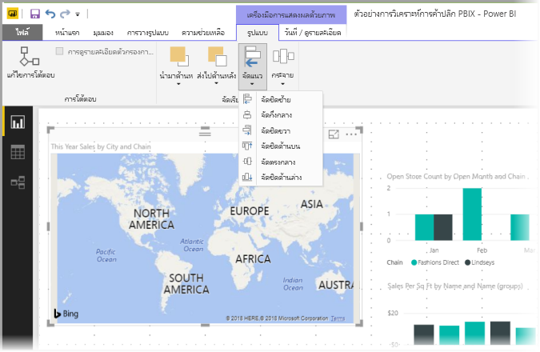
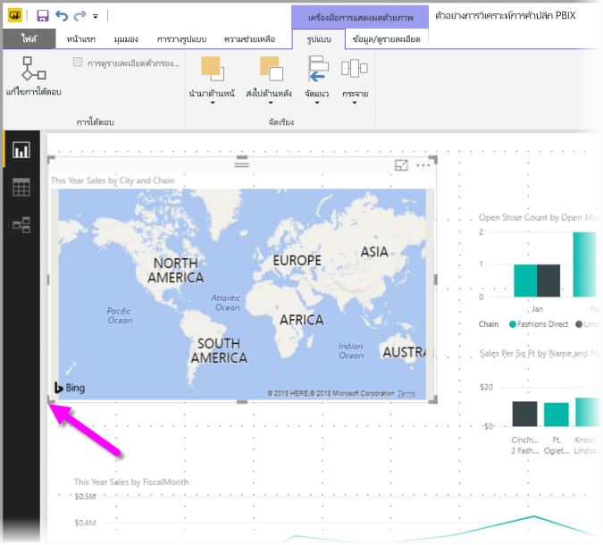
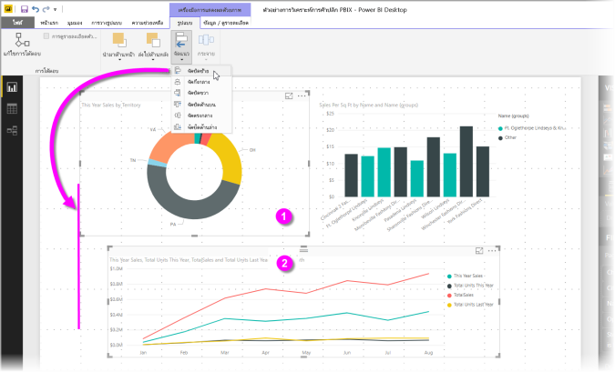
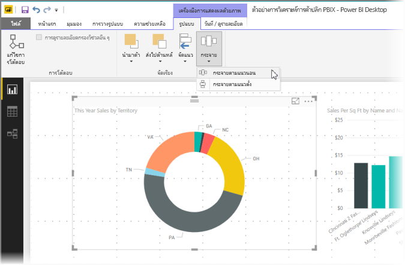

# ใช้เส้นตารางและจัดชิดกับเส้นตารางในรายงาน Power BI Desktop
พื้นที่รายงาน **Power BI Desktop** แสดงเส้นตารางที่ช่วยให้คุณจัดแนววิชวลบนหน้ารายงานได้อย่างสวยงาม และยังมีฟังก์ชันจัดชิดเส้นตาราง ให้วิชวลในรายงานของคุณดูสะอาด, อยู่ในแนวเดียวกัน และระยะห่างเท่ากัน

ใน **Power BI Desktop** คุณยังสามารถปรับลำดับแบบ Z (นำไปข้างหน้า, ย้ายไปข้างหลัง) ของวัตถุบนรายงาน และจัดแนว หรือกระจายวิชวลที่เลือกห่างให้เท่า ๆ กันบนพื้นที่ทำงาน

### การเปิดใช้งานเส้นตารางและจัดชิดกับเส้นตาราง
เมื่อต้องการเปิดใช้งานเส้นตารางและจัดชิดกับเส้นตาราง เลือกแบบ**มุมมอง** Ribbon จากนั้นเปิดใช้กล่องกาเครื่องหมายสำหรับ**แสดงเส้นตาราง**และ**จัดชิดวัตถุกับเส้นตาราง** คุณสามารถเลือกหนึ่งหรือทั้งสองตัวเลือก ซึ่งทำงานอิสระจากกัน

> [!NOTE]
> ถ้า**การแสดงเส้นตาราง**และ**จัดชิดวัตถุกับเส้นตาราง**ถูกปิดใช้งาน ให้เชื่อมต่อกับแหล่งข้อมูลใด ๆ และพวกเขาจะถูกเปิดใช้งาน
> 
> 

### การใช้เส้นตาราง
เส้นตารางเป็นแนวที่คุณมองเห็นได้ เพื่อช่วยการจัดแนววิชวลของคุณ เมื่อคุณพยายามพิจารณาว่า วิชวลสองวิชวล (หรือมากกว่า) อยู่ในแนวนอนหรือแนวตั้งเดียวกันหรือไม่ ใช้เส้นตารางเพื่อดูว่าเส้นขอบของวิชวลตรงกันหรือไม่

ใช้ Ctrl+คลิก เพื่อเลือกมากกว่าหนึ่งวิชวลในแต่ละครั้ง ซึ่งจะแสดงเส้นขอบของวิชวลที่เลือกทั้งหมด และแสดงให้เห็นว่าวิชวลอยู่ในแนวเดียวกันหรือไม่

#### การใช้เส้นตารางภายในภาพ
ใน Power BI ยังมีเส้นตารางภายในวิชวล ซึ่งแสดงเส้นบอกแนวสำหรับการเปรียบเทียบจุดข้อมูลและค่าต่าง ๆ เริ่มต้นด้วยการวางจำหน่าย**Power BI Desktop**ในเดือน 2017 กันยายน ตอนนี้คุณสามารถจัดการเส้นตารางภายในภาพที่ใช้บัตร**แกน x**หรือ**แกน y**(ตามความเหมาะสมตามชนิดของภาพ) พบในส่วน**รูปแบบ**ของบานหน้าต่าง**การแสดงภาพ** คุณสามารถจัดการองค์ประกอบของเส้นตารางภายในภาพต่อไปนี้:

* เปิดหรือปิดเส้นตาราง
* เปลี่ยนสีของเส้นตาราง
* ปรับเส้นขีด (ความกว้าง) ของเส้นตาราง
* เลือกสไตล์เส้นของเส้นตารางในภาพ เช่น ทึบ เส้นประ หรือจุด

การปรับเปลี่ยนองค์ประกอบบางอย่างของเส้นตารางจะมีประโยชน์ในรายงานที่ใช้พื้นหลังสีเข้มสำหรับภาพ รูปต่อไปนี้แสดงส่วน**เส้นตาราง** ในการ์ด**แกน Y**

### การใช้การจัดชิดกับเส้นตาราง
เมื่อคุณเปิดใช้งาน**จัดชิดวัตถุกับเส้นตาราง**ภาพทั้งหมดบนพื้นที่ทำงาน**Power BI Desktop**ที่คุณย้าย (หรือปรับขนาด) จะถูกจัดชิดกับแกนเส้นตารางที่ใกล้ที่สุดโดยอัตโนมัติ ทำให้ง่ายยิ่งขึ้นในการทำให้แน่ใจว่าภาพสองภาพหรือมากกว่าจัดแนวในตำแหน่งหรือขนาดตามแนวนอนหรือแนวตั้งที่เหมือนกัน

และนั่นคือทั้งหมดของการใช้**เส้นตาราง**และ**จัดชิดกับเส้นตาราง** เพื่อให้แน่ใจว่าวิชวลในรายงานของคุณจัดแนวอย่างเรียบร้อย

### การใช้ลำดับแบบ Z จัดแนว และกระจาย
คุณยังสามารถจัดการลำดับจากหน้าไปหลังของวิชวลในรายงาน ซึ่งมักเรียกว่า *ลำดับแบบ Z* ขององค์ประกอบ คุณลักษณะนี้ให้คุณสามารถทับซ้อนวิชวลในแบบใดก็ได้ที่คุณต้องการ จากนั้นปรับลำดับจากหน้าไปหลังของแต่ละวิชวล คุณตั้งค่าลำดับของวิชวลคุณโดยใช้ปุ่ม**นำไปข้างหน้า** และ**ย้ายไปข้างหลัง** ที่พบในส่วน**จัดเรียง** ของ ribbon **รูปแบบ** Ribbon **รูปแบบ** จะปรากฏขึ้นทันทีที่คุณเลือกหนึ่งหรือหลายวิชวลบนหน้า

Ribbon **รูปแบบ** ให้คุณสามารถจัดแนวภาพของคุณในวิธีต่าง ๆ ให้คุณแน่ใจว่าวิชวลของคุณปรากฏบนหน้า ที่จัดแนวได้สวยงามและทำงานได้ดีที่สุด

ปุ่ม**จัดแนว** จัดแนววิชวลตามขอบ (หรือกึ่งกลาง) ของพื้นที่รายงาน ดังที่แสดงในรูปต่อไปนี้

เมื่อเลือกวิชวลอย่างน้อยสองวิชวล วิชวลเหล่านั้นจะถูกจัดแนวพร้อมกัน และใช้ขอบเขตที่ถูกจัดแนวแล้วของวิชวลสำหรับการจัดแนว ตัวอย่างเช่น ถ้าคุณเลือกสองวิชวล และเลือกตัวเลือก**จัดชิดซ้าย** วิชวลจะจัดชิดขอบซ้ายสุดของวิชวลที่เลือกทั้งหมด

คุณยังสามารถกระจายภาพของคุณอย่างสม่ำเสมอทั่วพื้นที่รายงาน ไม่ว่าจะเป็นในแนวตั้งหรือแนวนอน เพียงแค่ใช้ปุ่ม**กระจาย**จาก Ribbon**รูปแบบ**

ด้วยการเลือกสองสามรายการจากเส้นตาราง, การจัดแนว และเครื่องมือการกระจาย รายงานของคุณจะมีลักษณะตามที่คุณต้องการ

