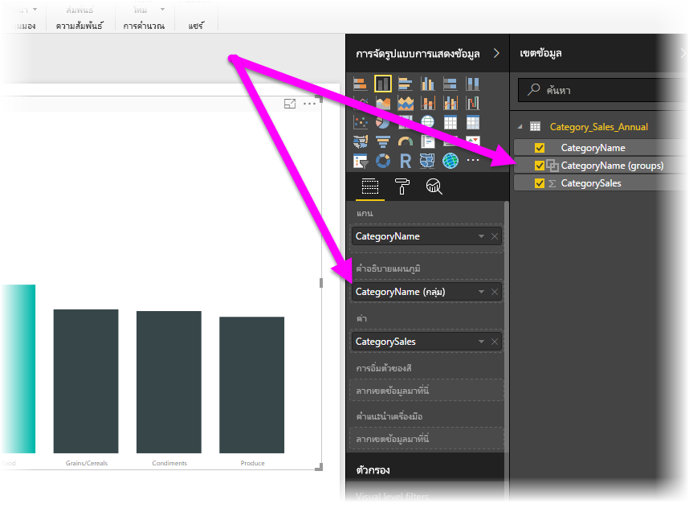
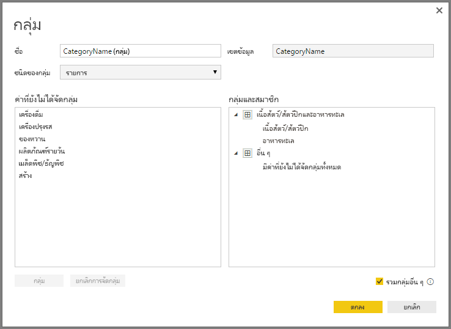

# ใช้การจัดกลุ่ม และจัดช่องเก็บใน Power BI Desktop
เมื่อ **Power BI Desktop** สร้างวิชวล จะรวมข้อมูลของคุณให้เป็นส่วน (หรือกลุ่ม) โดยยึดตามค่าที่พบในข้อมูลเบื้องต้น ซึ่งปกติแล้วจะทำงานได้ดี แต่อาจมีบางครั้งเมื่อคุณต้องการปรับวิธีการจัดกลุ่มเหล่านั้น ตัวอย่างเช่น คุณอาจต้องการวางผลิตภัณฑ์สามประเภทเข้าในประเภทที่ใหญ่ขึ้น (ในหนึ่ง*กลุ่ม*) หรือคุณอาจต้องการดูยอดขายตัวเลขในแท่งกราฟขนาด 1,000,000 ดอลลาร์แทนที่จะหารเป็นจำนวนเท่าๆ 923,983 ดอลลาร์

ใน Power BI Desktop คุณสามารถ**จัดกลุ่ม**จุดข้อมูลเพื่อช่วยให้คุณดู วิเคราะห์ และสำรวจข้อมูล รวมทั้งแนวโน้มในภาพของคุณได้อย่างชัดเจนขึ้น คุณยังสามารถกำหนด**แท่งกราฟ** มักเรียกว่า*การสร้างแท่งกราฟ* เมื่อ ใส่ค่าลงในกลุ่มที่มีขนาดเท่ากันที่ช่วยให้คุณไปยังข้อมูลแบบรูปภาพในวิธีที่สื่อความหมาย ได้ดียิ่งขึ้น

### ใช้งานการจัดกลุ่ม
เพื่อใช้การจัดกลุ่มเลือกองค์ประกอบอย่างน้อยสองอย่างบนวิชวล โดยใช้ CTRL + คลิกไปยังองค์ประกอบต่างๆ ที่ต้องการเลือก จากนั้นคลิกขวาที่หนึ่งในองค์ประกอบที่เลือก แล้วเลือก**กลุ่ม**จากเมนูที่ปรากฏขึ้น

เมื่อสร้างกลุ่มขึ้นแล้ว กลุ่มจะถูกเพิ่มลงในบักเก็ต**คำอธิบายแผนภูมิ**สำหรับวิชวล และจะปรากฏขึ้นในรายการ**เขตข้อมูล**

ทันทีที่คุณมีกลุ่ม คุณสามารถแก้ไขสมาชิกของกลุ่มได้อย่างง่ายดาย โดยการคลิกขวาเขตข้อมูลจากในบักเก็ต**คำอธิบายแผนภูมิ** หรือจากรายการ**เขตข้อมูล** แล้วเลือก**แก้ไขกลุ่ม**.

ในหน้าต่าง**กลุ่ม**ที่ปรากฎขึ้น คุณสามารถสร้างกลุ่มใหม่ หรือปรับเปลี่ยนกลุ่มที่มีอยู่ได้ คุณยังสามารถ*เปลี่ยนชื่อ*กลุ่มใดๆ โดยการคลิกสองครั้งบนชื่อกลุ่ม ในกล่อง**กลุ่มและสมาชิก** แล้วพิมพ์ชื่อใหม่ลงไป

มีหลากหลายสิ่งที่คุณสามารถทำได้ด้วยการจัดกลุ่ม คุณสามารถเพิ่มรายการจากรายการ**ค่าที่ยังไม่ได้จัดกลุ่ม** ลงในกลุ่มใหม่ หรือลงในกลุ่มที่มีอยู่แล้วได้ เวลาสร้างกลุ่มใหม่ เลือกอย่างน้อยสองรายการ (ใช้ CTRL + คลิก) จากกล่อง**ค่าที่ยังไม่ได้จัดกลุ่ม** และจากนั้นคลิกปุ่ม**กลุ่ม**ด้านล่างกล่องนั้น

คุณสามารถเพิ่มค่าที่ยังไม่ได้จัดกลุ่มลงในกลุ่มที่มีอยู่: เพียงแค่เลือกค่าที่ยังไม่ได้จัดกลุ่ม จากนั้นเลือกกลุ่มที่มีอยู่ที่คุณต้องการเพิ่ม แล้วคลิกปุ่ม**กลุ่ม**ได้ เมื่อต้องการเอารายการออกจากกลุ่ม เลือกจากกล่อง**กลุ่มและสมาชิก** และจากนั้น คลิก**ยกเลิกการจัดกลุ่ม** คุณยังสามารถเลือกว่าประเภทที่ยังไม่จัดกลุ่ม ว่าควรจัดลงในกลุ่ม**อื่นๆ** หรือควรยังคงไม่ได้อยู่ในกลุ่มได้

> [!NOTE]
> คุณสามารถสร้างกลุ่มสำหรับเขตข้อมูลใด ๆ ใน**เขตข้อมูล** โดยไม่ต้องเลือกหลายค่าจากวิชวลที่มีอยู่ได้ เพียงคลิกขวาที่เขตข้อมูล และเลือก**กลุ่มใหม่**จากเมนูที่ปรากฏขึ้น
> 
> 

### ใช้งานการจัดช่องเก็บ
คุณสามารถตั้งค่าขนาดช่องเก็บสำหรับเขตข้อมูลตัวเลข และเวลาใน **Power BI Desktop** ได้ คุณสามารถใช้การจัดช่องเก็บ เพื่อให้ **Power BI Desktop** แสดงข้อมูลด้วยขนาดที่ถูกต้อง

เมื่อต้องการกำหนดขนาดของช่องเก็บ คลิกขวาที่**เขตข้อมูล** และเลือก**กลุ่มใหม่**

จากหน้าต่าง**กลุ่ม** ตั้งค่า**ขนาดช่องเก็บ**เป็นขนาดที่คุณต้องการ

เมื่อคุณเลือก**ตกลง** คุณจะสังเกตเห็นว่า เขตข้อมูลใหม่ปรากฏในบานหน้าต่าง**เขตข้อมูล** ที่มี *(ช่องเก็บ)* ต่อท้าย คุณยังสามารถลากเขตข้อมูลนั้นลงบนพื้นที่ทำงานเพื่อใช้ขนาดช่องเก็บนั้นในวิชวล

ถ้าต้องการดูสาธิต**การจัดช่องเก็บ** โปรดดูที[วิดีโอ](https://www.youtube.com/watch?v=BRvdZSfO0DY)นี้

และนั่นคือทั้งหมดเกี่ยวกับ**การจัดกลุ่ม**และ**การจัดช่องเก็บ** เพื่อให้แน่ใจว่า วิชวลในรายงานของคุณแสดงข้อมูลในแบบที่คุณต้องการ

