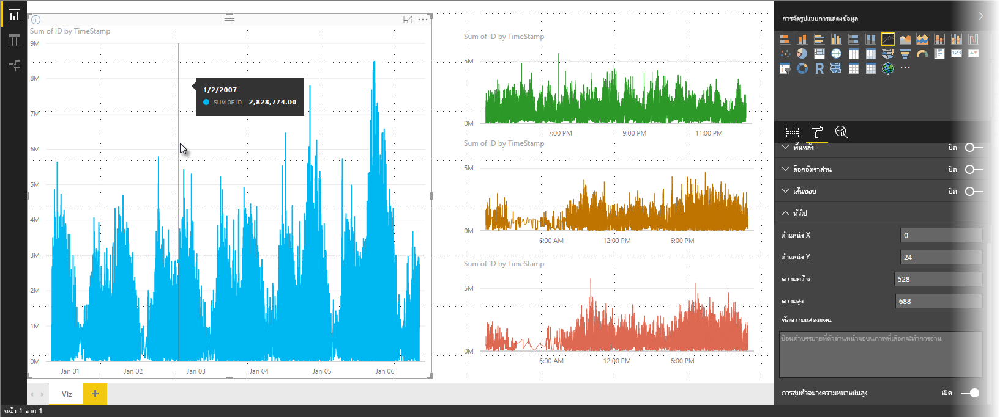

# การสุ่มตัวอย่างเส้นแบบความหนาแน่นสูงใน Power BI
เริ่มตั้งแต่ **Power BI Desktop** ที่เผยแพร่เดือนมิถุนายน 2017 และการอัปเดตใน**บริการของ Power BI** มีอัลกอริทึมการสุ่มตัวอย่างใหม่ ซึ่งช่วยปรับปรุงวิชวลที่สุ่มตัวอย่างข้อมูลที่มีความหนาแน่นสูง ตัวอย่างเช่น คุณอาจสร้างแผนภูมิเส้นจากผลลัพธ์ยอดขายของร้านค้าปลีกของคุณ แต่ละร้านค้ามีมากกว่าหนึ่งหมื่นใบเสร็จการขายสินค้าต่อปี แผนภูมิเส้นของข้อมูลดังกล่าวจะสุ่มตัวอย่างข้อมูล (เลือกตัวแทนของข้อมูลที่สื่อความหมาย ให้เห็นว่าการขายเกิดขึ้นตามเวลาอย่างไร) จากข้อมูลของแต่ละร้านค้า และสร้างแผนภูมิเส้นแบบหลายชุดข้อมูลที่แทนข้อมูลเบื้องต้น นี่คือแนวทางปฏิบัติทั่วไปในการแสดงภาพความหนาแน่นสูง Power BI Desktop ได้ปรับปรุงการสุ่มตัวอย่างของข้อมูลที่หนาแน่นสูง รายละเอียดนั้นจะอธิบายไว้ในบทความนี้

> [!NOTE]
> อัลกอริทึมการ**สุ่มที่มีหนาแน่นของความสูง**ที่อธิบายไว้ในบทความนี้ มีทั้งใน **Power BI Desktop** และ **บริการของ Power BI**

## วิธีการทำงานของการสุ่มตัวอย่างเส้นความหนาแน่นสูง
ก่อนหน้านี้**Power BI**เลือกคอลเลกชันของจุดข้อมูลตัวอย่างในช่วงทั้งหมดของข้อมูลเบื้องต้นตามแบบจำลองที่กำหนดขึ้น ตัวอย่างเช่น สำหรับข้อมูลความหนาแน่นสูงบนวิชวลที่ครอบคลุมช่วงเวลาหนึ่งปีปฏิทิน อาจมีจุดข้อมูลตัวอย่าง 350 จุดที่แสดงในวิชวล ซึ่งแต่ละจุดข้อมูลถูกเลือกเพื่อให้ได้ช่วงข้อมูลเต็ม (ชุดข้อมูลโดยรวมของข้อมูลเบื้องต้น) ใช้เป็นตัวแทนในวิชวล เพื่อช่วยให้คุณเข้าใจว่าเกิดขึ้นได้อย่างไร สมมติว่า เรามีการลงจุดราคาหุ้นในช่วงเวลาหนึ่งปี และเลือกจุดข้อมูล 365 จุดเพื่อสร้างวิชวลแผนภูมิเส้น (หนึ่งจุดข้อมูลสำหรับหนึ่งวัน)

ในสถานการณ์นั้น มีค่าหลายค่าสำหรับราคาหุ้นภายในแต่ละวัน แน่นอนว่ามีราคาสูงสุดและต่ำสุดประจำวัน แต่ค่าเหล่านั้นสามารถเกิดขึ้นเวลาใดก็ได้ระหว่างวันเมื่อตลาดหุ้นเปิด สำหรับการสุ่มตัวอย่างของเส้นความหนาแน่นสูง ถ้าการสุ่มตัวอย่างข้อมูลเบื้องต้นทำที่เวลา 10:30 น. และ 12:00 น. ในแต่ละวัน คุณจะได้สแนปช็อตของข้อมูลเบื้องต้น (ราคาที่ 10:30 น. และ 12:00 น.) แต่อาจไม่บันทึกราคาหุ้นสูงสุดและต่ำสุดสำหรับจุดข้อมูลนั้น (วันนั้น) ในสถานการณ์นั้นและสถานการณ์อื่น ๆ การสุ่มตัวอย่างจะเป็นตัวแทนข้อมูลเบื้องต้น แต่จะอาจไม่จับจุดข้อมูลที่สำคัญเสมอไป ซึ่งในกรณีนี้ คือราคาหุ้นสูงสุดและต่ำสุดรายวัน

จากคำนิยาม ข้อมูลความหนาแน่นสูง จะถูกสุ่มตัวอย่างเพื่อสร้างการแสดงภาพได้อย่างรวดเร็วพอ ที่ตอบสนองต่อการโต้ตอบได้ จุดข้อมูลที่มากเกินไปบนวิชวลทำให้รกตา และขัดขวางไม่ให้เห็นแนวโน้ม ดังนั้น วิธีที่ใช้สุ่มข้อมูลคือสิ่งที่มาผลักดันการสร้างอัลกอริทึมการสุ่มตัวอย่าง เพื่อสร้างประสบการณ์การแสดงภาพที่ดีที่สุด และมั่นใจได้ว่าข้อมูลทั้งหมดถูกแสดง ใน Power BI Desktop อัลกอริทึมได้รับการปรับปรุงเพื่อให้ได้การผสมผสานที่ดีที่สุด ระหว่างการตอบสนอง, ตัวแทนข้อมูล และการคงจุดข้อมูลที่สำคัญในแต่ละช่วงเวลา

## วิธีการทำงานของอัลกอริธึมการสุ่มตัวอย่างของแผนภูมิเส้น
อัลกอริทึมใหม่สำหรับการสุ่มตัวอย่างเส้นความหนาแน่นสูง มีสำหรับวิชวลแผนภูมิเส้นและแผนภูมิพื้นที่ที่มีแกน X แบบต่อเนื่อง

สำหรับวิชวลความหนาแน่นสูง **Power BI** ทำการแบ่งส่วนข้อมูลของคุณ เป็นกลุ่มข้อมูลความละเอียดสูงอย่างชาญฉลาด จากนั้นเลือกจุดข้อมูลที่สำคัญเพื่อเป็นตัวแทนสำหรับแต่ละกลุ่ม กระบวนการแบ่งส่วนข้อมูลความละเอียดสูงดำเนินการเพื่อให้แน่ใจว่าผลลัพธ์แผนภูมิที่ได้สามารถแยกความแตกต่างได้ด้วยตาจากจุดข้อมูลเบื้องต้นทั้งหมดที่มีให้ แต่จะเร็วกว่ามากและมีการโต้ตอบได้ดีกว่า

### ค่าต่ำสุดและสูงสุดสำหรับภาพความหนาแน่นสูงเชิงเส้น
สำหรับการแสดงภาพใด ๆ จะเป็นไปตามข้อจำกัดด้านการมองเห็นต่อไปนี้:

* **3,500** คือจำนวนจุดข้อมูลสูงสุด*ที่แสดง*บนวิชวลส่วนใหญ่ โดยไม่คำนึงถึงจำนวนของจุดข้อมูลเบื้องต้นหรือชุดข้อมูล (ดู *ข้อยกเว้น* ในรายการหัวข้อย่อยต่อไปนี้) ในกรณีดังกล่าว ถ้าคุณมี 10 ชุดข้อมูลที่แต่ละชุดข้อมูลมี 350 จุดข้อมูล ภาพดังกล่าวได้ถึงขีดจำกัดสูงสุดของจุดข้อมูลโดยรวมแล้ว ถ้าคุณมีหนึ่งชุดข้อมูล ชุดข้อมูลดังกล่าวอาจมีจุดข้อมูลสูงสุด 3,500 จุดได้หากอัลกอริทึมใหม่เข้าข่ายการสุ่มตัวอย่างที่ดีที่สุดสำหรับข้อมูลเบื้องต้น

* จำนวนชุดข้อมูลสูงสุดสำหรับภาพหนึ่ง ๆ คือ **60 ชุดข้อมูล** ถ้าคุณมีชุดข้อมูลมากกว่า 60 ชุด ให้แบ่งชุดข้อมูลและสร้างวิชวลหลายวิชวล ด้วยชุดข้อมูล 60 ชุดหรือน้อยกว่านั้นในแต่ละวิชวล ขั้นตอนนี้เป็นหลักปฏิบัติที่ดีในการใช้**ตัวแบ่งส่วนข้อมูล**เพื่อแสดงเฉพาะบางเซกเมนต์ของข้อมูล (เฉพาะบางชุดข้อมูล) ตัวอย่างเช่น ถ้าคุณกำลังแสดงประเภทย่อยทั้งหมดในคำอธิบายแผนภูมิ คุณสามารถใช้ตัวแบ่งส่วนข้อมูลเพื่อกรองตามประเภททั้งหมดบนหน้ารายงานเดียวกันได้

จำนวนขีดจำกัดสูงสุดของข้อมูลจะสูงกว่าสำหรับประเภทวิชวลต่อไปนี้ ซึ่งมี *ข้อยกเว้น* ขีด จำกัดจุดข้อมูลเท่ากับ 3,500:

* **150,000** จุดข้อมูลสูงสุดสำหรับวิชวล R
* **30,000** จุดข้อมูลสำหรับวิชวลแบบกำหนดเอง
* **10000**จุดข้อมูลสำหรับแผนภูมิกระจาย (ค่าเริ่มต้นแผนภูมิกระจายสูงถึง 3,500)
* **3,500** สำหรับภาพวิชวลอื่น ๆ ทั้งหมด

พารามิเตอร์เหล่านี้มีไว้เพื่อให้แน่ใจว่าวิชวลใน Power BI Desktop แสดงได้อย่างรวดเร็ว และตอบสนองต่อการโต้ตอบกับผู้ใช้งานได้เป็นอย่างดี รวมถึงไม่ต้องคำนวณเพื่อสร้างภาพวิชวลดังกล่าวมากเกินได้

### การประเมินจุดข้อมูลที่เป็นตัวแทนสำหรับภาพเชิงเส้นความหนาแน่นสูง
เมื่อมีจำนวนจุดข้อมูลเบื้องต้นเกินกว่าจุดข้อมูลสูงสุดที่สามารถแสดงได้ในวิชวล กระบวนการที่เรียกว่า*การจัดช่องเก็บ*จะเริ่มต้นขึ้น ซึ่งจะรวมกลุ่มข้อมูลเบื้องต้นเป็นกลุ่ม ๆ ที่เรียกว่า*ช่องเก็บ* และจะทำซ้ำการปรับปรุงช่องเก็บเหล่านั้น

อัลกอริทึมสร้างช่องเก็บมากที่สุดเท่าที่จะทำได้เพื่อสร้างส่วนประกอบที่ดีที่สุดสำหรับภาพ ภายในแต่ละช่องเก็บ อัลกอริทึมค้นหาค่าข้อมูลต่ำสุดและสูงสุด เพื่อให้แน่ใจว่าค่าที่สำคัญและค่าที่มีนัยสำคัญ (ตัวอย่างเช่น ค่าผิดปกติ) จะรวบรวมไว้ และแสดงในภาพนี้ จากผลลัพธ์ของการจัดช่องเก็บและการประเมินข้อมูลต่อมาโดย Power BI จะกำหนดความละเอียดต่ำสุดสำหรับแกน X ของวิชวล เพื่อให้แน่ใจว่าวิชวลมีความละเอียดสูงสุด

ดังที่ได้กล่าวมาแล้ว ความละเอียดขั้นต่ำสำหรับแต่ละชุดคือ 350 จุด สูงสุดคือ 3,500 จุด สำหรับภาพส่วนใหญ่โดยมี *ข้อยกเว้น* ที่ระบุไว้ในย่อหน้าก่อนหน้า

แต่ละช่องเก็บจะแสดง 2 จุดข้อมูล ซึ่งจะกลายเป็นจุดข้อมูลที่เป็นตัวแทนของช่องเก็บข้อมูลในภาพ จุดข้อมูลเป็นเพียงแค่ค่าสูงสุดและต่ำสุดสำหรับช่องเก็บดังกล่าว และโดยการเลือกค่าสูงสุดและต่ำสุด กระบวนการจัดช่องจะช่วยทำให้แน่ใจว่ามีการจับและแสดงค่าสูงสุดที่สำคัญหรือค่าต่ำสุดที่มีนัยสำคัญบนภาพ

ถ้านี่ฟังเหมือนว่าการวิเคราะห์จำนวนมาก มีเพื่อให้แน่ใจว่าได้จับค่าที่ผิดปกติและแสดงอย่างถูกต้องในวิชวล คุณเข้าใจถูกแล้ว และนั่นคือเหตุผลที่แท้จริงเบื้องหลังอัลกอริทึมและการจัดช่องเก็บใหม่

## เคล็ดลับเครื่องมือและการสุ่มตัวอย่างเส้นความหนาแน่นสูง
เป็นเรื่องสำคัญที่ต้องทราบว่า กระบวนการการจัดช่องนี้ ให้ค่าต่ำสุดและสูงสุดที่อยู่ในช่องเก็บได้จัดเก็บและแสดง ซึ่งอาจส่งผลต่อการแสดงข้อมูลของคำแนะนำเครื่องมือ เมื่อคุณโฮเวอร์เหนือจุดข้อมูล เพื่ออธิบายว่าเกิดขึ้นได้อย่างไรและทำไม กลับไปดูตัวอย่างของเราเกี่ยวกับราคาหุ้น

สมมติว่า คุณกำลังสร้างวิชวลจากราคาหุ้น และคุณกำลังเปรียบเทียบหุ้นสองตัว ซึ่งใช้**การสุ่มตัวอย่างความหนาแน่นสูง**เหมือนกันทั้งคู่ ข้อมูลเบื้องต้นสำหรับแต่ละชุดข้อมูลมีจุดข้อมูลมากมาย (บางทีคุณอาจจับราคาหุ้นในแต่ละวินาทีของวัน) อัลกอริทึมการสุ่มตัวอย่างเส้นความหนาแน่นสูง ดำเนินการกับช่องเก็บแต่ละชุดข้อมูลอิสระจากกัน

ตอนนี้สมมุติว่า ราคาหุ้นตัวแรกกระโดดขึ้นไปที่เวลา 12:02 น. จากนั้นราคาก็ร่วงลงอีก 10 วินาทีต่อมา นั่นเป็นจุดข้อมูลที่สำคัญจุดหนึ่ง เมื่อทำการจัดช่องเก็บสำหรับหุ้นดังกล่าว ค่าสูงสุดที่ 12:02 จะเป็นจุดข้อมูลที่เป็นตัวแทนสำหรับช่องเก็บนั้น

แต่สำหรับหุ้นตัวที่สอง ที่เวลา 12:02 น. ไม่มีทั้งค่าสูงสุดและต่ำสุดในช่องเก็บที่รวมเวลาดังกล่าว แต่ค่าสูงสุดและต่ำสุดสำหรับช่องเก็บนั้น ที่รวมเวลา 12:02 น. อาจเกิดขึ้นสามนาทีในภายหลัง ในการสถานการณ์นั้น เมื่อมีการสร้างแผนภูมิเส้นและคุณเลื่อนไปเหนือ 12:02 คุณจะเห็นค่าหนึ่งในเคล็ดลับเครื่องมือสำหรับหุ้นตัวแรก (เพราะค่ากระโดดไปที่ 12:02 และค่าดังกล่าวถูกเลือกเป็นจุดข้อมูลสูงสุดของช่องเก็บ) แต่คุณจะ*ไม่*เห็นค่าใด ๆ ในเคล็ดลับเครื่องมือที่ 12:02 สำหรับหุ้นตัวที่สอง นั่นเนื่องจากว่าหุ้นตัวที่สองไม่มีทั้งค่าต่ำสุดหรือสูงสุดสำหรับช่องเก็บที่รวม 12:02 ดังนั้น ไม่มีข้อมูลที่จะแสดงสำหรับหุ้นตัวที่สองที่เวลา 12:02 ทำให้ไม่มีข้อมูลเคล็ดลับเครื่องมือที่จะแสดง

สถานการณ์นี้จะเกิดขึ้นบ่อยครั้งกับเคล็ดลับเครื่องมือ ค่าสูงสุดและต่ำสุดสำหรับช่องเก็บที่ระบุอาจไม่ตรงกับจุดค่าแกน x ที่ปรับมาตราส่วนเท่า ๆ กันอย่างสมบูรณ์แบบ และหากเป็นเช่นนั้นเคล็ดลับเครื่องมือจะไม่แสดงค่า  

## วิธีการเปิดใช้งานการสุ่มตัวอย่างเส้นความหนาแน่นสูง
ตามค่าเริ่มต้น อัลกอริทึมใหม่จะ**เปิด**ใช้งาน เพื่อเปลี่ยนการตั้งค่านี้ ไปที่บานหน้าต่าง**จัดรูปแบบ**ในการ์ด**ทั่วไป** และตามแนวด้านล่างคุณจะเห็นตัวเลื่อนสลับที่ชื่อว่า **การสุ่มตัวอย่างความหนาแน่นสูง** ในการปิดใช้งาน เลื่อนไปที่**ปิด**

## ข้อควรพิจารณาและข้อจำกัด
อัลกอริทึมใหม่สำหรับการสุ่มตัวอย่างเส้นความหนาแน่นสูง เป็นการพัฒนาที่สำคัญสำหรับ Power BI แต่ยังมีข้อควรพิจารณาที่ต้องทราบ เมื่อทำงานกับค่าและข้อมูลที่มีความหนาแน่นสูง

* เนื่องด้วยส่วนประกอบและกระบวนการจัดช่องเก็บที่เพิ่มขึ้น **เคล็ดลับเครื่องมือ**อาจแสดงค่าเฉพาะถ้าข้อมูลที่เป็นตัวแทนได้รับการจัดแนวด้วยเคอร์เซอร์ของคุณ ดูส่วน *เคล็ดลับเครื่องมือและการสุ่มตัวอย่างเส้นความหนาแน่นสูง* ในบทความนี้สำหรับข้อมูลเพิ่มเติม
* เมื่อขนาดของแหล่งข้อมูลที่มีทั้งหมดมีขนาดใหญ่เกินไป อัลกอริทึมใหม่จะกำจัดชุดข้อมูล (องค์ประกอบของคำอธิบายแผนภูมิ) เพื่อให้สอดคล้องกับข้อจำกัดสูงสุดของการนำเข้าข้อมูล
  
  * ในสถานการณ์นี้ อัลกอริทึมใหม่จะจัดเรียงคำอธิบายแผนภูมิของชุดข้อมูลตามลำดับตัวอักษร เริ่มตั้งแต่คำอธิบายแผนภูมิแรก จนกระทั่งถึงขีดจำกัดสูงสุดในการนำเข้าข้อมูล และจะไม่นำเข้าชุดข้อมูลเพิ่มเติมอีก
* เมื่อชุดข้อมูลเบื้องต้นมีชุดข้อมูลมากกว่า 60 ชุด (จำนวนสูงสุดของชุดข้อมูลตามที่อธิบายไว้ก่อนหน้านี้) อัลกอริทึมใหม่จะจัดเรียงชุดข้อมูลตามลำดับตัวอักษร และกำจัดชุดข้อมูลที่เกิดกว่า 60 ชุดตามลำดับตัวอักษร
* ถ้าค่าในข้อมูลไม่ใช่ชนิด*ตัวเลข*หรือ*วันที่/เวลา* Power BI จะไม่ใช้อัลกอริทึมใหม่ และจะกลับไปใช้อัลกอริทึมก่อนหน้านี้ (ที่ไม่ใช่การสุ่มตัวอย่างความหนาแน่นสูง)
* การตั้งค่า**แสดงรายการที่ไม่มีข้อมูล**ไม่สนับสนุนในอัลกอริทึมใหม่นี้
* ไม่สนับสนุนอัลกอริทึมใหม่เมื่อใช้การเชื่อมต่อสดไปยังแบบจำลองที่โฮสต์ใน SQL Server Analysis Services (เวอร์ชัน 2016 หรือเวอร์ชันก่อนหน้า) แต่จะสนับสนุนในแบบจำลองที่โฮสต์ใน**Power BI**หรือ Azure Analysis Services

## ขั้นตอนถัดไป
สำหรับข้อมูลเพิ่มเติมเกี่ยวกับสุ่มตัวอย่างความหนาแน่นสูงในแผนภูมิกระจาย ดูบทความต่อไปนี้

* [การสุ่มตัวอย่างความหนาแน่นสูงในแผนภูมิกระจาย Power BI](desktop-high-density-scatter-charts.md)

