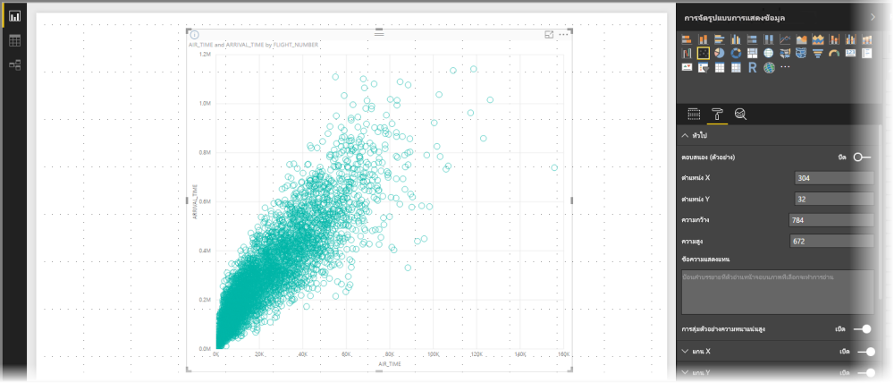
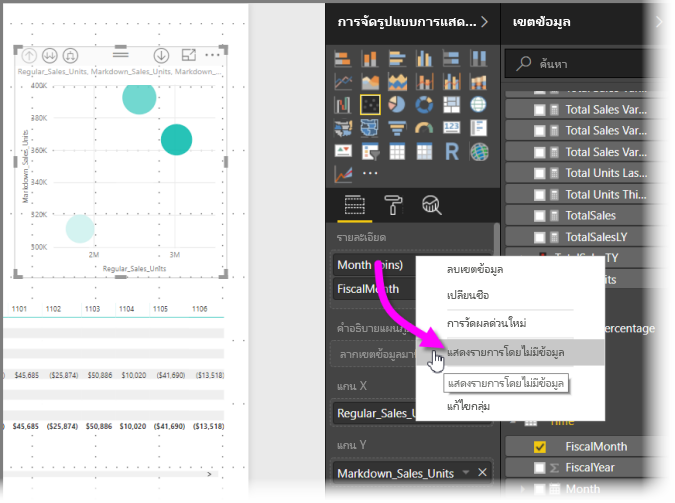
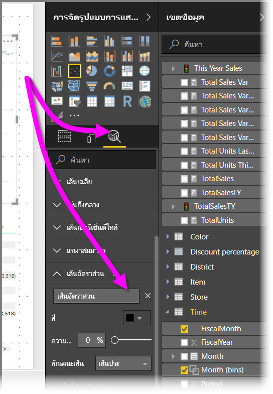
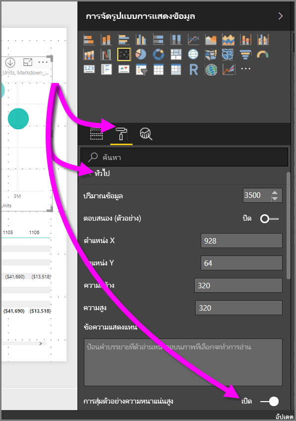

# การสุ่มตัวอย่างความหนาแน่นสูงในแผนภูมิกราฟจุด Power BI
เริ่มตั้งแต่การเผยแพร่เดือนกันยายน 2017 ของ **Power BI Desktop** และการอัปเดตของ**บริการของ Power BI** อัลกอริทึมการสุ่มตัวอย่างใหม่ มีให้ใช้งานซึ่งช่วยปรับปรุงวิธีที่แผนภูมิกระจายแสดงข้อมูลที่มีความหนาแน่นสูง

ตัวอย่างเช่น คุณอาจสร้างแผนภูมิกราฟจุดจากกิจกรรมการขายขององค์กรของคุณ ร้านค้าแต่ละรายการจะมีหลายหมื่นรายจุดข้อมูลในแต่ละปี แผนภูมิกระจายของข้อมูลดังกล่าวจะสุ่มตัวอย่างข้อมูล (เลือกตัวแทนของข้อมูลที่สื่อความหมาย ให้เห็นว่าการขายเกิดขึ้นตามเวลาอย่างไร) จากข้อมูลทั้งหมด และสร้างแผนภูมิกระจายที่แทนข้อมูลเบื้องต้น นี่คือแนวทางปฏิบัติทั่วไปในแผนภูมิกระจายความหนาแน่นสูง Power BI ได้ปรับปรุงการสุ่มตัวอย่างของข้อมูลที่หนาแน่นสูง รายละเอียดนั้นจะอธิบายไว้ในบทความนี้

> [!NOTE]
> อัลกอริทึม**การสุ่มตัวอย่างความหนาแน่นสูง**ที่อธิบายไว้ในบทความนี้ มีสำหรับแผนภูมิกระจายทั้งใน **Power BI Desktop** และ **บริการของ Power BI**
> 
> 

## วิธีการทำงานของแผนภูมิกราฟจุดที่มีความหนาแน่นสูง
ก่อนหน้านี้**Power BI**เลือกคอลเลกชันของจุดของข้อมูลตัวอย่างในช่วงทั้งหมดของข้อมูลเบื้องต้น ตามแบบจำลองที่กำหนดขึ้นเพื่อสร้างแผนภูมิกราฟจุด โดยเฉพาะ Power BI จะเลือกแถวแรกและแถวสุดท้ายของข้อมูลในชุดข้อมูลแผนภูมกราฟจุด จากนั้นจะแบ่งแถวที่เหลือเท่าๆ กันเพื่อให้จุดข้อมูลทั้งหมด 3,500 จุดสามารถจดลงบนแผนภูมิกราฟจุดได้ ตัวอย่างเช่น ถ้าตัวอย่างที่มีแถวทั้งหมด 35,000 แถว แถวแรกและแถวสุดท้ายถูกเลือกสำหรับการลงจุด จากนั้นทุก ๆ แถวที่สิบจะมีการลงจุดด้วย (35,000 / 10 = ทุกแถวที่สิบ = 3,500 จุดข้อมูล) และเหมือนกับก่อนหน้านี้ ค่า null หรือจุดที่ไม่สามารถลงจุดได้ (เช่นเป็นข้อความ) ในชุดข้อมูลจะไม่ถูกแสดง ดังนั้นจะไม่ถูกพิจารณาตอนสร้างวิชวล และด้วยการสุ่มตัวอย่างนั้น ความหนาแน่นที่มองเห็นของแผนภูมิกระจายจะขึ้นกับตัวแทนของจุดข้อมูล ดังนั้นความหนาแน่นของวิชวลขึ้นกับจุดที่เลือกมาเป็นตัวอย่าง ไม่ใช่คอลเลกชันเต็มของข้อมูลเบื้องต้น

เมื่อคุณเปิดใช้งาน**การสุ่มตัวอย่างความหนาแน่นสูง** Power BI ประมวลผลอัลกอริทึมที่ลบจุดที่ซ้อนกัน และตรวจสอบว่าจุดบนภาพสามารถเข้าถึงได้เมื่อมีการโต้ตอบการแสดงผลด้วยภาพ อัลอกริทึมยังทำให้แน่ใจอีกว่า จุดทั้งหมดในชุดข้อมูลถูกแสดงในวิชวล และให้บริบทที่เป็นความหมายของจุดที่เลือก แทนที่จะลงจุดตัวอย่างที่เป็นตัวแทน

จากคำนิยาม ข้อมูลความหนาแน่นสูง จะถูกสุ่มตัวอย่างเพื่อสร้างการแสดงภาพได้อย่างรวดเร็วพอ ที่ตอบสนองต่อการโต้ตอบได้ จุดข้อมูลที่มากเกินไปบนวิชวลทำให้รกตา และขัดขวางไม่ให้เห็นแนวโน้ม ดังนั้น วิธีที่ใช้สุ่มข้อมูลคือสิ่งที่มาผลักดันการสร้างอัลกอริทึมการสุ่มตัวอย่าง เพื่อสร้างประสบการณ์การแสดงภาพที่ดีที่สุด และมั่นใจได้ว่าข้อมูลทั้งหมดถูกแสดง ใน Power BI อัลกอริทึมได้รับการปรับปรุงเพื่อให้ได้การผสมผสานที่ดีที่สุด ระหว่างการตอบสนอง, ตัวแทนข้อมูล และการคงจุดข้อมูลที่สำคัญในชุดข้อมูลโดยรวม

> [!NOTE]
> แผนภูมิกระจายใช้อัลกอริทึม**การสุ่มตัวอย่างความหนาแน่นสูง** เหมาะที่สุดที่จะลงจุดบนวิชวลสี่เหลี่ยมจตุรัส เช่นแผนภูมิกระจายทั้งหลาย
> 
> 

## วิธีการทำงานของอัลกอริธึมการสุ่มตัวอย่างของแผนภูมิกราฟจุด
อัลกอริทึมใหม่สำหรับ**การสุ่มตัวอย่างความหนาแน่นสูง** สำหรับแผนภูมิกระจาย ใช้วิธีที่จับภาพและแทนข้อมูลเบื้องต้นได้อย่างมีประสิทธิภาพขึ้น และกำจัดจุดที่ซ้อนทับกัน ทำโดยเริ่มต้นด้วยรัศมีขนาดเล็กสำหรับแต่ละจุดข้อมูล (ขนาดภาพวงกลมสำหรับจุดุบนการแสดงภาพ) แล้วเพิ่มรัศมีของจุดข้อมูลทั้งหมด เมื่อมีการทับซ้อนของจุดข้อมูลสองจุด(หรือมากกว่า) วงกลมเดียว (ของขนาดรัศมีที่เพิ่มขึ้น) แสดงจุดข้อมูลที่ซ้อนเหล่านั้น อัลกอริทึมยังเพิ่มรัศมีของจุดข้อมูลเรื่อยๆ จนกว่าค่ารัศมีมีจำนวนจุดข้อมูลอย่างสมเหตุสมผล 3,500 โดยแสดงในแผนภูมิกราฟจุด

วิธีการในอัลกอริทึมนี้ทำให้แน่ใจว่าค่าผิดปกติจะถูกแสดงในภาพผลลัพธ์ อัลกอริทึมเคารพมาตราส่วนเมื่อกำหนดการซ้อน เช่นเดียวกับระดับโพเนนเชียลที่ถูกแสดงภาพ ด้วยความเที่ยงตรงเหมือนกับจุดต้นแบบ

อัลกอริทึมยังรักษารูปร่างโดยรวมของแผนภูมิกราฟจุด

> [!NOTE]
> เมื่อใช้อัลกอริทึม**การสุ่มที่มีความหนาแน่นสูง**สำหรับแผนภูมิกราฟจุด *การแจกจ่ายที่แม่นยำ*ของข้อมูลเป็นเป้าหมาย และความหนาแน่นของภาพโดยนัย*ไม่*ใช่เป้าหมาย ตัวอย่างเช่น คุณอาจเห็นแผนภูมิกระจาย มีมากมายวงกลมที่ซ้อนกัน (ความหนาแน่น) ในบางพื้นที่ และลองนึกถึงจุดข้อมูลจำนวนมากต้องคลัสเตอร์มี เนื่องจากการ**สุ่มหนาแน่นของความสูง**อัลกอริทึมสามารถใช้วงกลมหนึ่งเพื่อแสดงจุดข้อมูลจำนวนมาก ดังกล่าวโดยนัยความหนาแน่นที่ภาพ (หรือ "ทำคลัสเตอร์") จะไม่แสดงขึ้น เมื่อต้องรับรายละเอียดเพิ่มเติมในพื้นที่ที่กำหนด คุณสามารถใช้ตัวแบ่งส่วนข้อมูลเพื่อขยายได้
> 
> 

ยิ่งกว่านี้ จุดข้อมูลที่ไม่สามารถลงจุดได้(เช่นค่า null หรือค่าข้อความ)จะถูกละเว้น ดังนั้นค่าอื่นที่สามารถลงจุดนั้นถูกเลือก การตรวจรูปร่างจริงของแผนภูมิครั้งต่อไปนั้นถูกจัดการ

### เมื่อใช้อัลกอริทึมมาตรฐานแผนภูมิกราฟจุด
อาจมีกรณีซึ่ง**การสุ่มตัวอย่างความหนาแน่นสูง**ไม่สามารถนำไปใช้ได้กับแผนภูมิกระจาย และอัลกอริทึมเดิมถูกใช้แทน สถานการณ์เหล่านั้นมีดังนี้

* ถ้าคุณคลิกขวาบนค่าภายใต้**รายละเอียด** แล้วเลือก**แสดงรายการที่ไม่มีข้อมูล**จากเมนู แผนภูมิกระจายจะกลับไปใช้อัลกอริทึมเดิม
  
  
* ค่าใด ๆ ในแกน**Play** จะทำใหแผนภูมิกราฟจุดแปลงกลับเป็นอัลกอริทึมต้นฉบับ
* ถ้าทั้งแกน X และ Y หายไปจากแผนภูมิกราฟจุด แผนภูมิแปลงกลับไปเป็นอัลกอริทึมต้นฉบับ
* การใช้**เส้นอัตรา**ในบานหน้าต่าง**การวิเคราะห์**มีผลให้แผนภูมิแปลงกลับเป็นอัลกอริทึมต้นฉบับ
  
  

## วิธีการเปิดใช้งานการสุ่มตัวอย่างแบบความหนาแน่นสูงสำหรับแผนกราฟจุด
เพื่อเปิดใช้งาน**การสุ่มตัวอย่างความหนาแน่นสูง** เลือกแผนภูมิกระจาย ไปที่บานหน้าต่าง**จัดรูปแบบ** ขยายการ์ด**ทั่วไป** และใกล้กับด้านล่างของการ์ด เลื่อนตัวเลื่อน**การสุ่มตัวอย่างความหนาแน่นสูง**ให้เป็น**เปิด**

> [!NOTE]
> เมื่อแถบเลื่อนที่เปิดอยู่ Power BI จะพยายามใช้อัลกอริทึม**การสุ่มความหนาแน่นสูง**เมื่อใดก็ตามที่เป็นได้ เมื่อไม่สามารถใช้อัลกอริทึม (ตัวอย่างเช่น คุณใส่ค่าในการ*เล่น*แกน), แถบเลื่อนยังคงอยู่ในการ**บน**จัดตำแหน่งแม้ว่าแผนภูมิมีแปลงกลับเป็นอัลกอริทึมมาตรฐานได้ ถ้าคุณลบค่าจากแกน*เคลื่อนไหว* (หรือเปลี่ยนแปลงเงื่อนไขเพื่อให้สามารถใช้อัลกอริทึมการสุ่มตัวอย่างความหนาแน่นสูงได้) แผนภูมิจะใช้การสุ่มตัวอย่างความหนาแน่นสูงโดยอัตโนมัติสำหรับแผนภูมินั้น เนื่องจากคุณลักษณะเปิดใช้งานอยู่
> 
> [!NOTE]
> จุดข้อมูลจะถูกจัดกลุ่ม หรือเลือกโดยดัชนี การมีคำอธิบายแผนภูมิไม่มีผลต่อการสุ่มตัวอย่างสำหรับอัลกอริทึม ซึ่งจะส่งผลต่อลำดับของภาพ
> 
> 

## ข้อควรพิจารณาและข้อจำกัด
อัลกอริทึมการสุ่มตัวอย่างความหนาแน่นสูง เป็นการพัฒนาที่สำคัญสำหรับ Power BI แต่ยังมีข้อควรพิจารณาที่ต้องทราบ เมื่อทำงานกับค่าความหนาแน่สูงและแผนภูมิกระจาย

* อัลกอริทึมการ**สุ่มตัวอย่างความหนาแน่นสูง** ทำงานกับการเชื่อมต่อสดไปยังแบบจำลอง Power BI แบบจำลองที่นำเข้าหรือ DirectQuery

## ขั้นตอนถัดไป

สำหรับข้อมูลเพิ่มเติมเกี่ยวกับการสุ่มตัวอย่างความหนาแน่นสูง ให้ดูบทความต่อไปนี้:

* [การสุ่มตัวอย่างเส้นแบบความหนาแน่นสูงใน Power BI](desktop-high-density-sampling.md)
* [เคล็ดลับในการเรียงลำดับและเผยแพร่แผนพลอตข้อมูลในรายงาน Power BI](guidance/report-tips-sort-distribute-data-plots.md)
