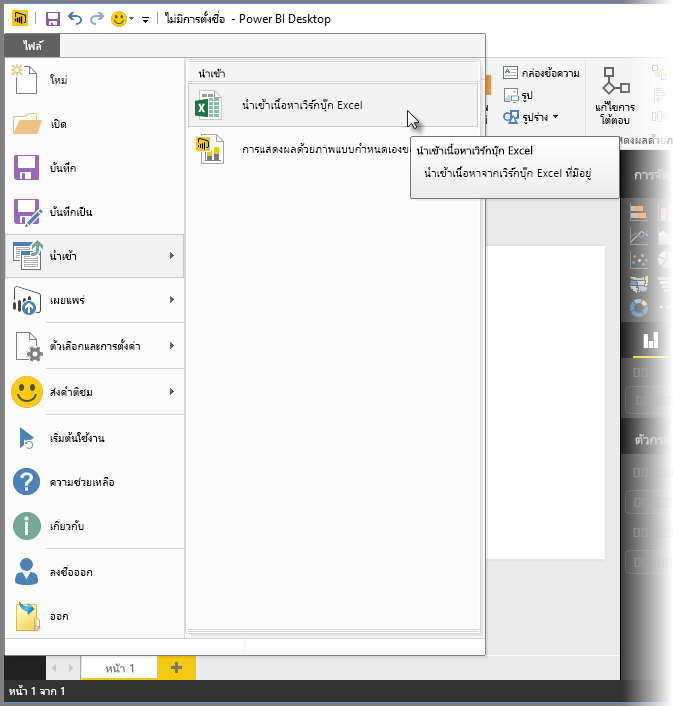
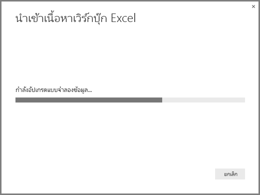
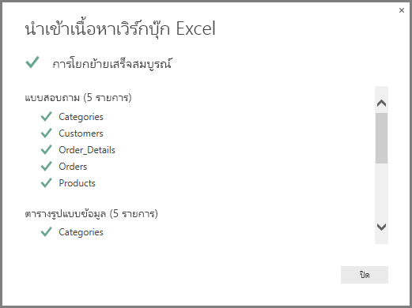

# นำเข้าเวิร์กบุ๊ก Excel ลงใน Power BI Desktop
ด้วย **Power BI Desktop** คุณสามารถนำเข้านำเข้าเวิร์กบุ๊ก Excel ที่มีคิวรี Power Query, รูปแบบ Power Pivot และแผ่นงาน Power View ลงใน Power BI Desktop ได้อย่างง่ายดาย รายงานและการแสดงภาพจะถูกสร้างโดยอัตโนมัติจากเวิร์กบุ๊ก Excel และทันทีที่นำเข้าแล้ว คุณสามารถปรับปรุงรายงานเหล่านั้นต่อด้วย Power BI Desktop โดยใช้คุณลักษณะที่มีอยู่และคุณลักษณะใหม่ที่เผยแพร่ในอัปเดตประจำเดือนของ Power BI Desktop

ในอนาคต จะมีแผนเพิ่มการสื่อสารระหว่าง Excel และ Power BI Desktop (เช่นนำเข้า/ส่งออก) ซึ่งความสามารถการนำเข้าเวิร์กบุ๊กไปยัง Power BI Desktop ในปัจจุบันช่วยให้ผู้ใช้ Excel ที่มีอยู่ ได้เริ่มต้นใช้งาน Power BI Desktop

## ฉันนำเข้าเวิร์กบุ๊ก Excel ได้อย่างไร?
เพื่อนำเข้าสมุดงาน จาก Power BI Desktop เลือก **แฟ้ม -\> นำเข้า -\>เนื้อหาเวิร์กบุ๊ก Excel**

หน้าต่างจะปรากฏขึ้น เพื่อให้คุณเลือกเวิร์กบุ๊กที่จะนำเข้า ขณะนี้ยังไม่มีการจำกัดขนาดหรือจำนวนของวัตถุในเวิร์กบุ๊ก แต่เวิร์กบุ๊กขนาดใหญ่ทำให้ Power BI Desktop ใช้เวลานานในการวิเคราะห์ และนำเข้า

> [!NOTE]
> จะโหลด หรือนำเข้าไฟล์ Excel จากโฟลเดอร์ **OneDrive for Business ที่แชร์** หรือจาก**โฟลเดอร์กลุ่ม Office 365** ใช้ URL ของไฟล์ Excel และการป้อนข้อมูลลงในแหล่งข้อมูลใน**เว็บ** Power BI Desktop มีสองสามขั้นตอนที่คุณจำเป็นต้องทำตาม เพื่อจัดรูปแบบ URL ของ **OneDrive for Business**ให้ถูกต้อง ดู[ใช้การเชื่อมโยง OneDrive for Business ใน Power BI Desktop](desktop-use-onedrive-business-links.md)สำหรับข้อมูลเพิ่มเติมและขั้นตอนที่ถูกต้อง
> 
> 

เมื่อเวิร์กบุ๊กถูกเลือกแล้ว Power BI Desktop จะวิเคราะห์เวิร์กบุ๊ก และแปลงเป็นไฟล์ Power BI Desktop (.pbix) การดำเนินการนี้ เป็นเหตุการณ์แบบครั้งเดียว เมื่อไฟล์ Power BI Desktop ถูกสร้างด้วยขั้นตอนเหล่านี้แล้ว ไฟล์ Power BI Desktop จะไม่ขึ้นกับเวิร์กบุ๊ก Excel เดิมอีกต่อไป และสามารถปรับเปลี่ยนหรือแก้ไข (และบันทึก และแชร์) โดยไม่มีผลต่อเวิร์กบุ๊กเดิม

เมื่อการนำเข้าเสร็จสมบูรณ์ หน้า**สรุป**จะแสดงรายการที่ถูกแปลง และรายการที่ไม่สามารถนำเข้าได้

เมื่อคุณเลือก**ปิด** รายงานจะโหลดใน Power BI Desktop รูปต่อไปนี้แสดง Power BI Desktop หลังจากที่มีการนำเข้าเวิร์กบุ๊ก Excel แล้ว Power BI Desktop จะโหลดรายงานจากเนื้อหาของเวิร์กบุ๊กโดยอัตโนมัติ

ตอนนี้เวิร์กบุ๊กได้ถูกนำเข้าเรียบร้อยแล้ว คุณสามารถทำงานในรายงานต่อ – เช่นสร้างแสดงภาพใหม่ เพิ่มข้อมูล หรือสร้างหน้ารายงานใหม่ – โดยใช้คุณลักษณะและความสามารถที่มีใน Power BI Desktop

## องค์ประกอบไหนของเวิร์กบุ๊กที่ถูกนำเข้า?
Power BI Desktop สามารถนำเข้าองค์ประกอบต่อไปนี้ ซึ่งมักเรียกว่า*วัตถุ*ใน Excel

| วัตถุในสมุดงาน Excel | ผลลัพธ์สุดท้ายในไฟล์ Power BI Desktop |
| --- | --- |
| คิวรี Power Query |คิวรี Power Query ทั้งหมดจาก Excel จะถูกแปลงเป็นคิวรีใน Power BI Desktop ถ้ามีกลุ่มคิวรีกำหนดไว้ในเวิร์กบุ๊ก Excel จะการทำสำเนาโครงสร้างดังกล่าวใน Power BI Desktop คิวรีทั้งหมดจะถูกโหลด เว้นแต่ว่าจะถูกตั้งค่าเป็น "สร้างเฉพาะการเชื่อมต่อเท่านั้น" ใน Excel รูปแบบการโหลดสามารถกำหนดเองจากกล่องโต้ตอบ**คุณสมบัติ**ในแท็บ**หน้าแรก**ของ**ตัวแก้ไขคิวรี**ใน Power BI Desktop ได้ |
| การเชื่อมต่อข้อมูลภายนอกของ Power Pivot |การเชื่อมต่อข้อมูลภายนอกของ Power Pivot จะถูกแปลงเป็นคิวรีใน Power BI Desktop |
| ตารางหรือเวิร์กบุ๊กปัจจุบันที่เชื่อมโยง |ถ้ามีตารางแผ่นงานใน Excel ที่เชื่อมโยงกับรูปแบบข้อมูล หรือเชื่อมโยงกับคิวรี (โดยใช้ *จากตาราง* หรือฟังก์ชัน *Excel.CurrentWorkbook()* ใน M) จะมีตัวเลือกให้ดังต่อไปนี้: 1. นำเข้าตารางไปยังไฟล์ Power BI Desktop ตารางนี้เป็นสแนปช็อตครั้งเดียวของข้อมูล หลังจากนั้นคุณไม่สามารถแก้ไขข้อมูลในตารางใน Power BI Desktop ได้อีก มีข้อจำกัดขนาดที่ 1 ล้านตัวอักษร (รวมส่วนหัวของคอลัมน์และเซลล์ทั้งหมด) สำหรับตารางที่สร้างขึ้นโดยใช้ตัวเลือกนี้ 2. คงการเชื่อมต่อไปยังเวิร์กบุ๊กเดิม อีกทางเลือกหนึ่งคือ คุณสามารถคงการเชื่อมต่อไปยังเวิร์กบุ๊ก Excel เดิม และ Power BI Desktop จะดึงข้อมูลล่าสุดในตารางนี้ในการรีเฟรชแต่ละครั้ง เช่นเดียวกับคิวรีอื่นใด ๆ ที่สร้างขึ้นจากเวิร์กบุ๊ก Excel ใน Power BI Desktop |
| คอลัมน์จากการคำนวณ, หน่วยวัด, KPI, ประเภทข้อมูล และความสัมพันธ์ของรูปแบบข้อมูล |วัตถุรูปแบบข้อมูลเหล่านี้จะถูกแปลงเป็นวัตถุเทียบเท่าใน Power BI Desktop สังเกตว่า มีบางประเภทข้อมูลที่ยังไม่มีใน Power BI Desktop เช่น**รูปภาพ** ในกรณีเหล่านี้ ข้อมูลของประเภทข้อมูลจะถูกล้างค่าสำหรับคอลัมน์ดังกล่าว |
| แผ่นงาน Power View |หน้ารายงานใหม่จะถูกสร้างขึ้นสำหรับแต่ละแผ่นงาน Power View ใน Excel ชื่อและลำดับของหน้ารายงานเหล่านี้จะตรงกับเวิร์กบุ๊ก Excel เดิม |

## มีข้อจำกัดในการนำเข้าเวิร์กบุ๊กหรือไม่?
มีข้อจำกัดบางอย่างเมื่อต้องการนำเข้าเวิร์กบุ๊กไปยัง Power BI Desktop ดังรายการต่อไปนี้:

* **การเชื่อมต่อภายนอกไปยังรูปแบบตาราง Analysis Services:** Excel 2013 สามารถสร้างการเชื่อมต่อกับรูปแบบตาราง SQL Server Analysis Services และสร้างรายงาน Power View บนรูปแบบเหล่านี้โดยไม่จำเป็นต้องนำเข้าข้อมูล การเชื่อมต่อชนิดนี้ ในขณะนี้ยังไม่รองรับให้เป็นส่วนหนึ่งของการนำเข้าเวิร์กบุ๊ก Excel ลงใน Power BI Desktop ในระหว่างนี้ คุณต้องสร้างการเชื่อมต่อภายนอกเหล่านี้ใน Power BI Desktop ใหม่
* **ลำดับชั้น:** ออบเจ็กต์รูปแบบข้อมูลชนิดนี้ ยังไม่รองรับใน Power BI Desktop ในขณะนี้ ดังนั้น ลำดับชั้นจะถูกข้ามไปตอนนำเข้าเวิร์กบุ๊ก Excel ลงใน Power BI Desktop
* **คอลัมน์ข้อมูลไบนารี:** คอลัมน์รูปแบบข้อมูลชนิดนี้ ยังไม่รองรับใน Power BI Desktop คอลัมน์ข้อมูลไบนารีจะถูกเอาออกจากตารางผลลัพธ์ใน Power BI Desktop
* **องค์ประกอบ Power View ที่ไม่สนับสนุน:** มีบางคุณลักษณะใน Power View ที่ยังไม่มีใน Power BI Desktop เช่น ธีม หรือการแสดงภาพบางชนิด (แผนภูมิกระจายที่มีแกนเคลื่อนไหว ลักษณะการดูรายละเอียดแนวลึก ฯลฯ) แสดงภาพเหล่านี้ จะแสดงเป็นข้อความ*ไม่สนับสนุนการแสดงภาพ*บนตำแหน่งของวิชวลในการรายงาน Power BI Desktop ซึ่งคุณสามารถลบ หรือกำหนดค่าใหม่ตามความจำเป็น
* **ระยะที่ตั้งชื่อ** โดยใช้ ***จากตาราง*** **ใน Power Query หรือใช้** ***Excel.CurrentWorkbook*** **ใน M:** การนำเข้าระยะที่ตั้งชื่อนี้ ยังไม่รองรับใน Power BI Desktop แต่มีแผนที่จะรองรับในอัปเดตสำหรับ Power BI Desktop ในปัจจุบัน ระยะที่ตั้งชื่อเหล่านี้จะโหลดลงใน Power BI Desktop เป็นรูปการเชื่อมต่อไปยังเวิร์กบุ๊ก Excel ภายนอกแทน
* **PowerPivot ไป SSRS:** การเชื่อมต่อภายนอกของ PowerPivot กับ SQL Server Reporting Services (SSRS) ยังไม่ได้รับการสนับสนุน เนื่องจากแหล่งข้อมูลนั้นยังไม่มีใน Power BI Desktop

