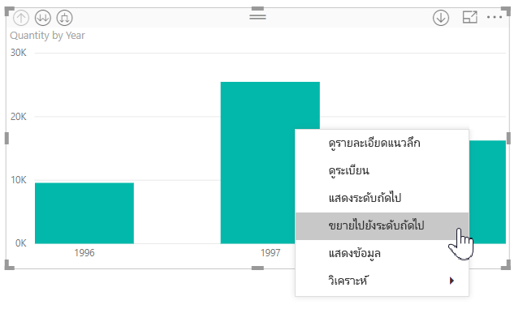
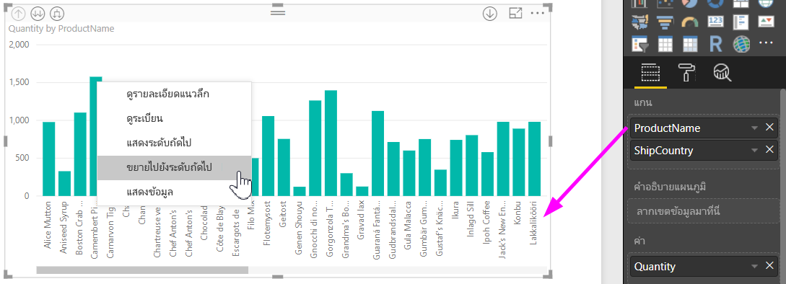
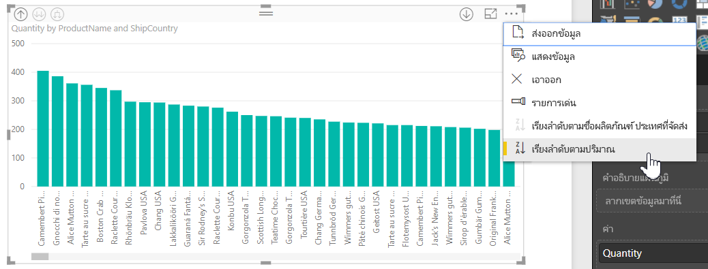

# ใช้ป้ายลำดับชั้นแบบอินไลน์ใน Power BI Desktop
**Power BI Desktop** สนับสนุนการใช้**ป้ายลำดับชั้นแบบอินไลน์** ซึ่งเป็นหนึ่งในสองคุณลักษณะ ที่ปรับปรุงการดูรายละเอียดแบบลำดับชั้นให้ดีขึ้น คุณลักษณะที่สอง ซึ่งอยู่ในขณะนี้อยู่ในระหว่างการพัฒนา คือความสามารถในการใช้ป้ายลำดับชั้นที่ซ้อนกัน (รออีกสักหน่อย - เราอัปเดตอยู่บ่อย ๆ)   

## ป้ายลำดับชั้นแบบอินไลน์ทำงานอย่างไร
ด้วยป้ายลำดับชั้นแบบอินไลน์ คุณสามารถเห็นป้ายลำดับชั้นได้ขณะที่คุณขยายวิชวลโดยใช้คุณลักษณะ**ขยายทั้งหมด** ประโยชน์ที่สำคัญหนึ่งอย่างก็คือ คุณยังสามารถเลือกที่จะ**เรียงลำดับ**ตามป้ายเหล่านี้ เมื่อคุณขยายข้อมูลของคุณตามลำดับชั้น

### การใช้คุณลักษณะขยายที่มีอยู่ในตัว (โดยไม่มีการเรียงลำดับตามป้ายลำดับชั้น)
ก่อนที่เราเห็นการทำงานของป้ายลำดับชั้นแบบอินไลน์ เรามาดูว่าค่าเริ่มต้นคุณลักษณะ**ขยายไปยังระดับถัดไป** ซึ่งจะช่วยให้เราเข้าใจ (และชื่นชม) ว่าป้ายลำดับชั้นแบบอินไลน์มีประโยชน์แค่ไหน

รูปต่อไปนี้แสดงแผนภูมิแท่งสำหรับยอดขายรายปี เมื่อคุณคลิกขวาบนแถบ คุณสามารถเลือก**ขยายไปยังระดับถัดไป**ได้

> [!NOTE]
> แทนที่จะคลิกขวาบนแถบ คุณสามารถเลือกปุ่ม*ขยาย*ที่ด้านบนซ้ายของการแสดงภาพได้

  

ทันทีที่เลือก**ขยายไปยังระดับถัดไป** วิชวลจะขยายลำดับชั้นวันที่จาก*ปี*ไปเป็น*ไตรมาส* ดังที่แสดงในรูปต่อไปนี้

สังเกตว่า ป้าย*ปี*และ*ไตรมาส* จะแสดงแบบอินไลน์เข้าด้วยกัน รูปแบบป้ายนี้ยังดำเนินต่อไปเรื่อยๆ เมื่อคุณ**ขยายทั้งหมด**ลงไปจนถึงลำดับชั้นล่างสุด

นี่คือวิธีการทำงานของลำดับชั้น*วันที่* ที่เชื่อมโยงกับเขตข้อมูลที่มีชนิดข้อมูลเป็น*วันที่/เวลา* เรามาดูในส่วนถัดไป และดูว่าคุณลักษณะป้ายลำดับชั้นแบบอินไลน์ที่เพิ่มมาใหม่แตกต่างกันอย่างไร

### การใช้ป้ายลำดับชั้นแบบอินไลน์
ตอนนี้มาดูที่อีกแผนภูมิหนึ่ง - ที่ใช้ข้อมูลที่มีลำดับชั้นที่ไม่เป็นทางการ ในวิชวลต่อไปนี้ เรามีแผนภูมิแท่ง**ปริมาณ** โดยใช้*ชื่อผลิตภัณฑ์*เป็นแกน ในข้อมูลนี้*ชื่อผลิตภัณฑ์* และ*ประเทศที่ส่งไป* สร้างลำดับชั้นไม่เป็นทางการ จากที่นี่ คุณสามารถเลือก*ขยายไปยังระดับถัดไป* เมื่อต้องการดูข้อมูลแบบละเอียดตามลำดับชั้นลงไป

การเลือก**ขยายไปยังระดับถัดไป** จะแสดงระดับถัดไป ด้วยการแสดงผลป้ายลำดับชั้นแบบอินไลน์ ตามค่าเริ่มต้น ลำดับชั้นแบบอินไลน์ จะเรียงลำดับตามค่าหน่วยวัด – ในกรณีนี้คือ**ปริมาณ** เมื่อเปิดใช้งานป้ายลำดับชั้นแบบอินไลน์ คุณสามารถเลือกที่จะเรียงลำดับข้อมูลนี้ตามลำดับชั้นด้วย โดยการเลือกจุดไข่ปลาในมุมบนขวา ( **...** ), แล้วเลือก**เรียงลำดับตามชื่อผลิตภัณฑ์ ประเทศที่ส่งไป**ดังที่แสดงในรูปต่อไปนี้

ทันทีที่เลือก**ประเทศที่ส่งไป** ข้อมูลมีการเรียงลำดับตามลำดับชั้นที่ไม่เป็นทางการ ดังแสดงในรูปต่อไปนี้

> [!NOTE]
> ป้ายลำดับชั้นแบบอินไลน์ ยังไม่เรียงลำดับชั้นเวลาที่มีอยู่แล้วตามค่าได้ ทำได้เพียงจัดเรียงตามลำดับชั้นเท่านั้น
> 
> 

## การแก้ไขปัญหา
เป็นไปได้ที่วิชวลของคุณ ค้างอยู่ที่ระดับลำดับชั้นแบบอินไลน์ที่ขยายแล้ว ในบางกรณีคุณอาจพบว่า บางวิชวลของคุณค้างอยู่ในโหมดที่ขยายแล้ว และไม่สามารถเลื่อนขึ้นไปยังลำดับชั้นสูงกว่าได้ ซึ่งสามารถเกิดขึ้นได้ถ้าคุณทำขั้นตอนต่อไปนี้ (วิธีการแก้ไขปัญหานี้อยู่*ด้านล่าง*ขั้นตอนที่ก่อให้เกิดปัญหา):

ขั้นตอนที่อาจทำให้วิชวลของคุณค้างอยู่ในสถานะที่ถูกขยาย:

1. คุณเปิดใช้งานคุณลักษณะ**ป้ายลำดับชั้นแบบอินไลน์**
2. คุณสร้างวิชวลบางอย่างที่มีลำดับชั้น
3. แล้วคุณ**ขยายทั้งหมด**และบันทึกไฟล์ของคุณ
4. จากนั้นก็*ปิดใช้งาน*คุณลักษณะ**ป้ายลำดับชั้นแบบอินไลน์** และรีสตาร์ท Power BI Desktop
5. แล้วคุณเปิดไฟล์ของคุณอีกครั้ง

ถ้าคุณบังเอิญทำขั้นตอนเหล่านั้น และวิชวลของคุณจะค้างอยู่ในโหมดขยาย คุณสามารถทำตามขั้นตอนต่อไปนี้เพื่อแก้ไขปัญหา:

1. เปิดใช้งานคุณลักษณะ**ป้ายลำดับชั้นแบบอินไลน์**ใหม่ จากนั้นรีสตาร์ท Power BI Desktop
2. เปิดไฟล์ของคุณอีกครั้ง และเลื่อนขึ้นจนถึงระดับชั้นบนสุดของวิชวลที่ได้รับผลกระทบ
3. บันทึกไฟล์ของคุณ
4. ปิดใช้งานคุณลักษณะ**ป้ายลำดับชั้นแบบอินไลน์** จากนั้นรีสตาร์ท Power BI Desktop
5. เปิดไฟล์ของคุณอีกครั้ง

อีกวิธีหนึ่งคือ คุณสามารถเพียงแค่ลบวิชวลของคุณ แล้วสร้างขึ้นใหม่

