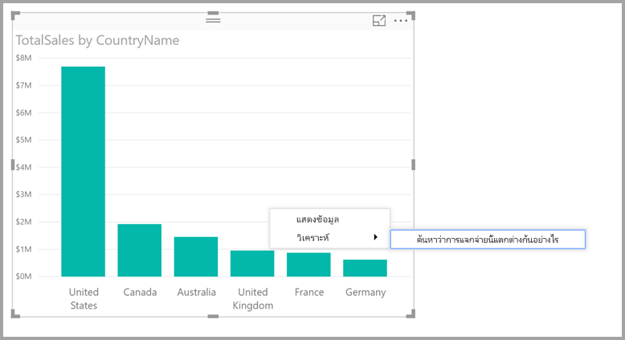
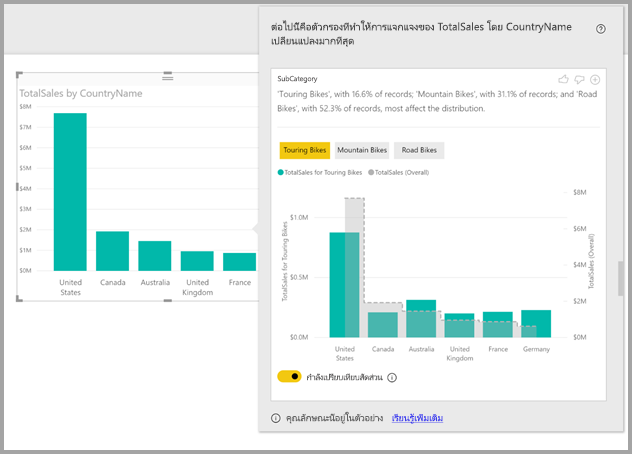

# ใช้ข้อมูลเชิงลึกใน Power BI Desktop เพื่อหาว่าการกระจาย่แตกต่างกันที่ไหน (ตัวอย่าง)

บ่อยครั้งในภาพ คุณจะเห็นจุดข้อมูลและสงสัยว่าการกระจายจะเหมือนกันสำหรับหมวดหมู่ต่างๆหรือไม่ คุณสามารถค้นพบได้ด้วยการคลิกเพียงไม่กี่ครั้งด้วย**ข้อมูลเชิงลึก**ใน**Power BI Desktop**

พิจารณาภาพประกอบต่อไปนี้ซึ่งแสดง*ยอดขายรวม*ตาม*ประเทศ* ตามแผนภูมิที่แสดง ยอดขายส่วนใหญ่มาจากประเทศสหรัฐอเมริกา ซึ่งคิดเป็น 57% ของยอดขายทั้งหมดที่มีส่วนสนับสนุนจากผู้ให้เช่าจากประเทศอื่น ในกรณีดังกล่าวมักจะเป็นที่น่าสนใจในการสำรวจว่าการกระจายเดียวกันนี้จะเกิดขึ้นกับกลุ่มประชากรย่อยที่แตกต่างกันหรือไม่ ตัวอย่างเช่น เหตุการณ์นี้เป็นเช่นเหมือนกันทุกปี ทุกช่องทางการขาย และทุกหมวดหมู่ของผลิตภัณฑ์หรือไม่  ในขณะที่คุณสามารถใช้ตัวกรองที่แตกต่างกันและเปรียบเทียบผลลัพธ์จากการมองด้วยสายตาได้ แต่การทำเช่นนี้อาจทำให้เสียเวลาและเกิดข้อผิดพลาด 

คุณสามารถบอก **Power BI Desktop** ให้หาว่าการกระจายจะแตกต่างกันที่ไหนและได้รับการวิเคราะห์ข้อมูลเชิงลึกที่รวดเร็วโดยอัตโนมัติ เพียงคลิกขวาที่จุดข้อมูล และเลือก **วิเคราะห์ > หาว่าการกระจายนี้ต่างกันตรงไหน** และข้อมูลเชิงลึกจะถูกส่งไปให้คุณในหน้าต่างที่ใช้งานง่าย

ในตัวอย่างนี้ การวิเคราะห์อัตโนมัติแสดงให้เห็นอย่างรวดเร็วว่า สำหรับ*จักรยานทัวร์ริ่ง* สัดส่วนของยอดขายในสหรัฐอเมริกาและแคนาดาจะต่ำลง ในขณะที่สัดส่วนที่มาจากประเทศอื่น ๆ สูงขึ้น   

> [!NOTE]
> คุณลักษณะนี้ยังเป็นแค่ตัวอย่าง และอาจเปลี่ยนแปลงได้ คุณลักษณะข้อมูลเชิงลึก เปิดและทำงานอยู่แล้วตามค่าเริ่มต้น (คุณไม่จำเป็นต้องทำเครื่องหมายที่กล่อง ตัวอย่าง เพื่อเปิดใช้งาน) ตั้งแต่ **Power BI Desktop** เวอร์ชันเดือนกันยายน 2017 เป็นต้นไป
> 
> 

## การใช้ข้อมูลเชิงลึก
เมื่อต้องใช้ข้อมูลเชิงลึกเพื่อหาว่าการกระจายที่เห็นในแผนภูมิแตกต่างกันที่ไหน เพียงคลิกขวาบนจุดข้อมูลใดๆ (หรือบนภาพทั้งหมด), และเลือก**วิเคราะห์ > ค้นหาว่าการกระจายแตกต่างกันตรงไหน**

**Power BI Desktop** จะเรียกใช้อัลกอริทึมการเรียนรู้ กับข้อมูล และเพิ่มวิชวลและคำอธิบายลงในหน้าต่าง ที่ใช้อธิบายว่าหมวดหมู่ใด (คอลัมน์) และค่าใดของคอลัมน์เหล่านี้ทำให้เกิดการกระจายที่แตกต่างกันมากที่สุดอย่างมีนัยสำคัญ ข้อมูลเชิงลึกจะแสดงด้วยแผนภูมิคอลัมน์ ดังแสดงในรูปภาพต่อไปนี้ 

ค่าที่ใช้ตัวกรองที่เลือกจะแสดงโดยใช้สีเริ่มต้นปกติ ค่าค่าโดยรวมตามที่เห็นในภาพเริ่มต้นดั่งเดิมจะแสดงเป็นสีเทาเพื่อให้เปรียบเทียบได้ง่าย คุณสามารถเลือกตัวกรองที่แตกต่างกันได้ถึงสามตัว (*จักรยานทัวร์ริ่ง* *จักรยานเสือภูเขา* *จักรยานเสือหมอบ* สำหรับตัวอย่างนี้) และสามารถเลือกตัวกรองที่แตกต่างกันโดยคลิกที่ตัวกรองเหล่านั้น (หรือใช้ ctrl-click เพื่อเลือกหลายรายการ)

สำหรับค่าวัดทีบวกกันได้แบบง่าย เช่น*ยอดขายรวม*ในตัวอย่างนี้ การเปรียบเทียบจะขึ้นอยู่กับค่าสัมพัทธ์ แทนที่จะเป็นแบบสัมบูรณ์ ดังนั้นในขณะที่ยอดขายของจักรยานทัวร์ริ่งต่ำกว่ายอดขายโดยรวมสำหรับทุกหมวดหมู่ โดยใช้แกนคู่เป็นค่าเริ่มต้นเพื่อให้สามารถเปรียบเทียบระหว่างสัดส่วนของยอดขายในแต่ละประเทศสำหรับจักรยานทัวร์ริ่งและจักรยานทุกประเภทได้  การสลับปุ่ม toggle ด้านล่างจะช่วยให้สามารถแสดงค่าสองค่าในแกนเดียวกันบนภาพได้เพื่อให้สามารถเปรียบเทียบค่าสัมบูรณ์ได้อย่างง่ายดาย (ดังแสดงในรูปต่อไปนี้)    

ข้อความอธิบายยังให้ข้อบ่งชี้ถึงระดับความสำคัญที่อาจติดมากับค่าตัวกรองด้วย ซึ่งให้จำนวนเร็กคอร์ดที่ตรงกับตัวกรอง ดังนั้นในตัวอย่างนี้ คุณจะเห็นได้ว่าในขณะที่การกระจายสำหรับ *จักรยานทัวร์ริ่ง*อาจแตกต่างกันอย่างมีนัยสำคัญ แต่คิดเป็นเพียง 16.6% ของเรกคอร์ดเท่านั้น

ไอคอน*ยกนิ้วโป้งขึ้น*และ*คว่านิ้วโป้งลง* ที่ด้านบนของหน้า ให้คุณเสนอแนะติชมวิชวลและคุณลักษณะนี้ การดำเนินการดังกล่าวมีคำติชม แต่จะไม่ใช่การสอนอัลกอริทึมในปัจจุบันเพื่อให้ส่งผลกระทบต่อผลลัพธ์ที่ส่งกลับเมื่อคุณใช้คุณลักษณะครั้งถัดไป

และที่สำคัญ ปุ่ม **+** ที่ด้านบนของวิชวลช่วย ให้คุณเพิ่มวิชวลที่เลือกลงในรายงานของคุณ ราวกับว่าคุณได้สร้างวิชวลด้วยตัวเอง จากนั้นคุณสามารถจัดรูปแบบ หรือปรับแก้วิชวลที่เพิ่มเข้าไป ได้เหมือนกับที่คุณทำกับวิชวลอื่น ๆ บนรายงานของคุณ คุณสามารถเพิ่มวิชวลเชิงลึกที่เลือกไว้ เมื่อคุณแก้ไขรายงานใน **Power BI Desktop** เท่านั้น

คุณสามารถใช้ข้อมูลเชิงลึกเมื่อรายงานของคุณอยู่ในโหมดอ่าน หรือแก้ไข ทำให้มีความยืดหยุ่นในการวิเคราะห์ข้อมูล และสร้างวิชวลที่คุณสามารถเพิ่มในรายงานของคุณได้อย่างง่ายดายเ

## รายละเอียดของผลลัพธ์ที่ส่งกลับ
คุณสามารถนึกภาพอัลกอริทึมเป็นเป็นคอลัมน์อื่น ๆ ในแบบจำลอง และสำหรับค่าทั้งหมดของคอลัมน์เหล่านั้น ให้นำไปใช้เป็นตัวกรองกับวิชวลเดิม และค้นหาค่าตัวกรองใดที่ก่อให้เกิดผลลัพธ์*ที่แตกต่าง*จากต้นฉบับมากที่สุด

แน่นอน คุณอาจสงสัยว่าอะไรเป็นความหมาย*ที่แตกต่าง* ตัวอย่างเช่น กล่าวว่ายอดขายโดยรวมสามารถแยกเป็นยอดขายของสหรัฐอเมริกาและแคนาดาได้ดังต่อไปนี้:

|ประเทศ  |ยอดขาย ($M)|
|---------|----------|
|สหรัฐอเมริกา      |15        |
|แคนาดา   |5         |

จากนั้นสำหรับหมวดหมู่เฉพาะของผลิตภัณฑ์ *"จักรยานเสือหมอบ*) อาจแยกจากยอดขายเป็น:

|ประเทศ  |ยอดขาย ($M)|
|---------|----------|
|สหรัฐอเมริกา      |3        |
|แคนาดา   |1         |

ในขณะที่ตัวเลขมีความแตกต่างกันในตารางดังกล่าวแต่ละตาราง ค่าสัมพัทธ์ระหว่างสหรัฐอเมริกาและแคนาดามีความเหมือนกัน (75% และ 25% โดยรวมและสำหรับจักรยานเสือหมอบ) ด้วยเหตุนี้จึงไม่ถือว่ามีความแตกต่างกัน สำหรับค่าวัดทีบวกกันได้แบบง่าย เช่น ค่านี้ อัลกอริทึมจะมองหาความแตกต่างใน*ค่าสัมพัทธ์*  

ในทางตรงกันข้าม เมื่อพิจารณาค่าวัด เช่น มาร์จิ้น ซึ่งคำนวณเป็นกำไร/ต้นทุน จะสามารถบอกได้ว่ามาร์จิ้นโดยรวมสำหรับสหรัฐอเมริกาและแคนาดาเป็นดังต่อไปนี้

|ประเทศ  |มาร์จิ้น (%)|
|---------|----------|
|สหรัฐอเมริกา      |15        |
|แคนาดา   |5         |

จากนั้นสำหรับหมวดหมู่เฉพาะของผลิตภัณฑ์ *"จักรยานเสือหมอบ*) อาจแยกจากยอดขายเป็น:

|ประเทศ  |มาร์จิ้น (%)|
|---------|----------|
|สหรัฐอเมริกา      |3        |
|แคนาดา   |1         |

เมื่อพิจารณาถึงลักษณะของค่าวัดดังกล่าว*ถือว่า*แตกต่างกันอย่างน่าสนใจ ดังนั้น สำหรับค่าวัดทีบวกกันไม่ได้ เช่นตัวอย่างนี้คือมาร์จิ้น อัลกอริทึมจะมองหาความแตกต่างในค่าสัมบูรณ์

ภาพที่ปรากฏมีวัตถุประสงค์เพื่อแสดงให้เห็นถึงความแตกต่างที่พบระหว่างการกระจายโดยรวม (ตามที่เห็นในภาพต้นฉบับ) และค่าที่ใช้ตัวกรองเฉพาะได้อย่างชัดเจน  

ดังนั้นสำหรับค่าวัดทีบวกกัน เช่น*ยอดขาย*ในตัวอย่างก่อนหน้าจะใช้แผนภูมิเส้นและคอลัมน์โดยใช้แกนคู่ที่มีการปรับขนาดอย่างเหมาะสมเพื่อให้สามารถเปรียบเทียบค่าสัมพัทธ์ได้อย่างง่ายดาย คอลัมน์แสดงค่าด้วยตัวกรองที่ใช้ และเส้นแสดงค่าโดยรวม (โดยมีแกนคอลัมน์อยู่ทางด้านซ้ายและแกนเส้นด้านขวาตามปกติ) เส้นจะถูกแสดงในลักษณะที่เป็น*ขั้น*และมีเส้นประสีเทา สำหรับตัวอย่างก่อนหน้านี้ ถ้าค่าสูงสุดของแกนคอลัมน์คือ 4 และค่าแกนเส้นสูงสุดเท่ากับ 20 จะทำให้สามารถเปรียบเทียบค่าสัมพัทธ์ระหว่างค่าที่กรองและค่าโดยรวมของสหรัฐอเมริกาและแคนาดาได้อย่างง่ายดาย 

ในทำนองเดียวกัน สำหรับค่าวัดทีบวกกันไม่ได้ เช่น*มาร์จิ้น* ในตัวอย่างก่อนหน้า จะใช้แผนภูมิเส้นและคอลัมน์โดยใช้แกนเดี่ยว เพื่อให้สามารถเปรียบเทียบค่าสัมบูรณ์ได้อย่างง่าย นอกจากนั้น เส้น (สีเทา) ยังแสดงค่าโดยรวมด้วย ไม่ว่าจะเป็นการเปรียบเทียบตัวเลขที่เกิดขึ้นจริงหรือตัวเลขสัมพัทธ์ แต่การกำหนดระดับที่ซึ่งการกระจายทั้งสองมีความแตกต่างกันไม่ได้เป็นเรื่องของการคำนวณความแตกต่างของค่าเพียงอย่างเดียว ตัวอย่างเช่น:

* ขนาดของประชากรที่เป็นปัจจัยมีความแตกต่างกันอย่างมีนัยสำคัญทางสถิติและไม่ค่อยน่าสนใจหากใช้กับประชากรกลุ่มเล็กกว่าเมื่อเทียบกับประชากรโดยรวม ตัวอย่างเช่น การกระจายของยอดขายในแต่ละประเทศอาจแตกต่างกันมากสำหรับผลิตภัณฑ์เฉพาะบางรายการ ซึ่งจะไม่ถือว่าน่าสนใจหากมีผลิตภัณฑ์นับพันรายการและด้วยเหตุนี้ผลิตภัณฑ์เฉพาะจึงคิดเป็นเพียงส่วนน้อยของยอดขายโดยรวม

* ความแตกต่างสำหรับหมวดหมู่ที่มีค่าเดิมสูงมากหรือใกล้เคียงกับศูนย์อย่างมากจะถูกถ่วงน้ำหนักมากกว่าค่าอื่น ตัวอย่างเช่น หากประเทศมีส่วนสนับสนุนโดยรวมเพียง 1% ของยอดขาย แต่สำหรับผลิตภัณฑ์เฉพาะบางรายการมีส่วนสนับสนุน 6% นั่นหมายความว่ามีนัยสำคัญทางสถิติมากกว่าและถือเป็นที่น่าสนใจมากกว่าประเทศที่มีส่วนสนับสนุนเปลี่ยนจาก 50% เป็น 55% 

* วิทยาการศึกษาสำนึกแบบต่างๆ จะถูกนำมาใช้เพื่อเลือกผลลัพธ์ที่มีความหมายมากที่สุด เช่น โดยการพิจารณาความสัมพันธ์ระหว่างข้อมูลอื่นๆ
     
หลังจากตรวจสอบคอลัมน์ที่แตกต่างกัน และจะกำหนดค่าที่ให้ความแตกต่างมากที่สุดสำหรับคอลัมน์แต่ละคอลัมน์ เพื่อให้ง่ายต่อการทำความเข้าใจ ข้อมูลเหล่านี้จะถูกจัดกลุ่มตามคอลัมน์โดยคอลัมน์ที่ให้ค่าความแตกต่างมากที่สุดจะอยู่ลำดับแรก สามารถแสดงค่าได้สูงสุดสามค่าต่อคอลัมน์ แต่อาจแสดงน้อยลงหากมีค่าที่ส่งผลกระทบขนาดใหญ่น้อยกว่าสามค่า หรือถ้าค่าบางค่ามีผลกระทบมากกว่าค่าอื่นๆ อย่างเห็นได้ชัด 

ซึ่งไม่จำเป็นว่าคอลัมน์ทั้งหมดในแบบจำลองจะได้รับการตรวจสอบในเวลาที่มีอยู่ ดังนั้นจึงไม่รับประกันว่าคอลัมน์และค่าที่มีผลกระทบมากที่สุดจะปรากฏขึ้น อย่างไรก็ตาม วิทยาการศึกษาสำนึกแบบต่างๆ จะถูกนำมาใช้เพื่อให้แน่ใจว่าคอลัมน์ที่เป็นไปได้มากที่สุดจะได้รับการตรวจสอบก่อน ตัวอย่างเช่น สมมติว่าหลังจากตรวจสอบคอลัมน์ทั้งหมดจะพิจารณาว่าคอลัมน์/ค่าต่อไปนี้มีผลกระทบมากที่สุดต่อการกระจ่ายจากผลกระทบมากที่สุดไปจนถึงน้อยที่สุด:

    Subcategory = Touring Bikes
    Channel = Direct
    Subcategory = Mountain Bikes
    Subcategory = Road Bikes
    Subcategory = Kids Bikes
    Channel = Store

คอลัมน์เหล่านี้จะถูกนำมาจัดลำดับ ดังนี้

    Subcategory: Touring Bikes, Mountain Bikes, Road Bikes (only three listed, with the text including “...amongst others” to indicate that more than three have a significant impact) 

    Channel = Direct (only Direct listed, if it’s level of impact was much greater than Store)

## ข้อควรพิจารณาและข้อจำกัด
รายการต่อไปนี้ คือสถานการณ์ที่**ข้อมูลเชิงลึก**ยังไม่รองรับ:

* ตัวกรอง TopN
* ตัวกรองหน่วยวัด
* หน่วยวัดที่ไม่ใช่ตัวเลข
* ใช้ "แสดงค่าเป็น"
* การวัดที่กรองแล้ว - การวัดที่กรองแล้วคือการคำนวณระดับชั้นด้วยสายตาโดยใช้ตัวกรองเฉพาะ (ตัวอย่างเช่น *ยอดขายรวมสำหรับประเทศฝรั่งเศส*) และใช้กับภาพจริงบางส่วนที่สร้างโดยคุณลักษณะข้อมูลเชิงลึก

นอกจากนี้ ข้อมูลเชิงลึกยังไม่สนับสนุน รูปแบบข้อมูลและแหล่งข้อมูลต่อไปนี้

* DirectQuery
* เชื่อมต่อสด
* Reporting Services ในองค์กร
* การฝังตัว

## ขั้นตอนถัดไป
สำหรับข้อมูลเพิ่มเติมเกี่ยวกับ **Power BI Desktop** และวิธีการเริ่มต้นใช้งาน ตรวจสอบบทความต่อไปนี้

* [Power BI Desktop คืออะไร](desktop-what-is-desktop.md)
* [ภาพรวมคิวรี่กับ Power BI Desktop](desktop-query-overview.md)
* [แหล่งข้อมูลใน Power BI Desktop](desktop-data-sources.md)
* [เชื่อมต่อกับข้อมูลใน Power BI Desktop](desktop-connect-to-data.md)
* [จัดรูปร่างและรวมข้อมูลด้วย Power BI Desktop](desktop-shape-and-combine-data.md)
* [งานคิวรี่ที่ใช้บ่อยใน Power BI Desktop](desktop-common-query-tasks.md)   

