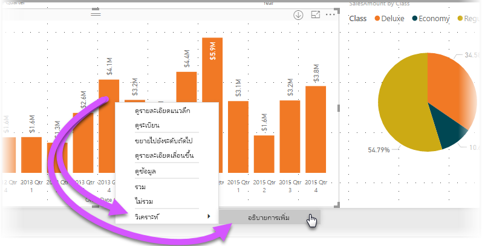

# ใช้ข้อมูลเชิงลึกใน Power BI Desktop (ตัวอย่าง)
คุณสามารถบอก **Power BI Desktop** ให้อธิบายการเพิ่มขึ้นหรือลดลงในแผนภูมิ และได้รับการวิเคราะห์ที่ รวดเร็ว อัตโนมัติ และลึกซึ้งเกี่ยวกับข้อมูลของคุณ เพียงแค่คลิกขวาบนจุดข้อมูล แล้วเลือก**วิเคราะห์ > อธิบายการลดลง**(หรือ เพิ่มขึ้น ถ้าแท่งก่อนหน้ามีค่าน้อยกว่า) ข้อมูลเชิงลึกจะถูกส่งถึงคุณในหน้าต่างที่ใช้งานได้ง่าย ๆ

คุณลักษณะข้อมูลเชิงลึก มีบริบทและขึ้นกับจุดข้อมูลก่อนหน้า - เช่นแท่งก่อนหน้า หรือคอลัมน์ก่อนหน้า

> [!NOTE]
> คุณลักษณะนี้ยังเป็นแค่ตัวอย่าง และอาจเปลี่ยนแปลงได้ คุณลักษณะข้อมูลเชิงลึก เปิดและทำงานอยู่แล้วตามค่าเริ่มต้น (คุณไม่จำเป็นต้องทำเครื่องหมายที่กล่อง ตัวอย่าง เพื่อเปิดใช้งาน) ตั้งแต่ **Power BI Desktop** เวอร์ชันเดือนกันยายน 2017 เป็นต้นไป
> 
> 

## การใช้ข้อมูลเชิงลึก
เพื่อใช้ข้อมูลเชิงลึก ให้คลิกขวาบนจุดข้อมูลใด ๆ ในแท่งหรือเส้นตรงของวิชวล และเลือก**วิเคราะห์ > อธิบายการเพิ่มขึ้น** (หรือ*อธิบายการ ลดลง* เนื่องจากข้อมูลเชิงลึกทั้งหมดจะอาศัยการเปลี่ยนแปลงจากจุดข้อมูลก่อนหน้านี้)

**Power BI Desktop** จะเรียกใช้อัลกอริทึมการเรียนรู้ กับข้อมูล และเพิ่มวิชวลและคำอธิบายลงในหน้าต่าง ที่ใช้อธิบายว่าข้อมูลประเภทไหนส่งผลต่อการเพิ่มขึ้นหรือลดลงมากที่สุด ตามค่าเริ่มต้น ข้อมูลเชิงลึกจะแสดงด้วย*แผนภูมิแบบน้ำตก* ดังแสดงในรูปต่อไปนี้

โดยการเลือกไอคอนขนาดเล็กที่ด้านล่างของแผนแบบภูมิน้ำตก คุณสามารถเลือกให้แสดงข้อมูลเชิงลึก เป็น แผนภูมิกระจาย แผนภูมิคอลัมน์แบบเรียงซ้อน หรือแผนภูมิ ribbon

ไอคอน*ยกนิ้วโป้งขึ้น*และ*คว่านิ้วโป้งลง* ที่ด้านบนของหน้า ให้คุณเสนอแนะติชมวิชวลและคุณลักษณะนี้

และที่สำคัญ ปุ่ม **+** ที่ด้านบนของวิชวลช่วย ให้คุณเพิ่มวิชวลที่เลือกลงในรายงานของคุณ ราวกับว่าคุณได้สร้างวิชวลด้วยตัวเอง จากนั้นคุณสามารถจัดรูปแบบ หรือปรับแก้วิชวลที่เพิ่มเข้าไป ได้เหมือนกับที่คุณทำกับวิชวลอื่น ๆ บนรายงานของคุณ คุณสามารถเพิ่มวิชวลเชิงลึกที่เลือกไว้ เมื่อคุณแก้ไขรายงานใน **Power BI Desktop** เท่านั้น

คุณสามารถใช้ข้อมูลเชิงลึกเมื่อรายงานของคุณอยู่ในโหมดอ่าน หรือแก้ไข ทำให้มีความยืดหยุ่นในการวิเคราะห์ข้อมูล และสร้างวิชวลที่คุณสามารถเพิ่มในรายงานของคุณได้อย่างง่ายดายเ

## ข้อควรพิจารณาและข้อจำกัด
เนื่องจากข้อมูลเชิงลึกจะขึ้นกับการเปลี่ยนแปลงจากจุดข้อมูลก่อนหน้า จะไม่มีให้ใช้งานถ้าคุณเลือกจุดข้อมูลแรกในวิชวล 

รายการต่อไปนี้ คือสถานการณ์ที่**ข้อมูลเชิงลึก**ยังไม่รองรับ:

* ตัวกรอง TopN
* ตัวกรอง รวม/ไม่รวม
* ตัวกรองหน่วยวัด
* หน่วยวัดและการรวมที่บวกไม่ได้
* แสดงค่าเป็น
* หน่วยวัดที่กรองแล้ว (เป็นสิ่งใหม่ที่ใช้ในแผนภูมิกระจายสำหรับข้อมูลเชิงลึก)
* คอลัมน์ประเภทที่ใช้เป็นแกน X เว้นแต่ว่าจะกำหนดการเรียงลำดับตามคอลัมน์ที่เป็นสเกลา ถ้ามีการใช้ลำดับชั้น ทุกคอลัมน์ในลำดับชั้นที่ใช้งานจะต้องตรงกับเงื่อนไขนี้
* หน่วยวัดที่ไม่ใช่ตัวเลข

นอกจากนี้ ข้อมูลเชิงลึกยังไม่สนับสนุน รูปแบบข้อมูลและแหล่งข้อมูลต่อไปนี้

* DirectQuery
* เชื่อมต่อสด
* Reporting Services ในองค์กร
* การฝังตัว

## ขั้นตอนถัดไป
สำหรับข้อมูลเพิ่มเติมเกี่ยวกับ **Power BI Desktop** และวิธีการเริ่มต้นใช้งาน ตรวจสอบบทความต่อไปนี้

* [เริ่มต้นใช้งาน Power BI Desktop](desktop-getting-started.md)
* [ภาพรวมคิวรี ด้วย Power BI Desktop](desktop-query-overview.md)
* [แหล่งข้อมูลใน Power BI Desktop](desktop-data-sources.md)
* [เชื่อมต่อกับข้อมูลใน Power BI Desktop](desktop-connect-to-data.md)
* [จัดรูปร่างและรวมข้อมูลด้วย Power BI Desktop](desktop-shape-and-combine-data.md)
* [งานคิวรี่ที่ใช้บ่อยใน Power BI Desktop](desktop-common-query-tasks.md)   

