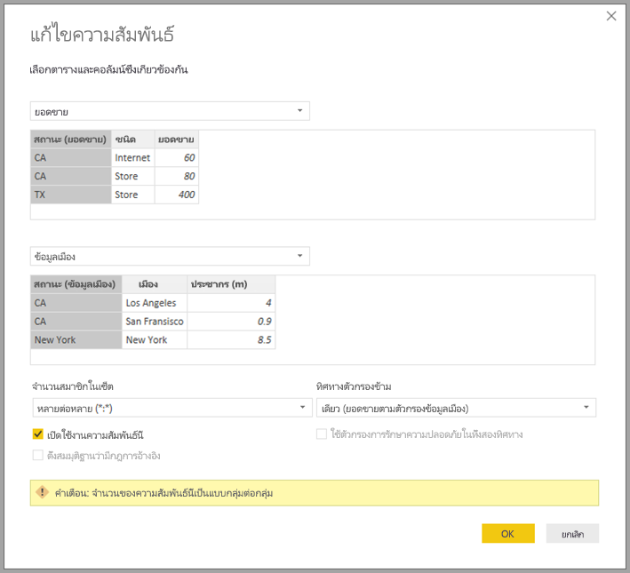

# ความสัมพันธ์แบบกลุ่ม-ต่อ-กลุ่มคาร์ดินัลลิตี้ใน Power BI Desktop

ด้วยคุณลักษณะ *ความสัมพันธ์แบบกลุ่ม-ต่อ-กลุ่มคาร์ดินัลลิตี้* ใน Power BI Desktop คุณสามารถเข้าร่วมตารางที่ใช้คาร์ดินาลลิตี้ของ *กลุ่มต่อกลุ่ม* คุณสามารถสร้างโมเดลข้อมูลที่มีสองแหล่งข้อมูลหรือมากกว่าได้อย่างง่ายดาย คุณลักษณะ *ความสัมพันธ์แบบกลุ่ม-ต่อ-กลุ่มคาร์ดินัลลิตี้* คือหนึ่งในความสามารถของ *โมเดลรวม* ที่มากกว่าใน Power BI Desktop

ความสามารถของ *ความสัมพันธ์แบบกลุ่ม-ต่อ-กลุ่มคาร์ดินัลลิตี้* ใน Power BI Desktop ถือเป็นหนึ่งใน 3 คุณลักษณะที่เกี่ยวข้อง:

* **โมเดลแบบรวม**: อนุญาตให้รายงานมีการเชื่อมต่อข้อมูลตั้งแต่สองแบบขึ้นไป รวมถึงการเชื่อมต่อ DirectQuery หรือการนำเข้า ในรูปแบบใดๆ ก็ตาม สำหรับข้อมูลเพิ่มเติม โปรดดู [การรวมโมเดลใน Power BI Desktop (ตัวอย่าง)](desktop-composite-models.md)

* **ความสัมพันธ์แบบกลุ่ม-กลุ่มคาร์ดิลิตี้**: ด้วย *โมเดลแบบรวม* คุณสามารถสร้าง *ความสัมพันธ์แบบกลุ่ม-ต่อ-กลุ่มคาร์ดินัลลิตี* ระหว่างตารางได้ วิธีการนี้จะลบขอคำสำหรับค่าเฉพาะในตาราง นอกจากนี้ยังลบการแก้ปัญหาชั่วคราวก่อนหน้า เช่น การเริ่มตารางใหม่เพียงเพื่อสร้างความสัมพันธ์ จะอธิบายคุณลักษณะต่อไปในบทความนี้

* **โหมดการจัดเก็บข้อมูล**: คุณสามารถระบุวิชวลที่ต้องการคิวรีไปยังแหล่งข้อมูลระบบ Back-end ได้ วิชวลที่ไม่ต้องใช้คิวรีจะถูกนำเข้าแม้ว่าจะมาจาก DirectQuery คุณลักษณะนี้จะช่วยปรับปรุงประสิทธิภาพ และลดการโหลดระบบ Back-end ก่อนหน้านี้ แม้กระทั่งวิชวลพื้นฐาน อย่าง Slicers ก็เริ่มคิวรีที่ถูกส่งไปยังแหล่งระบบ Back-end สำหรับข้อมูลเพิ่มเติม โปรดดู [โหมดที่เก็บข้อมูลใน Power BI Desktop (ตัวอย่าง)](desktop-storage-mode.md)

## *การแก้ไขปัญหาของความสัมพันธ์แบบกลุ่ม-กลุ่มคาร์ดิลิตี้*

ก่อนที่คุณลักษณะ *ความสัมพันธ์แบบกลุ่ม-ต่อ-กลุ่มคาร์ดินัลลิตี้*  จะให้บริการ ความสัมพันธ์ระหว่างสองตารางถูกกำหนดใน Power BI อย่างน้อยหนึ่งในคอลัมน์ของตารางที่อยู่ในความสัมพันธ์ต้องมีค่าเฉพาะ แต่บ่อยครั้งที่ไม่มีคอลัมน์ที่มีค่าเฉพาะ 

ตัวอย่างเช่น ทั้งสองตารางอาจมีคอลัมน์ชื่อ *ประเทศ* แต่ค่าของ *ประเทศ* ไม่ได้เป็นค่าเฉพาะในตารางใดๆ การสร้างการแก้ปัญหาชั่วคราวจึงจำเป็นสำหรับการเชื่อมตารางแบบนี้ หนึ่งในการแก้ปัญหาชั่วคราวนั้นอาจเป็นการเพิ่มตารางเข้าไปในโมเดลด้วยค่าเฉพาะที่จำเป็น ด้วยคุณลักษณะ *ความสัมพันธ์แบบกลุ่ม-ต่อ-กลุ่ม* คุณสามารถรวมตารางแบบนี้โดยตรงได้โดยการใช้ความสัมพันธ์กับคาร์ดินาลลิตี้ของ **กลุ่ม-ต่อ-กลุ่ม**  

## *ใช้ความสัมพันธ์กับความเป็นหัวใจจำนวนมาก*

เมื่อทำการกำหนดความสัมพันธ์ระหว่างตารางสองตารางใน Power BI คุณจะต้องกำหนดคาร์ดินาลลิตี้ของความสัมพันธ์ ตัวอย่างเช่น ความสัมพันธ์ระหว่าง *ProductSales* กับ *ผลิตภัณฑ์*&mdash; ที่ใช้คอลัมน์ *ProductSales[ProductCode]* และ *Product[ProductCode]*&mdash; จะกำหนดให้เป็น *Many-1* เรากำหนดความสัมพันธ์ด้วยวิธีนี้เพราะมีการขายมากมายของแต่ละผลิตภัณฑ์ และคอลัมน์ในตาราง *ผลิตภัณฑ์* *(ProductCode)* เป็นคอลัมน์เฉพาะ เมื่อคุณกำหนดความสัมพันธ์คาร์ดินาลลิตี้เป็น *Many-1*, *1-Many* หรือ *1-1* Power BI จะตรวจสอบเพื่อช่วยยืนยันว่าคาร์ดินาลลิตี้ที่คุณเลือกตรงกับข้อมูลจริง

ตัวอย่างเช่น ลองดูโมเดลง่ายๆ ในภาพต่อไปนี้:

สมมติว่าตาราง *ผลิตภัณฑ์* แสดงเพียงสองแถวดังภาพ:

และสมมติว่าตาราง *การขาย* มีเพียงสี่แถวซึ่งรวมถึงแถวสำหรับผลิตภัณฑ์ C เนื่องจากข้อผิดพลาดของกฎการอ้างอิงจึงไม่มีแถวของผลิตภัณฑ์ C ในตาราง *ผลิตภัณฑ์*

*ProductName* และ *ราคา* (จากตาราง *ผลิตภัณฑ์*) กับ *Qty* ทั้งหมดสำหรับแต่ละผลิตภัณฑ์ (จากตาราง *ProductSales*) จะแสดงดังภาพ: 

ดังที่เห็นในภาพก่อน มีช่องว่างแถว *ProductName* ที่สัมพันธ์กับการขายสำหรับผลิตภัณฑ์ C แถวว่างสามารถอธิบายได้ดังต่อไปนี้:

* แถวใดๆ ในตาราง *ProductSales* ที่ไม่สอดคล้องกับแถวอยู่ในตาราง *ผลิตภัณฑ์* พบปัญหากฎการอ้างอิงดังที่เห็นผลิตภัณฑ์ *C* ในตัวอย่างนี้

* แถวใดๆ ในตาราง *ProductSales* ที่คอลัมน์คีย์นอกเป็น Null 

เนื่องด้วยเหตุผลดังกล่าว ในทั้งสองกรณีแถวที่เว้นว่างมีสาเหตุมาจากการขายที่ไม่ทราบ *ProductName* และ *ราคา*

ซึ่งบางครั้งก็เกิดขึ้นจากการที่ตารางถูกรวมเข้าด้วยกันโดยคอลัมน์สองคอลัมน์ แต่ไม่มีคอลมน์ใดที่เป็นค่าเฉพาะเลย ตัวอย่างเช่น ลองพิจารณานิพจน์ DAX ต่อไปนี้:

* ตาราง *การขาย* แสดงข้อมูลการขายตาม *รัฐ* และแต่ละแถวมีจำนวนการขายของประเภทการขายในรัฐนั้นๆ รัฐรวมถึง CA, WA และ TX 

    

* ตาราง *CityData* แสดงข้อมูลเกี่ยวกับเมืองรวมทั้งประชากรและรัฐ (รวมถึง CA, WA และนิวยอร์ก)

    

แม้ว่าจะมีคอลัมน์สำหรับ *รัฐ* ในทั้งสองตาราง และเป็นเรื่องสมเหตุสมผลที่ต้องการรายงานเกี่ยวกับการขายทั้งหมดตามรัฐ และประชากรทั้งหมดของแต่ละรัฐ แต่ก็มีปัญหาอยู่นั่นคือ คอลัมน์ *รัฐ* ไม่ได้เป็นค่าเฉพาะในตารางๆ 

## การแก้ปัญหาชั่วคราวก่อนหน้านี้

ในเวอร์ชัน Power BI Desktop ก่อนหน้าเวอร์ชันที่ปล่อยตัวในเดือนกรกฎาคม 2018 ผู้ใช้ไม่สามารถสร้างความสัมพันธ์โดยตรงระหว่างตารางเหล่านี้ได้ การแก้ปัญหาชั่วคราวทั่วไปถูกนำมาใช้ดังต่อไปนี้:

* สร้างตารางที่สามที่มีเพียง ID *รัฐ* เฉพาะเท่านั้น อาจเป็นตารางทั้งหมดหรือตารางใดตารางหนึ่งดังต่อไปนี้:
  * ตารางการคำนวณ (กำหนดโดยการใช้ Data Analysis Expressions [DAX])
  * ตารางจากคิวรีที่ถูกกำหนดในตัวแก้ไขคิวรี ซึ่งอาจแสดง ID เฉพาะที่ดึงมาจากตารางใดตารางหนึ่ง
  * ชุดรวมต็มรูปแบบ

* เชื่อมโยงสองตารางเดิมเข้ากับตารางใหม่ โดยใช้ความสัมพันธ์แบบ *Many-1* ทั่วไป

คุณสามารถปล่อยการแก้ปัญหาชั่วคราวไว้หรือซ่อนเพื่อไม่ให้ปรากฏในรายการ **เขตข้อมูล** ก็ได้ หากคุณซ่อนตาราง ความสัมพันธ์ *Many-1* จะถูกตั้งค่าไปยังตัวกรองในสองทิศทาง และคุณสามารถใช้เขตข้อมูล *รัฐ* จากทั้งสองตารางได้ การกรองเชื่อมโยงที่ตามมาจะเผยแพร่ไปยังตารางอื่น วิธีการนี้แสดงตามภาพต่อไปนี้:

วิชวลที่แสดง *รัฐ* (จากตาราง *CityData*) กับจำนวน *ประชากร* ทั้งหมด และ *การขาย* ทั้งหมด จะปรากฏดังนี้:

> [!NOTE]
> เนื่องจากรัฐจากตาราง *CityData* ถูกใช้ในการแก้ปัญหาชั่วคราว จึงมีเพียงรัฐในตารางนั้นเท่านั้นที่แสดงในรายการ เพราะฉะนั้นจะไม่มี TX นอกจากนี้ สิ่งที่ไม่เหมือนกับความสัมพันธ์แบบ *Many-1* ก็คือในขณะที่แถวทั้งหมดรวม *การขาย* ทั้งหมด (รวมถึงของ TX) รายละเอียดจะไม่รวมแถวที่เว้นว่างซึ่งครอบคลุมแถวที่ไม่ตรงกันดังกล่าว เช่นเดียวกัน จะไม่มีแถวที่เว้นว่างที่ครอบคลุม *การขาย* ใดๆ ซึ่งมีค่า Null สำหรับ *รัฐ*

ถ้าคุณเพิ่ม *เมือง* ไปยังวิชวลนั้นแม้ว่าทราบประชากรต่อ *เมือง* *การขาย* ที่แสดง *เมือง* จะซ้ำกับ *การขาย* ที่สอดคล้องกับ *รัฐ* กรณีนี้ถือเป็นกรณีปกติเมื่อการจัดกลุ่มในคอลัมน์ไม่เชื่อมโยงกับบางหน่วยวัดการรวมดังแสดงในภาพต่อไปนี้:

หากกำหนดตาราง *การขาย* ใหม่เป็นการรวมของ *รัฐ*ทั้งหมดในการแก้ปัญหาชั่วคราวนี้ และทำให้มองเห็นในรายการ **เขตข้อมูล** วิชวลตัวเดียวกันนี้จะแสดงทั้ง *รัฐ* (บนตารางใหม่) และ *ประชากร* ทั้งหมด และ *การขาย* ทั้งหมดดังแสดงในภาพต่อไปนี้:

ดังที่เห็น *TX*&mdash;กับข้อมูล *การขาย* แต่ไม่ทราบข้อมูล *ประชากร* &mdash;และ *นิวยอร์ก*&mdash;กับข้อมูล *ประชากร* ที่ทราบแต่ไม่มีข้อมูล *การขาย* &mdash;จะรวมอยู่ด้วย การแก้ปัญหาชั่วคราวนี้ไม่เหมาะสม และมีหลายปัญหา ด้วยการมาถึงของความสัมพันธ์แบบกลุ่ม-ต่อ-กลุ่มคาร์ดินัลลิตี้ ปัญหาที่เกิดขึ้นได้รับการแก้ไข ดังที่อธิบายในส่วนถัดไป

## ใช้*ความสัมพันธ์กับจำนวนนับแบบกลุ่มคาร์ดินัลลิต*แทนการแก้ไขปัญหาชั่วคราว

จากเวอร์ชัน Power BI Desktop เดือนกรกฎาคม 2018 คุณสามารถเชื่อมตารางได้โดยตรงดังเช่นที่อธิบายไว้ข้างต้นโดยไม่ต้องพึ่งการแก้ปัญหาชั่วคราวที่คล้ายกัน สามารถตั้งค่าความสัมพันธ์คาร์ดินาลลิตี้แบบ *กลุ่ม-ต่อ-กลุ่ม* ได้แล้ว การตั้งค่านี้บ่งบอกว่าไม่มีตารางใดที่มีค่าเฉพาะ ในความสัมพันธ์เช่นนั้น คุณยังสามารถควบคุมว่าตารางใดที่จะกรองอีกตาราง หรือใช้การกรองแบบสองทิศซึ่งแต่ละตารางจะกรองอีกตารางหนึ่ง  

ใน Power BI Desktop คาร์ดินาลลิตี้จะใช้ *กลุ่มต่อกลุ่ม* เป็นค่าเริ่มต้น เมื่อโปรแกรมพบว่าไม่มีตารางใดที่มีค่าเฉพาะสำหรับคอลัมน์ในความสัมพันธ์ ในกรณีเช่นนั้นจะมีคำเตือนปรากฏขึ้น เพื่อยืนยันว่าคุณตั้งใจตั้งค่าความสัมพันธ์ ซึ่งไม่ใช่ผลที่ไม่ได้ตั้งใจจากปัญหาด้านข้อมูล 

ตัวอย่างเช่น เมื่อคุณสร้างความสัมพันธ์โดยตรงระหว่าง *CityData* และ *การขาย*&mdash;ซึ่งตัวกรองควรไหลจาก *CityData* ไปยัง *การขาย*&mdash;Power BI Desktop จะแสดงหน้าต่าง **แก้ไขความสัมพันธ์** ดังภาพต่อไปนี้:

**มุมมองความสัมพันธ์** ที่ปรากฏจะแสดงความสัมพันธ์แบบกลุ่มต่อกลุ่มโดยตรงระหว่างสองตาราง ลักษณะของตารางในรายการ **เขตข้อมูล** และการทำงานที่ตามมาเมื่อสร้างวิชวลจะคล้ายกับเมื่อใช้การแก้ปัญหาชั่วคราว ในการแก้ปัญหาชั่วคราว จะมองไม่เห็นตารางพิเศษที่แสดงข้อมูล *รัฐ* ที่แตกต่างชัดเจน ตัวอย่างเช่น ดังที่อธิาบายไปข้างต้น วิชวลที่แสดงข้อมูล *รัฐ*, *ประชากร* และ *การขาย* จะแสดงดังต่อไปนี้:

ความแตกต่างที่สำคัญระหว่างความสัมพันธ์แบบ *กลุ่มต่อกลุ่มคาร์ดินัลลิตี้* กับความสัมพันธ์แบบ *Many-1* ทั่วไปมีดังนี้:

* ค่าที่แสดงไม่รวมแถวว่างที่เป็นเหตุของแถวที่ไม่ตรงในตารางอื่น หรือค่าที่เป็นเหตุของแถวที่คอลัมน์ถูกใช้ในความสัมพันธ์ในตารางอื่นเป็น Null
* ไม่สามารถใช้คุณลักษณะ `RELATED()`ฟังก์ชันได้เนื่องจากมีแถวมากกว่าหนึ่งแถวที่อาจเกี่ยวข้อง
* การใช้ `ALL()` ฟังก์ชันบนตารางไม่ได้เป็นการลบตัวกรองที่ใช้กับตารางอื่นๆ ที่เชื่อมโยงโดยความสัมพันธ์แบบกลุ่ม-ต่อ-กลุ่ม ในตัวอย่างก่อนหน้า การวัดที่กำหนดดังแสดงในสคริปต์ต่อไปนี้จะไม่ลบตัวกรองบนคอลัมน์ในตาราง *CityData* ที่เชื่อมโยง:

    

    วิชวลที่แสดงข้อมูล *รัฐ*, *การขาย* และ *การขายทั้งหมด* จะเป็นดังนี้:

    

ด้วยการคำนึงถึงความแตกต่างก่อนหน้านี้ ตรวจสอบให้แน่ใจว่าการคำนวณที่ใช้ `ALL(\<Table>)` เช่น *% ของยอดรวม* กำลังส่งกลับผลลัพธ์ที่เจาะจงไว้ 

## ข้อจำกัดและข้อควรพิจารณา

มีข้อจำกัดบางอย่างสำหรับการวางจำหน่าย*ความสัมพันธ์กับจำนวนนับแบบกลุ่มคาร์ดินัลลิตี้* และโมเดลแบบรวม

แหล่งที่มา Live Connect (หลายมิติ) ดังต่อไปนี้ไม่สามารถใช้กับโมเดลแบบรวมได้:

* SAP HANA
* SAP Business Warehouse
* SQL Server Analysis Services
* ชุดข้อมูล Power BI
* Azure Analysis Services

เมื่อทำการเชื่อมต่อกับแหล่งที่มาหลายมิติเหล่านี้โดยใช้ DirectQuery คุณจะไม่สามารถเชื่อมต่อกับแหล่งที่มา DirectQuery อีกแห่ง หรือรวมเข้ากับข้อมูลที่นำเข้าได้

ข้อจำกัดในการใช้ DirectQuery ที่ยังมีอยู่จะยังคงมีผลเมื่อใช้ *ความสัมพันธ์แบบกลุ่ม-ต่อ-กลุ่มคาร์ดินัลลิตี้*  ข้อจำกัดจำนวนมากเหล่านี้เป็นข้อจำกัดต่อตาราง โดยขึ้นอยู่กับโหมดที่เก็บข้อมูลของตาราง ตัวอย่างเช่น คอลัมน์ที่ได้รับการคำนวณบนตารางที่นำเข้าสามารถอ้างอิงไปยังตารางอื่น แต่คอลัมน์ที่ได้รับการคำนวณบนตาราง DirectQuery จะยังคงถูกอ้างอิงไปยังคอลัมน์บนตารางเดียวกันเท่านั้น ข้อจำกัดอื่นๆ มีผลกับโมเดลทั้งหมด หากมีตารางใดภายในโมเดลที่เป็น DirectQuery ตัวอย่างเช่น คุณลักษณะ QuickInsights และ Q&A จะไม่สามารถใช้งานได้บนโมเดลหากมีตารางใดภายในโมเดลมีโหมดที่เก็บข้อมูลของ DirectQuery 

## ขั้นตอนถัดไป

สำหรับข้อมูลเพิ่มเติมเกี่ยวกับโมเดลแบบรวมและ DirectQuery โปรดดูบทความต่อไปนี้:
* [โมเดลแบบรวมใน Power BI Desktop (ตัวอย่าง)](desktop-composite-models.md)
* [โหมดที่เก็บข้อมูลใน Power BI Desktop (ตัวอย่าง)](desktop-storage-mode.md)
* [ใช้ DirectQuery ใน Power BI Desktop](desktop-directquery-about.md)
* [แหล่งข้อมูลที่ได้รับการรองรับโดย DirectQuery ใน Power BI](desktop-directquery-data-sources.md)
