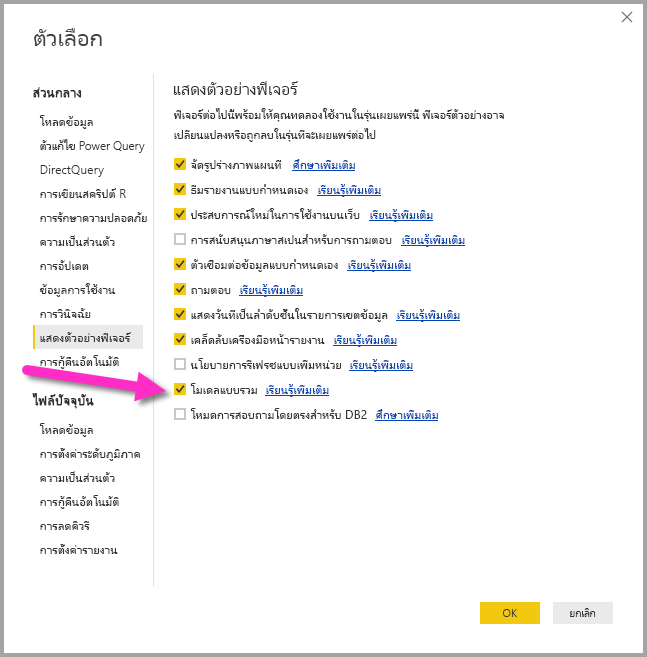

# ความสัมพันธ์แบบกลุ่ม-ต่อ-กลุ่มใน Power BI Desktop (ตัวอย่าง)

ด้วยคุณลักษณะ**ความสัมพันธ์แบบกลุ่ม-ต่อ-กลุ่ม**ใน **Power BI Desktop** คุณสามารถรวมตารางเข้าด้วยกันด้วยการใช้คาร์ดินาลลิตี้ของ **กลุ่ม-ต่อ-กลุ่ม** และสร้างโมเดลข้อมูลที่มีแหล่งข้อมูลหลายแหล่งได้ง่ายขึ้นและเป็นธรรมชาติขึ้น คุณลักษณะ**ความสัมพันธ์แบบกลุ่ม-ต่อ-กลุ่ม**เป็นส่วนหนึ่งของความสามารถ**โมเดลแบบรวม**ใน **Power BI Desktop**

คุณลักษณะ**ความสัมพันธ์แบบกลุ่ม-ต่อ-กลุ่ม**ใน **Power BI Desktop** เป็นส่วนหนึ่งของคอลเลกชันคุณลักษณะที่เกี่ยวข้องกันสามอย่าง:

* **โมเดลแบบรวม** - อนุญาตให้รายงานมีการเชื่อมต่อข้อมูลหลายแบบ รวมถึงการเชื่อมต่อ DirectQuery หรือการนำเข้า ในรูปแบบใด ๆ ก็ตาม
* **ความสัมพันธ์แบบกลุ่ม-ต่อ-กลุ่ม** - ด้วย**โมเดลแบบรวม**คุณสามารถสร้าง**ความสัมพันธ์แบบกลุ่ม-ต่อ-กลุ่ม**ระหว่างตาราง ลบข้อกำหนดสำหรับการต้องมีค่าเฉพาะในตาราง และลบการแก้ไขปัญหาชั่วคราวอย่างเช่นการใช้ตารางใหม่เพียงเพื่อสร้างความสัมพันธ์ 
* **โหมดที่เก็บข้อมูล** – ในตอนนี้คุณสามารถระบุว่าภาพไหนที่ต้องการคิวรีไปยังแหล่งข้อมูล Back-end และภาพที่ไม่ต้องการจะได้รับการนำเข้าแม้ว่าจะอิงตาม DirectQuery ช่วยเพิ่มประสิทธิภาพและลดภาระ Back-end ก่อนหน้านี้แม้แต่ภาพง่าย ๆ อย่างตัวแบ่งส่วนข้อมูลก็จะส่งคิวรีไปยังแหล่งที่มา Back-end 

คอลเลกชันคุณลักษณะที่เกี่ยวข้องกันสามอย่างสำหรับ**โมเดลแบบรวม**ได้มีอธิบายไว้ในบทความแยกกัน:

* **โมเดลแบบรวม**ได้อธิบายไว้โดยละเอียดในบทความ[โมเดลแบบรวมใน Power BI Desktop (ตัวอย่าง)](desktop-composite-models.md)
* **ความสัมพันธ์แบบกลุ่ม-ต่อ-กลุ่ม**ได้อธิบายไว้ในบทความนี้
* **โหมดที่เก็บข้อมูล**ได้อธิบายไว้ในบทความของตัวเอง [โหมดที่เก็บข้อมูลใน Power BI Desktop (ตัวอย่าง)](desktop-storage-mode.md)

## การเปิดใช้งานคุณลักษณะตัวอย่างความสัมพันธ์แบบกลุ่มต่อกลุ่ม

คุณลักษณะ**ความสัมพันธ์แบบกลุ่ม-ต่อ-กลุ่ม**เป็นส่วนหนึ่งของความสามารถ**โมเดลแบบรวม**และอยู่ในช่วงตัวอย่าง และต้องเปิดใช้งานใน **Power BI Desktop** หากต้องการเปิดใช้งาน**โมเดลแบบรวม** ให้ไปที่ **ไฟล์ > ตัวเลือกและการตั้งค่า > ตัวเลือก > คุณลักษณะตัวอย่าง** จากนั้นเลือกกล่องกาเครื่องหมาย**โมเดลแบบรวม**

คุณจำเป็นต้องรีสตาร์ต **Power BI Desktop** เพื่อเปิดใช้งานคุณลักษณะ

## ความสัมพันธ์แบบกลุ่ม-ต่อ-กลุ่มช่วยแก้ปัญหาอะไรบ้าง

ก่อนหน้าที่จะมี**ความสัมพันธ์แบบกลุ่ม-ต่อ-กลุ่ม** เมื่อทำการกำหนดความสัมพันธ์ระหว่างตารางสองตารางใน Power BI คอลัมน์อย่างน้อยหนึ่งคอลัมน์ที่เกี่ยวข้องกับความสัมพันธ์จะต้องมีค่าเฉพาะ แต่ในหลาย ๆ สถานการณ์ ไม่มีคอลัมน์ใดในตารางที่มีค่าเฉพาะเลย 

ตัวอย่างเช่น ตารางสองตารางอาจมีคอลัมน์ที่มี *ประเทศ* แต่ค่าของ *ประเทศ* ไม่ได้เป็นค่าเฉพาะในตารางใด ๆ การที่จะรวมตารางแบบนั้น จำเป็นต้องมีการสร้างการแก้ไขปัญหาชั่วคราว อย่างเช่นการใช้ตารางที่มีค่าเฉพาะที่จำเป็นเพิ่มเติมในโมเดล คุณลักษณะ**ความสัมพันธ์แบบกลุ่ม-ต่อ-กลุ่ม**มอบทางเลือกอื่น อนุญาตให้ตารางแบบนั้นรวมกันได้โดยตรงโดยใช้ความสัมพันธ์ที่มีคาร์ดินาลลิตี้ของ **กลุ่มต่อกลุ่ม**  

## การใช้ความสัมพันธ์แบบกลุ่ม-ต่อ-กลุ่ม

เมื่อทำการกำหนดความสัมพันธ์ระหว่างตารางสองตารางใน Power BI คุณจะต้องกำหนดคาร์ดินาลลิตี้ของความสัมพันธ์ ตัวอย่างเช่น ความสัมพันธ์ระหว่าง *ProductSales* และ *ผลิตภัณฑ์* (ที่ใช้คอลัมน์ *ProductSales[ProductCode]* และ *ผลิตภัณฑ์[ProductCode]*) จะได้รับการกำหนดให้เป็น **Many-1** เนื่องจากมีการขายหลายรายการสำหรับแต่ละผลิตภัณฑ์ และคอลัมน์ในตาราง *ผลิตภัณฑ์* *(ProductCode)* เป็นค่าเฉพาะ เมื่อกำหนดคาร์ดินาลลิตี้ความสัมพันธ์เป็น **Many-1**, **1-Many**, หรือ **1-1** Power BI จะดำเนินการตรวจสอบความถูกต้องเพื่อตรวจสอบให้แน่ใจว่าคาร์ดินาลลิตี้ที่เลือกตรงกับข้อมูลจริง

ตัวอย่างเช่น ลองดูโมเดลง่ายๆ ในรูปด้านล่าง

จากนั้นลองจินตนาการว่าตาราง *ผลิตภัณฑ์* มีแถวแค่สองแถว

และให้จินตนาการว่าตาราง *การขาย* มีแถวแค่สี่แถว รวมถึง *การขาย* สำหรับผลิตภัณฑ์ **C** ที่ไม่ได้อยู่ในตาราง *ผลิตภัณฑ์* (เนื่องจากข้อผิดพลาดเกี่ยวกับ Referential Integrity)

ภาพที่แสดง *ProductName* และ *ราคา* (จากตาราง *ผลิตภัณฑ์* พร้อมกับ) *Qty* ทั้งหมดสำหรับแต่ละผลิตภัณฑ์ (จากตาราง *ProductSales*) จะแสดงดังที่ภาพด้านล่างแสดง: 

อย่างที่ได้เห็นในภาพที่แล้ว มีแถวในภาพที่ไม่มี *ProductName* ที่เกี่ยวข้องกับการขายสำหรับผลิตภัณฑ์ *C* แถวที่เว้นว่างนี้มีสาเหตุมาจาก:

* แถวใด ๆ ในตาราง *ProductSales* ที่ไม่มีแถวที่สอดคล้องในตาราง *ผลิตภัณฑ์* ซึ่งจะเกิดปัญหาด้าน Referential Integrity ดังที่เราได้เห็นสำหรับผลิตภัณฑ์ *C* ในตัวอย่างนี้

* แถวใด ๆ ในตาราง *ProductSales* ที่คอลัมน์คีย์นอกเป็น Null 

เนื่องด้วยเหตุผลดังกล่าว ในทั้งสองกรณีแถวที่เว้นว่างมีสาเหตุมาจากการขายที่ไม่ทราบ *ProductName* และ *ราคา*

อย่างไรก็ตาม บางครั้งสาเหตุก็มาจากการที่ตารางถูกรวมเข้าด้วยกันโดยคอลัมน์สองคอลัมน์ แต่ไม่มีคอลมน์ใดที่เป็นค่าเฉพาะเลย ตัวอย่างเช่น ลองพิจารณานิพจน์ DAX ต่อไปนี้:

* ตาราง *การขาย* มีข้อมูลการขายตาม *รัฐ* โดยที่แต่ละแถวมีจำนวนการขายสำหรับประเภทการขายในรัฐนั้น (รวมถึงรัฐ CA, WA, และ TX) 

    

* ตาราง *CityData* มีข้อมูลเกี่ยวกับเมือง รวมถึงจำนวนประชากรและรัฐ (รวมถึงรัฐ CA, WA, และนิวยอร์ก)

    

ในขณะที่มีคอลัมน์สำหรับ *รัฐ* ในทั้งสองตาราง และเป็นเรื่องสมเหตุสมผลที่จะอยากรายงาน *การขาย* ทั้งหมดตาม *รัฐ* พร้อมกับจำนวนประชากรทั้งหมดของแต่ละ รัฐ แต่ว่ามีปัญหาอยู่ นั่นคือคอลัมน์ *รัฐ* ไม่ได้เป็นค่าเฉพาะในตารางใด ๆ 

## การแก้ไขปัญหาชั่วคราว

ใน **Power BI Desktop** รุ่นก่อนหน้ารุ่นเดือนกรกฎาคม 2018 คุณไม่สามารถสร้างความสัมพันธ์ระหว่างตารางเหล่านี้ได้โดยตรง การแก้ไขปัญหาชั่วคราวโดยทั่วไปสำหรับปัญหานี้คือการทำขั้นตอนต่อไปนี้:

* สร้างตารางที่สามซึ่งมีเพียงรหัส *รัฐ* เฉพาะเท่านั้น ซึ่งอาจเป็นตารางที่ได้รับการคำนวณ (กำหนดโดยใช้ DAX) หรือตารางที่กำหนดโดยใช้คิวรีที่กำหนดใน **ตัวแก้ไขคิวรี** ซึ่งอาจมีรหัสเฉพาะซึ่งดึงมาจากตารางหนึ่ง หรือชุดเต็มที่รวมกัน

* เชื่อมโยงสองตารางเดิมเข้ากับตารางใหม่ โดยใช้ความสัมพันธ์แบบ **Many-1* ทั่วไป

อาจเก็บตารางสำหรับการแก้ไขปัญหาชั่วคราวไว้ให้เห็น หรือซ่อนไว้เพื่อไม่ให้ปรากฏในรายการเขตข้อมูล ในกรณีหลัง มักจะกำหนดความสัมพันธ์แบบ **Many-1** ให้ทำการกรองทั้งสองทิศทาง เพื่อให้สามารถใช้เขตข้อมูล *รัฐ* จากทั้งสองตารางได้ พร้อมด้วยการกระจายการกรองแบบสองทิศทางที่ตามมาไปยังตารางอื่น วิธีการแก้ไขปัญหาชั่วคราวดังกล่าวแสดงอยู่ในภาพ **มุมมองความสัมพันธ์** ด้านล่าง

ภาพที่แสดง *รัฐ* (จากตาราง *CityData*) พร้อมทั้ง *จำนวนประชากร* ทั้งหมด และ *การขาย* ทั้งหมดจะเป็นดังนี้

โปรดทราบว่าเนื่องจากการใช้รัฐจากตาราง *CityData* ในการแก้ไขปัญหาชั่วคราวนี้ เฉพาะ *รัฐ* ในตารางนั้นเท่านั้นที่จะแสดงในรายการ (เพราะฉะนั้นจะไม่มี TX) นอกจากนี้ สิ่งที่ไม่เหมือนกับในกรณีความสัมพันธ์แบบ **Many-1** ก็คือในขณะที่แถวทั้งหมดรวม *การขาย* ทั้งหมด (รวมถึงของ TX) รายละเอียดจะไม่รวมแถวที่เว้นว่างซึ่งครอบคลุมแถวที่ไม่ตรงกันดังกล่าว เช่นเดียวกัน จะไม่มีแถวที่เว้นวางที่ครอบคลุม *การขาย* ใด ๆ ซึ่งมีค่า Null สำหรับ *รัฐ*

หากมีการเพิ่ม *เมือง* ไปยังภาพนั้นด้วย เมื่อนั้นในขณะที่ทราบจำนวนประชาการต่อ *เมือง* *การขาย* ที่แสดงสำหรับ *เมือง* จะแค่เพียงระบุซ้ำกับ *การขาย* สำหรับ *รัฐ* ที่ตรงกัน (ซึ่งเป็นปกติในกรณีที่มีการรวมกลุ่มบนคอลัมน์ที่ไม่เกี่ยวข้องกับมาตรวัดรวมใด) ดังที่แสดงในภาพด้านล่าง

หากตารางใหม่ *การขาย* ได้รับการกำหนดให้เป็นการรวม *รัฐ* ทั้งหมดในการแก้ไขปัญหาชั่วคราวนี้ และกำหนดให้ปรากฏในรายการเขตข้อมูล เมื่อนั้นภาพเดียวกันที่แสดง *รัฐ* (บนตารางใหม่) พร้อมกับ *จำนวนประชากร* ทั้งหมด และ *การขาย*ทั้งหมดจะเป็นดังนี้

ในกรณีนั้นและดังที่แสดงในภาพ *TX* (พร้อม *การขาย* แต่ไม่ทราบจำนวนประชากร) และ *นิวยอร์ก* (พร้อมจำนวนประชากรแต่ไม่มี *การขาย*) จะรวมอยู่ด้วย 

อย่างที่คุณเห็น การแก้ไขปัญหาชั่วคราวนี้ไม่ได้ดีที่สุดและมีปัญหามากมาย ด้วยการมาถึงของ**ความสัมพันธ์แบบกลุ่ม-ต่อ-กลุ่ม** ปัญหาเหล่านี้ได้รับการแก้ไข ดังที่อธิบายไว้ในส่วนต่อไปนี้

## การใช้ความสัมพันธ์แบบกลุ่ม-ต่อ-กลุ่มแทนการแก้ไขปัญหาชั่วคราว

ใน **Power BI Desktop** รุ่นเดือนกรกฎาคม 2018 เป็นต้นไป คุณสามารถเชื่อมโยงตารางแบบที่อธิบายไว้ในส่วนก่อนหน้านี้ได้โดยไม่จำเป็นต้องใช้วิธีการแก้ไขปัญหาชั่วคราวแบบนั้น ตอนนี้คุณสามารถกำหนดคาร์ดินาลลิตี้ของความสัมพันธ์เป็นแบบ **กลุ่มต่อกลุ่ม** เพื่อระบุว่าไม่มีตารางใดที่มีค่าเฉพาะ สำหรับความสัมพันธ์เช่นนั้น คุณยังสามารถควบคุมว่าตารางใดที่จะกรองอีกตาราง หรือให้มีการกรองแบบสองทิศทางซึ่งแต่ละตารางจะกรองกันและกัน  

> [!NOTE]
> ความสามารถในการสร้างความสัมพันธ์แบบ **กลุ่มต่อกลุ่ม** อยู่ในช่วงตัวอย่าง และในระหว่างที่อยู่ในช่วงตัวอย่าง คุณจะไม่สามารถเผยแพร่โมเดลโดยใช้ความสัมพันธ์แบบ **กลุ่มต่อกลุ่ม** ไปยังบริการ Power BI ได้ 

ใน **Power BI Desktop** คาร์ดินาลลิตี้จะใช้ **กลุ่มต่อกลุ่ม** เป็นค่าเริ่มต้น เมื่อโปรแกรมพบว่าไม่มีตารางใดที่มีค่าเฉพาะสำหรับคอลัมน์ในความสัมพันธ์ ในกรณีเช่นนั้นจะมีคำเตือนปรากฏขึ้น เพื่อยืนยันว่าคุณตั้งใจตั้งค่าความสัมพันธ์ แทนที่จะเป็นผลที่ไม่ได้ตั้งใจจากปัญหาด้านข้อมูล 

ตัวอย่างเช่น ในการสร้างความสัมพันธ์โดยตรงระหว่าง *CityData* และ *การขาย* ซึ่งตัวกรองควรเคลื่อนจาก *CityData* ไปยัง *การขาย* กล่องโต้ตอบความสัมพันธ์จะปรากฏดังที่แสดงในภาพด้านล่าง

**มุมมองความสัมพันธ์** ที่ปรากฏจะมีความสัมพันธ์แบบ **กลุ่มต่อกลุ่ม** โดยตรงระหว่างสองตาราง สิ่งที่ปรากฏในรายการ **เขตข้อมูล** และพฤติกรรมที่ตามมาเมื่อมีการสร้างภาพ จะเป็นแบบเดียวกันกับเมื่อใช้การแก้ไขปัญหาชั่วคราวที่อธิบายไว้ในส่วนก่อนหน้านี้ ซึ่งตารางที่เพิ่มมา (ซึ่งมี *รัฐ* ที่ชัดเจนอยู่ในตาราง) จะถูกซ่อนไว้ ตัวอย่างเช่น ดังที่ส่วนที่แล้วได้อธิบายการแก้ไขปัญหาชั่วคราว ภาพที่แสดง *รัฐ* พร้อมกับจำนวนประชากรทั้งหมดและการขายจะเป็นดังนี้

เพราะฉะนั้นความแตกต่างที่สำคัญระหว่างความสัมพันธ์แบบ **กลุ่มต่อกลุ่ม** กับความสัมพันธ์แบบ **Many-1** ที่ใช้กันเป็นปกติกว่าจะเป็นดังนี้

* ค่าที่แสดงไม่รวมแถวที่เว้นว่างซึ่งเกิดจากแถวที่ไม่ตรงกันในตารางอื่น หรือจากแถวที่คอลัมน์ที่ใช้ในความสัมพันธ์ในตารางอื่นเป็น Null
* ไม่สามารถใช้คุณลักษณะ *ที่เกี่ยวข้อง()* (เนื่องจากมีแถวมากกว่าหนึ่งแถวที่อาจเกี่ยวข้อง)
* การใช้คุณลักษณะ *ทั้งหมด()* บนตารางจะไม่ได้เป็นการลบตัวกรองที่ใช้กับตารางอื่นที่เกี่ยวข้องกับตารางนี้ด้วยความสัมพันธ์แบบ **กลุ่มต่อกลุ่ม** ตัวอย่างเช่น การวัดที่ระบุดังนี้ในตัวอย่างที่แล้วจะไม่ลบตัวกรองบนคอลัมน์บนตาราง *CityData* ที่เกี่ยวข้อง

    

    ดังนั้นภาพที่แสดง *รัฐ* *การขาย* และ *การขายทั้งหมด* จะเป็นดังนี้:

    

ด้วยเหตุนี้ จึงควรใช้ความระมัดระวังเพื่อตรวจสอบให้แน่ใจว่าการคำนวณโดยใช้ *ALL(\<Table>)* อย่างเช่น *% ของยอดรวมทั้งหมด* ให้ผลลัพธ์ตามที่ตั้งใจไว้ 

## ข้อจำกัดและข้อควรพิจารณา

มีข้อจำกัดจำนวนหนึ่งสำหรับ**ความสัมพันธ์แบบกลุ่ม-ต่อ-กลุ่ม**และ**โมเดลแบบรวม**ในรุ่นนี้

แหล่งที่มาหลายมิติดังต่อไปนี้ไม่สามารถใช้กับ**โมเดลแบบรวม**ได้:

* SAP HANA
* SAP Business Warehouse
* SQL Server Analysis Services
* ชุดข้อมูล Power BI

เมื่อทำการเชื่อมต่อกับแหล่งที่มาหลายมิติแบบนั้นโดยใช้ DirectQuery คุณจะไม่สามารถเชื่อมต่อกับแหล่งที่มา DirectQuery อีกแห่งด้วย หรือรวมเข้ากับข้อมูลที่นำเข้าด้วยได้

ข้อจำกัดในการใช้ DirectQuery ที่ยังมีอยู่จะยังคงมีผลเมื่อใช้**ความสัมพันธ์แบบกลุ่ม-ต่อ-กลุ่ม** ข้อจำกัดจำนวนมากนี้เป็นข้อจำกัดต่อตาราง โดยขึ้นอยู่กับ**โหมดที่เก็บข้อมูล**ของตาราง ตัวอย่างเช่น คอลัมน์ที่ได้รับการคำนวณบนตารางที่นำเข้าสามารถอ้างอิงไปยังตารางอื่น แต่ตารางที่ได้รับการคำนวณบนตาราง DirectQuery จะยังคงถูกจำกัดให้อ้างอิงไปยังคอลัมน์บนตารางเดียวกันเท่านั้น ข้อจำกัดอื่น ๆ มีผลกับโมเดลทั้งหมด หากมีตารางใดภายในโมเดลที่เป็น DirectQuery ตัวอย่างเช่น คุณลักษณะ **QuickInsights** และ **Q&A** จะไม่สามารถใช้งานได้บนโมเดลหากมีตารางใดภายในโมเดลมี**โหมดที่เก็บข้อมูล**ของ DirectQuery 

## ขั้นตอนถัดไป

บทความต่อไปนี้อธิบายเพิ่มเติมเกี่ยวกับโมเดลแบบรวม และยังอธิบาย DirectQuery โดยละเอียด

* [โมเดลแบบรวม ใน Power BI Desktop (ตัวอย่าง)](desktop-composite-models.md)
* [โหมดที่เก็บข้อมูล ใน Power BI Desktop (ตัวอย่าง)](desktop-storage-mode.md)

บทความ DirectQuery:

* [การใช้ DirectQuery ใน Power BI](desktop-directquery-about.md)
* [แหล่งข้อมูลที่ได้รับการรองรับโดย DirectQuery ใน Power BI](desktop-directquery-data-sources.md)

