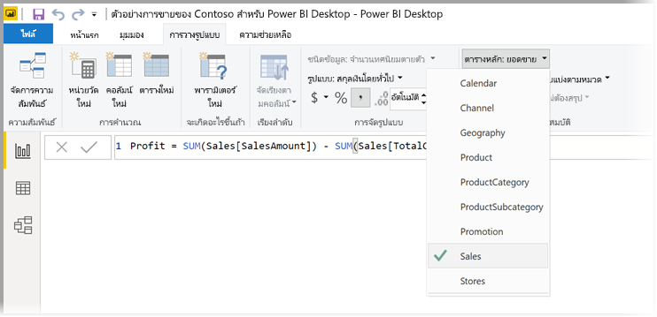
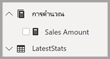

# <a name="create-measures-for-data-analysis-in-power-bi-desktop"></a>สร้างหน่วยวัดสำหรับการวิเคราะห์ข้อมูลใน Power BI Desktop

Power BI Desktop ช่วยให้คุณสร้างข้อมูลเชิงลึกในข้อมูลของคุณ ด้วยการคลิกเมาส์เพียงไม่กี่ครั้ง แต่ในบางครั้ง ข้อมูลดังกล่าวยังไม่รวมทุกอย่างที่คุณต้องใช้ตอบคำถาม บางคำถามที่สำคัญที่สุดของคุณ หน่วยวัดสามารถช่วยให้คุณไปถึงที่นั่น

หน่วยวัดจะใช้ในการวิเคราะห์ข้อมูลทั่วไปบางส่วน คุณสามารถตั้งค่าการสรุปอย่างง่าย เช่น ผลรวม ค่าเฉลี่ย ค่าต่ำสุด ค่าสูงสุด และจำนวนได้ผ่าน**เขตข้อมูล** ผลลัพธ์จากการคำนวณของหน่วยวัด จะเปลี่ยนแปลงตามการโต้ตอบกับรายงานของคุณ ช่วยให้คุณได้สำรวจข้อมูลเฉพาะกิจได้อย่างรวดเร็วและมีชีวิตชีวา ลองมาดูรายละเอียดกัน สำหรับข้อมูลเพิ่มเติม ดูที่[สร้างการวัดที่ได้รับการคำนวณ](/learn/modules/model-data-power-bi/4b-create-calculated-measures)

## <a name="understanding-measures"></a>ทำความเข้าใจกับหน่วยวัด

ใน Power BI Desktop หน่วยวัดจะถูกสร้างและแสดงใน *มุมมองรายงาน* หรือ *มุมมองข้อมูล* หน่วยวัดที่คุณสร้างจะปรากฏในรายการ**เขตข้อมูล**พร้อมไอคอนรูปเครื่องคิดเลข คุณสามารถตั้งชื่อหน่วยวัดเป็นอะไรก็ได้ที่คุณต้องการ และเพิ่มลงในการแสดงภาพใหม่หรือที่มีอยู่แล้ว เช่นเดียวกับเขตข้อมูลอื่น ๆ


> [!NOTE]
> นอกจากนี้คุณอาจจะสนใจ*การวัดผลด่วน* ซึ่งเป็นหน่วยวัดที่สร้างให้แล้ว ที่คุณสามารถเลือกใช้ได้ทันทีจากกล่องโต้ตอบ ซึ่งเป็นวิธีสร้างหน่วยวัดที่รวดเร็ว และยังเป็นวิธีที่ดีที่จะเรียนรู้ไวยากรณ์ Data Analysis Expressions (DAX) เนื่องจากสามารถดูสูตร DAX ที่สร้างขึ้นโดยอัตโนมัติได้ สำหรับข้อมูลเพิ่มเติม โปรดดู [หน่วยวัดด่วน](desktop-quick-measures.md)
> 
> 

## <a name="data-analysis-expressions"></a>Data Analysis Expressions

หน่วยวัดคำนวณผลลัพธ์จากสูตรคำนวน เมื่อคุณสร้างหน่วยวัดของคุณเอง คุณจะใช้ภาษาสูตร [Data Analysis Expressions](/dax/) (DAX) DAX มีไลบรารีของฟังก์ชัน ตัวดำเนินการ และโครงสร้างมากกว่า 200 ไลบรารีมีความยืดหยุ่นมากในการสร้างหน่วยวัดเพื่อคำนวณผลลัพธ์สำหรับการวิเคราะห์ข้อมูลใด ๆ ที่ต้องการ

สูตร DAX จะคล้ายกับสูตร Excel มาก DAX ยังมีหลายฟังก์ชันเหมือนกับ Excel เช่น `DATE`, `SUM`, และ `LEFT` แต่ฟังก์ชัน DAX มีไว้เพื่อทำงานกับข้อมูลเชิงสัมพันธ์เช่นที่เรามีใน Power BI Desktop

## <a name="lets-look-at-an-example"></a>เรามาดูตัวอย่างกัน

Jan เป็นผู้จัดการฝ่ายขายที่ Contoso Jan ถูกขอให้ทำการเลือกเฉพาะส่วนยอดขายผู้จำหน่ายในปีบัญชีถัดไป Jan ตัดสินใจที่จะประมาณจากยอดขายของปีที่แล้วเป็นฐาน แล้วบวกเพิ่มอีกหกเปอร์เซ็นต์จากการส่งเสริมการขายต่าง ๆ ที่จะจัดในอีกหกเดือนข้างหน้า

เมื่อต้องรายงานการประมาณ Jan นำเข้าข้อมูลยอดขายของปีที่แล้วลงใน Power BI Desktop Jan ค้นหาเขตข้อมูล **SalesAmount** ในตาราง **Reseller Sales** เนื่องจากข้อมูลที่นำเข้ามีเฉพาะยอดขายสำหรับปีที่แล้วเท่านั้น Jan จึงเปลี่ยนชื่อเขตข้อมูล **SalesAmount** เป็น *Last Years Sales* จากนั้น Jan ลาก **Last Years Sales** ไปยังพื้นที่รายงาน จะปรากฏขึ้นเป็นค่าเดียวในแผนภูมิ โดยเป็นค่าผลรวมของยอดขายของทุกตัวแทนจำหน่ายจากปีที่แล้ว

Jan สังเกตว่าถึงแม้ว่าจะไม่ได้ระบุการคำนวณเอง แต่ก็มีการระบุโดยอัตโนมัติ Power BI Desktop สร้างหน่วยวัดของตนเองโดยการรวมค่าทั้งหมดใน **Last Years Sales**

แต่ Jan ต้องการหน่วยวัดเพื่อคำนวณประมาณการสำหรับปีหน้า ซึ่งจะอาศัยยอดขายของปีที่แล้วคูณด้วย 1.06 สำหรับความคาดหวังว่าธุรกิจจะเติบโต 6 เปอร์เซ็นต์ สำหรับการคำนวณนี้ Jan จะสร้างหน่วยวัดหน่วยหนึ่ง โดยใช้คุณลักษณะ *หน่วยวัดใหม่* Jan จึงสร้างหน่วยวัดใหม่ จากนั้นใส่สูตร DAX ต่อไปนี้:

```dax
    Projected Sales = SUM('Sales'[Last Years Sales])*1.06
```

จากนั้น Jan ลากหน่วยวัดใหม่ที่ชื่อ Projected Sales ไปยังแผนภูมิ


Jan ตอนนี้มีหน่วยวัดที่ใช้คำนวณประมาณการยอดขายได้อย่างรวดเร็วและไม่ต้องใช้ความพยายามมากนัก Jan สามารถวิเคราะห์การคาดการณ์ของเธอต่อ โดยการกรองเฉพาะผู้จำหน่าย หรือโดยการเพิ่มเขตข้อมูลอื่นลงในรายงาน

## <a name="data-categories-for-measures"></a>ประเภทข้อมูลสำหรับหน่วยวัด

คุณยังสามารถเลือกประเภทข้อมูลสำหรับหน่วยวัด

เหนือสิ่งอื่นใด ประเภทข้อมูลจะช่วยให้คุณสามารถใช้หน่วยวัดเพื่อสร้าง URL แบบไดนามิก และทำเครื่องหมายประเภทข้อมูลเป็น URL เว็บ

คุณสามารถสร้างตารางที่แสดงการวัดเป็น URL เว็บ และสามารถคลิกที่ URL ที่ถูกสร้างขึ้นตามการเลือกของคุณ วิธีการนี้จะเป็นประโยชน์โดยเฉพาะอย่างยิ่งเมื่อคุณต้องการเชื่อมโยงกับรายงาน Power BI อื่น ๆ ด้วย[พารามิเตอร์ตัวกรอง URL](service-url-filters.md)

## <a name="organizing-your-measures"></a>การจัดระเบียบหน่วยวัดของคุณ

หน่วยวัดมีตาราง *หลัก* ซึ่งจะกำหนดตำแหน่งที่พบในรายการเขตข้อมูล คุณสามารถเปลี่ยนตำแหน่งที่ตั้งได้โดยการเลือกตำแหน่งที่ตั้งจากตารางในแบบจำลองของคุณ



คุณยังสามารถจัดระเบียบเขตข้อมูลในตารางลงใน*โฟลเดอร์การแสดงผล*ได้ เลือก**แบบจำลอง**จากขอบด้านซ้ายของ Power BI Desktop ในบานหน้าต่าง**คุณสมบัติ** เลือกเขตข้อมูลที่คุณต้องการย้ายจากรายการของเขตข้อมูลที่พร้อมใช้งาน ใส่ชื่อสำหรับโฟลเดอร์ใหม่ใน **โฟลเดอร์การแสดงผล**เพื่อสร้างโฟลเดอร์ การสร้างโฟลเดอร์จะย้ายเขตข้อมูลที่เลือกไปยังโฟลเดอร์นั้น


คุณสามารถสร้างโฟลเดอร์ย่อยได้โดยใช้อักขระเครื่องหมายทับขวา ตัวอย่างเช่น *Finance\Currencies* จะสร้างโฟลเดอร์*Finance*และภายในประกอบด้วยโฟลเดอร์*Currencies*

คุณสามารถทำให้เขตข้อมลปรากฏในหลายโฟลเดอร์ได้โดยใช้เครื่องหมายอัฒภาคเพื่อแยกชื่อโฟลเดอร์ ตัวอย่างเช่น *ผลิตภัณฑ์\ชื่อ; แผนก* จะส่งผลให้เกิดเขตข้อมูลที่ปรากฏในโฟลเดอร์*แผนก* เช่นเดียวกับโฟลเดอร์*ชื่อ*ที่ปรากฏภายใน*ผลิตภัณฑโฟลเดอร์*

คุณสามารถสร้างตารางพิเศษที่ประกอบด้วยหน่วยวัดเท่านั้น ตารางนั้นจะปรากฏที่ด้านบนสุดของ**เขตข้อมูล** เมื่อต้องการทำเช่นนั้น ให้สร้างตารางที่มีเพียงหนึ่งคอลัมน์ คุณสามารถใช้ **ป้อนข้อมูล** เพื่อสร้างตารางนั้นได้ จากนั้นย้ายหน่วยวัดของคุณไปยังตารางนั้น สุดท้าย ให้ซ่อนคอลัมน์ แต่ไม่ใช่ตารางที่คุณสร้างขึ้น เลือกลูกศรที่ด้านบนของ**เขตข้อมูล** เพื่อปิดและเปิดรายการเขตข้อมูลใหม่เพื่อดูการเปลี่ยนแปลงของคุณ



## <a name="learn-more"></a>เรียนรู้เพิ่มเติม

เรามีเพียงแค่คำแนะนำเบื้องต้นเกี่ยวกับหน่วยวัดสำหรับคุณในที่นี่ มีคำแนะนำเพิ่มเติมที่จะช่วยคุณในการเรียนรู้วิธีการสร้างหน่วยวัดของคุณเอง สำหรับข้อมูลเพิ่มเติม โปรดดูบทช่วยสอน [:  สร้างหน่วยวัดของคุณเองใน Power BI Desktop ](desktop-tutorial-create-measures.md) คุณสามารถดาวน์โหลดไฟล์ตัวอย่าง และได้รับบทเรียนทีละขั้นตอนเกี่ยวกับวิธีการสร้างหน่วยวัดเพิ่มเติมได้  

ถ้าต้องการเจาะลึกลงไปใน DAX อีก โปรดดูที่[พื้นฐาน DAX ใน Power BI Desktop](desktop-quickstart-learn-dax-basics.md) [อ้างอิง Data Analysis Expressions](/dax/) ให้บทความที่ละเอียดของแต่ละ ฟังก์ชัน ไวยากรณ์ ตัวดำเนินการ และข้อกำหนดการตั้งชื่อ DAX มีอยู่แล้วใน Power Pivot ใน Excel และ SQL Server Analysis Services มาหลายปี มีแหล่งข้อมูลที่ดีอื่น ๆ อีกมากมายที่สามารถใช้งานได้เช่นกัน อย่าลืมดู [Wiki DAX Resource Center](https://social.technet.microsoft.com/wiki/contents/articles/1088.dax-resource-center.aspx) ที่มีสมาชิกที่มีชื่อเสียงของชุมชน BI แชร์ความรู้ DAX ของพวกเขา
