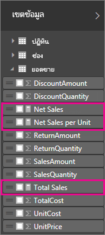
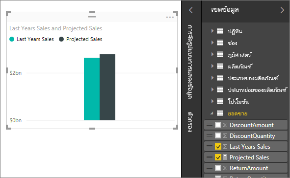

# หน่วยวัดใน Power BI Desktop
**Power BI Desktop** ช่วยให้คุณสร้างข้อมูลเชิงลึกในข้อมูลของคุณ ด้วยการคลิกเมาส์เพียงไม่กี่ครั้ง แต่ในบางครั้ง ข้อมูลดังกล่าวยังไม่รวมทุกอย่างที่คุณต้องใช้ตอบคำถาม บางคำถามที่สำคัญที่สุดของคุณ หน่วยวัดสามารถช่วยให้คุณไปถึงที่นั่น

ในการวิเคราะห์ข้อมูล มีการใช้หน่วยวัดอยู่บ่อย ๆ เช่น ผลรวม ค่าเฉลี่ย ค่าต่ำสุดหรือสูงสุด จำนวนนับ หรือการคำนวณขั้นสูงที่คุณสร้างเองได้โดยใช้สูตร DAX ผลลัพธ์จากการคำนวณของหน่วยวัด จะเปลี่ยนแปลงตามการโต้ตอบกับรายงานของคุณ ช่วยให้คุณได้สำรวจข้อมูลเฉพาะกิจได้อย่างรวดเร็วและมีชีวิตชีวา ลองมาดูรายละเอียดกัน

## ทำความเข้าใจกับหน่วยวัด
ใน **Power BI Desktop** หน่วยวัดจะถูกสร้างและใช้งานใน**มุมมองรายงาน**หรือ**มุมมองข้อมูล** หน่วยวัดที่คุณสร้าง จะปรากฏในรายการเขตข้อมูลพร้อมไอคอนรูปเครื่องคิดเลข คุณสามารถตั้งชื่อหน่วยวัดเป็นอะไรก็ได้ที่คุณต้องการ และเพิ่มลงในการแสดงภาพใหม่หรือที่มีอยู่แล้ว เช่นเดียวกับเขตข้อมูลอื่น ๆ

> [!NOTE]
> นอกจากนี้คุณอาจจะสนใจ**การวัดผลด่วน** ซึ่งเป็นหน่วยวัดที่สร้างให้แล้ว ที่คุณสามารถเลือกใช้ได้ทันทีจากกล่องโต้ตอบ ซึ่งเป็นวิธีสร้างหน่วยวัดที่รวดเร็ว และยังเป็นวิธีที่ดีที่จะเรียนรู้ไวยากรณ์ DAX เนื่องจากสามารถดูสูตร DAX ที่สร้างขึ้นโดยอัตโนมัติได้ ลองดูบทความนี้: [การวัดผลด่วน](desktop-quick-measures.md)
> 
> 

## Data Analysis Expressions
หน่วยวัดคำนวณผลลัพธ์จากสูตรคำนวน เมื่อคุณสร้างหน่วยวัดของคุณเอง คุณจะใช้ภาษาสูตร [Data Analysis Expressions](https://msdn.microsoft.com/library/gg413422.aspx) (DAX) DAX มีไลบรารีของ ฟังก์ชัน ตัวดำเนินการ และโครงสร้าง มากกว่า 200 รายการ จึงยืดหยุ่นรองรับการสร้างหน่วยวัดสำหรับการวิเคราะห์ข้อมูลทุกรูปแบบ

สูตร DAX จะคล้ายกับสูตร Excel มาก DAX ยังมีหลายฟังก์ชันที่เหมือนกัน เช่น DATE, SUM และ LEFT แต่ฟังก์ชันของ DAX มีไว้เพื่อทำงานกับข้อมูลเชิงสัมพันธ์เช่นที่เรามีใน Power BI Desktop

## เรามาดูตัวอย่างกัน
Jan เป็นผู้จัดการฝ่ายขายที่ Contoso เธอถูกขอให้ทำประมาณการยอดขายสำหรับรอบบัญขีปีถัดไป เธอตัดสินใจที่จะประมาณจากยอดขายของปีที่แล้วเป็นฐาน แล้วบวกเพิ่มอีกหกเปอร์เซ็นต์จากการส่งเสริมการขายต่าง ๆ ที่จะจัดในอีกหกเดือนข้างหน้า

เพื่อรายงานการประมาณการ เธอนำเข้าข้อมูลยอดขายปีที่แล้วลงใน Power BI Desktop เธอพบเขตข้อมูล SalesAmount ในตาราง Reseller Sales เนื่องจากข้อมูลที่เธอนำเข้า มีแค่ยอดขายสำหรับปีที่แล้ว เธอเปลี่ยนชื่อเขตข้อมูลจาก SalesAmount ไปเป็น Last Years Sales จากนั้นเธอลาก Last Years Sales ลงบนพื้นที่รายงาน จะปรากฏขึ้นเป็นค่าเดียวในแผนภูมิ โดยเป็นค่าผลรวมของยอดขายของทุกตัวแทนจำหน่ายจากปีที่แล้ว

เธอสังเกตว่า ถึงแม้เธอจะไม่ได้ระบุการคำนวณเอง แต่มีใส่ค่าหนึ่งให้โดยอัตโนมัติ Power BI Desktop สร้างหน่วยวัดของตนเอง โดยการรวมค่าทั้งหมดของ ยอดขายปีที่แล้ว

แต่ Jan ต้องการหน่วยวัดเพื่อคำนวณประมาณการสำหรับปีหน้า ซึ่งจะอาศัยยอดขายของปีที่แล้วคูณด้วย 1.06 สำหรับความคาดหวังว่าธุรกิจจะเติบโต 6 เปอร์เซ็นต์ สำหรับการคำนวณนี้ เธอจะสร้างหน่วยวัดของเธอเอง โดยใช้คุณลักษณะหน่วยวัดใหม่ เธอสร้างหน่วยวัดใหม่ จากนั้นใส่สูตร DAX ต่อไปนี้:

    Projected Sales = SUM('Sales'[Last Years Sales])*1.06

จากนั้น Jan ลากหน่วยวัดใหม่ที่ชื่อ Projected Sales ลงในแผนภูมิ

Jan ตอนนี้มีหน่วยวัดที่ใช้คำนวณประมาณการยอดขาย ด้วยความรวดเร็วและไม่ต้องใช้ความพยายามมากนัก เธอสามารถวิเคราะห์ประมาณการของเธอต่อ โดยการกรองเฉพาะตัวแทนจำหน่าย หรือ โดยการเพิ่มเขตข้อมูลอื่นลงในรายงานของเธอ

## ศึกษาเพิ่มเติม
เราแค่แนะนำคุณเรื่องหน่วยวัดอย่างสั้น ๆ ที่นี่เท่านั้น แต่ยังมีทรัพยากรอีกมากที่ช่วยคุณสร้างหน่วยวัดของตัวเอง ลองไปดู [บทช่วยสอน: สร้างหน่วยวัดของคุณเองใน Power BI Desktop](desktop-tutorial-create-measures.md) ที่ซึ่งคุณสามารถดาวน์โหลดไฟล์ตัวอย่าง และได้รับบทเรียนทีละขั้นตอนเกี่ยวกับวิธีการสร้างหน่วยวัดเพิ่มเติมได้  

ถ้าต้องการเจาะลึกลงไปใน DAX อีก ลองไปดูที่[พื้นฐาน DAX ใน Power BI Desktop](desktop-quickstart-learn-dax-basics.md) [อ้างอิง Data Analysis Expressions](https://msdn.microsoft.com/library/gg413422.aspx) ให้บทความที่ละเอียดของแต่ละ ฟังก์ชัน ไวยากรณ์ ตัวดำเนินการ และข้อกำหนดการตั้งชื่อ DAX มีอยู่แล้วใน Power Pivot ใน Excel และ SQL Server Analysis Services มาหลายปี ดังนั้นจึงทรัพยากรที่ยอดเยี่ยมอื่น ๆ พร้อมสำหรับศึกษา อย่าลืมดู [Wiki DAX Resource Center](http://social.technet.microsoft.com/wiki/contents/articles/1088.dax-resource-center.aspx) ที่มีสมาชิกที่มีชื่อเสียงของชุมชน BI แชร์ความรู้ DAX ของพวกเขา

