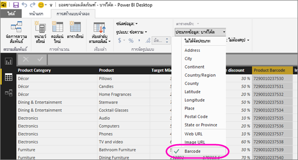

# แท็กเขตข้อมูลบาร์โค้ดใน Power BI Desktop สำหรับแอปสำหรับอุปกรณ์เคลื่อนที่
ใน Power BI Desktop คุณสามารถ [จัดประเภทข้อมูล](desktop-data-categorization.md) ในคอลัมน์ ดังนั้น Power BI Desktop จึงทราบวิธีการนำค่ามาใช้ในการแสดงผลด้วยภาพในรายงานได้ นอกจากนี้ คุณยังสามารถจัดประเภทคอลัมน์เป็น **บาร์โค้ด**ได้ เมื่อคุณหรือเพื่อนร่วมงาน [สแกนบาร์โค้ดบนผลิตภัณฑ์ด้วยแอป Power BI](mobile-apps-scan-barcode-iphone.md) บน iPhone คุณก็จะเห็นรายงานใด ๆ ที่มีบาร์โค้ดนั้น เมื่อคุณเปิดรายงานในแอปสำหรับอุปกรณ์เคลื่อนที่ Power BI ก็จะกรองรายงานให้เป็นข้อมูลที่เกี่ยวข้องกับบาร์โค้ดนั้นโดยอัตโนมัติ

1. ใน Power BI Desktop สลับไปยังมุมมองข้อมูล
2. เลือกคอลัมน์ที่มีข้อมูลบาร์โค้ด ดูรายการของ [รูปแบบบาร์โค้ดที่สนับสนุน](#supported-barcode-formats) ด้านล่าง
3. บนแท็บ **การวางรูปแบบ** เลือก **บาร์โค้ด** > **ประเภทข้อมูล**
   
    
4. ในมุมมองรายงาน เพิ่มเขตข้อมูลนี้ในการแสดงผลด้วยภาพที่คุณต้องการโดยกรองตามบาร์โค้ด
5. บันทึกรายงานและเผยแพร่ไปยังบริการ Power BI

ในตอนนี้ เมื่อคุณเปิดสแกนเนอร์บน [แอป Power BI สำหรับ iPhone](mobile-ios-ipad-iphone-apps.md) และสแกนบาร์โค้ด คุณจะเห็นรายงานนี้ในรายการของรายงาน เมื่อคุณเปิดรายงาน การแสดงผลด้วยภาพจะถูกกรองตามบาร์โค้ดผลิตภัณฑ์ที่คุณสแกน

## รูปแบบบาร์โค้ดที่สนับสนุน
ต่อไปนี้เป็นบาร์โค้ดที่ Power BI จดจำถ้าคุณสามารถแท็กบาร์โค้ดเหล่านี้ในรายงาน Power BI: 

* UPCECode 
* Code39Code  
* A39Mod43Code 
* EAN13Code 
* EAN8Code  
* 93Code  
* 128Code 
* PDF417Code 
* Interleaved2of5Code 
* ITF14Code 

## ขั้นตอนถัดไป
* [สแกนบาร์โค้ดจากแอป Power BI บน iPhone ของคุณ](mobile-apps-scan-barcode-iphone.md)
* [ปัญหาเกี่ยวกับการสแกนบาร์โค้ดบน iPhone](mobile-apps-scan-barcode-iphone.md#issues-with-scanning-a-barcode)
* [การจัดประเภทข้อมูลใน Power BI Desktop](desktop-data-categorization.md)  
* มีคำถามหรือไม่ [ลองถามชุมชน Power BI](http://community.powerbi.com/)

