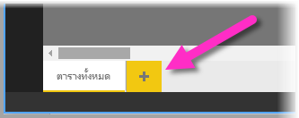
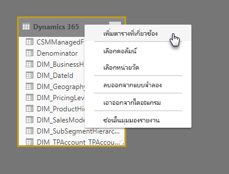

# มุมมองแบบจำลองใน Power BI Desktop

ด้วย**มุมมองแบบจำลอง**ใน **Power BI Desktop** คุณสามารถดู และทำงานกับชุดข้อมูลที่ซับซ้อนที่ประกอบด้วยหลายตารางได้

## ใช้มุมมองแบบจำลอง

เมื่อต้องการเข้าถึงมุมมองแบบจำลอง ให้เลือกไอคอนมุมมองแบบจำลองที่ด้านบนซ้ายของ**Power BI Desktop**ดังที่แสดงในรูปต่อไปนี้

## สร้างไดอะแกรมที่แยกต่างหาก

ด้วยมุมมองแบบจำลอง คุณสามารถสร้างไดอะแกรมแบบจำลองของคุณที่ประกอบด้วยชุดย่อยของตารางในแบบจำลองของคุณโดยเฉพาะ สิ่งนี้จะช่วยให้มุมมองชัดเจนยิ่งขึ้นในตารางที่คุณต้องการใช้งาน และให้การทำงานกับชุดข้อมูลที่ซับซ้อน เมื่อต้องการสร้างไดอะแกรมที่มีเฉพาะชุดย่อยของตาราง ให้คลิก **+** ลงชื่อเข้าใช้ถัดจากแท็บ**ตารางทั้งหมด**ที่ด้านล่างของบานหน้าต่าง Power BI Desktop

คุณยังสามารถลากตารางจากรายการ**เขตข้อมูล**ไปยังพื้นผิวไดอะแกรมได้ คลิกขวาที่ตาราง จากนั้น**เพิ่มตารางที่เกี่ยวข้อง**จากเมนูที่ปรากฏขึ้น

เมื่อคุณทำตาม ตารางที่เกี่ยวข้องกับตารางต้นฉบับจะแสดงในไดอะแกรมใหม่ รูปต่อไปนี้แสดงตารางที่เกี่ยวข้องวิธีแสดงหลังจากเลือกตัว**เพิ่มตารางที่เกี่ยวข้อง**ตัวเลือกเมนู

## ตั้งค่าคุณสมบัติทั่วไป

คุณสามารถเลือกวัตถุหลายวัตถุพร้อมกันในมุมมองแบบจำลองได้โดยกดปุ่ม**CTRL**ค้างไว้และคลิกที่ตารางหลายๆ ตารางพร้อมกัน เมื่อคุณเลือกตารางหลายตาราง ตารางจะถูกเน้นไว้ในมุมมองแบบจำลอง เมื่อตารางหลายตารางถูกเน้น การเปลี่ยนแปลงได้ถูกนำไปใช้ในบานหน้าต่าง**คุณสมบัติ**กับตารางที่เลือกทั้งหมด

ตัวอย่าง คุณสามารถเปลี่ยน[โหมดที่เก็บ](desktop-storage-mode.md)สำหรับตารางหลายตารางในมุมมองไดอะแกรมของคุณได้โดยกดปุ่ม**CTRL**ค้าง เลือกตาราง จาก นั้นเปลี่ยนการตั้งค่าโหมดที่เก็บข้อมูลในบานหน้าต่าง**คุณสมบัติ**

## ขั้นตอนถัดไป

บทความต่อไปนี้อธิบายเพิ่มเติมเกี่ยวกับแบบจำลองข้อมูล และยังอธิบายเกี่ยวกับ DirectQuery อย่างละเอียด

* [รวมข้อมูลใน Power BI Desktop (ตัวอย่าง)](desktop-aggregations.md)
* [โมเดลแบบรวมใน Power BI Desktop](desktop-composite-models.md)
* [โหมดที่เก็บข้อมูล ใน Power BI Desktop (ตัวอย่าง)](desktop-storage-mode.md)
* [ความสัมพันธ์แบบกลุ่มต่อกลุ่มใน Power BI Desktop](desktop-many-to-many-relationships.md)

บทความ DirectQuery:

* [การใช้ DirectQuery ใน Power BI](desktop-directquery-about.md)
* [แหล่งข้อมูลที่ได้รับการรองรับโดย DirectQuery ใน Power BI](desktop-directquery-data-sources.md)
