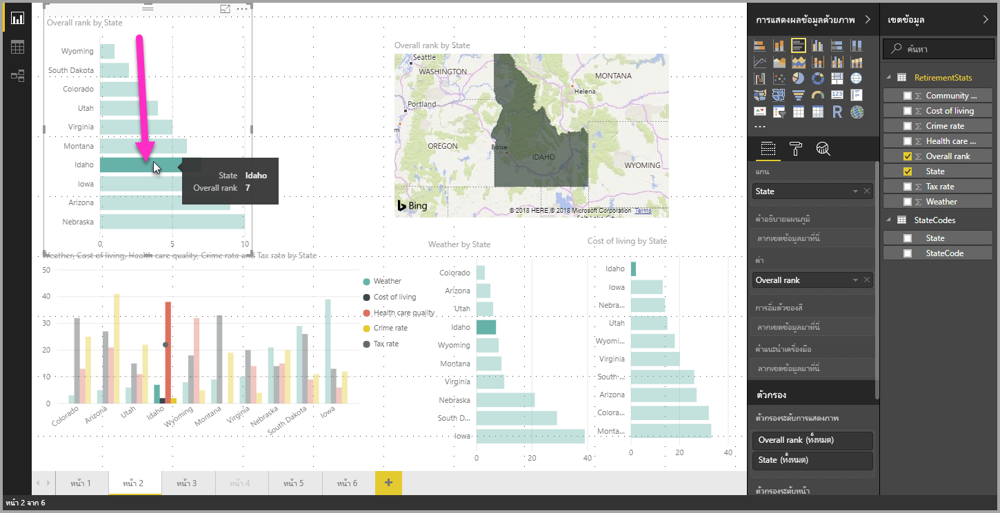
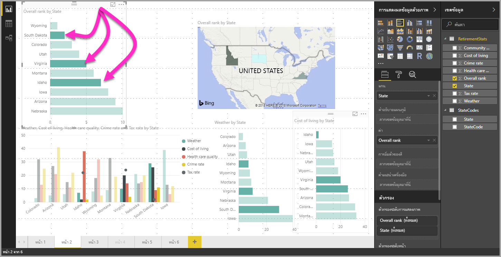

# องค์ประกอบข้อมูลที่เลือกได้หลายรายการในภาพที่ใช้ Power BI Desktop

ใน Power BI Desktop คุณสามารถเน้นจุดข้อมูลในภาพที่กำหนดได ้เพียงแค่คลิกบนจุดข้อมูลในภาพ ตัวอย่างเช่น ถ้าคุณมีแถบที่สำคัญหรือองค์ประกอบแผนภูมิ และคุณต้องการให้ภาพรายการอื่น ๆ ในหน้ารายงานเน้นข้อมูลตามสิ่งที่คุณเลือก ให้คลิกองค์ประกอบของข้อมูลในภาพใดภาพหนึ่ง แล้วคุณก็จะเห็นผลลัพธ์ที่ปรากฏในภาพอื่น ๆ ในหน้านั้น นี่คือการเน้นพื้นฐาน หรือการเน้นรายการที่เลือกเพียงรายการเดียว รูปต่อไปนี้จะแสดงการเน้นพื้นฐาน 

เมื่อใช้การเลือกหลายรายการ คุณก็สามารถเลือกจุดข้อมูลมากกว่าหนึ่งรายการในหน้ารายงาน**Power BI Desktop**ของคุณ และเน้นผลลัพธ์ผ่านภาพต่าง ๆ ในหน้านั้นได้ ซึ่งจะเหมือนกับข้อความ**และ** หรือฟังก์ชันการทำงาน เช่น "เน้นผลลัพธ์สำหรับไอดาโฮ **และ**เวอร์จิเนีย" เมื่อต้องการเลือกจุดข้อมูลหลายรายการในภาพ เพียงแค่ใช้ **CTRL + คลิก** เพื่อเลือกจุดข้อมูลหลายรายการ รูปต่อไปนี้จะแสดง **จุดข้อมูลหลายรายการ** ที่เลือก (เลือกหลายรายการ) ไว้

วิธีการนี้เหมือนจะเป็นคุณลักษณะพื้นฐานธรรมดา แต่จะแสดงข้อมูลโอกาสได้ทุกประเภท เมื่อคุณสร้าง แชร์ และโต้ตอบกับรายงาน 

## ขั้นตอนถัดไป

คุณอาจมีความสนใจบทความต่อไปนี้:

* [ใช้เส้นตารางและจัดชิดกับเส้นตารางในรายงาน Power BI Desktop](desktop-gridlines-snap-to-grid.md)
* [เกี่ยวกับตัวกรองและการเน้นในรายงาน Power BI](power-bi-reports-filters-and-highlighting.md)

