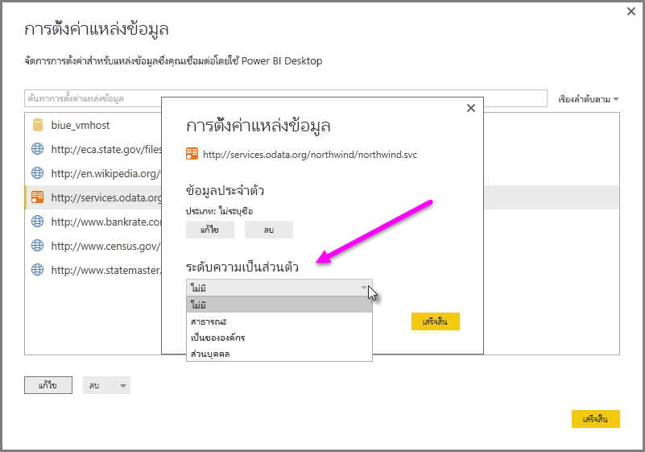

# ระดับความเป็นส่วนตัวของ Power BI Desktop
ใน**Power BI Desktop** ระดับความเป็นส่วนตัวระบุระดับการแยกที่กำหนดระดับ ซึ่งแหล่งข้อมูลหนึ่งจะถูกแยกจากแหล่งข้อมูลอื่น ๆ แม้ว่าระดับการแยกแบบเข้มงวด จะป้องกันข้อมูลจากการแลกเปลี่ยนระหว่างแหล่งข้อมูล แต่อาจลดทำงานและมีผลกระทบกับประสิทธิภาพ

การตั้งค่า**ระดับความเป็นส่วนตัว** พบใน**ไฟล์ > ตัวเลือกและการตั้งค่า > ตัวเลือก**แล้ว**ไฟล์ปัจจุบัน > ความเป็นส่วนตัว** กำหนดว่าจะใช้ Power BI Desktop การตั้งค่าระดับความเป็นส่วนตัวขณะรวมข้อมูลหรือไม่ กล่องโต้ตอบนี้ลิงก์ไปยังเอกสาร Power BI Desktop ที่เกี่ยวกับระดับความเป็นส่วนตัวและระดับความเป็นส่วนตัว (บทความนี้)

## ตั้งค่าระดับความเป็นส่วนตัว
ด้วยการตั้งค่าระดับความเป็นส่วนตัว คุณสามารถระบุระดับการแยกที่กำหนดระดับ ซึ่งแหล่งข้อมูลหนึ่งจะถูกแยกจากแหล่งข้อมูลอื่น ๆ

| การตั้งค่า | คำอธิบาย | แหล่งข้อมูลตัวอย่าง |
| --- | --- | --- |
| **แหล่งข้อมูลส่วนตัว** |แหล่งข้อมูล**ส่วนตัว**ประกอบด้วยข้อมูลที่สำคัญหรือเป็นความลับ และการมองเห็นของแหล่งข้อมูลอาจถูกจำกัดให้ผู้ใช้ที่ได้รับอนุญาต แหล่งข้อมูลส่วนตัวถูกแยกจากกันโดยสิ้นเชิงจากแหล่งข้อมูลอื่น ๆ |ข้อมูล Facebook ไฟล์ข้อความที่ประกอบด้วยการให้หุ้นเป็นรางวัล หรือเวิร์กบุ๊กที่ประกอบด้วยพนักงานตรวจทานข้อมูล |
| **แหล่งข้อมูลขององค์กร** |แหล่งข้อมูล**องค์กร**จำกัดการมองเห็นของแหล่งข้อมูลให้กับกลุ่มบุคคลที่เชื่อถือได้ แหล่งข้อมูล**องค์กร**ถูกแยกออกจากแหล่งข้อมูล**สาธารณะ**ทั้งหมด แต่สามารถมองเห็นแหล่งข้อมูล**องค์กร**อื่นได้ |เอกสาร**Microsoft Word**อินทราเน็ตไซต์ SharePoint ที่มีการอนุญาตนั้นเปิดให้กลุ่มบุคคลที่เชื่อถือได้ |
| **แหล่งข้อมูลสาธารณะ** |แหล่งข้อมูล **สาธารณะ**อนุญาตให้ทุกคนมองเห็นข้อมูลมีอยู่ในแหล่งข้อมูลนี้ได้ เฉพาะไฟล์ แหล่งข้อมูลในอินเทอร์เน็ต หรือข้อมูลในเวิร์กบุ๊กสามารถถูกทำเครื่องหมายให้เป็น**สาธารณะ**ได้ |ข้อมูลฟรีจาก Microsoft Azure Marketplace ข้อมูลจากหน้า Wikipedia หรือไฟล์ภายในเครื่องที่ประกอบด้วยข้อมูลที่คัดลอกจากเว็บไซต์สาธารณะ |

## กำหนดการตั้งค่าระดับความเป็นส่วนตัว
กล่องโต้ตอบการตั้งค่า**ความเป็นส่วนตัว**สำหรับแต่ละแหล่งข้อมูลใน**ไฟล์ > ตัวเลือกและการตั้งค่า > การตั้งค่าแหล่งข้อมูล**

เพื่อกำหนดค่าระดับความเป็นส่วนตัวแหล่งข้อมูล เลือกแหล่งข้อมูล จากนั้นเลือก**แก้ไข** กล่องโต้ตอบ**การตั้งค่าแหล่งข้อมูล**ปรากฏขึ้น ซึ่งคุณสามารถเลือกระดับความเป็นส่วนตัวที่เหมาะสมจากเมนูดรอปดาวน์ที่ด้านล่างของกล่องโต้ตอบ ดังที่แสดงในรูปต่อไปนี้

> [!CAUTION]
> คุณควรกำหนดค่าแหล่งข้อมูลที่ประกอบด้วยข้อมูลที่สำคัญ หรือเป็นความลับสูงเป็น**ส่วนตัว**
> 

## กำหนดค่าระดับความเป็นส่วนตัว
**ระดับความเป็นส่วนตัว**เป็นการตั้งค่าที่ถูกตั้งในการ**รวมข้อมูลตามการตั้งค่าระดับความเป็นส่วนตัวของคุณสำหรับแต่ละแหล่ง**ตามค่าเริ่มต้น ซึ่งหมายความว่า**ระดับความเป็นส่วนตัว**ที่ไม่ได้เปิดใช้งาน

| การตั้งค่า | คำอธิบาย |
| --- | --- |
| **รวมข้อมูลตามการตั้งค่าระดับความเป็นส่วนตัวของคุณสำหรับแต่ละแหล่ง**(และการตั้งค่าเริ่มต้น) |ตั้งค่าระดับความเป็นส่วนตัวจะใช้เพื่อกำหนดระดับการแยกระหว่างแหล่งข้อมูลเมื่อมีการรวมข้อมูล |
| **ละเว้นระดับความเป็นส่วนตัวและปรับปรุงการทำงานอย่างมีประสิทธิภาพ** (ปิด) |ระดับความเป็นส่วนจะคิดเมื่อรวมข้อมูล อย่างไรก็ตามประสิทธิและการทำงานของข้อมูลอาจเพิ่ม |

> **หมายเหตุด้านความปลอดภัย** การเปิดใช้งาน**ระดับความเป็นส่วนตัว**โดยการเลือก**ละเว้นระดับความเป็นส่วนตัว และอาจปรับปรุงประสิทธิภาพการทำงาน**ในกล่องโต้ตอบ**ระดับความเป็นส่วนตัว** อาจเปิดเผยข้อมูลที่สำคัญ หรือที่เป็นความลับกับบุคคลที่ไม่ได้รับอนุญาต อย่าเปิดใช้งาน**ระดับความเป็นส่วนตัว**จนกว่าคุณจะมั่นใจได้ว่า แหล่งข้อมูลนั้นไม่ประกอบไปด้วยข้อมูลที่สำคัญหรือเป็นความลับ
> 
> 

> [!CAUTION]
> การ**ละเว้นระดับความเป็นส่วนตัวและปรับปรุงการทำงานอย่างมีประสิทธิภาพ**ใช้ไม่ได้กับ Power BI service ด้วยเช่นนั้น รายงาน Power BI Desktop กับการตั้งค่าเปิดใช้งานที่ถูกเผยแพร่ไปยัง Power BI service นี้ *ไม่*สะท้อนลักษณะการทำงานเมื่อถูกใช้ใน service
> 

**กำหนดค่าระดับความเป็นส่วนตัว**

ใน Power BI Desktop หรือในตัวแก้ไขคิวรี เลือก**ไฟล์ > ตัวเลือกและการตั้งค่า > ตัวเลือก**แล้วเลือก**ไฟล์ปัจจุบัน > ความเป็นส่วนตัว**

a. เมื่อ**รวมข้อมูลตามการตั้งค่าระดับความเป็นส่วนตัวสำหรับแต่ละแหล่งของคุณ**ถูกเลือกอยู่ จะรวมข้อมูลตามการตั้งค่าระดับความเป็นส่วนตัวของคุณ ผสานข้อมูลข้ามเขตความเป็นส่วนตัวแบบแยกต่างหากจะส่งผลให้กำหนดบัฟเฟอร์ข้อมูลบางตัว

b. เมื่อ**ละเว้นระดับความเป็นส่วนตัวและปรับปรุงการทำงานอย่างมีประสิทธิภาพ**ถูกเลือกอยู่ ข้อมูลจะถูกรวมโดยไม่คำนึงถึงระดับความเป็นส่วนตัวของคุณ ซึ่งไม่สามารถเปิดเผยข้อมูลที่สำคัญ หรือเป็นความลับให้กับผู้ใช้ไม่ได้รับอนุญาต การตั้งค่าอาจปรับปรุงประสิทธิภาพและการทำงาน

> **หมายเหตุด้านความปลอดภัย** การเลือก**ละเว้นระดับความเป็นส่วนตัว และการปรับปรุงประสิทธิภาพการทำงาน**อาจปรับปรุงประสิทธิภาพการทำงาน อย่างไรก็ตาม Power BI Desktop ไม่สามารถรับรองความเป็นส่วนตัวของข้อมูลที่ผสานลงในไฟล์ Power BI Desktop ได้
> 
> 

