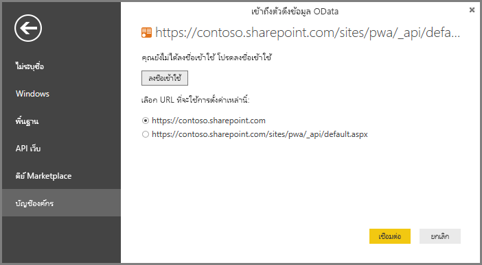

# Project Online: เชื่อมต่อกับข้อมูลผ่านทาง Power BI Desktop
คุณสามารถเชื่อมต่อไปยังข้อมูลใน Project Online ผ่านทาง Power BI Desktop

## ขั้นตอนที่ 1: ดาวน์โหลด Power BI Desktop
1. [ดาวน์โหลด Power BI Desktop](https://go.microsoft.com/fwlink/?LinkID=521662) แล้วเรียกใช้ตัวติดตั้งเพื่อรับ **Power BI Desktop** บนคอมพิวเตอร์ของคุณ

## ขั้นตอนที่ 2: เชื่อมต่อกับ Project Online ด้วย OData
1. เปิด **Power BI Desktop**
2. บนหน้าจอ*ยินดีต้อนรับ* เลือก**รับข้อมูล**
3. เลือก**ตัวดึงข้อมูล OData** และเลือก**เชื่อมต่อ**
4. ใส่ที่อยู่ของตัวดึงข้อมูล OData ของคุณในกล่อง URL แล้ว คลิกตกลง
   
   ถ้าที่อยู่สำหรับไซต์ Project Web App ของคุณเป็นรูปแบบ *https://\<tenantname\>.sharepoint.com/sites/pwa* ที่อยู่ที่คุณจะใส่สำหรับตัวดึงข้อมูล OData ของคุณคือ *https://\<tenantname\>.sharepoint.com/sites/pwa/\_api/Projectdata*
   
   สำหรับตัวอย่าง เรากำลังใช้ https://contoso.sharepoint.com/sites/pwa/default.aspx
5. Power BI Desktop จะพร้อมท์ให้คุณรับรองสิทธิ์กับบัญชี Office 365 ของคุณ เลือกบัญชีผู้ใช้ขององค์กร แล้วใส่ข้อมูลประจำตัวของคุณ
   
   

บัญชีที่คุณใช้เพื่อเชื่อมต่อกับตัวดึงข้อมูล OData อย่างน้อยต้องมีตัวแสดงพอร์ตโครงการเพื่อข้าถึงไซต์ Project Web App 

จากที่นี่ คุณสามารถเลือกตารางที่คุณต้องการจะเชื่อมต่อและสร้างแบบสอบถาม  อยากทราบวิธีการเริ่มต้นใช้งานใช่หรือไม่  โพสต์ในบล็อกต่อไปนี้จะแสดงวิธีการสร้างแผนภูมิการวัดความก้าวหน้าจากข้อมูล Project Online ของคุณ  โพสต์ในบล็อกจะอ้างอิงเกี่ยวกับการใช้ Power Query เพื่อเชื่อมต่อกับ Project Online แต่ยังสามารถใช้กับ Power BI Desktop ได้เช่นกัน

[สร้างแผนภูมิการวัดความก้าวหน้าสำหรับโครงการโดยใช้ Power Pivot และ Power Query](https://blogs.office.com/2014/03/24/creating-burndown-charts-for-project-using-power-pivot-and-power-query/)

