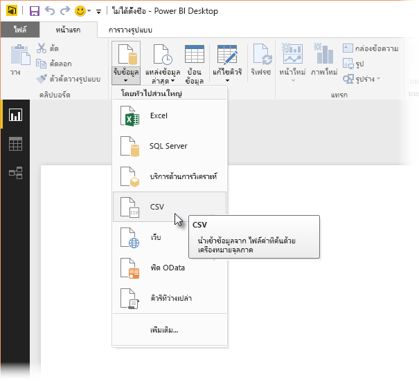
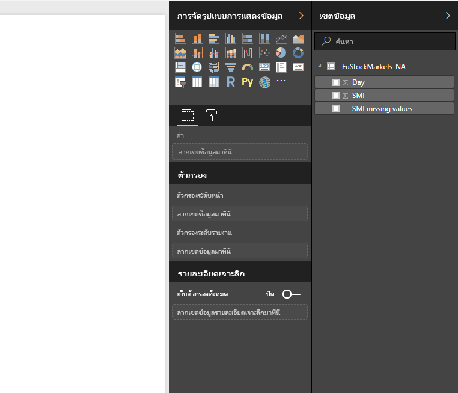
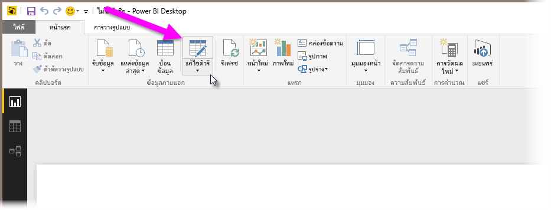
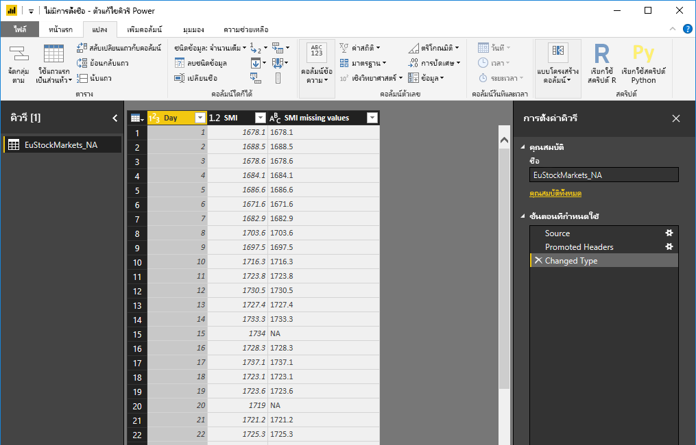
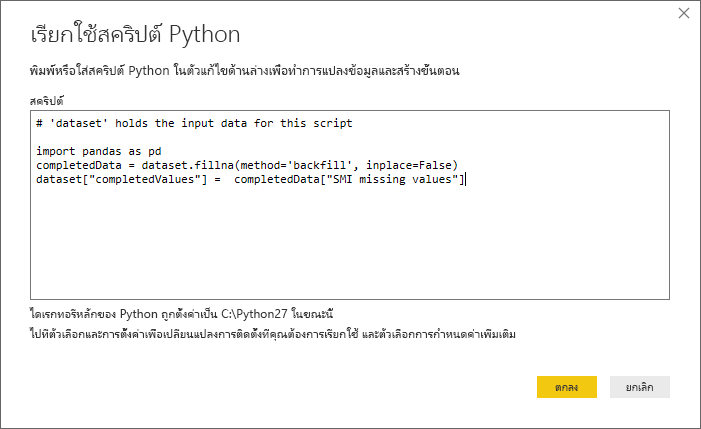
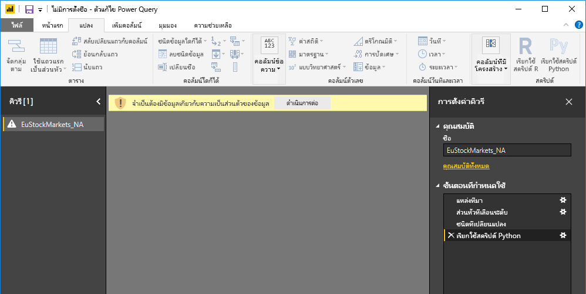
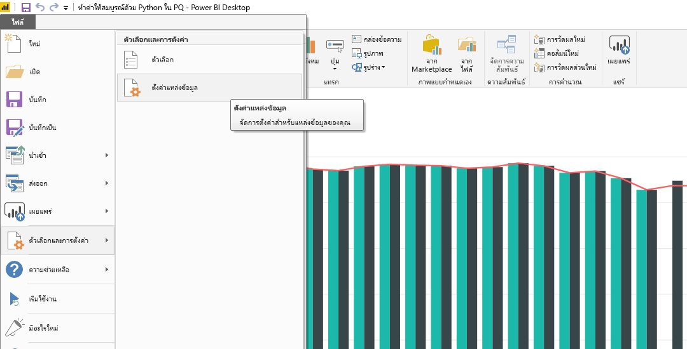

# การใช้ Python ใน Query Editor
คุณสามารถใช้ **Python** ซึ่งเป็นภาษาการเขียนโปรแกรมที่นักสถิติ นักวิทยาศาสตร์ข้อมูล และนักวิเคราะห์ข้อมูลใช้กันอย่างกว้างขวางใน **ตัวแก้ไขคิวรีของ** Power BI Desktop การรวม Python ใน **ตัวแก้ไขคิวรี** ช่วยให้คุณดำเนินการทำความสะอาดข้อมูลโดยใช้ Python  และดำเนินการวิเคราะห์และการจัดรูปทรงข้อมูลขั้นสูงในชุดข้อมูล รวมทั้งการเติมเต็มข้อมูลที่คาดหาย การคาดการณ์ และการทำคลัสเตอร์ และอื่นๆ **Python** เป็นภาษาที่มีประสิทธิภาพ และสามารถใช้ได้ใน **ตัวแก้ไขคิวรี** เพื่อเตรียมแบบจำลองข้อมูลของคุณ และสร้างรายงาน

## ติดตั้ง Python
เมื่อต้องใช้ **Python** ใน **ตัวแก้ไขคิวรี** ของ Power BI Desktop คุณจำเป็นต้องติดตั้ง **Python** บนเครื่องคอมพิวเตอร์ของคุณ คุณสามารถดาวน์โหลดและติดตั้ง **Python** ได้ฟรีจากตำแหน่งที่ตั้งต่าง ๆ ซึ่งรวมถึง[หน้าดาวน์โหลด Official Python](https://www.python.org/) และ [Anaconda](https://anaconda.org/anaconda/python/)

## การใช้ Python ใน Query Editor
เพื่อแสดงวิธีการใช้ **Python** ใน **ตัวแก้ไขคิวรี** ลองใช้ตัวอย่างนี้จากชุดข้อมูลตลาดโดยพิจารณาจากไฟล์ CSV ที่คุณสามารถ[ดาวน์โหลดได้จากที่นี่](http://download.microsoft.com/download/F/8/A/F8AA9DC9-8545-4AAE-9305-27AD1D01DC03/EuStockMarkets_NA.csv)และทำตามขั้นตอน ขั้นตอนสำหรับตัวอย่างนี้มีดังนี้:

1. ก่อนอื่น โหลดข้อมูลของคุณลงใน **Power BI Desktop** ในตัวอย่างนี้ โหลดไฟล์ *EuStockMarkets_NA.csv* และเลือก**รับข้อมูล > CSV** จาก ribbon ของ **Home** ใน **Power BI Desktop**
   
   
2. เลือกไฟล์ แล้วเลือก**เปิด**และ CSV จะแสดงในกล่องโต้ตอบ**ไฟล์ CSV**
   
   
3. เมื่อข้อมูลถูกโหลด คุณจะเห็นข้อมูลในบานหน้าต่าง**เขตข้อมูล**ใน Power BI Desktop
   
   
4. เปิด**ตัวแก้ไขคิวรี**โดยเลือก**แก้ไขคิวรี**จากแท็บ **Home** ใน**Power BI Desktop**
   
   
5. ในแท็บ **แปลง** เลือก **เรียกใช้สคริปต์ R** และตัวแก้ไข**เรียกใช้สคริปต์ Python** จะปรากฏขึ้น (แสดงอยู่ในขั้นตอนถัดไป) โปรดสังเกตว่า แถว 15 และ 20 ไม่มีข้อมูลบางอย่าง และแถวอื่นๆ ก็ขาดข้อมูลบางอย่างที่คุณไม่สามารถมองเห็นในรูปต่อไปนี้ ขั้นตอนด้านล่างแสดงวิธีที่ Python สามารถ (และจะ) ใส่ข้อมูลในแถวเหล่านั้นให้สมบูรณ์
   
   
6. สำหรับตัวอย่างนี้ ใส่รหัสสคริปต์ต่อไปนี้:
   
       import pandas as pd
       completedData = dataset.fillna(method='backfill', inplace=False)
       dataset["completedValues"] =  completedData["SMI missing values"]
   
   > [!NOTE]
   > คุณจะต้องมีไลบรารี *pandas* ติดตั้งอยู่ในสภาพแวดล้อม Python เพื่อให้รหัสสคริปต์ก่อนหน้าทำงานอย่างถูกต้อง หากต้องการติดตั้ง andas ให้เรียกใช้คำสั่งต่อไปนี้ในการติดตั้ง Python:  |      > pip install pandas
   > 
   > 
   
   เมื่อวางรหัสลงในกล่องโต้ตอบ **เรียกใช้สคริปต์ Python** รหัสจะมีลักษณะดังต่อไปนี้:
   
   
7. หลังจากเลือก**ตกลง**, **ตัวแก้ไขคิวรี**จะแสดงคำเตือนเกี่ยวกับความเป็นส่วนตัวของข้อมูล
   
   
8. เพื่อให้สคริปต์ Python ทำงานอย่างถูกต้องในบริการของ Power BI คุณจำเป็นต้องตั้งค่าแหล่งข้อมูลทั้งหมดเป็น *สาธารณะ* สำหรับข้อมูลเพิ่มเติมเกี่ยวกับการตั้งค่าความเป็นส่วนตัวและผลกระทบของการตั้งค่า ดู[ระดับความเป็นส่วนตัว](desktop-privacy-levels.md)
   
   
   
   โปรดสังเกตคอลัมน์ใหม่ในบานหน้าต่าง**เขตข้อมูล**ที่เรียกว่า *completedValues* โปรดสังเกตว่า มีองค์ประกอบข้อมูลบางอย่างหายไป เช่น ในแถวที่ 15 และ 18 โปรดดูในส่วน วิธีการที่ Python จัดการเรื่องเหล่านั้นในหัวข้อถัดไป
   

ด้วยสคริปต์ Python เพียงห้าบรรทัด **ตัวแก้ไขคิวรี** จะกรอกค่าที่หายไปด้วยแบบจำลองสำหรับการพยากรณ์

## สร้างวิชวลจากข้อมูลสคริปต์ Python
ในตอนนี้ เราสามารถสร้างวิชวลเพื่อดูวิธีที่สคริปต์ Python ทำงานด้วยการใช้ไลบรารี *pandas* เติมค่าที่หายไป ดังที่แสดงในรูปต่อไปนี้:

เมื่อวิชวลดังกล่าวเสร็จสมบูรณ์ และภาพอื่นๆ ที่คุณอาจต้องการสร้างโดยใช้ **Power BI Desktop** คุณสามารถบันทึกไฟล์ของ **Power BI Desktop** (ซึ่งจะบันทึกเป็นไฟล์ .pbix) และจากนั้น ใช้แบบจำลองข้อมูลที่รวมถึงสคริปต์ Python ที่เป็นส่วนหนึ่งของแบบจำลองนั้นในบริการของ Power BI

> [!NOTE]
> ต้องการดูไฟล์ .pbix ที่เสร็จสมบูรณ์ด้วยขั้นตอนเหล่านี้หรือไม่ คุณโชคดี - คุณสามารถดาวน์โหลดไฟล์ของ **Power BI Desktop** ที่เสร็จสมบูรณ์ในตัวอย่างเหล่านี้[ที่นี่](http://download.microsoft.com/download/A/B/C/ABCF5589-B88F-49D4-ADEB-4A623589FC09/Complete%20Values%20with%20Python%20in%20PQ.pbix)

เมื่อคุณอัปโหลดไฟล์ .pbix ไปยังบริการของ Power BI จำเป็นต้องทำขั้นตอนเพิ่มเติมเพื่อให้สามารถรีเฟรชข้อมูล (ในบริการ) และเพื่อให้ปรับปรุงภาพที่แสดงข้อมูลในบริการได้ (ข้อมูลต้องเข้าถึง Python เพื่อปรับปรุงการแสดงผลด้วยภาพ) ขั้นตอนเพิ่มเติมมีดังนี้:

* **เปิดใช้งานรีเฟรชชุดข้อมูลตามกำหนดการ** - จะทำให้สคริปต์ Python รีเฟรชสมุดงานที่ประกอบด้วยชุดข้อมูลของคุณตามกำหนดการ ดู[ตั้งค่าการรีเฟรชตามกำหนดการ](refresh-scheduled-refresh.md)ซึ่งยังรวมถึงข้อมูลเกี่ยวกับ**เกตเวย์ส่วนบุคคล**
* **ติดตั้งเกตเวย์ส่วนบุคคล** - คุณจำเป็นต้องติดตั้ง**เกตเวย์ส่วนบุคคล**บนเครื่องที่มีไฟล์อยู่ และซึ่งมีการติดตั้ง Python บริการของ Power BI ต้องเข้าถึงสมุดงานนั้นและแสดงภาพที่ได้รับการปรับปรุงแล้ว คุณสามารถหาข้อมูลเพิ่มเติมเกี่ยวกับวิธีการ[ติดตั้งและกำหนดค่าเกตเวย์ส่วนบุคคล](personal-gateway.md)ได้

## ข้อจำกัด
มีข้อจำกัดบางอย่างของการคิวรีและสคริปต์ Python ที่ถูกสร้างขึ้นใน **ตัวแก้ไขคิวรี**:

* ต้องตั้งค่าแหล่งข้อมูล Python ทั้งหมดเป็น*สาธารณะ*และขั้นตอนอื่นๆ ทั้งหมดในคิวรีที่ถูกสร้างขึ้นใน **ตัวแก้ไขคิวรี** ต้องเป็นสาธารณะด้วย เมื่อต้องเข้าตั้งค่าแหล่งข้อมูล ใน **Power BI Desktop** เลือก**ไฟล์ > ตัวเลือกและการตั้งค่า > การตั้งค่าแหล่งข้อมูล**
  
  
  
  จากกล่องโต้ตอบ**การตั้งค่าแหล่งข้อมูล** เลือกแหล่งข้อมูล และจากนั้น เลือก**แก้ไขสิทธิ์...** และกำหนดให้**ระดับความเป็นส่วนตัว**ถูกตั้งค่าเป็น*สาธารณะ*
  
      
* เมื่อต้องการรีเฟรชการแสดงผลด้วยวิชวล Python หรือชุดข้อมูลของคุณตามกำหนดการ คุณจำเป็นต้องเปิดใช้งาน**รีเฟรชตามกำหนดการ**และมี**เกตเวย์ส่วนบุคคล**ที่ติดตั้งบนคอมพิวเตอร์ที่บรรจุสมุดงานและมีการติดตั้ง Python สำหรับข้อมูลเพิ่มเติมในทั้งสองเรื่อง ดูหัวข้อก่อนหน้าในบทความนี้ ซึ่งมีลิงก์เพื่อเรียนรู้เพิ่มเติมเกี่ยวกับเรื่องนี้แต่ละเรื่อง
* ในขณะนี้ไม่รองรับตารางที่ซ้อนกัน (ตารางของตาราง) 

มีวิธีการต่างๆ ที่คุณสามารถทำได้ด้วย Python และคิวรีแบบกำหนดเอง ดังนั้น คุณควรสำรวจและจัดรูปแบบข้อมูลของคุณอย่างที่คุณต้องการให้ปรากฏ

