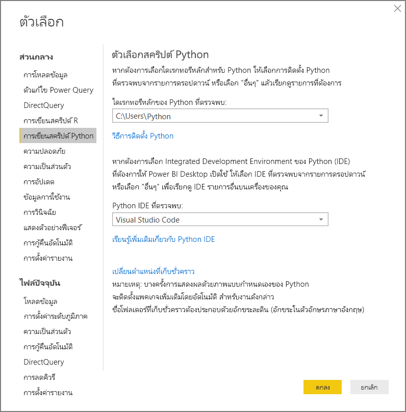
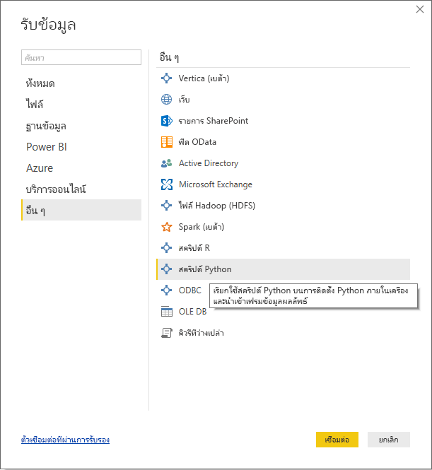
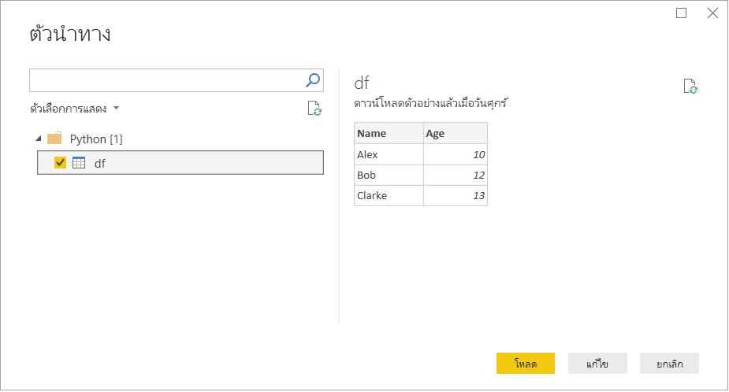

# <a name="run-python-scripts-in-power-bi-desktop"></a>เรียกใช้สคริปต์ Python ใน Power BI Desktop

คุณสามารถเรียกใช้สคริปต์ Python โดยตรงใน Power BI Desktop และนำเข้าชุดข้อมูลผลลัพธ์ลงในแบบจำลองข้อมูล Power BI Desktop ได้

## <a name="install-python"></a>ติดตั้ง Python

เพื่อเรียกใช้สคริปต์ Python ใน Power BI Desktop คุณจำเป็นต้องติดตั้ง Python บนเครื่องคอมพิวเตอร์ของคุณ คุณสามารถดาวน์โหลด Python ได้จาก [เว็บไซต์ Python](https://www.python.org/) การเผยแพร่การเขียนสคริปต์ภาษา Python ในปัจจุบันสนับสนุนอักขระ Unicode และช่องว่างในเส้นทางการติดตั้ง

### <a name="install-required-python-packages"></a>ติดตั้งแพคเกจ Python ที่จำเป็น

การรวม Power BI Python จำเป็นต้องติดตั้งแพ็กเกจ Python สองแพ็กเกจ:

* [Pandas](https://pandas.pydata.org/) ไลบรารีซอฟต์แวร์สำหรับการจัดการข้อมูลและการวิเคราะห์ ซึ่งมีโครงสร้างข้อมูลและการดำเนินงานสำหรับการจัดการตาราง ตัวเลข และชุดข้อมูลเวลา ข้อมูลที่นำเข้าของคุณต้องอยู่ใน [ดาต้าเฟรมของ pandas](https://www.tutorialspoint.com/python_pandas/python_pandas_dataframe.htm) ดาต้าเฟรมเป็นโครงสร้างข้อมูลสองมิติ ตัวอย่างเช่น ข้อมูลถูกจัดแนวในแบบตารางที่มีแถวและคอลัมน์
* [Matplotlib](https://matplotlib.org/) ไลบรารีการลงจุดสำหรับ Python และส่วนขยายทางคณิตศาสตร์เชิงตัวเลข [NumPy](https://www.numpy.org/) ซึ่งมี API เชิงวัตถุสำหรับการฝังจุดลงในแอปพลิเคชันโดยใช้ชุดเครื่องมือ GUI อเนกประสงค์ (เช่น Tkinter wxPython Qt หรือ GTK+)

ในคอนโซลหรือเชลล์ ให้ใช้เครื่องมือประเภทคอมมานด์ไลน์ [pip](https://pip.pypa.io/en/stable/) เพื่อติดตั้งทั้งสองแพ็กเกจ เครื่องมือ pip เป็นแพ็กเกจที่ประกอบด้วย Python เวอร์ชันใหม่ล่าสุด

```CMD
pip install pandas
pip install matplotlib
```

## <a name="enable-python-scripting"></a>เปิดใช้งานการเขียนสคริปต์ภาษา Python

เพื่อเปิดใช้งานการเขียนสคริปต์ภาษา Python:

1. ใน Power BI Desktop ให้เลือกตัวเลือก **ไฟล์** > **และ** > **ตัวเลือกการตั้งค่า** > **การเขียนสคริปต์ภาษา Python** หน้า **ตัวเลือกสคริปต์ภาษา Python** ปรากฏขึ้น

   

1. หากจำเป็น ให้ระบุเส้นทางการติดตั้ง Python บนเครื่องของคุณใน **ไดเรกทอรีหลักของ Pythonที่ตรวจพบ**

   ในรูปภาพด้านบน เส้นทางการติดตั้ง Python บนเครื่องคือ *C:\Python* ตรวจสอบให้แน่ใจว่าเส้นทางสำหรับการติดตั้ง Python บนเครื่องเป็นอันที่คุณต้องการใช้กับ Power BI Desktop

1. เลือก**ตกลง**

เมื่อคุณระบุการติดตั้ง Python ของคุณ คุณก็พร้อมที่จะเริ่มต้นใช้งานสคริปต์ Python ใน Power BI Desktop แล้ว

## <a name="run-python-scripts"></a>เรียกใช้สคริปต์ Python

คุณสามารถเรียกใช้สคริปต์ Python และสร้างแบบจำลองข้อมูลได้ภายในไม่กี่ขั้นตอน จากแบบจำลองนี้คุณสามารถสร้างรายงานและแชร์ในบริการ Power BI ได้

### <a name="prepare-a-python-script"></a>เตรียมสคริปต์ Python

ประการแรก ให้สร้างสคริปต์ Python ของคุณในสภาพแวดล้อมการพัฒนา และตรวจสอบให้แน่ใจว่าการเรียกใช้สำเร็จ ตัวอย่างเช่น ต่อไปนี้เป็นสคริปต์ Python แบบง่ายที่นำเข้า pandas และใช้ดาต้าเฟรม:

```python
import pandas as pd
data = [['Alex',10],['Bob',12],['Clarke',13]]
df = pd.DataFrame(data,columns=['Name','Age'],dtype=float)
print (df)
```

เมื่อมีการเรียกใช้ สคริปต์นี้จะย้อนกลับ

```python
     Name   Age
0    Alex  10.0
1     Bob  12.0
2  Clarke  13.0
```

เมื่อเตรียมและเรียกใช้สคริปต์ Python ใน Power BI Desktop จะมีข้อจำกัดบางอย่าง:

* นำเข้าเฉพาะดาต้าเฟรมของ Pandas เท่านั้น ดังนั้นตรวจสอบให้แน่ใจว่าข้อมูลที่คุณต้องการนำเข้าสู่ Power BI นั้นมีอยู่ในดาต้าเฟรม
* สคริปต์ Python ใด ๆ ที่ทำงานนานกว่า 30 นาทีจะหมดเวลา
* การเรียกแบบโต้ตอบในสคริปต์ Python เช่น รอให้ผู้ใช้ป้อนข้อมูล จะหยุดการทำงานการของสคริปต์
* เมื่อตั้งค่าไดเรกทอรีการทำงานภายในสคริปต์ Python คุณ*ต้อง*กำหนดเส้นทางแบบเต็มไปยังไดเรกทอรีการทำงาน แทนที่จะเป็นเส้นทางสัมพัทธ์
* ในขณะนี้ไม่รองรับตารางแบบซ้อนกัน

### <a name="run-your-python-script-and-import-data"></a>เรียกใช้สคริปต์ Python ของคุณ และนำเข้าข้อมูล

เพื่อเรียกใช้สคริปต์ Python ใน Power BI Desktop:

1. ในริบบอนหน้าหลัก เลือก**รับข้อมูล** >  **อื่น**

1. เลือก**สคริปต์** >  **Python อื่น**ดังที่แสดงในรูปภาพต่อไปนี้:

   

1. เลือก **เชื่อมต่อ** เวอร์ชันของ Python ที่ติดตั้งล่าสุดบนเครื่องคอมพิวเตอร์ของคุณจะถูกเลือกเป็นกลไก Python ของคุณ คัดลอกสคริปต์ของคุณลงในกล่องโต้ตอบ **สคริปต์ Python** ที่ปรากฏขึ้น ที่นี่เราป้อนสคริปต์ Python ที่แสดงก่อนหน้านี้

   

1. เลือก**ตกลง** หากสคริปต์ทำงานได้สำเร็จแล้ว **ตัวนำทาง** จะปรากฏขึ้นและคุณสามารถโหลดข้อมูลและใช้งานได้ ตัวอย่างเช่น เลือก **df** ดังที่แสดงในรูปภาพจากนั้นเลือก **โหลด**

    

### <a name="troubleshooting"></a>การแก้ไขปัญหา

หากไม่มีการติดตั้งหรือระบุ Python คำเตือนจะปรากฏขึ้น คุณยังสามารถเห็นคำเตือนหากคุณมีการติดตั้งภายในเครื่องหลายเครื่อง เยี่ยมชมและทบทวนส่วนการติดตั้ง Python และเปิดใช้งานการเขียนสคริปต์ภาษา Python ก่อนหน้า


### <a name="refresh"></a>รีเฟรช

คุณสามารถรีเฟรชสคริปต์ Python ใน Power BI Desktop หากต้องการรีเฟรช ให้ไปที่ริบบอน **หน้าหลัก** และเลือก **รีเฟรช** เมื่อคุณรีเฟรชสคริปต์ Python แล้ว Power BI Desktop จะเรียกใช้สคริปต์ Python อีกครั้ง

## <a name="next-steps"></a>ขั้นตอนถัดไป

ดูข้อมูลเพิ่มเติมเกี่ยวกับ Python ใน Power BI ต่อไปนี้

* [สร้างวิชวล Python ใน Power BI Desktop](desktop-python-visuals.md)
* [ใช้ Python IDE ภายนอกกับ Power BI](desktop-python-ide.md)
