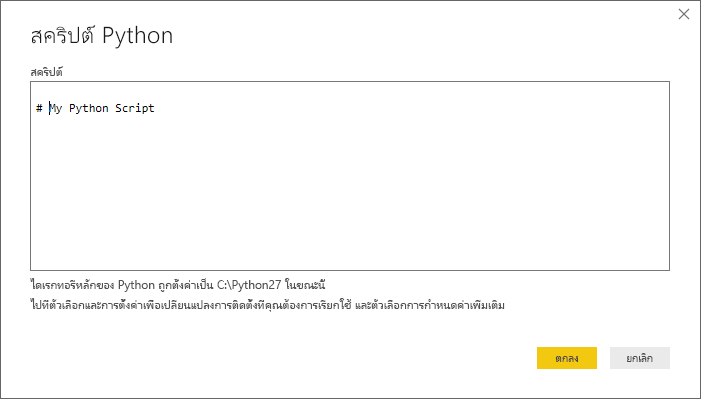

# เรียกใช้สคริปต์ Python ใน Power BI Desktop
คุณสามารถเรียกใช้สคริปต์ Python โดยตรงใน **Power BI Desktop** และนำเข้าชุดข้อมูลผลลัพธ์ลงในรูปแบบข้อมูล Power BI Desktop ได้

## ติดตั้ง Python
เพื่อเรียกใช้สคริปต์ Python ใน Power BI Desktop คุณจำเป็นต้องติดตั้ง **Python** บนเครื่องคอมพิวเตอร์ของคุณ คุณสามารถดาวน์โหลดและติดตั้ง **Python** ได้ฟรีจากตำแหน่งที่ตั้งต่าง ๆ ซึ่งรวมถึง[หน้าดาวน์โหลด Official Python](https://www.python.org/) และ [Anaconda](https://anaconda.org/anaconda/python/) รุ่นปัจจุบันของการเขียนสคริปต์ Python ในPower BI Desktopสนับสนุนอักขระ Unicode ตลอดจนช่องว่าง (อักขระว่าง) ในเส้นทางการติดตั้ง

## เรียกใช้สคริปต์ Python
ด้วยเพียงไม่กี่ขั้นตอนใน Power BI Desktop คุณสามารถเรียกใช้สคริปต์ Python และสร้างรูปแบบข้อมูล จากนั้นคุณสามารถสร้างรายงาน และแชร์บนบริการ Power BI ต่อไปได้

### เตรียมสคริปต์ Python
เพื่อเรียกใช้สคริปต์ Python ใน Power BI Desktop สร้างสคริปต์ Python ของคุณในสภาพแวดล้อมการพัฒนา และการตรวจสอบให้แน่ใจว่าการเรียกใช้สำเร็จ

เพื่อเรียกใช้สคริปต์ใน Power BI Desktop ตรวจสอบให้แน่ใจว่าสคริปต์ทำงานสำเร็จในพื้นที่ทำงานที่สร้างขึ้นใหม่และยังไม่ได้เปลี่ยนแปลงอะไร ซึ่งหมายความว่า ทุกแพคเกจและสคริปต์ที่ขึ้นต่อกัน ต้องโหลดและทำงานได้

เมื่อเตรียมและเรียกใช้สคริปต์ Python ใน Power BI Desktop จะมีข้อจำกัดบางอย่าง:

* นำเข้าเฉพาะเฟรมข้อมูล Pandas เท่านั้นที่ ดังนั้นให้แน่ใจว่าข้อมูลที่คุณต้องการนำเข้าไปยัง Power BI อยู่ในรูปเฟรมข้อมูล
* สคริปต์ Python ใด ๆ ที่ทำงานนานกว่า 30 นาทีจะหมดเวลา
* การเรียกแบบโต้ตอบในสคริปต์ Python เช่น รอให้ผู้ใช้ป้อนข้อมูล จะหยุดการทำงานการของสคริปต์
* เมื่อตั้งค่าไดเรกทอรีการทำงานภายในสคริปต์ Python คุณ*ต้อง*กำหนดเส้นทางแบบเต็มไปยังไดเรกทอรีการทำงาน แทนที่จะเป็นเส้นทางสัมพัทธ์
* ในขณะนี้ไม่รองรับตารางที่ซ้อนกัน (ตารางของตาราง) 

### เรียกใช้สคริปต์ Python ของคุณ และนำเข้าข้อมูล
1. ใน Power BI Desktop ตัวเชื่อมต่อข้อมูลสคริปต์ Python จะอยู่ใน**รับข้อมูล** เมื่อต้องการเรียกใช้สคริปต์ Python ของคุณ เลือก**รับข้อมูล &gt; เพิ่มเติม...** แล้วเลือก**อื่น ๆ&gt; สคริปต์ Python** ดังที่แสดงในรูปต่อไปนี้:
   
   
2. ถ้าติดตั้ง Python ไว้บนเครื่องคอมพิวเตอร์ของคุณ เวอร์ชันที่ติดตั้งล่าสุดจะถูกเลือกเป็นโปรแกรม Python ของคุณ เพียงแค่คัดลอกสคริปต์ของคุณลงในหน้าต่างสคริปต์ แล้วเลือก**ตกลง**
   
   
3. ถ้าไม่มีการติดตั้ง Python หรือไม่มีการระบุ หรือถ้ามีการติดตั้งหลายชุดบนเครื่องคอมพิวเตอร์ของคุณ คำเตือนจะปรากฏขึ้น
   
   
   
   การตั้งค่าการการติดตั้ง Python จะเก็บไว้ส่วนกลางในส่วนการเขียนสคริปต์ Python  ของกล่องโต้ตอบตัวเลือก เพื่อระบุการตั้งค่าการติดตั้ง Python เลือก**ไฟล์ > ตัวเลือกและการตั้งค่า** แล้วเลือก **ตัวเลือก > การเขียนสคริปต์ Python** ถ้ามีการติดตั้ง Python หลายชุด จะมีเมนูดรอปดาวน์ให้คุณเลือกการติดตั้งที่จะใช้งาน นอกจากนี้คุณสามารถเลือก **อื่น ๆ** และกำหนดเส้นทางแบบกำหนดเองได้
   
   
4. เลือก **ตกลง** เพื่อเรียกใช้สคริปต์ Python เมื่อสคริปต์ทำงานเสร็จเรียบร้อย คุณสามารถเลือกเฟรมข้อมูลผลลัพธ์ เพื่อเพิ่มไปยังรูปแบบ Power BI

### รีเฟรช
คุณสามารถรีเฟรชสคริปต์ Python ใน Power BI Desktop เมื่อคุณรีเฟรชสคริปต์ Python แล้ว Power BI Desktop จะเรียกใช้สคริปต์ Python อีกครั้งในสภาพแวดล้อมของ Power BI Desktop

## ขั้นตอนถัดไป
ดูข้อมูลเพิ่มเติมเกี่ยวกับ Python ใน Power BI ต่อไปนี้

* [สร้างวิชวล Python ใน Power BI Desktop](desktop-python-visuals.md)
* [ใช้ Python IDE ภายนอกกับ Power BI](desktop-python-ide.md)