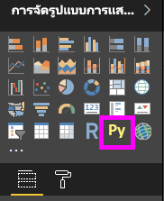
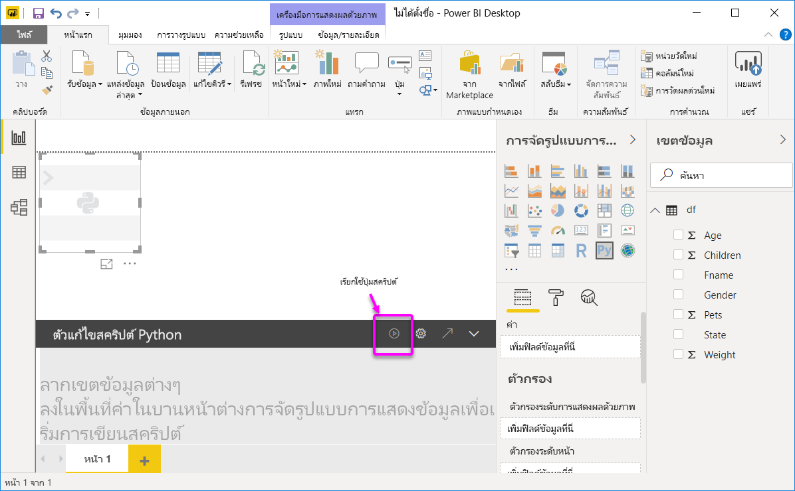
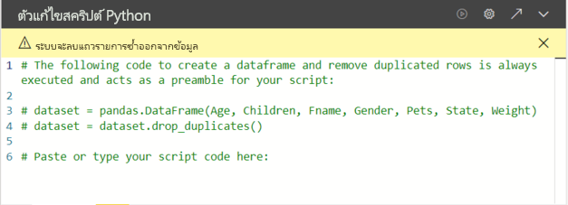

# <a name="create-power-bi-visuals-by-using-python"></a>สร้างภาพของ Power BI โดยใช้ Python
ด้วย **Power BI Desktop** คุณสามารถใช้ **Python** เพื่อแสดงภาพข้อมูลของคุณได้

## <a name="prerequisites"></a>ข้อกำหนดเบื้องต้น

ปฏิบัติตามบทช่วยสอน [เรียกใช้สคริปต์ Python ใน Power BI Desktop](desktop-python-scripts.md) โดยใช้สคริปต์ Python ต่อไปนี้:

```python
import pandas as pd 
df = pd.DataFrame({ 
    'Fname':['Harry','Sally','Paul','Abe','June','Mike','Tom'], 
    'Age':[21,34,42,18,24,80,22], 
    'Weight': [180, 130, 200, 140, 176, 142, 210], 
    'Gender':['M','F','M','M','F','M','M'], 
    'State':['Washington','Oregon','California','Washington','Nevada','Texas','Nevada'],
    'Children':[4,1,2,3,0,2,0],
    'Pets':[3,2,2,5,0,1,5] 
}) 
print (df) 
```
บทความ [เรียกใช้สคริปต์ Python ใน Power BI Desktop](desktop-python-scripts.md) แสดงวิธีการติดตั้ง Python ในเครื่องของคุณและเปิดใช้งานการเขียนสคริปต์ Python ใน **Power BI Desktop** บทช่วยสอนนี้ใช้ข้อมูลจากสคริปต์ด้านบนเพื่อแสดงตัวอย่างการสร้างวิชวล Python

## <a name="create-python-visuals-in-power-bi-desktop"></a>สร้างวิชวล Python ใน Power BI Desktop
1. เลือกไอคอน **วิชวล Python** ในบานหน้าต่าง **การแสดงผลข้อมูลด้วยภาพ**
   
   

1.  ในกล่องโต้ตอบ **เปิดใช้งานวิชวลสคริปต์** ที่ปรากฏขึ้นจากนั้นเลือก **เปิดใช้งาน** 

    เมื่อคุณเพิ่มวิชวล Python ในรายงาน **Power BI Desktop** จะดำเนินการต่อไปนี้:
   
     - รูปภาพวิชวล Python ของพื้นที่ที่สำรองไว้ปรากฏบนพื้นที่ทำงานของรายงาน
   
     - **ตัวแก้ไขสคริปต์ Python** ปรากฏขึ้นทางด้านล่างของบานหน้าต่างกลาง
   
    

1. ขั้นตอนถัดไปให้ลากเขตข้อมูล **อายุ**, **บุตร**, **ชื่อจริง**, **เพศ**, **สัตว์เลี้ยง**, **รัฐ** และ **น้ำหนัก** ไปยังส่วน **ค่า** ที่ระบุว่า "**เพิ่มเขตข้อมูลที่นี่**" 

    

   สคริปต์ Python ของคุณสามารถใช้เขตข้อมูลที่เพิ่มในส่วน **ค่า** แล้วเท่านั้น คุณสามารถเพิ่มหรือลบเขตข้อมูลจากส่วน **ค่า** ขณะทำงานกับสคริปต์ Python ของคุณได้ **Power BI Desktop** ตรวจหาการเปลี่ยนแปลงของเขตข้อมูลโดยอัตโนมัติ
   
   > [!NOTE]
   > ชนิดการรวมเริ่มต้นสำหรับวิชวล Python คือ *ไม่ต้องทำการสรุป*
   > 
   > 
   
1. ขณะนี้คุณสามารถใช้ข้อมูลที่คุณเลือกเพื่อสร้างการลงจุด 

    ขณะที่คุณเลือกหรือลบเขตข้อมูลออก โค้ดที่รองรับในตัวแก้ไขสคริปต์ Python จะถูกสร้างขึ้นหรือถูกนำออกโดยอัตโนมัติ 
    
    เป็นผลจากการเลือกของคุณ ตัวแก้ไขสคริปต์ Python จะสร้างโค้ดการผูกดังต่อไปนี้

    * ตัวแก้ไขสร้างดาต้าเฟรม **ชุดข้อมูล** พร้อมเขตข้อมูลที่คุณเพิ่มเข้าไป 
    * การรวมเริ่มต้นคือ *ไม่ต้องทำการสรุป*
    * คล้ายกับวิชวลตาราง เขตข้อมูลจะถูกจัดกลุ่ม และทำซ้ำแถวที่ปรากฏเพียงครั้งเดียว

        
   
     > [!TIP] 
     > ในบางกรณี คุณอาจไม่ต้องการให้จัดกลุ่มโดยอัตโนมัติ หรือคุณอาจต้องการให้แถวทั้งหมดปรากฏขึ้น รวมถึงรายการที่ซ้ำกัน ถ้าเป็นเช่นนั้น คุณสามารถเพิ่มเขตข้อมูลดัชนีไปยังชุดข้อมูลของคุณ ซึ่งจะทำให้แถวทั้งหมดถูกพิจารณาว่าไม่ซ้ำกัน ซึ่งป้องกันการถูกจัดกลุ่ม
   
   คุณสามารถเข้าถึงคอลัมน์ในชุดข้อมูลโดยใช้ชื่อที่เกี่ยวข้อง ตัวอย่างเช่น คุณสามารถเขียนโค้ด dataset["Age"] ในสคริปต์ Python ของคุณเพื่อเข้าถึงเขตข้อมูลอายุ

1. ด้วย Dataframe ที่สร้างขึ้นอัตโนมัติโดยเขตข้อมูลที่คุณเลือก คุณก็พร้อมที่จะเขียนสคริปต์ Python ที่จะลงจุดไปยังอุปกรณ์เริ่มต้นของ Python เมื่อสคริปต์สมบูรณ์แล้ว ให้เลือก **เรียกใช้** จากแถบชื่อ **ตัวแก้ไขสคริปต์ Python**

   **Power BI Desktop** ลงจุดภาพซ้ำอีกครั้งเมื่อเหตุการณ์ใดก็ตามต่อไปนี้เกิดขึ้น:
   
   * เมื่อคุณเลือก **เรียกใช้** จากแถบชื่อเรื่อง **ตัวแก้ไขสคริปต์ Python**
   * เมื่อใดก็ตามที่เกิดการเปลี่ยนแปลงข้อมูล เนื่องจากการรีเฟรชข้อมูล การกรอง หรือการเน้น
   
   เมื่อเรียกใช้สคริปต์ Python ที่เกิดข้อผิดพลาด จะไม่มีการลงจุดบนวิชวล Python และข้อความแสดงข้อผิดพลาดของพื้นที่ทำงานจะปรากฏขึ้น สำหรับรายละเอียดข้อผิดพลาด ให้เลือก **ดูรายละเอียด** จากข้อความ

   เพื่อให้ได้มุมมองของการแสดงภาพที่มีขนาดใหญ่ขึ้น คุณสามารถย่อ **ตัวแก้ไขสคริปต์ Python** ได้

ตกลง มาสร้างวิชวลบางอย่างกันเถอะ

## <a name="create-a-scatter-plot"></a>สร้างแผนภูมิกระจาย

ลองสร้างแผนภูมิกระจายเพื่อดูว่าอายุและน้ำหนักมีความสัมพันธ์กันหรือไม่ 

1. ในส่วน **วางหรือพิมพ์โค้ดสคริปต์ของคุณที่นี่** ให้ป้อนโค้ดนี้:

   ```python
   import matplotlib.pyplot as plt 
   dataset.plot(kind='scatter', x='Age', y='Weight', color='red')
   plt.show() 
   ```  
   บานหน้าต่างตัวแก้ไขสคริปต์ Python ของคุณควรมีลักษณะดังนี้:

   

   มีการนำเข้าไลบรารี **matplotlib** เพื่อลงจุดและสร้างวิชวลของเรา

1. เมื่อคุณเลือกปุ่ม **เรียกใช้**สคริปต์ แผนภูมิกระจายต่อไปนี้จะถูกสร้างขึ้นในรูปภาพวิชวล Python ของข้อความตัวอย่าง

   

## <a name="create-a-line-plot-with-multiple-columns"></a>สร้างแผนภูมิเส้นที่มีหลายคอลัมน์

 มาสร้างแผนภูมิเส้นสำหรับแต่ละคนที่แสดงจำนวนบุตรและสัตว์เลี้ยงของพวกเขากันเถอะ ลบหรือแสดงความคิดเห็นบนโค้ดภายใต้ **วางหรือพิมพ์โค้ดสคริปต์ของคุณที่นี่** และป้อนโค้ด Python นี้:

 ```python
 import matplotlib.pyplot as plt 
ax = plt.gca() 
dataset.plot(kind='line',x='Fname',y='Children',ax=ax) 
dataset.plot(kind='line',x='Fname',y='Pets', color='red', ax=ax) 
plt.show() 
```
เมื่อคุณเลือกปุ่ม **เรียกใช้**สคริปต์ แผนภูมิเส้นที่มีหลายคอลัมน์ต่อไปนี้จะถูกสร้างขึ้น

 

## <a name="create-a-bar-plot"></a>สร้างแผนภูมิแท่ง

มาสร้างแผนภูมิแท่งสำหรับอายุของแต่ละคนกันเถอะ ลบหรือแสดงความคิดเห็นบนโค้ดภายใต้ **วางหรือพิมพ์โค้ดสคริปต์ของคุณที่นี่** และป้อนโค้ด Python นี้:

```python
import matplotlib.pyplot as plt 
dataset.plot(kind='bar',x='Fname',y='Age') 
plt.show() 
```

เมื่อคุณเลือกปุ่ม **เรียกใช้**สคริปต์ แผนภูมิแท่งต่อไปนี้จะถูกสร้างขึ้น

 

## <a name="security"></a>ความปลอดภัย

> [!IMPORTANT] 
  > **ความปลอดภัยของสคริปต์ Python:** ภาพ Python ถูกสร้างขึ้นจากสคริปต์ Python ซึ่งประกอบด้วยโค้ดที่มีความเสี่ยงต่อความปลอดภัยหรือความเป็นส่วนตัว เมื่อพยายามที่จะดูหรือโต้ตอบกับวิชวล Python เป็นครั้งแรก ผู้ใช้จะได้รับข้อความเตือนเรื่องความปลอดภัย เปิดใช้งานวิชวล Python ในกรณีที่คุณเชื่อถือผู้เขียนและแหล่งที่มาเท่านั้น หรือหลังจากที่คุณตรวจทานและทำความเข้าใจสคริปต์ Python แล้ว 
  >  

## <a name="more-information-about-plotting-with-matprolib-pandas-and-python"></a>ข้อมูลเพิ่มเติมเกี่ยวกับการลงจุดด้วย Matprolib, Pandas และ Python

บทช่วยสอนนี้ออกแบบมาเพื่อช่วยให้คุณสามารถเริ่มต้นสร้างวิชวลด้วยภาษา Python ใน **Power BI Desktop** ได้ ซึ่งแทบจะไม่ต้องรู้หรือเข้าใจเกี่ยวกับตัวเลือกและความสามารถที่มีมากมายสำหรับการสร้างรายงานวิชวลเลย โดยใช้ไลบรารี Python, Pandas และ Matprolib ยังมีข้อมูลให้ค้นหาอีกมากมาย และนี่เป็นลิงก์เพียงสองถึงสามลิงก์เพื่อให้คุณเริ่มต้นใช้งานได้

* เเอกสารประกอบที่เว็บไซต์ [Matplotlib](https://matplotlib.org/) 
* [บทช่วยสอน Matplotlib: คำแนะนำพื้นฐานในการใช้ Matplotlib ด้วยภาษา Python](https://www.datasciencelearner.com/matplotlib-tutorial-complete-guide-to-use-matplotlib-with-python/) 
* [บทช่วยสอน Matplotlib – ไลบรารี Matplotlib ของภาษา Python พร้อมตัวอย่าง](https://www.edureka.co/blog/python-matplotlib-tutorial/) 
* [การอ้างอิง API ของ Pandas](https://pandas.pydata.org/pandas-docs/stable/reference/index.html) 
* [การแสดงผลข้อมูลด้วยภาพด้วยภาษา Python ในบริการ Power BI](https://powerbi.microsoft.com/blog/python-visualizations-in-power-bi-service/) 
* [การใช้วิชวล Python ใน Power BI](https://www.absentdata.com/how-to-user-python-and-power-bi/)


## <a name="known-limitations"></a>ข้อจำกัดที่ทราบ

วิชวล Python ใน **Power BI Desktop** มีข้อจำกัดสองถึงสามประการ:

* ข้อจำกัดของขนาดข้อมูล – ข้อมูลที่ใช้โดยวิชวล Python สำหรับการลงจุดจะถูกจำกัดไว้ที่ 150,000 แถว ถ้าเลือกมากกว่า 150,000 แถว จะมีการใช้งานเฉพาะ 150,000 แถวบนสุด และข้อความจะแสดงบนรูปภาพ
* ความละเอียด - วิชวล Python ทั้งหมดจะแสดงที่ 72 DPI
* ข้อจำกัดเวลาคำนวณ – ถ้าการคำนวณวิชวล Python นานเกิน 5 นาที การดำเนินการจะหมดเวลา ส่งผลให้เกิดข้อผิดพลาด
* ความสัมพันธ์ – เช่นเดียวกับภาพอื่น ๆ ของ Power BI Desktop ถ้ามีการเลือกเขตข้อมูลจากตารางต่าง ๆ โดยไม่มีความสัมพันธ์ที่กำหนดระหว่างกัน จะเกิดข้อผิดพลาดขึ้น
* วิชวล Python จะถูกรีเฟรชเมื่อมีการปรับปรุงข้อมูล การกรอง และการทำไฮไลท์ อย่างไรก็ตาม รูปภาพนั้นไม่ได้มีการโต้ตอบและไม่สามารถแหล่งที่มาของการกรองข้ามได้
* วิชวล Python ตอบสนองต่อการทำไฮไลท์วิชวลอื่น ๆ แต่คุณไม่สามารถคลิกที่องค์ประกอบในวิชวล Python เพื่อกรองข้ามองค์ประกอบอื่น ๆ ได้
* เฉพาะการลงจุดที่ถูกลงจุดไปยังอุปกรณ์แสดงผลเริ่มต้น Python เท่านั้นจะแสดงผลอย่างถูกต้องบนพื้นที่ทำงาน หลีกเลี่ยงการใช้อุปกรณ์แสดงผล Python ที่แตกต่างกันอย่างชัดเจน

## <a name="next-steps"></a>ขั้นตอนถัดไป

ดูข้อมูลเพิ่มเติมเกี่ยวกับ Python ใน Power BI ต่อไปนี้

* [เรียกใช้สคริปต์ Python ใน Power BI Desktop](desktop-python-scripts.md)
* [ใช้ Python IDE ภายนอกกับ Power BI](desktop-python-ide.md)

