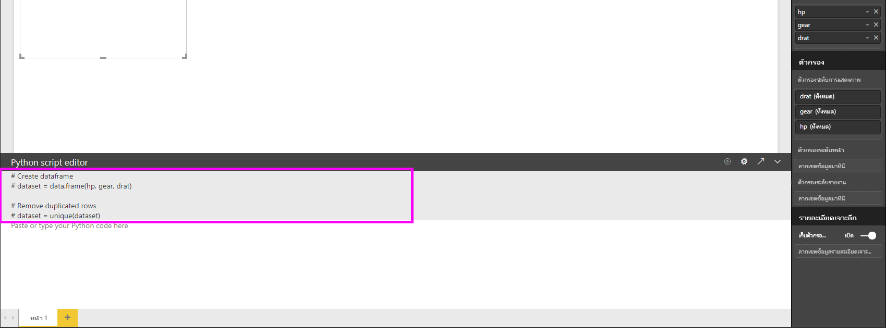
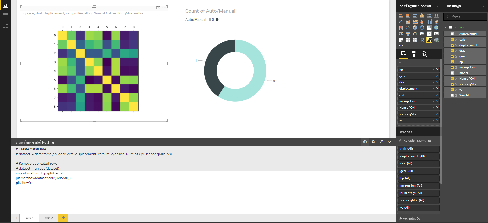
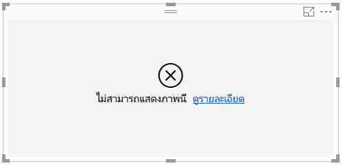

# สร้างภาพของ Power BI โดยใช้ Python
ด้วย **Power BI Desktop** คุณสามารถใช้ **Python** เพื่อแสดงภาพข้อมูลของคุณได้

## ติดตั้ง Python
**Power BI Desktop** ไม่รวม ปรับใช้ หรือติดตั้งกลไกจัดการ **Python** เมื่อต้องการเรียกใช้สคริปต์ Python ใน **Power BI Desktop** คุณต้องติดตั้ง **Python** บนเครื่องคอมพิวเตอร์ของคุณแยกต่างหาก คุณสามารถดาวน์โหลดและติดตั้ง **Python** ได้ฟรีจากตำแหน่งที่ตั้งต่าง ๆ ซึ่งรวมถึง[หน้าดาวน์โหลด Official Python](https://www.python.org/) และ [Anaconda](https://anaconda.org/anaconda/python/) รุ่นปัจจุบันของการเขียนสคริปต์ Python ใน{0}Power BI Desktop{0}สนับสนุนอักขระ Unicode ตลอดจนช่องว่าง (อักขระว่าง) ในเส้นทางการติดตั้ง

## เปิดใช้งานวิชวล Python
เมื่อต้องการเปิดใช้งานวิชวล Python เลือก **ไฟล์ > ตัวเลือกและการตั้งค่า > ตัวเลือก** และในหน้า **ตัวเลือก** ที่ปรากฏขึ้น ตรวจสอบให้แน่ใจว่ามีการระบุถึงการติดตั้ง Python ภายในเครื่องของคุณไว้ในส่วน **การเขียนสคริปต์ Python** ของหน้าต่าง **ตัวเลือก** ดังที่แสดงในรูปต่อไปนี้ ในรูปต่อไปนี้ การติดตั้งภายในเส้นทางของ Python คือ **C:\Python27** และเส้นทางมีอยู่อย่างชัดเจนในกล่องข้อความ ตรวจสอบว่าเส้นทางที่แสดงอย่างถูกต้องสะท้อนถึงการติดตั้ง Python ในเครื่องที่คุณต้องการใช้งาน **Power BI Desktop**
   
   

เมื่อคุณระบุการติดตั้ง Python คุณก็พร้อมที่จะเริ่มสร้างวิชวล Python

## สร้างวิชวล Python ใน Power BI Desktop
1. เลือกไอคอน **วิชวล Python** ในบานหน้าต่าง **การแสดงผลภาพ** ดังที่แสดงในรูปต่อไปนี้ เพื่อเพิ่มวิชวล Python
   
   

   เมื่อคุณเพิ่มวิชวล Python ไปยังรายงาน **Power BI Desktop** จะเป็นดังต่อไปนี้:
   
   - รูปภาพวิชวล Python ของพื้นที่ที่สำรองไว้ปรากฏบนพื้นที่ทำงานของรายงาน
   
   - **ตัวแก้ไขสคริปต์ Python** ปรากฏขึ้นทางด้านล่างของบานหน้าต่างกลาง
   
   

2. ถัดไป เพิ่มเขตข้อมูลที่คุณต้องการใช้ในสคริปต์ Python ของคุณไปยังส่วน **ค่า** ในแหล่ง **เขตข้อมูล** เหมือนกับที่คุณทำกับภาพ **Power BI Desktop** อื่น ๆ 
    
    เฉพาะเขตข้อมูลที่เพิ่มลงในแหล่ง **เขตข้อมูล** จะพร้อมใช้งานสคริปต์ Python ของคุณ คุณสามารถเพิ่มเขตข้อมูลใหม่ หรือเอาเขตข้อมูลที่ไม่ต้องการออกจากแหล่ง **เขตข้อมูล**  ขณะที่ทำงานบนสคริปต์ Python ของคุณใน **ตัวแก้ไขสคริปต์ Python ของ Power BI Desktop** **Power BI Desktop**ตรวจพบเขตข้อมูลที่คุณได้เพิ่ม หรือเอาออกโดยอัตโนมัติ
   
   > [!NOTE]
   > ชนิดการรวมเริ่มต้นสำหรับวิชวล Python คือ *ไม่ต้องทำการสรุป*
   > 
   > 
   
3. ขณะนี้คุณสามารถใช้ข้อมูลที่คุณเลือกเพื่อสร้างการลงจุด 

    เมื่อคุณเลือกเขตข้อมูล **ตัวแก้ไขสคริปต์ Python**  จะสร้างโค้ดการผูกสคริปต์ Python ที่รองรับโดยขึ้นอยู่กับการเลือกของคุณในส่วนสีเทาตามแนวด้านบนของบานหน้าต่างตัวแก้ไข ขณะที่คุณเลือกหรือลบเขตข้อมูลเพิ่มเติมออก โค้ดที่รองรับในตัวแก้ไขสคริปต์ Python จะถูกสร้างขึ้นโดยอัตโนมัติหรือถูกนำออกให้สอดคล้องกัน
   
   ในตัวอย่างที่แสดงในรูปต่อไปนี้ มีการเลือกเขตข้อมูลสามตัว: hp gear และ drat เป็นผลจากการเลือกดังกล่าว ตัวแก้ไขสคริปต์ Python จะสร้างโค้ดการผูกดังต่อไปนี้:
   
   * Dataframe ที่เรียกว่า**ชุดข้อมูล**ถูกสร้างขึ้น
     * Dataframe ประกอบด้วยเขตข้อมูลที่แตกต่างกันที่ถูกเลือกโดยผู้ใช้
   * การรวมเริ่มต้น คือ*ไม่ต้องทำการสรุป*
   * คล้ายกับภาพตาราง เขตข้อมูลจะถูกจัดกลุ่ม และทำซ้ำแถวที่ปรากฏเพียงครั้งเดียว
   
   
   
   > [!TIP]
   > ในบางกรณี คุณอาจไม่ต้องการให้จัดกลุ่มโดยอัตโนมัติ หรือคุณอาจต้องการให้แถวทั้งหมดปรากฏ รวมถึงรายการที่ซ้ำกัน ในกรณีนั้น คุณสามารถเพิ่มเขตข้อมูลดัชนีไปยังชุดข้อมูลของคุณ ซึ่งจะทำให้แถวทั้งหมดถูกพิจารณาว่าไม่ซ้ำกัน ซึ่งป้องกันการถูกจัดกลุ่ม
   > 
   > 
   
   Dataframe ที่สร้างขึ้นเรียกว่า**ชุดข้อมูล** และคุณสามารถเข้าถึงเลือกคอลัมน์ที่เลือกไว้จากชื่อที่เกี่ยวข้อง ตัวอย่างเช่น เขตข้อมูล gear สามารถเข้าถึงได้โดยการเขียน *dataset["gear"]* ในสคริปต์ Python ของคุณ

4. ด้วย Dataframe ที่สร้างขึ้นอัตโนมัติโดยเขตข้อมูลที่คุณเลือก คุณก็พร้อมที่จะเขียนสคริปต์ Python ที่จะลงจุดไปยังอุปกรณ์เริ่มต้นของ Python เมื่อสคริปต์เสร็จสมบูรณ์ เลือก **เรียกใช้** จากแถบชื่อเรื่อง **ตัวแก้ไขสคริปต์ Python** (**เรียกใช้**อยู่บนด้านขวาของแถบชื่อเรื่อง)
   
    เมื่อคุณเลือก**เรียกใช้** **Power BI Desktop** จะแยกแยะการลงจุดนี้และแสดงบนพื้นที่ทำงาน เนื่องจากกระบวนการจะดำเนินการบนการติดตั้ง Python ในเครื่องของคุณ ตรวจสอบให้แน่ใจว่ามีการติดตั้งแพคเกจที่จำเป็นแล้ว
   
   **Power BI Desktop** ลงจุดภาพซ้ำอีกครั้งเมื่อเหตุการณ์ใด ๆ ต่อไปนี้เกิดขึ้น:
   
   * เมื่อคุณเลือก **เรียกใช้** จากแถบชื่อเรื่อง **ตัวแก้ไขสคริปต์ Python**
   * เมื่อใดก็ตามที่เกิดการเปลี่ยนแปลงข้อมูล เนื่องจากการรีเฟรชข้อมูล การกรอง หรือการเน้น

    รูปต่อไปนี้แสดงตัวอย่างโค้ดการลงจุดสหสัมพันธ์ ซึ่งลงจุดสหสัมพันธ์ระหว่างแอตทริบิวต์ของรถยนต์ชนิดต่าง ๆ

    

5. เพื่อให้ได้มุมมองของการแสดงภาพที่มีขนาดใหญ่ขึ้น คุณสามารถย่อ **ตัวแก้ไขสคริปต์ Python** ได้ และแน่นอน เช่นเดียวกับวิชวลอื่น ๆ ใน **Power BI Desktop**คุณสามารถกรองข้ามการลงจุดสหสัมพันธ์ โดยเลือกเฉพาะรถสปอร์ตในวิชวลโดนัท (วิชวลกลมทางด้านขวา ในรูปตัวอย่างด้านบน)

    

6. คุณสามารถปรับเปลี่ยนสคริปต์ Python เพื่อกำหนดภาพด้วยตนเอง และใช้ประโยชน์จากพลังของ Python โดยการเพิ่มพารามิเตอร์ไปยังคำสั่งการลงจุด

    คำสั่งการลงจุดเดิมมีดังต่อไปนี้:

    plt.matshow(dataset.corr('pearson'))

    ด้วยการเปลี่ยนแปลงบางอย่างในสคริปต์ Python ขณะนี้คำสั่งเป็นดังต่อไปนี้:

    plt.matshow(dataset.corr('kendall'))

    เป็นผลให้วิชวล Python ลงจุดโดยใช้สัมประสิทธิ์สหสัมพันธ์ Kendall Tau ดังที่แสดงในรูปภาพต่อไปนี้

    

    เมื่อดำเนินการสคริปต์ Python ที่เกิดข้อผิดพลาด วิชวล Python จะไม่ถูกลงจุดและข้อความแสดงข้อผิดพลาดจะแสดงบนพื้นที่ทำงาน สำหรับรายละเอียดเกี่ยวกับข้อผิดพลาด เลือก **ดูรายละเอียด** จากข้อผิดพลาดวิชวล Python บนพื้นที่ทำงาน

    

    > **ความปลอดภัยของสคริปต์ Python:** ภาพ Python ถูกสร้างขึ้นจากสคริปต์ Python ซึ่งประกอบด้วยโค้ดที่มีความเสี่ยงต่อความปลอดภัยหรือความเป็นส่วนตัว เมื่อพยายามที่จะดูหรือโต้ตอบกับวิชวล Python เป็นครั้งแรก ผู้ใช้จะได้รับข้อความเตือนเรื่องความปลอดภัย เปิดใช้งานวิชวล Python ในกรณีที่คุณเชื่อถือผู้เขียนและแหล่งที่มาเท่านั้น หรือหลังจากที่คุณตรวจทานและทำความเข้าใจสคริปต์ Python แล้ว
    > 
    > 

## ข้อจำกัดที่ทราบ
วิชวล Python ใน **Power BI Desktop** มีข้อจำกัดบางอย่าง:

* ข้อจำกัดของขนาดข้อมูล – ข้อมูลที่ใช้โดยวิชวล Python สำหรับการลงจุดจะถูกจำกัดไว้ที่ 150,000 แถว ถ้าเลือกมากกว่า 150,000 แถว จะมีการใช้งานเฉพาะ 150,000 แถวบนสุด และข้อความจะแสดงบนรูปภาพ
* ข้อจำกัดเวลาคำนวณ – ถ้าการคำนวณวิชวล Python นานเกิน 5 นาที การดำเนินการจะหมดเวลา ส่งผลให้เกิดข้อผิดพลาด
* ความสัมพันธ์ – เช่นเดียวกับภาพอื่น ๆ ของ Power BI Desktop ถ้ามีการเลือกเขตข้อมูลจากตารางต่าง ๆ โดยไม่มีความสัมพันธ์ที่กำหนดระหว่างกัน จะเกิดข้อผิดพลาดขึ้น
* วิชวล Python จะถูกรีเฟรชเมื่อมีการปรับปรุงข้อมูล การกรอง และการทำไฮไลท์ อย่างไรก็ตาม รูปภาพนั้นไม่ได้เป็นแบบโต้ตอบ และไม่สามารถเป็นแหล่งที่มาของการกรองข้าม
* วิชวล Python ตอบสนองต่อการทำไฮไลท์วิชวลอื่น ๆ แต่คุณไม่สามารถคลิกที่องค์ประกอบในวิชวล Python เพื่อกรองข้ามองค์ประกอบอื่น ๆ ได้
* เฉพาะการลงจุดที่ถูกลงจุดไปยังอุปกรณ์แสดงผลเริ่มต้น Python เท่านั้นจะแสดงผลอย่างถูกต้องบนพื้นที่ทำงาน หลีกเลี่ยงการใช้อุปกรณ์แสดงผล Python ที่แตกต่างกันอย่างชัดเจน

## ขั้นตอนถัดไป
ดูข้อมูลเพิ่มเติมเกี่ยวกับ Python ใน Power BI ต่อไปนี้

* [การเรียกใช้สคริปต์ Python ใน Power BI Desktop](desktop-python-scripts.md)
* [ใช้ Python IDE ภายนอกกับ Power BI](desktop-python-ide.md)

