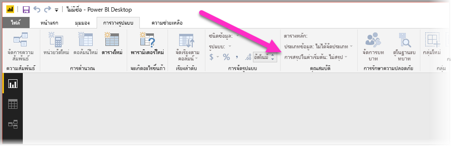
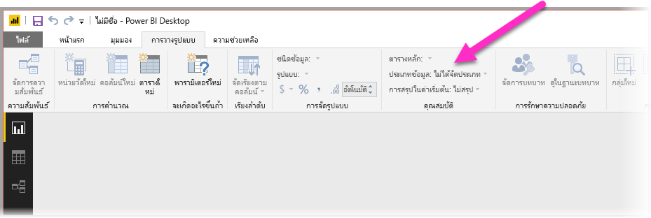
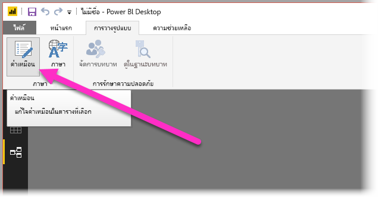
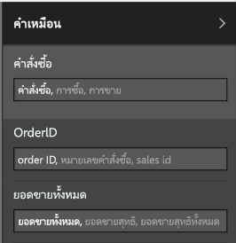

# การใช้ถาม-ตอบใน Power BI Desktop สำหรับคิวรีภาษาธรรมชาติ
การใช้วลีทั่วไปและภาษาที่เป็นธรรมชาติในการถามคำถามเกี่ยวกับข้อมูลของคุณเป็นการดำเนินการที่มีประสิทธิภาพ และจะยิ่งมีประสิทธิภาพมากขึ้นเมื่อได้รับคำตอบจากข้อมูลของคุณ ซึ่งเป็นสิ่งที่ถาม-ตอบใน **Power BI Desktop** ช่วยให้คุณทำได้

เมื่อต้องการเปิดใช้งานถาม-ตอบเพื่อแปลคอลเลกชันขนาดใหญ่ของคำถามซึ่งสามารถตอบสนองได้ ถาม-ตอบต้องตั้งสมมติฐานเกี่ยวกับแบบจำลอง ถ้าโครงสร้างของแบบจำลองของคุณไม่ตรงตามสมมติฐานเหล่านี้อย่างน้อยหนึ่งข้อ คุณจะต้องปรับแบบจำลองของคุณ การปรับแบบจำลองสำหรับถาม-ตอบ คือ การเพิ่มประสิทธิภาพที่ดีที่สุดที่เหมือนกับที่ใช้สำหรับแบบจำลองใด ๆ ใน Power BI ไม่ว่าคุณจะใช้ถาม-ตอบหรือไม่ 

> [!NOTE]
> ถามตอบพร้อมใช้งานเฉพาะเมื่อทำงานกับแบบจำลองที่ประกอบด้วยข้อมูล**นำเข้า** เชื่อมต่อสดไปยังแบบจำลอง SSAS และ DirectQuery ไม่ได้รับการสนับสนุน
>
> ถามตอบต้องมีการอัปเดตรันไทม์ C ต่อไปนี้หากคุณกำลังใช้ Windows เวอร์ชันก่อน Windows 10 คุณสามารถลองติดตั้งโปรแกรมอัปเดตที่สำคัญจาก Windows Update หรือติดตั้งคอมโพเนนต์ที่ต้องการจาก Microsoft (KB2999226) ด้วยตนเอง [https://support.microsoft.com/en-us/help/2999226/update-for-universal-c-runtime-in-windows](https://support.microsoft.com/en-us/help/2999226/update-for-universal-c-runtime-in-windows)
>
>

ในส่วนต่อไปนี้ เราจะอธิบายวิธีการปรับแบบจำลองของคุณเพื่อให้ทำงานได้ดีกับการถาม-ตอบใน Power BI

## เพิ่มความสัมพันธ์ที่หายไป

ถ้าแบบจำลองของคุณไม่มีความสัมพันธ์ระหว่างตาราง ทั้งรายงาน Power BI และถาม-ตอบจะไม่สามารถแปลวิธีการรวมตารางเหล่านั้น ถ้าคุณถามคำถามเกี่ยวกับรายงาน Power BI และถาม-ตอบ ความสัมพันธ์เป็นหลักสำคัญของแบบจำลองที่ดี ตัวอย่างเช่น คุณไม่สามารถสอบถามสำหรับ "ยอดขายรวมสำหรับลูกค้า Seattle" ถ้าไม่มีความสัมพันธ์ระหว่างตาราง*คำสั่ง*และตาราง*ลูกค้า* รูปต่อไปนี้แสดงตัวอย่างของแบบจำลองที่ต้องการงาน และแบบจำลองที่พร้อมสำหรับถาม-ตอบ

**ต้องการงาน**

**พร้อมสำหรับการถาม-ตอบ**

## เปลี่ยนชื่อตารางและคอลัมน์

ตัวเลือกของตารางและคอลัมน์ที่มีความสำคัญสำหรับถาม-ตอบ ตัวอย่างเช่น สมมติว่า คุณมีตารางชื่อ*สรุปลูกค้า*ที่ประกอบด้วยรายชื่อลูกค้าของคุณ คุณอาจต้องถามคำถามเช่น "แสดงสรุปรายชื่อลูกค้าในชิคาโก" แทน "แสดงลูกค้าในชิคาโก" 

แม้ว่าถาม-ตอบจะสามารถทำการแบ่งคำพื้นฐานและตรวจหาพหูพจน์บางอย่าง แต่ถาม-ตอบจะสมมติว่าชื่อตารางและคอลัมน์ของคุณแสดงเนื้อหาได้อย่างถูกต้อง

พิจารณาตัวอย่างอื่น สมมติว่า คุณมีตารางชื่อ*จำนวนพนักงาน*ที่ประกอบด้วยชื่อ และนามสกุลและหมายเลขประจำตัวของพนักงาน คุณมีอีกตารางหนึ่งที่ชื่อว่า*พนักงาน*ที่ประกอบด้วยหมายเลขพนักงาน หมายเลขระบุตัวงาน และวันที่เริ่มต้น บุคคลที่คุณคุ้นชินกับแบบจำลองอาจเข้าใจโครงสร้างนี้ บางคนที่ถาม "นับจำนวนพนักงาน" จะได้รับการนับจำนวนแถวจากตาราง "พนักงาน" ผลลัพธ์นี้อาจจะได้เป็นไปตามที่พวกเขาคิด เนื่องจากเป็นการนับจำนวนงานทุกงานที่พนักงานแต่ละคนเคยทำ การเปลี่ยนชื่อตารางเหล่านั้นเพื่อให้สอดคล้องกับสิ่งที่ปรกอบอยู่ในตารางจะช่วยให้เข้าใจง่ายขึ้น

**ต้องการงาน**

**พร้อมสำหรับการถาม-ตอบ**

## แก้ไขชนิดข้อมูลที่ไม่ถูกต้อง

ข้อมูลนำเข้าสามารถมีชนิดข้อมูลที่ไม่ถูกต้องได้ โดยเฉพาะในคอลัมน์*วัน*และ*เลข*ที่จะได้รับการนำเข้าเป็น*สตริง*จะไม่สามารถแปลโดยถาม-ตอบให้เป็นเป็นวันและตัวเลข ควรตรวจสอบให้แน่ใจว่า คุณเลือกชนิดข้อมูลที่ถูกต้องในแบบจำลอง Power BI ของคุณ

## ทำเครื่องหมายคอลัมน์ปีและตัวระบุว่า “ไม่สรุป”

Power BI จะรวมคอลัมน์ที่เป็นตัวเลขโดยค่าเริ่มต้น ดังนั้นคำถามเช่น "ยอดขายรวมตามปี" อาจทำให้ยอดขายรวมทั้งหมดรวมไปกับยอดรวมทั้งหมดของปี ถ้าคุณมีคอลัมน์เฉพาะที่คุณไม่ต้องการให้ Power BI แสดงพฤติกรรมดังกล่าว ตั้งค่าคุณสมบัติ**สรุปโดย**ในคอลัมน์ให้เป็น**ไม่สรุป** โปรดระวังคอลัมน์**ปี** **เดือน** **วัน**และ**ID** เนื่องจากคอลัมน์เหล่านั้นเป็นปัญหาที่พบบ่อยที่สุด คอลัมน์อื่น ๆ ที่ไม่ควรหาผลรวม เช่น*อายุ*อาจยังได้รับประโยชน์จากการตั้งค่า**สรุปโดย**ให้เป็น**ไม่สรุป**หรือ**ค่าเฉลี่ย** คุณจะพบการตั้งค่านี้ในแท็บ**โมเดล**

## เลือกประเภทข้อมูลสำหรับแต่ละคอลัมน์วันที่และภูมิศาสตร์

**ประเภทข้อมูล**ให้ความรู้เชิงความหมายเพิ่มเติมเกี่ยวกับเนื้อหาของคอลัมน์ที่นอกเหนือจากชนิดข้อมูล ตัวอย่างเช่น คอลัมน์จำนวนเต็มอาจได้รับการทำเครื่องหมายว่าเป็นรหัสไปรษณีย์ คอลัมน์สตริงที่อาจได้รับการทำเครื่องหมายว่าเป็นเมือง ประเทศ ภูมิภาค และอื่น ๆ ข้อมูลนี้มักถูกใช้ในการถามตอบสองแบบที่สำคัญ: สำหรับเลือกการแสดงภาพและความอคติทางภาษา

ขั้นแรก ถาม-ตอบใช้ข้อมูล**ประเภทข้อมูล**เพื่อช่วยเลือกชนิดของการแสดงวิชวลที่จะนำไปใช้ ตัวอย่างเช่น คอลัมน์ที่มีวันที่หรือเวลา**ประเภทข้อมูล**เป็นตัวเลือกที่ดีสำหรับแกนแนวนอนของแผนภูมิเส้นหรือแกนเคลื่อนไหวของแผนภูมิฟอง และสมมติว่าผลลัพธ์ที่ประกอบด้วยคอลัมน์ที่มี**หมวดหมู่ข้อมูล** ทางภูมิศาสตร์อาจดูดีบนแผนที่

ขั้นตอนที่สอง ถาม-ตอบจะสร้างการคาดเดาทางการศึกษาเกี่ยวกับวิธีการที่ผู้ใช้มีแนวโน้มจะพูดเกี่ยวกับคอมลัมน์วันที่และภูมิศาสตร์ เพื่อช่วยให้เข้าใจบางชนิดของคำถาม ตัวอย่างเช่น "เมื่อ" ใน "John Smith ได้รับการว่าจ้างเมื่อใด" เกือบจะแมปกับคอลัมน์วันที่ และ "สีน้ำตาล" ใน "นับลูกค้าในสีน้ำตาล" มีแนวโน้มจะเป็นเมืองกว่าสีผม

## เลือก “เรียงลำดับตามคอลัมน์” สำหรับคอลัมน์ที่เกี่ยวข้อง

คุณสมบัติ**เรียงลำดับตามคอลัมน์**อนุญาตให้การเรียงลำดับในหนึ่งคอลัมน์เรียงลำดับโดยคอลัมน์อื่นแทนโดยอัตโนมัติ ตัวอย่างเช่น เมื่อคุณถาม "เรียงลำดับการลูกค้าตามขนาดเสื้อ" คุณอาจต้องการให้คอลัมน์ “ขนาดเสื้อ” ของคุณเรียงลำดับตามหมายเลขขนาดพื้นฐาน (XS, S, M, L, XL) แทนที่จะเป็นเรียงตามตัวอักษร (L, M, S, XL, XS)

## ลดความซ้ำซ้อนของแบบจำลองของคุณ

มั่นใจได้ว่าเราไม่ได้กำลังแนะนำให้คุณจำเป็นต้องปรับรูปร่างแบบจำลองของคุณทั้งหมด อย่างไรก็ตามด้วยโครงสร้างบางอย่างทำให้การถามตอบไม่สามารถรับมือกับทุกอย่างได้ ถ้าคุณดำเนินการบางอย่างเกี่ยวกับ ลดความซ้ำซ้อนของโครงสร้างแบบจำลองของคุณ การใช้งานของรายงาน Power BI จะเพิ่มขึ้นอย่างมาก เช่นเดียวกับความถูกต้องของผลการถาม-ตอบ

ปฏิบัติตามข้อกำหนดทั่วไปนี้: แต่ละ "สิ่ง" ที่ไม่ซ้ำกันที่ผู้ใช้พูดถึงควรจะแสดงโดยวัตถุแบบจำลองเดียว (ตารางหรือคอลัมน์) ดังนั้น ถ้าผู้ใช้ของคุณพูดเกี่ยวกับลูกค้า ควรมีหนึ่งวัตถุ*ลูกค้า* และถ้าผู้ใช้ของคุณพูดเกี่ยวกับการขาย ควรมีหนึ่งวัตถุ*การขาย* ฟังดูง่าย ใช่หรือไม่ อาจจะง่าย ขึ้นอยู่กับรูปร่างของข้อมูลที่คุณกำลังเริ่มต้นด้วย มีความสามารถในการจัดรูปร่างข้อมูลหลากหลาบที่พร้อมใช้งานใน **ตัวแก้ไขคิวรี**ถ้าคุณต้องการใช้ ในขณะที่การแปลงขอ้มูลโดยตรงมากขึ้นมากมายสามารถเกิดขึ้นเพียงแค่ใช้การคำนวณในแบบจำลอง Power BI

ส่วนต่อไปนี้ประกอบด้วยการแปลงข้อมูลทั่วไปบางอย่างที่คุณอาจจำเป็นต้องดำเนินการ

### สร้างตารางใหม่สำหรับเอนทิตีแบบหลายคอลัมน์

ถ้าคุณมีหลายคอลัมน์ที่ทำหน้าที่เป็นหน่วยที่แตกต่างกันเพียงหน่วยเดียวภายในตารางที่ใหญ่กว่า ควรมีการแยกคอลัมน์เหล่านั้นลงในตารางของตัวมันเอง ตัวอย่าง สมมติว่าคุณมีคอลัมน์ ชื่อผู้ติดต่อ เรื่องที่ติดต่อ และ เบอร์โทรติดต่อเป็นตารางใน*บริษัท*ของคุณ การออกแบบที่ดีจะต้องแยกตาราง*รายชื่อที่ติดต่อ*ให้ประกอบไปด้วย ชื่อ เรื่องที่ติดต่อ เบอร์โทรศัพท์และลิงก์กลับไปยังตารางของ*บริษัท*ได้ ซึ่งจะทำให้การถามคำถามเกี่ยวกับรายชื่อผู้ติดต่อของคำถามเกี่ยวกับบริษัทที่พวกเขาเป็นผู้ติดต่อง่ายขึ้นอย่างมาก และช่วยปรับปรุงความยืดหยุ่นการแสดงผล

**ต้องการงาน**

**พร้อมสำหรับการถาม-ตอบ**

### Pivot เพื่อกำจัดกระเป๋าคุณสมบัติ

ถ้าคุณมีกระเป๋าคุณสมบัติในแบบจำลองของคุณ ควรมีการปรับโครงสร้างใหม่เพื่อให้มีคอลัมน์เดียวสำหรับแต่ละคุณสมบัติ แม้ว่ากระเป๋าคุณสมบัติจะสะดวกสำหรับการจัดการตัวเลขขนาดใหญ่ของคุณสมบัติ แต่จะยุ่งยากจากตัวเลขของข้อจำกัดทั่วไปที่ทั้งรายงาน Power BI หรือถาม-ตอบไม่ได้รับการออกแบบมาเพื่อแก้ไขปัญหาชั่วคราว

ตัวอย่างเช่น พิจารณาตาราง*ข้อมูลประชากรของลูกค้า*ที่มีคอลัมน์รหัสประจำตัวของลูกค้า คุณสมบัติ และค่า ที่แต่ละแถวแสดงคุณสมบัติที่แตกต่างกันของลูกค้า (ตัวอย่างเช่น อายุ สถานะการสมรส เมือง และอื่น ๆ) โดยการโอเวอร์โหลดความหมายของคอลัมน์ค่าที่ยึดตามเนื้อหาของคอลัมน์คุณสมบัติ จะทำให้การถาม-ตอบไม่สามารถแปลคิวรีส่วนใหญ่ที่อ้างอิงถึงได้ คำถามง่าย ๆ เช่น "แสดงอายุของลูกค้าแต่ละราย" อาจมีการใช้งาน เนื่องจากไม่สามารถแปลเป็น "แสดงลูกค้าและลูกค้าข้อมูลประชากรของลูกค้าที่คุณสมบัติเป็นอายุ" อย่างไรก็ตาม โครงสร้างของแบบจำลองไม่สนับสนุนคำถามที่ซับซ้อนมากขึ้นเล็กน้อยเช่น "อายุเฉลี่ยของลูกค้าในชิคาโก" ในขณะที่ผู้ใช้ที่เขียนรายงาน Power BI โดยตรงสามารถค้นหาวิธีที่ฉลาดในการรับข้อมูลที่พวกเขาต้องการ ถาม-ตอบสามารถทำได้เฉพาะเมื่อแต่ละคอลัมน์มีเฉพาะความหมายเดียวเท่านั้น

**ต้องการงาน**

**พร้อมสำหรับการถาม-ตอบ**

### รวมเพื่อกำจัดการแบ่งพาร์ติชัน

ถ้าคุณแบ่งพาร์ติชันข้อมูลของคุณข้ามหลายตาราง หรือมีค่า Pivot ข้ามหลายคอลัมน์ ตัวเลขของการดำเนินการทั่วไปจะนำไปใช้งานยาก หรือไม่สามารถใช้ได้สำหรับผู้ใช้ของคุณ ก่อนอื่นพิจารณาการแบ่งพาร์ทิชันตารางทั่วไปคือ ตาราง*ยอดขาย2000-2010*และตาราง*Sales2011-2020* ถ้ารายงานที่สำคัญทั้งหมดของคุณมีการจำกัดให้กับทศวรรษที่กำหนด คุณอาจสามารถปล่อยไว้แบบนี้สำหรับรายงาน Power BI อย่างไรก็ตาม ความยืดหยุ่นของถาม-ตอบจะทำให้ผู้ใช้ของคุณคาดเดาจะคำตอบของคำถามได้เช่น "ยอดขายรวมตามปี" หากคุณต้องการเปิดใช้งานคิวรี คุณต้องรวมข้อมูลลงในตารางแบบจำลอง Power BI เดียว

ในทำนองเดียวกัน พิจารณาคอลัมน์ค่า Pivot ทั่วไป: ตาราง*จองทัวร์*ที่ประกอบด้วยคอลัมน์ผู้เขียน สมุด เมืองที่1 เมืองที่2 และ เมื่องที่3 ด้วยโครงสร้างเช่นนี้ทำให้ไม่สามารถแม้แต่ไม่สามารถแปลคำถามง่าย ๆ เช่น "นับหนังสือตามเมือง" ให้ถูกต้อง เพื่อให้คิวรีนี้ทำงาน สร้างตาราง*จองทัวร์ในเมือง*แบบแยก ซึ่งรวมค่าเมืองไว้ในคอลัมน์เดียว

**ต้องการงาน**

**พร้อมสำหรับการถาม-ตอบ**

### แยกคอลัมน์ที่จัดรูปแบบ

ถ้าแหล่งที่มาที่คุณกำลังนำเข้าข้อมูลของคุณประกอบด้วยคอลัมน์ที่จัดรูปแบบ รายงาน Power BI (และถาม-ตอบ) จะไม่เข้าถึงภายในคอลัมน์เพื่อแยกวิเคราะห์เนื้อหา ตัวอย่างเช่น ถ้าคุณมีคอลัมน์**ที่อยู่แบบเต็ม**ที่ประกอบด้วยเมือง และประเทศ คุณควรแยกที่อยู่ดังกล่าวลงในคอลัมน์ที่อยู่ เมือง และประเทศเพื่อให้ผู้ใช้ของคุณสามารถถามคิวรีแต่ละที่อยู่ได้

**ต้องการงาน**

**พร้อมสำหรับการถาม-ตอบ**

ในทำนองเดียวกัน ถ้าคุณมีคอลัมน์ชื่อเต็มของบุคคล คุณจะต้องเพิ่มคอลัมน์**ชื่อ**และ**นามสกุล**ในกรณีที่บุคคลต้องการถามคำถามโดยใช้ชื่อบางส่วน 

### สร้างตารางใหม่สำหรับคอลัมน์หลายค่า

ในสถานการณ์เดียวกัน ถ้าแหล่งที่มาที่คุณกำลังนำเข้าข้อมูลของคุณประกอบด้วยคอลัมน์แบบหลายค่า รายงาน Power BI (และถาม-ตอบ) จะไม่เข้าถึงภายในคอลัมน์เพื่อแยกวิเคราะห์เนื้อหา ตัวอย่างเช่น ถ้าคุณมีคอลัมน์ผู้แต่งที่ประกอบด้วยชื่อของผู้แต่งเพลงหลายราย คุณควรแยกคอลัมน์ดังกล่าวลงในหลายแถวในตาราง*ผู้แต่ง*แยก

**ต้องการงาน**

**พร้อมสำหรับการถาม-ตอบ**

### เพิ่มข้อมูลซ้ำซ้อนหรือข้อมูลกลุ่มเพื่อกำจัดความสัมพันธ์ที่ไม่ได้ใช้งาน

ข้อยกเว้นหนึ่งข้อของกฎ "การลดความซ้ำซ้อนดีกว่า" จะเกิดขึ้นเมื่อมีมากกว่าหนึ่งเส้นทางในการรับจากตารางหนึ่งไปอีกตารางหนึ่ง ตัวอย่างเช่น ถ้าคุณมีตาราง*เที่ยวบิน*ที่มีทั้งคอลัมน์รหัสเมืองต้นทาง และ รหัสเมืองปลายทาง ซึ่งแต่ละคอลัมน์เกี่ยวข้องกับตาราง*เมือง* หนึ่งในความสัมพันธ์ดังกล่าวจะต้องได้รับการทำเครื่องหมายเป็น ไม่ได้ใช้งาน เนื่องจากถาม-ตอบสามารถใช้ความสัมพันธ์ที่ใช้งานได้ คุณจะไม่สามารถถามคำถามเกี่ยวกับต้นทางหรือปลายทางได้ทั้งนี้ขึ้นอยู่กับที่คุณเลือก หากคุณเพิ่มข้อมูลซ้ำซ้อนหรือข้อมูลกลุ่มในคอลัมน์ชื่อเมืองใน*ตารางเที่ยวบิน*คุณจะสามารถถามคำถาม เช่น "แสดงเที่ยวบินวันพรุ่งนี้กับเมืองต้นทางคือซีแอตเทิลและเมืองปลายทางคือซานฟรานซิสโก"

**ต้องการงาน**

**พร้อมสำหรับการถาม-ตอบ**

### เพิ่มคำพ้องลงในตารางและคอลัมน์

ขั้นตอนนี้นำไปใช้กับถาม-ตอบโดยเฉพาะ (และไม่นำไปใช้กับรายงาน Power BI โดยทั่วไป) ผู้ใช้มักจะมีหลายเงื่อนไขที่พวกเขาใช้เพื่ออ้างอิงถึงสิ่งเดียวกัน เช่น ยอดขายรวม ยอดขายสุทธิ ยอดขายสุทธิรวม แบบจำลองของ power BI อนุญาตให้มีการเพิ่มคำพ้องเหล่านี้ลงในตารางและคอลัมน์ภายในแบบจำลอง 

ขั้นตอนนี้จะมีความสำคัญ แม้ว่าจะมีชื่อตารางและชื่อคอลัมน์ที่ตรงไปตรงมา ผู้ใช้ของถาม-ตอบจะถามคำถามโดยใช้คำศัพท์แรกที่พวกเขาเห็น และไม่มีการเลือกจากรายการของคอลัมน์ที่กำหนดไว้ล่วงหน้า ยิ่งคำพ้องที่คุณเพิ่มเข้ามามีความสมเหตุสมผลมาก ประสบการณ์ของผู้ใช้กับรายงานของคุณก็จะดียิ่งขึ้นเช่นกัน เมื่อต้องการเพิ่มคำพ้อง ในมุมมอง**ความสัมพันธ์**ให้เลือกปุ่มคำพ้องใน ribbon ดังที่แสดงในรูปต่อไปนี้

เขตข้อมูล**คำเหมือน**จะปรากฏทางด้านขวาของ**Power BI Desktop**ซึ่งเป็นตำแหน่งที่คุณสามารถเพิ่มคำพ้องของคุณ ดังที่แสดงในรูปต่อไปนี้

 โปรดระมัดระวังเมื่อทำการเพิ่มคำพ้อง เนื่องจากการเพิ่มคำพ้องเดียวกันลงในมากกว่าหนึ่งคอลัมน์หรือตารางจะทำให้เกิดความกำกวม ถาม-ตอบใช้เนื้อหาที่สามารถเลือกระหว่างคำพ้องที่กำกวม แต่ไม่ใช่คำถามทั้งหมดที่มีเนื้อหาเพียงพอ ตัวอย่างเช่น เมื่อผู้ใช้ของคุณถาม "นับลูกค้า" ถ้าคุณมีสามรายการที่มีคำพ้องคำว่า "ลูกค้า" ในแบบจำลองของคุณ พวกเขาอาจไม่ได้รับคำตอบที่ต้องการ ในกรณีนี้ โปรดตรวจสอบให้แน่ใจว่า คำพ้องหลักไม่ซ้ำกัน เนื่องจากเป็นคำที่ใช้ในการกล่าวซ้ำ และยังสามารถแจ้งเตือนผู้ใช้เกี่ยวกับความกำกวมได้ (ตัวอย่างเช่น การกล่าวซ่ำของ "แสดงจำนวนบันทึกลูกค้าที่เก็บถาวร") พูดเป็นนัยว่าพวกเขาอาจต้องตั้งคำถามให้แตกต่างกัน

## ขั้นตอนถัดไป
โปรดดูที่บทความต่อไปนี้เพื่อศึกษาข้อมูลเพิ่มเติมเกี่ยวกับคุณลักษณะที่อยู่ใน Power BI Desktop

* [ใช้ตัวเจาะเข้าถึงรายละเอียดใน Power BI Desktop](desktop-drillthrough.md)
* [แสดงไทล์แดชบอร์ดหรือรายงานวิชวลในโหมดโฟกัส](consumer/end-user-focus.md)

