# เกี่ยวกับการใช้ตัวแก้ไขคิวรีใน Power BI Desktop
ด้วย**Power BI Desktop**คุณสามารถเชื่อมต่อกับโลกของข้อมูล สร้างรายงานที่น่าสนใจ และแชร์ความพยายามของคุณกับผู้อื่น – ที่สามารถสร้างผลงานต่อจากงานของคุณ และขยายความพยายามอันชาญฉลาดทางธุรกิจของพวกเขา

Power BI Desktop มีสามมุมมอง:

* มุมมอง**รายงาน** – เป็นที่ที่คุณใช้คิวรีที่คุณสร้างภาพที่แสดงข้อมูลที่ดึงดูดความสนใจ จัดเรียงการแสดงผลตามที่คุณต้องการให้ปรากฏในหลายหน้าที่คุณสามารถแบ่งปันกับผู้อื่น
* มุมมอง**ข้อมูล**ู – เป็นที่ที่ดูข้อมูลในรายงานของคุณในรูปแบบจำลองข้อมูล เป็นที่ที่ี่คุณสามารถเพิ่มการวัด สร้างคอลัมน์ใหม่ และจัดการความสัมพันธ์
* มุมมอง**ความสัมพันธ์**ู – เป็นที่แสดงภาพกราฟิกของความสัมพันธ้ในแบบจำลองข้อมูลของคุณ และจัดการ หรือปรับเปลี่ยนความสัมพันธ์นั้นได้ตามต้องการ

สามารถเข้าถึงมุมมองเหล่านี้ได้โดยการเลือกไอคอนหนึ่งในสามทางด้านซ้ายของ Power BI Desktop ในรูปต่อไปนี้ มุมมองรายงานถูกเลือก ที่บ่งชี้ด้วยแถบสีเหลืองที่อยู่ด้านข้างไอคอน  

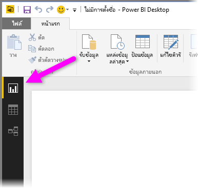

Power BI Desktop ยังมาพร้อมกับ**ตัวแก้ไขคิวรี**ที่คุณสามารถเชื่อมต่อกับแหล่งข้อมูลหนึ่งหรือหลายแหล่ง จัดรูปร่างและแปลงข้อมูลตามความต้องการของคุณ จากนั้นโหลดแบบจำลองดังกล่าวเข้าไปใน Power BI Desktop

เอกสารนี้ให้ภาพรวมของการทำงานกับข้อมูลใน**ตัวแก้ไขคิวรี** ไม่มีให้เรียนรู้อีกแล้ว ดังนั้น ที่ส่วนท้ายของเอกสารนี้ คุณจะพบลิงก์ไปยังคำแนะนำโดยละเอียดเกี่ยวกับชนิดข้อมูลที่ได้รับการสนับสนุน การเชื่อมต่อกับข้อมูล การจัดรูปทรงข้อมูล การสร้างความสัมพันธ์ และวิธีการเริ่มต้นใช้งาน

แต่ก่อนอื่น มาทำความคุ้นเคยกับ**ตัวแก้ไขคิวรี** ก่อนดีกว่า

## ตัวแก้ไขคิวรี
เมื่อต้องการใช้**ตัวแก้ไขคิวรี** ให้เลือก**แก้ไขคิวรี**จากแท็บ **หน้าแรก** ของ Power BI Desktop  

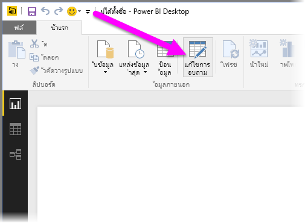

เมื่อไม่มีการเชื่อมต่อข้อมูล**ตัวแก้ไขคิวรี**จะปรากฏเป็นบานหน้าต่างว่างที่พร้อมสำหรับข้อมูล  

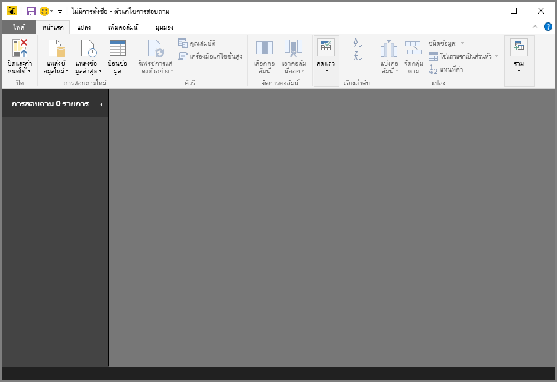

เมื่อคิวรีถูกโหลด มุมมอง**ตัวแก้ไขคิวรี**จะกลายเป็นเรื่องน่าสนใจมากขึ้น ถ้าเราเชื่อมต่อกับแหล่งข้อมูลต่อไปนี้ของเว็บ**ตัวแก้ไขคิวรี**จะโหลดข้อมูลเกี่ยวกับข้อมูลที่คุณสามารถเริ่มต้นจัดรูปร่าง

[*https://www.bankrate.com/finance/retirement/best-places-retire-how-state-ranks.aspx*](https://www.bankrate.com/finance/retirement/best-places-retire-how-state-ranks.aspx)

นี่คือวิธีที่ี**ตัวแก้ไขคิวรี**ปรากฏเมื่อมีการเชื่อมต่อข้อมูล:

1. ใน Ribbon มีปุ่มจำนวนมากพร้อมใช้งานเพื่อโต้ตอบกับข้อมูลในคิวรี
2. ในบานหน้าต่างด้านซ้าย รายการคิวรี (สำหรับแต่ละตารางหรือรายการ) จะแสดงอยู่และพร้อมให้เลือก ดู และจัดรูปร่าง
3. ในบานหน้าต่างตรงกลาง ข้อมูลจากคิวรีที่เลือกจะแสดงและพร้อมให้จัดรูปร่าง
4. หน้าต่าง**การตั้งค่าคิวรี**จะปรากฏ แสดงรายการคุณสมบัติของคิวรีและขั้นตอนที่ถูกใช้  
   
   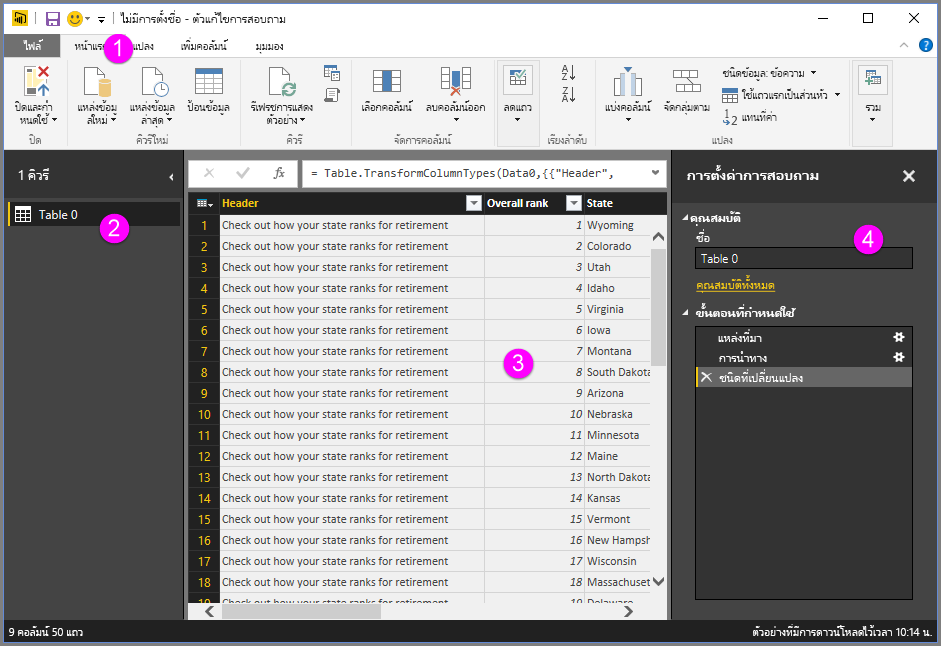

เราจะดูสี่เรื่องนี้ทีละเรื่อง – ซึ่งคือ ribbon บานหน้าต่างคิวรี มุมมองข้อมูล และบานหน้าต่างการตั้งค่าคิวรี – ในหัวข้อต่อไป

## Ribbon คิวรี
Ribbon ใน**ตัวแก้ไขคิวรี**ประกอบด้วยแท็บสี่อัน คือ – **หน้าแรก**, **แปลง**, **เพิ่มคอลัมน์**และ**มุมมอง**

แท็บ**หน้าแรก**ประกอบด้วยงานคิวรีทั่วไป ที่รวมถึงขั้นตอนแรกในการทำคิวรี ซึ่งก็คือ**รับข้อมูล (Get Data)** รูปภาพต่อไปนี้แสดง ribbon ของ**หน้าแรก**  

เมื่อต้องการเชื่อมต่อกับข้อมูล และเริ่มขบวนการสร้างคิวรีเลือกปุ่ม**รับข้อมูล (Get Data)** เมนูจะปรากฏ และให้แหล่งข้อมูลที่พบบ่อยที่สุด  

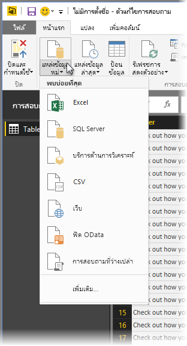

สำหรับข้อมูลเพิ่มเติมเกี่ยวกับแหล่งข้อมูลที่พร้อมใช้งาน ดู**แหล่งข้อมูล** สำหรับข้อมูลเกี่ยวกับการเชื่อมต่อกับข้อมูล ที่รวมถึงตัวอย่างและขั้นตอน ดู**เชื่อมต่อกับข้อมูล**

แท็บ**แปลง**แท็บให้การเข้าถึงงานแปลงข้อมูลทั่วไปเช่น การเพิ่มหรือลบคอลัมน์ เปลี่ยนชนิดข้อมูล การแบ่งคอลัมน์ และงานข้อมูลอื่นๆ รูปภาพต่อไปนี้แสดง แท็บ**แปลง**  

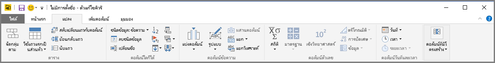

สำหรับข้อมูลเพิ่มเติมเกี่ยวกับการแปลงข้อมูล ที่รวมถึงตัวอย่าง ดู**รวมและจัดรูปร่างข้อมูล**

แท็บ**เพิ่มคอลัมน์**เป็นการเพิ่มคอลัมน์ จัดรูปแบบข้อมูลคอลัมน์ และการเพิ่มคอลัมน์แบบกำหนดเองรวมทั้งงานอื่นๆที่เกี่ยวข้อง รูปภาพต่อไปนี้แสดง แท็บ**เพิ่มคอลัมน์**  

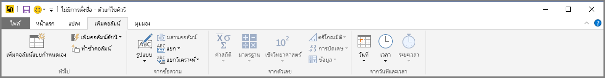

แท็บ**มุมมอง**บน ribbon ถูกใช้เพื่อสลับว่าจะแสดงบานหน้าต่าง หรือ windows นอกจากนี ้ยังใช้เพื่อแสดงตัวแก้ไขขั้นสูง รูปภาพต่อไปนี้แสดง แท็บ**มุมมอง**  

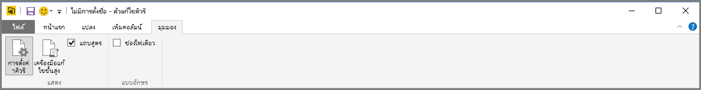

ขอให้ทราบว่า งานพร้อมใช้งานที่เรียกจาก ribbon จะแสดงโดยการคลิกขวาคอลัมน์หรือข้อมูลอื่นๆ ในบานหน้าต่างตรงกลาง

## บานหน้าต่างด้านซ้าย
บานหน้าต่างด้านซ้ายแสดงจำนวนของคิวรีที่ใช้งานอยู่ รวมทั้งชื่อของคิวรี เมื่อคุณเลือกคิวรีจากบานหน้าต่างด้านซ้าย ข้อมูลของคิวรีจะแสดงในบานหน้าต่างตรงกลาง ซึ่งคุณสามารถจัดรูปแบบ และแปลงข้อมูลนี้ตามความต้องการของคุณ รูปต่อไปนี้แสดงบานหน้าต่างด้านซ้ายที่มีหลายคิวรี  

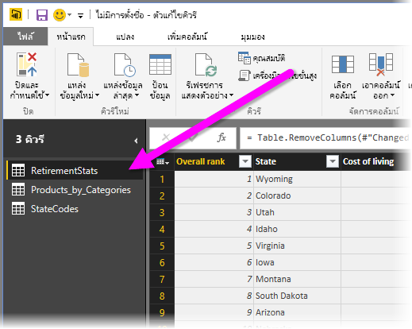

## บานหน้าต่างตรงกลาง (ข้อมูล)
บานหน้าต่างตรงกลางหรือบานหน้าต่างข้อมูลจะแสดงข้อมูลจากคิวรีที่เลือก นี่คือตำแหน่งที่เห็นการทำงานของคิวรี

รูปต่อไปนี้แสดงการเชื่อมต่อข้อมูลเว็บที่สร้างก่อนหน้านี้ คอลัมน์**คะแนนโดยรวม**ถูกเลือก และส่วนหัวถูกคลิ๊กขวาเพื่อแสดงรายการเมนูที่พร้อมใช้งาน โปรดสังเกตว่า รายการเมนูคลิกขวาเหล่านี้หลายรายการจะเหมือนกับปุ่มในแท็บ ribbon  

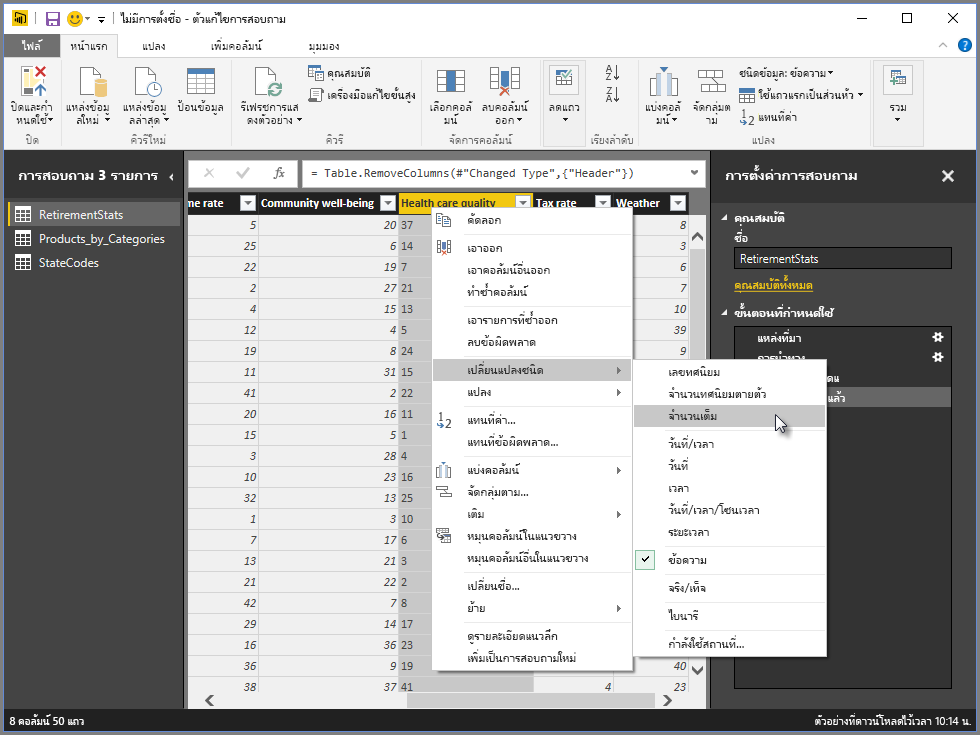

เมื่อคุณเลือกรายการเมนูคลิกขวา (หรือปุ่ม ribbon) คิวรีจะทำงานตามขั้นตอนกัับข้อมูล และบันทึกขั้นตอนเป็นส่วนหนึ่งของคิวรีนั้น ขั้นตอนเหล่านี้จะถูกบันทึกในบานหน้าต่าง**การตั้งค่าคิวรี**อย่างเป็นลำดับ ตามที่อธิบายไว้ในหัวข้อถัดไป  

## บานหน้าต่างการตั้งค่าคิวรี
บานหน้าต่าง**การตั้งค่าคิวรี**แสดงขั้นตอนทั้งหมดที่เกี่ยวข้องกับคิวรี ตัวอย่างเช่น ในรูปต่อไปนี้ หัวข้อ**ขั้นตอนที่นำไปใช้**ของบานหน้าต่าง**การตั้งค่าคิวรี**แสดงว่าเราเพิ่งเปลี่ยนชนิดของคอลัมน์**คะแนนโดยรวม**

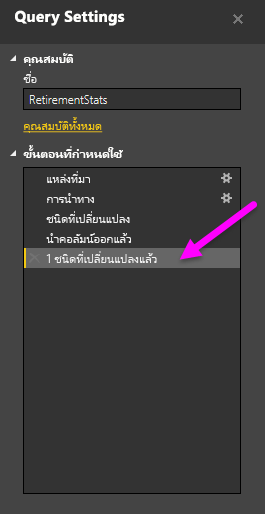

ขั้นตอนการจัดรูปทรงจะอยู่ในหัวข้อ**ขั้นตอนที่นำไปใช้**

ขอให้ทราบว่า ข้อมูลพื้นฐาน*ไม่*ได้ถูกเปลี่ยน แต่ตัวแก้ไขคิวรีปรับและจัดรูปรู่างมุมมองข้อมูล และการโต้ตอบกับข้อมูลพื้นฐานเกิดขึ้นตามการจัดรูปร่างและการปรับเปลี่ยนมุมมองข้อมูลนั้น

ในบานหน้าต่าง**การตั้งค่าคิวรี**บานหน้าต่าง คุณสามารถเปลี่ยนชื่อขั้นตอน ลบขั้นตอน หรือจัดลำดับขั้นตอน ตามที่คุณเห็นว่าเหมาะสมได้ เมื่อต้องการทำเช่นนั้น คลิกขวาที่ขั้นตอนในหัวข้อ**ขั้นตอนท่่ีนำไปใช้**และเลือกจากเมนูที่ปรากฏ ขั้นตอนคิวรีทั้งหมดจะดำเนินการตามลำดับที่ปรากฏในบานหน้าต่าง**ขั้นตอนที่นำไปใช้**

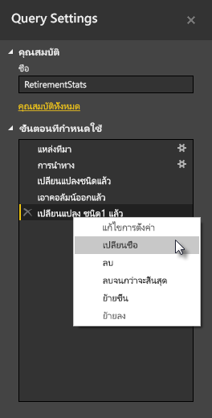

## เครื่องมือแก้ไขขั้นสูง
ถ้าคุณต้องการดูรหัสที่ตัวแก้ไขคิวรีสร้างในแต่ละขั้นตอน หรือต้องการสร้างรหัสของคุณเอง คุณสามารถใช้**ตัวแก้ไขขั้นสูง** เมื่อต้องการเปิดใช้ตัวแก้ไขขั้นสูง เลือก**มุมมอง**จาก ribbon แล้วเลือก**ตัวแก้ไขขั้นสูง** หน้าต่างจะปรากฏขึ้น แสดงรหัสคิวรีที่่มีอยู่  

คุณสามารถแก้ไขรหัสในหน้าต่าง**ตัวแก้ไขขั้นสูง**ได้โดยตรง เมื่อต้องการปิดหน้าต่าง เลือกปุ่ม**เสร็จสิ้น**หรือ**ยกเลิก**  

## บันทึกงานของคุณ
เมื่อคิวรีของคุณอยู่ที่ที่่คุณต้องการ คุณสามารถใช้ตัวแก้ไขคิวรีทำให้แบบจำลองข้อมูลเปลี่ยนแปลงใน Power BI Desktop และปิดตัวแก้ไขคิวรี เมื่อต้องการทำเช่นนั้น เลือก**ปิด & ใช้**จากเมนู**ไฟล์**ของตัวแก้ไขคิวรี  
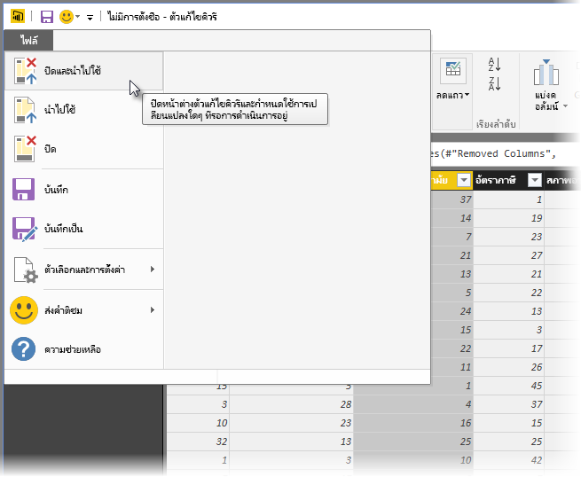

เมื่อเกิดความคืบหน้า Power BI Desktop จะแสดงกล่องโต้ตอบเพื่อแสดงสถานะ  

เมื่อคุณมีคิวรีของคุณในที่ที่คุณต้องการ หรือถ้าคุณเพียงต้องการตรวจสอบให้แน่ใจว่ามีการบันทึกงานของคุณ Power BI Desktop สามารถบันทึกงานของคุณในรูปแบบไฟล์.pbix

เมื่อต้องการบันทึกงานของคุณ เลือก**แฟ้ม\>บันทึก** (หรือ**ไฟล์\>บันทึกเป็น**), ดังที่แสดงในรูปต่อไปนี้  
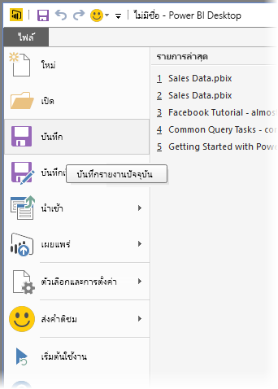

## ขั้นตอนถัดไป
มีมากมายหลากหลายสิ่งที่คุณสามารถทำได้ด้วย Power BI Desktop สำหรับข้อมูลเพิ่มเติมเกี่ยวกับขีดความสามารถ กรุณาดูแหล่งทรัพยากรต่อไปนี้:

* [Power BI Desktop คืออะไร](desktop-what-is-desktop.md)
* [แหล่งข้อมูลใน Power BI Desktop](desktop-data-sources.md)
* [เชื่อมต่อกับข้อมูลใน Power BI Desktop](desktop-connect-to-data.md)
* [จัดรูปร่างและรวมข้อมูลด้วย Power BI Desktop](desktop-shape-and-combine-data.md)
* [งานคิวรี่ที่ใช้บ่อยใน Power BI Desktop](desktop-common-query-tasks.md)   

