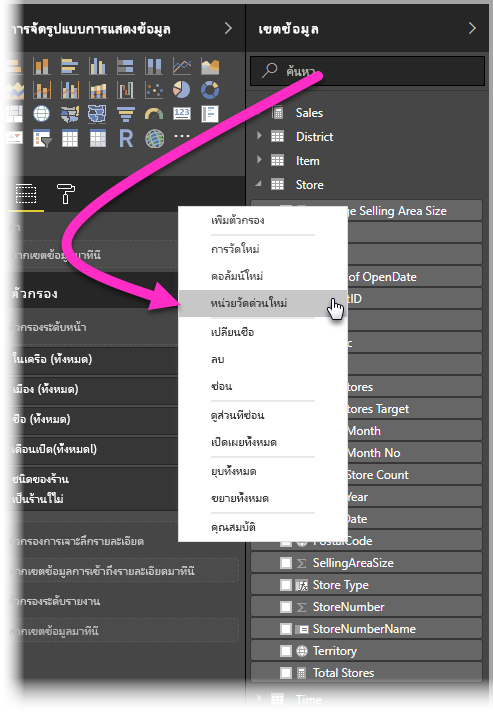
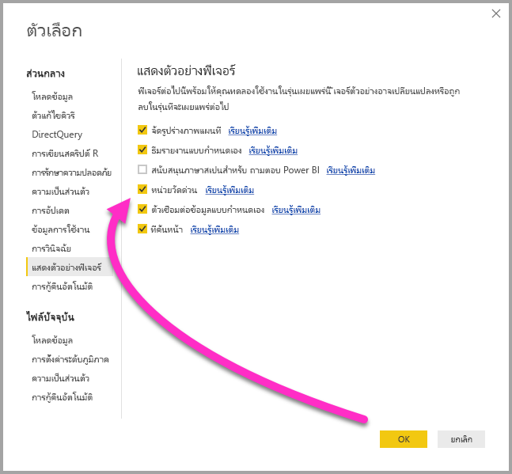
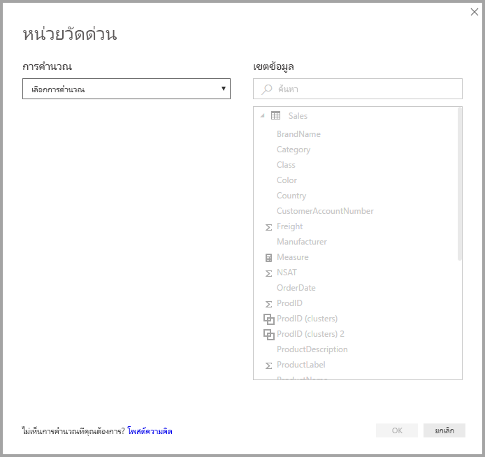
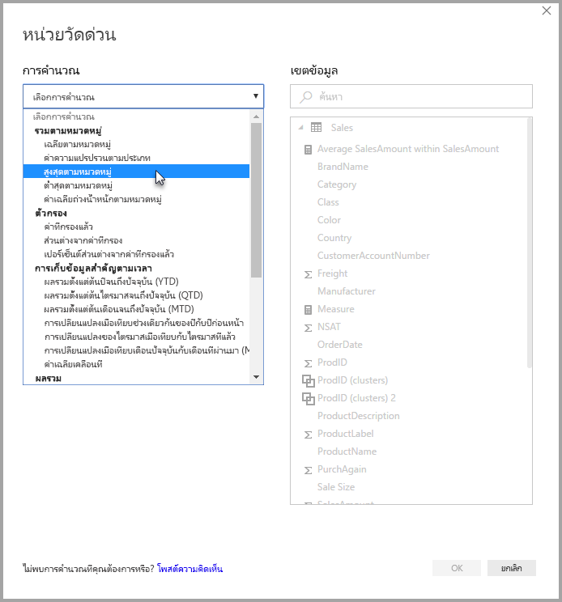
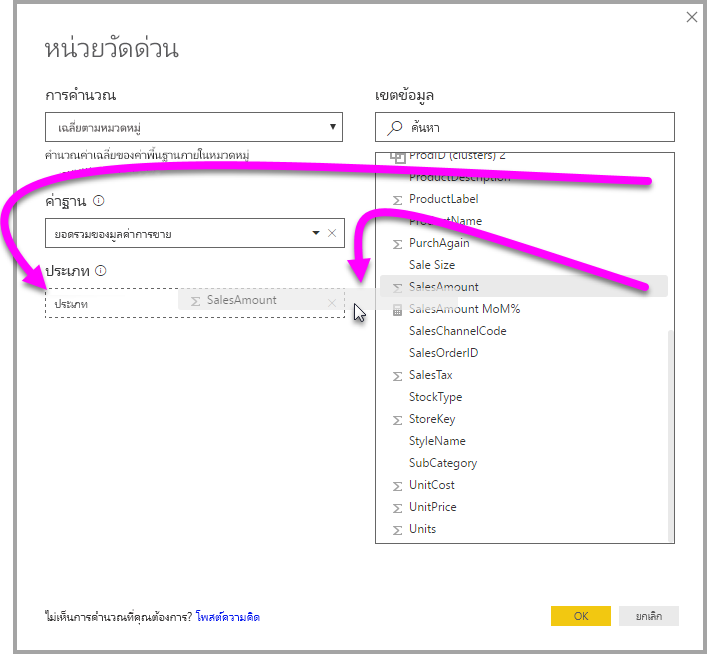
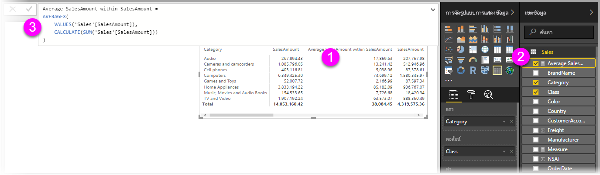
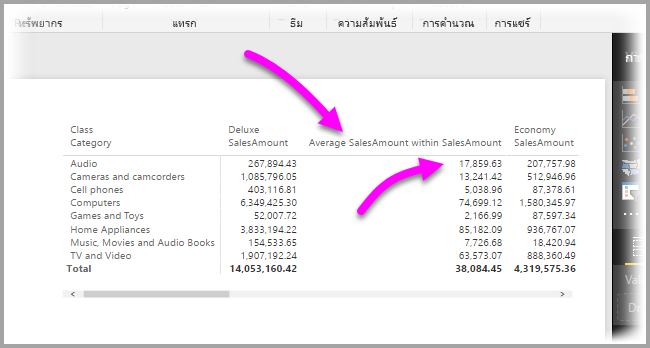
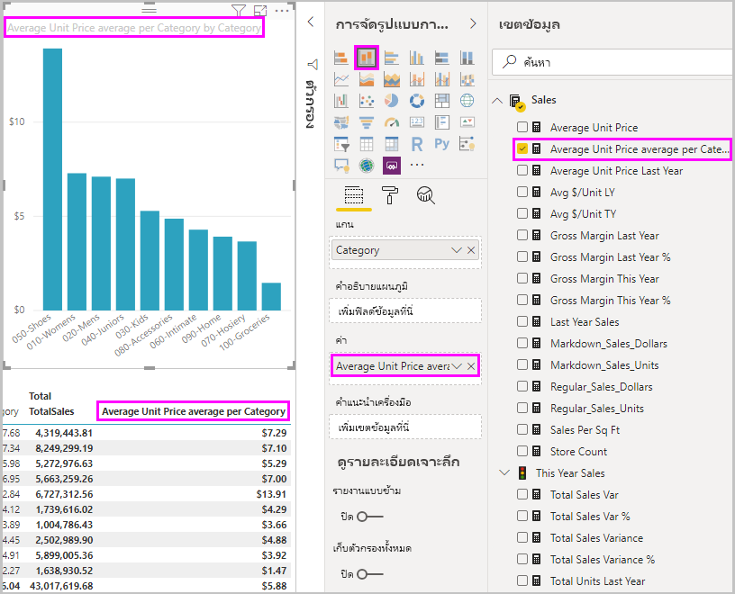
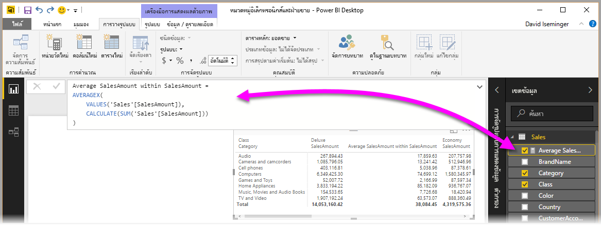
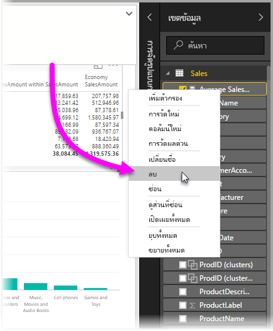

# ใช้การวัดผลด่วนเพื่อการคำนวณที่ใช้บ่อยและทรงพลังได้อย่างง่ายดาย
คุณสามารถใช้**การวัดผลด่วน** ทำการคำนวณที่ใช้บ่อยและทรงพลัง ได้อย่างรวดเร็วและง่ายดาย **การวัดผลด่วน**เรียกใช้ชุดคำสั่ง DAX ในเบื้องหลัง (คุณไม่จำเป็นต้องเขียน DAX เอง – ทั้งหมดทำให้คุณเรียบร้อยแล้ว) ตามที่คุณป้อนเข้าในกล่องโต้ตอบ จากนั้นแสดงผลลัพธ์เพื่อให้คุณได้ใช้ในรายงานของคุณ ยิ่งไปกว่านั้น คุณสามารถดู DAX ที่ดำเนินการโดยการวัดผลด่วน และเริ่มต้นหรือขยายความรู้ DAX ของคุณเอง

คุณสร้าง**การวัดผลด่วน** โดยการคลิกขวาเขตข้อมูลหนึ่งใน**เขตข้อมูล** แล้วเลือก**การวัดผลด่วนใหม่**จากเมนูที่ปรากฏ คุณยังสามารถคลิกขวาที่ค่าใด ๆ ในบานหน้าต่าง**ค่า**ของวิชวลมีอยู่ แล้ว (เช่นเขตข้อมูล*ค่า*ในวิชวล*แผนภูมิแท่ง*) มีการคำนวนอยู่มากมายหลายประเภท และวิธีการปรับเปลี่ยนแต่ละการคำนวณให้ตรงกับความต้องการของคุณ

### การวัดผลด่วนใช้งานได้โดยทั่วไปแล้วในขณะนี้

เริ่มตั้งแต่การเผยแพร่ เดือนกุมภาพันธ์ 2018 ของ **Power BI Desktop** การวัดผลด่วนมีให้ใช้งานโดยทั่วไปแล้ว (ไม่อยู่ในตัวอย่างอีกต่อไป) ถ้าคุณกำลังใช้ **Power BI Desktop** รุ่นก่อนหน้า คุณสามารถลองคุณลักษณะ**การวัดผลด่วน** เริ่มตั้งแต่การเผยแพร่**เดือนเมษายน 2017** ของ **Power BI Desktop** โดยเลือก**ไฟล์ > ตัวเลือกและการตั้งค่า > ตัวเลือก > คุณลักษณะตัวอย่าง** แล้วเลือกกล่องกาเครื่องหมายข้าง**การวัดผลด่วน**

คุณจะต้องรีสตาร์ท **Power BI Desktop** หลังจากที่คุณทำการเลือกแล้ว

## การใช้วัดผลด่วน
เพื่อสร้าง**การวัดผลด่วน** คลิกขวาบนเขตข้อมูล (ใด ๆ) ใน**เขตข้อมูล**ใน **Power BI Desktop** และเลือก**การวัดผลด่วน**จากเมนูที่ปรากฏขึ้น

เมื่อใช้การเชื่อมต่อสดของ SQL Server Analysis Services (SSAS) มี**การวัดผลด่วน**ให้ใช้งานบางตัว **Power BI Desktop** จะแสดงเฉพาะชุดของ**การวัดผลด่วน**ที่ได้รับการสนับสนุนสำหรับรุ่นของ SSAS ที่ทำการเชื่อมต่อ ดังนั้น ถ้าคุณมีการเชื่อมต่อกับแหล่งข้อมูลสด SSAS และคุณไม่เห็น**การวัดผลด่วน**บางตัวในรายการ อาจเป็นเพราะเวอร์ชัน SSAS ที่คุณเชื่อมต่อไม่สนับสนุนการวัด DAX ที่ใช้โดย**การวัดผลด่วน**นั้น

เมื่อเลือกจากเมนูคลิกขวา หน้าต่าง**การวัดผลด่วน**ต่อไปนี้จะปรากฏขึ้น ให้คุณสามารถเลือกการคำนวณที่คุณต้องการ และเขตข้อมูลที่คุณต้องการเรียกใช้การคำนวณ

เมื่อคุณเลือกเมนูดรอปดาวน์ คุณจะเห็นรายการ**การวัดผลด่วน**จำนวนมากที่พร้อมให้ใช้งาน

การวัดผลด่วน มีอยู่ด้วยกันห้ากลุ่มตามชนิดของการคำนวน แต่ละกลุ่มก็ประกอบไปด้วยการคำนวนต่าง ๆ กลุ่มและการคำนวณ มีดังต่อไปนี้:

* **ค่ารวมตามประเภท**
  * เฉลี่ยตามหมวดหมู่
  * ค่าความแปรปรวนตามประเภท
  * สูงสุดตามหมวดหมู่
  * ต่ำสุดตามหมวดหมู่
  * ค่าเฉลี่ยถ่วงน้ำหนักตามหมวดหมู่
* **ตัวกรอง**
  * ค่าที่กรองแล้ว
  * ส่วนต่างจากค่าที่กรอง
  * เปอร์เซ็นต์ส่วนต่างจากค่าที่กรองแล้ว
  * ยอดขายจากประเภทใหม่
* **ตัวแสดงเวลา**
  * ผลรวมตั้งแต่ต้นปีจนถึงปัจจุบัน (YTD)
  * ผลรวมตั้งแต่ต้นไตรมาสจนถึงปัจจุบัน (QTD)
  * ผลรวมตั้งแต่ต้นเดือนจนถึงปัจจุบัน (MTD)
  * การเปลี่ยนแปลงเมื่อเทียบปีปัจจุบันกับปีที่ผ่านมา (YoY)
  * การเปลี่ยนแปลงเมื่อเทียบไตรมาสปัจจุบันกับไตรมาสที่ผ่านมา (QoQ)
  * การเปลี่ยนแปลงเมื่อเทียบเดือนปัจจุบันกับเดือนที่ผ่านมา (MoM)
  * ค่าเฉลี่ยเคลื่อนที่
* **ทั้งหมด**
  * การรันทั้งหมด
  * ยอดรวมของประเภท (ใช้ตัวกรอง)
  * ยอดรวมของประเภท (ไม่ใช้ตัวกรอง)
* **การดำเนินการทางคณิตศาสตร์**
  * การบวก
  * การลบ
  * การคูณ
  * การหาร
  * เปอร์เซ็นต์ผลต่าง
  * สัมประสิทธิ์สหสัมพันธ์
* **ข้อความ**
  * การจัดอันดับด้วยดาว
  * รายการค่าแบบเชื่อมเข้าด้วยกัน

เราหวังว่าจะเพิ่มการคำนวณอีก และต้องการฟังความคิดเห็นว่า **การวัดผลด่วน**ไหนที่คุณต้องการเห็น ถ้าคุณมีแนวคิด (รวมถึงสูตร DAX) สำหรับ**การวัดผลด่วน**ที่คุณอยากส่งมาให้พิจารณา มีเนื้อหาเรื่องนี้เพิ่มเติม ที่ส่วนท้ายของบทความนี้

## ตัวอย่างของการวัดผลด่วน
ลองมาดูตัวอย่างการทำงานของ**การวัดผลด่วน**เหล่านี้

วิชวล**เมทริกซ์**ต่อไปนี้ แสดงตารางยอดขายสำหรับผลิตภัณฑ์อิเล็กทรอนิกส์ต่าง ๆ เป็นตารางพื้นฐานที่มีผลรวมสำหรับผลิตภัณฑ์แต่ละประเภท

เมื่อเราคลิกขวาที่เขตข้อมูลใน**ค่า** และเลือก**การวัดผลด่วน** เราสามารถเลือก*เฉลี่ยตามหมวดหมู่*ใน*การคำนวณ* แล้วเลือก *ผลรวมของ SalesAmount* ใน*ค่าฐาน* จากนั้นระบุ *SalesAmount* โดยการลากเขตข้อมูลนั้นจากกล่อง*เขตข้อมูล*ในบานหน้าต่างด้านขวา ลงในส่วน*ประเภท*ทางด้านซ้าย

เมื่อเราเลือก**ตกลง** เราเห็นสองสามสิ่งที่น่าสนใจเกิดขึ้น ดังที่แสดงในรูปหลังรายการต่อไปนี้:

1. วิชวล**เมทริกซ์** ตอนนี้มีคอลัมน์ใหม่ที่แสดงการคำนวณของเรา (ในกรณีนี้ *SalesAmount เฉลี่ยภายใน SalesAmount*)
2. **หน่วยวัด**ใหม่จะถูกสร้างขึ้น และแสดงใน**เขตข้อมูล** และถูกไฮไลต์ (อยู่ในกล่องสีเหลืองที่ Power BI ใส่ให้) หน่วยวัดนี้จะมีให้ใช้งานกับวิชวลอื่น ๆ ในรายงานด้วย ไม่ใช่แค่วิชวลที่สร้างหน่วยวัดขึ้นแต่แรก
3. สูตร DAX ที่ถูกสร้างขึ้นสำหรับ**การวัดผลด่วน**จะแสดงในแถบสูตร

เริ่มจากข้อแรกในรายการ ให้สังเกตว่า**การวัดผลด่วน**ถูกนำไปใช้กับวิชวล มีคอลัมน์ใหม่และค่าที่เกี่ยวข้อง ตาม**การวัดผลด่วน**ที่สร้างขึ้น

ข้อสอง **การวัดผลด่วน**จะแสดงขึ้นใน**เขตข้อมูล**ของรูปแบบข้อมูล และสามารถใช้งานได้เช่นเดียวกับเขตข้อมูลอื่น ๆ ในรูปแบบ สำหรับวิชวลอื่น ๆ ในรูปต่อไปนี้ วิชวล**แผนภูมิแท่ง**ถูกสร้างขึ้นอย่างรวมเร็ว โดยใช้เขตข้อมูลใหม่ที่สร้างจาก**การวัดผลด่วน**

เราไปยังส่วนถัดไปกัน เพื่อพูดคุยเรื่องข้อที่สาม นั่นคือสูตร DAX

## เรียนรู้ DAX ด้วยการวัดผลด่วน
ประโยชน์ที่ยอดเยี่ยมอีกอย่างของ**การวัดผลด่วน**คือ จะแสดงสูตร DAX ที่ถูกสร้างขึ้นเพื่อคำนวนหน่วยวัดให้เห็น ในรูปต่อไปนี้ เราได้เลือกหน่วยวัดที่ถูกสร้างขึ้นด้วย**การวัดผลด่วน** (ขณะนี้หน่วยวัดอยู่ใน**เขตข้อมูล**แล้ว เราแค่คลิกที่หน่วยวัดนั้น) เมื่อเลือกแล้ว **แถบสูตร**จะปรากฏขึ้น แสดงสูตร DAX ที่ Power BI สร้างขึ้นสำหรับใช้กับหน่วยวัด

นี่เป็นสิ่งที่ดีในตัวเอง เนื่องจากจะแสดงสูตรที่อยู่เบื้องหลังการวัดให้กับคุณ แต่สิ่งที่สำคัญยิ่งกว่านั้นคือ ช่วยให้คุณใช้**การวัดผลด่วน**เพื่อดูว่าจะสร้างสูตร DAX ได้อย่างไร

สมมติว่า คุณต้องคำนวณการเปลี่ยนแปลงปีต่อปี แต่คุณไม่แน่ใจว่าจะจัดโครงสร้างสูตร DAX อย่างไร (หรือคุณยังไม่รู้ว่าจะเริ่มต้นอย่างไร!) แทนที่จะโขกหัวของคุณบนโต๊ะทำงาน คุณสามารถสร้าง**การวัดผลด่วน**โดยใช้การคำนวน**การเปลี่ยนแปลงเมื่อเทียบปีปัจจุบันกับปีที่ผ่านมา** และดูสิ่งที่เกิดขึ้นได้ สร้าง**การวัดผลด่วน** และดูว่าจะปรากฏในวิชวลของคุณอย่างไร ดูว่าสูตร DAX ทำงานอย่างไร แล้วทำการแก้ไขสูตร DAX โดยตรง หรือสร้างหน่วยวัดอื่นจนกว่าจะได้การคำนวณที่ตรงตามความต้องการ หรือความคาดหวังของคุณ

เหมือนกับมีครูผู้สอนที่ตอบคำถามคุณแบบ what-if ในทันที โดยการคลิกไม่กี่ครั้ง คุณสามารถลบหน่วยวัดเหล่านั้นจากรูปแบบของคุณได้เสมอ ถ้าคุณไม่ชอบ - ง่ายเพียงแค่คลิกขวาที่หน่วยวัดและเลือก**ลบ**

และ เมื่อคุณมีหน่วยวัดที่เสร็จสมบูรณ์ คุณสามารถเปลี่ยนชื่อเป็นอะไรก็ได้ที่คุณต้องการ โดยใช้เมนูคลิกขวาเดียวกัน

## ข้อจำกัดและข้อควรพิจารณา
มีข้อจำกัดและข้อควรพิจารณาบางข้อที่คุณควรทราบ

* **การวัดผลด่วน** มีให้เฉพาะเมื่อคุณสามารถปรับเปลี่ยนรูปแบบเท่านั้น ซึ่งไม่เป็นเช่นนั้นเมื่อคุณกำลังทำงานกับการเชื่อมต่อสดบางแบบ (การเชื่อมต่อสดกับตาราง SSAS ที่ได้รับการสนับสนุน ตามที่ได้อธิบายไปก่อนหน้านี้)
* หน่วยวัดที่จะถูกเพิ่มไปยัง**เขตข้อมูล** สามารถใช้กับทุกวิชวลในรายงาน
* คุณสามารถดู DAX ที่เชื่อมโยงกับ**การวัดผลด่วน**ได้ตลอดเวลา โดยการเลือกหน่วยวัดสร้างขึ้นใน**เขตข้อมูล** จากนั้นดูสูตรใน**แถบสูตร**
* คุณไม่สามารถสร้างการวัดผลด่วนตัวแสดงเวลา เมื่อทำงานในโหมด DirectQuery ฟังก์ชัน DAX ที่ใช้ในการวัดผลด่วนเหล่านี้ มีผลต่อประสิทธิภาพการทำงาน เมื่อแปลเป็นคำสั่ง T-SQL ที่ส่งไปยังแหล่งข้อมูลของคุณ

> [!WARNING]
> การวัดด่วนในขณะนี้ สร้างคำสั่ง DAX ที่คั่นระหว่างอาร์กิวเมนต์ด้วยเครื่องหมายจุลภาค*เท่านั้น* ถ้าเวอร์ชัน **Power BI Desktop** ของคุณได้รับการแปลเป็นภาษาที่ใช้จุลภาคเป็นตัวคั่นทศนิยม การวัดผลด่วนจะทำงานไม่ถูกต้อง
> 
> 

### ตัวแสดงเวลาและการวัดผลด่วน
เริ่มตั้งแต่การปรับปรุง ตุลาคม 2017 ของ **Power BI Desktop** คุณสามารถใช้ตารางวันที่แบบกำหนดเองของคุณ กับ**การวัดผลด่วน**ตัวแสดงเวลาได้ ถ้าคุณกำลังใช้รูปแบบตารางจากภายนอก คุณต้องแน่ใจว่า เมื่อรูปแบบถูกสร้างขึ้น คอลัมน์วันที่หลักในตาราง ต้องถูกทำเครื่องหมายว่าเป็นตารางวันที่ ตามที่อธิบายไว้ใน[บทความนี้](https://docs.microsoft.com/sql/analysis-services/tabular-models/specify-mark-as-date-table-for-use-with-time-intelligence-ssas-tabular) ถ้าคุณกำลังนำเข้าตารางวันที่ของคุณเอง ตรวจสอบให้แน่ใจว่าได้ทำเครื่องหมายเป็นตารางวันที่ ตามที่อธิบายไว้ใน[บทความนี้](https://docs.microsoft.com/power-bi/desktop-date-tables)

### ข้อมูลเพิ่มเติมและตัวอย่าง
เราคาดว่าจะให้ตัวอย่างและคำแนะนำสำหรับ**การวัดผลด่วน**แต่ละการคำนวน ดังนั้นโปรดกลับมาดูเร็ว ๆ นี้ สำหรับการปรับปรุงบทความที่เน้นเนื้อหาดังกล่าว

มีแนวคิดสำหรับ**การวัดผลด่วน** ที่ยังไม่มีหรือไม่ เยี่ยม! ลองดู[เพจนี้](https://go.microsoft.com/fwlink/?linkid=842906) และส่งแนวคิดของคุณ (และสูตร DAX) สำหรับ**การวัดผลด่วน**ที่คุณอยากเห็นใน **Power BI Desktop** และเราจะพิจารณาเพิ่มเข้าไปในรายการของ**การวัดผลด่วน** ในการเผยแพร่ในอนาคต

