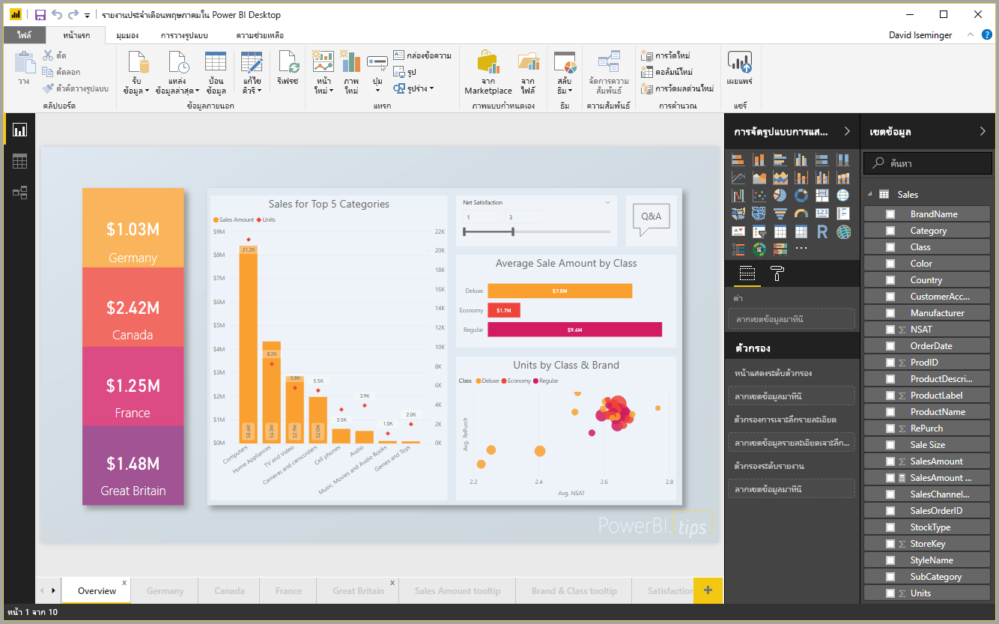

# เริ่มต้นใช้งานด่วน: เชื่อมต่อกับข้อมูลใน Power BI Desktop

ในเริ่มต้นใช้งานด่วนนี้ คุณเชื่อมต่อกับข้อมูลโดยใช้ **Power BI Desktop** ซึ่งเป็นขั้นตอนแรกในการสร้างรูปแบบข้อมูล และสร้างรายงาน

ถ้าคุณไม่ได้ลงทะเบียน Power BI ให้[ลงทะเบียนรุ่นทดลองใช้ฟรี](https://app.powerbi.com/signupredirect?pbi_source=web)ก่อนที่คุณจะเริ่มต้นใช้งาน

## ข้อกำหนดเบื้องต้น

เพื่อทำตามขั้นตอนในบทความนี้ คุณต้องการสิ่งต่อไปนี้:
* ดาวน์โหลด และติดตั้ง **Power BI Desktop** ซึ่งเป็นแอปพลิเคชันฟรีที่ทำงานบนคอมพิวเตอร์ของคุณ คุณสามารถ[ดาวน์โหลด **Power BI Desktop**](https://powerbi.microsoft.com/desktop) ได้โดยตรง หรือคุณ[สามารถได้รับจาก **Microsoft Store**](http://aka.ms/pbidesktopstore) ได้
* [ดาวน์โหลดเวิร์กบุ๊ก Excel ตัวอย่างนี้](http://go.microsoft.com/fwlink/?LinkID=521962) และสร้างโฟลเดอร์ที่ชื่อว่า *C:\PBID-qs* ซึ่งคุณสามารถเก็บไฟล์ Excel ขั้นตอนต่อ ๆ ไปถือว่า นั่นคือตำแหน่งที่ตั้งไฟล์สำหรับเวิร์กบุ๊ก Excel ที่ดาวน์โหลด

## เปิดใช้ Power BI Desktop

เมื่อคุณติดตั้ง **Power BI Desktop** แล้ว เปิดใช้แอปพลิเคชันเพื่อให้ทำงานบนคอมพิวเตอร์ของคุณ คุณจะเห็นพื้นที่ว่างเปล่า ซึ่งเป็นที่ที่คุณสร้างวิชวลและรายงานจากข้อมูลที่คุณเชื่อมต่อ 

## เชื่อมต่อกับข้อมูล

ด้วย **Power BI Desktop** คุณสามารถเชื่อมต่อกับข้อมูลชนิดต่าง ๆ กันได้หลายชนิด คุณสามารถเชื่อมต่อกับแหล่งข้อมูลพื้นฐาน เช่น ไฟล์ Microsoft Excel และคุณสามารถเชื่อมต่อกับบริการออนไลน์ที่ประกอบด้วยข้อมูลที่หลากหลาย เช่น Salesforce, Microsoft Dynamics, Azure Blob Storage และอีกมากมาย 

เพื่อเชื่อมต่อกับข้อมูล ไปที่ ribbon **หน้าแรก** และเลือก**รับข้อมูล**

หน้าต่าง**รับข้อมูล**จะปรากฏขึ้น ซึ่งคุณสามารถเลือกจากแหล่งข้อมูลต่าง ๆ มากมายที่ **Power BI Desktop** สามารถเชื่อมต่อได้ ในเริ่มต้นใช้งานด่วนนี้ เราจะใช้เวิร์กบุ๊ก Excel ที่คุณได้ดาวน์โหลด ไว้ในส่วน*ข้อกำหนดเบื้องต้น* ที่จุดเริ่มต้นของบทความนี้ 

เนื่องจากเป็นไฟล์ Excel เราเลือก **Excel** จากหน้าต่าง**รับข้อมูล** แล้วเลือกปุ่ม**เชื่อมต่อ**

เราจะได้รับพร้อมท์ให้ใส่ตำแหน่งที่ตั้งของไฟล์ Excel ที่เราต้องการเชื่อมต่อ แฟ้มที่ดาวน์โหลดมาชื่อว่า *Financial Sample* ดังนั้นเราเลือกไฟล์ดังกล่าว จากนั้นเลือก**เปิด**

จากนั้น **Power BI Desktop** จะโหลดเวิร์กบุ๊ก อ่านเนื้อหา และแสดงข้อมูลที่มีอยู่ในไฟล์โดยใช้หน้าต่าง**ตัวนำทาง** ซึ่งคุณสามารถเลือกข้อมูลที่คุณต้องการโหลดลงใน Power BI Desktop คุณสามารถเลือกตาราง โดยเลือกที่กล่องกาเครื่องหมายด้านข้างของตารางที่คุณต้องการนำเข้า ในกรณีนี้ เราจะนำเข้าทั้งสองตารางที่มี

เมื่อคุณเลือกเสร็จแล้ว เลือก**โหลด**เพื่อนำเข้าข้อมูลลงใน Power BI Desktop

## ดูข้อมูลในบานหน้าต่างเขตข้อมูล

เมื่อคุณโหลดตารางเสร็จ บานหน้าต่าง**เขตข้อมูล**จะแสดงข้อมูลให้คุณ คุณสามารถขยายแต่ละตาราง โดยการเลือกรูปสามเหลี่ยมที่อยู่ข้างชื่อ ในรูปต่อไปนี้ ตาราง *financials* ถูกขยาย แสดงแต่ละเขตข้อมูลของตารางนั้น 

เท่านี้ก็เรียบร้อย! คุณได้เชื่อมต่อกับข้อมูลใน **Power BI Desktop** โหลดข้อมูลนั้น และตอนนี้ คุณเห็นเขตข้อมูลทั้งหมดที่มีในตารางเหล่านั้น

## ขั้นตอนถัดไป
คุณสามารถทำอะไรได้มากมายด้วย **Power BI Desktop** เมื่อคุณเชื่อมต่อกับข้อมูลแล้ว เช่น การสร้างวิชวลและรายงาน ลองดูที่ทรัพยากรต่อไปนี้เพื่อช่วยคุณเริ่มต้น:

* [คำแนะนำเริ่มต้นใช้งานสำหรับ Power BI Desktop](desktop-getting-started.md)

