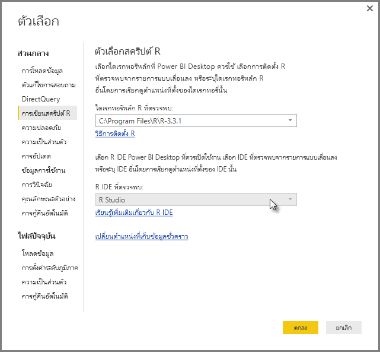
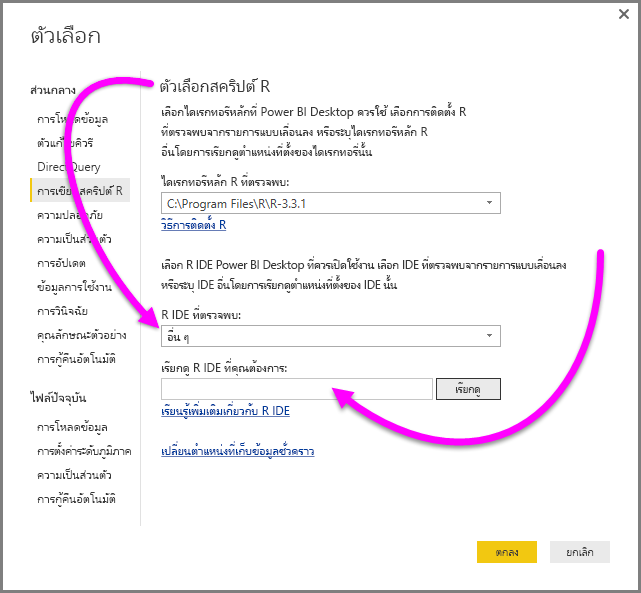
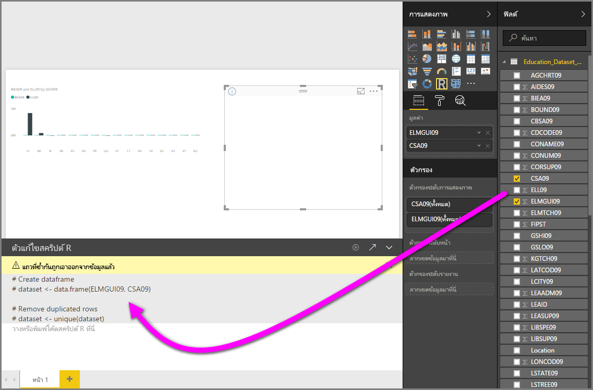
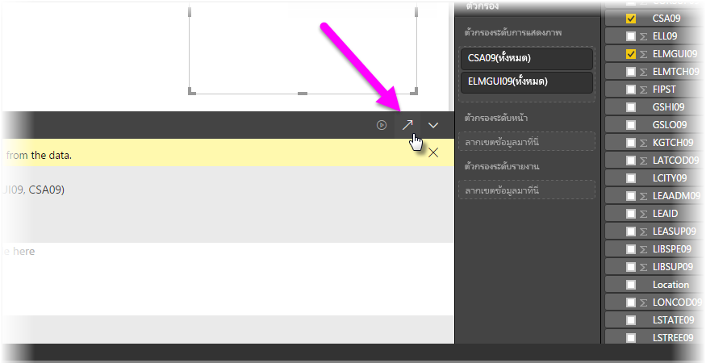
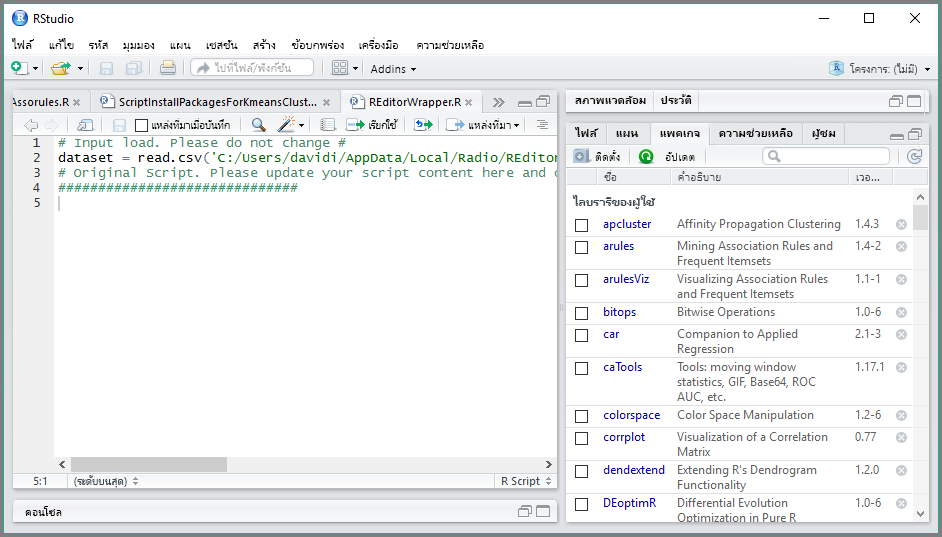

# ใช้ IDE ภายนอกกับ Power BI
ด้วย**Power BI Desktop**คุณสามารถใช้ R IDE ภายนอกของคุณ (สภาพแวดล้อมรวมเพื่อการพัฒนา) เพื่อสร้าง และปรับปรุงสคริปต์ R จาก แล้วจะใช้สคริปต์เหล่านั้นใน Power BI ได้

## เปิดใช้งานการ R IDE ภายนอก
ก่อนหน้านี้ คุณจะต้องใช้ตัวแก้ไขสคริปต์ R ใน**Power BI Desktop**เพื่อสร้าง และเรียกใช้สคริปต์ R กับการเผยแพร่นี้ คุณสามารถเปิดใช้ของคุณ R IDE ภายนอกจาก**Power BI Desktop**และจะนำเข้าข้อมูลของคุณโดยอัตโนมัติ และแสดงใน R IDE จากที่นั่น คุณสามารถปรับเปลี่ยนสคริปต์ใน R IDE ภายนอก จากนั้นวางกลับลงใน**Power BI Desktop**เพื่อสร้างรูปภาพ Power BI และรายงานได้

ตั้งแต่ **Power BI Desktop** ที่วางจำหน่ายในเดือนกันยายน 2016(รุ่น 2.39.4526.362) คุณสามารถระบุ R IDE ที่คุณต้องการใช้ และได้เปิดใช้งานโดยอัตโนมัติจากภายใน**Power BI Desktop**

### ความต้องการ
เมื่อต้องใช้คุณลักษณะนี้ คุณจำเป็นต้องติดตั้ง**R IDE**บนเครื่องคอมพิวเตอร์ของคุณ **Power BI Desktop**ไม่รวมการนำเข้าใช้หรือการติดตั้ง R engine ดังนั้นคุณต้องติดตั้ง**R**แบบบนเครื่องคอมพิวเตอร์ของคุณแบบแยกต่างหาก คุณสามารถเลือก R IDE ที่จะใช้ ด้วยตัวเลือกต่อไปนี้

* คุณสามารถติดตั้ง R IDE ตัวโปรดของคุณ ซึ่งมีจำนวนมากที่ใช้งานฟรี เช่น[Revolution Open download page](https://mran.revolutionanalytics.com/download/)และ[CRAN Repository](https://cran.r-project.org/bin/windows/base/) ได้
* **Power BI Desktop**ยัง สนับสนุน[R Studio](https://www.rstudio.com/)และ**Visual Studio 2015**กับ[ *เครื่องมือ R สำหรับ Visual Studio* ](https://beta.visualstudio.com/vs/rtvs/)editor
* นอกจากนี้คุณสามารถติดตั้ง R IDE ที่แตกต่างกัน และมี**Power BI Desktop**เปิดใช้งานที่**R IDE**โดยทำอย่างใดอย่างหนึ่งต่อไปนี้
  
  * คุณสามารถเชื่อมโยงไฟล์ **.R** จาก IDE ภายนอกที่คุณต้องการให้**Power BI Desktop**เพื่อเปิดใช้งาน
  * คุณสามารถระบุ.exe ที่**Power BI Desktop**สามารถใช้งาน โดยเลือก*อื่น ๆ*จากการ**ตัวเลือก R Script**ส่วนของ**ตัวเลือก**แบบโต้ตอบ คุณสามารถนำกล่องโต้ตอบ **ตัวเลือก**โดยไปที่**ไฟล์ > ตัวเลือกและการตั้งค่า > ตัวเลือก**
    
    

ถ้าคุณมี R IDE หลายตัวติดตั้อยู่ง คุณสามารถระบุได้ว่าจะเปิดตัวใด โดยการเลือก*R IDE ที่ตรวจพบ*การดรอปดาวน์ในกล่องโต้ตอบ**ตัวเลือก**

ตามค่าเริ่มต้น ถ้ามีการติดตั้งบนคอมพิวเตอร์ของคุณภาย**Power BI Desktop**จะเปิด**R Studio**เป็นแบบ R IDE ภายนอก ถ้า**R Studio**ไม่ได้ติดตั้งและคุณมี**Visual Studio 2015**กับ**R Tools สำหรับ Visual Studio** มันจะเปิดใช้แทน ถ้าไม่มี R IDE ใดเลยติดตั้งอยู่ แอปพลิเคชันที่เชื่อมโยงกับไฟล์ **R** จะถูกเปิดใช้งาน

และถ้าหากไม่มีความสัมพันธ์ของไฟล์ **.R** อาจเป็นไปได้ที่จะต้องระบุเส้นทางไปยัง IDE แบบกำหนดเอง ใน*เรียกดู R IDE ที่คุณต้องการ*ส่วนของ**กล่องโต้ตอบ**ตัวเลือก คุณยังสามารถเปิดใช้ R IDE อื่น โดยการเลือกตัว**ตั้งค่า**ไอคอนรูปเฟืองด้านข้าง**เปิดใช้ R IDE**ไอคอนลูกศร ใน**Power BI Desktop**

## เปิดใช้การ R IDE จาก Power BI Desktop
เมื่อต้องการเปิดใช้การ R IDE จาก**Power BI Desktop**ให้ทำตามขั้นตอนต่อไปนี้

1. โหลดข้อมูลลงใน**Power BI Desktop**
2. เลือกเขตข้อมูลบางอย่างจากบานหน้าต่าง**เขตข้อมูล**ที่คุณต้องการใช้งาน ถ้าคุณยังไม่ได้เปิดใช้งานรูปของสคริปต์ คุณจะได้ถูกถามให้ทำเช่นนั้น
   
   
3. เมื่อเปิดใช้งานรูปของสคริปต์ คุณจะสามารถเลือกรูป R จากบานหน้าต่าง**แสดงภาพ** ซึ่งสร้างภาพ R แบบว่างที่พร้อมที่จะแสดงผลลัพธ์ของสคริปต์ของคุณ บานหน้าต่าง**ตัวแก้ไขสคริปต์ R**จะปรากฏขึ้น
   
   
4. ตอนนี้ คุณสามารถเลือกเขตข้อมูลคุณต้องการใช้ในสคริปต์ R ของคุณ เมื่อคุณเลือกเขตข้อมูล เขตข้อมูล**ตัวแก้ไขสคริปต์ R**จะถูกสร้างขึ้นแบบอัตโนมัติโดยเป็นไปตามเขตข้อมูลที่คุณเลือก คุณสามารถสร้าง (หรือวาง) สคริปต์ R ของคุณโดยตรงในบานหน้าต่าง **ตัวแก้ไขสคริปต์ R** หรือคุณสามารถปล่อยให้ว่างเปล่าก็ได้
   
   
   
   > [!NOTE]
   > ชนิดการรวมเริ่มต้นสำหรับวิชวล R คือ*ไม่รวมค่า*
   > 
   > 
5. ขณะนี้คุณสามารถเปิดใช้ R IDE ของคุณได้โดยตรงจาก**Power BI Desktop** เลือกปุ่ม**เปิดใช้ R IDE** พบบนด้านขวาของแถบชื่อ**R script editor** ตามที่แสดงด้านล่าง
   
   
6. R IDE ของคุณระบุจะเริ่มทำงาน โดย Power BI Desktop ดังที่แสดงในรูปต่อไปนี้ (ในรูปภาพนี้**RStudio**เป็น R IDE เริ่มต้น)
   
   
   
   > [!NOTE]
   > **Power BI Desktop**เพิ่มสามบรรทัดแรกของสคริปต์ แล้วจึงค่อยสามารถนำเข้าข้อมูลของคุณจาก**Power BI Desktop**เมื่อคุณเรียกใช้สคริปต์
   > 
   > 
7. สคริปต์ใด ๆ ที่คุณสร้างขึ้นใน**บานหน้าต่างตัวแก้ไขสคริปต์ R**ของ**Power BI Desktop**จะปรากฏเริ่มต้นในบรรทัดที่ 4 ใน R IDE ของคุณ ในตอนนี้ คุณสามารถสร้างสคริปต์ R ของคุณใน R IDE เมื่อสคริปต์ R ของคุณนั้สร้างเสร็จสมบูรณ์แล้วใน R IDE ของคุณ คุณจำเป็นต้องคัดลอก และวางไว้**ตัวแก้ไขสคริปต์ R**บานหน้าต่างใน**Power BI Desktop** *ยกเว้น*สามบรรทัดแรกของตัว สคริปต์ที่**Power BI Desktop**สร้างขึ้นโดยอัตโนมัติ ห้ามคัดลอกสามบรรทัดแรกของสคริปต์กลับเข้าไปใน**Power BI Desktop**บรรทัดเหล่านั้นถูกใช้เพื่อนำเข้าข้อมูลของคุณไปยัง R IDE ของคุณจากเท่านั้น**Power BI Desktop**

### ข้อจำกัดที่ทราบ
เปิดใช้งาน R IDE ได้โดยตรงจาก Power BI Desktop มีข้อจำกัดบางอย่าง

* การส่งออกสคริปต์โดยอัตโนมัติจาก R IDE ของคุณไปยัง**Power BI Desktop**ยังทำไม่ได้
* ตัวแก้ไข **ไคลเอ็นต์ R**(RGui.exe) ไม่ถูกรองรับ เนื่องจากตัวแก้ไขเองก็ไม่รองรับเปิดไฟล์

## ขั้นตอนถัดไป
ดูข้อมูลเพิ่มเติมเกี่ยวกับ R ใน Power BI

* [กำลังเรียกใช้สคริปต์ R ใน Power BI Desktop](desktop-r-scripts.md)
* [สร้างภาพ Power BI ที่ใช้ R](desktop-r-visuals.md)

