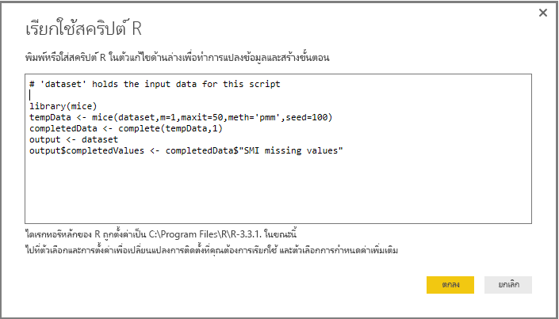

# ใช้ R ในตัวแก้ไขคิวรี
คุณสามารถใช้ **R** ซึ่งเป็นภาษาการเขียนโปรแกรมที่นักสถิติ นักวิทยาศาสตร์ข้อมูล และนักวิเคราะห์ข้อมูลใช้กันอย่างกว้างขวาง ใน**ตัวแก้ไขคิวรีของ** Power BI Desktop การรวม R ใน**ตัวแก้ไขคิวรี**ช่วยให้คุณดำเนินการทำความสะอาดข้อมูล และดำเนินการวิเคราะห์และการจัดรูปทรงข้อมูลขั้นสูงในชุดข้อมูล รวมทั้งการเติมเต็มข้อมูลที่คาดหาย การคาดการณ์ และการทำคลัสเตอร์ และอื่นๆ **R** เป็นภาษาที่มีประสิทธิภาพ และสามารถใช้ได้ใน**ตัวแก้ไขคิวรี**เพื่อเตรียมแบบจำลองข้อมูลของคุณ และสร้างรายงาน

## ติดตั้ง R
เมื่อต้องใช้ **R** ใน**ตัวแก้ไขคิวรี**ของ Power BI Desktop คุณจำเป็นต้องติดตั้ง **R** บนเครื่องคอมพิวเตอร์ของคุณ คุณสามารถดาวน์โหลดและติดตั้ง **R** ฟรีจากหลายสถานที่ ซึ่งรวมถึง[หน้าดาวน์โหลด Revolution Open](https://mran.revolutionanalytics.com/download/) และ [CRAN Repository](https://cran.r-project.org/bin/windows/base/)

## ใช้ R ในตัวแก้ไขคิวรี
เมื่อต้องแสดงวิธีใช้ **R** ใน**ตัวแก้ไขคิวรี**ใช้ตัวอย่างนี้จากชุดข้อมูลตลาดหุ้นซึ่งเป็นไฟล์ CSV ที่คุณสามารถ[ดาวน์โหลดจากที่นี่](http://download.microsoft.com/download/F/8/A/F8AA9DC9-8545-4AAE-9305-27AD1D01DC03/EuStockMarkets_NA.csv)และทำตามขั้นตอน ขั้นตอนสำหรับตัวอย่างนี้มีดังนี้:

1. ก่อนอื่น โหลดข้อมูลของคุณลงใน **Power BI Desktop** ในตัวอย่างนี้ โหลดไฟล์ *EuStockMarkets_NA.csv* และเลือก**รับข้อมูล > CSV** จาก ribbon ของ **Home** ใน **Power BI Desktop**

   
2. เลือกไฟล์ แล้วเลือก**เปิด**และ CSV จะแสดงในกล่องโต้ตอบ**ไฟล์ CSV**

   
3. เมื่อข้อมูลถูกโหลด คุณจะเห็นข้อมูลในบานหน้าต่าง**เขตข้อมูล**ใน Power BI Desktop

   
4. เปิด**ตัวแก้ไขคิวรี**โดยเลือก**แก้ไขคิวรี**จากแท็บ **Home** ใน**Power BI Desktop**

   
5. ในแท็บ**แปลง** เลือก**เรียกใช้สคริปต์ R**และตัวแก้ไข**เรียกใช้สคริปต์ R**จะปรากฏขึ้น (ที่แสดงอยู่ในขั้นตอนถัดไป) โปรดสังเกตว่า แถว 15 และ 20 ไม่มีข้อมูลบางอย่าง และแถวอื่นๆ ก็ขาดข้อมูลบางอย่างที่คุณไม่สามารถมองเห็นในรูปต่อไปนี้ ขั้นตอนด้านล่างแสดงวิธีที่ R สามารถ (และจะ) ใส่ข้อมูลในแถวเหล่านั้นให้สมบูรณ์

   
6. สำหรับตัวอย่างนี้ ใส่รหัสสคริปต์ต่อไปนี้:

       library(mice)
       tempData <- mice(dataset,m=1,maxit=50,meth='pmm',seed=100)
       completedData <- complete(tempData,1)
       output <- dataset
       output$completedValues <- completedData$"SMI missing values"

   > [!NOTE]
   > คุณจะต้องมีไลบรารี *mice* ติดตั้งอยู่ในสภาพแวดล้อม R เพื่อให้รหัสสคริปต์ก่อนหน้าทำงานอย่างถูกต้อง ติดตั้ง mice โดยเรียกใช้คำสั่งต่อไปนี้ในการติดตั้ง R: |      > install.packages('mice')
   > 
   > 

   เมื่อวางรหัสลงในกล่องโต้ตอบ**เรียกใช้สคริปต์ R** รหัสจะมีลักษณะดังต่อไปนี้:

   
7. หลังจากเลือก**ตกลง**, **ตัวแก้ไขคิวรี**จะแสดงคำเตือนเกี่ยวกับความเป็นส่วนตัวของข้อมูล

   
8. เพื่อให้สคริปต์ R ทำงานอย่างถูกต้องในบริการของ Power BI คุณจำเป็นต้องตั้งค่าแหล่งข้อมูลทั้งหมดเป็น*สาธารณะ* สำหรับข้อมูลเพิ่มเติมเกี่ยวกับการตั้งค่าความเป็นส่วนตัวและผลกระทบของการตั้งค่า ดู[ระดับความเป็นส่วนตัว](desktop-privacy-levels.md)

   

   โปรดสังเกตคอลัมน์ใหม่ในบานหน้าต่าง**เขตข้อมูล**ที่เรียกว่า *completedValues* โปรดสังเกตว่า มีองค์ประกอบข้อมูลบางอย่างหายไป เช่น ในแถวที่ 15 และ 18 โปรดดูที่วิธี R จัดการเรื่องเหล่านั้นที่ในหัวข้อถัดไป

ด้วยสคริปต์ R เพียงห้าบรรทัด**ตัวแก้ไขคิวรี**จะกรอกค่าหายไปด้วยแบบจำลองการคาดการณ์

## สร้างภาพจากข้อมูล R สคริปต์
ในตอนนี้ เราสามารถสร้างภาพเพื่อดูวิธีที่ R สคริปต์ทำงานด้วยการใช้ไลบรารี *mice* เติมค่าที่หายไป ดังที่แสดงในรูปต่อไปนี้:

เมื่อภาพดังกล่าวเสร็จสมบูรณ์ และภาพอื่นๆ ที่คุณอาจต้องการสร้างโดยใช้ **Power BI Desktop** คุณสามารถบันทึกไฟล์ของ **Power BI Desktop** (ซึ่งจะบันทึกเป็นไฟล์ .pbix) และจากนั้น ใช้แบบจำลองข้อมูลที่รวมถึงสคริปต์ R ที่เป็นส่วนหนึ่งของแบบจำลองนั้นในบริการของ Power BI

> [!NOTE]
> ต้องการดูไฟล์ .pbix ที่เสร็จสมบูรณ์ด้วยขั้นตอนเหล่านี้หรือไม่ คุณโชคดี - คุณสามารถดาวน์โหลดไฟล์ของ **Power BI Desktop** ที่เสร็จสมบูรณ์ในตัวอย่างเหล่านี้[ที่นี่](http://download.microsoft.com/download/F/8/A/F8AA9DC9-8545-4AAE-9305-27AD1D01DC03/Complete%20Values%20with%20R%20in%20PQ.pbix)

เมื่อคุณอัปโหลดไฟล์ .pbix ไปยังบริการของ Power BI จำเป็นต้องทำขั้นตอนเพิ่มเติมเพื่อให้สามารถรีเฟรชข้อมูล (ในบริการ) และเพื่อให้ปรับปรุงภาพที่แสดงข้อมูลในบริการได้ (ข้อมูลต้องเข้าถึง R เพื่อปรับปรุงการแสดงผลด้วยภาพ) ขั้นตอนเพิ่มเติมมีดังนี้:

* **เปิดใช้งานรีเฟรชชุดข้อมูลตามกำหนดการ** - จะทำให้สคริปต์ R รีเฟรชสมุดงานที่ประกอบด้วยชุดข้อมูลของคุณตามกำหนดการ ดู[ตั้งค่าการรีเฟรชตามกำหนดการ](refresh-scheduled-refresh.md)ซึ่งยังรวมถึงข้อมูลเกี่ยวกับ**เกตเวย์ส่วนบุคคล**
* **ติดตั้งเกตเวย์ส่วนบุคคล** - คุณจำเป็นต้องติดตั้ง**เกตเวย์ส่วนบุคคล**บนเครื่องที่มีไฟล์อยู่ และซึ่งมีการติดตั้ง R บริการของ Power BI ต้องเข้าถึงสมุดงานนั้นและแสดงภาพที่ได้รับการปรับปรุงแล้ว คุณสามารถหาข้อมูลเพิ่มเติมเกี่ยวกับวิธีการ[ติดตั้งและกำหนดค่าเกตเวย์ส่วนบุคคล](service-gateway-personal-mode.md)ได้

## ข้อจำกัด
มีข้อจำกัดบางอย่างของการคิวรีและสคริปต์ R ที่ถูกสร้างขึ้นใน**ตัวแก้ไขคิวรี**:

* ต้องตั้งค่าแหล่งข้อมูล R ทั้งหมดเป็น*สาธารณะ*และขั้นตอนอื่นๆ ทั้งหมดในคิวรีที่ถูกสร้างขึ้นใน**ตัวแก้ไขคิวรี**ต้องเป็นสาธารณะด้วย เมื่อต้องเข้าตั้งค่าแหล่งข้อมูล ใน **Power BI Desktop** เลือก**ไฟล์ > ตัวเลือกและการตั้งค่า > การตั้งค่าแหล่งข้อมูล**

  

  จากกล่องโต้ตอบ**การตั้งค่าแหล่งข้อมูล** เลือกแหล่งข้อมูล และจากนั้น เลือก**แก้ไขสิทธิ์...** และกำหนดให้**ระดับความเป็นส่วนตัว**ถูกตั้งค่าเป็น*สาธารณะ*

      
* เมื่อต้องการรีเฟรชการแสดงผลด้วยภาพ R หรือชุดข้อมูลของคุณตามกำหนดการ คุณจำเป็นต้องเปิดใช้งาน**รีเฟรชตามกำหนดการ**และมี**เกตเวย์ส่วนบุคคล**ติดตั้งบนคอมพิวเตอร์ที่บรรจุสมุดงานและมีการติดตั้ง R สำหรับข้อมูลเพิ่มเติมในทั้งสองเรื่อง ดูหัวข้อก่อนหน้าในบทความนี้ ซึ่งมีลิงก์เพื่อเรียนรู้เพิ่มเติมเกี่ยวกับเรื่องนี้แต่ละเรื่อง

มีวิธีการต่างๆ ที่คุณสามารถทำได้ด้วย R และคิวรีแบบกำหนดเอง ดังนั้น คุณควรสำรวจและจัดรูปแบบข้อมูลของคุณอย่างที่คุณต้องการให้ปรากฏ

