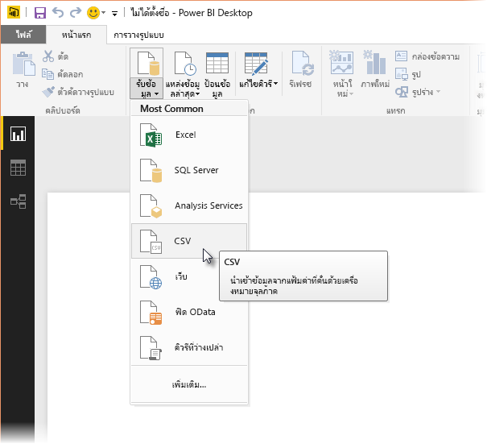
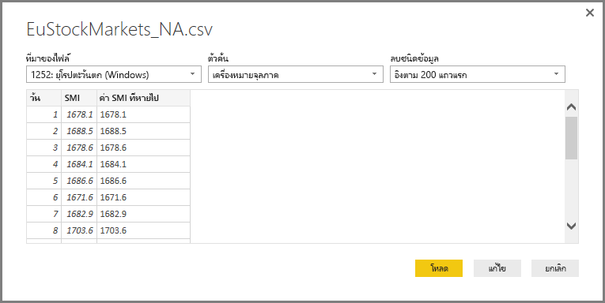
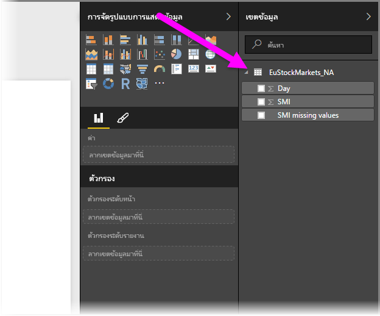
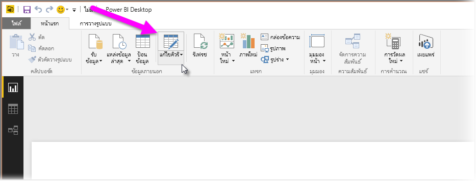
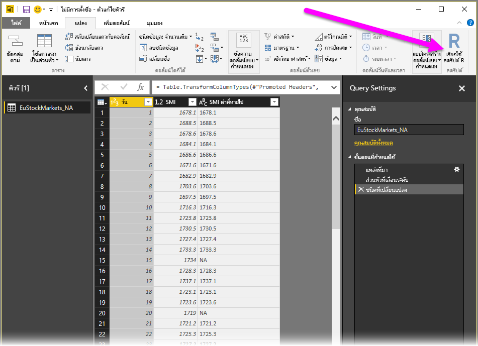
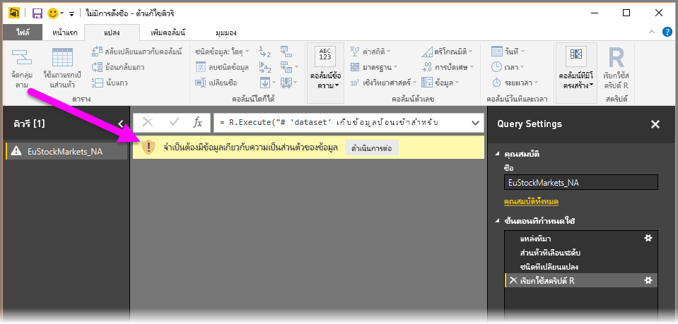
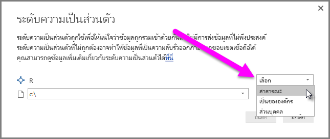
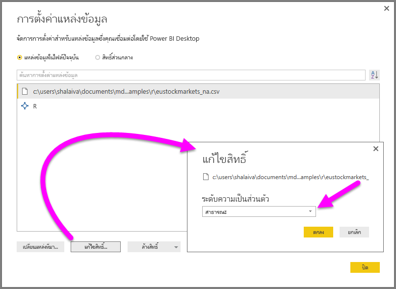

# <a name="use-r-in-query-editor"></a>ใช้ R ในตัวแก้ไขคิวรี

[**R**](https://mran.microsoft.com/documents/what-is-r)คือภาษาการเขียนโปรแกรมที่มีประสิทธิภาพที่นักสถิติ นักวิทยาศาสตร์ข้อมูล และนักวิเคราะห์ข้อมูลใช้งาน คุณสามารถใช้**R**ในตัวแก้ไขคิวรีของ **Power BI Desktop** เพื่อ:

* เตรียมแบบจำลองข้อมูล

* สร้างรายงาน

* ทำการล้างข้อมูล การปรับรูปแบบข้อมูลขั้นสูง และการวิเคราะห์ชุดข้อมูลซึ่งรวมถึงการขาดข้อมูลที่สมบูรณ์ การคาดการณ์ การทำคลัสเตอร์ และอื่น ๆ  

## <a name="install-r"></a>ติดตั้ง R

คุณสามารถดาวน์โหลด **R** ได้ฟรีจาก [หน้าดาวน์โหลด Revolution Open](https://mran.revolutionanalytics.com/download/) และ [CRAN Repository](https://cran.r-project.org/bin/windows/base/)

### <a name="install-mice"></a>ติดตั้ง mice

คุณจำเป็นต้องมีไลบรารี [**mice**](https://www.rdocumentation.org/packages/mice/versions/3.5.0/topics/mice) ที่ติดตั้งอยู่ในสภาพแวดล้อม R ของคุณ หากไม่มี **mice** รหัสสคริปต์ตัวอย่างจะทำงานไม่ถูกต้อง แพคเกจ **mice** ใช้วิธีการใดวิธีการหนึ่งในการจัดการกับข้อมูลที่ขาดหายไป

หากต้องการติดตั้ง **mice**:

1. เปิดใช้งานโปรแกรม R.exe (ตัวอย่างเช่น C:\Program Files\Microsoft\R Open\R-3.5.3\bin\R.exe)  

2. เรียกใช้คำสั่งติดตั้ง:

   ``` 
   >  install.packages('mice') 
   ```

## <a name="use-r-in-query-editor"></a>ใช้ R ในตัวแก้ไขคิวรี

เพื่อสาธิตการใช้ **R** ใน**ตัวแก้ไขคิวรี** เราจะใช้ตัวอย่างชุดข้อมูลตลาดหุ้นที่มีอยู่ในไฟล์ .csv และทำงานผ่านขั้นตอนต่อไปนี้:

1. [ดาวน์โหลดไฟล์ **EuStockMarkets_NA.csv**](http://download.microsoft.com/download/F/8/A/F8AA9DC9-8545-4AAE-9305-27AD1D01DC03/EuStockMarkets_NA.csv) จดจำตำแหน่งที่คุณบันทึกไว้

1. โหลดไฟล์ลงใน **Power BI Desktop**: จากริบบอน **หน้าแรก** เลือก **รับข้อมูล > Text/CSV**

   

1. เลือกไฟล์และจากนั้น**เปิด** ข้อมูล CSV จะแสดงในกล่องโต้ตอบ **ไฟล์ Text/CSV**

   

1. เมื่อโหลดข้อมูลแล้ว คุณจะเห็นข้อมูลในบานหน้าต่าง**เขตข้อมูล**

   

1. หากต้องการเปิด**ตัวแก้ไขคิวรี** จากริบบอน**หน้าแรก** เลือก**แก้ไขคิวรี**

   

1. ในริบบอน **แปลง** เลือก **เรียกใช้สคริปต์ R** ตัวแก้ไข **เรียกใช้สคริปต์ R**  จะแสดงขึ้นมา  

   แถว 15 และ 20 มีข้อมูลที่หายไปเช่นเดียวกับแถวอื่น ๆ ที่คุณไม่สามารถดูได้ในรูป ขั้นตอนด้านล่างแสดงวิธีที่ R สามารถใส่ข้อมูลในแถวเหล่านั้นให้สมบูรณ์

   

1. สำหรับตัวอย่างนี้ ใส่รหัสสคริปต์ต่อไปนี้: ตรวจสอบให้แน่ใจว่าได้แทนที่ '&lt;พาธไฟล์ของคุณ&gt;' ด้วยพาธไปยัง **EuStockMarkets_NA.csv** บนระบบไฟล์ภายในเครื่องของคุณ ตัวอย่างเช่น C:/Users/John Doe/Documents/Microsoft/EuStockMarkets_NA.csv

    ```r
       dataset <- read.csv(file="<Your File Path>/EuStockMarkets_NA.csv", header=TRUE, sep=",")
       library(mice)
       tempData <- mice(dataset,m=1,maxit=50,meth='pmm',seed=100)
       completedData <- complete(tempData,1)
       output <- dataset
       output$completedValues <- completedData$"SMI missing values"
    ```

7. หลังจากเลือก**ตกลง**, **ตัวแก้ไขคิวรี**จะแสดงคำเตือนเกี่ยวกับความเป็นส่วนตัวของข้อมูล

   
8. เพื่อให้สคริปต์ R ทำงานอย่างถูกต้องในบริการของ Power BI คุณจำเป็นต้องตั้งค่าแหล่งข้อมูลทั้งหมดเป็น**สาธารณะ** สำหรับข้อมูลเพิ่มเติมเกี่ยวกับการตั้งค่าความเป็นส่วนตัวและผลกระทบของการตั้งค่า ดู[ระดับความเป็นส่วนตัว](desktop-privacy-levels.md)

   

   หลังจากเลือก**บันทึก** สคริปต์จะเรียกใช้ โปรดสังเกตคอลัมน์ใหม่ในบานหน้าต่าง**เขตข้อมูล**ที่เรียกว่า **completedValues** โปรดสังเกตว่า มีองค์ประกอบข้อมูลบางอย่างหายไป เช่น ในแถวที่ 15 และ 18 โปรดดูที่วิธี R จัดการเรื่องเหล่านั้นที่ในหัวข้อถัดไป

   ด้วยสคริปต์ R เพียงห้าบรรทัด**ตัวแก้ไขคิวรี**จะกรอกค่าหายไปด้วยแบบจำลองการคาดการณ์

## <a name="create-visuals-from-r-script-data"></a>สร้างวิชวลจากข้อมูลสคริปต์ R

ในตอนนี้ เราสามารถสร้างภาพเพื่อดูวิธีที่ R สคริปต์ทำงานด้วยการใช้ไลบรารี **mice** เติมค่าที่หายไป ดังที่แสดงในรูปต่อไปนี้:


คุณสามารถบันทึกวิชวลที่สมบูรณ์ทั้งหมดในไฟล์ .pbix ของ **Power BI Desktop** ไฟล์เดียวและใช้แบบจำลองข้อมูล รวมถึงสคริปต์ R ในบริการของ Power BI

> [!NOTE]
> คุณสามารถ[ดาวน์โหลดไฟล์ .pbix ](http://download.microsoft.com/download/F/8/A/F8AA9DC9-8545-4AAE-9305-27AD1D01DC03/Complete%20Values%20with%20R%20in%20PQ.pbix)ด้วยขั้นตอนที่สมบูรณ์เหล่านี้

หลังจากที่คุณอัปโหลดไฟล์ .pbix ไปยังบริการของ Power BI แล้ว คุณจำเป็นต้องดำเนินการขั้นตอนเพิ่มเติมเพื่อเปิดใช้งานการรีเฟรชข้อมูลบริการและวิชวลที่อัปเดต:  

* **เปิดใช้งานรีเฟรชชุดข้อมูลตามกำหนดการ** - จะทำให้สคริปต์ R รีเฟรชสมุดงานที่ประกอบด้วยชุดข้อมูลของคุณตามกำหนดการ ดู[ตั้งค่าการรีเฟรชตามกำหนดการ](refresh-scheduled-refresh.md)ซึ่งยังรวมถึงข้อมูลเกี่ยวกับ**เกตเวย์ส่วนบุคคล**

* **ติดตั้งเกตเวย์ส่วนบุคคล**- คุณต้องมี**เกตเวย์ส่วนบุคคล**ที่ติดตั้งอยู่บนเครื่องที่มีไฟล์และ **R** อยู่ บริการของ Power BI เข้าถึงสมุดงานนั้นและแสดงวิชวลที่อัปเดตแล้วอีกครั้ง สำหรับข้อมูลเพิ่มเติม ดูที่[ติดตั้งและกำหนดค่าเกตเวย์ส่วนบุคคล](service-gateway-personal-mode.md)

## <a name="limitations"></a>ข้อจำกัด

มีข้อจำกัดบางอย่างของการคิวรีและสคริปต์ R ที่ถูกสร้างขึ้นใน**ตัวแก้ไขคิวรี**:

* การตั้งค่าแหล่งข้อมูล R ทั้งหมดต้องได้รับการตั้งค่าเป็น**สาธารณะ** ขั้นตอนอื่น ๆ ทั้งหมดในคิวรี**ตัวแก้ไขคิวรี**จะต้องเป็นแบบสาธารณะเช่นกัน เมื่อต้องการตั้งค่าแหล่งข้อมูล ใน **Power BI Desktop** เลือก**ไฟล์ > ตัวเลือกและการตั้งค่า > การตั้งค่าแหล่งข้อมูล**

  

  ในกล่องโต้ตอบ**การตั้งค่าแหล่งข้อมูล** เลือกแหล่งข้อมูลและจากนั้น**แก้ไขสิทธิ์ ...** .  ตั้งค่า**ระดับความเป็นส่วนตัว**เป็น**สาธารณะ**

      
* เมื่อต้องการรีเฟรชการแสดงผลด้วยวิชวล R หรือชุดข้อมูลของคุณตามกำหนดการ คุณจำเป็นต้องเปิดใช้งาน**รีเฟรชตามกำหนดการ**และมี**เกตเวย์ส่วนบุคคล**ติดตั้งบนคอมพิวเตอร์ที่ประกอบด้วยสมุดงานและ**R** สำหรับข้อมูลเพิ่มเติมในทั้งสองเรื่อง ดูหัวข้อก่อนหน้าในบทความนี้ ซึ่งมีลิงก์เพื่อเรียนรู้เพิ่มเติมเกี่ยวกับเรื่องนี้แต่ละเรื่อง

มีวิธีการต่างๆ ที่คุณสามารถทำได้ด้วย R และคิวรีแบบกำหนดเอง ดังนั้น คุณควรสำรวจและจัดรูปแบบข้อมูลของคุณอย่างที่คุณต้องการให้ปรากฏ

## <a name="next-steps"></a>ขั้นตอนถัดไป

* [บทนำเรื่อง R](https://mran.microsoft.com/documents/what-is-r) 

* [เรียกใช้สคริปต์ R ใน Power BI Desktop](desktop-r-scripts.md) 

* [ใช้ R IDE ภายนอกกับ Power BI](desktop-r-ide.md) 

* [แพคเกจ R ในบริการ Power BI](service-r-packages-support.md)
