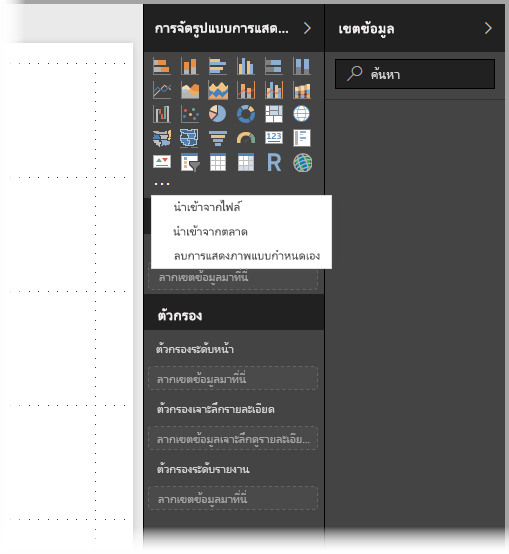
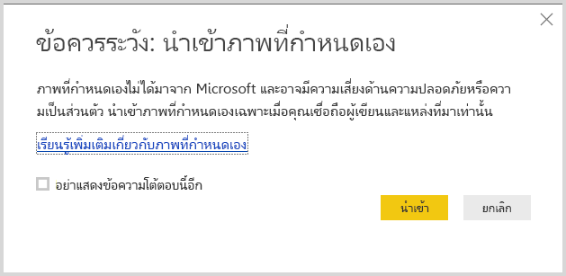
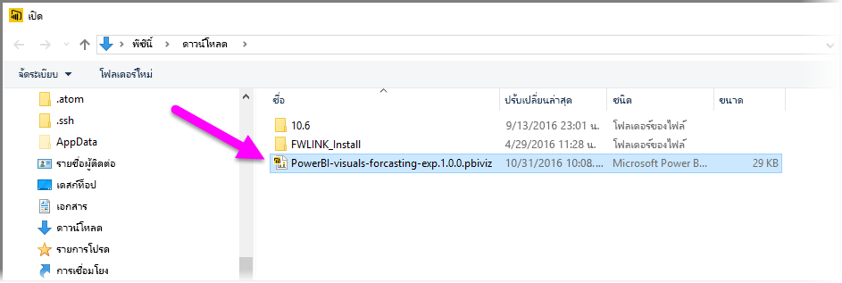
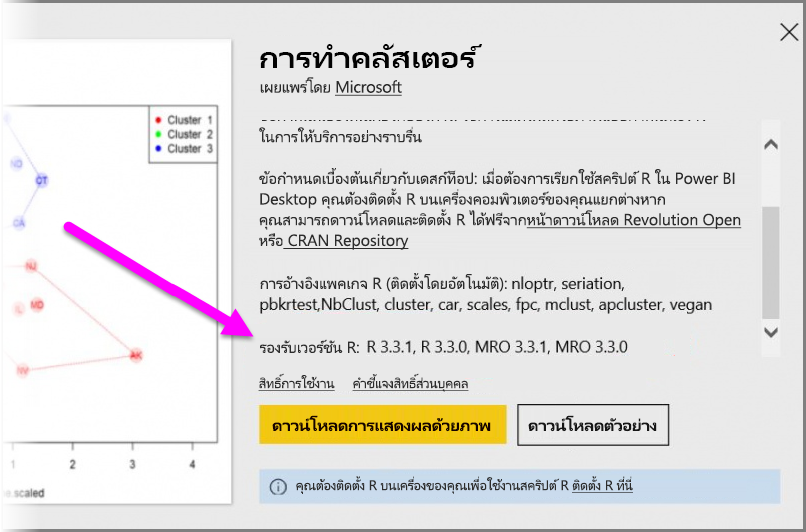

# ใช้ส่วนแสดงผล Power BI จาก R ใน Power BI

ใน **Power BI Desktop** และ **บริการของ Power BI** คุณสามารถใช้ส่วนการแสดงผล Power BI ที่ทำงานด้วย R โดยไม่มีความรู้ใด ๆ เกี่ยวกับ R และไม่ต้องเขียนสคริปต์ R ได้ ซึ่งช่วยให้คุณนำความสามารถการวิเคราะห์ และการแสดงผลของวิชวล R และสคริปต์ R มาใช้งาน โดยไม่ต้องการเรียนรู้ R หรือเขียนโปรแกรมเอง

เพื่อใช้ส่วนการแสดงผล Power BI ที่ทำงานด้วย R คุณเร่ิมจากการเลือกและดาวน์โหลดวิชวล R แบบกำหนดเอง ที่คุณสนใจจะใช้จากแกลเลอรี**ส่วนการแสดงผล Power BI** สำหรับ Power BI ใน [**AppSource**](https://appsource.microsoft.com/marketplace/apps?product=power-bi-visuals&page=1)

ส่วนต่อไปนี้อธิบายวิธีการเลือก โหลด และใช้วิชวล R ใน**Power BI Desktop**

## ใช้ส่วนการแสดงผล Power BI จาก R

เพื่อใช้สว่นการแสดงผล Power BI จาก R ดาวน์โหลดแต่ละวิชวลจากไลบรารี**ส่วนการแสดงผล Power BI** จากนั้นใช้วิชวลได้เช่นเดียวกับวิชวลชนิดอื่น ๆ ใน **Power BI Desktop** มีสองวิธีในการรับส่วนการแสดงผล Power BI: คุณสามารถดาวน์โหลดจากไซต์ออนไลน์ **AppSource** หรือเรียกดูและรับจากภายใน **Power BI Desktop** 

### รับส่วนการแสดงผล Power BI จาก AppSource

ต่อไปนี้คือขั้นตอนในการเรียกดู และเลือกวิชวลจากไซต์ออนไลน์ **AppSource**:

1. นำทางไปยังไลบรารีวิชวล Power BI ที่ [https://appsource.microsoft.com](https://appsource.microsoft.com/) เลือกกล่องกาเครื่องหมาย*แอป Power BI* ภายใต้*ปรับปรุงตามผลิตภัณฑ์* แล้วเลือกลิงก์**ดูทั้งหมด**

   

2. บนหน้าไลบรารี[วิชวล Power BI](https://appsource.microsoft.com/marketplace/apps?product=power-bi-visuals&page=1) เลือก**วิชวล Power BI** จากรายการของ add-in ในบานหน้าต่างด้านซ้าย

   

3. เลือก**วิชวล**ที่คุณสนใจใช้จากแกลเลอรี และคุณจะถูกนำไปยังเพจที่อธิบายวิชวล เลือกปุ่ม**รับทันที**เพื่อดาวน์โหลด

   > [!NOTE]
    > สำหรับการเขียนรายงานใน **Power BI Desktop** คุณจำเป็นต้องมี R ติดตั้งอยู่บนเครื่องคอมพิวเตอร์ของคุณ แต่เมื่อผู้ใช้ต้องการดูวิชวลที่ทำงานด้วย R ใน**บริการของ Power BI** ไม่ต้องติดตั้ง R ภายในเครื่อง

   

   คุณไม่จำเป็นต้องติดตั้ง R เพื่อใช้ส่วนการแสดงผล Power BI จาก R ใน**บริการของ Power BI** แต่ถ้าคุณต้องการใช้ส่วนการแสดงผล Power BI จาก R ใน **Power BI Desktop** คุณ*ต้อง*ติดตั้ง R บนเครื่อง คุณสามารถดาวน์โหลด R จากที่ต่อไปนี้:

   * [CRAN](https://cran.r-project.org/)
   * [MRO](https://mran.microsoft.com/)

4. เมื่อวิชวลถูกดาวน์โหลดแล้ว (ซึ่งจะเหมือนกับการดาวน์โหลดไฟล์ใด ๆ จากเบราว์เซอร์ของคุณ) ไปที่ **Power BI Desktop** และคลิกที่จุดไข่ปลา (...) ในบานหน้าต่าง**การจัดรูปแบบการแสดงข้อมูล** แล้วเลือก**นำเข้าจากไฟล์**

   
5. คุณได้รับคำเตือนเกี่ยวกับการนำเข้าวิชวลที่กำหนดเองดังแสดงในรูปต่อไปนี้:

   
6. ไปยังตำแหน่งที่บันทึกไฟล์วิชวล จากนั้นเลือกไฟล์ ไฟล์การแสดงภาพแบบกำหนดเองของ **Power BI Desktop** มีนามสกุล .pbiviz

   
7. เมื่อคุณกลับไปยัง Power BI Desktop คุณสามารถเห็นวิชวลชนิดใหม่ในบานหน้าต่าง**การจัดรูปแบบการแสดงข้อมูล**ได้

   
8. เมื่อคุณนำเข้าวิชวลใหม่ (หรือเปิดรายงานที่มีวิชวลแบบกำหนดเองที่ทำงานบน R) **Power BI Desktop** จะติดตั้งแพคเกจ R ที่จำเป็น

   

9. จากนั้น คุณสามารถเพิ่มข้อมูลลงในวิชวลเหมือนกับที่คุณทำกับวิชวลอื่น ๆ ใน **Power BI Desktop** ได้ เมื่อทำเสร็จ คุณสามารถดูวิชวลที่เสร็จแล้วของคุณบนพื้นที่ทำงาน ในวิชวลต่อไปนี้ ใช้วิชวล**การคาดการณ์**ที่ทำงานด้วย R กับการประมาณอัตราการเกิดของ สหประชาชาติ (UN) (วิชวลทางด้านซ้าย)

    

    เหมือนกับวิชวลอื่น ๆ ใน **Power BI Desktop** คุณสามารถเผยแพร่รายงานนี้ ที่มีวิชวล R ไปยัง**บริการของ Power BI** และแชร์ให้กับผู้อื่นได้

    ตรวจสอบไลบรารีบ่อย ๆ เพราะมีวิชวลใหม่ ๆ เพิ่มเข้ามาตลอดเวลา

### รับส่วนการแสดงผล Power BI จากใน **Power BI Desktop**

1. นอกจากนี้คุณยังสามารถใช้ส่วนการแสดงผล Power BI จากใน **Power BI Desktop** ใน **Power BI Desktop** คลิกที่จุดไข่ปลา (...) ในบานหน้าต่าง**การจัดรูปแบบการแสดงข้อมูล** แล้วเลือก**นำเข้าจาก marketplace**

   

2. เมื่อเลือกแล้ว กล่องโต้ตอบ**วิชวล BI Power** จะปรากฏขึ้น ให้คุณสามารถเลื่อนดูส่วนการแสดงผล Power BI ที่มีให้ใช้งาน และเลือกวิชวลที่คุณต้องการ คุณสามารถค้นหาตามชื่อ เลือกประเภท หรือเพียงเลื่อนผ่านวิชวลที่มี เมื่อคุณพร้อมแล้ว เลือก**เพิ่ม**เพื่อเพิ่มวิชวลแบบกำหนดเองไปยัง **Power BI Desktop**

   

## จัดส่วนการแสดงผล Power BI ผ่าน R

ถ้าคุณสร้างวิชวล R ของคุณเองสำหรับการใช้ในรายงานของคุณ คุณสามารถแชร์วิชวลเหล่านั้นให้กับทุกคน โดยการแจกจ่ายวิชวลแบบกำหนดเองของคุณไปยัง**แกลเลอรีส่วนการแสดงผล Power BI** การบริจาคทำผ่าน GitHub และขั้นตอนมีการระบุเค้าโครงที่ตำแหน่งต่อไปนี้:

* [บริจาคให้แกลเลอส่วนการแสดงผล Power BI ผ่าน R](https://github.com/Microsoft/PowerBI-visuals#building-r-powered-custom-visual-corrplot)

## แก้ไขปัญหาส่วนการจัดแสดง Power BI ผ่าน R

ส่วนการจัดแสดง Power BI จาก R ที่ทำงานด้วย R มีการพึ่งพาบางโปรแกรม เพื่อให้วิชวลทำงานได้อย่างถูกต้อง เมื่อส่วนการจัดแสดง Power BI จาก R ไม่ทำงาน หรือโหลดไม่ถูกต้อง มักเกิดจากปัญหาใดปัญหาหนึ่งต่อไปนี้:

* โปรแกรม R ขาดหายไป
* ข้อผิดพลาดในสคริปต์ R ที่วิชวลใช้
* แพคเกจ R จะสูญหาย หรือล้าสมัย

ส่วนต่อไปนี้อธิบายขั้นตอนการแก้ไขปัญหา ที่คุณสามารถใช้เพื่อช่วยแก้ปัญหาที่คุณอาจพบ

### แพคเกจ R หายไป หรือล้าสมัย

เมื่อพยายามติดตั้งวิชวลแบบกำหนดเองที่ทำงานบน R คุณอาจเจอข้อผิดพลาดเมื่อแพคเกจ R มีการสูญหาย หรือล้าสมัย ซึ่งมักเกิดจากหนึ่งในเหตุผลต่อไปนี้:

* การติดตั้ง R ไม่เข้ากันกับแพคเกจ R
* ไฟร์วอลล์, ซอฟต์แวร์ป้องกันไวรัส หรือการตั้งค่าพร็อกซี ป้องกันไม่ให้ R เชื่อมต่อกับอินเทอร์เน็ต
* การเชื่อมต่ออินเทอร์เน็ตช้า หรือมีปัญหาการเชื่อมต่ออินเทอร์เน็ต

ทีม Power BI กำลังทำงานเพื่อลดปัญหาเหล่านี้ก่อนที่จะไปถึงคุณ และรุ่นถัดไปของ Power BI Desktop จะรวมการปรับปรุงเพื่อแก้ปัญหาเหล่านี้ จนกว่าจะถึงตอนนั้น คุณสามารถใช้หนึ่งหรือหลายขั้นตอนต่อไปนี้ เพื่อแก้ไขปัญหา:

1. ลบวิชวลแบบกำหนดเอง แล้วติดตั้งอีกครั้ง ซึ่งจะเริ่มต้นการติดตั้งแพคเกจ R ใหม่
2. ถ้าการติดตั้ง R ของคุณไม่เป็นปัจจุบัน อัปเกรดการติดตั้ง R ของคุณ จากนั้นเอาออกและติดตั้งวิชวลแบบกำหนดเองใหม่ ตามที่อธิบายไว้ในขั้นตอนก่อนหน้า

   เวอร์ชัน R ที่ได้รับการสนับสนุน จะแสดงอยู่ในคำอธิบายของแต่ละวิชวล R แบบกำหนดเอง ดังแสดงในรูปต่อไปนี้

     
    > [!NOTE]
    > คุณสามารถเก็บการติดตั้ง R เดิม และเชื่อมโยง Power BI Desktop เข้ากับเวอร์ชันปัจจุบันที่คุณติดตั้งได้ ไปยัง**ไฟล์ > ตัวเลือกและการตั้งค่า > ตัวเลือก > การเขียนสคริปต์ R**

3. ติดตั้งแพคเกจ R ด้วยตนเอง โดยใช้คอนโซล R ใด ๆ มีขั้นตอนดังนี้:

   a.  ดาวน์โหลดสคริปต์การติดตั้งวิชวล R และบันทึกไฟล์ดังกล่าวลงในไดรฟ์ภายในเครื่อง

   b.  จากคอนโซล R เรียกใช้คำสั่งต่อไปนี้:

       source(“C:/Users/david/Downloads/ScriptInstallPackagesForForecastWithWorkarounds.R”)

   ตำแหน่งที่ติดตั้งตามค่าเริ่มต้น โดยทั่วไปมีดังนี้:

       c:\Program Files\R\R-3.3.x\bin\x64\Rterm.exe (for CRAN-R)
       c:\Program Files\R\R-3.3.x\bin\x64\Rgui.exe (for CRAN-R)
       c:\Program Files\R\R-3.3.x\bin\R.exe (for CRAN-R)
       c:\Program Files\Microsoft\MRO-3.3.x\bin\R.exe (for MRO)
       c:\Program Files\Microsoft\MRO-3.3.x\bin\x64\Rgui.exe (for MRO)
       c:\Program Files\RStudio\bin\rstudio.exe (for RStudio)
4. ถ้าขั้นตอนก่อนหน้านี้ไม่ได้ผล ลองต่อไปนี้:

   a. ใช้ **R Studio** และทำตามขั้นตอนที่ระบุไว้ในข้อ 3.b ด้านบน (เรียกใช้บรรทัดสคริปต์จากคอนโซล R)

   b. ถ้าขั้นตอนก่อนหน้าไม่ได้ผล เปลี่ยน**เครื่องมือ > ตัวเลือกส่วนกลาง > แพคเกจ**ใน **R Studio** และเปิดใช้งานกล่องกาเครื่องหมายสำหรับ**ใช้ Internet Explorer ไลบรารี/พร็อกซีสำหรับ HTTP** แล้วทำซ้ำขั้นตอนที่ 3.b จากขั้นตอนข้างต้น

## ขั้นตอนถัดไป

ดูข้อมูลเพิ่มเติมเกี่ยวกับ R ใน Power BI ได้ในบทความต่อไปนี้

* [แกลเลอรี Power BI ส่วนการจัดแสดง Power BI](https://app.powerbi.com/visuals/)
* [การเรียกใช้สคริปต์ R ใน Power BI Desktop](desktop-r-scripts.md)
* [สร้างวิชวล R ใน Power BI Desktop](desktop-r-visuals.md)
* [ใช้ R IDE ภายนอกกับ Power BI](desktop-r-ide.md)
