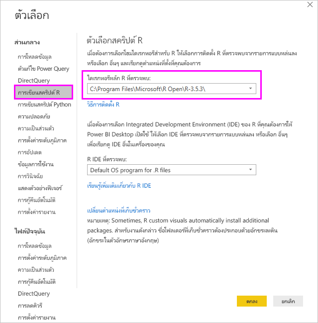
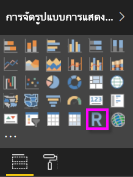
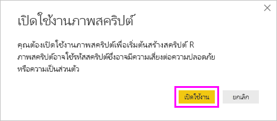
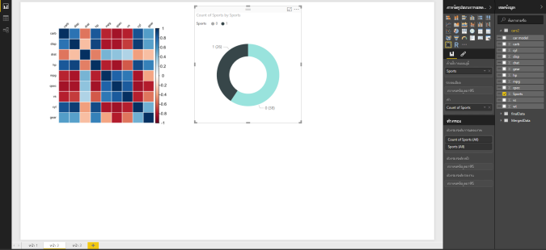
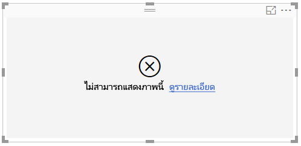

# <a name="create-power-bi-visuals-using-r"></a>สร้างภาพของ Power BI โดยใช้ R
ด้วย Power BI Desktop คุณสามารถใช้กลไก *R* เพื่อแสดงภาพข้อมูลของคุณได้ [R](https://mran.revolutionanalytics.com/documents/what-is-r) คือภาษาและสภาพแวดล้อมสำหรับการประมวลผลเชิงสถิติและกราฟิก

## <a name="install-r"></a>ติดตั้ง R
ตามค่าเริ่มต้น Power BI Desktop ไม่มีการปรับใช้หรือติดตั้งกลไกจัดการ R เมื่อต้องการเรียกใช้สคริปต์ R ใน Power BI Desktop คุณต้องติดตั้ง R บนเครื่องคอมพิวเตอร์ของคุณแยกต่างหาก คุณสามารถดาวน์โหลดและติดตั้ง R ได้ฟรีจากตำแหน่งที่ตั้งต่าง ๆ ซึ่งรวมถึง [หน้าดาวน์โหลด Revolution Open](https://mran.revolutionanalytics.com/download/) และ [CRAN Repository](https://cran.r-project.org/bin/windows/base/) รุ่นปัจจุบันของการเขียนสคริปต์ R ใน Power BI Desktop สนับสนุนตัวอักษร Unicode ตลอดจนช่องว่าง (ตัวอักษรว่างเปล่า) ในเส้นทางการติดตั้ง

## <a name="enable-r-visuals-in-power-bi-desktop"></a>เปิดใช้งานวิชวล R ใน Power BI Desktop
หลังจากที่คุณติดตั้ง R แล้ว Power BI Desktop จะเปิดใช้งานโดยอัตโนมัติ เมื่อต้องการตรวจสอบว่า Power BI Desktop ได้เปิดใช้งาน R ในตำแหน่งที่ตั้งที่ถูกต้องหรือไม่ ให้ทำตามขั้นตอนเหล่านี้: 

1. จากเมนู Power BI Desktop ให้เลือก**ไฟล์** > **ตัวเลือกและการตั้งค่า** > **ตัวเลือก** 

2. ทางด้านซ้ายของหน้า**ตัวเลือก**ภายใต้**ส่วนกลาง** ให้เลือก**การเขียนสคริปต์ R** 

3. ภายใต้**ตัวเลือกสคริปต์ R** ให้ตรวจสอบว่ามีการระบุการติดตั้ง R ภายในเครื่องของคุณใน**โฮมไดเรกทอรี R ที่ตรวจพบ** และสะท้อนให้เห็นถึงการติดตั้ง R ที่เหมาะสมภายในเครื่องที่คุณต้องการให้ Power BI Desktop ใช้ ในรูปต่อไปนี้ เส้นทางไปยังการติดตั้ง R ภายในเครื่องคือ **C:\Program Files\R Open\R-3.5.3\\**
   
   

หลังจากที่คุณได้ตรวจสอบการติดตั้ง R แล้ว คุณก็พร้อมที่จะเริ่มสร้างวิชวล R

## <a name="create-r-visuals-in-power-bi-desktop"></a>สร้างวิชวล R ใน Power BI Desktop
1. เลือกไอคอน**วิชวล R**ในบานหน้าต่าง**การแสดงภาพ**เพื่อเพิ่มวิชวล R
   
   

2. ในหน้าต่าง**เปิดใช้งานวิชวลสคริปต์** ที่ปรากฏขึ้น เลือก **เปิดใช้งาน**

   

   เมื่อคุณเพิ่มวิชวล R ไปยังรายงาน Power BI Desktop จะมีการเปลี่ยนแปลงดังต่อไปนี้:
   
   - รูปวิชวล R ของพื้นที่ที่สำรองไว้ปรากฏบนพื้นที่รายงาน
   
   - **ตัวแก้ไขสคริปต์ R**ปรากฏขึ้นทางด้านล่างของบานหน้าต่างกลาง
   
   

3. ในส่วน**ค่า** ของบานหน้าต่าง**การแสดงภาพ** ให้ลากเขตข้อมูลจากบานหน้าต่าง**เขตข้อมูล**ที่คุณต้องการใช้ในสคริปต์ R ของคุณ เช่นเดียวกับที่คุณทำกับวิชวล Power BI Desktop อื่นๆ อีกวิธีหนึ่งคือคุณยังสามารถเลือกเขตข้อมูลได้โดยตรงในบานหน้าต่าง**เขตข้อมูล**
    
    เฉพาะเขตข้อมูลที่คุณเพิ่มลงในส่วน**ค่า**เท่านั้นที่พร้อมใช้งานสำหรับสคริปต์ R ของคุณ คุณสามารถเพิ่มเขตข้อมูลใหม่ หรือเอาเขตข้อมูลที่ไม่ต้องการออกจากส่วน**เขตข้อมูล** ขณะที่ทำงานบนสคริปต์ R ของคุณใน**ตัวแก้ไขสคริปต์ R** Power BI Desktop จะตรวจจับเขตข้อมูลที่คุณได้เพิ่มหรือเอาออกโดยอัตโนมัติ
   
   > [!NOTE]
   > ชนิดการรวมเริ่มต้นสำหรับวิชวล R คือ*ไม่ต้องทำการสรุป*
   > 
   > 
   
4. ขณะนี้คุณสามารถใช้ข้อมูลที่คุณเลือกเพื่อสร้างการลงจุด: 

    - เมื่อคุณเลือกเขตข้อมูล **ตัวแก้ไขสคริปต์ R**จะสร้างโค้ดการผูกสคริปต์ R สนับสนุนสำหรับเขตข้อมูลเหล่านั้นในส่วนสีเทาตามแนวด้านบนของบานหน้าต่างตัวแก้ไข
    - ถ้าคุณลบเขตข้อมูล **ตัวแก้ไขสคริปต์ R** จะลบรหัสการสนับสนุนสำหรับเขตข้อมูลนั้นโดยอัตโนมัติ
   
   ในตัวอย่างที่แสดงในรูปต่อไปนี้ มีการเลือกเขตข้อมูลสามเขตได้แก่: hp gear และ drat จากการเลือกดังกล่าว ตัวแก้ไขสคริปต์ R จะสร้างโค้ดการผูก ซึ่งสรุปได้ดังนี้:
   
   * สร้าง dataframe ที่เรียกว่า**ชุดข้อมูล** ซึ่งประกอบด้วยเขตข้อมูลอื่นที่ผู้ใช้เลือก
   * การรวมเริ่มต้นคือ*ไม่สรุป*
   * คล้ายกับวิชวลตาราง เขตข้อมูลจะถูกจัดกลุ่ม และทำซ้ำแถวที่ปรากฏเพียงครั้งเดียว
   
   
   
   > [!TIP]
   > ในบางกรณี คุณอาจไม่ต้องการให้จัดกลุ่มโดยอัตโนมัติ หรือคุณอาจต้องการให้แถวทั้งหมดปรากฏ รวมถึงรายการที่ซ้ำกัน ในกรณีดังกล่าว ให้เพิ่มเขตข้อมูลดัชนีลงในชุดข้อมูลของคุณ ซึ่งทำให้ทุกแถวถือว่าไม่ซ้ำกันและป้องกันการจัดกลุ่ม
   > 
   > 
   
   Dataframe ที่สร้างขึ้นเรียกว่า**ชุดข้อมูล** และคุณสามารถเข้าถึงเลือกคอลัมน์ที่เลือกไว้จากชื่อที่เกี่ยวข้อง ตัวอย่างเช่น เขตข้อมูล gear สามารถเข้าถึงได้โดยการเพิ่ม*dataset$gear* ในสคริปต์ R ของคุณ สำหรับเขตข้อมูลที่มีช่องว่างหรืออักขระพิเศษ ให้ใช้เครื่องหมายอัญประกาศเดี่ยว

5. ด้วย Dataframe ที่สร้างขึ้นอัตโนมัติโดยเขตข้อมูลที่คุณเลือก คุณก็พร้อมที่จะเขียนสคริปต์ R ที่ Power BI Desktop จะลงจุดไปยังอุปกรณ์เริ่มต้นของ R หลังจากที่คุณดำเนินการสคริปต์เสร็จสมบูรณ์แล้ว ให้เลือก **เรียกใช้สคริปต์** ทางด้านขวาของแถบชื่อของ**ตัวแก้ไขสคริปต์ R**
   
    เมื่อคุณเลือก**เรียกใช้สคริปต์** Power BI Desktop จะแยกแยะการลงจุดนี้และแสดงบนพื้นที่ทำงาน เนื่องจากกระบวนการจะทำบนการติดตั้ง R ภายในเครื่องของคุณ ตรวจสอบให้แน่ใจว่ามีการติดตั้งแพคเกจที่จำเป็นแล้ว
   
   Power BI Desktop จะลงจุดวิชวลซ้ำอีกครั้งเมื่อเหตุการณ์ใด ๆ ต่อไปนี้เกิดขึ้น:
   
   * เมื่อคุณเลือก**เรียกใช้สคริปต์** จากแถบชื่อเรื่อง**ตัวแก้ไขสคริปต์ R**
   * เมื่อใดก็ตามที่เกิดการเปลี่ยนแปลงข้อมูล เนื่องจากการรีเฟรชข้อมูล การกรอง หรือการไฮไลท์

     รูปต่อไปนี้แสดงตัวอย่างโค้ดการลงจุดสหสัมพันธ์ ซึ่งลงจุดสหสัมพันธ์ระหว่างแอตทริบิวต์ของรถยนต์ชนิดต่าง ๆ

     

6. เพื่อให้ได้มุมมองของการแสดงภาพที่มีขนาดใหญ่ขึ้น คุณสามารถย่อ**ตัวแก้ไขสคริปต์ R**ได้ เช่นเดียวกับวิชวลอื่น ๆ ใน Power BI Desktopคุณสามารถกรองข้ามการลงจุดสหสัมพันธ์ โดยเลือกส่วนที่เฉพาะเจาะจง (เช่น รถสปอร์ต) ในวิชวลรูปโดนัท (วิชวลกลมทางด้านขวา)

    

7. ปรับเปลี่ยนสคริปต์ R เพื่อกำหนดวิชวลด้วยตนเอง และใช้ประโยชน์จากพลังของ R โดยการเพิ่มพารามิเตอร์ไปยังคำสั่งการลงจุด

    คำสั่งการลงจุดเดิมมีดังต่อไปนี้:

    ```
    corrplot(M, method = "color",  tl.cex=0.6, tl.srt = 45, tl.col = "black")
    ```

    เปลี่ยนสคริปต์ R เพื่อให้คำสั่งการลงจุดเป็นดังนี้:

    ```
    corrplot(M, method = "circle", tl.cex=0.6, tl.srt = 45, tl.col = "black", type= "upper", order="hclust")
    ```

    เป็นผลให้ขณะนี้วิชวล R ลงจุดวงกลม พิจารณาเพียงส่วนครึ่งบน และจัดลำดับเมทริกซ์ไปยังแอตทริบิวต์ที่สัมพันธ์กับคลัสเตอร์

    

    เมื่อคุณเรียกใช้สคริปต์ R ที่ส่งผลให้เกิดข้อผิดพลาด ข้อความแสดงข้อผิดพลาดจะแสดงบนพื้นที่ทำงานแทนที่จะเป็นการลงจุดของวิชวล R สำหรับรายละเอียดเกี่ยวกับข้อผิดพลาด เลือก**ดูรายละเอียด**จากข้อผิดพลาดของวิชวล R

    

## <a name="r-scripts-security"></a>การรักษาความปลอดภัยสคริปต์ R 
วิชวล R ถูกสร้างขึ้นจากสคริปต์ R ซึ่งประกอบด้วยโค้ดที่มีความเสี่ยงต่อความปลอดภัยหรือความเป็นส่วนตัว เมื่อพยายามที่จะดูหรือโต้ตอบกับวิชวล R เป็นครั้งแรก ผู้ใช้จะได้รับข้อความเตือนเรื่องความปลอดภัย เปิดใช้งานวิชวล R ถ้าคุณเชื่อถือผู้เขียนและแหล่งที่มาเท่านั้น หรือหลังจากที่คุณตรวจทานและทำความเข้าใจสคริปต์ R


## <a name="known-limitations"></a>ข้อจำกัดที่ทราบ
วิชวล R ใน Power BI Desktop มีข้อจำกัดดังต่อไปนี้:

* ขนาดข้อมูล: ข้อมูลที่ใช้โดยวิชวล R สำหรับการลงจุดจะถูกจำกัดไว้ที่ 150,000 แถว ถ้าเลือกมากกว่า 150,000 แถว จะมีการใช้งานเฉพาะ 150,000 แถวบนสุด และข้อความจะแสดงบนรูปภาพ

* ความละเอียด: วิชวล R ทั้งหมดจะแสดงที่ 72 DPI

* เวลาการคำนวณ: ถ้าการคำนวณวิชวล R เกินห้านาที จะทำให้เกิดข้อผิดพลาดเนื่องจากหมดเวลา

* ความสัมพันธ์: เช่นเดียวกับวิชวลอื่น ๆ ของ Power BI Desktop ถ้ามีการเลือกเขตข้อมูลจากตารางต่าง ๆ โดยไม่มีความสัมพันธ์ที่กำหนดระหว่างกัน จะเกิดข้อผิดพลาดขึ้น

* การรีเฟรช: ภาพ R ได้รับการรีเฟรชเมื่อมีการปรับปรุงข้อมูล การกรอง และการทำไฮไลท์ อย่างไรก็ตาม รูปภาพนั้นไม่ได้มีการโต้ตอบและไม่สามารถแหล่งที่มาของการกรองข้ามได้

* การไฮไลท์: วิชวล R จะตอบสนองต่อการทำไฮไลท์วิชวลอื่น ๆ แต่คุณไม่สามารถเลือกองค์ประกอบในวิชวล R เพื่อกรองข้ามองค์ประกอบอื่น ๆ ได้

* อุปกรณ์แสดงผล: เฉพาะการลงจุดที่ถูกลงจุดไปยังอุปกรณ์แสดงผลเริ่มต้น R เท่านั้นจะแสดงผลอย่างถูกต้องบนพื้นที่ทำงาน หลีกเลี่ยงการใช้อุปกรณ์แสดงผล R ที่แตกต่างกันอย่างชัดเจน

* การติดตั้ง RRO: ในรีลีสนี้ Power Power Desktop รุ่น 32 บิตไม่ได้ระบุการติดตั้ง RRO โดยอัตโนมัติ คุณต้องระบุเส้นทางไปยังไดเรกทอรีการติดตั้ง R ด้วยตนเองใน**ตัวเลือกและการตั้งค่า** > **ตัวเลือก** > **การเขียนสคริปต์ R**

## <a name="next-steps"></a>ขั้นตอนถัดไป
สำหรับข้อมูลเพิ่มเติมเกี่ยวกับ R ใน Power BI ให้ดูบทความต่อไปนี้:

* [การเรียกใช้สคริปต์ R ใน Power BI Desktop](desktop-r-scripts.md)
* [ใช้ R IDE ภายนอกกับ Power BI](desktop-r-ide.md)

