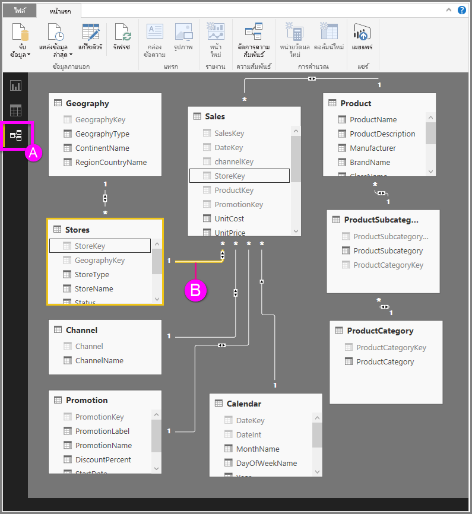

# มุมมองความสัมพันธ์ใน Power BI Desktop
**มุมมองความสัมพันธ์** แสดงตาราง คอลัมน์ และความสัมพันธ์ทั้งหมดในรูปแบบข้อมูลของคุณ ซึ่งจะเป็นประโยชน์โดยเฉพาะเมื่อรูปแบบของคุณมีความสัมพันธ์ระหว่างตารางต่าง ๆ ที่ซับซ้อน

เรามาดูกัน

**A.**  ไอคอนมุมมองของความสัมพันธ์ – คลิกเพื่อแสดงรูปแบบของคุณในมุมมองความสัมพันธ์

**B.** ความสัมพันธ์ – คุณสามารถวางเมาส์เคอร์เซอร์ของคุณเหนือความสัมพันธ์เพื่อแสดงคอลัมน์ที่ใช้ ดับเบิลคลิกที่ความสัมพันธ์เพื่อเปิดในกล่องโต้ตอบ**แก้ไขความสัมพันธ์** 

ในรูปด้านบน คุณสามารถเห็นว่าตาราง*ร้านค้า* มีคอลัมน์ *StoreKey* ที่เกี่ยวข้องกับตาราง*ยอดขาย* ซึ่งมีคอลัมน์ *StoreKey* เช่นเดียวกัน เราเห็นว่าเป็นความสัมพันธ์แบบ *กลุ่มต่อหนึ่ง* (\*: 1) และไอคอนตรงกลางของบรรทัดแสดงทิศทางตัวกรองข้ามเป็น*ทั้งคู่* ลูกศรบนไอคอนแสดงทิศทางการไหลของตัวกรองบริบท

เมื่อต้องการเรียนรู้เพิ่มเติมเกี่ยวกับความสัมพันธ์ ดู[สร้าง และจัดการความสัมพันธ์ใน Power BI Desktop](desktop-create-and-manage-relationships.md)

