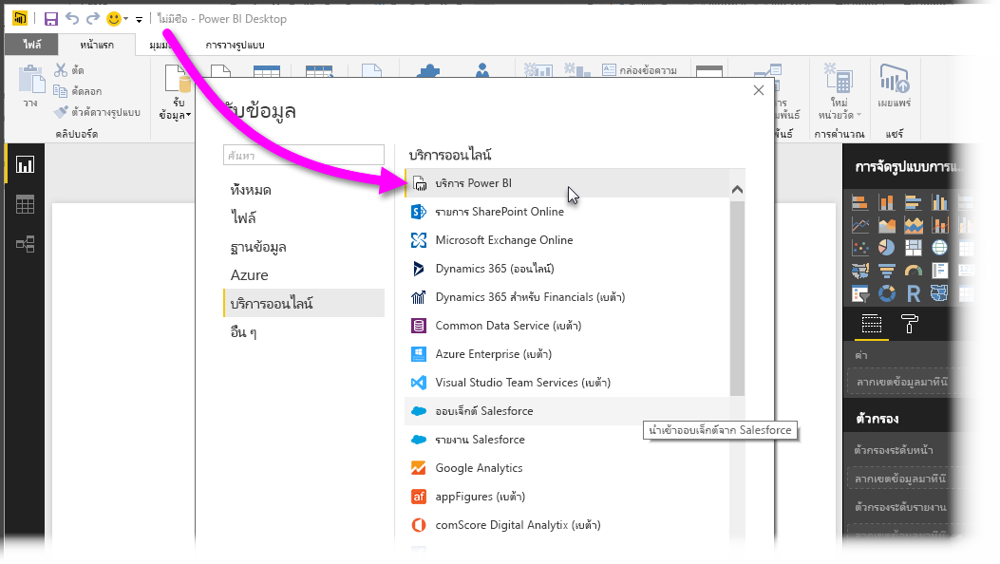
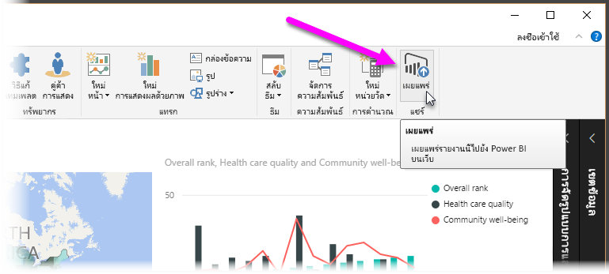
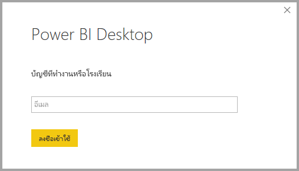
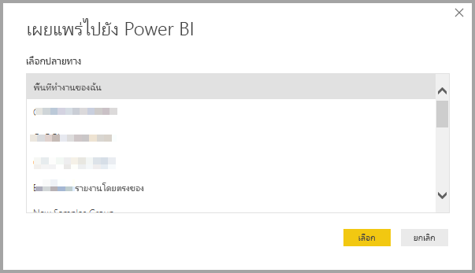
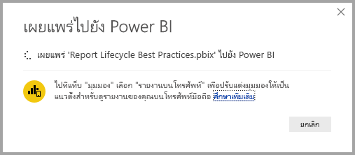
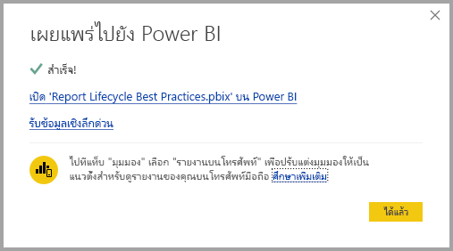
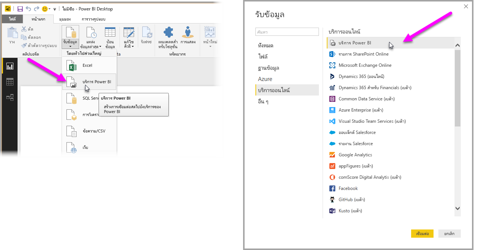
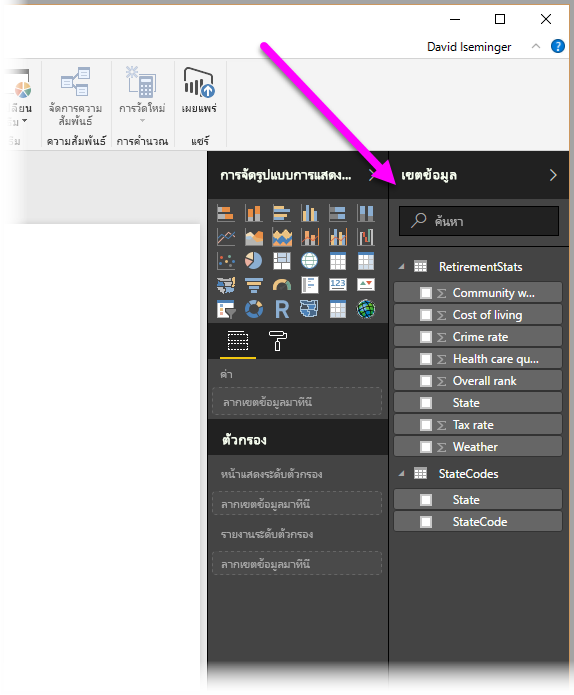

# เชื่อมต่อกับชุดข้อมูลในบริการ Power BI จาก Power BI Desktop
คุณสามารถสร้างการเชื่อมต่อสดไปยังชุดข้อมูลที่ใช้ร่วมกันในบริการ Power BI และสร้างรายงานที่แตกต่างกันมากมายจากชุดข้อมูลเดียวกัน ซึ่งหมายความว่า คุณสามารถสร้างโมเดลข้อมูลที่สมบูรณ์แบบที่สุดของคุณใน Power BI Desktop และเผยแพร่ไปยังบริการ Power BI จากนั้นคุณ และผู้อื่นสามารถสร้างรายงานที่แตกต่างกันหลายรายการ (ในไฟล์.pbix ที่แยกต่างหาก) จากโมเดลข้อมูลเดียวกันที่ใช้ทั่วไป คุณลักษณะนี้เรียกว่า**Power BI service Live connection**

ประโยชน์ของคุณลักษณะนี้มีมากมายหลายประการ รวมถึงการนำมาใช้ที่ดีที่สุดซึ่งเราจะอภิปรายกันในบทความนี้ อีกทั้งยังมีข้อควรพิจารณาและขีดจำกัด ดังนั้นโปรดตรวจให้แน่ใจว่าคุณได้อ่านข้อมูลที่มีในตอนท้ายของบทความนี้

## การใช้ Power BI service Live connection เพื่อการจัดการวงจรชีวิตรายงาน
ความท้าทายอย่างหนึ่งในความเป็นที่นิยมของ Power BI คือ การเพิ่มจำนวนรายงาน แดชบอร์ด และโมเดลข้อมูลพื้นฐาน นี่คือเหตุผล: การสร้างรายงานที่น่าสนใจใน**Power BI Desktop**จากนั้นแชร์ ([เผยแพร่](desktop-upload-desktop-files.md)) รายงานเหล่านั้นใน**บริการ Power BI**และการสร้างแดชบอร์ดที่ยอดเยี่ยมจากชุดข้อมูลเหล่านั้นเป็นเรื่องที่ทำได้ง่าย เนื่องจากผู้คนมากมายมักจะใชชุดข้อมูลเดียวกัน (หรือเกือบเหมือนกัน) การตระหนักว่ารายงานชิ้นไหนอยู่ในชุดข้อมูลใด และชุดข้อมูลแต่ละชุดนั้นเป็นข้อมูลใหม่ขนาดไหนกลายเป็นเรื่องที่ท้าทาย **Power BI service Live connection**กล่าวถึงความท้าทายนั้น และทำการสร้าง แชร์ และขยายตามรายงานชุดข้อมูลทั่วไปและแดชบอร์ดได้ง่ายขึ้น และมีความคงเส้นคงวา

### สร้างชุดข้อมูลที่ทุกคนสามารถใช้และแชร์ต่อได้
สมมติว่า แอนนา (นักวิเคราะห์ธุรกิจ) อยู่ในทีมของคุณ และเธอสร้างโมเดลข้อมูลที่ดีได้ยอดเยี่ยมมาก (มักเรียกว่า ชุดข้อมูล) แอนนาสามารถสร้างชุดข้อมูลและรายงาน และแชร์รายงานนั้นในการ**บริการ Power BI**ได้ด้วยความเชี่ยวชาญของเธอ

ทุกคนชอบรายงานและชุดข้อมูลของเธอ และตรงนี้เป็นจุดเริ่มต้นของปัญหา เพราะทุกคนในทีมของเธอจะพยายามสร้าง*ชุดข้อมูลเวอร์ชั่นของพวกเขาเอง*จากชุดข้อมูลนั้น แล้วแชร์รายงานกับทีมของพวกเขา จึงทำให้มีรายงานจำนวนหลายชิ้นเกิดขึ้นมาโดยพลัน (จากชุดข้อมูลที่แตกต่างกัน) ในพื้นที่ทำงานของทีมของคุณใน**บริการ Power BI** อันไหนเป็นชิ้นล่าสุด ชุดข้อมูลทั้งหมดเหมือนกันหรือไม่ หรือว่าแค่เกือบเหมือนกันเท่านั้น อะไรคือความแตกต่าง ด้วยคุณลักษณะของ**Power BI service Live Connection**ทุกอย่างจะเปลี่ยนแปลงไปในทางที่ดีกว่าได้ ในส่วนถัดไป เราจะได้เห็นวิธีที่ผู้อื่นสามารถใช้ชุดข้อมูลที่แอนนาเผยแพร่ไว้เพื่อรายงานของพวกเขาเอง และเปิดให้ทุกคนสามารถใช้ชุดข้อมูลที่เผยแพร่อย่างเชื่อใจได้ในการสร้างรายงานที่เป็นเอกลักษณ์ของพวกเขา

### เชื่อมต่อชุดข้อมูลบริการ Power BI โดยใช้การเชื่อมต่อสด
เมื่อแอนนาสร้างรายงานของเธอ (และสร้างชุดข้อมูลที่อยู่กับมัน) แอนนาจะเผยแพร่เข้าไปยัง**บริการ Power BI**และมันจะแสดงอยู่ในพื้นที่ทำงานของทีมในบริการ Power BI ในตอนนี้ชุดข้อมูลนั้นจะมีไว้สำหรับทุกคนในพื้นที่ทำงานของเธอสมารถเข้าดู และใช้งาน

ตอนนี้สมาชิกคนอื่น ๆ ในพื้นที่ทำงานของแอนนาสามารถสร้างการเชื่อมต่อสดไปยังโมเดลข้อมูลที่แอนนาแชร์ไว้ (โดยใช้คุณลักษณะ**Power BI service live connection**) และสร้างรายงานที่เป็นแบบฉบับของตนเอง จาก*ชุดข้อมูลต้นฉบับของแอนนา*

ในรูปต่อไปนี้ คุณจะเห็นวิธีที่แอนนาสร้างรายงาน**Power BI Desktop**พร้อมเผยแพร่ (ซึ่งรวมถึงรูปโมเดลข้อมูล) ไปยัง**บริการ Power BI** จากนั้นผู้อื่นในพื้นที่ทำงานของแอนนาสามารถเชื่อมต่อกับการใชโมเดลข้อมูลของเธอไปยัง**Power BI service live connection**และสร้างรายงานที่เป็นแบบฉบับของตนเองโดยยึดตามชุดข้อมูลของเธอ

> [!NOTE]
> จะมีการแชร์ชุดข้อมูลในพื้นที่ทำงานเดียวกันเท่านั้น ในการติดตั้ง Power BI service live connection นั้นชุดข้อมูลที่คุณเชื่อมต่อจะต้องอยู่ในพื้นที่ทำงานที่ใช้ร่วมกันที่คุณเป็นสมาชิกอยู่
> 
> 

## ขั้นตอนโดยละเอียด Power BI service live connection
ในตอนนี้ให้เราทราบแล้วว่า**Power BI service live connection**มีประโยชน์อย่างไร และคุณจะสามารถใช้มันอย่างไรให้เกิดประโยชน์สูงสุดเพื่อรองรับการจัดการวงจรชีวิตรายงาน มาดูกันทีละขั้นตอนจากรายงาน (ชุดข้อมูล) อันเยี่ยมยอดของแอนนาไปจนถึงชุดข้อมูลที่ใช้ร่วมกันที่เพื่อนร่วมทีมในพื้นที่ทำงาน Power BI ของแอนนาสามารถใช้ได้

### เผยแพร่รายงาน Power BI และชุดข้อมูล
ขั้นตอนแรกในการจัดการวงจรชีวิตรายงาน**Power BI service live connection**คือการมีรายงาน (และชุดข้อมูล) ที่เพื่อนร่วมทีมต้องการใช้ ดังนั้นสิ่งแรกที่แอนนาต้องทำคือ**เผยแพร่**รายงานของเธอจาก**Power BI Desktop** แอนนาแผยแพร่รายงานได้โดยการเลือกที่**เผยแพร่**จากแถบข้อมูลของหน้า**Home**ใน Power BI Desktop

หากแอนนาไม่ได้ลงชื่อเข้าใช้บัญชีบริการ Power BI จะมีข้อความเตือนขึ้นมาให้ลงชื่อเข้าใช้

จากที่นั่น เธอสามารถเลือกพื้นที่ทำงานปลายทางที่รายงานและชุดข้อมูลจะเผยแพร่ไป อย่าลืม เฉพาะสมาชิกที่มีสิทธิในการ์เข้าถึงพื้นที่ทำงานรายงานเผยแพร่อยู่เท่านั้นที่จะสามารถเข้าถึงชุดข้อมูลของมันด้วยการใช้ **Power BI service live connection**

กระบวนการเผยแพรเริ่มต้น และ**Power BI Desktop**จะแสดงความคืบหน้า

เมื่อการเผยแพร่เสร็จสมบูรณ์แล้ว**Power BI Desktop**จะแสดงความสำเร็จ และจะให้ลิงก์สองสามลิงก์เพื่อช่วยให้คุณสามารถเข้าไปดูรายงานใน**บริการ Power BI**และลิงก์เพื่อรับ**ข้อมูลเชิงลึกอย่างรวดเร็ว** ในรายงาน

ถัดไป มาดูวิธีที่เพื่อนร่วมทีมอื่น ๆ ที่สามารถเข้าถึงพื้นที่ทำงานที่รายงาน (และชุดข้อมูล) ถูกเผยแพร่แล้ว สามารถทำการเชื่อมต่อกับชุดข้อมูล และสร้างรายงานของเราเองได้

### สร้าง Power BI service live connection ไปยังชุดข้อมูลเผยแพร่แล้ว
ในการที่จะติดตั้งการเชื่อมต่อไปยังรายงานที่เผยแพร่อยู่ และสร้างรายงานของคุณเองตามชุดข้อมูลที่เผยแพร่อยู่นั้น ให้เลือก**รับข้อมูล**จาก**หน้าแรก** แถบข้อมูล ribbon ใน**Power BI Desktop** และเลือก**บริการ Power BI** คุณยังสามารถเลือกจาก**รับข้อมูล > บริการออนไลน์ > บริการ Power BI**ได้ด้วย

คุณไม่ได้ลงชื่อเข้าใช้ใน Power BI จะมีข้อความเตือนให้ลงชื่อเข้าใช้ เมื่อเข้าสู่ระบบแล้ว จะมีหน้าต่างแสดงข้อมูลเกี่ยวกับพื้นที่ทำงานที่คุณเป็นสมาชิก และคุณสามารถเลือกพื้นที่ทำงานที่ประกอบด้วยชุดข้อมูลที่คุณต้องการติดตั้ง**Power BI service live connection**

หมายเลขในวงเล็บด้านข้างของพื้นที่ทำงานแสดงจำนวนชุดข้อมูลที่ใช้ร่วมกันที่มีพร้อมใช้งานในที่เวิร์กกรุ๊ป และเลือกรูปสามเหลี่ยมด้านซ้ายเพื่อขยายพื้นที่ทำงาน ให้คุณสามารถเลือกชุดข้อมูลที่ใช้ร่วมกัน

มีบางรายการที่ต้องบันทึกย่อจากหน้าต่าง**บริการ Power BI**live connection

* คุณสามารถค้นหาชุดข้อมูลที่ใช้ร่วมกัน แต่ผลลัพธ์การค้นหาจะถูกจำกัดไว้ที่รายการที่ได้รับการขยาย และจะไม่มีพื้นที่ทำงานอื่น ๆ ที่คุณไม่ได้ขยายเข้าไป
* คุณสามารถขยายพื้นที่ทำงานมากกว่าหนึ่งรายการเพื่อขยายการค้นหาของคุณ

เมื่อคุณเลือก**โหลด**จากหน้าต่าง จะเป็นการชื่อมต่อแบบสดกับชุดข้อมูลที่เลือก ซึ่งหมายความว่าข้อมูลคุณเห็น (เขตข้อมูล และค่าของพวกมัน) จะโหลดลงใน**Power BI Desktop**แบบเรียลไทม์

ในตอนนี้ คุณ (และคนอื่น ๆ) สามารถสร้าง และแชร์รายงานแบบกำหนดเอง จากชุดข้อมูลเดียวกันทั้งหมด นี่คือวิธีที่ียอดเยี่ยมในการให้บุคคลมีความรู้คนเดียวสร้างรูปแบบชุดข้อมูลอย่างดี (อย่างที่แอนนาทำ) และให้เพื่อนร่วมทีมหลายคนสามารถใช้ชุดข้อมูลนั้นเพื่อสร้างรายงานของพวกเขาเอง

> [!NOTE]
> เมื่อคุณสามารถสร้างรายงานตามชุดข้อมูลโดยใช้การเชิ่มต่อสดไปยัง**บริการ Power BI** คุณสามารถเผยแพร่รายงานนั้น ๆ ไปนังพื้นที่ทำงานบริการ Power BI ที่เป็นที่ตั้งของชุดข้อมูลที่ถูกนำมาใช้
> 
> 

## ข้อจำกัดและข้อควรพิจารณา
ในการใช้**Power BI service live connection**จะมีข้อจำกัดและข้อควรพิจารณาถึงบางประการ

* สมาชิกที่ได้รับการตั้งค่าแบบอ่านได้อย่างเดียวในพื้นที่ทำงานจะไม่สามารถเชื่อมต่อกับชุดข้อมูลจาก**Power BI Desktop**ได้
* เฉพาะผู้ใช้ที่เป็นส่วนหนึ่งของพื้นที่ทำงาน**บริการ Power BI**เดียวกันสามารถเชื่อมต่อกับชุดข้อมูลที่เผยแพร่แล้วโดยใช้**Power BI service live connection**ได้ ผู้ใช้สามารถ (และมักจะ) เป็นส่วนหนึ่งในพื้นที่ทำงานหลายแห่ง
* เนื่องจากนี่เป็นการเชื่อมต่อสด การนำทางด้านซ้าย และการทำโมเดลจะถูกปิดใช้งาน คล้ายกับลักษณะการทำงานเมื่อเชื่อมต่อกับ**SQL Server Analysis Services**
* เนื่องจากนี่เป็นการเชื่อมต่อสด RLS (ความปลอดภัยระดับแถว และบทบาท), OneDrive เพื่อธุรกิจ และลักษณะการเชื่อมต่ออื่น ๆ ตามที่กล่าวมาจะถูกบังคับ ใช้ เหมือน ๆ กันกับเวลาที่เชื่อมต่อกับ**SQL Server Analysis Services**
* เมื่อเลือกชุดข้อมูลใดเพื่อเชื่อมต่อ**บริการ Power BI**กล่องค้นหาจะใช้กับพื้นที่ทำงานที่ถูกขยายเท่านั้น
* ถ้าเจ้าของปรับเปลี่ยนไฟล์.pbix ต้นฉบับที่ใช้ร่วมกัน ชุดข้อมูลและรายงานที่ใช้ร่วมกันใน**บริการ Power BI**จะถูกเขียนทับ
* สมาชิกของพื้นที่ทำงานไม่สามารถเปลี่ยนทับรายงานต้นฉบับที่ใช้ร่วมกัน หากมีการพยายามที่จะเปลี่ยนทับรายงานต้นฉบับ จะมีข้อความเตือนขึ้นมาให้คุณเปลี่ยนชื่อไฟล์ และเผยแพร่
* ถ้าคุณลบชุดข้อมูลที่ใช้ร่วมกันใน**บริการ Power BI**แล้ว**Power BI Desktop** (ไฟล์.pbix) อื่น ๆ จะไม่ทำงานอย่างเหมาะสม หรือแสดงภาพขึ้นมา
* สำหรับชุดเนื้อหา คุณต้องสร้างสำเนาชุดเนื้อหาก่อนที่ใช้เป็นพื้นฐานสำหรับการแชรรายงาน .pbix และชุดข้อมูลไปยัง**บริการ Power BI**
* สำหรับชุดเนื้อหาจาก*องค์กรของฉัน*เมื่อทำการคัดลอกแล้ว คุณจะไม่สามารถแทนรายงานที่สร้างบนบริการและ/หรือรายงานที่สร้างขึ้นเป็นส่วนหนึ่งของการคัดลอกชุดเนื้อหา ด้วยการเชื่อมต่อสดได้ หากมีการพยายามที่จะเปลี่ยนทับรายงานต้นฉบับ จะมีข้อความเตือนขึ้นมาให้คุณเปลี่ยนชื่อไฟล์ และเผยแพร่ ในสถานการณ์นี้ คุณสามารถแทนรายงานเชื่อมต่อสดที่เผยแพร่แล้วเท่านั้น
* เมื่อคุณสามารถสร้างรายงานตามชุดข้อมูลโดยใช้การเชื่อมต่อสดไปยัง**บริการ Power BI** คุณสามารถเผยแพร่รายงานนั้น ๆ ไปยังพื้นที่ทำงานบริการ Power BI เดียวกันที่เป็นที่ตั้งของชุดข้อมูลที่ถูกนำมาใช้
* การลบชุดข้อมูลที่ใช้ร่วมกันใน**บริการ Power BI**หมายความว่าคุณไม่สามารถเข้าถึงชุดข้อมูลนั้นได้จาก**Power BI Desktop**

