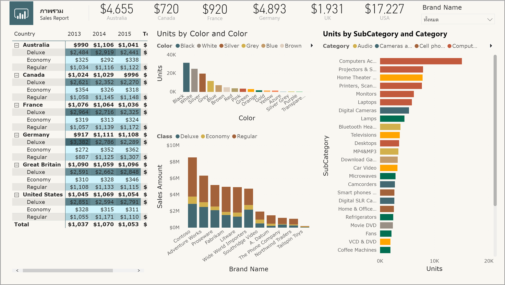
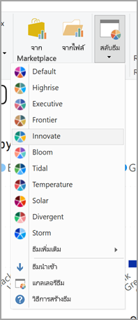
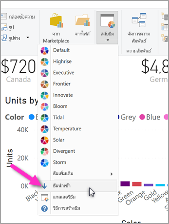

# <a name="use-report-themes-in-power-bi-desktop"></a>ใช้ธีมรายงานใน Power BI Desktop
ด้วย**ธีมรายงาน** คุณสามารถใช้การเปลี่ยนแปลงการออกแบบกับรายงานทั้งหมดของคุณได้ เช่น การใช้สีสำหรับองค์กร การเปลี่ยนชุดไอคอน หรือการใช้การจัดรูปแบบภาพตามค่าเริ่มต้นใหม่ เมื่อคุณใช้**ธีมรายงาน** การแสดงผลด้วยภาพทั้งหมดในรายงานของคุณจะใช้สีและการจัดรูปแบบจากธีมที่คุณเลือก มีข้อยกเว้นบางข้อ ซึ่งจะอธิบายภายหลังในบทความนี้



เมื่อคุณใช้**ธีมรายงาน**แบบกำหนดเอง คุณต้องใช้ไฟล์ JSON ที่ใช้โครงสร้างพื้นฐาน คุณสามารถนำเข้าไฟล์ JSON นี้ลงใน Power BI Desktop และนำไปใช้กับรายงานของคุณ

นอกจากนี้ คุณยังสามารถปรับแต่งและกำหนดมาตรฐานองค์ประกอบส่วนใหญ่ที่เห็นในบานหน้าต่าง**การจัดรูปแบบ**ผ่านธีมไฟล์ JSON ได้ เป้าหมายคือการเปิดให้คุณสามารถควบคุมการแสดงรายงานของคุณอย่างเต็มที่ ไปจนถึงระดับแยกย่อยได้

## <a name="how-report-themes-work"></a>ธีมรายงาน ทำงานอย่างไร
หากต้องการใช้ธีมรายงานกับรายงาน Power BI Desktop ให้เลือกจากธีมรายงานที่มีอยู่ภายในระบบหรือนำเข้าธีมแบบกำหนดเอง

| ธีมรายงานที่มีอยู่ภายในระบบ | ลำดับสีเริ่มต้น    |
|------ |---------- |
| ค่าเริ่มต้น   | |
| Highrise  | |
| ผู้บริหาร     | |
| พรมแดน  | |
| นวัตกรรม    | |
| ดอกไม้บาน     | |
| คลื่น | |
| อุณหภูมิ   | |
| พระอาทิตย์ | |
| แตกต่าง     | |
| พายุ     | |
| คลาสสิก   | |
| ซิตี้ปาร์ค     | |
| ชั้นเรียน     | |
| ปลอดภัยสำหรับผู้ที่ตาบอดสี   | |
| ไฟฟ้า  | |
| ความคมชัดสูง     | |
| พระอาทิตย์ตก    | |
| พลบค่ำ  | |

หากต้องเลือกจากธีมรายงานที่มีอยู่แล้วภายใน ให้เลือกปุ่ม**สลับธีม**จากริบบิ้น**หน้าแรก** จากนั้นเลือกธีมที่มีอยู่จากเมนูดรอปดาวน์



ธีมรายงานของคุณจะถูกนำไปใช้กับรายงาน และคุณก็พร้อมแล้ว

### <a name="importing-report-themes"></a>การนำเข้าธีมรายงาน

หากต้องการนำเข้าธีมรายงาน ให้เลือกปุ่ม **สลับธีม** จาก ribbon **หน้าแรก** จากนั้นเลือก **นำเข้าธีม** จากเมนูดรอปดาวน์



หน้าต่างจะปรากฏขึ้นเพื่อให้คุณเรียกดูตำแหน่งที่ตั้งของไฟล์ธีม JSON Power BI Desktop ค้นหาไฟล์ JSON เนื่องจากเป็นไฟล์ชนิดธีมรายงานของ Power BI ในรูปต่อไปนี้ แสดงธีมวันหยุดจำนวนหนึ่งที่มี เราจะเลือกธีมวันหยุดสำหรับเดือนมีนาคม


เมื่อโหลดไฟล์ธีมเสร็จเรียบร้อยแล้ว Power BI Desktop จะแจ้งให้คุณทราบ


ตอนนี้เราได้นำเข้าไฟล์ธีมแล้ว ลองมาดูโครงสร้างไฟล์ JSON กัน

## <a name="structure-of-a-report-theme-json-file"></a>โครงสร้างของไฟล์ธีมรายงาน JSON
 ไฟล์ JSON พื้นฐานที่เลือกในส่วนที่แล้ว (ไฟล์ *St Patricks Day.json*) เมื่อเปิดในตัวแก้ไขจะมีลักษณะดังสกรีนช็อตต่อไปนี้:


ไฟล์ JSON ต้องมีบรรทัดต่อไปนี้:

* **ชื่อ**: ชื่อธีมซึ่งเป็นเขตข้อมูลเดียวที่บังคับ

* **dataColors**: รายการรหัสสีรหัสฐานสิบหกที่ใช้เป็นข้อมูลในวิชวล Power BI Desktop รายการสามารถมีจำนวนสีมากหรือน้อยตามความต้องการของคุณได้

* **background**, **foreground** และ **tableAccent**: ระดับชั้นสีหลายสี เราจะเรียนรู้เพิ่มเติมเกี่ยวกับระดับชั้นสีในบทความนี้ในภายหลัง แต่โปรดทราบว่าระดับชั้นสีนั้นช่วยให้คุณสามารถตั้งค่าสีจำนวนมากในรายงานของคุณได้ทันที

การติดตามคือ ข้อความของไฟล์ *St Patricks Day.json* ที่คุณสามารถใช้เพื่อสร้างไฟล์ JSON ของคุณเอง:

```json
    {
        "name": "St Patricks Day",
        "dataColors": ["#568410", "#3A6108", "#70A322", "#915203", "#D79A12", "#bb7711", "#114400", "#aacc66"],
        "background":"#FFFFFF",
        "foreground": "#3A6108",
        "tableAccent": "#568410"
    }
```

หากคุณต้องการปรับสีพื้นฐานของรายงานเพียงอย่างเดียว คุณจะสามารถเปลี่ยนชื่อและรหัสเลขฐานสิบหกของไฟล์นี้ได้ เพื่อทำให้ไฟล์ JSON ส่วนตัวของคุณนั้นพร้อมสำหรับการนำเข้า

ในไฟล์ JSON คุณระบุเพียงการจัดรูปแบบที่คุณต้องการปรับ และรูปแบบอื่น ๆ ที่*ไม่*ได้กำหนดในไฟล์ JSON ของคุณจะกลับไปใช้ค่าเริ่มต้นของ Power BI

ประโยชน์ของการสร้างไฟล์ JSON มีหลายข้อ ตัวอย่างเช่น คุณสามารถระบุให้แผนภูมิทั้งหมดใช้แบบอักษรขนาด 12 หรือวิชวลบางตัวให้ใช้ตระกูลแบบอักษรที่กำหนด หรือปิดใช้งานป้ายชื่อข้อมูลสำหรับแผนภูมิบางชนิด

เมื่อคุณใช้ไฟล์ JSON ในระดับแยกย่อย คุณสามารถสร้างไฟล์ธีมที่กำหนดมาตรฐานให้แผนภูมิและรายงานของคุณ ทำให้รายงานขององค์กรมีรูปแบบเดียวกันได้อย่างง่ายดาย

สำหรับข้อมูลเกี่ยวกับรูปแบบของไฟล์ JSON โดยละเอียด สามารถดูได้ที่ **รูปแบบไฟล์ธีมรายงาน JSON** ที่ส่วนท้ายของบทความนี้

## <a name="how-report-theme-colors-stick-to-your-reports"></a>สีจากธีมรายงานติดไปกับรายงานของคุณอย่างไร
เมื่อคุณเผยแพร่รายงานของคุณไปยัง **บริการของ Power BI** จะมีสีของธีมรายงานของคุณติดไปด้วย

ส่วน **สีข้อมูล** ของแผง **รูปแบบ** จะสะท้อนให้เห็นธีมรายงานของคุณ ตัวอย่างเช่น หลังจากที่ใช้โทนสีเขียว และสีน้ำตาลจากธีม **วันเซนต์แพทริค** ให้เลือกวิชวล จากนั้นไปที่ **รูปแบบ > สีข้อมูล** และดูข้อมูลต่อไปนี้:


เห็นสีเขียวทั้งหมดนั่นไหม? นั่นเป็นเพราะว่าสีเหล่านั้นเป็นส่วนหนึ่งของ **ธีมรายงาน** ที่ถูกนำเข้าและถูกใช้งาน

นอกจากนี้ สีในจานสีจะยังสอดคล้องกับธีมปัจจุบัน ตัวอย่างเช่น หากคุณเลือกสีที่สามจากแถวบนสุดสำหรับจุดข้อมูล หลังจากนั้นคุณได้เปลี่ยนไปใช้ธีมอื่น สีของจุดข้อมูลนั้นจะถูกปรับเป็นสีที่สามจากแถวบนสุดในธีมใหม่โดยอัตโนมัติ เช่นเดียวกับที่คุณจะเห็นได้เมื่อเปลี่ยนธีมใน Microsoft Office

### <a name="situations-when-report-theme-colors-wont-stick-to-your-reports"></a>สถานการณ์เมื่อสีจากธีมรายงานไม่ติดไปกับรายงานของคุณ
สมมติว่าคุณใช้ชุดสีแบบกำหนดเอง (หรือสีเฉพาะ) ไปยังจุดข้อมูลเฉพาะในการแสดงผลด้วยภาพ โดยใช้ตัวเลือกสีที่กำหนดเองในเครื่องมือเลือกสี เมื่อคุณใช้ธีมรายงาน จะ*ไม่*เกิดการแทนที่สีของจุดข้อมูลที่กำหนดเอง

คุณอาจยังต้องการตั้งค่าสีของสีจุดข้อมูลด้วยตนเองโดยใช้ส่วนสีธีม สีจะ*ไม่*ถูกอัปเดตหากคุณใช้ธีมรายงานใหม่ หากคุณต้องการใช้ค่าเริ่มต้นของสีตามเดิมเพื่อให้สามารถอัปเดตได้เมื่อคุณใช้ธีมรายงานใหม่ คุณสามารถเลือก **กลับไปใช้ค่าเริ่มต้น** หรือเลือกสีจากชุด **สีธีม** ในเครื่องมือเลือกสี


นอกจากนี้ **วิชวลแบบกำหนดเอง** หลายวิชวลจะไม่ใช้ธีมรายงาน

## <a name="report-theme-files-you-can-use-right-now"></a>ไฟล์ธีมรายงานที่คุณสามารถใช้ในขณะนี้
ต้องการเริ่มต้นใช้**ธีมรายงาน**หรือไม่? ต่อไปนี้คือไฟล์ JSON ธีมรายงานสำเร็จรูปที่คุณสามารถดาวน์โหลด และนำเข้าไปยังรายงาน **Power BI Desktop** ของคุณ นอกจากนี้เรายังได้รวมรูปภาพของธีมรายงานที่ใช้กับรายงานในบทความนี้ด้วย

* [ธีม](https://go.microsoft.com/fwlink/?linkid=843924)ที่ใช้ใน[บล็อกโพสต์](https://powerbi.microsoft.com/blog/power-bi-desktop-march-feature-summary/)ที่ประกาศการเผยแพร่ครั้งแรกของ**ธีมรายงาน** ที่เรียกว่า [*waveform.json*](https://go.microsoft.com/fwlink/?linkid=843924)

  

* [ธีมที่ง่ายต่อการอ่านสำหรับผู้ที่มีความบกพร่องทางการมองเห็น](https://go.microsoft.com/fwlink/?linkid=843923) มากกว่าธีมสีเริ่มต้น เรียกว่า[*ColorblindSafe-Longer.json*](https://go.microsoft.com/fwlink/?linkid=843923)

  

* กลุ่มของ [ธีม Power View](https://go.microsoft.com/fwlink/?linkid=843925) ในไฟล์ zip รวมถึงธีมที่ชื่อว่า [*Apothecary.json*](https://go.microsoft.com/fwlink/?linkid=843925) ที่แสดงด้านล่างนี้

  

* สุดท้ายคือธีม *วันวาเลนไทน์*

  

แทนที่จะต้องดาวน์โหลด เรามีโค้ดสำหรับไฟล์ JSON วันวาเลนไทน์:

```json
    {
        "name": "Valentine's Day",
        "dataColors": ["#990011", "#cc1144", "#ee7799", "#eebbcc", "#cc4477", "#cc5555", "#882222", "#A30E33"],
        "background":"#FFFFFF",
        "foreground": "#ee7799",
        "tableAccent": "#990011"
    }
```

**ธีมรายงาน**สามารถทำให้รายงาน Power BI Desktop ของคุณ สะท้อนสีสันในแบบของคุณ องค์กรของคุณ หรือแม้แต่ฤดูกาล หรือวันหยุดได้ 

นี่เป็นธีมรายงานเพื่มเติมที่คุณสามารถใช้เป็นจุดเริ่มต้น:

* [Sunflower-twilight](https://community.powerbi.com/t5/Themes-Gallery/Sunflower-Twilight/m-p/140749)
* [Plum](https://community.powerbi.com/t5/Themes-Gallery/Plum/m-p/140711)
* [Autumn](https://community.powerbi.com/t5/Themes-Gallery/Autumn/m-p/140746)
* [High contrast](https://community.powerbi.com/t5/Themes-Gallery/Color-Blind-Friendly/m-p/140597)

## <a name="report-theme-json-file-format"></a>รูปแบบไฟล์ธีมรายงาน JSON
ในระดับพื้นฐานที่สุด ธีมไฟล์ JSON มีบรรทัดที่จำเป็นต้องระบุเพียงหนึ่งรายการเท่านั้นคือ: **ชื่อ** 

```json
    {
        "name": "Custom Theme",
    }
```

นอกเหนือจาก*ชื่อ* ข้อมูลอื่น ๆ ทั้งหมดนั้นจะระบุหรือไม่ก็ได้ ซึ่งหมายความว่าคุณสามารถเพิ่มคุณสมบัติเฉพาะที่คุณต้องการจัดรูปแบบสำหรับไฟล์ธีมได้ตามใจ และสามารถใช้ค่าเริ่มต้นของ Power BI สำหรับส่วนที่เหลือได้ 

ที่ด้านล่างของชือ คุณสามารถเพิ่มสีข้อมูลพื้นฐานที่เกี่ยวข้องกับคุณสมบัติได้ 


* **dataColors**: รายการรหัสสีรหัสฐานสิบหกที่ใช้เป็นข้อมูลในวิชวล Power BI Desktop รายการสามารถมีจำนวนสีมากหรือน้อยตามความต้องการของคุณได้ เมื่อใช้สีทุกสีจากรายการนี้แล้ว หากการแสดงผลด้วยภาพยังต้องใช้สีเพิ่มอีก ค่าสีจะแปลี่ยนกลับไปใช้ชุดสีตามค่าเริ่มต้นของ Power BI 
* **ดี พอใช้ ไม่ดี**: ระดับเหล่านี้จะกำหนดสีสำหรับสถานะที่ใช้ในแผนภูมิแบบน้ำตกและการแสดงผลด้วยภาพ KPI
* **สูงสุด ปานกลาง ต่ำสุด ไม่มีผล**: สีเหล่านี้จะกำหนดการไล่ระดับสีต่าง ๆ ในกล่องโต้ตอบการจัดรูปแบบตามเงื่อนไข  

ธีมพื้นฐานที่กำหนดสีต่าง ๆ เหล่านี้จะมีลักษณะดังต่อไปนี้:

```json
    {
        "name": "Custom Theme",
          "dataColors": [
                "#118DFF",
                "#12239E", 
                "#E66C37", 
                "#6B007B", 
                "#E044A7",
                "#744EC2", 
                "#D9B300", 
                "#D64550",
                "#197278", 
                "#1AAB40"
    ],
        "good": "#1AAB40",
        "neutral": "#D9B300",
        "bad": "#D64554",
        "maximum": "#118DFF",
        "center": "#D9B300",
        "minimum": "#DEEFFF",
        "null": "#FF7F48"
    }
```

คุณสามารถเพิ่มระดับชั้นสีต่าง ๆ ได้ในขั้นตอนถัดไป ระดับชั้นสีช่วยให้คุณสามารถตั้งค่าสีต่าง ๆ มากมายได้ตลอดทั้งรายงานของคุณในบรรทัดเดียว โดยการจัดกลุ่มคุณสมบัติในการแสดงผลด้วยภาพที่คล้ายคลึงกันซึ่งโดยทั่วไปแล้วจะมีสีเดียวกัน 

คุณสามารถดูระดับชั้นสีทั้งหกระดับที่คุณสามารถจัดรูปแบบได้ในตารางต่อไปนี้


|ระดับชั้นสี  |รายการที่จัดรูปแบบ  |
|---------|---------|
|พื้นหน้า | สีพื้นหลังของป้ายกำกับ (เมื่ออยู่ภายนอกจุดข้อมูล) <br> สีเส้นแน้วโน้ม <br>  สีค่าเริ่มต้นของกล่องข้อความ <br> ค่าตารางและเมทริกซ์ รวมถึงสีแบบอักษรทั้งหมดสำหรับสีแกนแถบข้อมูล <br> ป้ายชื่อข้อมูลของการ์ด <br> สีค่าคำบรรยายตัววัด <br> สีเป้าหมาย KPI <br>  สีข้อความ KPI <br> สีรายการตัวแบ่งส่วนข้อมูล (เมื่ออยู่ในโหมดโฟกัส)  <br> สีแบบอักษรของรายการแบบหล่นลงสำหรับตัวแบ่งส่วนข้อมูล <br> สีแบบอักษรในการป้อนค่าตัวเลขสำหรับตัวแบ่งส่วนข้อมูล <br> สีแบบอักษรที่ส่วนหัวสำหรับตัวแบ่งส่วนข้อมูล <br> สีเส้นอัตราส่วนสำหรับแผนภูมิกระจาย <br> สีเส้นการคาดการณ์สำหรับแผนภูมิเส้น <br> สีเส้นตัวนำแผนที่ <br> สีบานหน้าต่างตัวกรองและข้อความบนการ์ด|
|foregroundNeutralSecondary |สีป้ายกำกับ  <br> สีป้ายกำกับคำอธิบายแผนภูมิ <br> สีป้ายกำกับแกน <br> สีแบบอักษรของส่วนหัวตารางและเมทริกซ์ <br> สีเส้นเป้าหมายตัววัดและตัวนำเป้าหมาย <br>  สีแกนแนวโน้ม KPI <br> สีแถบเลื่อนสำหรับตัวแบ่งส่วนข้อมูล <br> สีแบบอักษรรายการสำหรับตัวแบ่งส่วนข้อมูล <br> สีเส้นกรอบสำหรับตัวแบ่งส่วนข้อมูล <br> สีโฮเวอร์สำหรับแผนภูมิเส้น <br> สีชื่อของการ์ดแบบหลายแถว <br> สีสโตรกของแผนภูมิริบบอน <br> สีเส้นขอบของแผนที่แบบแสดงรูปร่าง <br> สีแบบอักษรสำหรับข้อความปุ่ม <br> สีเส้นสำหรับไอคอนปุ่ม <br> สีเส้นกรอบปุ่ม |
| foregroundNeutralTertiary | สีคำอธิบายแผนภูมิแบบจาง <br> สีป้ายกำกับประเภทการ์ด <br> สีป้ายกำกับประเภทการ์ดแบบหลายแถว <br> สีแถบการ์ดแบบหลายแถว <br> สีสโตรกของอัตราส่วนการแปลงแผนภูมิกรวย 
| backgroundLight | สีเส้นตารางแกน <br> สีเส้นตารางและเมทริกซ์ <br> สีพื้นหลังที่ส่วนหัวของตัวแบ่งส่วนข้อมูล (เมื่ออยู่ในโหมดโฟกัส)  <br> สีเส้นกรอบของการ์ดแบบหลายแถว  <br> สีเติมรูปร่าง <br> สีพื้นหลังของเส้นโค้งตัววัด <br> สีพื้นหลังการ์ดตัวกรองที่ใช้ <br> |
backgroundNeutral | สีเส้นกรอบของเส้นตารางและเมทริกซ์ <br> สีตามค่าเริ่มต้นของแผนทีแบบแสดง่รูปร่าง <br> สีเติมแถบแผนภูมิริบบอน (เมื่อปิดตัวเลือกชุดข้อมูลตรงกัน) |
background | สีพื้นหลังของป้ายกำกับ (เมื่ออยู่ภายในจุดข้อมูล) <br> สีพื้นหลังของรายการแบบหล่นลงสำหรับตัวแบ่งส่วนข้อมูล  <br> สีสโตรกของแผนภูมิโดนัท <br> สีสโตรกสำหรับแผนที่ต้นไม้ <br> สีพื้นหลังสำหรับแผนภูมิผสม <br> สีเติมปุ่ม <br> สีบานหน้าต่างตัวกรองและพื้นหลังของการ์ดตัวกรองทีใช้งานได้ |
tableAccent | แทนที่สีกรอบเส้นตารางตารางและเมทริกซ์เมื่อแสดง |


ต่อไปนี้คือตัวอย่างธีมในการตั้งค่าระดับชั้นสี:

```json
    {
        "name": "Custom Theme",
        "foreground": "#252423",
          "foregroundNeutralSecondary": "#605E5C",
          "foregroundNeutralTertiary": "#B3B0AD",
        "background": "#FFFFFF",
          "backgroundLight": "#F3F2F1",
          "backgroundNeutral": "#C8C6C4",
        "tableAccent": "#118DFF"
    }
```

ขั้นต่อไป คุณสามารถเพิ่มระดับชั้นข้อความไปที่ไฟล์ JSON ของคุณได้ ซึ่งวิธีการนั้นคล้ายคลึงกับระดับชั้นสี แต่ระดับชั้นข้อความนั้นออกแบบขึ้นมาเพื่อช่วยให้คุณปรับขนาดแบบอักษร สี และตระกูลกลุ่มข้อความตัวอักษรในรายงานทั้งหมดของคุณ ระดับชั้นข้อความมี 12 ระดับ แต่ที่จริงแล้วคุณต้องตั้งค่าเพียงสี่ระดับชั้นเท่านั้น ซึ่งเรียกว่า *ระดับชั้นหลัก* เพื่อเปลี่ยนการจัดรูปแบบข้อความทั้งหมดในรายงานของคุณ ระดับชั้นข้อความอื่น ๆ นั้นถือเป็น *ระดับชั้นรอง* ซึ่งจะมีผลหรือทำงานตามคุณสมบัติของมันเองต่อจากระดับชั้นหลักที่เกี่ยวข้องกันโดยอัตโนมัติ บ่อยครั้งที่ระดับชั้นรองจะแสดงสีข้อความในเฉดที่สว่างกว่า หรือขนาดข้อความที่มีเปอร์เซ็นต์ใหญ่กว่าหรือเล็กกว่าเมื่อเทียบกับระดับชั้นหลัก 

เราจะใช้ระดับชั้นของ*ป้ายกำกับ*เป็นตัวอย่าง การจัดรูปแบบตามค่าเริ่มต้นสำหรับระดับชั้นของป้ายกำกับคือ Segoe UI, #252423 (สีเทาเข้ม) และมีขนาด 12 และใช้ระดับชั้นนี้เพื่อจัดรูปแบบค่าต่าง ๆ ในตารางและเมทริกซ์ โดยทั่วไปแล้ว ค่ารวมทั้งหมดในตารางหรือเมทริกซ์จะมีการจัดรูปแบบที่คล้ายคลึงกัน แต่จะแสดงเป็นตัวหนาเพื่อความชัดเจนมากขึ้น ดังนั้นจึงใช้ระดับชั้นป้ายกำกับแบบตัวหนา อย่างไรก็ตาม คุณไม่จำเป็นต้องระบุว่าธีมของคุณเป็นไฟล์ JSON เนื่องจาก Power BI จะระบุข้อมูลดังกล่าวให้คุณโดยอัตโนมัติ หากในภายหลังคุณต้องการใช้แบบอักษรขนาด 14 ที่ป้ายกำกับและระบุค่านี้ในธีมของคุณ คุณไม่จำเป็นต้องอัปเดตระดับชั้นป้ายกำกับเป็นตัวหนา เนื่องจากการจัดรูปแบบข้อความทั้งหมดจากระดับชั้นป้ายกำกับจะทำงานต่อเนื่องมา และทำให้ตระกูลแบบอักษรที่ด้านบนนั้นเป็นตัวหนา 

รายการตารางจะแสดงข้อมูลต่อไปนี้:
* ระดับชั้นข้อความหลักสี่ระดับ รายการที่จัดรูปแบบ และการตั้งค่าเริ่มต้นของระดับชั้นนั้น
* ระดับชั้นรองแต่ละชั้น รายการที่จัดรูปแบบ และการตั้งค่าเริ่มต้นของระดับชั้นนั้น ซึ่งไม่ซ้ำกันเมื่อเทียบกับระดับชั้นหลัก


|ระดับชั้นหลัก  |ระดับชั้นรอง  |ชื่อระดับชั้นใน JSON  |การตั้งค่า  |วัตถุสำหรับการแสดงผลด้วยภาพที่เกี่ยวข้อง  |
|---------|---------|---------|---------|---------|
| คำบรรยาย   | N/A   | คำบรรยาย | DIN <br> #252423 <br> 45pt |ป้ายชื่อข้อมูลของการ์ด <br> ตัวบ่งชี้ KPI|
|ส่วนหัว|N/A|ส่วนหัว|Segoe UI Semibold <br> #252423 <br> 12pt |ส่วนหัวเรื่องของตัวกำหนดอิทธิพลหลัก |
| ชื่อเรื่อง || ชื่อเรื่อง    |DIN <br> #252423 <br> 12pt |ชื่อแกนประเภท <br> ชื่อแกนค่า <br> ชื่อของการ์ดแบบหลายแถว * <br> ส่วนหัวของตัวแบ่งส่วนข้อมูล|
|-| ชื่อเรื่องขนาดใหญ่ | ชื่อเรื่องขนาดใหญ่    |14pt   |ชื่อการแสดงผลด้วยภาพ |
|ป้ายกำกับ ||ป้ายกำกับ |Segoe UI<br>#252423<br>10pt |ส่วนหัวของคอลัมน์ตารางและเมทริกซ์ <br> ส่วนหัวของแถวเมทริกซ์<br>เส้นตารางและเมทริกซ์<br>ค่าตารางและเมทริกซ์ |
|-|หนาครึ่งหนึ่ง |semiboldLabel| Segoe UI Semibold   | ข้อความโปรไฟล์ตัวกำหนดอิทธิพลหลัก
|-|ขนาดใหญ่    |largeLabel |12pt   | ป้ายชื่อข้อมูลของการ์ดแบบหลายแถว |
|-|ขนาดเล็ก    |smallLabel |9pt    |ป้ายกำกับเส้นอ้างอิง * <br>ป้ายกำกับช่วงวันที่สำหรับตัวแบ่งส่วนข้อมูล<br> ลักษณะแบบอักษรในการป้อนค่าตัวเลขสำหรับตัวแบ่งส่วนข้อมูล<br>กล่องค้นหาสำหรับตัวแบ่งส่วนข้อมูล<br>ข้อความตัวกำหนดอิทธิพลหลัก|
|-|สีอ่อน    |ป้ายกำกับสีอ่อน |#605E5C    |ข้อความคำอธิบายแผนภูมิ<br>ข้อความบนปุ่ม<br>ป้ายกำกับแกนประเภท<br>ป้ายชื่อข้อมูลของแผนภูมิกรวย<br>ป้ายกำกับอัตราส่วนการแปลงแผนภูมิกรวย<br>เป้าหมายของตัววัด<br>ป้ายกำกับประเภทสำหรับแผนภูมิกระจาย<br>รายการตัวแบ่งส่วนข้อมูล|
|-|ตัวหนา |ป้ายกำกับแบบตัวหนา  |Segoe UI Bold  |ผลรวมย่อยของเมทริกซ์<br>ผลรวมทั้งหมดของเมทริกซ์<br>ผลรวมตาราง |
|-|ขนาดใหญ่และสีอ่อน  |largeLightLabel    |#605E5C<br>12pt    |ป้ายกำกับประเภทการ์ด<br>ป้ายกำกับตัววัด<br>ป้ายกำกับประเภทการ์ดแบบหลายแถว |
|-|ขนาดใหญ่และสีอ่อน  |smallLightLabel    |#605E5C<br>9pt |ป้ายชื่อข้อมูล<br>ป้ายกำกับแกนค่า|


คุณไม่ต้องตั้งค่าระดับชั้นรองในไฟล์ธีมของคุณ เนื่องจากค่านั้นจะยังคงมีผลต่อเนื่องมาจากระดับชั้นหลัก หากคุณไม่ชอบกฎการทำงานแบบต่อเนื่องนี้ (ตัวอย่างเช่น หากคุณไม่ต้องการให้ผลรวมของคุณนั้นมีรูปแบบค่าในตารางเป็นตัวหนา) คุณสามารถจัดรูปแบบเฉพาะระดับชั้นที่สองในไฟล์ธีมได้ เช่นเดียวกับที่คุณจัดรูปแบบระดับชั้นหลัก

ต่อไปนี้คือตัวอย่างธีมซึ่งตั้งค่าระดับชั้นข้อความหลักเท่านั้น: 

```json
    {
            "name": "Custom Theme",
          "textClasses": {
                "callout": {
                    "fontSize": 45,
                    "fontFace": "wf_standard-font",
                    "color": "#252423"
                },
                "title": {
                    "fontSize": 12,
                    "fontFace": "wf_standard-font",
                    "color": "#252423"
                },
                "header": {
                    "fontSize": 12,
                    "fontFace": "Segoe UI Semibold",
                    "color": "#252423"
                },
                "label": {
                    "fontSize": 10,
                    "fontFace": "Segoe UI",
                    "color": "#252423"
                }
        }    
    }
```

ขั้นสุดท้าย หากต้องการสร้างไฟล์ JSON รูปแบบขยาย ที่มีการควบคุมการจัดรูปแบบการแสดงผลด้วยภาพทั้งหมดที่ละเอียดขึ้นและแยกย่อยมากขึ้น คุณสามารถเพิ่มส่วน **visualStyles** ที่ไฟล์ JSON ได้ คุณวางการจัดรูปแบบเฉพาะในส่วน **visualStyles** ส่วน **visualStyles** มีลักษณะเหมือนรูปแบบต่อไปนี้:

    visualStyles: {
        visualName: {
            styleName: {
                cardName: [{
                    propertyName: propertyValue
                }]
            }
        }
    }

สำหรับส่วน **visualName** และ **cardName** ให้ใช้การแสดงผลด้วยภาพและชื่อการ์ดเฉพาะ ในตอนนี้ **styleName** จะเป็นเครื่องหมายดอกจัน ("*") เสมอ แต่ในอนาคตคุณจะสามารถสร้างลักษณะที่แตกต่างกันสำหรับการแสดงผลด้วยภาพของคุณและตั้งชื่อใหลักษณะนั้น ๆ ได้ (คล้ายกับคุณลักษณะของลักษณะตารางและเมทริกซ์) **propertyName** คือชื่อของตัวเลือกการจัดรูปแบบเฉพาะ และ**propertyValue** คือจุดที่คุณต้องกำหนดรายละเอียดตัวเลือกการจัดรูปแบบที่คุณต้องการ  

สำหรับ **visualName** และ **cardName** คุณสามารถใช้เครื่องหมายดอกจันหนึ่งอัน ("\*") แทนการแสดงผลด้วยภาพหรือชื่อการ์ดที่เฉพาะเจาะจงได้ หากคุณต้องการใช้การตั้งค่านั้นกับการแสดงผลด้วยภาพหรือการ์ดทั้งหมดที่มีคุณสมบัติ หากคุณใช้เครื่องหมายดอกจัน (“\*”) สำหรับทั้งการแสดงผลด้วยภาพและชื่อการ์ด คุณจะใช้การตั้งค่าทั่วโลกในรายงานของคุณได้อย่างมีประสิทธิภาพ เช่น ขนาดตัวอักษร หรือตระกูลแบบอักษรเฉพาะสำหรับข้อความทั้งหมดในการแสดงผลด้วยภาพทุกรายการ

ต่อไปนี้เป็นตัวอย่างการตั้งค่าคุณสมบัติบางอย่างผ่านลักษณะการแสดงผลด้วยภาพ 

```json
{  
   "name":"Custom Theme",
   "visualStyles":{  
      "*":{  
         "*":{  
            "*":[{  
                  "wordWrap":true
            }],
            "categoryAxis":[{
                  "gridlineStyle":"dotted"
            }],
            "filterCard":[{  
                  "$id":"Applied",
                  "foregroundColor":{"solid":{"color":"#252423"}}
               },
               {  
                  "$id":"Available",
                  "border":true
            }]
         }
      },
      "scatterChart":{  
         "*":{  
            "bubbles":[{  
                  "bubbleSize":-10
            }]
         }
      }
   }
}
```

ตัวอย่างนี้จะแสดงรายการต่อไปนี้:

* การเปิดใช้งานการตัดคำทุกส่วน
* การตั้งค่าลักษณะเส้นตารางเป็นจุดสำหรับการแสดงผลด้วยภาพทั้งหมดที่มีแกนประเภท
* การตั้งค่าการจัดรูปแบบบางอย่างสำหรับการ์ดตัวกรองที่มีอยู่และที่ใช้งาน (โปรดทราบว่ารูปแบบที่ใช้ "$id" คือการตั้งค่ารุ่นการ์ดตัวกรองแบบอื่น ๆ)
* การตั้งค่าขนาดฟองสำหรับแผนภูมิกระจายเป็น -10


> [!NOTE]
> เพียงระบุแค่องค์ประกอบการจัดรูปแบบที่คุณต้องการแก้ไขเท่านั้น องค์ประกอบการจัดรูปแบบใด ๆ ที่ไม่ได้ระบุในไฟล์ JSON จะกลับไปใช้ค่าและการตั้งค่าเริ่มต้น
> 
> 

### <a name="json-file-element-definitions"></a>ข้อกำหนดขององค์ประกอบไฟล์ JSON
ตารางในส่วนนี้กำหนดชื่อวิชวล (*visualName*), ชื่อการ์ด (*cardName*) และค่าจาระไนที่จำเป็นต่อการสร้างไฟล์ JSON ของคุณ

| **visualName** |
| --- |
| areaChart |
| barChart |
| basicShape |
| card |
| clusteredBarChart |
| clusteredColumnChart |
| columnChart |
| comboChart |
| donutChart |
| filledMap |
| funnel |
| gauge |
| hundredPercentStackedBarChart |
| hundredPercentStackedColumnChart |
| image |
| kpi |
| lineChart |
| lineClusteredColumnComboChart |
| lineStackedColumnComboChart |
| map |
| multiRowCard |
| pieChart |
| PivotTable |
| ribbonChart |
| scatterChart |
| shapeMap |
| slicer |
| stackedAreaChart |
| tableEx |
| treemap |
| waterfallChart |

ตารางต่อไปนี้กำหนดค่า *cardName* ค่าแรกในแต่ละเซลล์เป็นคำที่ใช้ไฟล์ JSON ค่าที่สองคือชื่อของการ์ดตามที่ปรากฏในส่วนติดต่อผู้ใช้ **Power BI Desktop**

| **cardName** |
| --- |
| แกน: แกนวัด |
| breakdown: การแบ่งย่อย |
| bubbles: แผนภูมิแบบฟอง |
| calloutValue: ค่าคำบรรยายภาพ |
| card: การ์ด |
| cardTitle: ชื่อการ์ด |
| categoryAxis: แกน X |
| categoryLabels: ป้ายชื่อประเภท |
| columnFormatting: การจัดรูปแบบเขตข้อมูล |
| columnHeaders: ส่วนหัวของคอลัมน์ |
| dataLabels: ป้ายชื่อข้อมูล |
| fill: เติม |
| fillPoint: จุดกรอกข้อมูล |
| forecast: พยากรณ์ |
| general: ทั่วไป |
| goals: เป้าหมาย |
| grid: เส้นตาราง |
| header: ส่วนหัว |
| imageScaling: การปรับมาตราส่วน |
| indicator: ตัวบ่งชี้ |
| items: รายการ |
| labels: ป้ายชื่อข้อมูล |
| legend: คำอธิบายแผนภูมิ |
| lineStyles: รูปร่าง |
| mapControls: ตัวควบคุมแผนที่ |
| mapStyles: ลักษณะการแมป |
| numericInputStyle: ข้อมูลป้อนเข้าแบบตัวเลข |
| percentBarLabel: ป้ายอัตราการแปลง |
| plotArea: พื้นที่การลงจุด |
| plotAreaShading: แรเงาสมมาตร |
| ratioLine: เส้นอัตราส่วน |
| referenceLine: เส้นคงที่ |
| ribbonChart ริบบิ้น |
| rotation: การหมุน |
| rowHeaders: ส่วนหัวของแถว |
| selection: ตัวควบคุมการเลือก |
| sentimentColors: สีแสดงความคิดเห็น |
| shape: รูปร่าง |
| slider: แถบเลื่อน |
| status: การเข้ารหัสสี |
| subTotals: ผลรวมย่อย |
| target: เป้าหมาย |
| total: ผลรวมทั้งหมด |
| trend: เส้นแนวโน้ม |
| trendline: แกนแนวโน้ม |
| valueAxis: แกน Y |
| values: ค่า |
| wordWrap: ตัดคำ |
| xAxisReferenceLine: เส้นคงที่แกน X |
| y1AxisReferenceLine: เส้นคงที่ |
| zoom: ย่อ/ขยาย |

### <a name="properties-within-each-card"></a>คุณสมบัติภายในแต่ละการ์ด
ส่วนต่อไปนี้กำหนดชื่อคุณสมบัติภายในแต่การ์ด ชื่อการ์ดจะตามด้วยชื่อคุณสมบัติแต่ละรายการ สำหรับคุณสมบัติแต่ละอย่าง คุณจะเห็นชื่อหากบานหน้าต่างการจัดรูปแบบแสดงขึ้นมา คำอธิบายเกี่ยวกับสิ่งที่ตัวเลือกการจัดรูปแบบสามารถทำได้ และประเภทของตัวเลือกการจัดรูปแบบ วิธีนี้ช่วยให้คุณรู้ชนิดของค่าต่าง ๆ ที่คุณสามารถใช้ในไฟล์ธีมของคุณได้ 

เมื่อใช้ **dateTime** วันที่ต้องเป็นวันที่ ISO ในเครื่องหมายอัญประกาศเดี่ยวที่เริ่มต้นด้วย datetime ดังตัวอย่างต่อไปนี้:

    “datetime’2011-10-05T14:48:00.000Z’”

บูลีนเป็นจริงหรือเท็จ สตริงที่ต้องอยู่ในเครื่องหมายอัญประกาศคู่ เหมือนกับใน "นี่คือสตริง" ตัวเลขเป็นค่าตามจำนวนของมันเองเท่านั้น ไม่ใช่การแจ้งราคา

สีควรใช้ในรูปแบบต่อไปนี้ ที่ซึ่งรหัสเลขฐานสิบหกที่คุณกำหนดเองนั้นเป็น “FFFFFF” ในตัวอย่างต่อไปนี้  

    { "solid": { "color": "#FFFFFF" } }

โดยส่วนใหญ่แล้วมีการใช้ค่าจาระไนสำหรับตัวเลือกการจัดรูปแบบแบบหล่นลง ซึ่งหมายความว่าคุณสามารถตั้งค่าค่าจาระไนดังกล่าวเป็นตัวเลือกใดก็ได้ที่เห็นในบานหน้าต่าง ตัวอย่างเช่น RightCenter" สำหรับตำแหน่งคำอธิบายแผนภูมิหรือ "Data value, percent of total" สำหรับป้ายกำกับข้อมูลแบบวงกลม ตัวเลือกค่าจาระไนแสดงอยู่ที่ด้านล่างของรายการคุณสมบัติ


```json
{
      "general":{ 
        "responsive": {
          "type": [
            "bool"
          ],
          "displayName": [
            "(Preview) Responsive"
          ],
          "description": [
            "The visual will adapt to size changes"
          ]
        },
        "legend": {
        "show": {
          "type": [
            "bool"
          ],
          "displayName": [
            "Show"
          ]
        },
        "position": {
          "type": [
            "enumeration"
          ],
          "displayName": [
            "Position"
          ],
          "description": [
            "Select the location for the legend"
          ]
        },
        "showTitle": {
          "type": [
            "bool"
          ],
          "displayName": [
            "Title"
          ],
          "description": [
            "Display a title for legend symbols"
          ]
        },
        "labelColor": {
          "type": [
            "fill"
          ],
          "displayName": [
            "Color"
          ]
        },
        "fontFamily": {
          "type": [
            "formatting"
          ],
          "displayName": [
            "Font family"
          ]
        },
        "fontSize": {
          "type": [
            "formatting"
          ],
          "displayName": [
            "Text Size"
          ]
        }
      },
      "categoryAxis": {
        "show": {
          "type": [
            "bool"
          ],
          "displayName": [
            "Show"
          ]
        },
        "axisScale": {
          "type": [
            "enumeration"
          ],
          "displayName": [
            "Scale type"
          ]
        },
        "start": {
          "type": [
            "numeric",
            "dateTime"
          ],
          "displayName": [
            "Start"
          ],
          "description": [
            "Enter a starting value (optional)"
          ]
        },
        "end": {
          "type": [
            "numeric",
            "dateTime"
          ],
          "displayName": [
            "End"
          ],
          "description": [
            "Enter an ending value (optional)"
          ]
        },
        "axisType": {
          "type": [
            "enumeration"
          ],
          "displayName": [
            "Type"
          ]
        },
        "showAxisTitle": {
          "type": [
            "bool"
          ],
          "displayName": [
            "Title"
          ],
          "description": [
            "Title for the X-axis",
            "Title for the Y-axis"
          ]
        },
        "axisStyle": {
          "type": [
            "enumeration"
          ],
          "displayName": [
            "Style"
          ]
        },
        "labelColor": {
          "type": [
            "fill"
          ],
          "displayName": [
            "Color"
          ]
        },
        "fontFamily": {
          "type": [
            "formatting"
          ],
          "displayName": [
            "Font family"
          ]
        },
        "fontSize": {
          "type": [
            "formatting"
          ],
          "displayName": [
            "Text Size"
          ]
        },
        "labelDisplayUnits": {
          "type": [
            "formatting"
          ],
          "displayName": [
            "Display units"
          ],
          "description": [
            "Select the units (millions, billions, etc.)"
          ]
        },
        "labelPrecision": {
          "type": [
            "numeric"
          ],
          "displayName": [
            "Value decimal places"
          ],
          "description": [
            "Select the number of decimal places to display for the values"
          ]
        },
        "concatenateLabels": {
          "type": [
            "bool"
          ],
          "displayName": [
            "Concatenate labels"
          ],
          "description": [
            "Always concatenate levels of the hierarchy instead of drawing the hierarchy."
          ]
        },
        "preferredCategoryWidth": {
          "type": [
            "numeric"
          ],
          "displayName": [
            "Minimum category width"
          ]
        },
        "titleColor": {
          "type": [
            "fill"
          ],
          "displayName": [
            "Title color"
          ]
        },
        "titleFontFamily": {
          "type": [
            "formatting"
          ],
          "displayName": [
            "Font family"
          ]
        },
        "titleFontSize": {
          "type": [
            "formatting"
          ],
          "displayName": [
            "Title text size"
          ]
        },
        "position": {
          "type": [
            "enumeration"
          ],
          "displayName": [
            "Position"
          ],
          "description": [
            "Select left or right"
          ]
        },
        "color": {
          "type": [
            "fill"
          ],
          "displayName": [
            "Color"
          ],
          "description": [
            "Select color for data labels"
          ]
        },
        "duration": {
          "type": [
            "numeric"
          ]
        }
      },
      "valueAxis": {
        "show": {
          "type": [
            "bool"
          ],
          "displayName": [
            "Show"
          ]
        },
        "position": {
          "type": [
            "enumeration"
          ],
          "displayName": [
            "Position"
          ],
          "description": [
            "Select left or right"
          ]
        },
        "axisScale": {
          "type": [
            "enumeration"
          ],
          "displayName": [
            "Scale type"
          ]
        },
        "start": {
          "type": [
            "numeric",
            "dateTime"
          ],
          "displayName": [
            "Start"
          ],
          "description": [
            "Enter a starting value (optional)"
          ]
        },
        "end": {
          "type": [
            "numeric",
            "dateTime"
          ],
          "displayName": [
            "End"
          ],
          "description": [
            "Enter an ending value (optional)"
          ]
        },
        "showAxisTitle": {
          "type": [
            "bool"
          ],
          "displayName": [
            "Title"
          ],
          "description": [
            "Title for the Y-axis",
            "Title for the X-axis"
          ]
        },
        "axisStyle": {
          "type": [
            "enumeration"
          ],
          "displayName": [
            "Style"
          ]
        },
        "labelColor": {
          "type": [
            "fill"
          ],
          "displayName": [
            "Color"
          ]
        },
        "fontFamily": {
          "type": [
            "formatting"
          ],
          "displayName": [
            "Font family"
          ]
        },
        "fontSize": {
          "type": [
            "formatting"
          ],
          "displayName": [
            "Text Size"
          ]
        },
        "labelDisplayUnits": {
          "type": [
            "formatting"
          ],
          "displayName": [
            "Display units"
          ],
          "description": [
            "Select the units (millions, billions, etc.)"
          ]
        },
        "labelPrecision": {
          "type": [
            "numeric"
          ],
          "displayName": [
            "Value decimal places"
          ],
          "description": [
            "Select the number of decimal places to display for the values"
          ]
        },
        "titleColor": {
          "type": [
            "fill"
          ],
          "displayName": [
            "Title color"
          ]
        },
        "titleFontFamily": {
          "type": [
            "formatting"
          ],
          "displayName": [
            "Font family"
          ]
        },
        "titleFontSize": {
          "type": [
            "formatting"
          ],
          "displayName": [
            "Title text size"
          ]
        },
        "axisLabel": {
          "type": [
            "none"
          ],
          "displayName": [
            "Y-Axis (Column)"
          ]
        },
        "secShow": {
          "type": [
            "bool"
          ],
          "displayName": [
            "Show secondary"
          ]
        },
        "alignZeros": {
          "type": [
            "bool"
          ],
          "displayName": [
            "Align zeros"
          ],
          "description": [
            "Align the zero tick marks for both value axes"
          ]
        },
        "secAxisLabel": {
          "type": [
            "none"
          ],
          "displayName": [
            "Y-Axis (Line)"
          ]
        },
        "secPosition": {
          "type": [
            "enumeration"
          ],
          "displayName": [
            "Position"
          ],
          "description": [
            "Select left or right"
          ]
        },
        "secAxisScale": {
          "type": [
            "enumeration"
          ],
          "displayName": [
            "Scale type"
          ]
        },
        "secStart": {
          "type": [
            "numeric"
          ],
          "displayName": [
            "Start"
          ],
          "description": [
            "Enter a starting value (optional)"
          ]
        },
        "secEnd": {
          "type": [
            "numeric"
          ],
          "displayName": [
            "End"
          ],
          "description": [
            "Enter an ending value (optional)"
          ]
        },
        "secShowAxisTitle": {
          "type": [
            "bool"
          ],
          "displayName": [
            "Title"
          ],
          "description": [
            "Title for the Y-axis"
          ]
        },
        "secAxisStyle": {
          "type": [
            "enumeration"
          ],
          "displayName": [
            "Style"
          ]
        },
        "secLabelColor": {
          "type": [
            "fill"
          ],
          "displayName": [
            "Color"
          ]
        },
        "secFontFamily": {
          "type": [
            "formatting"
          ],
          "displayName": [
            "Font family"
          ]
        },
        "secFontSize": {
          "type": [
            "formatting"
          ],
          "displayName": [
            "Text Size"
          ]
        },
        "secLabelDisplayUnits": {
          "type": [
            "formatting"
          ],
          "displayName": [
            "Display units"
          ],
          "description": [
            "Select the units (millions, billions, etc.)"
          ]
        },
        "secLabelPrecision": {
          "type": [
            "numeric"
          ],
          "displayName": [
            "Value decimal places"
          ],
          "description": [
            "Select the number of decimal places to display for the values"
          ]
        },
        "secTitleColor": {
          "type": [
            "fill"
          ],
          "displayName": [
            "Title color"
          ]
        },
        "secTitleFontFamily": {
          "type": [
            "formatting"
          ],
          "displayName": [
            "Font family"
          ]
        },
        "secTitleFontSize": {
          "type": [
            "formatting"
          ],
          "displayName": [
            "Title text size"
          ]
        }
      },
      "dataPoint": {
        "defaultColor": {
          "type": [
            "fill"
          ],
          "displayName": [
            "Default color",
            "Default Column Color"
          ]
        },
        "fill": {
          "type": [
            "fill"
          ],
          "displayName": [
            "Fill"
          ]
        },
        "defaultCategoryColor": {
          "type": [
            "fill"
          ],
          "displayName": [
            "Default color",
            "Default Column Color"
          ]
        },
        "showAllDataPoints": {
          "type": [
            "bool"
          ],
          "displayName": [
            "Show all"
          ]
        }
      },
      "labels": {
        "show": {
          "type": [
            "bool"
          ],
          "displayName": [
            "Show"
          ]
        },
        "showSeries": {
          "type": [
            "bool"
          ],
          "displayName": [
            "Show"
          ]
        },
        "color": {
          "type": [
            "fill"
          ],
          "displayName": [
            "Color"
          ],
          "description": [
            "Select color for data labels"
          ]
        },
        "labelDisplayUnits": {
          "type": [
            "formatting"
          ],
          "displayName": [
            "Display units"
          ],
          "description": [
            "Select the units (millions, billions, etc.)"
          ]
        },
        "labelPrecision": {
          "type": [
            "numeric"
          ],
          "displayName": [
            "Value decimal places"
          ],
          "description": [
            "Select the number of decimal places to display for the values"
          ]
        },
        "showAll": {
          "type": [
            "bool"
          ],
          "displayName": [
            "Customize series"
          ]
        },
        "fontSize": {
          "type": [
            "formatting"
          ],
          "displayName": [
            "Text Size"
          ]
        },
        "fontFamily": {
          "type": [
            "formatting"
          ],
          "displayName": [
            "Font family"
          ]
        },
        "labelDensity": {
          "type": [
            "formatting"
          ],
          "displayName": [
            "Label density"
          ]
        },
        "labelOrientation": {
          "type": [
            "enumeration"
          ],
          "displayName": [
            "Orientation"
          ]
        },
        "labelPosition": {
          "type": [
            "enumeration"
          ],
          "displayName": [
            "Position"
          ]
        },
        "percentageLabelPrecision": {
          "type": [
            "numeric"
          ],
          "displayName": [
            "% decimal places"
          ],
          "description": [
            "Select the number of decimal places to display for the percentages"
          ]
        },
        "labelStyle": {
          "type": [
            "enumeration"
          ],
          "displayName": [
            "Label style"
          ]
        }
      },
      "lineStyles": {
        "strokeWidth": {
          "type": [
            "numeric"
          ],
          "displayName": [
            "Stroke width"
          ]
        },
        "strokeLineJoin": {
          "type": [
            "enumeration"
          ],
          "displayName": [
            "Join type"
          ]
        },
        "lineStyle": {
          "type": [
            "enumeration"
          ],
          "displayName": [
            "Line style"
          ]
        },
        "showMarker": {
          "type": [
            "bool"
          ],
          "displayName": [
            "Show marker"
          ]
        },
        "markerShape": {
          "type": [
            "enumeration"
          ],
          "displayName": [
            "Marker shape"
          ]
        },
        "markerSize": {
          "type": [
            "numeric"
          ],
          "displayName": [
            "Marker size"
          ]
        },
        "markerColor": {
          "type": [
            "fill"
          ],
          "displayName": [
            "Marker color"
          ]
        },
        "showSeries": {
          "type": [
            "bool"
          ],
          "displayName": [
            "Customize series",
            "Show"
          ]
        },
        "shadeArea": {
          "type": [
            "bool"
          ],
          "displayName": [
            "Shade area"
          ]
        }
      },
      "plotArea": {
        "transparency": {
          "type": [
            "numeric"
          ],
          "displayName": [
            "Transparency"
          ],
          "description": [
            "Set transparency for background color"
          ]
        }
      },
      "trend": {
        "show": {
          "type": [
            "bool"
          ],
          "displayName": [
            "Show"
          ]
        },
        "displayName": {
          "type": [
            "text"
          ],
          "displayName": [
            "Name"
          ],
          "description": [
            "Set trend line name"
          ]
        },
        "lineColor": {
          "type": [
            "fill"
          ],
          "displayName": [
            "Color"
          ],
          "description": [
            "Set trend line color"
          ]
        },
        "transparency": {
          "type": [
            "numeric"
          ],
          "displayName": [
            "Transparency"
          ],
          "description": [
            "Set transparency for trend line color"
          ]
        },
        "style": {
          "type": [
            "enumeration"
          ],
          "displayName": [
            "Style"
          ],
          "description": [
            "Set trend line style"
          ]
        },
        "combineSeries": {
          "type": [
            "bool"
          ],
          "displayName": [
            "Combine Series"
          ],
          "description": [
            "Show one trend line per series or combine"
          ]
        }
      },
      "y1AxisReferenceLine": {
        "show": {
          "type": [
            "bool"
          ],
          "displayName": [
            "Show"
          ]
        },
        "value": {
          "type": [
            "numeric"
          ],
          "displayName": [
            "Value"
          ],
          "description": [
            "Set reference line numeric value"
          ]
        },
        "lineColor": {
          "type": [
            "fill"
          ],
          "displayName": [
            "Color"
          ],
          "description": [
            "Set reference line color"
          ]
        },
        "transparency": {
          "type": [
            "numeric"
          ],
          "displayName": [
            "Transparency"
          ],
          "description": [
            "Set transparency for reference line color"
          ]
        },
        "style": {
          "type": [
            "enumeration"
          ],
          "displayName": [
            "Line style"
          ]
        },
        "position": {
          "type": [
            "enumeration"
          ],
          "displayName": [
            "Position"
          ],
          "description": [
            "Arrange relative to chart data points"
          ]
        },
        "dataLabelShow": {
          "type": [
            "bool"
          ],
          "displayName": [
            "Data label"
          ],
          "description": [
            "Display a data label for the reference line"
          ]
        },
        "dataLabelColor": {
          "type": [
            "fill"
          ],
          "displayName": [
            "Color"
          ],
          "description": [
            "Set the reference line data label color"
          ]
        },
        "dataLabelDecimalPoints": {
          "type": [
            "numeric"
          ],
          "displayName": [
            "Decimal Places"
          ]
        },
        "dataLabelHorizontalPosition": {
          "type": [
            "enumeration"
          ],
          "displayName": [
            "Horizontal Position"
          ],
          "description": [
            "Set the horizontal position for the reference line data label"
          ]
        },
        "dataLabelVerticalPosition": {
          "type": [
            "enumeration"
          ],
          "displayName": [
            "Vertical Position"
          ],
          "description": [
            "Set the vertical position for the reference line data label"
          ]
        },
        "dataLabelDisplayUnits": {
          "type": [
            "formatting"
          ],
          "displayName": [
            "Display units"
          ],
          "description": [
            "Select the units (millions, billions, etc.)"
          ]
        }
      },
      "referenceLine": {
        "show": {
          "type": [
            "bool"
          ],
          "displayName": [
            "Show"
          ]
        },
        "displayName": {
          "type": [
            "text"
          ],
          "displayName": [
            "Name"
          ],
          "description": [
            "Set reference line name"
          ]
        },
        "value": {
          "type": [
            "numeric"
          ],
          "displayName": [
            "Value"
          ],
          "description": [
            "Set reference line numeric value"
          ]
        },
        "lineColor": {
          "type": [
            "fill"
          ],
          "displayName": [
            "Color"
          ],
          "description": [
            "Set reference line color"
          ]
        },
        "transparency": {
          "type": [
            "numeric"
          ],
          "displayName": [
            "Transparency"
          ],
          "description": [
            "Set transparency for reference line color"
          ]
        },
        "style": {
          "type": [
            "enumeration"
          ],
          "displayName": [
            "Line style"
          ]
        },
        "position": {
          "type": [
            "enumeration"
          ],
          "displayName": [
            "Position"
          ],
          "description": [
            "Arrange relative to chart data points"
          ]
        },
        "dataLabelShow": {
          "type": [
            "bool"
          ],
          "displayName": [
            "Data label"
          ],
          "description": [
            "Display a data label for the reference line"
          ]
        },
        "dataLabelColor": {
          "type": [
            "fill"
          ],
          "displayName": [
            "Color"
          ],
          "description": [
            "Set the reference line data label color"
          ]
        },
        "dataLabelDecimalPoints": {
          "type": [
            "numeric"
          ],
          "displayName": [
            "Decimal Places"
          ]
        },
        "dataLabelHorizontalPosition": {
          "type": [
            "enumeration"
          ],
          "displayName": [
            "Horizontal Position"
          ],
          "description": [
            "Set the horizontal position for the reference line data label"
          ]
        },
        "dataLabelVerticalPosition": {
          "type": [
            "enumeration"
          ],
          "displayName": [
            "Vertical Position"
          ],
          "description": [
            "Set the vertical position for the reference line data label"
          ]
        },
        "dataLabelDisplayUnits": {
          "type": [
            "formatting"
          ],
          "displayName": [
            "Display units"
          ],
          "description": [
            "Select the units (millions, billions, etc.)"
          ]
        }
      },
      "line": {
        "lineColor": {
          "type": [
            "fill"
          ],
          "displayName": [
            "Line color"
          ]
        },
        "transparency": {
          "type": [
            "numeric"
          ],
          "displayName": [
            "Transparency"
          ],
          "description": [
            "Set transparency for background color"
          ]
        },
        "weight": {
          "type": [
            "numeric"
          ],
          "displayName": [
            "Weight"
          ]
        },
        "roundEdge": {
          "type": [
            "numeric"
          ],
          "displayName": [
            "Round edges"
          ]
        }
      },
      "fill": {
        "show": {
          "type": [
            "bool"
          ],
          "displayName": [
            "Show"
          ]
        },
        "fillColor": {
          "type": [
            "fill"
          ],
          "displayName": [
            "Fill color"
          ]
        },
        "transparency": {
          "type": [
            "numeric"
          ],
          "displayName": [
            "Transparency"
          ],
          "description": [
            "Set transparency for background color"
          ]
        }
      },
      "rotation": {
        "angle": {
          "type": [
            "numeric"
          ],
          "displayName": [
            "Rotation"
          ]
        }
      },
      "categoryLabels": {
        "show": {
          "type": [
            "bool"
          ],
          "displayName": [
            "Show"
          ]
        },
        "color": {
          "type": [
            "fill"
          ],
          "displayName": [
            "Color"
          ],
          "description": [
            "Select color for data labels"
          ]
        },
        "fontSize": {
          "type": [
            "formatting"
          ],
          "displayName": [
            "Text Size"
          ]
        },
        "fontFamily": {
          "type": [
            "formatting"
          ],
          "displayName": [
            "Font family"
          ]
        }
      },
      "wordWrap": {
        "show": {
          "type": [
            "bool"
          ],
          "displayName": [
            "Show"
          ]
        }
      },
      "dataLabels": {
        "color": {
          "type": [
            "fill"
          ],
          "displayName": [
            "Color"
          ],
          "description": [
            "Select color for data labels"
          ]
        },
        "fontSize": {
          "type": [
            "formatting"
          ],
          "displayName": [
            "Text Size"
          ]
        },
        "fontFamily": {
          "type": [
            "formatting"
          ],
          "displayName": [
            "Font family"
          ]
        }
      },
      "cardTitle": {
        "color": {
          "type": [
            "fill"
          ],
          "displayName": [
            "Color"
          ],
          "description": [
            "Select color for data labels"
          ]
        },
        "fontSize": {
          "type": [
            "formatting"
          ],
          "displayName": [
            "Text Size"
          ]
        },
        "fontFamily": {
          "type": [
            "formatting"
          ],
          "displayName": [
            "Font family"
          ]
        }
      },
      "card": {
        "outline": {
          "type": [
            "enumeration"
          ],
          "displayName": [
            "Outline"
          ]
        },
        "outlineColor": {
          "type": [
            "fill"
          ],
          "displayName": [
            "Outline color"
          ],
          "description": [
            "Color of the outline"
          ]
        },
        "outlineWeight": {
          "type": [
            "numeric"
          ],
          "displayName": [
            "Outline weight"
          ],
          "description": [
            "Thickness of the outline in pixels"
          ]
        },
        "barShow": {
          "type": [
            "bool"
          ],
          "displayName": [
            "Show bar"
          ],
          "description": [
            "Display a bar to the left side of the card as an accent"
          ]
        },
        "barColor": {
          "type": [
            "fill"
          ],
          "displayName": [
            "Bar color"
          ]
        },
        "barWeight": {
          "type": [
            "numeric"
          ],
          "displayName": [
            "Bar thickness"
          ],
          "description": [
            "Thickness of the bar in pixels"
          ]
        },
        "cardPadding": {
          "type": [
            "numeric"
          ],
          "displayName": [
            "Padding"
          ],
          "description": [
            "Background"
          ]
        },
        "cardBackground": {
          "type": [
            "fill"
          ],
          "displayName": [
            "Background"
          ]
        }
      },
      "percentBarLabel": {
        "show": {
          "type": [
            "bool"
          ],
          "displayName": [
            "Show"
          ]
        },
        "color": {
          "type": [
            "fill"
          ],
          "displayName": [
            "Color"
          ],
          "description": [
            "Select color for data labels"
          ]
        },
        "fontSize": {
          "type": [
            "formatting"
          ],
          "displayName": [
            "Text Size"
          ]
        },
        "fontFamily": {
          "type": [
            "formatting"
          ],
          "displayName": [
            "Font family"
          ]
        }
      },
      "axis": {
        "min": {
          "type": [
            "numeric"
          ],
          "displayName": [
            "Min"
          ]
        },
        "max": {
          "type": [
            "numeric"
          ],
          "displayName": [
            "Max"
          ]
        },
        "target": {
          "type": [
            "numeric"
          ],
          "displayName": [
            "Target"
          ]
        }
      },
      "target": {
        "show": {
          "type": [
            "bool"
          ],
          "displayName": [
            "Show"
          ]
        },
        "color": {
          "type": [
            "fill"
          ],
          "displayName": [
            "Color"
          ],
          "description": [
            "Select color for data labels"
          ]
        },
        "labelDisplayUnits": {
          "type": [
            "formatting"
          ],
          "displayName": [
            "Display units"
          ],
          "description": [
            "Select the units (millions, billions, etc.)"
          ]
        },
        "labelPrecision": {
          "type": [
            "numeric"
          ],
          "displayName": [
            "Value decimal places"
          ],
          "description": [
            "Select the number of decimal places to display for the values"
          ]
        },
        "fontSize": {
          "type": [
            "formatting"
          ],
          "displayName": [
            "Text Size"
          ]
        },
        "fontFamily": {
          "type": [
            "formatting"
          ],
          "displayName": [
            "Font family"
          ]
        }
      },
      "calloutValue": {
        "show": {
          "type": [
            "bool"
          ],
          "displayName": [
            "Show"
          ]
        },
        "color": {
          "type": [
            "fill"
          ],
          "displayName": [
            "Color"
          ],
          "description": [
            "Select color for data labels"
          ]
        },
        "labelDisplayUnits": {
          "type": [
            "formatting"
          ],
          "displayName": [
            "Display units"
          ],
          "description": [
            "Select the units (millions, billions, etc.)"
          ]
        },
        "labelPrecision": {
          "type": [
            "numeric"
          ],
          "displayName": [
            "Value decimal places"
          ],
          "description": [
            "Select the number of decimal places to display for the values"
          ]
        }
      },
      "forecast": {
        "show": {
          "type": [
            "bool"
          ],
          "displayName": [
            "Show"
          ]
        },
        "displayName": {
          "type": [
            "text"
          ],
          "displayName": [
            "Name"
          ],
          "description": [
            "Set forecast name"
          ]
        },
        "confidenceBandStyle": {
          "type": [
            "enumeration"
          ],
          "displayName": [
            "Confidence band style"
          ],
          "description": [
            "Set forecast confidence band style"
          ]
        },
        "lineColor": {
          "type": [
            "fill"
          ],
          "displayName": [
            "Color"
          ],
          "description": [
            "Set forecast line color"
          ]
        },
        "transparency": {
          "type": [
            "numeric"
          ],
          "displayName": [
            "Transparency"
          ],
          "description": [
            "Set transparency for background color"
          ]
        },
        "style": {
          "type": [
            "enumeration"
          ],
          "displayName": [
            "Line style"
          ]
        },
        "transform": {
          "type": [
            "queryTransform"
          ]
        }
      },
      "bubbles": {
        "bubbleSize": {
          "type": [
            "formatting"
          ],
          "displayName": [
            "Size"
          ]
        }
      },
      "mapControls": {
        "autoZoom": {
          "type": [
            "bool"
          ],
          "displayName": [
            "Auto zoom"
          ]
        },
        "zoomLevel": {
          "type": [
            "numeric"
          ]
        },
        "centerLatitude": {
          "type": [
            "numeric"
          ]
        },
        "centerLongitude": {
          "type": [
            "numeric"
          ]
        }
      },
      "mapStyles": {
        "mapTheme": {
          "type": [
            "enumeration"
          ],
          "displayName": [
            "Theme"
          ]
        }
      },
      "shape": {
        "map": {
          "type": [
            "geoJson"
          ]
        },
        "projectionEnum": {
          "type": [
            "enumeration"
          ],
          "displayName": [
            "Projection"
          ],
          "description": [
            "Projection"
          ]
        }
      },
      "zoom": {
        "autoZoom": {
          "type": [
            "bool"
          ],
          "displayName": [
            "Auto zoom"
          ],
          "description": [
            "Zoom in on shapes with available data"
          ]
        },
        "selectionZoom": {
          "type": [
            "bool"
          ],
          "displayName": [
            "Selection zoom"
          ],
          "description": [
            "Zoom in on selected shapes"
          ]
        },
        "manualZoom": {
          "type": [
            "bool"
          ],
          "displayName": [
            "Manual zoom"
          ],
          "description": [
            "Allow user to zoom and pan"
          ]
        }
      },
      "xAxisReferenceLine": {
        "show": {
          "type": [
            "bool"
          ],
          "displayName": [
            "Show"
          ]
        },
        "value": {
          "type": [
            "numeric"
          ],
          "displayName": [
            "Value"
          ],
          "description": [
            "Set reference line numeric value"
          ]
        },
        "lineColor": {
          "type": [
            "fill"
          ],
          "displayName": [
            "Color"
          ],
          "description": [
            "Set reference line color"
          ]
        },
        "transparency": {
          "type": [
            "numeric"
          ],
          "displayName": [
            "Transparency"
          ],
          "description": [
            "Set transparency for reference line color"
          ]
        },
        "style": {
          "type": [
            "enumeration"
          ],
          "displayName": [
            "Line style"
          ]
        },
        "position": {
          "type": [
            "enumeration"
          ],
          "displayName": [
            "Position"
          ],
          "description": [
            "Arrange relative to chart data points"
          ]
        },
        "dataLabelShow": {
          "type": [
            "bool"
          ],
          "displayName": [
            "Data label"
          ],
          "description": [
            "Display a data label for the reference line"
          ]
        },
        "dataLabelColor": {
          "type": [
            "fill"
          ],
          "displayName": [
            "Color"
          ],
          "description": [
            "Set the reference line data label color"
          ]
        },
        "dataLabelDecimalPoints": {
          "type": [
            "numeric"
          ],
          "displayName": [
            "Decimal Places"
          ]
        },
        "dataLabelHorizontalPosition": {
          "type": [
            "enumeration"
          ],
          "displayName": [
            "Horizontal Position"
          ],
          "description": [
            "Set the horizontal position for the reference line data label"
          ]
        },
        "dataLabelVerticalPosition": {
          "type": [
            "enumeration"
          ],
          "displayName": [
            "Vertical Position"
          ],
          "description": [
            "Set the vertical position for the reference line data label"
          ]
        },
        "dataLabelDisplayUnits": {
          "type": [
            "formatting"
          ],
          "displayName": [
            "Display units"
          ],
          "description": [
            "Select the units (millions, billions, etc.)"
          ]
        }
      },
      "fillPoint": {
        "show": {
          "type": [
            "bool"
          ],
          "displayName": [
            "Show"
          ]
        }
      },
      "colorByCategory": {
        "show": {
          "type": [
            "bool"
          ],
          "displayName": [
            "Show"
          ]
        }
      },
      "plotAreaShading": {
        "show": {
          "type": [
            "bool"
          ],
          "displayName": [
            "Show"
          ]
        },
        "upperShadingColor": {
          "type": [
            "fill"
          ],
          "displayName": [
            "Upper shading"
          ],
          "description": [
            "Shading color of the upper region"
          ]
        },
        "lowerShadingColor": {
          "type": [
            "fill"
          ],
          "displayName": [
            "Lower shading"
          ],
          "description": [
            "Shading color of the lower region"
          ]
        },
        "transparency": {
          "type": [
            "numeric"
          ],
          "displayName": [
            "Transparency"
          ],
          "description": [
            "Set transparency for background color"
          ]
        }
      },
      "ratioLine": {
        "show": {
          "type": [
            "bool"
          ],
          "displayName": [
            "Show"
          ]
        },
        "lineColor": {
          "type": [
            "fill"
          ],
          "displayName": [
            "Color"
          ],
          "description": [
            "Set reference line color"
          ]
        },
        "transparency": {
          "type": [
            "numeric"
          ],
          "displayName": [
            "Transparency"
          ],
          "description": [
            "Set transparency for line color"
          ]
        },
        "style": {
          "type": [
            "enumeration"
          ],
          "displayName": [
            "Line style"
          ]
        }
      },
      "grid": {
        "outlineColor": {
          "type": [
            "fill"
          ],
          "displayName": [
            "Outline color"
          ],
          "description": [
            "Color of the outline"
          ]
        },
        "outlineWeight": {
          "type": [
            "numeric"
          ],
          "displayName": [
            "Outline weight"
          ],
          "description": [
            "Thickness of the outline in pixels"
          ]
        },
        "gridVertical": {
          "type": [
            "bool"
          ],
          "displayName": [
            "Vert grid"
          ],
          "description": [
            "Show/Hide the vertical gridlines"
          ]
        },
        "gridVerticalColor": {
          "type": [
            "fill"
          ],
          "displayName": [
            "Vert grid color"
          ],
          "description": [
            "Color for the vertical gridlines"
          ]
        },
        "gridVerticalWeight": {
          "type": [
            "numeric"
          ],
          "displayName": [
            "Vert grid thickness"
          ],
          "description": [
            "Thickness of the vertical gridlines in pixels"
          ]
        },
        "gridHorizontal": {
          "type": [
            "bool"
          ],
          "displayName": [
            "Horiz grid"
          ],
          "description": [
            "Show/Hide the horizontal gridlines"
          ]
        },
        "gridHorizontalColor": {
          "type": [
            "fill"
          ],
          "displayName": [
            "Horiz grid color"
          ],
          "description": [
            "Color for the horizontal gridlines"
          ]
        },
        "gridHorizontalWeight": {
          "type": [
            "numeric"
          ],
          "displayName": [
            "Horiz grid thickness"
          ],
          "description": [
            "Thickness of the horizontal gridlines in pixels"
          ]
        },
        "rowPadding": {
          "type": [
            "numeric"
          ],
          "displayName": [
            "Row padding"
          ],
          "description": [
            "Padding in pixels applied to top and bottom of every row"
          ]
        },
        "imageHeight": {
          "type": [
            "numeric"
          ],
          "displayName": [
            "Image height"
          ],
          "description": [
            "The height of images in pixels"
          ]
        },
        "textSize": {
          "type": [
            "numeric"
          ],
          "displayName": [
            "Text Size"
          ]
        }
      },
      "columnHeaders": {
        "outline": {
          "type": [
            "enumeration"
          ],
          "displayName": [
            "Outline"
          ]
        },
        "fontColor": {
          "type": [
            "fill"
          ],
          "displayName": [
            "Font color"
          ],
          "description": [
            "Font color of the cells"
          ]
        },
        "backColor": {
          "type": [
            "fill"
          ],
          "displayName": [
            "Background color"
          ],
          "description": [
            "Background color of the cells"
          ]
        },
        "wordWrap": {
          "type": [
            "bool"
          ],
          "displayName": [
            "Word wrap"
          ]
        },
        "fontFamily": {
          "type": [
            "formatting"
          ],
          "displayName": [
            "Font family"
          ]
        },
        "fontSize": {
          "type": [
            "formatting"
          ],
          "displayName": [
            "Text Size"
          ]
        },
        "autoSizeColumnWidth": {
          "type": [
            "bool"
          ],
          "displayName": [
            "Auto-size column width"
          ]
        },
        "urlIcon": {
          "type": [
            "bool"
          ],
          "displayName": [
            "URL icon"
          ],
          "description": [
            "Show an icon instead of the full URL"
          ]
        }
      },
      "values": {
        "outline": {
          "type": [
            "enumeration"
          ],
          "displayName": [
            "Outline"
          ]
        },
        "backColor": {
          "type": [
            "fill"
          ],
          "displayName": [
            "Color scales"
          ]
        },
        "fontColorPrimary": {
          "type": [
            "fill"
          ],
          "displayName": [
            "Font color"
          ],
          "description": [
            "Font color of the odd rows"
          ]
        },
        "backColorPrimary": {
          "type": [
            "fill"
          ],
          "displayName": [
            "Background color"
          ],
          "description": [
            "Background color of the odd rows"
          ]
        },
        "fontColorSecondary": {
          "type": [
            "fill"
          ],
          "displayName": [
            "Alternate font color"
          ],
          "description": [
            "Font color of the even rows"
          ]
        },
        "backColorSecondary": {
          "type": [
            "fill"
          ],
          "displayName": [
            "Alternate background color"
          ],
          "description": [
            "Background color of the even rows"
          ]
        },
        "urlIcon": {
          "type": [
            "bool"
          ],
          "displayName": [
            "URL icon"
          ],
          "description": [
            "Show an icon instead of the full URL"
          ]
        },
        "fontFamily": {
          "type": [
            "formatting"
          ],
          "displayName": [
            "Font family"
          ]
        },
        "fontSize": {
          "type": [
            "formatting"
          ],
          "displayName": [
            "Text Size"
          ]
        },
        "wordWrap": {
          "type": [
            "bool"
          ],
          "displayName": [
            "Word wrap"
          ]
        },
        "bandedRowHeaders": {
          "type": [
            "bool"
          ],
          "displayName": [
            "Banded row style"
          ],
          "description": [
            "Apply banded row style to the last level of the row group headers, using the colors of the values."
          ]
        },
        "valuesOnRow": {
          "type": [
            "bool"
          ],
          "displayName": [
            "Show on rows"
          ],
          "description": [
            "Show values in row groups rather than columns"
          ]
        }
      },
      "total": {
        "outline": {
          "type": [
            "enumeration"
          ],
          "displayName": [
            "Outline"
          ]
        },
        "fontColor": {
          "type": [
            "fill"
          ],
          "displayName": [
            "Font color"
          ],
          "description": [
            "Font color of the cells"
          ]
        },
        "backColor": {
          "type": [
            "fill"
          ],
          "displayName": [
            "Background color"
          ],
          "description": [
            "Background color of the cells"
          ]
        },
        "applyToHeaders": {
          "type": [
            "bool"
          ],
          "displayName": [
            "Apply to labels"
          ]
        },
        "totals": {
          "type": [
            "bool"
          ],
          "displayName": [
            "Totals"
          ]
        },
        "fontFamily": {
          "type": [
            "formatting"
          ],
          "displayName": [
            "Font family"
          ]
        },
        "fontSize": {
          "type": [
            "formatting"
          ],
          "displayName": [
            "Text Size"
          ]
        }
      },
      "columnFormatting": {
        "fontColor": {
          "type": [
            "fill"
          ],
          "displayName": [
            "Font color"
          ],
          "description": [
            "Font color of the cells"
          ]
        },
        "backColor": {
          "type": [
            "fill"
          ],
          "displayName": [
            "Background color"
          ],
          "description": [
            "Background color of the cells"
          ]
        },
        "styleHeader": {
          "type": [
            "bool"
          ],
          "displayName": [
            "Color header"
          ]
        },
        "styleValues": {
          "type": [
            "bool"
          ],
          "displayName": [
            "Color values"
          ]
        },
        "styleTotal": {
          "type": [
            "bool"
          ],
          "displayName": [
            "Color total"
          ]
        },
        "styleSubtotals": {
          "type": [
            "bool"
          ],
          "displayName": [
            "Color subtotals"
          ]
        }
      },
      "rowHeaders": {
        "outline": {
          "type": [
            "enumeration"
          ],
          "displayName": [
            "Outline"
          ]
        },
        "fontColor": {
          "type": [
            "fill"
          ],
          "displayName": [
            "Font color"
          ],
          "description": [
            "Font color of the cells"
          ]
        },
        "backColor": {
          "type": [
            "fill"
          ],
          "displayName": [
            "Background color"
          ],
          "description": [
            "Background color of the cells"
          ]
        },
        "wordWrap": {
          "type": [
            "bool"
          ],
          "displayName": [
            "Word wrap"
          ]
        },
        "fontFamily": {
          "type": [
            "formatting"
          ],
          "displayName": [
            "Font family"
          ]
        },
        "fontSize": {
          "type": [
            "formatting"
          ],
          "displayName": [
            "Text Size"
          ]
        },
        "stepped": {
          "type": [
            "bool"
          ],
          "displayName": [
            "Stepped layout"
          ],
          "description": [
            "Render row headers with stepped layout"
          ]
        },
        "steppedLayoutIndentation": {
          "type": [
            "numeric"
          ],
          "displayName": [
            "Stepped layout indentation"
          ],
          "description": [
            "Set the indentation, in pixels, applied to row headers"
          ]
        },
        "urlIcon": {
          "type": [
            "bool"
          ],
          "displayName": [
            "URL icon"
          ],
          "description": [
            "Show an icon instead of the full URL"
          ]
        }
      },
      "subTotals": {
        "outline": {
          "type": [
            "enumeration"
          ],
          "displayName": [
            "Outline"
          ]
        },
        "fontColor": {
          "type": [
            "fill"
          ],
          "displayName": [
            "Font color"
          ],
          "description": [
            "Font color of the cells"
          ]
        },
        "backColor": {
          "type": [
            "fill"
          ],
          "displayName": [
            "Background color"
          ],
          "description": [
            "Background color of the cells"
          ]
        },
        "fontFamily": {
          "type": [
            "formatting"
          ],
          "displayName": [
            "Font family"
          ]
        },
        "fontSize": {
          "type": [
            "formatting"
          ],
          "displayName": [
            "Text Size"
          ]
        },
        "rowSubtotals": {
          "type": [
            "bool"
          ],
          "displayName": [
            "Total row"
          ]
        },
        "columnSubtotals": {
          "type": [
            "bool"
          ],
          "displayName": [
            "Total column"
          ]
        },
        "applyToHeaders": {
          "type": [
            "bool"
          ],
          "displayName": [
            "Apply to labels"
          ]
        }
      },
      "selection": {
        "selectAllCheckboxEnabled": {
          "type": [
            "bool"
          ],
          "displayName": [
            "Select All"
          ]
        },
        "singleSelect": {
          "type": [
            "bool"
          ],
          "displayName": [
            "Single Select"
          ]
        }
      },
      "header": {
        "show": {
          "type": [
            "bool"
          ],
          "displayName": [
            "Show"
          ]
        },
        "fontColor": {
          "type": [
            "fill"
          ],
          "displayName": [
            "Font color"
          ],
          "description": [
            "Font color of the cells"
          ]
        },
        "background": {
          "type": [
            "fill"
          ],
          "displayName": [
            "Background"
          ]
        },
        "outline": {
          "type": [
            "enumeration"
          ],
          "displayName": [
            "Outline"
          ]
        },
        "textSize": {
          "type": [
            "numeric"
          ],
          "displayName": [
            "Text Size"
          ]
        },
        "fontFamily": {
          "type": [
            "formatting"
          ],
          "displayName": [
            "Font family"
          ]
        }
      },
      "items": {
        "fontColor": {
          "type": [
            "fill"
          ],
          "displayName": [
            "Font color"
          ],
          "description": [
            "Font color of the cells"
          ]
        },
        "background": {
          "type": [
            "fill"
          ],
          "displayName": [
            "Background"
          ]
        },
        "outline": {
          "type": [
            "enumeration"
          ],
          "displayName": [
            "Outline"
          ]
        },
        "textSize": {
          "type": [
            "numeric"
          ],
          "displayName": [
            "Text Size"
          ]
        },
        "fontFamily": {
          "type": [
            "formatting"
          ],
          "displayName": [
            "Font family"
          ]
        }
      },
      "numericInputStyle": {
        "fontColor": {
          "type": [
            "fill"
          ],
          "displayName": [
            "Font color"
          ],
          "description": [
            "Font color of the cells"
          ]
        },
        "textSize": {
          "type": [
            "numeric"
          ],
          "displayName": [
            "Text Size"
          ]
        },
        "fontFamily": {
          "type": [
            "formatting"
          ],
          "displayName": [
            "Font family"
          ]
        },
        "background": {
          "type": [
            "fill"
          ],
          "displayName": [
            "Background"
          ]
        }
      },
      "slider": {
        "show": {
          "type": [
            "bool"
          ],
          "displayName": [
            "Show"
          ]
        },
        "color": {
          "type": [
            "fill"
          ],
          "displayName": [
            "Color"
          ]
        }
      },
      "dateRange": {
        "includeToday": {
          "type": [
            "bool"
          ],
          "displayName": [
            "Include today"
          ]
        }
      },
      "sentimentColors": {
        "increaseFill": {
          "type": [
            "fill"
          ],
          "displayName": [
            "Increase"
          ]
        },
        "decreaseFill": {
          "type": [
            "fill"
          ],
          "displayName": [
            "Decrease"
          ]
        },
        "totalFill": {
          "type": [
            "fill"
          ],
          "displayName": [
            "Total"
          ]
        },
        "otherFill": {
          "type": [
            "fill"
          ],
          "displayName": [
            "Other"
          ]
        }
      },
      "breakdown": {
        "maxBreakdowns": {
          "type": [
            "integer"
          ],
          "displayName": [
            "Max breakdowns"
          ],
          "description": [
            "The number of individual breakdowns to show (rest grouped into Other)"
          ]
        }
      },
      "indicator": {
        "indicatorDisplayUnits": {
          "type": [
            "formatting"
          ],
          "displayName": [
            "Display units"
          ],
          "description": [
            "Select the units (millions, billions, etc.)"
          ]
        },
        "indicatorPrecision": {
          "type": [
            "numeric"
          ],
          "displayName": [
            "Value decimal places"
          ],
          "description": [
            "Select the number of decimal places to display for the values"
          ]
        },
        "kpiFormat": {
          "type": [
            "text"
          ],
          "displayName": [
            "Format"
          ]
        }
      },
      "trendline": {
        "show": {
          "type": [
            "bool"
          ],
          "displayName": [
            "Show"
          ]
        }
      },
      "goals": {
        "showGoal": {
          "type": [
            "bool"
          ],
          "displayName": [
            "Goal"
          ]
        },
        "showDistance": {
          "type": [
            "bool"
          ],
          "displayName": [
            "Distance"
          ]
        }
      },
      "status": {
        "direction": {
          "type": [
            "enumeration"
          ],
          "displayName": [
            "Direction"
          ]
        },
        "goodColor": {
          "type": [
            "fill"
          ],
          "displayName": [
            "Good Color"
          ]
        },
        "neutralColor": {
          "type": [
            "fill"
          ],
          "displayName": [
            "Neutral Color"
          ]
        },
        "badColor": {
          "type": [
            "fill"
          ],
          "displayName": [
            "Bad Color"
          ]
        }
      }
```


### <a name="enumerations-in-the-json-file"></a>ชื่อในไฟล์ JSON
ส่วนต่อไปนี้กำหนดค่าจาระไนที่คุณสามารถใช้ในไฟล์ JSON

```json
    {
        "legend": {
            "position": [
                {
                    "value": "Top",
                    "displayName": "Top"
                },
                {
                    "value": "Bottom",
                    "displayName": "Bottom"
                },
                {
                    "value": "Left",
                    "displayName": "Left"
                },
                {
                    "value": "Right",
                    "displayName": "Right"
                },
                {
                    "value": "TopCenter",
                    "displayName": "Top Center"
                },
                {
                    "value": "BottomCenter",
                    "displayName": "Bottom Center"
                },
                {
                    "value": "LeftCenter",
                    "displayName": "Left Center"
                },
                {
                    "value": "RightCenter",
                    "displayName": "Right center"
                }
            ],
            "legendMarkerRendering": [
                {
                    "value": "markerOnly",
                    "displayName": "Markers only"
                },
                {
                    "value": "lineAndMarker",
                    "displayName": "Line and markers"
                },
                {
                    "value": "lineOnly",
                    "displayName": "Line only"
                }
            ]
        },
        "categoryAxis": {
            "axisScale": [
                {
                    "value": "linear",
                    "displayName": "Linear"
                },
                {
                    "value": "log",
                    "displayName": "Log"
                }
            ],
            "axisType": [
                {
                    "value": "Scalar",
                    "displayName": "Continuous"
                },
                {
                    "value": "Categorical",
                    "displayName": "Categorical"
                }
            ],
            "axisStyle": [
                {
                    "value": "showTitleOnly",
                    "displayName": "Show title only"
                },
                {
                    "value": "showUnitOnly",
                    "displayName": "Show unit only"
                },
                {
                    "value": "showBoth",
                    "displayName": "Show both"
                }
            ],
            "gridlineStyle": [
                {
                    "value": "dashed",
                    "displayName": "Dashed"
                },
                {
                    "value": "solid",
                    "displayName": "Solid"
                },
                {
                    "value": "dotted",
                    "displayName": "Dotted"
                }
            ],
            "position": [
                {
                    "value": "Left",
                    "displayName": "Left"
                },
                {
                    "value": "Right",
                    "displayName": "Right"
                }
            ]
        },
        "valueAxis": {
            "position": [
                {
                    "value": "Left",
                    "displayName": "Left"
                },
                {
                    "value": "Right",
                    "displayName": "Right"
                }
            ],
            "axisScale": [
                {
                    "value": "linear",
                    "displayName": "Linear"
                },
                {
                    "value": "log",
                    "displayName": "Log"
                }
            ],
            "axisStyle": [
                {
                    "value": "showTitleOnly",
                    "displayName": "Show title only"
                },
                {
                    "value": "showUnitOnly",
                    "displayName": "Show unit only"
                },
                {
                    "value": "showBoth",
                    "displayName": "Show both"
                }
            ],
            "gridlineStyle": [
                {
                    "value": "dashed",
                    "displayName": "Dashed"
                },
                {
                    "value": "solid",
                    "displayName": "Solid"
                },
                {
                    "value": "dotted",
                    "displayName": "Dotted"
                }
            ],
            "secPosition": [
                {
                    "value": "Left",
                    "displayName": "Left"
                },
                {
                    "value": "Right",
                    "displayName": "Right"
                }
            ],
            "secAxisScale": [
                {
                    "value": "linear",
                    "displayName": "Linear"
                },
                {
                    "value": "log",
                    "displayName": "Log"
                }
            ],
            "secAxisStyle": [
                {
                    "value": "showTitleOnly",
                    "displayName": "Show title only"
                },
                {
                    "value": "showUnitOnly",
                    "displayName": "Show unit only"
                },
                {
                    "value": "showBoth",
                    "displayName": "Show both"
                }
            ]
        },
        "lineStyles": {
            "strokeLineJoin": [
                {
                    "value": "miter",
                    "displayName": "Miter"
                },
                {
                    "value": "round",
                    "displayName": "Round"
                },
                {
                    "value": "bevel",
                    "displayName": "Bevel"
                }
            ],
            "lineStyle": [
                {
                    "value": "dashed",
                    "displayName": "Dashed"
                },
                {
                    "value": "solid",
                    "displayName": "Solid"
                },
                {
                    "value": "dotted",
                    "displayName": "Dotted"
                }
            ],
            "markerShape": [
                {
                    "value": "circle",
                    "displayName": "●"
                },
                {
                    "value": "square",
                    "displayName": "■"
                },
                {
                    "value": "diamond",
                    "displayName": "◆"
                },
                {
                    "value": "triangle",
                    "displayName": "▲"
                },
                {
                    "value": "x",
                    "displayName": "☓"
                },
                {
                    "value": "shortDash",
                    "displayName": " -"
                },
                {
                    "value": "longDash",
                    "displayName": "—"
                },
                {
                    "value": "plus",
                    "displayName": "+"
                }
            ]
        },
        "trend": {
            "style": [
                {
                    "value": "dashed",
                    "displayName": "Dashed"
                },
                {
                    "value": "solid",
                    "displayName": "Solid"
                },
                {
                    "value": "dotted",
                    "displayName": "Dotted"
            }
        ]
    },
    "y1AxisReferenceLine": {
        "style": [
            {
                "value": "dashed",
                "displayName": "Dashed"
            },
            {
                "value": "solid",
                "displayName": "Solid"
            },
            {
                "value": "dotted",
                "displayName": "Dotted"
            }
        ],
        "position": [
            {
                "value": "back",
                "displayName": "Behind"
            },
            {
                "value": "front",
                "displayName": "In Front"
            }
        ],
        "dataLabelText": [
            {
                "value": "Value",
                "displayName": "Value"
            },
            {
                "value": "Name",
                "displayName": "Name"
            },
            {
                "value": "ValueAndName",
                "displayName": "Name and Value"
            }
        ],
        "dataLabelHorizontalPosition": [
            {
                "value": "left",
                "displayName": "Left"
            },
            {
                "value": "right",
                "displayName": "Right"
            }
        ],
        "dataLabelVerticalPosition": [
            {
                "value": "above",
                "displayName": "Above"
            },
            {
                "value": "under",
                "displayName": "Under"
            }
        ]
    },
    "referenceLine": {
        "style": [
            {
                "value": "dashed",
                "displayName": "Dashed"
            },
            {
                "value": "solid",
                "displayName": "Solid"
            },
            {
                "value": "dotted",
                "displayName": "Dotted"
            }
        ],
        "position": [
            {
                "value": "back",
                "displayName": "Behind"
            },
            {
                "value": "front",
                "displayName": "In Front"
            }
        ],
        "dataLabelText": [
      {
        "value": "Value",
        "displayName": "Value"
      },
      {
        "value": "Name",
        "displayName": "Name"
      },
      {
        "value": "ValueAndName",
        "displayName": "Name and Value"
      }
    ],
    "dataLabelHorizontalPosition": [
      {
        "value": "left",
        "displayName": "Left"
      },
      {
        "value": "right",
        "displayName": "Right"
      }
    ],
    "dataLabelVerticalPosition": [
      {
        "value": "above",
        "displayName": "Above"
      },
      {
        "value": "under",
        "displayName": "Under"
      }
    ]
    },
    "labels": {
    "labelOrientation": [
      {
        "value": "vertical",
        "displayName": "Vertical"
      },
      {
        "value": "horizontal",
        "displayName": "Horizontal"
      }
    ],
    "labelPosition": [
      {
        "value": "Auto",
        "displayName": "Auto"
      },
      {
        "value": "InsideEnd",
        "displayName": "Inside End"
      },
      {
        "value": "OutsideEnd",
        "displayName": "Outside End"
      },
      {
        "value": "InsideCenter",
        "displayName": "Inside Center"
      },
      {
        "value": "InsideBase",
        "displayName": "Inside Base"
      }
    ],
    "labelStyle": [
      {
        "value": "Category",
        "displayName": "Category"
      },
      {
        "value": "Data",
        "displayName": "Data value"
      },
      {
        "value": "Percent of total",
        "displayName": "Percent of total"
      },
      {
        "value": "Both",
        "displayName": "Category, data value"
      },
      {
        "value": "Category, percent of total",
        "displayName": "Category, percent of total"
      },
      {
        "value": "Data value, percent of total",
        "displayName": "Data value, percent of total"
      },
      {
        "value": "Category, data value, percent of total",
        "displayName": "All detail labels"
      }
     ]
    },
    "card": {
        "outline": [
          {
            "value": "None",
            "displayName": "None"
          },
          {
            "value": "BottomOnly",
            "displayName": "Bottom only"
          },
          {
            "value": "TopOnly",
            "displayName": "Top only"
          },
          {
            "value": "LeftOnly",
            "displayName": "Left only"
          },
          {
            "value": "RightOnly",
            "displayName": "Right only"
          },
          {
            "value": "TopBottom",
            "displayName": "Top + bottom"
          },
          {
            "value": "LeftRight",
            "displayName": "Left + right"
          },
          {
            "value": "Frame",
            "displayName": "Frame"
          }
         ]
    },
    "imageScaling": {
        "imageScalingType": [
          {
            "value": "Normal",
            "displayName": "Normal"
          },
          {
            "value": "Fit",
            "displayName": "Fit"
          },
          {
            "value": "Fill",
            "displayName": "Fill"
          }
        ]
    },
    "forecast": {
        "confidenceBandStyle": [
          {
            "value": "fill",
            "displayName": "Fill"
          },
          {
            "value": "line",
            "displayName": "Line"
          },
          {
            "value": "none",
            "displayName": "None"
          }
        ],
        "style": [
          {
            "value": "dashed",
            "displayName": "Dashed"
          },
          {
            "value": "solid",
            "displayName": "Solid"
          },
          {
            "value": "dotted",
            "displayName": "Dotted"
          }
        ]
        },
        "mapStyles": {
        "mapTheme": [
          {
            "value": "aerial",
            "displayName": "Aerial"
          },
          {
            "value": "canvasDark",
            "displayName": "Dark"
          },
          {
            "value": "canvasLight",
            "displayName": "Light"
          },
          {
            "value": "grayscale",
            "displayName": "Grayscale"
          },
          {
            "value": "road",
            "displayName": "Road"
          }
        ]
    },
    "shape": {
        "projectionEnum": [
          {
            "value": "albersUsa",
            "displayName": "Albers USA"
          },
          {
            "value": "equirectangular",
            "displayName": "Equirectangular"
          },
          {
            "value": "mercator",
            "displayName": "Mercator"
          },
          {
            "value": "orthographic",
            "displayName": "Orthographic"
          }
        ]
        },
        "xAxisReferenceLine": {
        "style": [
          {
            "value": "dashed",
            "displayName": "Dashed"
          },
          {
            "value": "solid",
            "displayName": "Solid"
          },
          {
            "value": "dotted",
            "displayName": "Dotted"
          }
        ],
        "position": [
          {
            "value": "back",
            "displayName": "Behind"
          },
          {
            "value": "front",
            "displayName": "In Front"
          }
        ],
        "dataLabelText": [
          {
            "value": "Value",
            "displayName": "Value"
          },
          {
            "value": "Name",
            "displayName": "Name"
          },
          {
            "value": "ValueAndName",
            "displayName": "Name and Value"
          }
        ],
        "dataLabelHorizontalPosition": [
          {
            "value": "left",
            "displayName": "Left"
          },
          {
            "value": "right",
            "displayName": "Right"
          }
        ],
        "dataLabelVerticalPosition": [
          {
            "value": "above",
            "displayName": "Above"
          },
          {
            "value": "under",
            "displayName": "Under"
          }
        ]
        },
        "ratioLine": {
        "style": [
          {
            "value": "dashed",
            "displayName": "Dashed"
          },
          {
            "value": "solid",
            "displayName": "Solid"
          },
          {
            "value": "dotted",
            "displayName": "Dotted"
          }
        ]
        },
        "columnHeaders": {
        "outline": [
          {
            "value": "None",
            "displayName": "None"
          },
          {
            "value": "BottomOnly",
            "displayName": "Bottom only"
          },
          {
            "value": "TopOnly",
            "displayName": "Top only"
          },
          {
            "value": "LeftOnly",
            "displayName": "Left only"
          },
          {
            "value": "RightOnly",
            "displayName": "Right only"
          },
          {
            "value": "TopBottom",
            "displayName": "Top + bottom"
          },
          {
            "value": "LeftRight",
            "displayName": "Left + right"
          },
          {
            "value": "Frame",
            "displayName": "Frame"
          }
        ]
        },
        "values": {
        "outline": [
          {
            "value": "None",
            "displayName": "None"
          },
          {
            "value": "BottomOnly",
            "displayName": "Bottom only"
          },
          {
            "value": "TopOnly",
            "displayName": "Top only"
          },
          {
            "value": "LeftOnly",
            "displayName": "Left only"
          },
          {
            "value": "RightOnly",
            "displayName": "Right only"
          },
          {
            "value": "TopBottom",
            "displayName": "Top + bottom"
          },
          {
            "value": "LeftRight",
            "displayName": "Left + right"
          },
          {
            "value": "Frame",
            "displayName": "Frame"
          }
        ]
        },
        "total": {
        "outline": [
          {
            "value": "None",
            "displayName": "None"
          },
          {
            "value": "BottomOnly",
            "displayName": "Bottom only"
          },
          {
            "value": "TopOnly",
            "displayName": "Top only"
          },
          {
            "value": "LeftOnly",
            "displayName": "Left only"
          },
          {
            "value": "RightOnly",
            "displayName": "Right only"
          },
          {
            "value": "TopBottom",
            "displayName": "Top + bottom"
          },
          {
            "value": "LeftRight",
            "displayName": "Left + right"
          },
          {
            "value": "Frame",
            "displayName": "Frame"
          }
        ]
        },
        "rowHeaders": {
        "outline": [
          {
            "value": "None",
            "displayName": "None"
          },
          {
            "value": "BottomOnly",
            "displayName": "Bottom only"
          },
          {
            "value": "TopOnly",
            "displayName": "Top only"
          },
          {
            "value": "LeftOnly",
            "displayName": "Left only"
          },
          {
            "value": "RightOnly",
            "displayName": "Right only"
          },
          {
            "value": "TopBottom",
            "displayName": "Top + bottom"
          },
          {
            "value": "LeftRight",
            "displayName": "Left + right"
          },
          {
            "value": "Frame",
            "displayName": "Frame"
          }
        ]
        },
        "subTotals": {
        "outline": [
          {
            "value": "None",
            "displayName": "None"
          },
          {
            "value": "BottomOnly",
            "displayName": "Bottom only"
          },
          {
            "value": "TopOnly",
            "displayName": "Top only"
          },
          {
            "value": "LeftOnly",
            "displayName": "Left only"
          },
          {
            "value": "RightOnly",
            "displayName": "Right only"
          },
          {
            "value": "TopBottom",
            "displayName": "Top + bottom"
          },
          {
            "value": "LeftRight",
            "displayName": "Left + right"
          },
          {
            "value": "Frame",
            "displayName": "Frame"
          }
        ],
        "rowSubtotalsPosition": [
          {
            "value": "Top",
            "displayName": "Top"
          },
          {
            "value": "Bottom",
            "displayName": "Bottom"
          }
        ]
        },
        "general": {
        "orientation": [
          {
            "value": "vertical",
            "displayName": "Vertical"
          },
          {
            "value": "horizontal",
            "displayName": "Horizontal"
          }
        ]
        },
        "data": {
        "relativeRange": [
          {
            "value": "Last",
            "displayName": "Last"
          },
          {
            "value": "Next",
            "displayName": "Next"
          },
          {
            "value": "This",
            "displayName": "This"
          }
        ],
        "relativePeriod": [
          {
            "value": "None",
            "displayName": "Select"
          },
          {
            "value": "Days",
            "displayName": "Days"
          },
          {
            "value": "Weeks",
            "displayName": "Weeks"
          },
          {
            "value": "Calendar Weeks",
            "displayName": "Weeks (Calendar)"
          },
          {
            "value": "Months",
            "displayName": "Months"
          },
          {
            "value": "Calendar Months",
            "displayName": "Months (Calendar)"
          },
          {
            "value": "Years",
            "displayName": "Years"
          },
          {
            "value": "Calendar Years",
            "displayName": "Years (Calendar)"
          }
        ],
        "mode": [
          {
            "value": "Between",
            "displayName": "Between"
          },
          {
            "value": "Before",
            "displayName": "Before"
          },
          {
            "value": "After",
            "displayName": "After"
          },
          {
            "value": "Basic",
            "displayName": "List"
          },
          {
            "value": "Dropdown",
            "displayName": "Dropdown"
          },
          {
            "value": "Relative",
            "displayName": "Relative"
          },
          {
            "value": "Single",
            "displayName": "Single Value"
          }
        ]
        },
        "header": {
        "outline": [
          {
            "value": "None",
            "displayName": "None"
          },
          {
            "value": "BottomOnly",
            "displayName": "Bottom only"
          },
          {
            "value": "TopOnly",
            "displayName": "Top only"
          },
          {
            "value": "LeftOnly",
            "displayName": "Left only"
          },
          {
            "value": "RightOnly",
            "displayName": "Right only"
          },
          {
            "value": "TopBottom",
            "displayName": "Top + bottom"
          },
          {
            "value": "LeftRight",
            "displayName": "Left + right"
          },
          {
            "value": "Frame",
            "displayName": "Frame"
          }
        ]
        },
        "items": {
        "outline": [
          {
            "value": "None",
            "displayName": "None"
          },
          {
            "value": "BottomOnly",
            "displayName": "Bottom only"
          },
          {
            "value": "TopOnly",
            "displayName": "Top only"
          },
          {
            "value": "LeftOnly",
            "displayName": "Left only"
          },
          {
            "value": "RightOnly",
            "displayName": "Right only"
          },
          {
            "value": "TopBottom",
            "displayName": "Top + bottom"
          },
          {
            "value": "LeftRight",
            "displayName": "Left + right"
          },
          {
            "value": "Frame",
            "displayName": "Frame"
          }
        ]
        },
        "status": {
        "direction": [
          {
            "value": "Positive",
            "displayName": "High is good"
          },
          {
            "value": "Negative",
            "displayName": "Low is good"
          }
         ]
       }
    }
  }
}
```
