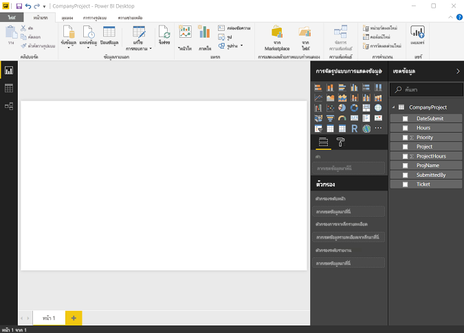
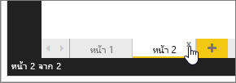
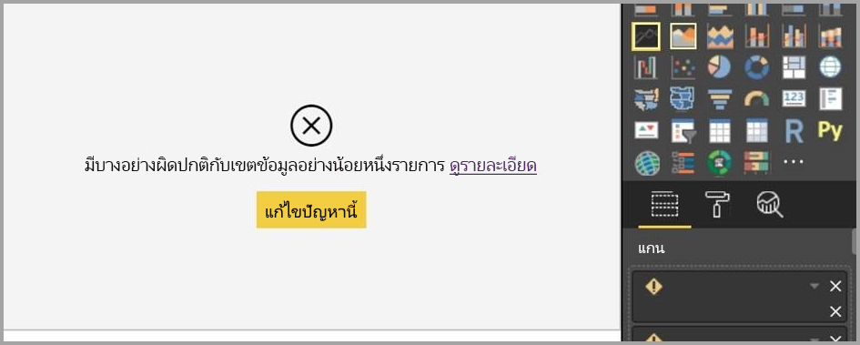

# มุมมองรายงานใน Power BI Desktop
ถ้าคุณเคยทำงานกับ Power BI คุณย่อมทราบว่า Power BI สามารถสร้างรายงานที่แสดงเปอร์สเปกทิฟแบบไดนามิกและข้อมูลเชิงลึกในข้อมูลของคุณได้อย่างง่ายดาย Power BI ยังมีคุณลักษณะขั้นสูงอื่น ๆ ใน Power BI Desktop คุณสามารถสร้างคิวรีขั้นสูง ผสมรวมข้อมูลจากหลายแหล่งข้อมูล สร้างความสัมพันธ์ระหว่างตาราง และอื่น ๆ ได้ด้วย Power BI Desktop

Power BI Desktop ประกอบด้วย **มุมมองรายงาน**ซึ่งคุณสามารถสร้างหน้ารายงานที่มีการแสดงภาพจำนวนกี่หน้าก็ได้ มุมมองรายงานให้ประสบการณ์ในการออกแบบที่ค่อนข้างเหมือนกับมุมมองการแก้ไขของรายงานในบริการ Power BI คุณสามารถย้ายการแสดงภาพไปรอบ ๆ คัดลอกและวาง ผสาน และอื่น ๆ

ความแตกต่างคือ เมื่อใช้ Power BI Desktop คุณสามารถทำงานกับคิวรีของคุณ และสร้างแบบจำลองข้อมูลของคุณ เพื่อให้แน่ใจว่า ข้อมูลรองรับข้อมูลเชิงลึกที่ดีที่สุดในรายงานของคุณ จากนั้นคุณสามารถบันทึกไฟล์ Power BI Desktop ของคุณเมื่อใดก็ตามที่คุณต้องการ ไม่ว่าจะบันทึกลงไดรฟ์ในเครื่อง หรือคลาวด์

## ลองมาดูกัน
เมื่อคุณโหลดข้อมูลใน Power BI Desktop ก่อนอื่นคุณจะเห็น**มุมมองรายงาน**กับพื้นที่ว่างเปล่า

คุณสามารถสลับไปมาระหว่าง**มุมมองรายงาน** **มุมมองข้อมูล**และ**มุมมองความสัมพันธ์**โดยการเลือกไอคอนในแถบนำทางด้านซ้าย

เมื่อคุณเพิ่มข้อมูลแล้ว คุณสามารถเพิ่มเขตข้อมูลไปยังการแสดงภาพแบบใหม่ในพื้นที่ว่าง

เมื่อต้องการเปลี่ยนชนิดของการแสดงภาพ คุณสามารถเลือกได้จากกลุ่ม**การแสดงภาพ**ใน ribbon หรือคุณสามารถคลิกขวา แล้วเลือกชนิดที่แตกต่างจากไอคอน**เปลี่ยนชนิดการแสดงภาพ**

> [!TIP]
> ตรวจสอบให้แน่ใจว่าได้ทดลองกับชนิดการแสดงภาพอื่น การแสดงภาพของคุณควรจะต้องสื่อข้อมูลในข้อมูลของคุณอย่างชัดเจน

รายงานจะมีหน้าเปล่าอย่างน้อยหนึ่งหน้าเพื่อเริ่มต้นใช้งาน หน้าที่ปรากฏในบานหน้าต่างตัวนำทางที่อยู่ทางด้านซ้ายของพื้นที่ว่าง คุณสามารถเพิ่มการเรียงลำดับทั้งหมดของการแสดงภาพลงในหน้า แต่จะต้องไม่เพิ่มมากเกินไป การแสดงภาพมากเกินไปในหน้าจะทำให้ดูยุ่งเหยิง และยากในการค้นหาข้อมูลที่ถูกต้อง คุณสามารถเพิ่มหน้าใหม่ลงในรายงานของคุณ เพียงแค่คลิกที่**หน้าใหม่**บน ribbon

เมื่อต้องการลบหน้า คลิกที่**X**บนแท็บของหน้าที่ด้านล่างของมุมมองรายงาน

> [!NOTE]
> รายงานและการแสดงภาพไม่สามารถปักหมุดลงในแดชบอร์ดจาก Power BI Desktop เมื่อต้องการทำเช่นนั้น คุณจะต้อง[เผยแพร่จาก Power BI Desktop](desktop-upload-desktop-files.md)ไปยังไซต์ Power BI ของคุณ

## คัดลอกและวางระหว่างรายงาน

คุณสามารถใช้ภาพจากรายงาน Power BI Desktop หนึ่งรายงาน และวางลงในรายงานอื่นได้ เพียงแค่ใช้**CTRL + C**บนแป้นพิมพ์ลัดเพื่อคัดลอกภาพรายงานของคุณ จากนั้นใช้**CTRL + V**เพื่อวางภาพลงในรายงาน Power BI Desktop อื่นๆ คุณสามารถเลือกภาพได้ครั้งละหนึ่งการแสดงผล หรือคุณสามารถเลือกภาพทั้งหมดบนหน้าเพื่อคัดลอก จาก นั้นวางลงในรายงาน Power BI Desktop ปลายทาง 

ความสามารถในการคัดลอกและวางภาพจะมีประโยชน์สำหรับผู้ที่สร้าง และอัปเดตรายงานหลายรายงานเป็นประจำ เมื่อคัดลอกระหว่างไฟล์ การตั้งค่าและการจัดรูปแบบที่ตั้งไว้อย่างชัดเจนในบานหน้าต่างการจัดรูปแบบจะดำเนินการไปข้างหน้า ดังนั้นเมื่อคุณได้รับการจัดรูปแบบภาพในแบบที่คุณต้องการแล้ว คุณสามารถคัดลอกและวางภาพนั้นลงในรายงานใหม่และเก็บรักษางานการจัดรูปแบบที่ดีทั้งหมดไว้ได้

หากเขตข้อมูลในแบบจำลองของคุณแตกต่างกัน คุณจะเห็นข้อผิดพลาดบนภาพและคำเตือนเกี่ยวกับเขตข้อมูลนั้นๆ ที่ไม่มีอยู่ ข้อผิดพลาดคล้ายกับสิ่งที่คุณเห็นเมื่อคุณลบเขตข้อมูลในแบบจำลองที่ใช้ภาพอยู่ 

เมื่อต้องการแก้ไขข้อผิดพลาด เพียงแค่แทนเขตข้อมูลที่ใช้งานไม่ได้ด้วยเขตข้อมูลที่คุณต้องการใช้จากแบบจำลองในรายงานที่คุณได้วางภาพไว้ หากคุณกำลังใช้ภาพแบบกำหนดเอง คุณต้องนำเข้าภาพแบบกำหนดเองนั้นลงในรายงานปลายทาง

## ซ่อนหน้ารายงาน

เมื่อคุณสร้างรายงาน คุณสามารถซ่อนหน้าจากรายงาน ซึ่งอาจเป็นประโยชน์ถ้าคุณจำเป็นต้องสร้างข้อมูลพื้นฐานหรือภาพในรายงาน แต่ไม่ต้องการให้ผู้อื่นสามารถมองเห็นหน้าเหล่านั้น เช่น เมื่อคุณสร้างตารางหรือภาพสนับสนุนที่ใช้ในหน้ารายงานอื่น ๆ มีเหตุผลสร้างสรรค์มากมายที่คุณอาจต้องการสร้างหน้ารายงาน และซ่อนหน้ารายงานนั้นจากรายงานที่คุณต้องการเผยแพร่ 

การซ่อนหน้ารายงานเป็นเรื่องง่าย เพียงแค่คลิกขวาบนแท็บหน้ารายงาน และเลือก**ซ่อน**จากเมนูที่ปรากฏขึ้น

คุณควรทราบข้อควรพิจารณาบางประการเมื่อทำการซ่อนหน้ารายงาน

* คุณยังคงสามารถดูมุมมองรายงานที่ซ่อนไว้ใน**Power BI Desktop**แม้ว่าชื่อของหน้าจะเป็นสีเทา ในรูปต่อไปนี้ หน้าที่ 4 ถูกซ่อนอยู่

    

* คุณ*ไม่สามารถ*ดูหน้ารายงานที่ซ่อนไว้เมื่อดูรายงานใน**บริการ Power BI**

* การซ่อนหน้ารายงาน*ไม่ใช่*มาตรการรักษาความปลอดภัย ผู้ใช้ยังคงสามารถเข้าถึงหน้าได้ และเนื้อหาจะยังคงสามารถเข้าถึงได้โดยใช้ตัวเจาะเข้าถึงรายละเอียด และวิธีการอื่น ๆ

* เมื่อซ่อนหน้าแล้ว ในโหมดมุมมองจะไม่แสดงลูกศรการนำทางโหมดมุมอง

