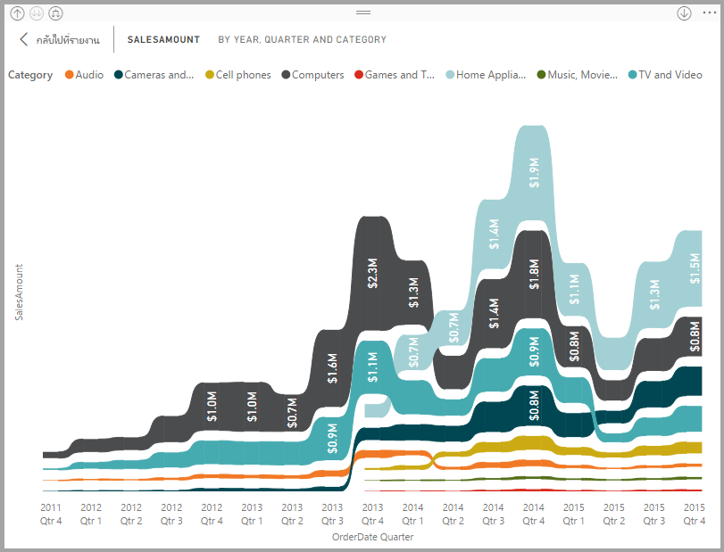
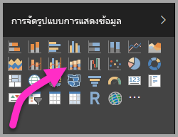
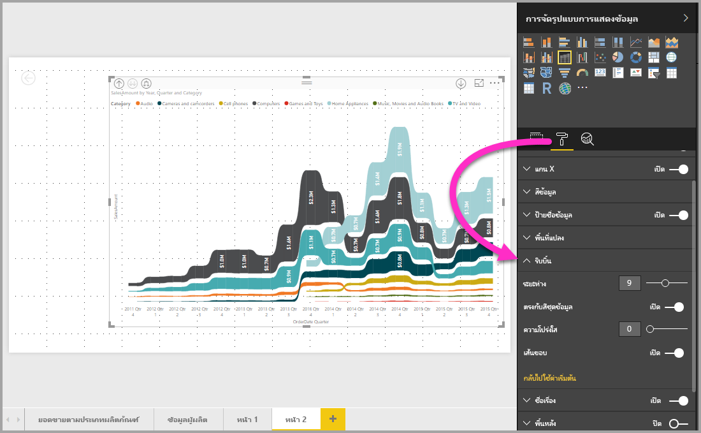

# ใช้แผนภูมิ ribbon ใน Power BI
คุณสามารถใช้แผนภูมิ Ribbon ใน **Power BI** เพื่อแสดงภาพข้อมูล และทราบได้อย่างรวดเร็วว่า ข้อมูลประเภทไหนมีอันดับสูงสุด (มีค่ามากสุด) ได้ แผนภูมิ Ribbon เหมาะกับการแสดงการเปลี่ยนแปลงอันดับ โดยที่ค่าอันดับสูงสุดจะแสดงอยู่ด้านบนสุดของแต่ละช่วงเวลาเสมอ แผนภูมิ Ribbon มีให้ใช้งานใน **Power BI Desktop** ตั้งแต่รุ่นเดือนกันยายน 2017 และในการปรับปรุงรุ่นต่อไปของ**บริการของ Power BI**

## สร้างแผนภูมิ ribbon
เพื่อสร้างแผนภูมิ Ribbon เลือก**แผนภูมิ Ribbon** จากแผง**การแสดงภาพ**

แผนภูมิ ribbon เชื่อมต่อประเภทของข้อมูลผ่านช่วงเวลาที่แสดงภาพอย่างต่อเนื้องโดยชใช้ ribbon ให้คุณมองเห็นว่าแต่ละประเภทถูกจัดอันดับอย่างไรตลอดช่วงของแกน X ของแผนภูมิ (ซึ่งมักจะเป็นแกนเวลา)

## จัดรูปแบบแผนภูมิ ribbon
เมื่อคุณสร้างแผนภูมิ ribbon คุณมีตัวเลือกจัดรูปแบบในส่วน**รูปแบบ**ของบานหน้าต่าง**แสดงภาพ** ตัวเลือกจัดรูปแบบสำหรับแผนภูมิ ribbon จะคล้ายกับตัวเลือกสำหรับแผนภูมิคอลัมน์แบบเรียงซ้อน และมีตัวเลือกจัดรูปแบบเพิ่มเติมที่ใช้กับเฉพาะ ribbon

ตัวเลือกสำหรับแผนภูมิ ribbon เหล่านี้ ให้คุณปรับรูปแบบเหล่านี้ได้:

* **ระยะห่าง** ช่วยให้คุณปรับช่องว่างที่จะแสดงระหว่าง ribbon ตัวเลขเป็นเปอร์เซ็นต์ของความสูงมากสุดของคอลัมน์
* **ตรงกับสีชุดข้อมูล** ช่วยให้คุณสามารถจับคู่สีของ ribbon ให้มีสีเดียวกับของชุดข้อมูล เมื่อปิดค่านี้ ribbon จะเป็นสีเทา
* **โปร่งใส** กำหนดว่า ribbon ต่าง ๆ จะมีความโปร่งใสแค่ไหน ค่าเริ่มต้นคือ 30
* **ขอบ** ให้คุณวางขอบสีเข้มบนด้านบนและด้านล่างของ ribbon ต่าง ๆ ตามค่าเริ่มต้น จะไม่แสดงขอบ

## ขั้นตอนถัดไป
สำหรับข้อมูลเพิ่มเติมเกี่ยวกับ **Power BI Desktop** และวิธีการเริ่มต้นใช้งาน ตรวจสอบบทความต่อไปนี้

* [เริ่มต้นใช้งาน Power BI Desktop](desktop-getting-started.md)
* [ภาพรวมคิวรี ด้วย Power BI Desktop](desktop-query-overview.md)
* [แหล่งข้อมูลใน Power BI Desktop](desktop-data-sources.md)
* [เชื่อมต่อกับข้อมูลใน Power BI Desktop](desktop-connect-to-data.md)
* [จัดรูปร่างและรวมข้อมูลด้วย Power BI Desktop](desktop-shape-and-combine-data.md)
* [งานคิวรี่ที่ใช้บ่อยใน Power BI Desktop](desktop-common-query-tasks.md)   

