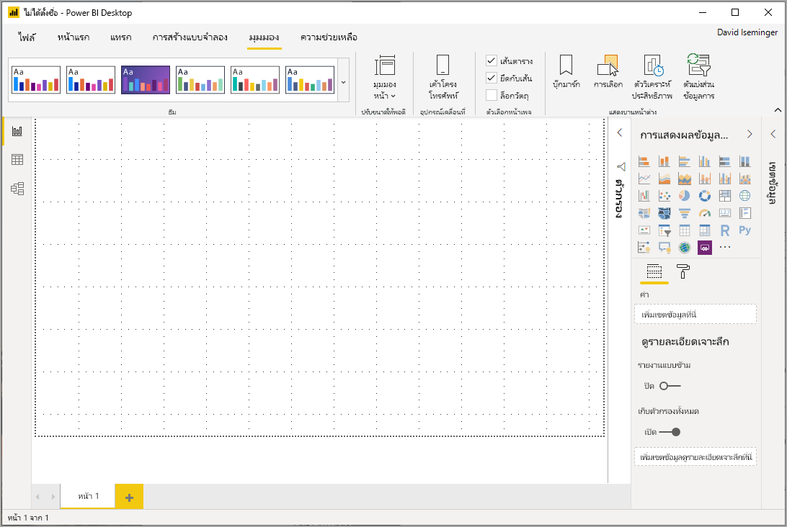
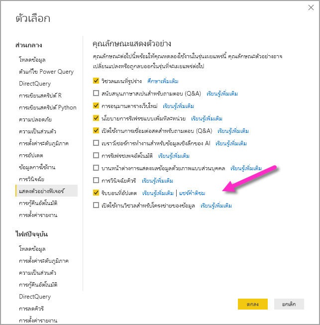
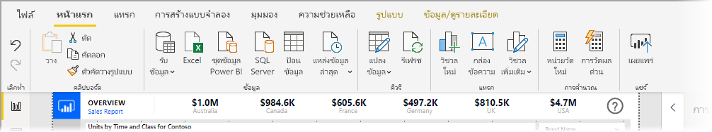
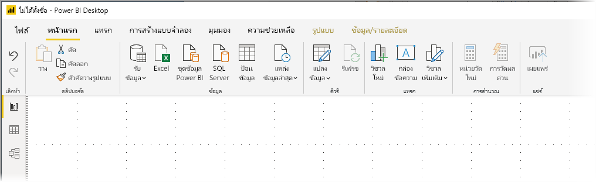
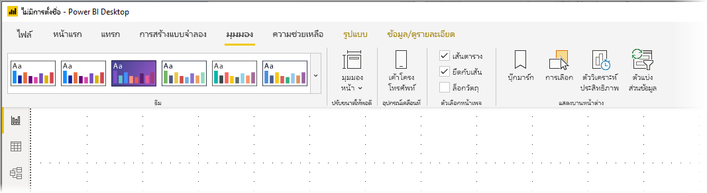
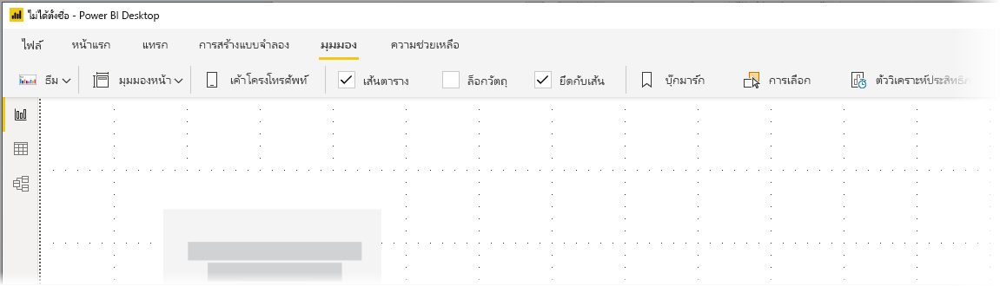

# ใช้ Ribbon ที่ปรับปรุงแล้วใน Power BI Desktop (ตัวอย่าง)

เริ่มต้นด้วยการอัปเดตในเดือนพฤศจิกายน 2019 Power BI Desktop กำลังปรับปรุงริบบิ้นเพื่อให้สอดคล้องกับรูปลักษณ์และการใช้งานกับผลิตภัณฑ์อื่นๆ ของ Microsoft เช่น  Microsoft Office

ริบบิ้นที่อัปเดตเป็นตัวอย่างเพื่อให้เราสามารถรวบรวมข้อเสนอแนะจากผู้ใช้และลูกค้าและตรวจสอบให้แน่ใจว่าประสบการณ์นั้นยอดเยี่ยม เราคาดหวังสองสามเดือนของการแสดงตัวอย่าง คำติชม และการปรับปรุงก่อนที่จะมีการเผยแพร่ริบบิ้น Power BI Desktop ที่อัปเดตแล้วสำหรับความพร้อมใช้งานทั่วไป 

## วิธีการเปิดใช้งานริบบิ้นที่ปรับปรุงแล้ว

ริบบิ้นที่ได้รับการอัพเดตใน Power BI เป็นฟีเจอร์แสดงตัวอย่างและต้องเปิดใช้งาน หากต้องการเปิดใช้งานให้เลือก**ไฟล์ > ตัวเลือกและการตั้งค่า > ตัวเลือก** จากนั้นเลือก**แสดงตัวอย่างฟีเจอร์** จากคอลัมน์ด้านซ้าย ในบานหน้าต่างด้านขวาคือการเลือก**ริบบิ้นที่อัปเดตแล้ว** ทำเครื่องหมายในช่องถัดจาก**ริบบิ้นที่อัปเดตแล้ว**เพื่อเปิดใช้งานฟีเจอร์แสดงตัวอย่าง คุณจะต้องรีสตาร์ท Power BI Desktop เพื่อให้การเปลี่ยนแปลงฟีเจอร์แสดงตัวอย่างมีผล

## ฟีเจอร์ของริบบิ้นใหม่

ประโยชน์ของการอัปเดตริบบิ้นของเรามีจุดมุ่งหมายเพื่อให้ประสบการณ์การใช้งานทั่วทั้ง Power BI Desktop ตลอดจนผลิตภัณฑ์อื่นๆ ของ Microsoft ใช้งานได้ง่ายและเป็นที่คุ้นเคย 

สิทธิประโยชน์เหล่านี้สามารถจัดกลุ่มเป็นประเภทดังต่อไปนี้:

* **รูปลักษณ์ สัมผัส และการจัดระเบียบที่ดีขึ้น** ไอคอนและฟังก์ชันการทำงานในริบบิ้นของ Power BI Desktop ที่อัปเดตแล้วจะถูกจัดให้สอดคล้องกับรูปลักษณ์ความรู้สึกและการจัดระเบียบรายการริบบิ้นที่พบในแอปพลิเคชัน Office

    

* **แกลเลอรีธีมที่ใช้งานง่าย** - แกลเลอรีธีมซึ่งพบได้ใน**มุมมอง** ริบบิ้น ที่มีรูปลักษณ์ที่คุ้นเคยของแกลเลอรีชุดรูปแบบ PowerPoint ดังนั้นรูปภาพในริบบิ้น จะแสดงให้คุณเห็นว่าชุดรูปแบบการเปลี่ยนแปลงนั้นจะมีลักษณะอย่างไรหากนำไปใช้กับรายงานของคุณ เช่น การผสมสีและแบบอักษร 

    

* **เนื้อหาริบบิ้นแบบไดนามิกตามมุมมองของคุณ** - ในริบบิ้น ที่มีอยู่สำหรับ Power BI Desktop ไอคอนหรือคำสั่งที่ไม่พร้อมใช้งานนั้นเป็นสีเทาเพียงอย่างเดียวทำให้เกิดการใช้งานน้อยที่สุด ด้วยริบบิ้นที่อัปเดตไอคอนจะแสดงและจัดเรียงแบบไดนามิกเพื่อให้คุณรู้อยู่เสมอว่าตัวเลือกใดที่พร้อมใช้งานสำหรับคุณ

* **ริบบิ้นเส้นเดียวเมื่อยุบจะช่วยให้คุณประหยัดพื้นที่** - ข้อดีอีกประการของริบบิ้นที่ได้รับการอัพเดตคือความสามารถในการยุบริบบิ้นลงในบรรทัดเดียวโดยแสดงรายการริบบิ้นแบบไดนามิกตามบริบทของคุณ 

    

นอกเหนือจากการเปลี่ยนแปลงที่มองเห็นได้ ริบบิ้นที่อัปเดตแล้วยังช่วยให้เราทำการอัปเดตในอนาคตไปยังริบบิ้นของ Power BI Desktop และเช่นรายการต่อไปนี้:

* สร้างตัวควบคุมที่ยืดหยุ่นและใช้งานง่ายขึ้นในริบบิ้น เช่น แกลเลอรีภาพ
* เพิ่มธีม*สีดำ*และ*สีเทาเข้ม*ของ Office ให้กับ Power BI Desktop
* ปรับปรุงความสามารถในการเข้าถึง

## ขั้นตอนถัดไป
มีข้อมูลหลากหลายประเภทที่คุณสามารถเชื่อมต่อโดยใช้ Power BI Desktop สำหรับข้อมูลเพิ่มเติมเกี่ยวกับแหล่งข้อมูล โปรดดูทรัพยากรต่อไปนี้:

* [Power BI Desktop คืออะไร](desktop-what-is-desktop.md)
* [แหล่งข้อมูลใน Power BI Desktop](desktop-data-sources.md)
* [จัดรูปทรงและรวมข้อมูลด้วย Power BI Desktop](desktop-shape-and-combine-data.md)
* [เชื่อมต่อกับเวิร์กบุ๊ก Excel ใน Power BI Desktop](desktop-connect-excel.md)   
* [ป้อนข้อมูลลงใน Power BI Desktop โดยตรง](desktop-enter-data-directly-into-desktop.md)   

