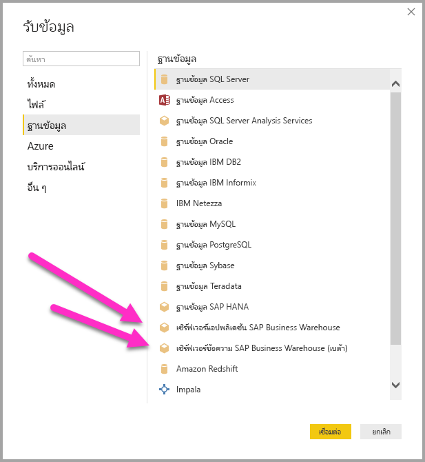
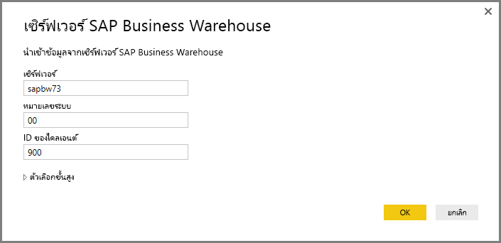
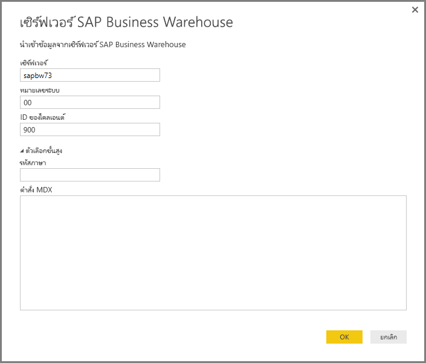
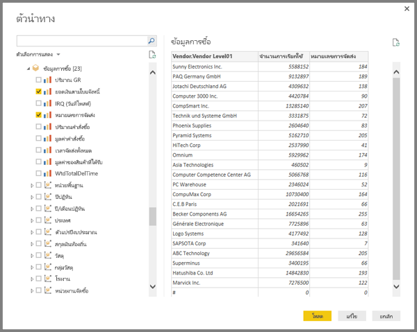
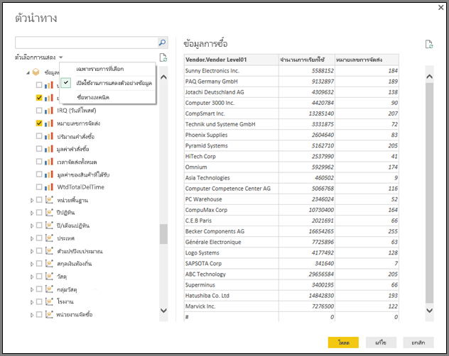
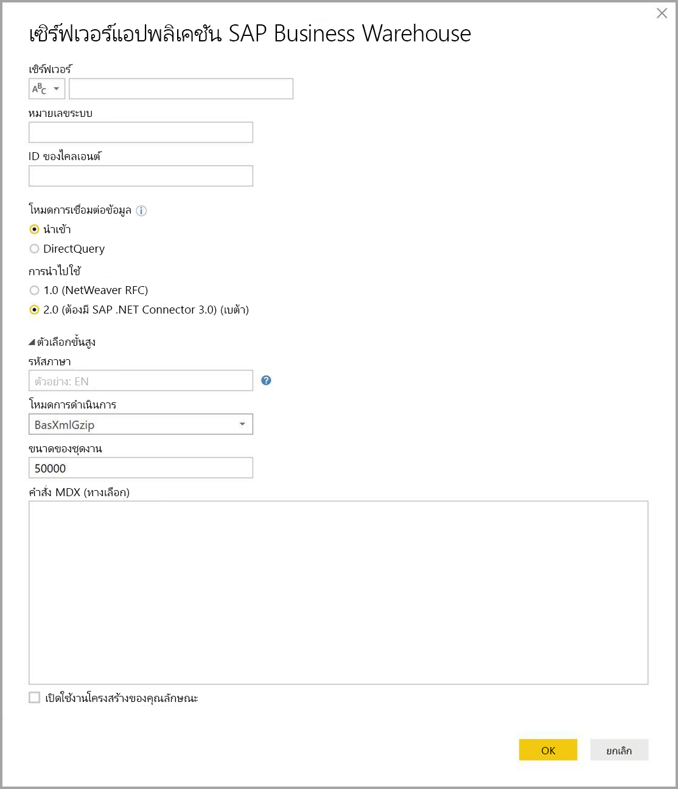
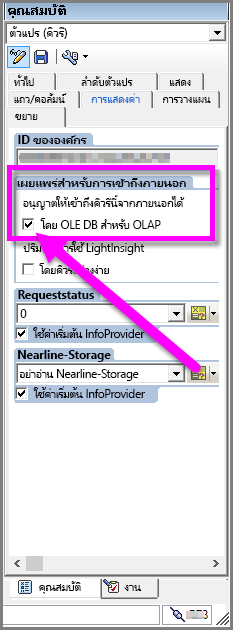

# ใช้ตัวเชื่อมต่อ SAP BW ใน Power BI Desktop (ตัวอย่าง)
ด้วย Power BI Desktop คุณสามารถเข้าถึงข้อมูล **SAP Business Warehouse (BW)** ได้

สำหรับข้อมูลเกี่ยวกับว่า ลูกค้า SAP จะได้ประโยชน์จากการเชื่อมต่อ Power BI กับระบบ SAP Business Warehouse (BW) ที่มีอยู่ของพวกเขาอย่างไร ดูที่[เอกสารทางเทคนิค Power BI และ SAP BW](https://aka.ms/powerbiandsapbw) สำหรับรายละเอียดเกี่ยวกับการใช้ DirectQuery ด้วย SAP BW ดูบทความ[DirectQuery และ SAP Business Warehouse (BW)](desktop-directquery-sap-bw.md)

เริ่มด้วยการเผยแพร่ **Power BI Desktop** เดือนมิถุนายน ค.ศ. 2018 (และโดยทั่วไปจะมีที่เผยแพร่ในเดือนตุลาคม ค.ศ. 2018) คุณสามารถใช้ตัวเชื่อมต่อ SAP BW กับการใช้งานที่มีการปรับปรุงประสิทธิภาพและความสามารถที่มากมาย เวอร์ชันของตัวเชื่อมต่อ SAP BW ที่อัปเดตนี้ พัฒนาโดย Microsoft และเรียกว่า **Implementation 2.0** คุณสามารถเลือกเวอร์ชั่น 1 (v1) ของ**ตัวเชื่อมต่อ SAP BW** หรือ**ตัวเชื่อมต่อ Implementation 2.0 SAP**  ได้ ส่วนต่อไปนี้จะอธิบายการติดตั้งแต่ละเวอร์ชันตามลำดับ คุณสามารถเลือกตัวเชื่อมต่อตัวใดตัวหนึ่ง เพื่อเชื่อมต่อกับ SAP BW จาก Power BI Desktop ได้

เราแนะนำให้คุณใช้**ตัวเชื่อมต่อ SAP Implementation 2.0** ถ้าเป็นไปได้

## การติดตั้งเวอร์ชั่น 1 ของตัวเชื่อมต่อ SAP BW
เราแนะนำให้ใช้ตัวเชื่อมต่อ SAP Implementation 2.0 ถ้าทำได้ (ดูคำแนะนำในส่วนต่อไป) ส่วนนี้จะอธิบายการติดตั้งเวอร์ชั่น 1 ของ**ตัวเชื่อมต่อ SAP BW** ซึ่งคุณสามารถติดตั้งโดยทำตามขั้นตอนการติดตั้งต่อไปนี้:

1. ติดตั้งไลบรารี **SAP NetWeaver** บนเครื่องคอมพิวเตอร์ของคุณ คุณสามารถเรียกดูไลบรารี **SAP Netweaver** จากผู้ดูแลระบบ SAP ของคุณ หรือดูได้โดยตรงจาก[ศูนย์ดาวน์โหลดซอฟต์แวร์ SAP](https://support.sap.com/swdc) เนื่องจาก**ศูนย์ดาวน์โหลดซอฟต์แวร์ SAP**นั้นมีการเปลี่ยนแปลงโครงสร้างบ่อยครั้ง คำแนะนำการนำทางที่เฉพาะเจาะจงมากกว่านี้ในเว็บไซต์ดังกล่าวจึงไม่พร้อมใช้งาน โดยปกติแล้วไลบรารี **SAP NetWeaver** จะรวมอยู่ในการติดตั้งเครื่องมือลูกค้า SAP ด้วย
   
   คุณอาจสามารถค้นหา*บันทึกย่อ SAP #1025361*เพื่อให้ได้ตำแหน่งการดาวน์โหลดสำหรับเวอร์ชันล่าสุดได้ ตรวจสอบให้แน่ใจว่าสถาปัตยกรรมสำหรับไลบรารี**SAP NetWeaver** (32 บิต หรือ 64 บิต) ตรงกับการติดตั้ง**Power BI Desktop**ของคุณ จากนั้นติดตั้งไฟล์ทั้งหมดที่รวมอยู่ใน**SAP NetWeaver RFC SDK** ตามบันทึกย่อ SAP
2. กล่องโต้ตอบ**การรับข้อมูล**รวมรายการที่ใส่เข้าไปสำหรับ**เซิร์ฟเวอร์แอปพลิเคชันของ SAP Business Warehouse**และ**เซิร์ฟเวอร์ข้อความ SAP Business Warehouse**ในประเภท**ฐานข้อมูล** 
   
   

## การติดตั้งของตัวเชื่อมต่อ SAP Implementation 2.0

**Implementation 2.0** ของตัวเชื่อมต่อ SAP ต้องการ SAP .NET Connector 3.0 คุณสามารถ[ดาวน์โหลด SAP .NET Connector 3.0](https://support.sap.com/en/product/connectors/msnet.html) จากเว็บไซต์ของ SAP ด้วยลิงก์ต่อไปนี้:

* [SAP .NET Connector 3.0](https://support.sap.com/en/product/connectors/msnet.html)

การเข้าถึงการดาวน์โหลดจำเป็นต้องมี S-user ที่ถูกต้อง ลูกค้าจะแนะนำให้ติดต่อกับทีม SAP Basis เพื่อรับ SAP .NET Connector 3.0 

ตัวเชื่อมต่อมาในเวอร์ชัน 32 บิต และ 64 บิต และผู้ใช้*ต้อง*เลือกเวอร์ชันที่ตรงกับการติดตั้ง Power BI Desktop ของพวกเขา ในขณะที่เขียน เว็บไซต์แสดงไว้สองเวอร์ชัน (สำหรับ .NET Framework 4.0):

* ตัวเชื่อมต่อ SAP สำหรับ Microsoft.NET 3.0.20.0 สำหรับ Windows 32 บิต (x86) เป็นไฟล์ zip (6.896 KB), 16 มกราคม 2018
* ตัวเชื่อมต่อ SAP สำหรับ Microsoft.NET 3.0.20.0 สำหรับ Windows 64 บิต (x64) เป็นไฟล์ zip (7.180 KB), 16 มกราคม 2018

เมื่อติดตั้ง ในหน้าต่าง **Optional setup steps** ตรวจสอบให้แน่ใจว่า คุณได้เลือกตัวเลือก *Install assemblies to GAC* ดังที่แสดงในรูปต่อไปนี้

> [!NOTE]
> การใช้งานเวอร์ชั่นแรกของ SAP BW จำเป็นต้องมี Netweaver DLL แต่ถ้าคุณกำลังใช้ Implementation 2.0 ของตัวเชื่อมต่อ SAP และไม่ได้ใช้เวอร์ชันแรก ไม่จำเป็นต้องมี Netweaver DLL

## คุณลักษณะของเวอร์ชั่น 1 ของตัวเชื่อมต่อ SAP BW
เวอร์ชั่น 1 ของ**ตัวเชื่อมต่อ SAP BW** ใน Power BI Desktop ให้คุณนำเข้าข้อมูลจากคิวบ์**เซิร์ฟเวอร์ SAP Business Warehouse** ของคุณ หรือใช้ DirectQuery 

เพื่อเรียนรู้เพิ่มเติมเกี่ยวกับ**ตัวเชื่อมต่อแบนด์วิดท์ SAP**และวิธีการใช้งานกับ DirectQuery ดูบทความ[DirectQuery และ SAP Business Warehouse (แบนด์วิดท์)](desktop-directquery-sap-bw.md)

เมื่อเชื่อมต่อ คุณต้องระบุ*เซิร์ฟเวอร์* *หมายเลขระบบ*และ*ID ลูกค้า*เมื่อต้องสร้างการเชื่อมต่อดังกล่าว

คุณยังสามารถระบุ**ตัวเลือกขั้นสูง**เพิ่มเติมได้อีกสองตัว: รหัสภาษา และคำสั่ง MDX แบบกำหนดเองเพื่อเรียกใช้กับเซิร์ฟเวอร์ที่ระบุ

ถ้าไม่มีการระบุคำสั่ง MDX ระบบจะแสดงด้วยหน้าต่าง**ตัวนำทาง** ซึ่งแสดงรายการของคิวบ์ที่พร้อมใช้งานในเซิร์ฟเวอร์ ซึ่งมีตัวเลือกที่จะเจาะลึกลง แล้วเลือกรายการจากคิวบ์ รวมถึงมิติ และ หน่วยวัดที่พร้อมใช้งาน Power BI แสดงแบบสอบถามและคิวบ์ที่แสดงผลโดย[แบนด์วิดท์ส่วนติดต่อการวิเคราะห์แบบเปิด OLAP BAPIs](https://help.sap.com/saphelp_nw70/helpdata/en/d9/ed8c3c59021315e10000000a114084/content.htm)

เมื่อคุณเลือกอย่างน้อยหนึ่งรายการจากเซิร์ฟเวอร์ ตัวอย่างของตารางผลลัพธ์ถูกสร้างขึ้นตามการเลือก

นอกจากนี้ หน้าต่าง**ตัวนำทาง**ยังมีบาง**ตัวเลือกการแสดง**ที่ช่วยให้คุณสามารถทำสิ่งต่อไปนี้:

* **แสดงผล *รายการที่เลือกเท่านั้น* เทียบกับ *รายการทั้งหมด* (มุมมองเริ่มต้น):** ตัวเลือกนี้จะมีประโยชน์สำหรับการตรวจสอบรายการที่เลือกชุดสุดท้าย วิธีการทางเลือกในการดูส่วนนี้คือการเลือก*ชื่อคอลัมน์*ในพื้นที่การ*แสดงตัวอย่าง*
* **เปิดใช้งานการแสดงตัวอย่างข้อมูล (ลักษณะการทำงานตามค่าเริ่มต้น):** นอกจากนี้ คุณยังสามารถควบคุมว่าควรแสดงตัวอย่างข้อมูลในกล่องโต้ตอบนี้หรือไม่ การปิดใช้งานการแสดงตัวอย่างข้อมูลช่วยลดปริมาณการเรียกเซิร์ฟเวอร์ เนื่องจากจะไม่ร้องขอข้อมูลสำหรับตัวอย่างอีกต่อไป
* **ชื่อทางเทคนิค:** SAP BW รองรับแนวคิดของ*ชื่อทางเทคนิค*สำหรับออบเจ็กต์ภายในคิวบ์ ชื่อทางเทคนิคอนุญาตให้เป็นเจ้าของคิวบ์แสดงชื่อ*ผู้ใช้ที่เป็นมิตร*สำหรับวัตถุคิวบ์ ซึ่งตรงข้ามกับ*ชื่อจริง*ที่แสดงสำหรับวัตถุเหล่านั้นในคิวบ์

หลังจากเลือกวัตถุทั้งหมดที่จำเป็นใน**ตัวนำทาง**แล้ว คุณสามารถตัดสินใจว่าต้องทำสิ่งใดต่อไปโดยการเลือกหนึ่งในปุ่มต่อไปนี้ที่ด้านล่างของหน้าต่าง**ตัวนำทาง**:

* เลือกตัวเปิด**การโหลด**ที่โหลดทั้งชุดของแถวสำหรับตารางผลลัพธ์ลงในแบบจำลองข้อมูล Power BI Desktop จากนั้นนำคุณไปยังมุมมอง**รายงาน**ที่คุณสามารถเริ่มสร้างภาพจากข้อมูล หรือทำการปรับเปลี่ยนเพิ่มเติมโดยใช้มุมมอง**ข้อมูล**หรือ**ความสัมพันธ์**
* การเลือก**แก้ไข**จะนำ**ตัวแก้ไขแบบสอบถาม**ขึ้นมา ซึ่งคุณสามารถดำเนินการแปลงข้อมูลเพิ่มเติมและกรองขั้นตอนต่าง ๆ ก่อนทั้งชุดของแถวจะถูกนำไปในแบบจำลองข้อมูล Power BI Desktop

นอกเหนือจากการนำเข้าข้อมูลจากคิวบ์**แบนด์วิดท์ SAP** โปรดจำไว้ว่าคุณยังสามารถนำเข้าข้อมูลจากหลากหลายแหล่งข้อมูลใน Power BI Desktop จากนั้น คุณสามารถรวมเข้าด้วยกันลงในรายงานเดียว ซึ่งแสดงสถานการณ์สมมติที่น่าสนใจทุกประเภทสำหรับการรายงานและการวิเคราะห์ เพิ่มเติมจากข้อมูล**แบนด์วิดท์ SAP**

## การใช้ตัวเชื่อมต่อ SAP BW Implementation 2.0

คุณต้องสร้างการเชื่อมต่อใหม่เพื่อใช้ Implementation 2.0 ของตัวเชื่อมต่อ SAP BW เพื่อสร้างการเชื่อมต่อใหม่ ทำตามขั้นตอนต่อไปนี้

1. จากหน้าต่าง**รับข้อมูล** เลือก**เซิร์ฟเวอร์แอปพลิเคชันของ SAP Business Warehouse** หรือ **เซิร์ฟเวอร์ข้อความของ SAP Business Warehouse**

2. คุณจะเห็นกล่องโต้ตอบการเชื่อมต่อใหม่ ซึ่งมีการใช้งานตัวเชื่อมต่อให้เลือก เลือก **Implementation 2.0** ดังที่แสดงในรูปต่อไปนี้ เปิดใช้งานโหมดการดำเนินการ, ขนาดของชุดงาน และ เปิดใช้งานโครงสร้างของคุณลักษณะ

    

3. เลือก**ตกลง** จากนั้น ประสบการณ์การใช้งาน**ตัวนำทาง**จะเหมือนกับที่อธิบายไว้ในหัวข้อก่อนหน้านี้ในเรื่องตัวเชื่อมต่อ SAP BW เวอร์ชั่น 1 

### ตัวเลือกใหม่สำหรับ Implementation 2.0 

Implementation 2.0 สนับสนุนตัวเลือกต่อไปนี้:

1. **ExecutionMode** (โหมดการดำเนินการ) - ระบุอินเทอร์เฟซ MDX ที่ใช้ในการดำเนินการคิวรีบนเซิร์ฟเวอร์ ตัวเลือกที่เป็นไปได้มีดังนี้:

        a. SapBusinessWarehouseExecutionMode.BasXml
        b. SapBusinessWarehouseExecutionMode.BasXmlGzip
        c. SapBusinessWarehouseExecutionMode.DataStream

    ค่าเริ่มต้นสำหรับตัวเลือกนี้คือ SapBusinessWarehouseExecutionMode.BasXmlGzip

    การใช้ *SapBusinessWarehouseExecutionMode.BasXmlGzip* อาจช่วยปรับปรุงประสิทธิภาพการทำงาน เมื่อพบปัญหาเวลาแฝงสูงหากใช้ชุดข้อมูลใหญ่

2. **BatchSize** (ขนาดของชุดงาน) - ระบุจำนวนแถวสูงสุดที่จะถูกดึงข้อมูลในแต่ละครั้ง เมื่อดำเนินการคำสั่ง MDX จำนวนแถวที่มีขนาดเล็ก จะทำให้จำนวนครั้งที่เรียกไปยังเซิร์ฟเวอร์มากขึ้น เมื่อดึงข้อมูลจากชุดข้อมูลขนาดใหญ่ จำนวนแถวที่มีขนาดใหญ่อาจปรับปรุงประสิทธิภาพการทำงาน แต่อาจก่อให้เกิดปัญหาหน่วยความจำบนเซิร์ฟเวอร์ SAP BW ค่าเริ่มต้นคือ 50000 แถว

3. **EnableStructures** (เปิดใช้งานโครงสร้าง) - ค่าตรรกะที่ระบุว่า มีรับรู้โครงสร้างลักษณะหรือไม่ ค่าเริ่มต้นสำหรับตัวเลือกนี้เป็นเท็จ มีผลต่อรายการของวัตถุที่มีให้เลือก ไม่สนับสนุนในโหมดคิวรีในระบบ

ตัวเลือก **ScaleMeasures** ไม่สนับสนุนในการใช้งานนี้ ลักษณะการทำงานตอนนี้ จะเหมือนกับการตั้งค่า *ScaleMeasures = false* ซึ่งก็คือ แสดงค่าที่ยังไม่ได้สเกลเสมอ

### การปรับปรุงเพิ่มเติมสำหรับ Implementation 2.0 

รายการหัวข้อต่อไปนี้อธิบายการปรับปรุงเพิ่มเติมที่มาพร้อมกับการใช้งานใหม่นี้:

* ปรับปรุงประสิทธิภาพ
* ความสามารถในการดึงข้อมูลหลายล้านแถว และการปรับให้เหมาะสมผ่านพารามิเตอร์ ขนาดของชุดงาน
* ความสามารถในการสลับโหมดการดำเนินการ
* สนับสนุนโหมดการบีบอัด ซึ่งประโยชน์สำหรับการเชื่อมต่อที่มีเวลาแฝงสูง หรือชุดข้อมูลขนาดใหญ่
* ปรับปรุงการตรวจจับตัวแปรวันที่
* [ทดลอง] แสดงมิติของวันที่ (ABAP ชนิด DATS) และเวลา (ABAP ชนิด TIMS) ให้เป็นวันที่และเวลาตามลำดับ แทนที่จะเป็นค่าข้อความ
* จัดการข้อยกเว้นได้ดียิ่งขึ้น ข้อผิดพลาดที่เกิดขึ้นในการเรียก BAPI จะปรากฏขึ้นขณะนี้
* การพับคอลัมน์ในโหมด BasXml และ BasXmlGzip ตัวอย่างเช่น ถ้าคิวรี MDX ที่สร้างขึ้นดึงข้อมูล 40 คอลัมน์ แต่ส่วนที่เลือกปัจจุบันต้องการเพียง 10 คอลัมน์ คำขอนี้จะถูกส่งผ่านไปยังเซิร์ฟเวอร์เพื่อดึงชุดข้อมูลที่มีขนาดเล็กลง

### การเปลี่ยนรายงานที่มีอยู่ให้ใช้ Implementation 2.0 

การเปลี่ยนรายงานที่มีอยู่ให้ใช้ **Implementation 2.0** ทำได้เฉพาะในโหมดนำเข้า และต้องทำขั้นตอนต่อไปนี้ด้วยตนเอง

1. เปิดรายงานที่มีอยู่ เลือก**แก้ไขคิวรี**ใน ribbon แล้วเลือกคิวรี SAP Business Warehouse คุณต้องการปรับปรุง

2. คลิกขวาที่คิวรีแล้วเลือก**เครื่องมือแก้ไขขั้นสูง**

3. ใน**เครื่องมือแก้ไขขั้นสูง** เปลี่ยนการเรียก SapBusinessWarehouse.Cubes เป็นดังนี้: 

    a. พิจารณาว่า คิวรีมีเรกคอร์ดตัวเลือกอยู่แล้วหรือไม่ เช่นสิ่งที่แสดงในตัวอย่างต่อไปนี้:

    

    b. ถ้ามี ให้เพิ่มตัวเลือก Implementation 2.0 และเอาตัวเลือก ScaleMeasures ออก ถ้ามี ดังที่แสดงต่อไปนี้:

    

    c. ถ้าคิวรียังไม่มีเรกคอร์ดตัวเลือก เพียงแค่เพิ่มตัวเลือกลงไป ตัวอย่าง ถ้าคิวรีมีต่อไปนี้:

    

    d. เพียงแค่เปลี่ยนเป็น:

    

4. มีความพยายามทุกทางเพื่อทำให้ Implementation 2.0 ของตัวเชื่อมต่อ SAP BW เข้ากันได้กับเวอร์ชั่น 1 ของตัวเชื่อมต่อ SAP BW แต่อาจมีความแตกต่างบางเรื่อง เนื่องจาก MDX ของ SAP BW ใช้โหมดการดำเนินการต่างกัน เพื่อแก้ไขปัญหาที่เกิดจากความแตกต่าง ลองสลับโหมดการดำเนินการดู

## การแก้ไขปัญหา
ส่วนนี้แสดงสถานการณ์การแก้ไขปัญหา (และทางแก้) สำหรับการทำงานกับตัวเชื่อมต่อ **SAP BW**

1. ข้อมูลตัวเลขจาก**แบนด์วิดท์ SAP**ส่งกลับจุดทศนิยมแทนการส่งเครื่องหมายจุลภาค ตัวอย่างเช่น 1000000 ถูกส่งกลับเป็น 1.000.000
   
   **แบนด์วิดท์ SAP**ส่งกลับข้อมูลทศนิยมด้วย *,* (เครื่องหมายจุลภาค) หรือ *.* อย่างใดอย่างหนึ่ง (จุด) เป็นตัวคั่นทศนิยม เมื่อต้องการระบุควรใช้**แบนด์วิดท์ SAP**ใดสำหรับตัวคั่นทศนิยม โปรแกรมควบคุมที่ใช้โดย**Power BI Desktop**เรียก*BAPI_USER_GET_DETAIL* การเรียกนี้ส่งกลับโครงสร้างที่เรียกว่า**ค่าเริ่มต้น**ซึ่งมีช่องข้อมูลที่เรียกว่า*DCPFM*ที่จัดเก็บ*สัญกรณ์แบบทศนิยม* ซึ่งจะใช้หนึ่งในสามค่าดังต่อไปนี้:
   
       ‘ ‘ (space) = Decimal point is comma: N.NNN,NN
       'X' = Decimal point is period: N,NNN.NN
       'Y' = Decimal point is N NNN NNN,NN
   
   ลูกค้าที่ีรายงานปัญหานี้ที่พบว่าการเรียก*BAPI_USER_GET_DETAIL*ล้มเหลวสำหรับผู้ใช้บางราย (ผู้ใช้ที่แสดงข้อมูลไม่ถูกต้อง) และมีข้อความข้อผิดพลาดที่คล้ายกับต่อไปนี้:
   
       You are not authorized to display users in group TI:
           <item>
               <TYPE>E</TYPE>
               <ID>01</ID>
               <NUMBER>512</NUMBER>
               <MESSAGE>You are not authorized to display users in group TI</MESSAGE>
               <LOG_NO/>
               <LOG_MSG_NO>000000</LOG_MSG_NO>
               <MESSAGE_V1>TI</MESSAGE_V1>
               <MESSAGE_V2/>
               <MESSAGE_V3/>
               <MESSAGE_V4/>
               <PARAMETER/>
               <ROW>0</ROW>
               <FIELD>BNAME</FIELD>
               <SYSTEM>CLNTPW1400</SYSTEM>
           </item>
   
   เมื่อต้องแก้ไขข้อผิดพลาดนี้ ผู้ใช้ต้องขอให้ผู้ดูแลระบบ SAP อนุญาตให้ผู้ใช้ SAPBW ที่ถูกใช้ใน Power BI มีสิทธิ์ในการดำเนินการ*BAPI_USER_GET_DETAIL* ควรตรวจสอบว่าผู้ใช้นั้นมีค่า*DCPFM*ที่กำหนดตามที่อธิบายไว้ก่อนหน้านี้ในแนวทางการแก้ไขปัญหาหรือไม่
   
2. **การเชื่อมต่อสำหรับแบบสอบถาม SAP BEx**
   
   คุณสามารถดำเนินการแบบสอบถาม**BEx**ใน Power BI Desktop ได้โดยการเปิดใช้งานคุณสมบัติเฉพาะ ดังที่แสดงในรูปต่อไปนี้:
   
   
   
3. หน้าต่าง**ตัวนำทาง**จะไม่แสดงตัวอย่างข้อมูล แต่จะให้ข้อมูลที่*ไม่ได้ตั้งค่าการอ้างอิงวัตถุให้กับอินสแตนซ์ของวัตถุ*ข้อผิดพลาด
   
   ผู้ใช้ SAP ต้องระบุฟังก์ชันโมดูล BAPI ก่อนถึงจะได้รับเมตาดาต้า และสามารถรับข้อมูลจากผู้ให้บริการข้อมูลของ SAP BW's ได้ สิ่งเหล่านี้รวมถึง:
   * BAPI_MDPROVIDER_GET_CATALOGS
   * BAPI_MDPROVIDER_GET_CUBES
   * BAPI_MDPROVIDER_GET_DIMENSIONS
   * BAPI_MDPROVIDER_GET_HIERARCHYS
   * BAPI_MDPROVIDER_GET_LEVELS
   * BAPI_MDPROVIDER_GET_MEASURES
   * BAPI_MDPROVIDER_GET_MEMBERS
   * BAPI_MDPROVIDER_GET_VARIABLES
   * BAPI_IOBJ_GETDETAIL

   ในการแก้ไขปัญหานี้ ต้องตรวจสอบยืนยันว่าผู้ใช้คนนั้น ๆ มีสิทธิ์เข้าถึง*MDPROVIDER*โมดูลและ*BAPI_IOBJ_GETDETAIL* ในการแก้ไขปัญหานี้หรือปัญหาที่คล้ายกัน ให้เลือก*เปิดใช้งานการติดตาม*ในหน้าต่างการ*การวินิจฉัย*ซึ่งเป็นตัวเลือก *ภายใน Power BI Desktop* พยายามรับข้อมูลจาก SAP BW ในขณะที่เปิดใช้งานการติดตามไปด้วย และตรวจสอบร่อยรอยของไฟล์เพื่อให้ทราบรายละเอียดเพิ่มเติม

## ฝ่ายสนับสนุนการเชื่อมต่อ SAP BW

ตารางต่อไปนี้แสดงรายละเอียดการสนับสนุนปัจจุบันสำหรับ SAP BW

|ผลิตภัณฑ์  |โหมด  |การรับรองความถูกต้อง  |ตัวเชื่อมต่อ  |SNC ไลบรารี  |สนับสนุน  |
|---------|---------|---------|---------|---------|---------|
|Power BI Desktop     |ใดๆ         | ผู้ใช้งาน / รหัสผ่าน  | เซิร์ฟเวอร์ของแอปพลิเคชัน | N/A  | ใช่  |
|Power BI Desktop     |ใดๆ         | Windows          | เซิร์ฟเวอร์ของแอปพลิเคชัน | sapcrypto + gsskrb5/gx64krb5  | ใช่  |
|Power BI Desktop     |ใดๆ         | Windows ผ่านทางการเลียนแบบ | เซิร์ฟเวอร์ของแอปพลิเคชัน | sapcrypto + gsskrb5/gx64krb5  | ใช่  |
|Power BI Desktop     |ใดๆ         | ผู้ใช้งาน / รหัสผ่าน        | เซิร์ฟเวอร์ข้อความ | N/A  | ใช่  |
|Power BI Desktop     |ใดๆ         | Windows        | เซิร์ฟเวอร์ข้อความ | sapcrypto + gsskrb5/gx64krb5  | ใช่  |
|Power BI Desktop     |ใดๆ         | Windows ผ่านทางการเลียนแบบ | เซิร์ฟเวอร์ข้อความ | sapcrypto + gsskrb5/gx64krb5  | ใช่  |
|เกตเวย์ Power BI     |นำเข้า      | เหมือนกับ Power BI Desktop |         |   |   |
|เกตเวย์ Power BI     |DirectQuery | ผู้ใช้งาน / รหัสผ่าน        | เซิร์ฟเวอร์ของแอปพลิเคชัน | N/A  | ใช่  |
|เกตเวย์ Power BI     |DirectQuery | Windows ผ่านทางการเลียนแบบ (กำหนดผู้ใชงาน้ ไม่มี SSO) | เซิร์ฟเวอร์ของแอปพลิเคชัน | sapcrypto + gsskrb5/gx64krb5  | ใช่  |
|เกตเวย์ Power BI     |DirectQuery | ใช้ SSO ผ่านทาง Kerberos สำหรับตัวเลือกคิวรี DirectQuery | เซิร์ฟเวอร์ของแอปพลิเคชัน | *สำหรับ* gsskrb5/gx64krb5เท่านั้น   | ใช่  |
|เกตเวย์ Power BI     |DirectQuery | ผู้ใช้งาน / รหัสผ่าน        | เซิร์ฟเวอร์ข้อความ | N/A  | ใช่  |
|เกตเวย์ Power BI     |DirectQuery | Windows ผ่านทางการเลียนแบบ (กำหนดผู้ใชงาน้ ไม่มี SSO) | เซิร์ฟเวอร์ข้อความ | sapcrypto + gsskrb5/gx64krb5  | ใช่  |
|เกตเวย์ Power BI     |DirectQuery | ใช้ SSO ผ่านทาง Kerberos สำหรับตัวเลือกคิวรี DirectQuery | เซิร์ฟเวอร์ข้อความ | sapcrypto + gsskrb5/gx64krb5  | ไม่ใช่  |

## ขั้นตอนถัดไป
สำหรับข้อมูลเพิ่มเติมเกี่ยวกับ SAP และ DirectQuery ลองดูทรัพยากรต่อไปนี้:

* [DirectQuery และ SAP HANA](desktop-directquery-sap-hana.md)
* [DirectQuery และ SAP Business Warehouse (BW)](desktop-directquery-sap-bw.md)
* [DirectQuery ใน Power BI](desktop-directquery-about.md)
* [แหล่งข้อมูลที่สนับสนุนโดย DirectQuery](desktop-directquery-data-sources.md)
* [เอกสารทางเทคนิค Power BI และ SAP BW](https://aka.ms/powerbiandsapbw)
