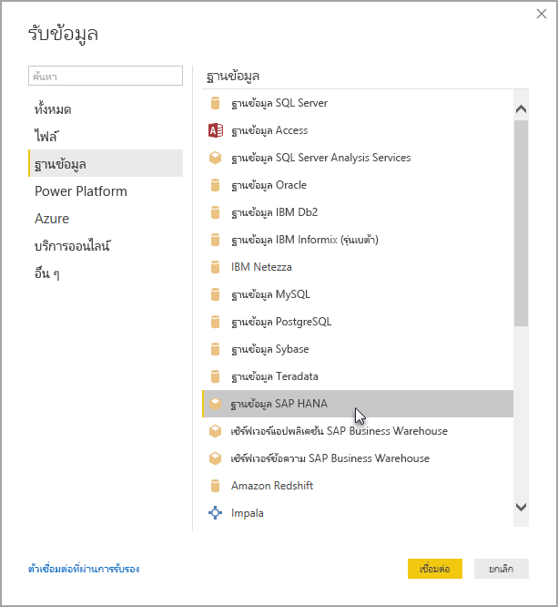

# เชื่อมต่อกับฐานข้อมูลของ SAP HANA ใน Power BI Desktop

ตอนนี้คุณสามารถเข้าถึงฐานข้อมูล*SAP HANA*ได้ด้วย Power BI Desktop ในการใช้ SAP HANA คุณต้องมีไดรเวอร์ SAP HANA ODBC ติดตั้งอยู่ในคอมพิวเตอร์ไคลเอนต์ในพื้นที่เพื่อให้การเชื่อมต่อข้อมูล SAP HANA ของ Power BI Desktop ทำงานได้อย่างถูกต้อง คุณสามารถดาวน์โหลดเครื่องมือ SAP HANA Client ได้จาก [เครื่องมือการพัฒนาของ SAP](https://tools.hana.ondemand.com/#hanatools) ซึ่งมีโปรแกรมควบคุม ODBC ที่จำเป็น หรือ คุณสามารถรับได้จาก [ศูนย์ดาวน์โหลดซอฟต์แวร์ SAP](https://support.sap.com/en/my-support/software-downloads.html) ในพอร์ทัลซอฟต์แวร์ ให้ค้นหา *SAP HANA CLIENT* สำหรับคอมพิวเตอร์ที่ใช้ Windows เนื่องจากศูนย์ดาวน์โหลดซอฟต์แวร์ SAP นั้นมีการเปลี่ยนแปลงโครงสร้างบ่อยครั้ง คำแนะนำการนำทางที่เฉพาะเจาะจงมากกว่านี้ในเว็บไซต์ดังกล่าวจึงไม่พร้อมใช้งาน

ในการเชื่อมต่อกับฐานข้อมูล SAP HANA ให้เลือก **รับข้อมูล** เลือก **ฐานข้อมูล** > **ฐานข้อมูล SAP HANA** จากนั้นเลือก **เชื่อมต่อ**:

เมื่อคุณเชื่อมต่อกับฐานข้อมูล SAP HANA ให้ระบุชื่อเซิร์ฟเวอร์ จากนั้นจากดรอปดาวน์และกล่องป้อนข้อมูล ให้ระบุพอร์ต

สำหรับรุ่นเผยแพร่นี้ SAP HANA ในโหมด [DirectQuery](desktop-directquery-sap-hana.md) ได้รับการสนับสนุนใน Power BI Desktop และบริการ Power BI คุณสามารถเผยแพร่และอัปโหลดรายงานที่ใช้ SAP HANA ในโหมด DirectQuery ไปยังบริการ Power BI คุณยังสามารถเผยแพร่และอัปโหลดรายงานไปยังบริการ Power BI เมื่อไม่ได้ใช้ SAP HANA ในโหมด DirectQuery ได้อีกด้วย

## ฟีเจอร์ที่ได้รับการสนับสนุนสำหรับ SAP HANA

รุ่นนี้มีความสามารถสำหรับ SAP HANA มากมาย ดังที่แสดงในรายการต่อไปนี้:

* ตัวเชื่อมต่อ Power BI ของ SAP HANA ใช้ไดร์ฟเวอร์ SAP ODBC เพื่อประสบการณ์การใช้งานที่ดีที่สุดของผู้ใช้

* SAP HANA สนับสนุนทั้งโหมด DirectQuery และตัวเลือกการนำเข้าข้อมูลต่าง ๆ

* Power BI สนับสนุนโมเดลข้อมูล HANA เช่น มุมมองการวิเคราะห์และการคำนวณ และมีตัวนำทางที่มีประสิทธิภาพมากที่สุด

* ด้วย SAP HANA คุณยังสามารถใช้ฟีเจอร์ SQL โดยตรงเพื่อเชื่อมต่อตารางแถวและคอลัมน์

* Power BI ประกอบด้วยการนำทางที่มีประสิทธิภาพสูงสุดสำหรับโมเดล HANA

* Power BI สนับสนุนตัวแปรต่าง ๆ ของ SAP HANA และพารามิเตอร์ที่นำเข้ามา

* Power BI สนับสนุนมุมมองการคำนวณตามคอนเทนเนอร์ HDI

  * การสนับสนุนมุมมองการคำนวณตามคอนเทนเนอร์ HDI ในตัวอย่างสาธารณะในการเปิดตัว Power BI Desktop เมื่อเดือนสิงหาคม 2019 หากต้องการเข้าถึงมุมมองการคำนวณตามคอนเนทเนอร์ HDI ใน Power BI ของคุณ คุณต้องตรวจสอบให้แน่ใจว่าผู้ใช้ฐานข้อมูล HANA ที่คุณใช้งานกับ Power BI มีสิทธิ์ในการเข้าถึงคอนเทนเนอร์รันไทม์ HDI ที่บันทึกมุมมองที่คุณต้องการเข้าถึง เพื่อให้สิทธิ์การเข้าถึงนี้ ให้สร้างบทบาทที่อนุญาตให้เข้าถึงคอนเทนเนอร์ HDI ของคุณ จากนั้นมอบหมายบทบาทให้กับผู้ใช้ฐานข้อมูล HANA ที่คุณจะใช้กับ Power BI (ผู้ใช้รายนี้ต้องมีสิทธิ์ในการอ่านจากตารางของระบบในสคีมา \_SYS\_BI ตามปกติ) ดูคำแนะนำต่าง ๆ เกี่ยวกับวิธีการสร้างและกำหนดบทบาทฐานข้อมูลอย่างละเอียดในเอกสาร SAP ทางการ [บล็อกโพสต์](https://blogs.sap.com/2018/01/24/the-easy-way-to-make-your-hdi-container-accessible-to-a-classic-database-user/)ใน SAP นี้อาจเป็นจุดเริ่มต้นที่ดี

  * มีข้อจำกัดบางอย่างในปัจจุบันนี้สำหรับตัวแปร HANA ที่ติดตั้งมากับมุมมองการคำนวณตาม HDI ข้อจำกัดเหล่านี้เป็นเพราะข้อผิดพลาดในด้าน HANA
  
    ข้อจำกัดแรกคือเป็นไปไม่ได้ที่จะใช้ตัวแปร HANA กับคอลัมน์ที่แชร์จากมุมมองการคำนวณตามคอนเทนเนอร์ HDI ได้ เพื่อแก้ไขข้อจำกัดนี้ ให้อัปเกรดเป็น HANA 2 เวอร์ชัน 37.02 ขึ้นไป หรือ HANA 2 เวอร์ชัน 42 ขึ้นไป ข้อจำกัดที่สองคือค่าเริ่มต้นหลายรายการสำหรับตัวแปรและพารามิเตอร์ปัจจุบันไม่สามารถแสดงใน Power BI UI ได้ ข้อผิดพลาดใน SAP HANA ทำให้เกิดข้อจำกัดนี้ แต่ SAP ยังไม่ได้ประกาศการแก้ไข

## ขีดจำกัดของ SAP HANA

ในการใช้ SAP HANA นั้นมีข้อจำกัดบางประการตามที่แสดงไว้ด้านล่าง:

* สตริง NVARCHAR จะถูกตัดทอนให้อยู่ที่ความยาวสูงสุด 4000 ตัวอักขระ Unicode
* ไม่สนับสนุน SMALLDECIMAL
* ไม่สนับสนุน VARBINARY
* วันที่ใช้งานได้อยู่ระหว่าง 1899/12/30 และ 9999/12/31

## ขั้นตอนถัดไป

สำหรับข้อมูลเพิ่มเติมเกี่ยวกับ DirectQuery และ SAP HANA กรุณาดูที่แหล่งข้อมูลต่อไปนี้:

* [DirectQuery และ SAP HANA](desktop-directquery-sap-hana.md)
* [ใช้ DirectQuery ใน Power BI](desktop-directquery-about.md)
* [แหล่งข้อมูล Power BI](power-bi-data-sources.md)
* [เปิดใช้งานการเข้ารหัสสำหรับ SAP HANA](desktop-sap-hana-encryption.md)
