# <a name="tutorial-shape-and-combine-data-in-power-bi-desktop"></a>บทช่วยสอน: จัดรูปร่างและรวมข้อมูลใน Power BI Desktop

ด้วย Power BI Desktop คุณสามารถเชื่อมต่อกับแหล่งข้อมูลหลายชนิด จากนั้นจัดรูปข้อมูลตามความต้องการของคุณ ช่วยให้คุณสามารถสร้างรายงานวิชวลที่คุณสามารถแชร์ให้กับผู้อื่นได้ *การจัดรูป*ข้อมูลหมายถึงการแปลงข้อมูลได้แก่ การเปลี่ยนชื่อคอลัมน์หรือตาราง การเปลี่ยนแปลงข้อความเป็นตัวเลข ลบแถว การตั้งค่าแถวแรกเป็นหัวเรื่อง และอื่น ๆ *การรวม*ข้อมูลหมายถึงการเชื่อมข้อมูลสองแหล่งข้อมูลหรือมากกว่า และจัดรูปร่างตามความจำเป็น จากนั้นจึงรวมเป็นคิวรีที่มีประโยชน์

ในบทช่วยสอนนี้ คุณจะเรียนรู้วิธีการ:

* จัดรูปร่างข้อมูลโดยใช้ตัวแก้ไขคิวรี
* เชื่อมต่อกับแหล่งข้อมูลที่แตกต่างกัน
* รวมแหล่งข้อมูลเหล่านั้น และสร้างแบบจำลองข้อมูลเพื่อใช้ในรายงาน

บทช่วยสอนนี้สาธิตวิธีการจัดรูปร่างคิวรีโดยใช้ Power BI Desktop โดยเน้นที่งานที่ใช้บ่อย คิวรี่ที่ใช้นั้นได้ถูกอธิบายในรายละเอียด รวมทั้งมีวิธีการสร้างคิวรี่ตั้งแต่เริ่มต้น ที่[เริ่มต้นใช้งาน Power BI Desktop](desktop-getting-started.md)

ตัวแก้ไขคิวรีใน Power BI Desktop สามารถใช้ได้โดยการคลิกขวาและใช้ Ribbon **แปลงข้อมูล** สิ่งที่คุณสามารถเลือกได้ส่วนใหญ่ใน Ribbon สามารถใช้งานได้โดยการคลิกขวาบนรายการเช่น คอลัมน์ แล้วเลือกเมนูที่ปรากฏขึ้น

## <a name="shape-data"></a>จัดรูปร่างข้อมูล
เมื่อคุณจัดรูปร่างข้อมูลในตัวแก้ไขคิวรี คุณจะให้คำแนะนำทีละขั้นตอนสำหรับตัวแก้ไขคิวรีเพื่อดำเนินการแทนคุณในการปรับปรุงข้อมูลขณะที่โหลดและนำเสนอ แหล่งข้อมูลต้นฉบับจะไม่ได้รับผลกระทบ ระบบจะปรับปรุงเฉพาะมุมมองของข้อมูลที่ถูกปรับเปลี่ยนหรือ*ได้รับการจัดรูปร่าง*นี้เท่านั้น

ขั้นตอนที่คุณระบุ (เช่น เปลี่ยนชื่อตาราง แปลงชนิดข้อมูล หรือลบคอลัมน์) จะถูกบันทึกโดยตัวแก้ไขคิวรี แต่ละครั้งที่คิวรีนี้เชื่อมต่อกับแหล่งข้อมูล ตัวแก้ไขคิวรีจะดำเนินการตามขั้นตอนเหล่านั้นเพื่อจัดรูปร่างข้อมูลในรูปแบบที่คุณระบุเสมอ กระบวนการนี้เกิดขึ้นเมื่อใดก็ตามที่คุณใช้ตัวแก้ไขคิวรีของ Power BI Desktop หรือสำหรับใครก็ตามที่ใช้คิวรีที่ใช้ร่วมกันของคุณเช่น ในบริการของ Power BI ขั้นตอนเหล่านั้นถูกบันทึก ตามลำดับ ในช่อง**การตั้งค่าคิวรี** ภายใต้**ขั้นตอนที่ใช้** เราจะไปยังขั้นตอนเหล่านั้นแต่ละขั้นตอนในสองสามย่อหน้าถัดไป

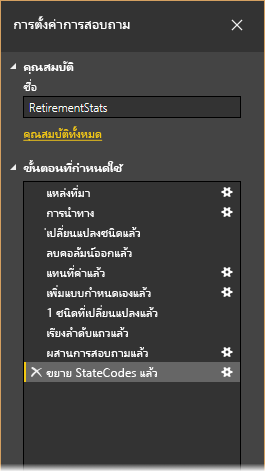

จาก[การเริ่มต้นใช้งาน Power BI Desktop](desktop-getting-started.md) เราสามารถใช้ข้อมูลที่ตัดจำหน่าย ซึ่งเราเจอด้วยการเชื่อมต่อกับแหล่งข้อมูลเว็บ เราต้องจัดรูปร่างข้อมูลดังกล่าวให้สอดคล้องกับความต้องการของเรา เราจะเพิ่มคอลัมน์แบบกำหนดเองเพื่อคำนวณการจัดอันดับโดยที่ว่าข้อมูลทั้งหมดเท่ากับปัจจัยต่าง ๆ และเปรียบเทียบคอลัมน์นี้กับคอลัมน์ที่มีอยู่ **การจัดอันดับ**  

1. จาก Ribbon **เพิ่มคอลัมน์** เลือก **คอลัมน์แบบกำหนดเอง** ซึ่งช่วยให้คุณสามารถเพิ่มคอลัมน์แบบกำหนดเองได้

    

1. ในหน้าต่าง **คอลัมน์แบบกำหนดเอง** ใน **ชื่อคอลัมน์ใหม่** ให้ป้อน _การจัดอันดับใหม่_ ใน **สูตรคอลัมน์แบบกำหนดเอง** ให้ใส่ข้อมูลต่อไปนี้:

    ```
    ([Cost of living] + [Weather] + [Health care quality] + [Crime] + [Tax] + [Culture] + [Senior] + [#"Well-being"]) / 8
    ```
 
1. ตรวจสอบให้แน่ใจว่าข้อความสถานะคือ *ไม่มีข้อผิดพลาดทางไวยากรณ์ที่ตรวจพบ*และเลือก**ตกลง**

    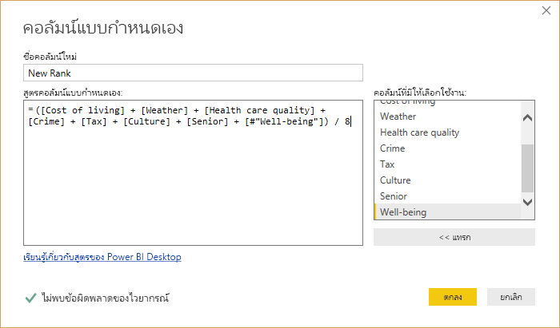

1. หากต้องการให้ข้อมูลคอลัมน์สอดคล้องกัน ให้แปลงค่าของคอลัมน์ใหม่เป็นจำนวนเต็ม หากต้องการเปลี่ยน ให้คลิกขวาที่ส่วนหัวของคอลัมน์ และเลือก**เปลี่ยนชนิด\>จำนวนเต็ม** 

    หากต้องการเลือกมากกว่าหนึ่งคอลัมน์ ให้เลือกคอลัมน์ แล้วกดค้างที่ปุ่ม**SHIFT**เลือกคอลัมน์ที่อยู่ติดกันเพิ่มเติม และจากนั้นคลิกขวาที่ส่วนหัวของคอลัมน์ คุณยังสามารถใชคีย์**CTRL**เมื่อต้องเลือกคอลัมน์ที่ไม่อยู่ติดกันได้

    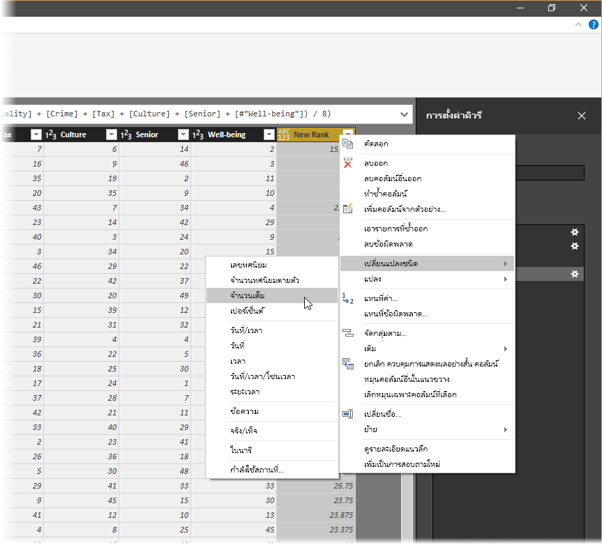

1. หากต้องการ*แปลง*ชนิดข้อมูลของคอลัมน์ ที่ซึ่งคุณแปลงชนิดข้อมูลปัจจุบันให้เป็นอย่างอื่น ให้เลือก**ข้อความชนิดข้อมูล**จาก Ribbon **แปลง** 

   

1. ใน**การตั้งค่าคิวรี** รายการ**ขั้นตอนที่ใช้**แสดงให้เห็นถึงขั้นตอนการจัดรูปร่างที่ใช้กับข้อมูลนี้ หากต้องการลบขั้นตอนออกจากกระบวนการจัดรูปร่าง ให้เลือก **X** ทางด้านซ้ายของขั้นตอน 

    ในรูปต่อไปนี้ **ขั้นตอนที่ใช้** แสดงให้เห็นถึงขั้นตอนที่เพิ่มเข้าไปแล้ว: 
     - **แหล่งข้อมูล**: การเชื่อมต่อไปยังเว็บไซต์
     - **การนำทาง**: การเลือกตาราง 
     - **ชนิดที่เปลี่ยนแปลง**: การเปลี่ยนแปลงคอลัมน์ตัวเลขที่ใช้ข้อความจาก*ข้อความ* *จำนวนเต็ม*. 
     - **เพิ่มแบบกำหนดเองแล้ว**: การเพิ่มคอลัมน์แบบกำหนดเอง
     - **ชนิดที่เปลี่ยนแปลง 1**: ขั้นตอนที่ใช้ล่าสุด

       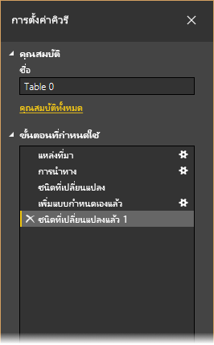

## <a name="adjust-data"></a>ปรับข้อมูล

ก่อนที่เราจะสามารถทำงานกับคิวรีนี้ เราต้องทำการเปลี่ยนแปลงเล็กน้อยเพื่อปรับข้อมูล:

   - ปรับการจัดอันดับโดยการลบคอลัมน์ออก

       เราได้กำหนดว่า**ค่าครองชีพ**เป็นค่าที่ไม่ใช่ปัจจัยในผลลัพธ์ของเรา หลังจากลบคอลัมน์นี้แล้ว เราพบว่าข้อมูลยังคงไม่เปลี่ยนแปลง 

   - แก้ไขข้อผิดพลาดบางอย่าง

       เนื่องจากเราลบคอลัมน์ เราจำเป็นต้องปรับการคำนวณในคอลัมน์**การจัดอันดับใหม่** ซึ่งเกี่ยวข้องกับการเปลี่ยนแปลงสูตร

   - เรียงลำดับข้อมูล

       เรียงลำดับข้อมูลโดยยึดตามคอลัมน์ **การจัดอันดับใหม่** และ **การจัดอันดับ**
 
   - แทนที่ข้อมูล

       เราจะเน้นวิธีการแทนที่ค่าเฉพาะและความจำเป็นของการแทรก**ขั้นตอนที่ใช้**

   - เปลี่ยนชื่อตาราง 

       เนื่องจาก **ตาราง 0** ไม่ใช่ตัวอธิบายที่มีประโยชน์สำหรับตารางเราจะเปลี่ยนชื่อของตาราง

1. เมื่อต้องการลบคอลัมน์**ค่าครองชีพ** ให้เลือกคอลัมน์ แล้วเลือกแท็บ**หน้าแรก**จาก Ribbon แล้วเลือก**ลบคอลัมน์**

    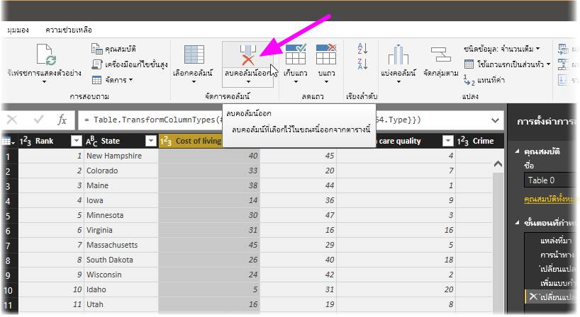

   โปรดทราบว่าค่า**การจัดอันดับใหม่**ไม่มีการเปลี่ยนค่าเนื่องจากเป็นไปตามลำดับของขั้นตอน เนื่องจากตัวแก้ไขคิวรีจะบันทึกขั้นตอนตามลำดับอย่างอิสระ คุณสามารถย้าย**ขั้นตอนทีใช้**แต่ละตัวขึ้นหรือลงตามลำดับ 

1. คลิกขวาที่ขั้นตอน ตัวแก้ไขคิวรีมีเมนูที่ช่วยให้คุณทำงานต่อไปนี้ได้: 
   - **เปลี่ยนชื่อ**เปลี่ยนชื่อขั้นตอน
   - **ลบ**: ลบขั้นตอน
   - **ลบ** **จนกว่าจะสิ้นสุด**: ลบขั้นตอนปัจจุบันและขั้นตอนที่ตามมาทั้งหมด
   - **ย้ายขึ้น**: ย้ายขั้นตอนขึ้นในรายการ
   - **ย้ายลง**: ย้ายขั้นตอนลงในรายการ

1. ย้ายขั้นตอนสุดท้ายขึ้น **ลบคอลัมน์**ให้อยู่เหนือขั้นตอน**แบบกำหนดเองที่ถูกเพิ่ม**

   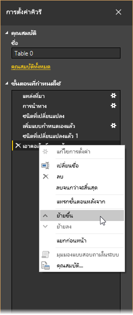

1. เลือกขั้นตอน**แบบกำหนดเองที่ถูกเพิ่ม** 

   โปรดทราบว่าข้อมูลขณะนี้แสดง_ข้อผิดพลาด_ซึ่งเราจะต้องแก้ไข

   

   มีสองสามวิธีเพื่อรับข้อมูลเพิ่มเติมเกี่ยวกับข้อผิดพลาดแต่ละรายการ ถ้าคุณเลือกเซลล์โดยไม่ได้คลิกโดยตรงบนคำ*ข้อผิดพลาด* ตัวแก้ไขคิวรีจะแสดงข้อมูลข้อผิดพลาดทางด้านล่างของหน้าต่าง

   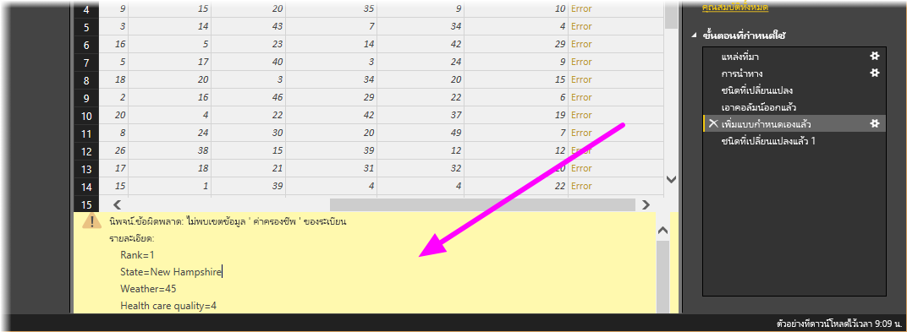

   ถ้าคุณคลิกที่คำ*ข้อผิดพลาด*โดยตรง คิวรีจะสร้าง**ขั้นตอนใช้**ในบานหน้าต่าง**การตั้งค่าคิวรี**และแสดงข้อมูลที่เกี่ยวกับข้อผิดพลาด 

1. เนื่องจากเราไม่จำเป็นต้องแสดงข้อมูลเกี่ยวกับข้อผิดพลาด ให้เลือก **ยกเลิก**

1. หากต้องการแก้ไขข้อผิดพลาดให้เลือกคอลัมน์ **การจัดอันดับใหม่** จากนั้นแสดงสูตรข้อมูลของคอลัมน์โดยการเลือกกล่องกาเครื่องหมาย **แถบสูตร** จากแท็บ **มุมมอง** 

   

1. ลบพารามิเตอร์_ค่าครองชีพ_และลดค่าตัวหาร โดยการเปลี่ยนสูตรดังต่อไปนี้: 
   ```
    Table.AddColumn(#"Removed Columns", "New Rank", each ([Weather] + [Health care quality] + [Crime] + [Tax] + [Culture] + [Senior] + [#"Well-being"]) / 7)
   ```

1. เลือกเครื่องหมายถูกสีเขียวทางด้านซ้ายของกล่องสูตรหรือกด **Enter**

  ตัวแก้ไขคิวรีจะแทนที่ข้อมูลด้วยค่าที่แก้ไขแล้วและขั้นตอน**แบบกำหนดเองที่ถูกเพิ่ม** จะเสร็จสมบูรณ์โดยไม่มีข้อผิดพลาด

   > [!NOTE]
   > คุณยังสามารถ**ลบข้อผิดพลาด**โดยใช้ Ribbon หรือเมนูคลิกขวา ซึ่งจะลบแถวที่มีข้อผิดพลาด อย่างไรก็ตาม เราไม่ต้องการทำเช่นนั้นในบทช่วยสอนนี้เนื่องจากเราต้องการรักษาข้อมูลในตาราง

1. เรียงลำดับข้อมูลโดยยึดตามคอลัมน์**การจัดอันดับใหม** ก่อนอื่น ให้เลือกขั้นตอนสุดท้ายที่ใช้ **ชนิดที่เปลี่ยนแปลง 1** เพื่อแสดงข้อมูลล่าสุด จากนั้นเลือกรายการเลือกแบบดรอปดาวน์ซึ่งอยู่ถัดจากส่วนหัวของคอลัมน์**การจัดอันดับใหม่** และเลือก**เรียงลำดับจากน้อยไปหา**

   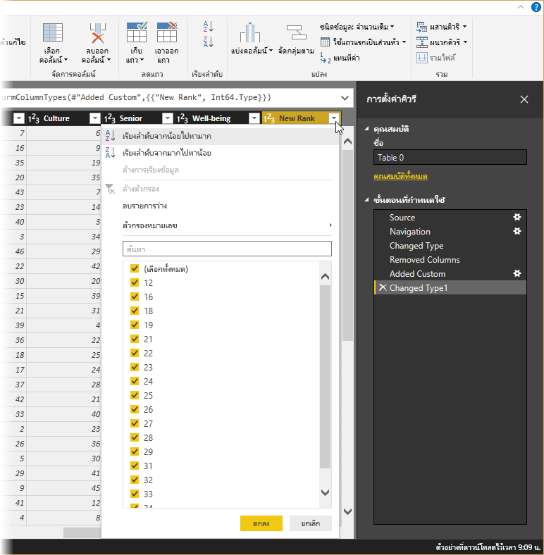

   ขณะนี้มีการเรียงลำดับข้อมูลตาม**การจัดอันดับใหม่** อย่างไรก็ตาม ถ้าคุณดูคอลัมน์**การจัดอันดับ** คุณจะสังเกตเห็นว่าข้อมูลไม่ได้ถูกเรียงลำดับอย่างถูกต้องในกรณีที่ค่า**การจัดอันดับใหม่**เป็นการเชื่อมโยง เราจะแก้ไขปัญหานี้ในขั้นตอนถัดไป

1. หากต้องการแก้ไขปัญหาการเรียงลำดับข้อมูล ให้เลือกคอลัมน์ **การจัดอันดับใหม่**และเปลี่ยนสูตรใน**แถบสูตร** เป็นสูตรต่อไปนี้:

   ```
    = Table.Sort(#"Changed Type1",{{"New Rank", Order.Ascending},{"Rank", Order.Ascending}})
   ```

1. เลือกเครื่องหมายถูกสีเขียวทางด้านซ้ายของกล่องสูตรหรือกด **Enter** 

   ในตอนนี้แถวได้รับการเรียงลำดับตาม **การจัดอันดับใหม่**และ**การจัดอันดับ**. นอกจากนี้ คุณสามารถเลือก**ขั้นตอนที่ใช้**ที่ใดก็ได้ในรายการ และจะทำการจัดรูปทรงข้อมูลตอนตามลำดับต่อไปได้ ตัวแก้ไขคิวรีจะแทรกขั้นตอนใหม่โดยอัตโนมัติหลังจาก**ขั้นตอนที่ใช้**ที่เลือกไว้ในขณะนี้ 

1. ใน**ขั้นตอนที่ใช้** ให้เลือกขั้นตอนก่อนคอลัมน์แบบกำหนดเองซึ่งเป็นขั้นตอน **ลบคอลัมน์**. ต่อไปนี้ เราจะแทนค่าของการจัดอันดับของ**สภาพอากาศ** ในแอริโซนา คลิกขวาบนเซลล์ที่เหมาะสมที่มีการจัดอันดับ**สภาพอากาศ**ของแอริโซนา และเลือก**แทนค่า** โปรดทราบว่ามีการเลือก**ขั้นตอนที่ใช้**แล้วอยู่ในขณะนี้

   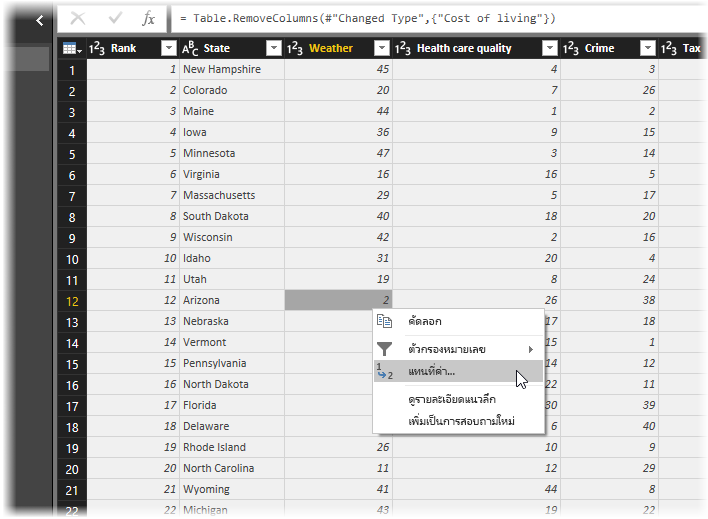

1. เลือก **แทรก**

    เนื่องจากเรากำลังแทรกขั้นตอน ตัวแก้ไขคิวรีจะเตือนเราเกี่ยวกับสิ่งที่ควรระวังของการดำเนินการดังกล่าว ขั้นตอนที่ตามมาอาจทำให้คิวรีใช้การไม่ได้ 

    

1. เปลี่ยนค่าข้อมูลเป็น _51_ 

   ตัวแก้ไขคิวรีจะแทนที่ข้อมูลสำหรับแอริโซนา เมื่อคุณสร้าง**ขั้นตอนที่ใช้**ใหม่ ตัวแก้ไขคิวรีจะตั้งชื่อตามการดำเนินการ ในกรณีนี้คือ**ค่าที่ถูกแทนที่** ถ้าคุณมีมากกว่าหนึ่งขั้นตอนที่มีชื่อเดียวกันในคิวรีของคุณ ตัวแก้ไขคิวรีเพิ่มตัวเลข (ในลำดับ) ไปยังแต่ละ**ขั้นตอนที่ใช้**ที่ตามมา เพื่อแยกความแตกต่างระหว่างกัน

1. เลือก**ขั้นตอนที่ใช้**ล่าสุด **แถวที่เรียงลำดับ**. 

   โปรดทราบว่าข้อมูลมีการเปลี่ยนแปลงเกี่ยวกับการจัดอันดับใหม่ของแอริโซนา การเปลี่ยนแปลงนี้เกิดขึ้นเนื่องจากเราได้แทรกขั้นตอน**ค่าที่ถูกแทนที่** ในตำแหน่งที่ตั้งที่ถูกต้องก่อนขั้นตอน**แบบกำหนดเองที่ถูกเพิ่ม**

1. สุดท้ายนี้ เราต้องการเปลี่ยนชื่อของตารางนั้นให้สื่อความหมาย ในบานหน้าต่าง**การตั้งค่าคิวรี**ภายใต้**คุณสมบัติ** ให้ใส่ชื่อใหม่ของตารางแล้วเลือก **Enter**. ตั้งชื่อตารางนี้ *RetirementStats*

   

   เมื่อเราเริ่มสร้างรายงาน ชื่อตารางที่สื่อความหมายนั้นจะมีประโยชน์อย่างยิ่ง โดยเฉพาะเมื่อเราเชื่อมต่อกับแหล่งข้อมูลหลายแหล่ง ซึ่งจะเรียงเป็นรายการในบานหน้าต่าง**เขตข้อมูล**ของมุมมองของ**รายงาน**

   ขณะนี้เราได้จัดรูปร่างข้อมูลของเราให้อยู่ในขอบเขตที่เราต้องการ ถัดไป ให้เชื่อมต่อกับแหล่งข้อมูลอื่น และรวมข้อมูล

## <a name="combine-data"></a>รวมข้อมูล
ข้อมูลเกี่ยวกับรัฐต่าง ๆ นั้นน่าสนใจ และจะเป็นประโยชน์สำหรับการสร้างการวิเคราะห์และการคิวรีเพิ่มเติม แต่มีปัญหาหนึ่ง: ข้อมูลส่วนใหญ่นั้นใช้ตัวอักษรย่อสองตัวสำหรับรหัสรัฐ ไม่ได้ใช่ชื่อเต็มของรัฐ เราจำเป็นต้องมีวิธีในการเชื่อมโยงชื่อรัฐกับตัวย่อของรัฐ

เราโชคดี มีแหล่งข้อมูลสาธารณะอื่นที่ทำเช่นนั้น แต่ต้องการจำนวนรูปร่างที่เหมาะสมก่อนที่เราจะสามารถเชื่อมต่อกับตารางข้อมูลที่ตัดจำหน่ายของเรา เมื่อต้องการจัดรูปร่างข้อมูล ให้ทำตามขั้นตอนเหล่านี้:

1. จาก Ribbon **หน้าแรก**ในตัวแก้ไขคิวรี เลือก **แหล่งข้อมูลใหม่ \> เว็บ** 

2. ใส่ที่อยู่ของเว็บไซต์สำหรับตัวย่อของรัฐ *https://en.wikipedia.org/wiki/List_of_U.S._state_abbreviations* จากนั้นเลือก **เชื่อมต่อ**

   ตัวนำทางจะแสดงเนื้อหาของเว็บไซต์

    

1. เลือก**รหัสและตัวย่อ**. 

   > [!TIP]
   > ซึ่งจะต้องใช้เวลาสักหน่อยในการปรับข้อมูลของตารางนี้ให้ตรงกับสิ่งที่เราต้องการ มีวิธีง่ายหรือเร็วกว่าในการทำขั้นตอนด้านล่างหรือไม่ ใช่ เราสามารถสร้างการ*ความสัมพันธ์*ระหว่างตารางสองตาราง และปรับรูปร่างข้อมูลตามความสัมพันธ์ได้ ขั้นตอนต่อไปนี้ยังคงเหมาะสมที่จะเรียนรู้สำหรับการทำงานกับตาราง อย่างไรก็ตาม ความสัมพันธ์สามารถช่วยให้คุณใช้ข้อมูลจากหลายตารางได้อย่างรวดเร็ว
> 
> 

ในการทำให้ข้อมูลเป็นรูปร่าง ให้ทำตามขั้นตอนเหล่านี้:

1. ลบแถวด้านบน เนื่องจากเป็นผลมาจากวิธีการสร้างตารางของเว็บเพจ เราไม่จำเป็นต้องใช้ จากริบบอน**หน้าแรก** เลือก**ลดแถว\>ลบแถว\>ลบแถวด้านบน**

    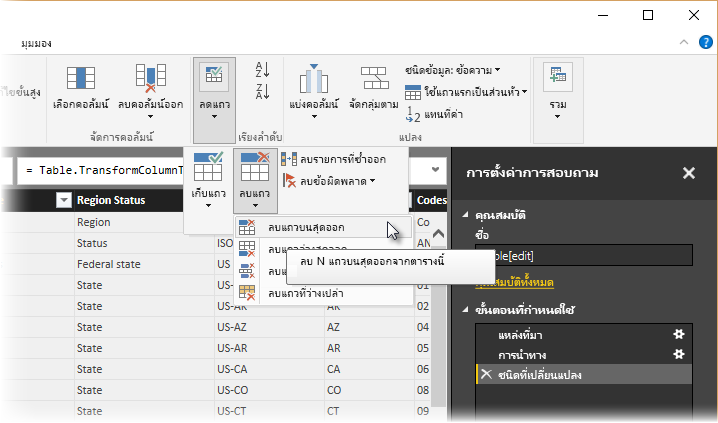

    หน้าต่าง**ลบแถวด้านบน**ปรากฏขึ้น เพื่อแจ้งให้คุณระบุจำนวนแถวที่คุณต้องการลบ

    > [!NOTE]
    > ถ้า Power BI นำส่วนหัวของตารางมาเป็นแถวในตารางข้อมูลของคุณโดยไม่ได้ตั้งใจ คุณสามารถเลือก**ใช้แถวแรกเป็นส่วนหัวของตาราง**จากแท็บ**หน้าแรก** หรือจากการแท็บ**แปลง**ในริบบอน เพื่อแก้ไขตารางของคุณ

1. ลบ 26 แถวด้านล่าง แถวเหล่านี้เป็นเขตแดนของสหรัฐฯ ซึ่งเราไม่จำเป็นต้องมี จากริบบอน**หน้าแรก** เลือก**ลดแถว\>ลบแถว\>ลบแถวด้านล่าง**

    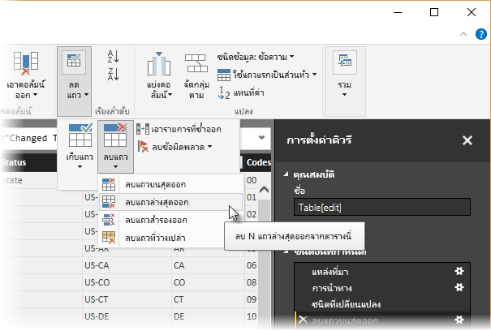

1. เนื่องจากตาราง RetirementStats ไม่มีข้อมูลสำหรับกรุงวอชิงตัน ดี.ซี. เราจำเป็นต้องกรองข้อมูลจากรายการของเรา เลือกรายการดรอปดาวน์**สถานะภูมิภาค**แล้ว ล้างกล่องกาเครื่องหมายข้าง **เขตของรัฐกลาง**

    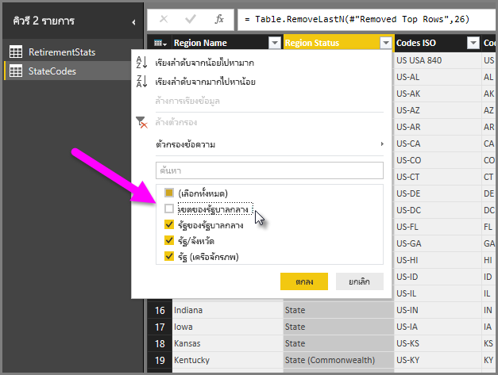

1. ลบคอลัมน์ที่ไม่ต้องการสองสามรายการ เนื่องจากเราต้องการแมปรัฐเข้ากับตัวอักษรย่อสองตัวที่เป็นทางการเท่านั้น ดังนั้นเราสามารถลบคอลัมน์ดังต่อไปนี้ได้: **Column1**, **Column3**, **Column4**และจากนั้น**Column6**ไปจนถึง**Column11** ก่อนอื่น ให้เลือก**Column1**แล้ว กดคีย์**CTRL**ค้างไว้ และเลือกคอลัมน์อื่นเพื่อที่จะลบออก จากแท็บ **หน้าแรก** บน Ribbon เลือก **ลบคอลัมน์\> ลบคอลัมน์**

   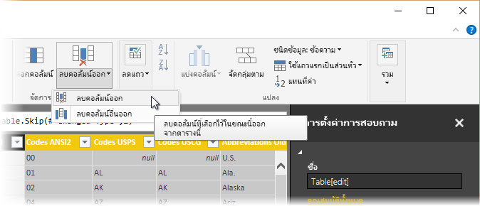

   > [!NOTE]
   > นี่คือเวลาดีที่จะใส่ใจ*ลำดับ*ของขั้นตอนที่ใช้ในตัวแก้ไขคิวรี่ว่าเป็นสิ่งสำคัญ และอาจส่งผลต่อวิธีการจัดรูปข้อมูล เป็นสิ่งสำคัญเช่นกันที่ต้องพิจารณาว่าขั้นตอนหนึ่งอาจจะส่งผลกระทบต่อขั้นตอนถัดไปอย่างไร ถ้าคุณลบขั้นตอนจากขั้นตอนที่ใช้ ขั้นตอนต่อไปอาจจะไม่ทำงานแบบที่ตั้งใจไว้แต่แรก เนื่องจากผลกระทบของลำดับขั้นตอนของคิวรี่

   > [!NOTE]
   > เมื่อคุณปรับขนาดหน้าต่างตัวแก้ไขคิวรี่ให้เล็กลง บางไอเท็มของริบบอน ถูกบีบเพื่อทำให้การใช้ที่ดีที่สุดของพื้นที่ที่สามารถมองเห็นได้ เมื่อคุณเพิ่มความกว้างของหน้าต่างของตัวแก้ไขคิวรี่ ไอเท็มของริบบอน ขยายเพื่อให้การใช้ส่วนใหญ่ของพื้นที่ของริบบอนที่เพิ่มขึ้น

1. เปลี่ยนชื่อคอลัมน์และตาราง มีสองสามวิธีในการเปลี่ยนชื่อคอลัมน์: ก่อนอื่น ให้เลือกคอลัมน์จากนั้นเลือก **เปลี่ยนชื่อ** จากแท็บ**แปลง**บน Ribbon หรือคลิกขวาและเลือก **เปลี่ยนชื่อ**. รูปต่อไปนี้มีลูกศรที่ชี้ไปยังตัวเลือกทั้งสอง คุณต้องเลือกหนึ่งในนั้น

   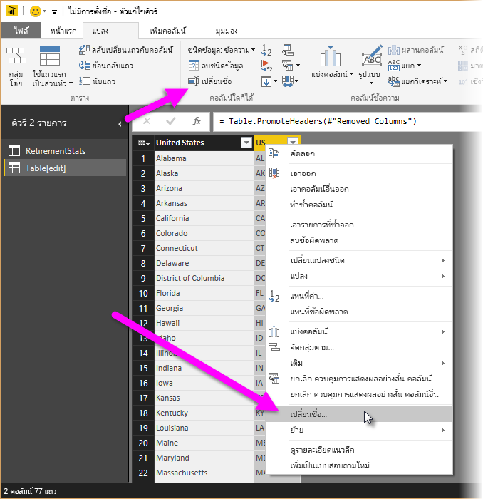

1. เปลี่ยนชื่อคอลัมน์เป็น*ชื่อรัฐ*และ*รหัสรัฐ* เมื่อต้องการเปลี่ยนชื่อตาราง ให้ใส่**ชื่อ** ในบานหน้าต่าง**การตั้งค่าคิวรี** ตั้งชื่อตารางนี้ *StateCodes*

## <a name="combine-queries"></a>รวมคิวรี

หลังจากที่เราได้จัดรูปร่างตาราง StateCodes ในรูปแบบที่เราต้องการแล้ว ให้รวมตารางสองตารางหรือคิวรีเหล่านี้เป็นรายการเดียว เนื่องจากตารางที่เรามีอยู่ในขณะนี้เป็นผลมาจากการคิวรีที่เรานำไปใช้กับข้อมูล ตารางเหล่านี้จึงมักจะถูกเรียกว่า*คิวรี*

มีสองวิธีหลักของการรวมคิวรีได้แก่ *ผสาน*และ*ผนวก*

- เมื่อคุณมีหนึ่งหรือสองคอลัมน์ที่คุณต้องการเพิ่มลงในคิวรี่อื่น คุณทำการ*ผสาน*คิวรี่ 
- เมื่อคุณมีแถวของข้อมูลเพิ่มเติมที่คุณต้องการเพิ่มลงในคิวรี่ที่มีอยู่ คุณทำการ*ผนวก*คิวรี่

ในกรณีนี้ เราต้องการผสานคิวรี ในการทำเช่นนั้น ทำตามขั้นตอนเหล่านี้:
 
1. จากบานหน้าต่างด้านซ้ายของตัวแก้ไขคิวรี ให้เลือกคิวรี*ที่*คุณต้องการผสานกับคิวรีอื่น ในกรณีนี้ จะเป็น **RetirementStats** 

1. เลือก**รวม\>ผสานคิวรี**จากแท็บ**หน้าแรก**บน Ribbon

   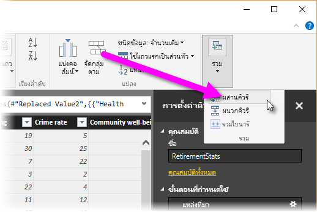

   คุณอาจได้รับการแจ้งเตือนให้ตั้งค่าระดับความเป็นส่วนตัว เพื่อให้แน่ใจว่าข้อมูลจะถูกรวมไว้โดยไม่รวมหรือถ่ายโอนข้อมูลที่คุณไม่ต้องการให้โอน

   หน้าต่าง **ผสาน** จะปรากฏขึ้น ซึ่งจะแจ้งเตือนให้คุณเลือกตารางที่คุณต้องการผสานเข้ากับตารางที่เลือก และคอลัมน์ที่ตรงกันเพื่อใช้สำหรับการผสาน 

1. เลือก**รัฐ** จากตาราง RetirementStats จากนั้นเลือกคิวรี **StateCodes** 

   เมื่อคุณเลือกคอลัมน์ที่ตรงกันที่ถูกต้อง ปุ่ม **ตกลง**จะถูกเปิดใช้งาน

   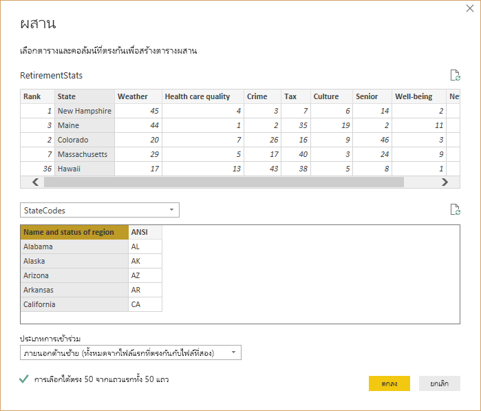

1. เลือก**ตกลง**

   ตัวแก้ไขคิวรีจะสร้างคอลัมน์ **NewColumn** ที่ส่วนท้ายของคิวรี ซึ่งเป็นเนื้อหาของตาราง (คิวรี) ที่ถูกผสานเข้ากับคิวรีที่มีอยู่ คอลัมน์ทั้งหมดจากคิวรีที่ผสานนั้นจะย่อลงเป็นคอลัมน์ **NewColumn** แต่คุณสามารถเลือกเพื่อ**ขยาย**ตารางได้ และรวมคอลัมน์ใดก็ตามที่คุณต้องการ

   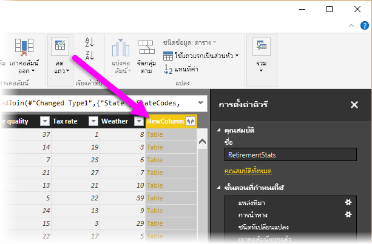

1. เมื่อต้องการขยายตารางที่ผสานแล้ว และเลือกคอลัมน์ที่จะรวม เลือกไอคอนขยาย () 

   หน้าต่าง**ขยาย**ปรากฏขึ้น

   

1. ในกรณีนี้ เราต้องการเฉพาะคอลัมน์ **รหัสรัฐ** เลือกคอลัมน์นั้น ล้างข้อมูล **ใช้ชื่อคอลัมน์เดิมเป็นคำนำหน้า** จากนั้นเลือก **ตกลง**.

   ถ้าเราได้เว้นว่างกล่องกาเครื่องหมายที่เลือกสำหรับ **ใช้ชื่อคอลัมน์เดิมเป็นคำนำหน้า**ได้ คอลัมน์ที่ผสานจะถูกตั้งชื่อ **ewColumn.State Code**

   > [!NOTE]
   > ต้องการสำรวจวิธีการแสดงในตาราง NewColumn หรือไม่ คุณสามารถลองใช้ดูสักเล็กน้อย และถ้าคุณไม่ชอบผลลัพธ์ ก็แค่ลบขั้นตอนนั้นจากรายการ**ขั้นตอนที่ใช้** ซึ่งอยู่ในช่อง**การตั้งค่าคิวร่ี่** คิวรี่ของคุณจะกลับไปยังรัฐก่อนที่จะมีการใช้ขั้นตอน**ขยาย**นั้น คุณสามารถทำได้หลายครั้ง ตามที่คุณต้องการจนกว่ากระบวนการขยายจะมีลักษณะตามที่คุณต้องการ

   ในตอนนี้เรามีคิวรี (ตาราง) เดียว ที่รวมแหล่งข้อมูลสองแหล่ง ซึ่งแต่ละแหล่งถูกจัดรูปร่างให้ตรงตามความต้องการของเรา คิวรี่นี้สามารถทำหน้าที่เป็นพื้นฐานสำหรับการเชื่อมต่อข้อมูลเพิ่มเติมและน่าสนใจเป็นจำนวนมาก เช่น สถิติค่าใช้จ่ายในครัวเรือน ข้อมูลประชากร หรือโอกาสการทำงานในทุก ๆ รัฐ

1. หากต้องการใช้การเปลี่ยนแปลงและปิดตัวแก้ไขคิวรี่ ให้เลือก**ปิดและใช้**จากแท็บ**หน้าแรก**บน Ribbon 

   การแปลงชุดข้อมูลที่ปรากฏใน Power BI Desktop นั้นพร้อมที่จะใช้สร้างรายงาน

   

## <a name="next-steps"></a>ขั้นตอนถัดไป
สำหรับข้อมูลเพิ่มเติมเกี่ยวกับ Power BI Desktop และความสามารถ ให้ดูแหล่งข้อมูลต่อไปนี้:

* [Power BI Desktop คืออะไร](desktop-what-is-desktop.md)
* [ภาพรวมคิวรีใน Power BI Desktop](desktop-query-overview.md)
* [แหล่งข้อมูลใน Power BI Desktop](desktop-data-sources.md)
* [เชื่อมต่อกับข้อมูลใน Power BI Desktop](desktop-connect-to-data.md)
* [งานแบบสอบถามทั่วไปใน Power BI Desktop](desktop-common-query-tasks.md)   

