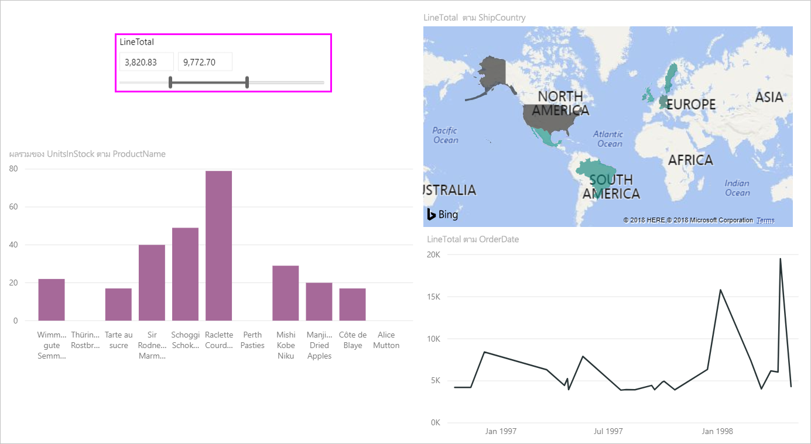
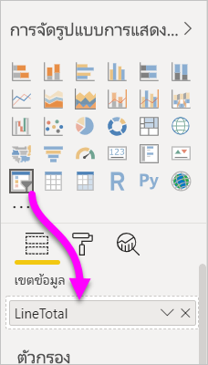
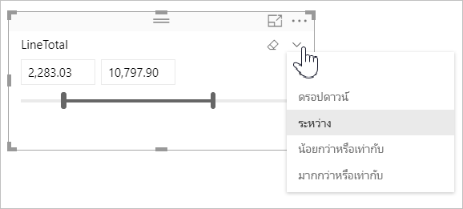
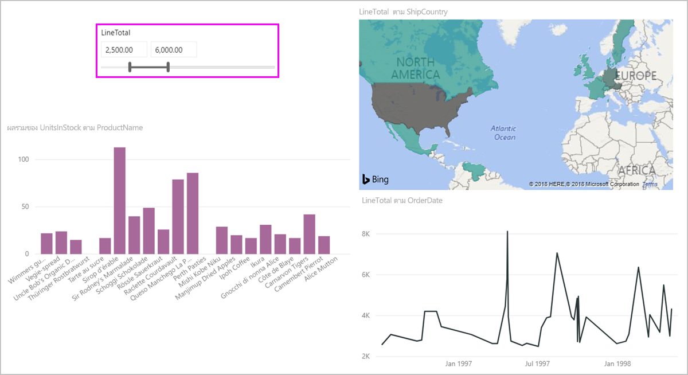
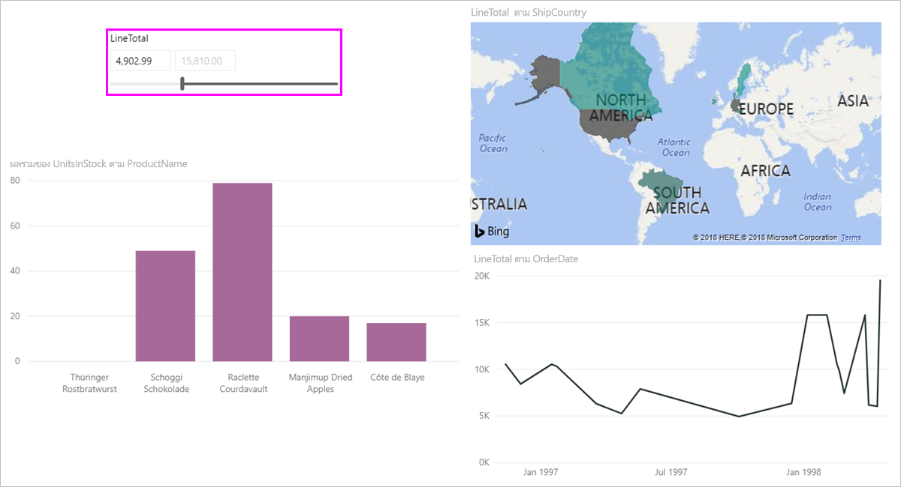

# ใช้ตัวแบ่งส่วนข้อมูลช่วงตัวเลขใน Power BI

[!INCLUDE [applies-to](includes/applies-to.md)] [!INCLUDE [yes-desktop](includes/yes-desktop.md)] [!INCLUDE [yes-service](includes/yes-service.md)]

ด้วยตัวแบ่งส่วนข้อมูลช่วงตัวเลข คุณสามารถใช้ตัวกรองทุกประเภทในคอลัมน์ตัวเลขใดก็ตามในแบบจำลองข้อมูลของคุณได้ มีสามตัวเลือกสำหรับการกรองข้อมูลตัวเลขของคุณ: ระหว่างตัวเลขน้อยกว่าหรือเท่ากับตัวเลข หรือมากกว่าหรือเท่ากับตัวเลข เทคนิคง่าย ๆ นี้เป็นวิธีที่มีประสิทธิภาพในการกรองข้อมูลของคุณ

## Video

ในวิดีโอนี้ จะแสดงการสร้างตัวแบ่งส่วนข้อมูลช่วงตัวเลข

> [!NOTE]
> วิดีโอนี้ใช้ Power BI Desktop เวอร์ชันเก่า

<iframe width="560" height="315" src="https://www.youtube.com/embed/zIZPA0UrJyA" frameborder="0" allowfullscreen></iframe> 

## เพิ่มตัวแบ่งส่วนข้อมูลช่วงตัวเลข

คุณสามารถใช้ตัวแบ่งส่วนข้อมูลช่วงตัวเลขได้เช่นเดียวกับที่คุณใช้ตัวแบ่งส่วนข้อมูลอื่น ๆ เพียงแค่สร้างวิชวล**ตัวแบ่งส่วนข้อมูล**สำหรับรายงานของคุณ จากนั้นเลือกค่าตัวเลขสำหรับค่า**เขตข้อมูล** ในรูปต่อไปนี้ เราได้เลือกเขตข้อมูล **LineTotal**

เลือกลูกศรชี้ลงที่มุมบนขวาของตัวแบ่งส่วนช่วงตัวเลขและเมนูจะปรากฏขึ้น

สำหรับช่วงตัวเลข คุณสามารถเลือกจากตัวเลือกทั้งสามต่อไปนี้:

* **ระหว่าง**
* **น้อยกว่าหรือเท่ากับ**
* **มากกว่าหรือเท่ากับ**

เมื่อคุณเลือก**ระหว่าง**จากเมนู แถบเลื่อนจะปรากฏขึ้น คุณสามารถใช้แถบเลื่อนเพื่อเลือกค่าตัวเลขที่อยู่ระหว่างตัวเลขต่าง ๆ บางครั้งส่วนประกอบของการย้ายแถบตัวแบ่งส่วนข้อมูลจะทำให้ยากต่อการใช้ตัวเลขนั้น คุณยังสามารถใช้แถบเลื่อนและเลือกกล่องใดก็ได้เพื่อพิมพ์ค่าที่เราต้องการ ตัวเลือกนี้จะสะดวกเมื่อคุณต้องการแบ่งย่อยในตัวเลขที่ระบุ

ในรูปต่อไปนี้ หน้ารายงานจะกรองด้วยค่า **LineTotal** ที่อยู่ในช่วงระหว่าง 2500.00 และ 6000.00

เมื่อคุณเลือก**น้อยกว่าหรือเท่ากับ**ด้ามจับที่ด้านซ้าย (ค่าต่ำกว่า) ของแถบเลื่อนจะหายไป และคุณสามารถปรับเปลี่ยนเฉพาะขีดจำกัดขอบสูงสุดของแถบเลื่อนดังกล่าวได้ ในรูปต่อไปนี้ เราตั้งค่าแถบเลื่อนเป็น 5928.19

สุดท้ายถ้าคุณเลือก**มากกว่าหรือเท่ากับ** จากนั้นด้ามจับที่ด้านขวา (ค่าสูงกว่า) จะเลื่อนหายไป จากนั้นคุณสามารถปรับค่าต่ำกว่าดังที่เห็นในรูปต่อไปนี้ ตอนนี้ เฉพาะรายการที่มี **LineTotal** มากกว่าหรือเท่ากับ 4902.99 จะแสดงในภาพบนหน้ารายงาน

## จัดชิดเป็นเลขจำนวนเต็มด้วยตัวแบ่งส่วนช่วงตัวเลข

ตัวแบ่งส่วนช่วงตัวเลขจะจัดชิดเป็นเลขจำนวนเต็มถ้าชนิดข้อมูลของเขตข้อมูลเบื้องต้นเป็น*จำนวนเต็ม* คุณลักษณะนี้ช่วยให้ตัวแบ่งส่วนข้อมูลของคุณสามารถจัดพอดีกับจำนวนเต็ม เขตข้อมูล *ตัวเลขทศนิยม* ช่วยให้คุณสามารถป้อนหรือเลือกเศษส่วนของจำนวนได้ การจัดรูปแบบที่ตั้งค่าในกล่องข้อความตรงกับชุดการจัดรูปแบบในเขตข้อมูล แม้ว่าคุณจะสามารถพิมพ์ลงหรือเลือกตัวเลขที่เที่ยงตรงกว่าได้

## แสดงการจัดรูปแบบด้วยตัวแบ่งส่วนข้อมูลช่วงวันที่

เมื่อคุณใช้ตัวแบ่งส่วนข้อมูลเพื่อแสดงหรือตั้งค่าช่วงวันที่ วันที่จะแสดงในรูปแบบ*วันที่แบบสั้น* ตำแหน่งที่ตั้งของเบราว์เซอร์หรือระบบปฏิบัติการของผู้ใช้จะกำหนดรูปแบบวันที่ ดังนั้น รูปแบบนี้จะเป็นรูปแบบการแสดงผล ไม่ว่าจะเป็นการตั้งค่าชนิดข้อมูลสำหรับข้อมูลเบื้องต้นหรือแบบจำลอง

ตัวอย่างเช่น คุณสามารถใช้รูปแบบวันที่แบบยาวสำหรับชนิดข้อมูลเบื้องต้น ในกรณีนี้ รูปแบบวันที่เช่น  *dddd, MMMM d, yyyy* จะจัดรูปแบบวันที่ในภาพหรือสถานการณ์อื่นๆ *เป็นวันพุธที่ 14 มีนาคม 2001* แต่ในตัวแบ่งส่วนข้อมูลวันที่ วันที่นั้นจะแสดงในตัวแบ่งส่วนข้อมูลเป็น *03/14/2001*

การแสดงรูปแบบวันที่แบบสั้นในตัวแบ่งส่วนข้อมูลเพื่อให้มั่นใจถึงความยาวของสตริงคงที่และกระชับภายในตัวแบ่งส่วนข้อมูล

## ข้อจำกัดและข้อควรพิจารณา

ข้อจำกัดและข้อควรพิจารณาต่อไปนี้จะใช้กับตัวแบ่งส่วนข้อมูลช่วงตัวเลข:

* ตัวแบ่งส่วนข้อมูลช่วงตัวเลขจะกรองทุกแถวต้นแบบในข้อมูลดังกล่าว ไม่ใช่ค่ารวมใด ๆ ตัวอย่างเช่น สมมติว่าคุณใช้เขตข้อมูล*ยอดขาย* จากนั้นตัวแบ่งส่วนข้อมูลจะกรองธุรกรรมแต่ละรายการตามยอดขาย ไม่ใช่ผลรวมของยอดขายสำหรับแต่ละจุดข้อมูลของภาพ
* ปัจจุบันยังไม่สามารถทำงานร่วมกับหน่วยวัดได้
* คุณสามารถพิมพ์ตัวเลขต่าง ๆ ลงในตัวแบ่งส่วนตัวเลขได้ แม้ว่าจะอยู่นอกช่วงของค่าในคอลัมน์อ้างอิงก็ตาม ตัวเลือกนี้จะช่วยให้คุณสามารถตั้งค่าตัวกรองได้ หากคุณทราบว่าข้อมูลอาจมีการเปลี่ยนแปลงในอนาคต
