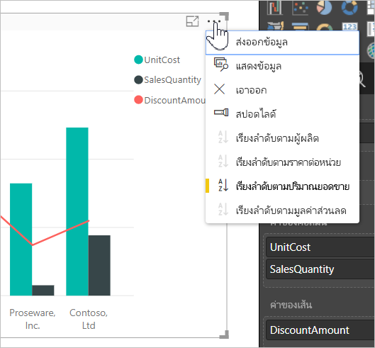
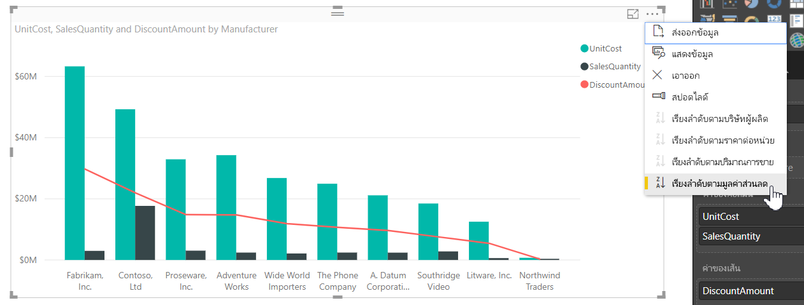
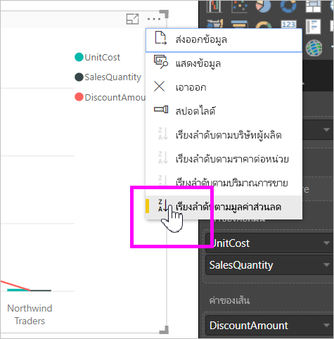
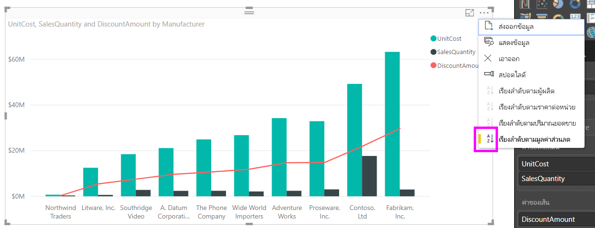
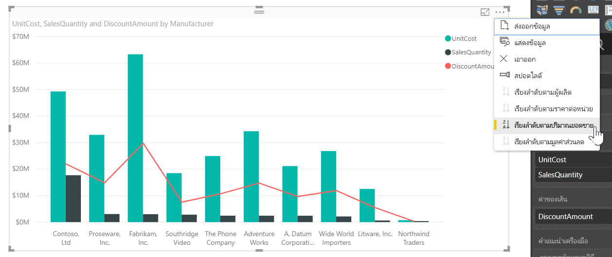
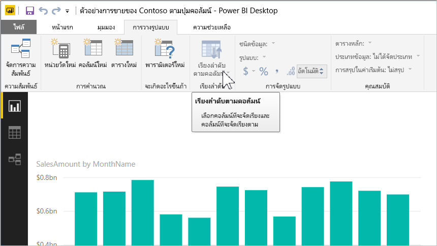
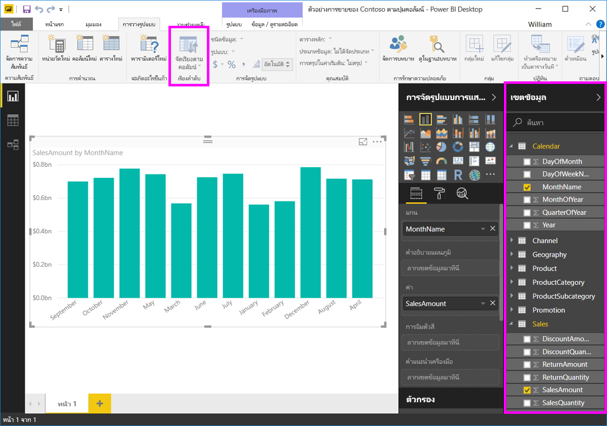
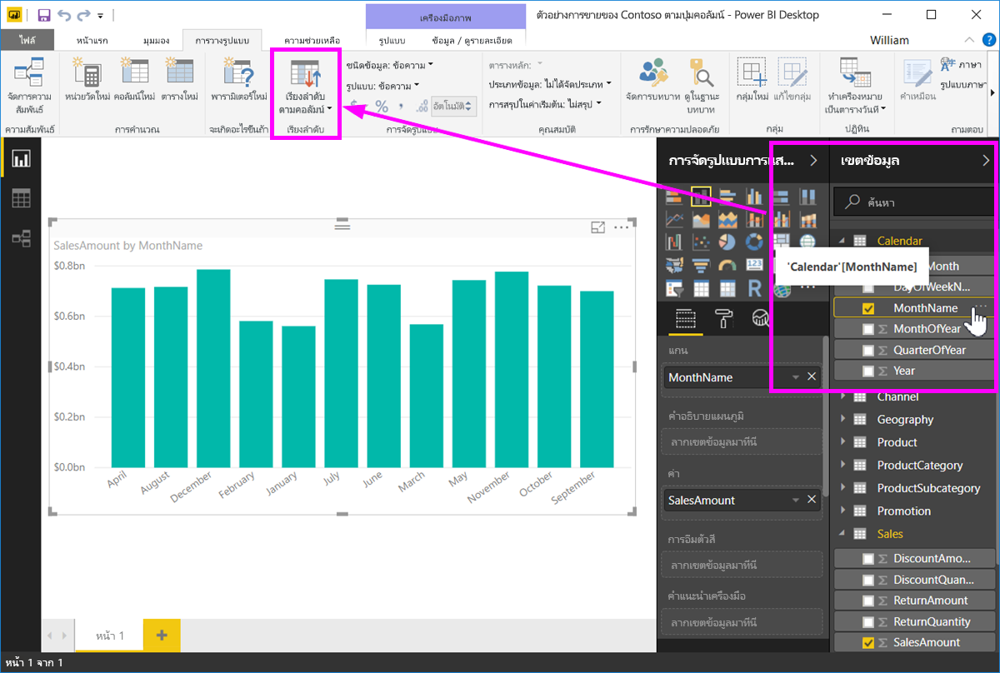
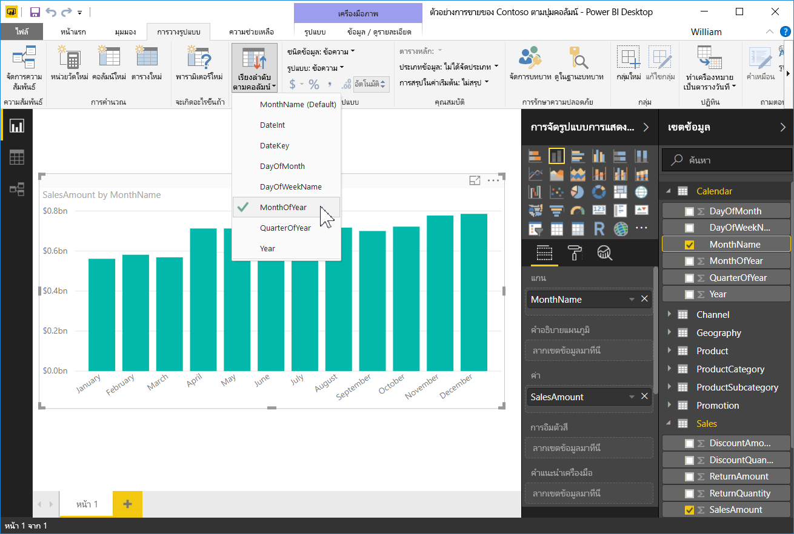
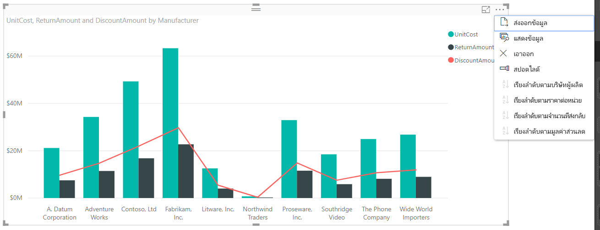

# เรียงลำดับตามคอลัมน์ใน Power BI Desktop
ใน**Power BI Desktop**และ**Power BI service** คุณสามารถเปลี่ยนลักษณะของรูปภาพ โดยเรียงลำดับตามเขตข้อมูลที่แตกต่างกันได้ โดยการเปลี่ยนวิธีการเรียงลำดับวิชวล คุณสามารถเน้นข้อมูลที่คุณต้องการสื่อ และทำให้แน่ใจว่า วิชวลสะท้อนแนวโน้ม (หรือเน้นให้เห็น)

ไม่ว่าคุณจะใช้ข้อมูลตัวเลข (เช่น ตัวเลขยอดขาย) หรือข้อมูลข้อความ (เช่น ชื่อรัฐ) คุณสามารถเรียงลำดับการแสดงภาพตามที่คุณต้องการ และทำให้แสดงในแบบที่คุณต้องการ  **Power BI**มีความยืดหยุ่นมากมายการจัดเรียง และมีเมนูเพื่อให้คุณใช้ได้อย่างรวดเร็ว บนวิชวลใดๆ เลือกที่เมนูจุดไข่ปลา (...) แล้วเลือกเขตข้อมูลที่คุณต้องการเรียงลำดับ ดังที่แสดงในรูปต่อไปนี้

## ข้อมูลลึกขึ้นและตัวอย่าง
ลองใช้ตัวอย่างทีลึกกว่าเดิม และดูวิธีการทำใน**Power BI Desktop**

การแสดงภาพต่อไปนี้แสดงต้นทุน, ปริมาณ และยอดเงินตามชื่อผู้ผลิต นี่คือการแสดงภาพ ก่อนที่จะทำการเรียงลำดับ

วิชวลตอนนี้กำลังเรียงลำดับตาม **SalesQuantity** เราสามารถบอกได้จากการจับคู่สีของแถบที่เพิ่มสูงขึ้นกับคำอธิบาย แต่มีวิธีที่ดีกว่าเพื่อหาคอลัมน์ที่เรียงลำดับในปัจจุบัน นั่นคือ เมนูจุดไข่ปลา (...) ในมุมบนขวาของรูปภาพ เมื่อเราเลือกจุดไข่ปลา เราเห็นสิ่งต่อไปนี้

* เขตข้อมูลที่เรียงลำดับในปัจจุบันคือ **SalesQuantity** จากการที่ **เรียงลำดับตาม SalesQuantity** เป็นตัวหนา และมีแถบสีเหลือง 

* ทิศทางการเรียงลำดับปัจจุบันเป็นแบบน้อยไปหามาก ตามที่แสดง โดยไอคอนขนาดเล็ก **A / Z** (A เหนือ Z) และลูกศรชี้ลง

เราจะดูเขตข้อมูลและทิศทางการเรียงลำดับในส่วนถัดไปอีกสองส่วนอิสระจากกัน

## เลือกคอลัมน์ที่จะใช้สำหรับการเรียงลำดับ
คุณสังเกตเห็นแถบสีเหลืองอยู่ด้านข้าง **เรียงลำดับตาม SalesQuantity** ในเมนู**ตัวเลือกเพิ่มเติม** ซึ่งแสดงว่าวิชวลจะเรียงลำดับตามคอลัมน์ **SalesQuantity** การเรียงลำดับตามคอลัมน์อื่นเป็นเรื่องง่าย เพียงแค่เลือกจุดไข่ปลาเพื่อแสดงเมนู แล้วเลือกอีกคอลัมน์หนึ่ง

ในรูปต่อไปนี้ เราเลือก *DiscountAmount* เป็นคอลัมน์ที่เราต้องการเรียงลำดับ คอลัมน์นั้นเป็นหนึ่งบรรทัดบนภาพ แทนที่จะเป็นหนึ่งในแถบ นี่คือสิ่งที่ได้หลังจากที่เราเลือก**เรียงลำดับตาม DiscountAmount**

โปรดสังเกตว่าภาพได้เปลี่ยนไป ค่าตอนนี้เรียงลำดับจากค่า DiscountAmount มากสุด ซึ่งในวิชวลนี้คือ Fabrikam inc. ลงไปถึง Northwind Traders ซึ่งมีค่าต่ำสุด 

แต่อะไรจะเกิดขึ้นถ้าเราต้องการเรียงลำดับจากน้อยไปมาก แทนจากมากไปหาน้อยหรือไม่ ในส่วนถัดไปแสดงเพียงว่ามันง่ายอย่างไร

## เลือกการเรียงลำดับ จากน้อยไปหามากที่สุด มากที่สุดไปหาน้อยที่สุด
เมื่อเราดูเมนู**ตัวเลือก**อย่างใกล้ชิดขึ้น จากรูปภาพก่อนหน้า เราเห็นไอคอนถัดจาก**เรียงลำดับตาม DiscountAmount** ที่แสดง **Z / A** (Z เหนือ A) ลองดูซิ

เมื่อเห็น**Z / A** นั่นหมายความว่า ภาพจะถูกเรียงลำดับตามคอลัมน์ที่เลือกตามลำดับของค่าที่มากที่สุดเมื่อต้องการค่าน้อยที่สุด ต้องการเปลี่ยนสิ่งนั้นหรือไม่ ไม่มีปัญหา เพียงแตะหรือคลิกที่ไอคอน**Z / A** และการเปลี่ยนลำดับการจัดเรียงเป็น**A / Z**เรียงลำดับรูปภาพ(ตามคอลัมน์ที่เลือก)จากค่าน้อยไปหาค่ามากที่สุด

ต่อไปนี้เป็นวิชวลเดียวกัน แต่ตอนหลังจากแตะที่ไอคอน **Z / A** บนเมนู**เรียงลำดับตาม DiscountAmount** เพื่อเปลี่ยนการเรียงลำดับ สังเกตเห็นว่า ตอนนี้ Northwind Traders เป็นผู้ผลิตแรกที่แสดงและ Fabrikam Inc. อยู่ที่สุดท้าย - ตรงกันข้ามกับการเรียงลำดับเดิม

คุณสามารถเรียงลำดับตามคอลัมน์ใดที่ได้ที่มีในวิชวล เราสามารถเลือก SalesQuantity ให้เป็นคอลัมน์ที่เราต้องการเรียงลำดับได้อย่างง่ายดายด้วย **เรียงลำดับตาม SalesQuantity** เพื่อแสดงผู้ผลิตที่มียอดขายสูงที่สุดก่อน และยังคงรักษาคอลัมน์อื่น ๆ ในวิชวลไม่ว่าจะเป็นอย่างไรกับผู้ผลิตนั้น ดูภาพด้วยการตั้งค่าเหล่านี้

## เรียงลำดับโดยใช้การเรียงลำดับตามปุ่มคอลัมน์
มีวิธีอื่นในการเรียงลำดับข้อมูลของคุณ และสิ่งนั้นใช้ปุ่ม**เรียงลำดับตามคอลัมน์**ในริบบอน**โมเดล**

วิธีการเรียงลำดับนี้บังคับให้คุณเลือกคอลัมน์จาก บานหน้าต่าง**เขตข้อมูล** จากนั้นให้เลือกปุ่ม**เรียงลำดับตามคอลัมน์**เพื่อเลือกวิธี (่คอลัมน์) ที่คุณต้องการเรียงลำดับภาพของคุณ คุณจำเป็นต้องเลือกคอลัมน์ (เขตข้อมูล) ที่คุณต้องการเรียงลำดับจากบานหน้าต่าง**เขตข้อมูล** เพื่อเปิดใช้งานปุ่ม**เรียงลำดับตามคอลัมน์** มิฉะนั้นปุ่มนี้จะถูกปิด

มาดูตัวอย่างที่พบบ่อย คุณมีข้อมูลจากแต่ละเดือนของปี และคุณต้องการเรียงตามลำดับเวลา ขั้นตอนต่อไปนี้แสดงวิธีการ

1. ก่อนอื่น ให้สังเกตว่า เมื่อมีเลือกรูปภาพแต่ไม่มีคอลัมน์ถูกเลือกไว้ในบานหน้าต่าง**เขตข้อมูล** ปุ่ม**เรียงลำดับตามคอลัมน์**จะถูกปิด (เป็นสีเทา)
   
   

2. เมื่อเราเลือกคอลัมน์ที่เราต้องการเรียงลำดับ ในบานหน้าต่าง**เขตข้อมูล** ปุ่ม**เรียงลำดับตามคอลัมน์**จะถูกเปิดใช้งาน
   
   
3. ตอนนี้ เลือกวิชวลแล้ว เราสามารถเลือก *MonthOfYear* แทนที่จะเป็นค่าเริ่มต้น (*MonthName*) และตอนนี้วิชวลเรียงลำดับตามลำดับที่เราต้องการ คือเรียงตามเดือนในปี
   
   

เท่านี้ก็เรียบร้อย โปรดทราบว่า คุณต้องเลือกคอลัมน์ในการ**เขตข้อมูล**บานหน้าต่างสำหรับตัว**เรียงลำดับตามคอลัมน์**ปุ่มเมื่อต้องการเปิดใช้งาน

## ไปที่คอลัมน์เริ่มต้นสำหรับการเรียงลำดับ
คุณสามารถเรียงลำดับตามคอลัมน์ใดก็ตามที่คุณต้อง แต่อาจมีบางครั้งที่คุณการให้รูปกลับไปยังค่าเริ่มต้นของคอลัมน์ที่เรียงลำดับ ไม่มีปัญหา สำหรับวิชวลที่มีคอลัมน์ที่เรียงลำดับถูกเลือกอยู่ (คอลัมน์ที่เรียงลำดับที่ถูกเลือกจะมีแถบสีเหลืองอยู่ด้านข้าง ในเมนจุดไข่ปลาตามที่เราได้ทราบแล้ว) เพียงเปิดเมนู**ตัวเลือกเพิ่มเติม**และเลือกคอลัมน์นั้นอีกครั้ง แล้วการแสดงภาพจะกลับเป็นค่าเริ่มต้นของคอลัมน์ที่เรียงลำดับ

ตัวอย่างเช่น นี่คือแผนภูมิก่อนหน้าของเรา

เมื่อเรากลับไปยังเมนูแล้วเลือก **SalesQuantity** อีกครั้ง วิชวลจะกลับไปเรียงลำดับตามตัวอักษรตาม **Manufacturer** ตามค่าเริ่มต้น ดังที่แสดงในรูปต่อไปนี้

ด้วยตัวเลือกมากมายเพื่อเรียงลำดับภาพของคุณ การสร้างเพียงแผนภูมิหรือรูปตามที่คุณต้องการรนั้นเป็นเรื่องง่าย

