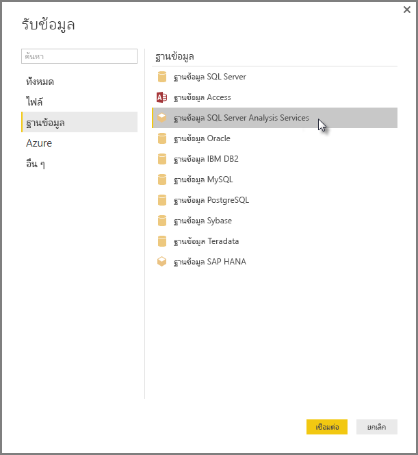

# เชื่อมต่อกับแบบจำลองหลายมิติ SSAS ใน Power BI Desktop
คุณสามารถเข้าถึง**แบบจำลองหลายมิติ SSAS**หรือที่รู้จักกันโดยทั่วไปว่า**SSAS MD**ด้วย Power BI Desktop

เมื่อต้องการเชื่อมต่อกับฐานข้อมูล**SSAS MD** ให้เลือก**รับข้อมูล&gt;ฐานข้อมูล&gt;ฐานข้อมูล SQL Server Analysis Services**ดังที่แสดงในรูปต่อไปนี้:

**แบบจำลองหลายมิติ SSAS**ในโหมด Live connection ได้รับการสนับสนุนในทั้งบริการ Power BI และ Power BI Desktop คุณสามารถเผยแพร่ และอัปโหลดรายงานที่ใช้**แบบจำลองหลายมิติ SSAS**ในโหมด Live ไปยังบริการ Power BI ได้

## ความสามารถและคุณลักษณะของ SSAS MD
คุณลักษณะและความสามารถของ Power BI และการเชื่อมต่อ SSAS MD จะอธิบายในส่วนต่อไปนี้

### เมตาดาต้า Tabular ของแบบจำลองหลายมิติ
ตารางต่อไปนี้แสดงความเกี่ยวข้องกันระหว่างวัตถุหลายมิติและเมตาดาต้า Tabular ที่ส่งกลับมายัง Power BI Desktop Power BI คิวรีแบบจำลองสำหรับเมตาดาต้า Tabular และยึดตามเมตาดาต้าที่ส่งกลับ และเรียกใช้คิวรี DAX ที่เหมาะสมกับ Analysis Services เมื่อคุณสร้างการแสดงภาพเช่น ตาราง เมทริกซ์ แผนภูมิ หรือตัวแบ่งส่วนข้อมูล

| วัตถุ BISM หลายมิติ | เมตาดาต้า Tabular |
| --- | --- |
| คิวบ์ |แบบจำลอง |
| มิติคิวบ์ |ตาราง |
| แอตทริบิวต์มิติ (คีย์) ชื่อ |คอลัมน์ |
| กลุ่มหน่วยวัด |ตาราง |
| หน่วยวัด |หน่วยวัด |
| หน่วยวัดโดยไม่มีกลุ่มหน่วยวัดที่เกี่ยวข้อง |ภายในตารางที่เรียกว่า*หน่วยวัด* |
| กลุ่มหน่วยวัด -> ความสัมพันธ์ของมิติคิวบ์ |ความสัมพันธ์ |
| เปอร์สเปคทีฟ |เปอร์สเปคทีฟ |
| KPI |KPI |
| ลำดับชั้นผู้ใช้/หลัก-รอง |ลำดับชั้น |

### หน่วยวัด กลุ่มหน่วยวัด และ KPI
กลุ่มหน่วยวัดในคิวบ์หลายมิติจะแสดงใน Power BI เป็นตารางที่มีเครื่องหมาย ∑ อยู่ข้าง ๆ ในบานหน้าต่าง**เขตข้อมูล** หน่วยวัดจากการคำนวณที่ไม่มีกลุ่มหน่วยวัดที่เกี่ยวข้องจะได้รับการจัดกลุ่มภายใต้ตารางพิเศษที่เรียกว่า*หน่วยวัด*ในเมตาดาต้า tabular

ในแบบจำลองหลายมิติ คุณสามารถกำหนดชุดของหน่วยวัดหรือ KPI ในคิวบ์ที่จะอยู่ภายใน*โฟลเดอร์การแสดง*ซึ่งสามารถช่วยลดความซับซ้อนของแบบจำลองได้ Power BI จดจำโฟลเดอร์การแสดงในเมตาดาต้า tabular และแสดงหน่วยวัดและ KPI ภายในโฟลเดอร์การแสดง KPI ในฐานข้อมูลหลายมิติสนับสนุน*ค่า* *เป้าหมาย* *กราฟิกสถานะ*และ*กราฟิกแนวโน้ม*

### ชนิดแอตทริบิวต์มิติ
แบบจำลองหลายมิติยังสนับสนุนการเชื่อมโยงไปยังแอตทริบิวต์มิติกับแต่ละชนิดของแอตทริบิวต์มิติ ตัวอย่างเช่น มิติ**ภูมิศาสตร์**ที่แอตทริบิวต์มิติของ*เมือง* *รัฐ-จังหวัด* *ประเทศ*และ*รหัสไปรษณีย์*มีชนิดของภูมิศาสตร์ที่เหมาะสมที่เกี่ยวข้องกับ่แอตทริบิวต์มิติที่เปิดเผยในเมตาดาต้า tabular Power BI จดจำเมตาดาต้า และทำให้คุณสามารถสร้างการแสดงภาพแผนที่ได้ คุณจะสามารถจำความสัมพันธ์เหล่านี้ได้โดยไอคอน*แผนที่*ที่อยู่ถัดจากองค์ประกอบในบานหน้าต่าง**เขตข้อมูล**ใน Power BI

Power BI ยังสามารถแสดงรูปภาพได้เมื่อคุณใส่เขตข้อมูลที่ประกอบด้วย URL (Uniform Resource Locator) ของรูปภาพ คุณสามารถระบุเขตข้อมูลเหล่านี้เป็นชนิด*ImageURL*ในเครื่องมือข้อมูล SQL Server (หรือในภายหลังใน Power BI) และข้อมูลของชนิดสำหรับ Power BI ในเมตาดาต้า tabular นอกจากนี้ Power BI สามารถเรียกใช้รูปภาพเหล่านั้นจาก URL และแสดงภาพเหล่านั้นในวิชวล

### ลำดับชั้นหลัก-รอง
แบบจำลองหลายมิติสนับสนุนลำดับชั้นหลัก-รอง ซึ่งจะแสดงเป็นแบบ*ลำดับชั้น*ในเมตาดาต้า tabular แต่ละระดับของลำดับชั้นหลัก-รองจะแสดงเป็นคอลัมน์ที่ซ่อนอยู่ในเมตาดาต้า tabular แอตทริบิวต์หลักของมิติหลัก-รองจะไม่แสดงในเมตาดาต้า tabular

### สมาชิกที่คำนวณจากมิติ
แบบจำลองหลายมิติสนับสนุนการสร้าง*สมาชิกจากการคำนวณ*ชนิดต่าง ๆ สองชนิดที่พบบ่อยที่สุดของสมาชิกจากการคำนวณมีดังนี้:

* สมาชิกจากการคำนวณในลำดับชั้นแอตทริบิวต์และไม่ใช่พี่น้องของ*ทั้งหมด*
* สมาชิกจากการคำนวณในลำดับชั้นของผู้ใช้

แบบจำลองหลายมิติแสดง*สมาชิกจากการคำนวณในลำดับชั้นแอตทริบิวต์ที่คำนวณ*เป็นค่าของคอลัมน์ มีตัวเลือกและข้อจำกัดเพิ่มเติมในขณะที่แสดงสมาชิกจากการคำนวณชนิดนี้:

* แอตทริบิวต์มิติมี*UnknownMember*เป็นตัวเลือก
* แอตทริบิวต์ที่ประกอบด้วยสมาชิกจากการคำนวณไม่สามารถเป็นแอตทริบิวต์หลักของมิติ เว้นแต่เป็นแอตทริบิวต์ของมิติเท่านั้น
* แอตทริบิวต์ที่ประกอบด้วยสมาชิกจากการคำนวณไม่สามารถเป็นแอตทริบิวต์หลัก-รอง

สมาชิกจากการคำนวณของลำดับชั้นผู้ใช้จะไม่แสดงใน Power BI แต่คุณจะสามารถเชื่อมต่อกับคิวบ์ที่ประกอบด้วยสมาชิกจากการคำนวณในลำดับชั้นผู้ใช้ แต่คุณจะไม่สามารถดูสมาชิกจากการคำนวณ ถ้าสมาชิกไม่เป็นไปตามข้อจำกัดที่กล่าวไว้ในรายการหัวข้อย่อยก่อนหน้า

### การรักษาความปลอดภัย
แบบจำลองหลายมิติสนับสนุนมิติและ cell level security โดยวิธีของ*บทบาท* เมื่อคุณเชื่อมต่อไปยังคิวบ์ด้วย Power BI คุณได้รับการตรวจสอบสิทธิ์และได้รับการประเมินสิทธิ์ที่เหมาะสม เมื่อผู้ใช้มีการใช้*การรักษาความปลอดภัยมิติ*ผู้ใช้ใน Power BI จะมองไม่เห็นสมาชิกมิติที่เกี่ยวข้อง อย่างไรก็ตาม เมื่อผู้ใช้มีการกำหนดสิทธิ์*cell security*จะทำให้เซลล์บางเซลล์ได้รับการจำกัด และผู้ใช้รายนั้นจะไม่สามารถเชื่อมต่อกับคิวบ์โดยใช้ Power BI ได้

## ข้อควรพิจารณาและข้อจำกัด
มีข้อจำกัดบางอย่างในการใช้**SSAS MD**:

* เซิร์ฟเวอร์ต้องใช้งาน SQL Server 2012 SP1 CU4 หรือ Analysis Services รุ่นใหม่กว่าสำหรับตัวเชื่อมต่อ Power BI Desktop SSAS MD เพื่อให้ทำงานได้อย่างถูกต้อง
* *การกระทำ* และ*ชุดที่ตั้งชื่อ*ไม่ได้แสดงไปยัง Power BI แต่คุณยังสามารถเชื่อมต่อกับคิวบ์ที่ประกอบด้วย*การกระทำ*หรือ*ชุดที่ตั้งชื่อ*และสร้างวิลชวล และรายงาน
* คุณอาจพบปัญหาเมื่อ Power BI แสดงเมตาดาต้าสำหรับรูปแบบ SSAS แต่คุณไม่สามารถดึงข้อมูลจากรูปแบบได้ ซึ่งสามารถเกิดขึ้นได้เมื่อคุณมีตัวให้บริการ MSOLAP เวอร์ชัน 32 บิต ติดตั้งบนระบบของคุณ และไม่มีเวอร์ชัน 64 บิต การติดตั้งเวอร์ชัน 64 บิตอาจแก้ปัญหานี้
* คุณไม่สามารถสร้างมาตรวัดของ 'ระดับรายงาน' ในขณะที่กำลังเขียนรายงานซึ่งกำลังเชื่อมต่ออยู่กับ SSAS multidimensional model มาตรวัดเดียวเท่านั้นที่สามารถใช้งานได้คือมาตรวัดที่ถูกกำหนดไว้ใน MD model

## คุณลักษณะที่ได้รับการสนับสนุนของ MD SSAS ใน Power BI Desktop
คุณลักษณะต่อไปนี้ของ SSAS MD ได้รับการสนับสนุนใน Power BI Desktop:

* การใช้องค์ประกอบต่อไปนี้ได้รับการสนับสนุนในรุ่นนี้**SSAS MD** (คุณสามารถรับ[ข้อมูลเพิ่มเติม](https://msdn.microsoft.com/library/jj969574.aspx)เกี่ยวกับคุฯลักษณะเหล่านี้):
  * แสดงโฟลเดอร์
  * แนวโน้มของ KPI
  * สมาชิกเริ่มต้น
  * แอตทริบิวต์มิติ
  * สมาชิกจากการคำนวณมิติ (ต้องเป็นสมาชิกจริงรายเดียวเมื่อมิติมีแอตทริบิวต์มากกว่าหนึ่งแอตทริบิวต์ จึงไม่สามารถเป็นแอตทริบิวต์หลักของมิติ ยกเว้นว่าเป็นแอตทริบิวต์เดียวเท่านั้น และไม่สามารถเป็นแอตทริบิวต์หลัก-รอง)
  * ชนิดแอตทริบิวต์มิติ
  * ลำดับชั้น
  * หน่วยวัด (มี หรือไม่มีกลุ่มหน่วยวัด)
  * หน่วยวัดเป็นตัวแปร
  * KPIs
  * ImageUrls
  * การรักษาความปลอดภัยมิติ

## การแก้ไขปัญหา 
รายการต่อไปนี้อธิบายถึงปัญหาที่ทราบแล้วทั้งหมด เมื่อเชื่อมต่อกับ SQL Server Analysis Services (SSAS) 

* **ข้อผิดพลาด : ไม่สามารถโหลด Schema สำหรับโมเดล** - ข้อผิดพลาดนี้มักจะเกิดขึ้นเมื่อผู้ใช้ที่เชื่อมต่อกับ Analysis Services ไม่สามารถเข้าถึงฐานข้อมูล/คิวบ์ได้
