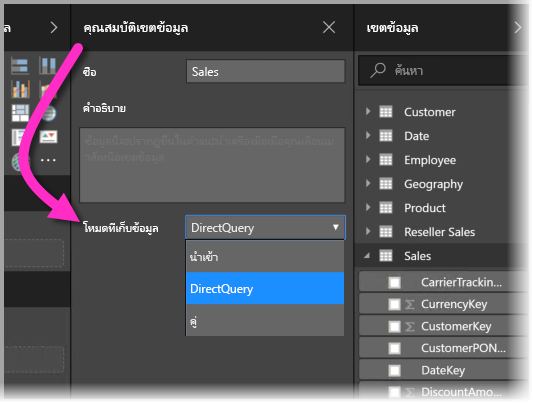
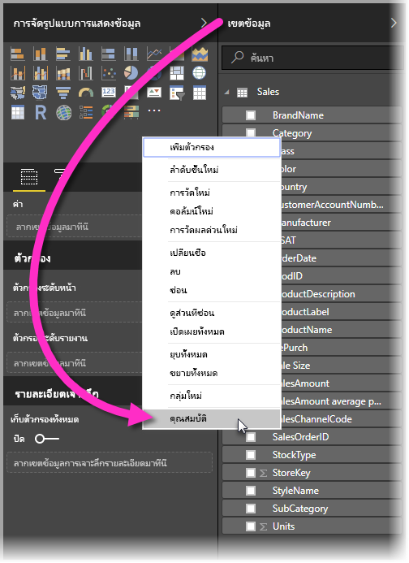
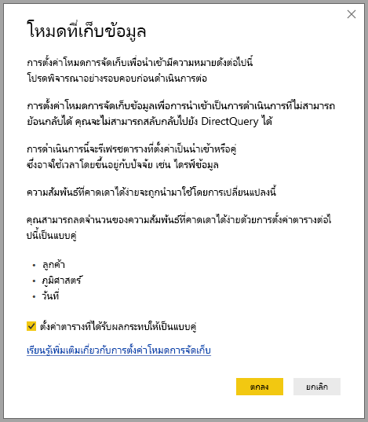

# โหมดที่เก็บข้อมูลใน Power BI Desktop

ใน Microsoft Power BI Desktop คุณสามารถระบุ *โหมดที่เก็บข้อมูล* ของตารางได้ คุณสามารถใช้ *โหมดที่เก็บข้อมูล* เพื่อควบคุมว่า Power BI Desktop แคชข้อมูลตารางในหน่วยความจำสำหรับรายงานหรือไม่ 

การตั้งค่าโหมดที่เก็บข้อมูลเอื้อประโยชน์หลายอย่าง คุณสามารถตั้งค่าโหมดที่เก็บข้อมูลสำหรับแต่ละตารางแยกต่างหากในโมเดลของคุณได้ การดำเนินการนี้จะเปิดใช้งานชุดข้อมูลเดียวซึ่งมีประโยชน์ดังนี้:

* **ประสิทธิภาพคิวรี**: เมื่อผู้ใช้โต้ตอบกับภาพในรายงาน Power BI คิวรี Data Analysis Expressions (DAX) จะถูกส่งไปยังชุดข้อมูล การแคชข้อมูลลงในหน่วยความจำด้วยการตั้งค่าโหมดที่เก็บข้อมูลอย่างเหมาะสมสามารถเพิ่มประสิทธิภาพคิวรีและการโต้ตอบของรายงานได้

* **ชุดข้อมูลขนาดใหญ่**: ตารางที่ไม่ได้ถูกแคชจะไม่ใช้หน่วยความจำสำหรับการแคช คุณสามารถเปิดการวิเคราะห์การโต้ตอบกับชุดข้อมูลขนาดใหญ่ที่ใหญ่หรือแพงเกินไปเพื่อแคชไปยังหน่วยความจำทั้งหมดได้ คุณสามารถเลือกว่าตารางใดที่ควรแคชและตารางใดที่ไม่ควร

* **การปรับการรีเฟรชข้อมูลให้เหมาะสม**: ตารางที่ไม่ได้ถูกแคชไม่จำเป็นต้องได้รับการรีเฟรช คุณสามารถลดระยะเวลาที่ใช้รีเฟรชได้โดยการแคชเฉพาะข้อมูลที่จำเป็นต่อการทำตามข้อกำหนดทางธุรกิจและข้อตกลงการบริการ

* **ข้อกำหนดแบบ Near Real Time**: ตารางที่มีข้อกำหนดแบบ Near Real Time อาจได้รับประโยชน์จากการไม่ถูกแคช เพื่อลดเวลาแฝงของข้อมูล

* **การเขียนกลับ**: การเขียนกลับ ช่วยให้ผู้ใช้ธุรกิจสามารถสำรวจสถานการณ์แบบ What-If ด้วยการเปลี่ยนแปลงค่าเซลล์ แอปพลิเคชันแบบกำหนดเองสามารถทำการเปลี่ยนแปลงไปยังแหล่งข้อมูลได้ ตารางที่ไม่ได้ถูกแคชสามารถแสดงการเปลี่ยนแปลงได้ทันที ซึ่งช่วยให้ทำการวิเคราะห์ผลกระทบได้โดยฉับพลัน

การตั้งค่าโหมดที่เก็บข้อมูลใน Power BI Desktop คือหนึ่งในสามคุณลักษณะที่เกี่ยวข้อง:

* **โมเดลแบบรวม**: อนุญาตให้รายงานมีการเชื่อมต่อข้อมูลตั้งแต่สองแบบขึ้นไป รวมถึงการเชื่อมต่อ DirectQuery หรือการนำเข้า ในรูปแบบใดๆ ก็ตาม สำหรับข้อมูลเพิ่มเติม โปรดดู [การรวมโมเดลใน Power BI Desktop (ตัวอย่าง)](desktop-composite-models.md)

* **ความสัมพันธ์แบบกลุ่มต่อกลุ่ม**: ด้วย *โมเดลแบบรวม* คุณสามารถสร้าง *ความสัมพันธ์แบบกลุ่ม-ต่อ-กลุ่ม* ระหว่างตารางได้ *ความสัมพันธ์แบบกลุ่ม-ต่อ-กลุ่ม* จะลบคำขอสำหรับค่าไม่ซ้ำกันในตาราง นอกจากนี้ยังเอาการแก้ปัญหาชั่วคราวก่อนหน้าออกด้วย เช่น การเริ่มตารางใหม่เพื่อสร้างความสัมพันธ์เท่านั้น สำหรับข้อมูลเพิ่มเติม โปรดดู [ความสัมพันธ์แบบกลุ่ม-ต่อ-กลุ่มใน Power BI Desktop (ตัวอย่าง)](desktop-many-to-many-relationships.md)

* **โหมดการจัดเก็บข้อมูล**: คุณสามารถระบุวิชวลที่ต้องการคิวรีไปยังแหล่งข้อมูลระบบ Back-end ได้ วิชวลที่ไม่ต้องใช้คิวรีจะถูกนำเข้าแม้ว่าจะมาจาก DirectQuery คุณลักษณะนี้จะช่วยปรับปรุงประสิทธิภาพ และลดการโหลดระบบ Back-end ก่อนหน้านี้ แม้กระทั่งวิชวลพื้นฐานอย่างตัวแบ่งส่วนข้อมูล ก็นำคิวรีที่ถูกส่งไปยังแหล่งระบบ Back-end จะมีการอธิบายโหมดที่เก็บข้อมูลต่อไปในบทความนี้

## ใช้คุณสมบัติโหมดที่เก็บข้อมูล

โหมดที่เก็บข้อมูล คือ คุณสมบัติที่คุณสามารถตั้งค่าแต่ละตารางในโมเดลของคุณได้ วิธีตั้งค่าโหมดที่เก็บข้อมูล ในบานหน้าต่าง **เขตข้อมูล** คลิกขวาที่ตารางที่ต้องการตั้งค่าคุณสมบัติ และเลือก **คุณสมบัติ**

คุณสมบัติปัจจุบันจะแสดงในรายการดรอปดาวน์ของ **โหมดที่เก็บข้อมูล** ในบานหน้าต่าง **คุณสมบัติเขตข้อมูล** ของตาราง คุณสามารถดูโหมดที่เก็บข้อมูลปัจจุบันหรือแก้ไขได้

โหมดที่เก็บข้อมูลมี 3 ค่า:

* **นำเข้า**: เมื่อใช้การตั้งค่า **นำเข้า** ตารางที่นำเข้าจะถูกแคช คิวรีที่ส่งไปยังชุดข้อมูล Power BI ที่ส่งกลับข้อมูลจากตารางนำเข้าสามารถเติมเต็มได้จากข้อมูลแคชเท่านั้น

* **DirectQuery**: เมื่อใช้การตั้งค่านี้ ตาราง DirectQuery จะไม่ถูกแคช คิวรีที่ส่งไปยังชุดข้อมูล Power BI เช่น คิวรี Data Analysis Expressions (DAX) และที่ส่งกลับข้อมูลจากตาราง DirectQuery สามารถเติมเต็มได้โดยการดำเนินการคิวรีตามคำขอไปยังแหล่งข้อมูลเท่านั้น คิวรีที่ส่งไปยังแหล่งข้อมูลจะใช้ภาษาคิวรีสำหรับแหล่งข้อมูลนั้นๆ เช่น SQL

* **คู่**: ตารางคู่สามารถแคชหรือไม่แคชก็ได้ ขึ้นอยู่กับบริบทของคิวรีที่ส่งไปยังชุดข้อมูล Power BI ในบางกรณี คุณเติมเต็มคิวรีจากข้อมูลที่ถูกแคช ในอีกกรณี คุณเติมเต็มคิวรีโดยการดำเนินการคิวรีตามคำขอไปยังแหล่งข้อมูล

การเปลี่ยนตารางเป็น **นำเข้า** จะเป็นเป็นการดำเนินการที่ *ผันกลับไม่ได้* คุณสมบัตินี้จะไม่สามารถเปลี่ยนกลับไปยังทั้ง DirectQuery หรือ คู่

## ข้อจำกัดใน DirectQuery และ ตารางคู่

ตารางคู่มีข้อจำกัดเช่นเดียวกับตาราง DirectQuery ข้อจำกัดเหล่านี้ประกอบด้วย การจำกัดการเปลี่ยน M และการจำกัดฟังก์ชัน DAX ในคอลัมน์ที่มีการคำนวณ สำหรับข้อมูลเพิ่มเติม โปรดดู [ส่วนเกี่ยวข้องของการใช้ DirectQuery](desktop-directquery-about.md#implications-of-using-directquery)

## การกระจายของ คู่
ลองพิจารณาโมเดลง่าย ๆ ต่อไปนี้ ซึ่งตารางทั้งหมดมาจากแหล่งที่มาเดียวที่รองรับ นำเข้า และ DirectQuery

สมมติว่าตารางทั้งหมดในโมเดลนี้เป็น DirectQuery หากแก้ไข **โหมดที่เก็บข้อมูล** ของตาราง *SurveyResponse* ไปยังนำเข้า หน้าต่างเตือนต่อไปนี้จะแสดงขึ้นมา:

ตารางมิติ (*ลูกค้า*, *ภูมิศาสตร์*และ*วัน*) อาจตั้งค่าเป็น**คู่**เพื่อลดจำนวนของความสัมพันธ์ที่คาดเดาได้ง่ายในชุดข้อมูล และปรับปรุงประสิทธิภาพการทำงาน ความสัมพันธ์ที่คาดเดาได้ง่ายโดยปกติเกี่ยวข้องกับ DirectQuery อย่างน้อยหนึ่งตารางที่รวมตรรกะไม่สามารถถูกส่งไปยังระบบแหล่งข้อมูล ข้อเท็จจริงที่**คู่**ตารางสามารถทำหน้าที่เป็น DirectQuery หรือนำเข้าช่วยหลีกเลี่ยงปัญหานี้

ตรรกะการกระจายได้รับการออกแบบมาเพื่อช่วยเหลือในโมเดลที่มีหลายตาราง สมมติว่าคุณมีโมเดลที่มี 50 ตารางและมีเพียงตารางข้อเท็จจริง (เชิงทรานแซคชัน) บางตารางเท่านั้นที่ต้องถูกแคช ตรรกะใน Power BI Desktop จะคำนวณชุดมิติตารางอย่างน้อยที่สุดที่ต้องตั้งค่าเป็น **คู่** ให้ คุณจึงไม่ต้องตั้งค่าเอง

ตรรกะการกระจายจะทำการสำรวจไปยังด้านเดียวของความสัมพันธ์แบบ **1-to-many** เท่านั้น

## ตัวอย่างการใช้งานโหมดที่เก็บข้อมูล
มาต่อกันที่ตัวอย่างจากส่วนก่อนหน้านี้ และสมมติว่าคุณใช้การตั้งค่าคุณสมบัติโหมดที่เก็บข้อมูล:

| ตาราง                   | โหมดการจัดเก็บข้อมูล         |
| ----------------------- |----------------------| 
| *การขาย*                 | DirectQuery          | 
| *SurveyResponse*        | นำเข้า               | 
| *วันที่*                  | คู่                 | 
| *ลูกค้า*              | คู่                 | 
| *ภูมิศาสตร์*             | คู่                 | 

การตั้งค่าคุณสมบัติโหมดที่เก็บข้อมูลเหล่านี้ส่งผลต่อการทำงานต่อไปนี้ โดยสมมติว่าตาราง *การขาย* มีข้อมูลสำคัญ
* เนื่องจาก Power BI Desktop แคชตารางมิติ - *วันที่*, *ลูกค้า* และ *ภูมิศาสตร์* ดังนั้นเวลาโหลดของรายการแรกควรเร็วเมื่อเรียกแสดงค่า Slicer
* Power BI Desktop ไม่แคชตาราง *การขาย* จึงส่งผลต่อไปนี้:
    * จำนวนครั้งการรีเฟรชข้อมูลดีขึ้น และการใช้พื้นที่หน่วยความจำลดลง
    * คิวรีรายงานตามตาราง *การขาย* ทำงานในโหมดของ DirectQuery คิวรีเหล่านี้อาจใช้เวลานานกว่า แต่ก็ใกล้เคียงกับเวลาจริงมากกว่าเนื่องจากไม่มีการเพิ่มความล่าช้าของข้อมูล

* คิวรีรายงานตามตาราง *SurveyResponse* ถูกส่งกลับจากแคชหน่วยความจำ ดังนั้นจึงค่อนข้างเร็ว

## คิวรีที่ได้พบหรือไม่ได้พบแคช

โดยการเชื่อมต่อ **SQL Profiler** ไปยังช่องวินิจฉัยสำหรับ Power BI Desktop คุณจะเห็นคิวรีที่พบหรือไม่พบแคชหน่วยความจำโดยการแสดงร่องรอยตามเหตุการณ์ต่อไปนี้:

* เหตุการณ์คิวรี\เริ่มต้นคิวรี
* การประมวลผลคิวรี\เริ่มต้นคิวรี Vertipaq SE
* การประมวลผลคิวรี\เริ่มต้น DirectQuery

สำหรับแต่ละเหตุการณ์ *เริ่มต้นคิวรี* ให้ตรวจสอบเหตุการณ์อื่น ๆ ที่มี *ActivityID* เดียวกัน ตัวอย่างเช่น หากไม่มีเหตุการณ์ *เริ่มต้น DirectQuery* แต่มีเหตุการณ์ *เริ่มต้นคิวรี Vertipaq SE* คิวรีถูกตอบจากแคช

คิวรีที่อิงจากตารางโหมด **คู่** จะส่งกลับข้อมูลจากแคชหากเป็นไปได้ ไม่เช่นนั้นก็จะเปลี่ยนกลับไปยัง DirectQuery

จากตัวอย่างก่อนหน้านี้ คิวรีต่อไปนี้อิงคอลัมน์จากตาราง *วันที่* ซึ่งอยู่ในโหมด **คู่** เท่านั้น ดังนั้นคิวรีควรได้พบแคช

คิวรีต่อไปนี้อ้างอิงเฉพาะคอลัมน์จากตาราง *การขาย* เท่านั้น ซึ่งอยู่ในโหมด **DirectQuery** เพราะฉะนั้น คิวรีนี้*ไม่ควร*จะได้พบแคช

คิวรีต่อไปนี้น่าสนใจเพราะรวมสองคอลัมน์ไว้ด้วยกัน คิวนี้รีไม่ได้พบแคช ในตอนแรกคุณอาจคาดหวังเรียกดูค่า *CalendarYear* จากแคชและค่า *SalesAmount* จากแหล่งที่มา และรวมผลลัพธ์ แต่วิธีการนี้มีประสิทธิภาพน้อยกว่าการส่งการดำเนินการ SUM/GROUP BY ไปยังระบบแหล่งที่มา หากการดำเนินการถูกผลักลงไปที่แหล่งที่มา จำนวนแถวที่ส่งกลับมาจะน้อยกว่านี้มาก 

> [!NOTE]
> พฤติกรรมนี้ต่างจาก[ความสัมพันธ์แบบกลุ่ม-ต่อ-กลุ่มใน Power BI Desktop (ตัวอย่าง)](desktop-many-to-many-relationships.md) เมื่อทำการรวมตารางที่ถูกแคชและไม่ได้ถูกแคชเข้าด้วยกัน

## แคชควรจะซิงค์อยู่เสมอ

คิวรีที่แสดงในส่วนก่อนหน้านี้แสดงให้เห็นว่าบางครั้งตาราง **คู่** พบแคชและบ้างครั้งก็ไม่พบ ดังนั้น หากแคชหมดอายุ ค่าที่แตกต่างออกไปสามารถถูกส่งกลับได้ การดำเนินการคิวรีจะไม่ซ่อนปัญหาของข้อมูลโดยวิธีอย่างเช่นการกรองผลลัพธ์ DirectQuery ให้ตรงกับค่าที่ถูกแคช เป็นหน้าที่ของคุณที่จะทราบทิศทางของข้อมูล และคุณควรออกแบบให้สอดคล้องกัน มีเทคนิคที่ใช้กันในการจัดการกับกรณีเช่นนั้นที่แหล่งที่มา หากจำเป็น

โหมดที่เก็บข้อมูล *คู่* เป็นการปรับประสิทธิภาพให้เหมาะสม จึงควรใช้ในทางที่จะไม่เกิดอันตรายต่อความสามารถตามคำขอเชิงธุรกิจเท่านั้น สำหรับการทำงานทางเลือก ลองพิจารณาใช้เทคนิคที่อธิบายในบทความ [ความสัมพันธ์แบบกลุ่ม-ต่อ-กลุ่มใน Power BI Desktop (ตัวอย่าง)](desktop-many-to-many-relationships.md)

## มุมมองข้อมูล
หากตารางอย่างน้อยหนึ่งตารางในชุดข้อมูลมีโหมดที่เก็บข้อมูลตั้งค่าเป็น**นำเข้า** หรือ **คู่** แท็บ **มุมมองข้อมูล** จะแสดงขึ้นมา

เมื่อเลือก **มุมมองข้อมูล** ตาราง**คู่** และ **นำเข้า** จะแสดงข้อมูลแคช ตาราง DirectQuery จะไม่แสดงข้อมูล และข้อความจะแสดงว่าไม่สามารถแสดงตาราง DirectQuery ได้

## ข้อจำกัดและข้อควรพิจารณา

มีข้อจำกัดเล็กน้อยสำหรับการเผยแพร่โหมดที่เก็บข้อมูลและสหสัมพันธ์กับโมเดลแบบรวม

แหล่งการเชื่อมต่อสดต่อไปนี้ (หลายมิติ) ไม่สามารถใช้กับโมเดลแบบรวมได้:

* SAP HANA
* SAP Business Warehouse
* SQL Server Analysis Services
* ชุดข้อมูล Power BI
* Azure Analysis Services

เมื่อเชื่อมต่อแหล่งที่มาหลายมิติเหล่านั้นโดยการใช้ DirectQuery คุณจะไม่สามารถเชื่อมต่อไปยังแหล่ง DirectQuery อื่น หรือรวมเข้ากับข้อมูลนำเข้า

ข้อจำกัดของการใช้ DirectQuery ที่มีจะยังคงมีผลเมื่อคุณใช้โมเดลแบบรวม โดยข้อจำกัดมากมายมีผลขึ้นอยู่กับแต่ละตาราง ซึ่งขึ้นอยู่กับโหมดที่เก็บข้อมูลของตารางนั้นๆ ตัวอย่างเช่น คอลัมน์ที่ได้รับการคำนวณบนตารางที่นำเข้าสามารถอ้างอิงไปยังตารางอื่น แต่ตารางที่ได้รับการคำนวณบนตาราง DirectQuery จะยังคงถูกจำกัดให้อ้างอิงไปยังคอลัมน์บนตารางเดียวกันเท่านั้น ข้อจำกัดอื่น ๆ มีผลกับโมเดลทั้งหมด หากมีตารางใดภายในโมเดลที่เป็น DirectQuery ตัวอย่างเช่น คุณลักษณะ QuickInsights และ Q&A ไม่สามารถใช้บนโมเดลได้หากตารางที่อยู่ภายในมีโหมดที่เก็บข้อมูลของ DirectQuery 

## ขั้นตอนถัดไป

สำหรับข้อมูลเพิ่มเติมเกี่ยวกับโมเดลแบบรวมและ DirectQuery โปรดดูบทความต่อไปนี้:
* [โมเดลแบบรวมใน Power BI Desktop](desktop-composite-models.md)
* [ความสัมพันธ์แบบกลุ่มต่อกลุ่มใน Power BI Desktop](desktop-many-to-many-relationships.md)
* [ใช้ DirectQuery ใน Power BI](desktop-directquery-about.md)
* [แหล่งข้อมูลที่ได้รับการรองรับโดย DirectQuery ใน Power BI](desktop-directquery-data-sources.md)
