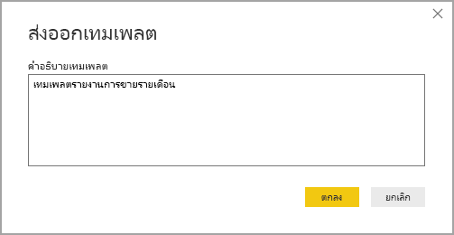
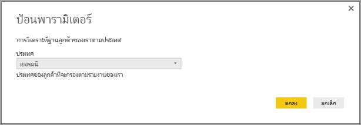

# การใช้เทมเพลตใน Power BI Desktop

ด้วย **Power BI Desktop** คุณสามารถสร้างรายงานที่น่าสนใจซึ่งแบ่งปันข้อมูลเชิงลึกทั่วทั้งองค์กรของคุณ ด้วย**เทมเพลต** Power BI Desktop คุณสามารถทำให้งานของคุณคล่องตัวขึ้นด้วยการสร้างเทมเพลตรายงานโดยยึดตามเทมเพลตที่มีอยู่ ซึ่งคุณหรือผู้ใช้รายอื่นในองค์กรของคุณสามารถใช้เป็นจุดเริ่มต้นสำหรับโครงร่าง แบบจำลองข้อมูล และคิวรี่ของรายงานใหม่ เทมเพลตใน **Power BI Desktop** ช่วยให้คุณเริ่มต้นได้อย่างรวดเร็วและสร้างมาตรฐานรายงานได้

## การสร้างเทมเพลต

เทมเพลตรายงาน Power BI ประกอบด้วยข้อมูลต่อไปนี้จากรายงานที่สร้างขึ้น:

* **หน้า**รายงาน ภาพวิชวล และองค์ประกอบวิชวลอื่น ๆ
* **คำนิยามแบบจำลองข้อมูล** รวมถึงสคีมา ความสัมพันธ์ หน่วยวัด และวัตถุคำนิยามแบบจำลองอื่น ๆ
* **คำนิยามคิวรี**ทั้งหมด เช่น คิวรี พารามิเตอร์คิวรี และองค์ประกอบคิวรีอื่นๆ

สิ่งที่*ไม่ได้*รวมอยู่ในเทมเพลตคือข้อมูลของรายงาน 

เทมเพลตของรายงานใช้ไฟล์นามสกุล .PBIT (เปรียบเทียบกับรายงาน Power BI Desktop ซึ่งใช้ไฟล์นามสกุล .PBIX) 

เมื่อต้องการสร้างเทมเพลตรายงาน ให้เลือก**ไฟล์ > ส่งออกแม่ > เทมเพลต Power BI** จากเมนูซึ่งจะแสดงหน้าต่างต่อไปนี้ และแสดงพร้อมท์ให้คุณใส่คำอธิบายสำหรับเทมเพลต ในตัวอย่างนี้ คำอธิบายสำหรับเทมเพลตของเราคือ *เทมเพลตรายงานการขายรายเดือน*

เลือก **ตกลง** และคุณจะได้รับพร้อมท์ให้ระบุตำแหน่งไฟล์เพื่อจัดเก็บไฟล์เทมเพลต .PBIT

และนั่นคือเทมเพลตรายงาน Power BI ของคุณถูกสร้างขึ้นในตำแหน่งไฟล์ที่คุณระบุด้วยนามสกุล .PBIT

> [!NOTE]
> โดยทั่วไปไฟล์เทมเพลตรายงาน Power BI นั้นมีขนาดเล็กกว่ารายงาน Power BI Desktop มากเนื่องจากเทมเพลตจะไม่มีข้อมูลใดเลย มีเพียงแค่คำนิยามรายงานเท่านั้นเอง 

## การใช้เทมเพลต

เมื่อต้องการใช้เทมเพลตรายงาน Power BI เพียงแค่เปิดเทมเพลตใน Power BI Desktop และเริ่มต้นใช้งาน คุณสามารถเปิดเทมเพลรายงาน Power BI ได้สองวิธี:

* ดับเบิลคลิกที่ไฟล์ .PBIT ใดก็ตามเพื่อเรียกใช้ Power BI Desktop โดยอัตโนมัติและโหลดเทมเพลต
* เลือก **ไฟล์ > นำเข้า > เทมเพลต Power BI** จากภายใน Power BI Desktop

เมื่อคุณเปิดเทมเพลตรายงาน กล้องโต้ตอบจะปรากฏค่าสำหรับพารามิเตอร์ใดก็ตามที่กำหนดไว้ในรายงานที่มีการใช้เทมเพลต ตัวอย่างเช่น หากรายงานวิเคราะห์ลูกค้ายึดตามประเทศหรือภูมิภาคและมีพารามิเตอร์ *ประเทศ* เพื่อระบุฐานลูกค้า พร้อมท์จะปรากฏข้อความแจ้งให้คุณเลือกค่า *ประเทศ* จากรายการค่าที่ระบุเมื่อกำหนดพารามิเตอร์ 

เมื่อมีการระบุพารามิเตอร์ที่จำเป็นแล้ว คุณจะได้รับพร้อมท์ให้ระบุตำแหน่งของข้อมูลพื้นฐานที่เกี่ยวข้องกับรายงาน หลังจากนั้นผู้สร้างรายงานปัจจุบันสามารถเชื่อมต่อกับข้อมูลตามข้อมูลประจำตัวของพวกเขาได้

เมื่อมีการระบุพารามิเตอร์และข้อมูลแล้ว รายงานจะถูกสร้างขึ้นซึ่งประกอบด้วยหน้า วิชวล วัตถุแบบจำลองข้อมูล และคิวรีทั้งหมดที่เป็นส่วนหนึ่งของรายงานที่มีการใช้เทมเพลต 

เท่านี้ก็เรียบร้อย การสร้างและการใช้เทมเพลตรายงานใน Power BI Desktop นั้นง่ายดาย ช่วยให้คุณสร้างเค้าโครงที่น่าสนใจและลักษณะอื่นของรายงาน และแบ่งปันกับผู้อื่นได้อย่างง่ายดาย

## ขั้นตอนถัดไป
มีมากมายหลากหลายสิ่งที่คุณสามารถทำได้ด้วย Power BI Desktop สำหรับข้อมูลเพิ่มเติมเกี่ยวกับขีดความสามารถ กรุณาดูแหล่งทรัพยากรต่อไปนี้:

* [Power BI Desktop คืออะไร](desktop-what-is-desktop.md)
* [ภาพรวมคิวรี่กับ Power BI Desktop](desktop-query-overview.md)
* [ชนิดข้อมูลใน Power BI Desktop](desktop-data-types.md)
* [จัดรูปทรง และรวมข้อมูลด้วย Power BI Desktop](desktop-shape-and-combine-data.md)
* [งานคิวรี่ที่ใช้บ่อยใน Power BI Desktop](desktop-common-query-tasks.md)    
