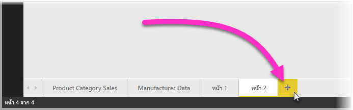
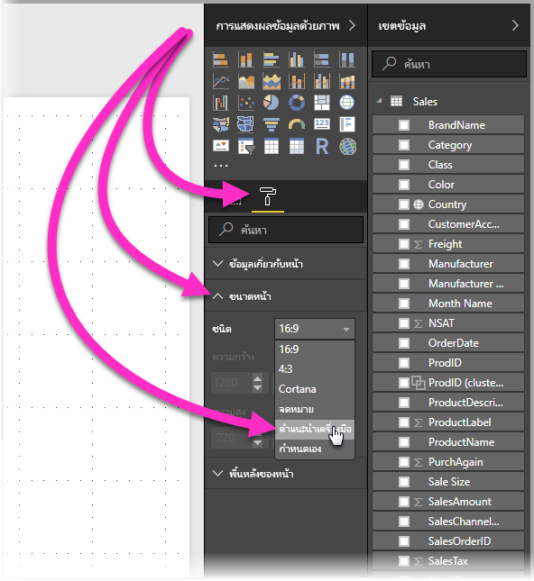
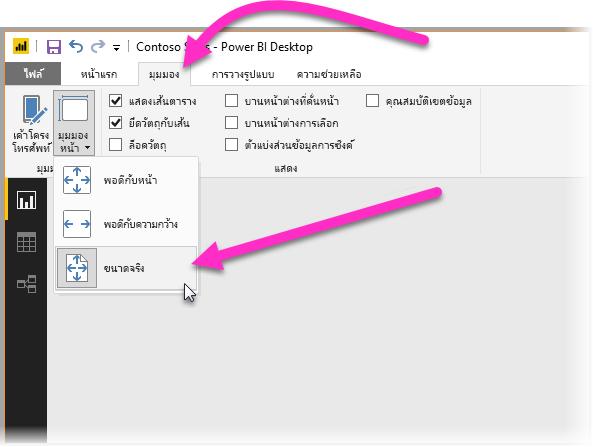
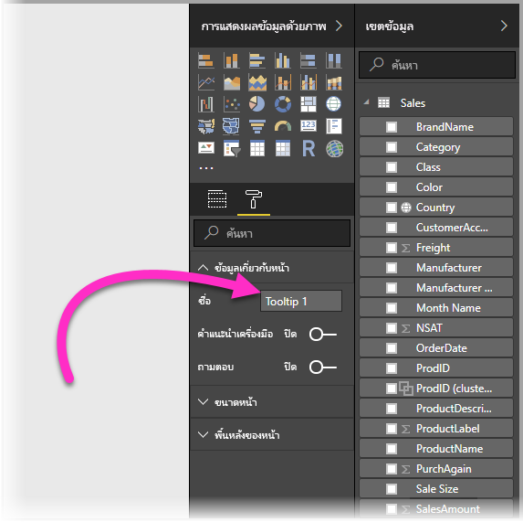
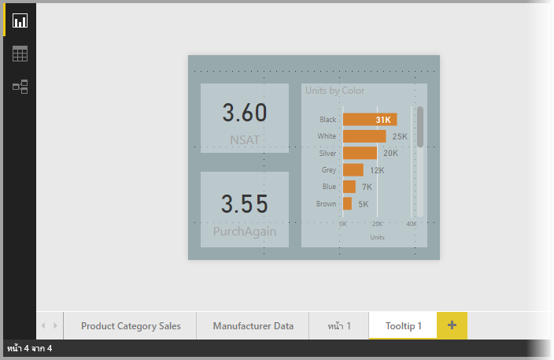
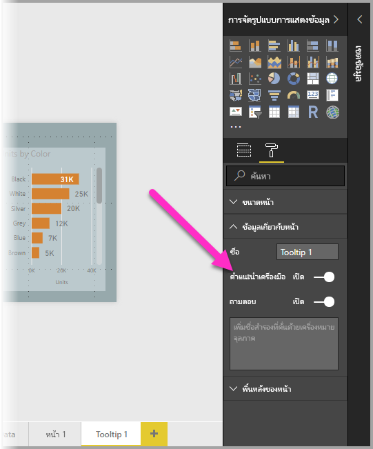
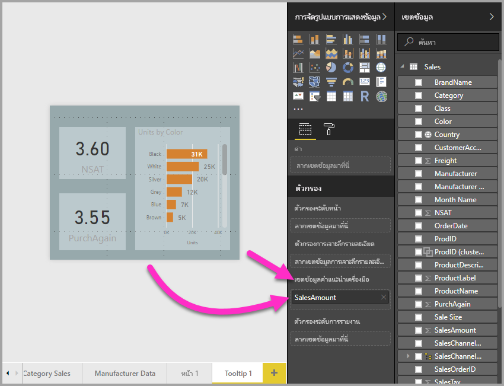
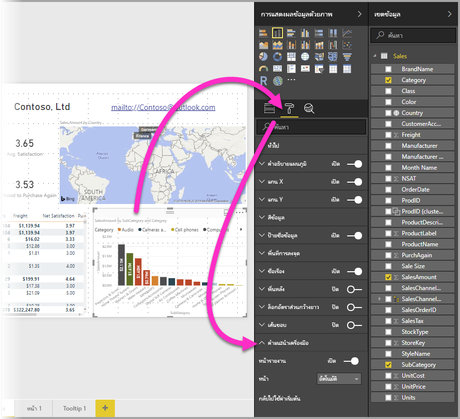
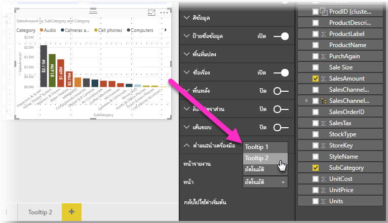
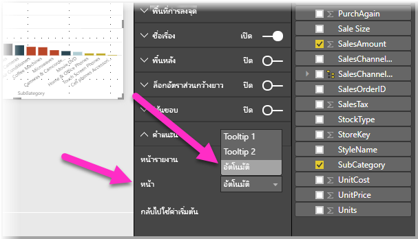

# สร้างคำแนะนำเครื่องมือของหน้ารายงานใน Power BI Desktop (ตัวอย่าง)
คุณสามารถสร้าง**คำแนะนำเครื่องมือรายงาน**ที่สวยงาม ที่ปรากฏเมื่อคุณโฮเวอร์เหนือวิชวล จากหน้ารายงานที่คุณสร้างใน **Power BI Desktop** ได้ โดยการสร้างหน้ารายงานที่เป็นคำแนะนำเครื่องมือของคุณ คำแนะนำเครื่องมือแบบกำหนดเองของคุณสามารถรวม วิชวล รูปภาพ และคอลเลกชันของรายการใด ๆ ที่คุณสร้างไว้ในหน้ารายงาน 

คุณสามารถสร้างหน้าคำแนะนำเครื่องมือต่าง ๆ ได้มากเท่าที่คุณต้องการ คำแนะนำเครื่องมือแต่ละหน้า สามารถเชื่อมโยงกับหนึ่งหรือหลายเขตข้อมูลในรายงานของคุณ ดังนั้น เมื่อคุณโฮเวอร์เหนือวิชวลที่มีเขตข้อมูลที่เลือก คำแนะนำเครื่องมือที่คุณสร้างขึ้นจะปรากฏ เมื่อคุณโฮเวอร์เหนือวิชวลนั้น โดยกรองตามจุดข้อมูลที่เมาส์ของคุณกำลังโฮเวอร์อยู่ 

มีหลายสิ่งน่าสนใจ ที่คุณสามารถทำได้ด้วยคำแนะนำเครื่องมือรายงาน ลองมาดูวิธีการสร้างคำแนะนำเครื่องมือ และสิ่งที่คุณต้องทำเพื่อกำหนดค่าเหล่านั้น

### เปิดใช้งานตัวอย่าง การแสดงคำแนะนำเครื่องมือ 
เนื่องจากคำแนะนำเครื่องมือรายงาน ยังอยู่ในตัวอย่าง ก่อนที่คุณสามารถสร้างคำแนะนำเครื่องมือรายงาน คุณต้องเปิดใช้งานก่อน เพื่อเปิดใช้งานคุณลักษณะตัวอย่าง คำแนะนำเครื่องมือรายงาน เลือก**ไฟล์ > ตัวเลือกและการตั้งค่า > ตัวเลือก > คุณลักษณะตัวอย่าง**ใน Power BI Desktop แล้วเลือกกล่องกาเครื่องหมายข้าง**คำแนะนำเครื่องมือของหน้ารายงาน** 

คุณจะต้องรีสตาร์ท **Power BI Desktop** หลังจากที่คุณทำการเลือกเพื่อเปิดใช้งานเวอร์ชันตัวอย่างของ คำแนะนำเครื่องมือรายงานแล้ว

## สร้างหน้าคำแนะนำเครื่องมือรายงาน
เพื่อเริ่มต้นใช้งาน สร้างหน้ารายงานใหม่ โดยการคลิกที่ปุ่ม **+** ที่อยู่ด้านล่างของพื้นที่ทำงาน **Power BI Desktop** บริเวณแท็บหน้า ปุ่มอยู่ข้างถัดจากหน้าสุดท้ายของรายงาน 

คำแนะนำเครื่องมือของคุณสามารถมีขนาดใดก็ได้ แต่เนื่องจากคำแนะนำเครื่องมือจะโฮเวอร์เหนือพื้นที่ทำงาน ดังนั้นคุณอาจต้องการให้มีขนาดค่อนข้างเล็ก ในบานหน้าต่าง**รูปแบบ** ในการ์ด**ขนาดหน้า** คุณสามารถเห็นขนาดหน้าใหม่ที่เรียกว่า*คำแนะนำเครื่องมือ* ซึ่งทำให้ขนาดของหน้ารายงาน เหมาะกับคำแนะนำเครื่องมือของคุณ

ตามค่าเริ่มต้น **Power BI Desktop** จะปรับให้พื้นที่ทำงานเท่ากับพื้นที่ทั้งหมดบนหน้า ซึ่งมักเป็นสิ่งที่ดี แต่ไม่ใช่ในกรณีของคำแนะนำเครื่องมือ เพื่อให้เข้าใจได้ดีขึ้นว่า คำแนะนำเครื่องมือของคุณจะมีหน้าตาเป็นอย่างไรเมื่อเสร็จแล้ว คุณสามารถเปลี่ยน**มุมมองหน้า**เป็นขนาดจริงได้ 

เมื่อต้องการทำเช่นนั้น เลือกแท็บ**มุมมอง**จาก ribbon จากที่นั่น เลือก**มุมมองหน้า > ขนาดจริง** ดังแสดงในรูปต่อไปนี้

คุณยังสามารถตั้งชื่อหน้ารายงาน เพื่อให้เห็นจุดประสงค์ที่ชัดเจน เพียงเลือกการ์ด**ข้อมูลเกี่ยวกับหน้า**ในบานหน้าต่าง**รูปแบบ** แล้วพิมพ์ชื่อลงในเขตข้อมูล**ชื่อ**ที่คุณพบที่นั่น ในรูปต่อไปนี้ ชื่อรายงานคำแนะนำเครื่องมือคือ *Tooltip 1* แต่คุณสามารถตั้งชื่ออื่นที่สร้างแรงบันดาลใจยิ่งขึ้นได้

จากนั้น คุณสามารถสร้างวิชวลใดก็ตาม ที่คุณต้องการให้แสดงในคำแนะนำเครื่องมือของคุณ ในรูปต่อไปนี้ มีการ์ดสองใบ และมีแผนภูมิแท่งแบบกลุ่มหนึ่งแผนภูมิ บนหน้าคำแนะนำเครื่องมือ พร้อมกับสีพื้นหลังของหน้า และพื้นหลังของแต่ละวิชวล เพื่อให้ได้หน้าที่มีลักษณะที่เราต้องการ

ยังมีอีกหลายขั้นตอนที่ต้องทำ เพื่อให้คำแนะนำเครื่องมือของหน้ารายงานของคุณ พร้อมทำงานเป็นคำแนะนำเครื่องมือ คุณจำเป็นต้องกำหนดค่าหน้าคำแนะนำเครื่องมือ ซึ่งทำได้สองสามวิธี ตามที่จะอธิบายในส่วนถัดไป 

## กำหนดค่าหน้ารายงานคำแนะนำเครื่องมือ

เมื่อคุณสร้างหน้ารายงานคำแนะนำเครื่องมือแล้ว คุณจำเป็นต้องกำหนดค่าหน้า เพื่อให้ **Power BI Desktop** ลงทะเบียนเป็นคำแนะนำเครื่องมือ และให้แน่ใจว่าจะปรากฏขึ้นเหนือวิชวลที่ถูกต้อง

เริ่มต้นจาก คุณจำเป็นต้องเลื่อนแถบเลื่อน**คำแนะนำเครื่องมือ**ให้เป็น**เปิด** ในการ์ด**ข้อมูลเกี่ยวกับหน้า** เพื่อทำให้หน้าเป็นคำแนะนำเครื่องมือ 

เมื่อแถบเลื่อนถูกตั้งค่าเป็นเปิด คุณต้องระบุเขตข้อมูลที่คุณต้องการให้คำแนะนำเครื่องมือรายงานปรากฏขึ้น สำหรับวิชวลในรายงานที่มีเขตข้อมูลที่คุณระบุ คำแนะนำจะปรากฏขึ้น คุณระบุหนึ่งหรือหลายเขตข้อมูลที่จะใช้ โดยการลากเขตข้อมูลลงในบักเก็ต**เขตข้อมูลคำแนะนำเครื่องมือ** ที่พบในส่วน**เขตข้อมูล**ของบานหน้าต่าง**การจัดรูปแบบการแสดงข้อมูล** ในรูปต่อไปนี้ เขตข้อมูล *SalesAmount* ได้ถูกลากลงในบักเก็ต**เขตข้อมูลคำแนะนำเครื่องมือ**

 
คุณสามารถใส่เขตข้อมูล ทั้งที่เป็นประเภทหรือเป็นตัวเลข ในบักเก็ต**เขตข้อมูลคำแนะนำเครื่องมือ** รวมถึงหน่วยวัดได้

เมื่อเสร็จเรียบร้อย หน้ารายงานคำแนะนำเครื่องมือที่คุณสร้าง จะถูกใช้เป็นคำแนะนำเครื่องมือในวิชวล ในรายงานที่ใช้เขตข้อมูลที่คุณวางลงในบักเก็ต**เขตข้อมูลคำแนะนำเครื่องมือ** แทนที่จะเป็นคำแนะนำเครื่องมือเริ่มต้นของ Power BI

## การตั้งค่าคำแนะนำเครื่องมือรายงานด้วยตนเอง

นอกจากการสร้างคำแนะนำเครื่องมือที่ปรากฏโดยอัตโนมัติ เมื่อโฮเวอร์เหนือวิชวลที่มีเขตข้อมูลที่ระบุ คุณสามารถตั้งค่าคำแนะนำด้วยตนเองได้ 

วิชวลใด ๆ ที่สนับสนุนคำแนะนำเครื่องมือรายงานในขณะนี้ มีการ์ด**คำแนะนำเครื่องมือ**ในบานหน้าต่าง**การจัดรูปแบบ** 

เพื่อตั้งค่าแนะนำเครื่องมือด้วยตนเอง เลือกวิชวลที่คุณต้องการระบุคำแนะนำเครื่องมือด้วยตนเอง จากนั้นในบานหน้าต่าง**การจัดรูปแบบการแสดงข้อมูล** เลือกส่วน**รูปแบบ** และขยายการ์ด**คำแนะนำเครื่องมือ**

จากนั้น ในแดรอปดาวน์**หน้า** เลือกหน้าคำแนะนำเครื่องมือที่คุณต้องการใช้สำหรับวิชวลที่เลือก สังเกตว่า เฉพาะหน้ารายงานที่มีระบุเป็น**คำแนะนำเครื่องมือ**เท่านั้น ที่จะแสดงขึ้นในกล่องโต้ตอบ

การที่สามารถกำหนดคำแนะนำเครื่องมือได้เอง มีการใช้งานได้หลายอย่าง คุณสามารถตั้งค่าหน้าเปล่าสำหรับคำแนะนำ จึงเป็นการยกเลิกค่าเริ่มต้นคำแนะนำเครื่องมือของ Power BI อีกการใช้งานหนึ่งคือ เมื่อคุณไม่ต้องการคำแนะนำเครื่องมือที่ถูกเลือกอัตโนมัติโดย Power BI ตัวอย่างเช่น ถ้าคุณมีวิชวลที่มีสองเขตข้อมูล และทั้งสองเขตข้อมูลเหล่านั้นมีคำแนะนำเครื่องมือเชื่อมโยงอยู่ Power BI จะเลือกเพียงหนึ่งในนั้นเพื่อแสดง คุณอาจไม่ต้องการอย่างนั้น ดังนั้นคุณสามารถเลือกคำแนะนำเครื่องมือที่จะแสดงด้วยตนเอง

## การเปลี่ยนกลับเป็นค่าเริ่มต้นคำแนะนำเครื่องมือ

ถ้าคุณสร้างคำแนะนำเครื่องมือด้วยตนเองสำหรับวิชวล แต่คุณตัดสินใจที่จะกลับไปใช้คำแนะนำเครื่องมือเริ่มต้นแทน คุณสามารถกลับไปใช้คำแนะนำเครื่องมือเริ่มต้นของ Power BI ได้เสมอ เพื่อทำเช่นนั้น เลือกที่วิชวลและขยายการ์ด**คำแนะนำเครื่องมือ** เพียงเลือก*อัตโนมัติ*จากดรอปดาวน์**หน้า** เพื่อย้อนกลับเป็นค่าเริ่มต้น

## คำแนะนำเครื่องมือรายงานที่กำหนดเอง และแผนภูมิเส้น

มีข้อควรพิจารณาสองสามข้อที่ควรทราบ เมื่อคำแนะนำเครื่องมือรายงานของคุณโต้ตอบกับวิชวลแผนภูมิเส้น และเมื่อวิชวลมีไฮไลต์แบบเชื่อมโยง

### คำแนะนำเครื่องมือรายงานและแผนภูมิเส้น

เมื่อคำแนะนำเครื่องมือรายงานแสดงสำหรับแผนภูมิเส้น มีเพียงคำแนะนำเครื่องมือเดียวเท่านั้นที่จะแสดงสำหรับทุกเส้นในแผนภูมิ ซึ่งเหมือนกับลักษณะคำแนะนำเครื่องมือเริ่มต้นของแผนภูมิเส้น ซึ่งแสดงคำแนะนำเครื่องมือเดียวเท่านั้น 

เนื่องจากเขตข้อมูลในคำอธิบายแผนภูมิ ไม่ได้ส่งผ่านตัวกรองสำหรับคำแนะนำ ในรูปต่อไปนี้ คำแนะนำที่แสดงจะแสดงจำนวนหน่วยทั้งหมดที่ขายได้ในวันวันนั้น ของทั้งสามประเภทรวมกัน ในคำแนะนำเครื่องมือรายงาน (ในตัวอย่างคือ Deluxe, Economy และ Regular) 

### คำแนะนำเครื่องมือและไฮไลต์แบบเชื่อมโยง

เมื่อวิชวลมีการไฮไลต์แบบเชื่อมโยงในรายงาน คำแนะนำเครื่องมือจะแสดงข้อมูลที่ถูกเชื่อมโยงเสมอ แม้ว่าคุณกำลังวางเมาส์ไว้เหนือส่วนที่สีจางของจุดข้อมูล ในรูปต่อไปนี้ เมาส์กำลังโฮเวอร์เหนือส่วนที่สีจางของกราฟแท่ง (ส่วนที่ไม่ถูกไฮไลต์) แต่คำแนะนำเครื่องมือรายงาน ยังคงแสดงข้อมูลสำหรับส่วนที่สีเข้มสำหรับจุดข้อมูลน้ัน (ข้อมูลที่ถูกไฮไลต์)

## ข้อจำกัดและข้อควรพิจารณา
ในรุ่นตัวอย่างนี้ของ**คำแนะนำเครื่องมือ** มีข้อจำกัดและข้อควรพิจารณาสองสามเรื่อง

* คำแนะนำเครื่องมือรายงาน ไม่ได้รับการสนับสนุนเมื่อดูรายงานในแอปสำหรับอุปกรณ์เคลื่อนที่ หรือในสภาพแวดล้อมแบบฝังตัว รวมถึงการเผยแพร่ไปยังเว็บ 
* คำแนะนำเครื่องมือรายงาน ไม่สนับสนุนวิชวลแบบกำหนดเอง 
* คลัสเตอร์ เป็นเขตข้อมูลที่ยังไม่สนับสนุนการแสดงคำแนะนำเครื่องมือรายงานในขณะนี้ 
* เมื่อต้องการเลือกเขตข้อมูลสำหรับแสดงคำแนะนำเครื่องมือรายงาน เมื่อใช้เขตข้อมูลเมื่อเทียบกับประเภท วิชวลที่มีเขตข้อมูลนั้นจะแสดงคำแนะนำที่ระบุเมื่อ ข้อสรุปของเขตข้อมูลที่เลือกตรงกัน 

## ขั้นตอนถัดไป
สำหรับข้อมูลเพิ่มเติมเกี่ยวกับคุณลักษณะที่คล้ายกัน หรือโต้ตอบกับคำแนะนำเครื่องมือรายงาน โปรดดูที่บทความต่อไปนี้:

* [ใช้ drillthrough ใน Power BI Desktop](desktop-drillthrough.md)
* [แสดงไทล์แดชบอร์ดหรือรายงานวิชวลในโหมดโฟกัส](service-focus-mode.md)

