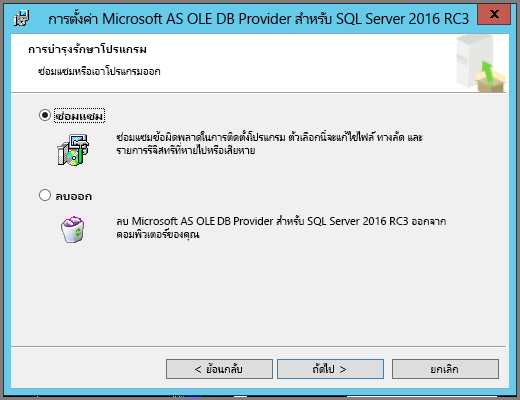
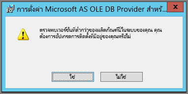

# การแก้ไขปัญหาการวิเคราะห์ใน Excel
อาจมีบางครั้งที่เมื่อคุณใช้การวิเคราะห์ใน Excel คุณได้รับผลลัพธ์ที่ไม่คาดคิดหรือลักษณะการทำงานไม่ทำงานตามที่คุณคาดไว้ หน้านี้มีโซลูชันสำหรับปัญหาทั่วไปเมื่อใช้การวิเคราะห์ใน Excel

> [!NOTE]
> มีอีกหน้าที่มีไว้สำหรับการอธิบายและการเปิดใช้งาน[การวิเคราะห์ใน Excel](service-analyze-in-excel.md) โดยเฉพาะ
> 
> ถ้าคุณพบกับสถานการณ์สมมติที่ไม่ได้แสดงอยู่ในรายการด้านล่างนี้และทำให้เกิดปัญหากับคุณ คุณสามารถขอความช่วยเหลือพิ่่มเติมได้ใน[เว็บไซต์ชุมชน](http://community.powerbi.com/) หรือคุณสามารถสร้าง[ตั๋วสนับสนุน](https://powerbi.microsoft.com/support/)ได้
> 
> 

บทความนี้ประกอบด้วยส่วนการแก้ไขปัญหาต่อไปนี้:

* อัปเดต Excel ไลบรารีสำหรับผู้ให้บริการ OLE DB
* การกำหนดว่าคุณจำเป็นต้องอัปเดต Excel ไลบรารีของคุณหรือไม่
* ข้อผิดพลาดการไม่สามารถเชื่อมต่อได้
* ข้อผิดพลาดการห้ามใช้งาน
* แบบจำลองไม่มีข้อมูล
* ข้อผิดพลาดโทเค็นหมดอายุ
* ไม่สามารถเข้าถึงบริการการวิเคราะห์ภายในองค์กรได้
* ไม่สามารถลากสิ่งใดไปยังพื้นที่ค่า PivotTable ได้ (ไม่มีหน่วยวัด)

## อัปเดต Excel ไลบรารีสำหรับผู้ให้บริการ OLE DB
ในการใช้**การวิเคราะห์ใน Excel** คอมพิวเตอร์ของคุณต้องติดตั้งผู้ให้บริการ AS OLE DB ปัจจุบันก่อน [โพสต์ในชุมชน](http://community.powerbi.com/t5/Service/Analyze-in-Excel-Initialization-of-the-data-source-failed/m-p/30837#M8081)นี้เป็นแหล่งข้อมูลที่ยอดเยี่ยมในการตรวจสอบการติดตั้งผู้ให้บริการ OLE DB ของคุณหรือดาวน์โหลดเวอร์ชันล่าสุด

ไลบรารี Excel จำเป็นต้องตรงกับเวอร์ชันของ Windows ในแง่ของระดับบิต ถ้าคุณได้ติดตั้ง Windows เวอร์ชัน 64 บิต คุณจำเป็นต้องติดตั้งผู้ให้บริการ OLE DB 64-บิต

เมื่อต้องการดาวน์โหลดไลบรารี Excel ล่าสุด โปรดไปที่ Power BI และเลือก**ลูกศรลง**ที่มุมบนขวาของบริการ Power BI แล้วเลือก**อัปเดตการวิเคราะห์ใน Excel**

ในกล่องโต้ตอบที่ปรากฏขึ้น เลือก**ดาวน์โหลด (ตัวอย่าง)**

## การกำหนดว่าคุณจำเป็นต้องอัปเดต Excel ไลบรารีของคุณหรือไม่
คุณสามารถดาวน์โหลดเวอร์ชันล่าสุดของไลบรารีผู้ให้บริการ Excel OLE DB ได้จากลิงก์ในส่วนก่อนหน้านี้ เมื่อคุณดาวน์โหลดไลบรารี OLD DB ที่เหมาะสมแล้วและระบบเริ่มการติดตั้ง จะมีการตรวจสอบเทียบกับเวอร์ชันที่ติดตั้งปัจจุบันของคุณ

ถ้าไลบรารีลูกค้าสำหรับผู้ให้บริการ Excel OLE DB ของคุณมีข้อมูลล่าสุด คุณจะเห็นกล่องโต้ตอบที่มีลักษณะดังต่อไปนี้:

C:\Users\davidi\Desktop\powerbi-content-pr\articles\media\powerbi-desktop-troubleshooting-analyze-in-excel

อีกวิธีหนึ่งคือ ถ้าคุณกำลังติดตั้งเวอร์ชันที่ใหม่กว่าเวอร์ชันบนคอมพิวเตอร์ของคุณ กล่องโต้ตอบต่อไปนี้ปรากฏขึ้น:

ถ้าคุณเห็นกล่องโต้ตอบที่ปรากฏขึ้นให้คุณอัปเกรด คุณควรทำการติดตั้งต่อไปเพื่อให้ได้เวอร์ชันล่าสุดของผู้ให้บริการ OLE DB ติดตั้งในคอมพิวเตอร์ของคุณ

## ข้อผิดพลาดการไม่สามารถเชื่อมต่อได้
สาเหตุหลักของข้อผิดพลาด*การไม่สามารถเชื่อมต่อได้* คือ ไลบรารีลูกค้าของผู้ให้บริการ OLE DB บนคอมพิวเตอร์ของคุณไม่เป็นปัจจุบัน สำหรับข้อมูลเกี่ยวกับวิธีการตรวจสอบการอัปเดตที่ถูกต้อง และสำหรับการดาวน์โหลดลิงก์ ดู**อัปเดตไลบรารี Excel สำหรับผู้ให้บริการ OLE DB**ที่มีอยู่ก่อนหน้านี้ในบทความนี้

## ข้อผิดพลาดการห้ามใช้งาน
ผู้ใช้บางรายมีบัญชี Power BI มากกว่าหนึ่งบัญชี และเมื่อ Excel พยายามเชื่อมต่อกับ Power BI โดยใช้ข้อมูลประจำตัวที่มีอยู่ Excel อาจใช้ข้อมูลประจำตัวที่ไม่สามารถเข้าถึงชุดข้อมูลหรือรายงานที่คุณต้องการเข้าถึงได้

เมื่อเหตุการณ์นี้เกิดขึ้น คุณอาจได้รับข้อผิดพลาดที่ชื่อว่า**ห้ามใช้งาน** ซึ่งหมายความว่า คุณอาจมีการลงชื่อเข้าใช้ Power BI ด้วยข้อมูลประจำตัวที่ไม่มีสิทธิ์สำหรับชุดข้อมูลดังกล่าวได้ หลังจากพบข้อผิดพลาด**ห้ามใช้งาน** เมื่อได้รับข้อความปรากฏให้ใส่ข้อมูลประจำตัวของคุณ ใช้ข้อมูลประจำตัวที่มีสิทธิ์ในการเข้าถึงชุดข้อมูลที่คุณกำลังพยายามเข้าใช้งาน

ถ้าคุณยังคงพบข้อผิดพลาดดังกล่าวอยู่ ลงชื่อเข้าใช้ Power BI ด้วยบัญชีผู้ใช้ที่มีสิทธิ์ และตรวจสอบว่า คุณสามารถดู และเข้าถึงชุดข้อมูลใน Power BI ที่คุณกำลังพยายามเข้าถึงใน Excel ได้หรือไม่

## แบบจำลองไม่มีข้อมูล
ถ้าคุณพบข้อผิดพลาดที่ระบุว่า**ไม่พบแบบจำลองคิวบ์ OLAP** ดังนั้น ชุดข้อมูลที่คุณกำลังพยายามเข้าถึงไม่มีแบบจำลองข้อมูล ดังนั้นจึงไม่สามารถทำการวิเคราะห์ใน Excel ได้

## ข้อผิดพลาดโทเค็นหมดอายุ
ถ้าคุณได้รับข้อผิดพลาด**โทเค็นหมดอายุ** นั่นหมายความว่า คุณไม่ได้ใช้คุณลักษณะ**การวิเคราะห์ใน Excel**บนคอมพิวเตอร์เครื่องที่คุณกำลังใช้อยู่ เพียงแค่ใส่ข้อมูลประจำตัวของคุณอีกครั้งหรือเปิดไฟล์อีกครั้ง ข้อผิดพลาดควรหายไป

## ไม่สามารถเข้าถึงบริการการวิเคราะห์ภายในองค์กรได้
ถ้าคุณกำลังพยายามเข้าถึงชุดข้อมูลที่มีการเชื่อมต่อกับข้อมูล Analysis Services ภายในองค์กร คุณอาจได้รับข้อความข้อผิดพลาดหนึ่ง **การวิเคราะห์ใน Excel**สนับสนุนการเชื่อมต่อกับชุดข้อมูลและรายงาน**Analysis Services**ภายในองค์กรด้วยสตริงการเชื่อมต่อ ตราบใดที่คอมพิวเตอร์ของคุณอยู่บนโดเมนเดียวกันกับเซิร์ฟเวอร์**Analysis Services** และบัญชีของคุณมีสิทธิ์เข้าใช้งานเซิร์ฟเวอร์**Analysis Services** นั้นได้

## ไม่สามารถลากสิ่งใดไปยังพื้นที่ค่า PivotTable ได้ (ไม่มีหน่วยวัด)
เมื่อ**การวิเคราะห์ใน Excel**เชื่อมต่อกับแบบจำลอง OLAP ภายนอก (ซึ่งก็คือวิธีการที่ Excel เชื่อมต่อกับ Power BI), *PivotTable* [จำเป็นต้องใช้**หน่วยวัด**เพื่อการกำหนดในแบบจำลองภายนอก](https://support.microsoft.com/kb/234700) เนื่องจากการคำนวณทั้งหมดดำเนินการบนเซิร์ฟเวอร์ ซึ่งจะแตกต่างกับเมื่อคุณทำงานกับแหล่งข้อมูลภายในเครื่อง (เช่น ตารางใน Excel หรือเมื่อคุณทำงานกับชุดข้อมูลใน **Power BI Desktop** หรือ **บริการ Power BI**) ซึ่งเป็นกรณีที่แบบจำลองแบบตารางพร้อมใช้งานภายในเครื่อง และ[คุณสามารถใช้หน่วยวัดได้](https://msdn.microsoft.com/library/gg399077.aspx) โดยเป็นหน่วยวัดที่สร้างขึ้นแบบไดนามิกและไม่ได้จัดเก็บไว้ในแบบจำลองข้อมูล ในกรณีเหล่านี้ ลักษณะการทำงานใน Excel จะแตกต่างจากลักษณะการทำงานใน**Power BI Desktop**หรือ**บริการ Power BI**: อาจมีคอลัมน์ในข้อมูลดังกล่าวที่สามารถใช้เป็นหน่วยวัดใน Power BI ได้แต่ไม่สามารถใช้เป็นค่า (หน่วยวัด) ใน Excel ได้

เมื่อต้องการแก้ปัญหานี้ คุณมีสองสามตัวเลือก:

1. สร้าง[หน่วยวัดในแบบจำลองข้อมูลของคุณใน**Power BI Desktop**](desktop-tutorial-create-measures.md) จากนั้นเผยแพร่แบบจำลองข้อมูลไปยัง**บริการ Power BI** และเข้าใช้งานชุดข้อมูลที่เผยแพร่ชุดนั้นจาก Excel
2. สร้าง[หน่วยวัดในแบบจำลองข้อมูลของคุณจาก Excel PowerPivot](https://support.office.com/article/Create-a-Measure-in-Power-Pivot-d3cc1495-b4e5-48e7-ba98-163022a71198)
3. ถ้าคุณนำเข้าข้อมูลจากสมุดงาน Excel ที่มีตารางเท่านั้น (และไม่มีแบบจำลองข้อมูล) คุณสามารถ[เพิ่มตารางลงในแบบจำลองข้อมูลได้](https://support.office.com/article/Add-worksheet-data-to-a-Data-Model-using-a-linked-table-d3665fc3-99b0-479d-ba09-a37640f5be42) จากนั้นทำตามขั้นตอนในตัวเลือกที่ 2 ที่อยู่ด้านบนเพื่อสร้างหน่วยวัดในแบบจำลองข้อมูลของคุณ

เมื่อกำหนดหน่วยวัดของคุณในแบบจำลองในบริการ Power BI แล้ว คุณจะสามารถใช้งานได้ในพื้นที่**ค่า**ใน Pivottable ของ Excel ได้

## ขั้นตอนถัดไป
[วิเคราะห์ใน excel](service-analyze-in-excel.md)

[บทช่วยสอน: สร้างหน่วยวัดของคุณเองใน Power BI Desktop](desktop-tutorial-create-measures.md)

[หน่วยวัดใน PowerPivot](https://msdn.microsoft.com/library/gg399077.aspx)

[สร้างหน่วยวัดใน PowerPivot](https://support.office.com/article/Create-a-Measure-in-Power-Pivot-d3cc1495-b4e5-48e7-ba98-163022a71198)

[เพิ่มข้อมูลในแผ่นงานไปยังแบบจำลองข้อมูลโดยใช้ตารางที่เชื่อมโยง](https://support.office.com/article/Add-worksheet-data-to-a-Data-Model-using-a-linked-table-d3665fc3-99b0-479d-ba09-a37640f5be42)

[ความแตกต่างระหว่าง Pivottable ใน Excel แบบ OLAP และแบบไม่ใช่ OLAP](https://support.microsoft.com/kb/234700)

