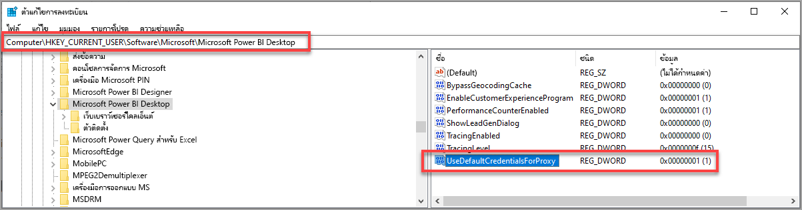

# การแก้ไขปัญหาการลงชื่อเข้าใช้ใน Power BI Desktop
อาจมีเวลาเมื่อคุณพยายามลงชื่อเข้าใช้ **Power BI Desktop** แต่ต้องเผชิญกับพบข้อผิดพลาด มีสาเหตุหลักสองข้อสำหรับปัญหาในการลงชื่อเข้าใช้: **ข้อผิดพลาดการรับรองความถูกต้องพร็อกซี** และ **ข้อผิดพลาดในการเปลี่ยนเส้นทางไม่ใช่ HTTPS URL** 

เมื่อต้องการตรวจสอบปัญหาที่เป็นสาเหตุของปัญหาของคุณลงชื่อเข้าใช้ ขั้นแรกคือ การติดต่อผู้ดูแลระบบของคุณ และส่งข้อมูลการวินิจฉัย เพื่อให้พวกเขาสามารถระบุสาเหตุของปัญหาได้ จากการติดตามปัญหาที่เกี่ยวข้องกับการลงชื่อเข้าใช้ขอบคุณ ผู้ดูแลระบบสามารถตรวจสอบข้อผิดพลาดที่เกิดขึ้นกับคุณได้ 

มาดูที่ปัญหาแต่ละอย่างเหล่านั้นตามลำดับกัน ส่วนท้ายของบทความนี้มีการอภิปรายเกี่ยวกับวิธีการตรวจจับ*การติดตาม*ใน Power BI Desktop ซึ่งจะช่วยคุณติดตามการแก้ไขปัญหาได้

## ข้อผิดพลาดที่จำเป็นต้องมีการรับรองความถูกต้องของพร็อกซี

หน้าจอต่อไปนี้แสดงตัวอย่างของข้อผิดพลาด  *ที่จำเป็นต้องมีการรับรองความถูกต้องของพร็อกซี*

ข้อยกเว้นในไฟล์การติดตามของ *Power BI Desktop* ต่อไปนี้จะเกี่ยวข้องกับข้อผิดพลาดนี้:

* *Microsoft.PowerBI.Client.Windows.Services.PowerBIWebException*
* *HttpStatusCode: ProxyAuthenticationRequired*

เมื่อมีข้อผิดพลาดนี้เกิดขึ้น สาเหตุส่วนใหญ่น่าจะเกิดจากเซิร์ฟเวอร์ที่รับรองความถูกต้องของพร็อกซีบนเครือข่ายของคุณบล็อกการร้องขอจากเว็บที่ออกโดย **Power BI Desktop** 

ถ้าเครือข่ายของคุณใช้เซิร์ฟเวอร์ที่รับรองความถูกต้องของพร็อกซี ผู้ดูแลระบบของคุณสามารถแก้ไขปัญหานี้ โดยเพิ่มโดเมนต่อไปนี้ในรายการอนุญาตบนเซิร์ฟเวอร์ที่รับรองความถูกต้องของพร็อกซี:

* app.powerbi.com
* api.powerbi.com
* โดเมนใน *.analysis.windows.net namespace

สำหรับลูกค้าที่เป็นส่วนหนึ่งของคลาวด์สำหรับรัฐบาล แก้ไขปัญหานี้สามารถทำได้ โดยรายการอนุญาตของโดเมนต่อไปนี้บนเซิร์ฟเวอร์ที่รับรองความถูกต้องของพร็อกซี:

* app.powerbigov.us
* api.powerbigov.us
* โดเมนใน*.analysis.usgovcloudapi.net namespace

## ข้อผิดพลาดการเปลี่ยนเส้นทางที่ไม่ใช่ HTTPS URL ไม่ให้การสนับสนุน

**Power BI Desktop** เวอร์ชันปัจจุบันใช้ไลบรารีการรับรองความถูกต้องของ Active Directory (ADAL) เวอร์ชั่นปัจจุบัน ซึ่งไม่อนุญาตให้มีการเปลี่ยนเส้นทางไปยัง URL (ที่ไม่ใช่ HTTPS) ที่ไม่มีความปลอดภัย 

ข้อยกเว้นในไฟล์การติดตามของ *Power BI Desktop* ต่อไปนี้จะเกี่ยวข้องกับข้อผิดพลาดนี้:

* *Microsoft.IdentityModel.Clients.ActiveDirectory.AdalServiceException: ไม่รองรับข้อผิดพลาดการเปลี่ยนเส้นทางที่ไม่ใช่ HTTPS URL ใน webview*
* *รหัสข้อผิดพลาด: non_https_redirect_failed*

ถ้ามี*รหัสข้อผิดพลาด: non_https_redirect_failed* เกิดขึ้น หมายความว่า หน้าเปลี่ยนเส้นทางหรือผู้ให้บริการในสายการเปลี่ยนเส้นทางอย่างน้อยหนึ่งรายหรือมากกว่าไม่ใช่ปลายทาง HTTPS ที่ได้รับการคุ้มครอง หรือผู้ออกใบรับรองการเปลี่ยนเส้นทางอย่างน้อยหนึ่งเส้นทางหรือมากกว่าไม่ได้อยู่ระหว่างคำ รากที่เชื่อถือได้ของอุปกรณ์ ผู้ให้บริการทั้งหมดในสายการเปลี่ยนเส้นทางใดๆก็ตามต้องมีการเข้าสู่ระบบต้องใช้ HTTPS URL เมื่อต้องการแก้ไขปัญหานี้ ติดต่อผู้ดูแลระบบของคุณและขอให้ใช้ URL ที่มีความปลอดภัยสำหรับไซต์ที่รับรองความถูกต้องของพวกเขา 

## วิธีการรวบรวมการติดตามใน Power BI Desktop

เมื่อต้องการรวบรวมการติดตามใน **Power BI Desktop** ให้ทำตามขั้นตอนต่อไปนี้:

1. เปิดใช้งานการติดตามใน **Power BI Desktop** โดยไปที่ **ไฟล์ > ตัวเลือกและการตั้งค่า > ตัวเลือก** แล้วเลือก **การวินิจฉัย** จากตัวเลือกในบานหน้าต่างด้านซ้าย ในบานหน้าต่างที่ปรากฏขึ้น เลือกที่กล่องที่อยู่ถัดจาก **เปิดใช้งานการติดตาม** ดังที่แสดงในรูปต่อไปนี้ คุณอาจจำเป็นต้องรีสตาร์ต **Power BI Desktop**
   
   

2. แล้วทำตามขั้นตอนที่ทำให้เกิดข้อผิดพลาดอีกครั้ง เมื่อเกิดกรณีเช่นนี้ **Power BI Desktop** จะเพิ่มเหตุการณ์ลงในบันทึกการติดตาม ที่ถูกเก็บอยู่บนคอมพิวเตอร์ภายใน

3. นำทางไปยังโฟลเดอร์ติดตามบนเครื่องคอมพิวเตอร์ของคุณ คุณสามารถค้นหาโฟลเดอร์นั้นได้ โดยเลือกลิงก์ใน **การวินิจฉัย** ที่คุณเปิดใช้งานการติดตาม โดยให้แสดงเป็น *โฟลเดอร์บันทึกข้อมูลความล้มเหลว/การติดตาม*  ในภาพก่อนหน้าได้ บ่อยครั้งที่โฟลเดอร์นี้อาจถูกพบในตำแหน่งที่ตั้งต่อไปนี้ในคอมพิวเตอร์:

    `C:\Users/<user name>/AppData/Local/Microsoft/Power BI Desktop/Traces`

อาจมีไฟล์การติดตามจำนวนมากในโฟลเดอร์นั้น ตรวจสอบให้แน่ใจว่าคุณส่งเฉพาะไฟล์ล่าสุดให้แก่ผู้ดูแลของคุณ เพื่อให้ง่ายต่อการระบุข้อผิดพลาดได้อย่างรวดเร็ว 

## การใช้ข้อมูลประจำตัวของระบบเริ่มต้นสำหรับเว็บพร็อกซี

คำขอทางเว็บที่ออกโดย Power BI Desktop ไม่ได้ใช้ข้อมูลประจำตัวของเว็บพร็อกซี ในเครือข่ายที่ใช้พร็อกซีเซิร์ฟเวอร์ Power BI Desktop อาจไม่สามารถทำการร้องขอทางเว็บได้สำเร็จ 

เริ่มต้นด้วยการเผยแพร่ Power BI Desktop เดือนมีนาคม 2020 ผู้ดูแลระบบหรือผู้ดูแลเครือข่ายสามารถอนุญาตให้ใช้ข้อมูลประจำตัวของระบบค่าเริ่มต้นสำหรับการรับรองความถูกต้องของเว็บพร็อกซี ผู้ดูแลระบบสามารถสร้างรายการการลงทะเบียนที่เรียกว่า **UseDefaultCredentialsForProxy** และตั้งค่าเป็นหนึ่ง (1) เพื่อเปิดใช้งานการใช้ข้อมูลประจำตัวของระบบตามค่าเริ่มต้นสำหรับการรับรองความถูกต้องของเว็บพร็อกซี

รายการการลงทะเบียนสามารถวางไว้ในตำแหน่งต่อไปนี้:

`[HKEY_LOCAL_MACHINE\SOFTWARE\WOW6432Node\Microsoft\Microsoft Power BI Desktop]`
`[HKEY_LOCAL_MACHINE\SOFTWARE\Microsoft\Microsoft Power BI Desktop]`

ไม่จำเป็นต้องมีรายการการลงทะเบียนในทั้งสองตำแหน่ง

เมื่อมีการสร้างรายการการลงทะเบียน (อาจจำเป็นต้องรีบูต) ระบบจะใช้การตั้งค่าพร็อกซีที่ระบุไว้ใน Internet Explorer เมื่อ Power BI Desktop สร้างการร้องขอเว็บ 

เช่นเดียวกับการเปลี่ยนแปลงใด ๆ กับพร็อกซีหรือการตั้งค่าข้อมูลประจำตัว มีผลกระทบด้านความปลอดภัยในการสร้างรายการการลงทะเบียนนี้ ดังนั้นผู้ดูแลระบบต้องตรวจสอบให้แน่ใจว่าตนเองได้กำหนดค่าพร็อกซี Internet Explorer อย่างถูกต้องแล้วก่อนที่จะเปิดใช้งานคุณลักษณะนี้         

### ขีดจำกัดและข้อควรพิจารณาสำหรับการใช้ข้อมูลประจำตัวของระบบตามค่าเริ่มต้น

มีชุดของผลกระทบด้านความปลอดภัยที่ผู้ดูแลระบบควรพิจารณาก่อนเปิดใช้งานความสามารถนี้ 

ควรทำตามคำแนะนำต่อไปนี้เมื่อใดก็ตามที่เปิดใช้งานคุณลักษณะนี้สำหรับไคลเอ็นต์:

* ใช้**การเจรจาต่อรอง**เป็นแบบแผนในการตรวจสอบความถูกต้องบนพร็อกซีเซิร์ฟเวอร์เท่านั้น เพื่อให้แน่ใจว่าไคลเอ็นต์ใช้งานเฉพาะพร็อกซีเซิร์ฟเวอร์ที่เข้าร่วมกับเครือข่าย Active Directory 
* อย่าใช้ **การแสดงแทน NTLM** บนไคลเอ็นต์ที่ใช้คุณลักษณะนี้
* หากผู้ใช้ไม่ได้อยู่ในเครือข่ายที่มีพร็อกซีเมื่อเปิดใช้งานและกำหนดค่าคุณลักษณะนี้ตามที่แนะนำในส่วนนี้ จะไม่มีการใช้งานกระบวนการติดต่อพร็อกซีเซิร์ฟเวอร์และการใช้ข้อมูลประจำตัวของระบบตามค่าเริ่มต้น

[การใช้ข้อมูลประจำตัวของระบบตามค่าเริ่มต้นสำหรับเว็บพร็อกซี](#using-default-system-credentials-for-web-proxy)

